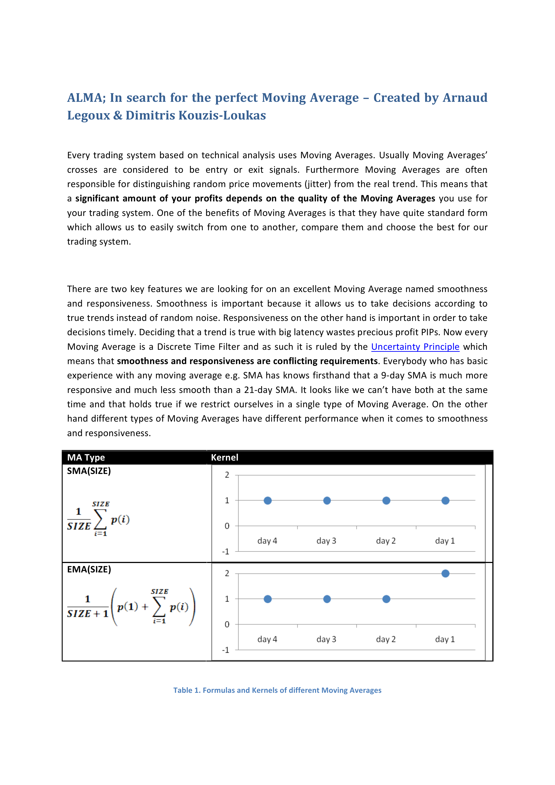
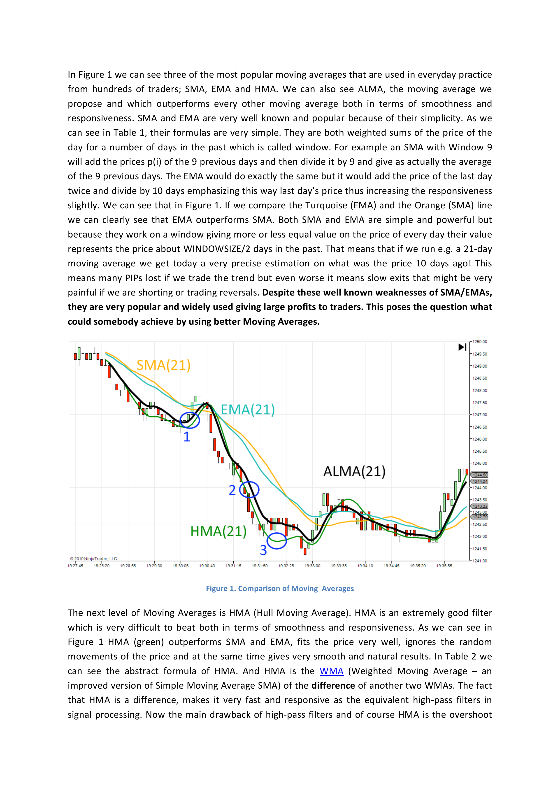
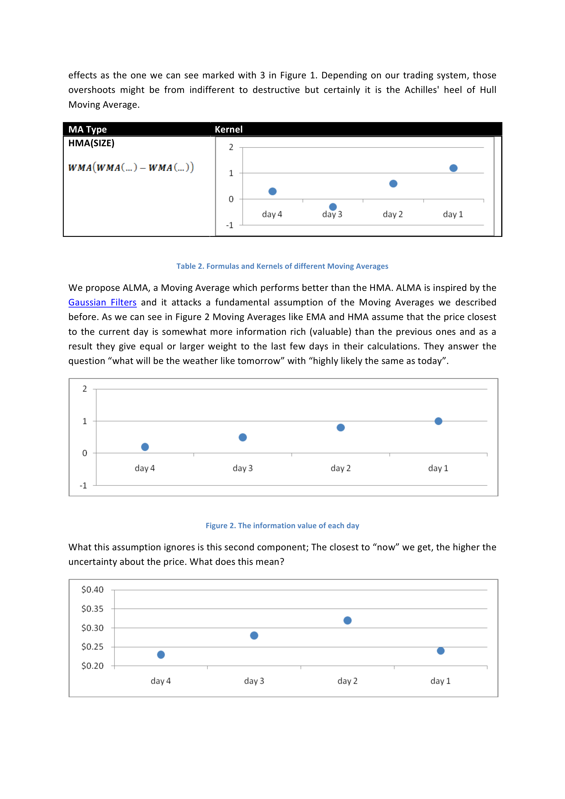
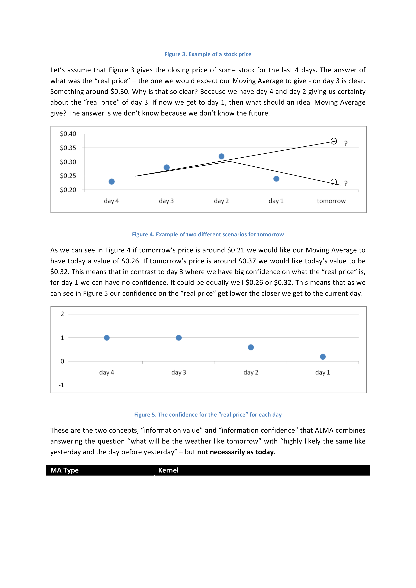

# ALMA — Arnaud Legoux Moving Average

**Authors:** Arnaud Legoux & Dimitrios Kouzis-Loukas  
**Date:** November 24, 2009  
**Copyright:** Arnaud Legoux / Dimitrios Kouzis Loukas

---

## ALMA: In Search for the Perfect Moving Average

Every trading system based on technical analysis uses Moving Averages. Usually Moving Averages' crosses are considered to be entry or exit signals. Furthermore Moving Averages are often responsible for distinguishing random price movements (jitter) from the real trend. This means that *a significant amount of your profits depends on the quality of the Moving Averages* you use for your trading system. One of the benefits of Moving Averages is that they have quite standard form which allows us to easily switch from one to another, compare them and choose the best for our trading system.

There are two key features we are looking for on an excellent Moving Average named **smoothness** and **responsiveness**. Smoothness is important because it allows us to take decisions according to true trends instead of random noise. Responsiveness on the other hand is important in order to take decisions timely. Deciding that a trend is true with big latency wastes precious profit PIPs. Now every Moving Average is a Discrete Time Filter and as such it is ruled by the Uncertainty Principle which means that *smoothness and responsiveness are conflicting requirements*. Everybody who has basic experience with any moving average e.g. SMA knows firsthand that a 9-day SMA is much more responsive and much less smooth than a 21-day SMA. It looks like we can't have both at the same time and that holds true if we restrict ourselves in a single type of Moving Average. On the other hand different types of Moving Averages have different performance when it comes to smoothness and responsiveness.

### Table 1. Formulas and Kernels of different Moving Averages

| MA Type | Formula |
|---------|---------|
| SMA(SIZE) | $\frac{1}{\text{size}} \sum_{i=1}^{\text{size}} p(i)$ |
| EMA(SIZE) | $\frac{2}{\text{size}+1} \sum_{i=1}^{\text{size}} \left(\frac{\text{size}-1}{\text{size}+1}\right)^{i-1} p(i)$ |

<!-- Kernel diagrams for SMA and EMA are embedded in the page image above -->

In Figure 1 we can see three of the most popular moving averages that are used in everyday practice from hundreds of traders: SMA, EMA and HMA. We can also see ALMA, the moving average we propose and which outperforms every other moving average both in terms of smoothness and responsiveness. SMA and EMA are very well known and popular because of their simplicity. As we can see in Table 1, their formulas are very simple. They are both weighted sums of the price of the day for a number of days in the past which is called window. For example an SMA with Window 9 will add the prices p(i) of the 9 previous days and then divide it by 9 and give as actually the average of the 9 previous days. The EMA would do exactly the same but it would add the price of the last day twice and divide by 10 days emphasizing this way last day's price thus increasing the responsiveness slightly. We can see that in Figure 1. If we compare the Turquoise (EMA) and the Orange (SMA) line we can clearly see that EMA outperforms SMA. Both SMA and EMA are simple and powerful but because they work on a window giving more or less equal value on the price of every day their value represents the price about WINDOWSIZE/2 days in the past. That means that if we run e.g. a 21-day moving average we get today a very precise estimation on what was the price 10 days ago! This means many PIPs lost if we trade the trend but even worse it means slow exits that might be very painful if we are shorting or trading reversals. *Despite these well known weaknesses of SMA/EMAs, they are very popular and widely used giving large profits to traders. This poses the question what could somebody achieve by using better Moving Averages.*

The next level of Moving Averages is HMA (Hull Moving Average). HMA is an extremely good filter which is very difficult to beat both in terms of smoothness and responsiveness. As we can see in Figure 1 HMA (green) outperforms SMA and EMA, fits the price very well, ignores the random movements of the price and at the same time gives very smooth and natural results. In Table 2 we can see the abstract formula of HMA. And HMA is the WMA (Weighted Moving Average — an improved version of Simple Moving Average SMA) of the difference of another two WMAs. The fact that HMA is a difference, makes it very fast and responsive as the equivalent high-pass filters in signal processing. Now the main drawback of high-pass filters and of course HMA is the overshoot effects as the one we can see marked with **3** in Figure 1. Depending on our trading system, those overshoots might be from indifferent to destructive but certainly it is the Achilles' heel of Hull Moving Average.

### Table 2. Formulas and Kernels of different Moving Averages

| MA Type | Formula |
|---------|---------|
| HMA(SIZE) | WMA(WMA(...) − WMA(...)) |

We propose ALMA, a Moving Average which performs better than the HMA. ALMA is inspired by the Gaussian Filters and it attacks a fundamental assumption of the Moving Averages we described before. As we can see in Figure 2 Moving Averages like EMA and HMA assume that the price closest to the current day is somewhat more information rich (valuable) than the previous ones and as a result they give equal or larger weight to the last few days in their calculations. They answer the question "what will be the weather like tomorrow" with "highly likely the same as today".

What this assumption ignores is this second component: The closest to "now" we get, the higher the uncertainty about the price. What does this mean?

Let's assume that Figure 3 gives the closing price of some stock for the last 4 days. The answer of what was the "real price" — the one we would expect our Moving Average to give — on day 3 is clear. Something around $0.30. Why is that so clear? Because we have day 4 and day 2 giving us certainty about the "real price" of day 3. If now we get to day 1, then what should an ideal Moving Average give? The answer is we don't know because we don't know the future.

As we can see in Figure 4 if tomorrow's price is around $0.21 we would like our Moving Average to have today a value of $0.26. If tomorrow's price is around $0.37 we would like today's value to be $0.32. This means that in contrast to day 3 where we have big confidence on what the "real price" is, for day 1 we can have no confidence. It could be equally well $0.26 or $0.32. This means that as we can see in Figure 5 our confidence on the "real price" gets lower the closer we get to the current day.

These are the two concepts, **"information value"** and **"information confidence"** that ALMA combines answering the question "what will be the weather like tomorrow" with "highly likely the same like yesterday and the day before yesterday" — but not necessarily as today.

### Table 3. Formulas and Kernels of different Moving Averages

| MA Type | Formula |
|---------|---------|
| ALMA(SIZE, σ, offset) | Gaussian-weighted moving average with adjustable offset |

The formula of ALMA can be seen in Table 3. It uses a **Gaussian distribution shifted with an offset** so that it's not evenly centered on the window but biased towards the more recent days. The offset is adjustable so we can tradeoff smoothness and responsiveness. The second parameter is the **sigma (σ) parameter** which changes the shape of the filter making it more wide (larger sigma) or more focused (smaller sigma). The default value of **6** (inspired from the Six Sigma processes) gives quite good performance.

As we can see in Figure 1 there are some cases (e.g. the one marked with **2**) that ALMA seems to have bigger lag than HMA. On the other hand where it really matters (e.g. in the case marked with **1**) ALMA responds much better. Most importantly ALMA doesn't involve any calculations with differences of prices which means that it doesn't have any of the overshoot effects of HMA (see case marked with **3**). *In other words compared to HMA ALMA gives the same responsiveness, the same or better smoothness and no side effects!* This makes it a significant contribution in the family of Moving Averages and allows a properly tested trading system to profit even in markets with very tight margins.
