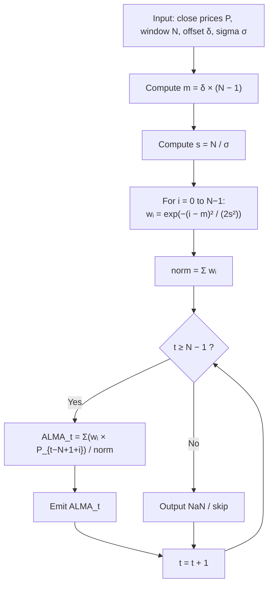

# ALMA — Arnaud Legoux Moving Average

**Authors:** Arnaud Legoux, Dimitrios Kouzis-Loukas, Anthony Cascino
**Date:** November 24, 2009 (whitepaper)
**Category:** Overlap / Moving Average

---

## Overview

The Arnaud Legoux Moving Average (ALMA) is a Gaussian-weighted moving average that reduces lag while maintaining smoothness. Unlike SMA/EMA (which weight recent bars equally or exponentially) or HMA (which uses WMA differences and suffers from overshoot), ALMA applies a Gaussian bell curve as its kernel, shifted toward recent bars via an adjustable offset parameter.

The key insight is that the most recent bar carries high information value but low information confidence (we don't yet know tomorrow's price to confirm today's trend). ALMA's offset-shifted Gaussian captures this tradeoff: it peaks slightly behind the current bar, giving maximum weight to recent-but-confirmed prices.

## Parameters

| Parameter | Symbol | Default | Range | Description |
|-----------|--------|---------|-------|-------------|
| Window size | $N$ | 9 | 1–50 (odd, per original) | Number of bars in the lookback window |
| Offset | $\delta$ | 0.85 | 0.0–1.0 | Shifts the Gaussian peak. 0 = centered (like SMA), 1 = peaked at newest bar |
| Sigma | $\sigma$ | 6.0 | 0.01–50.0 | Controls Gaussian width. Larger = wider/smoother, smaller = narrower/sharper |

## Formula

### Step 1 — Compute Gaussian weights

The peak position $m$ and scale $s$ are derived from the parameters:

$$m = \lfloor \delta \cdot (N - 1) \rfloor$$

$$s = \frac{N}{\sigma}$$

The weight for index $i \in [0, N-1]$ is:

$$w_i = \exp\!\left(-\frac{(i - m)^2}{2\,s^2}\right)$$

### Step 2 — Compute weighted average

For bar $t$ (with at least $N$ bars available), the ALMA value is:

$$\text{ALMA}_t = \frac{\displaystyle\sum_{i=0}^{N-1} w_i \cdot P_{t - N + 1 + i}}{\displaystyle\sum_{i=0}^{N-1} w_i}$$

where $P_{t-N+1+i}$ maps index $i=0$ to the **oldest** bar in the window and $i=N-1$ to the **newest** (current) bar. With $\delta > 0.5$, the Gaussian peak falls near the newest bars, biasing ALMA toward recent prices while still incorporating the confirming context of slightly older bars.

## Computation Flowchart



## Weight Application Convention

The original NinjaTrader implementation by the authors applies weights as follows:

- `weight[i]` multiplied by `Close[windowSize - 1 - i]` (NinjaTrader's `Close[k]` counts backward from current bar)
- This means `weight[0]` → oldest bar, `weight[N-1]` → newest bar
- With offset = 0.85 and N = 9, peak weight is at index $\lfloor 0.85 \times 8 \rfloor = 6$, which is the 7th bar (near the newest end)

**Bug in community implementations:** Both pandas_ta and bbgo (c9s) reverse this mapping — they apply `weight[j]` to `close[t - j]` (newest first), which means the Gaussian peak falls on *older* bars instead of newer ones. The effect is equivalent to using `offset = 1 - offset` compared to the original. This does not affect the symmetric case (offset = 0.5) but produces different results for all other offset values.

| Implementation | Convention | `weight[peak]` applies to | Correct? |
|---------------|------------|--------------------------|----------|
| NinjaTrader (original) | `w[i] × Close[N-1-i]` | Recent bars (for offset > 0.5) | Yes |
| TradingView `ta.alma()` | Same as NinjaTrader | Recent bars | Yes |
| QuantConnect/Lean | Same as NinjaTrader | Recent bars | Yes |
| pandas_ta | `w[j] × close[t-j]` | Older bars (reversed) | No |
| bbgo (c9s) | `w[N-1-i] × input[i]` | Older bars (reversed) | No |

## pandas_ta Additional Bug

Line 37 of `alma_pandas_ta.py` contains:

```python
result.append(npNaN) if i == length else result.append(almean)
```

This inserts a NaN at index `i == length` (the second computed bar) instead of the calculated ALMA value, dropping one valid data point.

## Sources

- Legoux, A., Kouzis-Loukas, D., & Cascino, A. (2009). *ALMA — Arnaud Legoux Moving Average* [Whitepaper]. arnaudlegoux.com
- NinjaTrader indicator source: released on Legoux's website, archived at [Sierra Chart forum](https://www.sierrachart.com/SupportBoard.php?PostID=231318#P231318)
- pandas_ta: [alma.py](https://github.com/oriongin/pandas-ta/blob/main/pandas_ta/overlap/alma.py)
- bbgo: [alma.go](https://github.com/c9s/bbgo/blob/main/pkg/indicator/alma.go)
- DaveSkender/Stock.Indicators: [Alma.cs](https://github.com/DaveSkender/Stock.Indicators/blob/v3/src/a-d/Alma/Alma.cs)
- QuantConnect/Lean: [ArnaudLegouxMovingAverage.cs](https://github.com/QuantConnect/Lean/blob/master/Indicators/ArnaudLegouxMovingAverage.cs)
