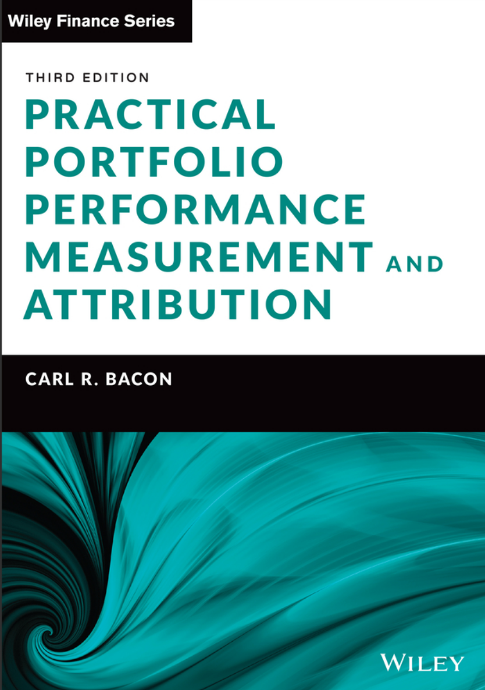

# 5 Risk

- [DEFINITION OF RISK](ch5-01.md#a)
  - [Risk types](ch5-01.md#b)
  - [Risk management versus risk control](ch5-01.md#c)
  - [Risk aversion](ch5-01.md#d)
  - [Ex-post and ex-ante](ch5-01.md#e)
- [Descriptive Statistics](ch5-02.md#a)
  - [Mean (or arithmetic mean)](ch5-02.md#b)
  - [Mean absolute deviation (or mean deviation)](ch5-02.md#c)
  - [Variance](ch5-02.md#d)
  - [Exhibit 5.1 Portfolio mean and variance](ch5-02.md#e)
  - [Bessel's correction (population or sample, n or n – 1)](ch5-02.md#f)
  - [Exhibit 5.2 Benchmark mean and variance](ch5-02.md#g)
  - [Sample variance](ch5-02.md#h)
  - [Standard deviation (variability or volatility)](ch5-02.md#i)
  - [Annualised risk (or time aggregation)](ch5-02.md#j)
  - [The central limit theorem](ch5-02.md#k)
  - [Frequency and number of data points](ch5-02.md#l)
  - [Exhibit 5.3 Standard deviation](ch5-02.md#m)
  - [Normal (or Gaussian) distribution](ch5-02.md#n)
  - [Histograms](ch5-02.md#o)
  - [Skewness (Fisher's or moment skewness)](ch5-02.md#p)
  - [Sample skewness](ch5-02.md#q)
  - [Kurtosis (Pearson's kurtosis)](ch5-02.md#r)
  - [Excess kurtosis (or Fisher's kurtosis)](ch5-02.md#s)
  - [Sample kurtosis](ch5-02.md#t)
  - [Bera-Jarque statistic (or Jarque-Bera)](ch5-02.md#u)
  - [Exhibit 5.4 Skewness, kurtosis and the Bera-Jarque hypothesis test](ch5-02.md#v)
  - [Exhibit 5.5 Benchmark skewness and kurtosis](ch5-02.md#w)
  - [Covariance](ch5-02.md#x)
  - [Sample covariance](ch5-02.md#y)
  - [Correlation ($\rho$)](ch5-02.md#z)
  - [Sample correlation](ch5-02.md#0)
  - [Exhibit 5.6 Covariance and correlation](ch5-02.md#1)
- [Performance Appraisal](ch5-03.md#a)
  - [Sharpe ratio (reward to variability, Sharpe index)](ch5-03.md#b)
  - [Roy ratio](ch5-03.md#c)
  - [Risk-free rate](ch5-03.md#d)
  - [Alternative Sharpe ratio](ch5-03.md#e)
  - [Revised Sharpe ratio](ch5-03.md#f)
  - [Adjusted Sharpe ratio](ch5-03.md#g)
  - [Skew-adjusted Sharpe ratio](ch5-03.md#h)
  - [Exhibit 5.7 Sharpe, alternative, skew-adjusted and adjusted Sharpe ratios](ch5-03.md#i)
  - [Exhibit 5.8 Revised Sharpe ratio](ch5-03.md#j)
  - [Relative Risk](ch5-03.md#k)
  - [Tracking error (or tracking risk, relative risk, active risk)](ch5-03.md#l)
- [RELATIVE RISK](ch5-04.md#a)
  - [Tracking error (or tracking risk, relative risk, active risk)](ch5-04.md#b)
  - [Information ratio](ch5-04.md#c)
  - [Geometric information ratio](ch5-04.md#d)
  - [Exhibit 5.9 Arithmetic and geometric information ratios](ch5-04.md#e)
  - [Modified information ratio](ch5-04.md#f)
- [REGRESSION ANALYSIS](ch5-05.md#a)
  - [Regression equation](ch5-05.md#b)
  - [Regression alpha](ch5-05.md#c)
  - [Regression beta](ch5-05.md#d)
  - [Regression epsilon](ch5-05.md#e)
  - [Exhibit 5.10 Regression alpha and beta](ch5-05.md#f)
  - [Capital asset pricing model (CAPM)](ch5-05.md#g)
  - [Beta ($\beta$) (systematic risk or volatility)](ch5-05.md#h)
  - [Jensen's alpha (Jensen's measure or Jensen's differential return or ex-post alpha)](ch5-05.md#i)
  - [Annualised alpha](ch5-05.md#j)
  - [Exhibit 5.11 CAPM beta and Jensen's alpha](ch5-05.md#k)
  - [Bull beta ($\beta^+$)](ch5-05.md#l)
  - [Bear beta ($\beta^-$)](ch5-05.md#m)
  - [Beta timing ratio](ch5-05.md#n)
  - [Exhibit 5.12 Beta timing ratio](ch5-05.md#o)
  - [Market timing](ch5-05.md#p)
  - [Systematic risk](ch5-05.md#q)
  - [Correlation](ch5-05.md#r)
  - [$R^2$ (or coefficient of determination)](ch5-05.md#s)
  - [Exhibit 5.13 Correlation and $R^2$](ch5-05.md#t)
  - [Specific (or residual) risk](ch5-05.md#u)
  - [Exhibit 5.14 Specific risk, systematic risk and total risk](ch5-05.md#v)
  - [Treynor ratio (reward to volatility)](ch5-05.md#w)
  - [Appraisal ratio (or Treynor-Black ratio)](ch5-05.md#x)
- [FACTOR MODELS](ch5-06.md#a)
  - [Fama decomposition](ch5-06.md#b)
  - [Selectivity](ch5-06.md#c)
  - [Diversification](ch5-06.md#d)
  - [Net selectivity](ch5-06.md#e)
  - [Fama-French three-factor model](ch5-06.md#f)
  - [Three-factor alpha (or Fama-French alpha)](ch5-06.md#g)
  - [Carhart four-factor model](ch5-06.md#h)
  - [Four-factor alpha (or Carhart's alpha)](ch5-06.md#i)
  - [Multi-factor models](ch5-06.md#j)
- [DRAWDOWN](ch5-07.md#a)
  - [Average drawdown](ch5-07.md#b)
  - [Maximum drawdown](ch5-07.md#c)
  - [Largest individual drawdown](ch5-07.md#d)
  - [Recovery time (or drawdown duration)](ch5-07.md#e)
  - [Drawdown deviation](ch5-07.md#f)
  - [Ulcer index](ch5-07.md#g)
  - [Pain index](ch5-07.md#h)
  - [Calmar ratio (or drawdown ratio)](ch5-07.md#i)
  - [MAR ratio](ch5-07.md#j)
  - [Sterling ratio](ch5-07.md#k)
  - [Sterling-Calmar ratio](ch5-07.md#l)
  - [Burke ratio](ch5-07.md#m)
  - [Modified Burke ratio](ch5-07.md#n)
  - [Martin ratio (or ulcer performance index)](ch5-07.md#o)
  - [Pain ratio](ch5-07.md#p)
  - [Exhibit 5.15 — Drawdown (peak-to-trough definition)](ch5-07.md#q)
  - [Exhibit 5.16 — Drawdown (continuous uninterrupted definition)](ch5-07.md#r)
- [Partial Moments](ch5-08.md#a)
  - [Downside risk (or semi-standard deviation)](ch5-08.md#b)
  - [Downside potential](ch5-08.md#c)
  - [Pure downside risk](ch5-08.md#d)
  - [Half variance (or semi-variance)](ch5-08.md#e)
  - [Upside risk (or upside uncertainty)](ch5-08.md#f)
  - [Mean absolute moment](ch5-08.md#g)
  - [Omega ratio ($\Omega$)](ch5-08.md#h)
  - [Bernardo and Ledoit (or gain–loss) ratio](ch5-08.md#i)
  - [Omega–Sharpe ratio](ch5-08.md#j)
  - [Sortino ratio](ch5-08.md#k)
  - [Reward to half-variance](ch5-08.md#l)
  - [Downside-risk Sharpe ratio](ch5-08.md#m)
  - [Sortino–Satchell ratio](ch5-08.md#n)
  - [Upside potential ratio](ch5-08.md#o)
  - [Volatility skewness](ch5-08.md#p)
  - [Variability skewness](ch5-08.md#q)
  - [Exhibit 5.17 — Downside and upside partial moments](ch5-08.md#r)
  - [Farinelli–Tibiletti ratio](ch5-08.md#s)
  - [Prospect ratio](ch5-08.md#t)
- [FIXED INCOME RISK](ch5-09.md#a)
  - [Pricing fixed income instruments](ch5-09.md#b)
  - [Redemption yield (yield to maturity)](ch5-09.md#c)
  - [Weighted average cash flow](ch5-09.md#d)
  - [Duration (effective mean term, discounted mean term or volatility)](ch5-09.md#e)
  - [Macaulay duration](ch5-09.md#f)
  - [Macaulay–Weil duration](ch5-09.md#g)
  - [Modified duration](ch5-09.md#h)
  - [Exhibit 5.18 Duration](ch5-09.md#i)
  - [Portfolio duration](ch5-09.md#j)
  - [Effective duration (or option-adjusted duration)](ch5-09.md#k)
  - [Exhibit 5.19 Effective duration](ch5-09.md#l)
  - [Duration to worst](ch5-09.md#m)
  - [Convexity](ch5-09.md#n)
  - [Modified convexity](ch5-09.md#o)
  - [Effective convexity](ch5-09.md#p)
  - [Exhibit 5.20 Convexity](ch5-09.md#q)
  - [Portfolio convexity](ch5-09.md#r)
  - [Bond returns](ch5-09.md#s)
  - [Exhibit 5.21 Estimated bond returns](ch5-09.md#t)
  - [Duration beta](ch5-09.md#u)
  - [Reward to duration](ch5-09.md#v)
- [MISCELLANEOUS RISK MEASURES](ch5-10.md#a)
  - [Hurst index (or Hurst exponent)](ch5-10.md#b)
  - [Bias ratio](ch5-10.md#c)
  - [Active share](ch5-10.md#d)
  - [Value at risk (VaR)](ch5-10.md#e)
- [Risk-Adjusted Return](ch5-11.md#a)
  - [$M^2$](ch5-11.md#b)
  - [$M^2$ excess return](ch5-11.md#c)
  - [Differential return](ch5-11.md#d)
  - [Adjusted $M^2$](ch5-11.md#e)
  - [Skew-adjusted $M^2$](ch5-11.md#f)
  - [Exhibit 5.22 $M^2$, skew-adjusted $M^2$ and adjusted $M^2$](ch5-11.md#g)
- [TYPES OF EXCESS RETURN (OR ALPHA)](ch5-12.md#a)
- [A PERIODIC TABLE OF RISK MEASURES](ch5-13.md#a)
  - [Periodic table design](ch5-13.md#b)
  - [Why measure ex-post risk?](ch5-13.md#c)
  - [Which risk measures to use?](ch5-13.md#d)
  - [Hedge funds](ch5-13.md#e)
  - [Smoothing](ch5-13.md#f)
  - [Outliers](ch5-13.md#g)
  - [Data mining](ch5-13.md#h)
  - [Time period](ch5-13.md#i)
  - [Exhibit 5.23 — $t$-statistic](ch5-13.md#j)

