# Seeing the Future: Profiting from the Fascinating Science of Technical Analysis

- **Authors:** Bill Wolfe & Brian Wolfe
- **Copyright:** 2013 Bill Wolfe
- **Source PDF:** [seeingTheFuture.pdf](https://funwiththinkscript.com/wp-content/uploads/2017/03/seeingTheFuture.pdf)

---

## Table of Contents

- Introduction
- What is the Wolfe Wave
- The theory of the Wolfe Wave
- Rules for bullish Wolfe Wave structure
- Rules for bearish Wolfe Wave structure
- Practical application
- Tactical Notes (Mental)
- Tactical Notes (Technical)
- Tactical Notes (Chart Reading)
- Tactical Notes (Miscellaneous)
- Exhibits

---

## Introduction

My Wave methodology is the product of more than forty-years of studying technical analysis. Early on, I had the good fortune of having John Magee of Edward's and Magee fame, introduce me to some excellent books and reliable chart patterns.

One chart pattern that I found to be particularly reliable was the rising wedge. I found that pattern so intriguing that I literally took it apart to see what made it tick. My conclusion was that everything you needed to know was in a trend line. Time and space.

After years of practice, I figured out how to balance time and space (price) so I could predict an Estimated Time of Arrival (ETA) and the Estimated Price at Arrival (EPA). As you will see, perfection is sometimes attained.

After demonstrating this to a good friend and rocket scientist, he nicknamed it the Wolfe Wave. The name stuck. In the book Street Smarts . . . , Market Wizard Linda Raschke refers to a group of us as "Wolfe Wave practitioners."

*-Bill Wolfe*

---

## What is The Wolfe Wave

Simply put, the Wolfe Wave is a natural rhythm that exists in all markets, or all motion for that matter. It is made up of waves of supply and demand that form their own equilibrium.

When I discovered it, I spent the next forty-years defining it, refining it and devising short cuts so that any human could "see" it. The key to its accuracy is in identifying the 1, 2, 3, 4 & 5 points. These are what give it its proper balance or equilibrium. Identifying the proper time frame is also important. As in the oceans of the world, little waves mix with larger waves and so on.

After a bit of practice, just like a surfer at the beach, you will get the hang (no pun intended) of it. It is very important to identify the dominant Wave and then to trade "what if's" within the Wave. It is somewhat like recognizing those 3-D pictures. After a while a smile comes to your face and you say: "Wow, I see it."

---

## The Theory of the Wolfe Wave

The theory of my Wave structure is based on a law of physics that for every action there is an equal and opposite reaction.

This action/reaction often shows a definite rhythm with extremely valuable projecting capabilities to the trained eye. Many times however, little waves mix with larger waves and the waters become muddied. Sometimes everything is in synch and you will get a rogue wave effect similar to what occurs in the oceans of the world. These can be extremely profitable in the futures and stock market.

On the following two pages, you will find the rules and the theoretical, bullish and bearish Wolfe Wave structures.

---

## Bullish Wave

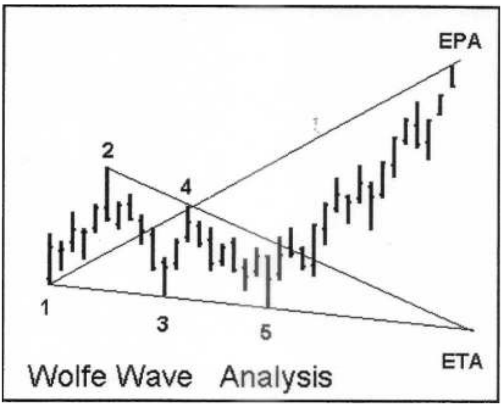

### Rules for Bullish Wolfe Wave Structure

Please note the odd sequence in counting, as you will see, it is necessary for the inductive analysis.

By starting with a top we are assured of beginning our count on a new wave.

The 2 point is a top.

The 3 point is the bottom of the first decline.

The 1 point is the bottom prior to point 2 (top), that 3 has surpassed.

The 4 point is the top of the rally after point 3.

The 5 point is the bottom after point 4 and is likely to exceed the extended trend line of 1 to 3. ***This is the entry point for a ride to the EPA line (1 to 4).***

Estimated Price at Arrival (EPA) is trend line of 1 to 4 at apex of extended trend line of 1 to 3 and extended trend line of 2 to 4.

Estimated Time of Arrival (ETA) is apex of extended trend line of 1 to 3 and 2 to 4.

Trend line of 1 to 3 and trend line of 2 to 4 must converge.

---

## Bearish Wave

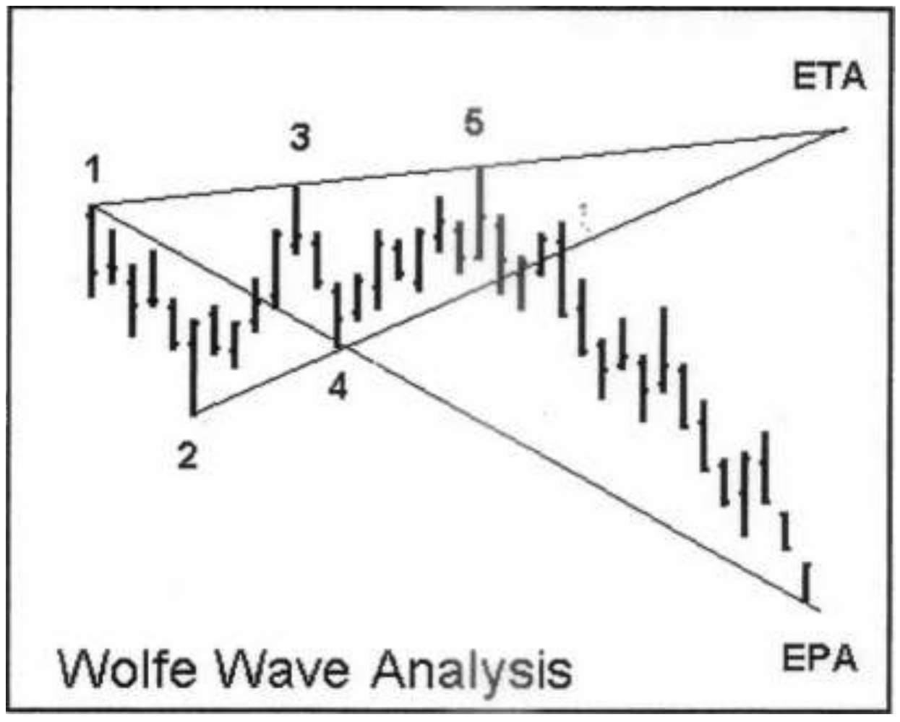

### Rules for Bearish Wolfe Wave Structure

Please note the odd sequence in counting, as you will see, it is necessary for the inductive analysis.

By starting with a bottom we are assured of beginning our count on a new wave.

The 2 point is a bottom.

The 3 point is the top of the first rally.

The 1 point is the top prior to point 2 (bottom), that 3 has surpassed.

The 4 point is the bottom of the decline after point 3.

The 5 point is the top after the 4 point and is likely to exceed the extended trend line of 1 to 3. ***This is the entry point for a ride to the EPA line (1 to 4).***

Estimated Price at Arrival (EPA) is trend line of 1 to 4 at apex of extended trend line of 1 to 3 and extended trend line of 2 to 4.

Estimated Time of Arrival (ETA) is apex of extended trend line of 1 to 3 and 2 to 4.

Trend line of 1 to 3 and trend line of 2 to 4 must converge.

---

## Practical Application

I feel that the Wolfe Wave is perfection in technical analysis. My belief has always been to shoot for the Moon and then scale back when I have a working model. For me, the ETA and EPA's are like shooting for the Moon. I know that perfection is embedded in the design, but it is much more practical to nail down profits as they come.

I like to get in at the 5 point and plan for a move to the 1 to 4 line but will get out at the first sign of trouble. I also do not count on the ETA as this adds just too many variables to the equation.

In the chart examples we give several that are perfect and several that are not. The perfect examples are to demonstrate that the theory is valid. The examples that are not perfect are to demonstrate that you do not need perfection to make money.

---

## Tactical Notes (Mental)

### Understanding the goals of Wave trading

Wave trading tries to exploit the swings of the market with as little exposure as possible. I view exposure as risk and try to avoid it. The most important thing that you must understand is that you are not a trend follower. Wave trading looks for precise moments to jump in for a fast measured move and then exits to wait for the next Wave to develop. Often I will compare Wave trading to a surfer at the beach looking for a good ride. The two are remarkably similar and you should view charts the same as a surfer views waves. In the beginning only trade well defined Waves. After some experience you will find more and more Waves to ride. Do not bemoan the fact that you are not always in the market. Exposure is risk!

### The tremendous rewards of patience

Many investors will tell you that courage and patience are two of the most important ingredients for successful long term investing. You need the courage to stand by your choices and the patience to ride out the dips in the market. It is very similar for successful trading except that while you still need the courage in your methodology you need the patience to WAIT out the market for the opportune time to strike. As you gain confidence in Wave trading you will see that regardless of market conditions, a tradable Wave soon appears. This patience will be tremendously rewarded, over and over again. Be patient.

### Why the Wolfe Wave is a must for super traders

To be a super trader you must be able to do what others cannot. My Wave methodology has you buying and selling at such opportune areas that it is impossible to duplicate with indicators. Test it for yourself. Find a Wave and then try to match any indicator that you may know of to it. You will soon see why some win and some lose. They cannot do what you can.

### Fading

Try to fade at least half of your trade. By fading I mean buying into a declining market or selling into an advancing market. This usually produces positive slippage which is very rewarding monetarily and mentally.

### Homework

Doing your homework at night. Just like most things, charts look different at night. After the market closes you don't have the distraction of blinking prices and adrenaline rushes. You are able to see the ebb and flow of the Waves just like you would at the beach, and just as enjoyably. Have separate pages setup for the different vehicles that you trade. Get into the habit of anticipating where the next Wave is likely to form. In this way you will be ready when the markets open in the morning. Spontaneous trading is for amateurs and amateurs lose.

### Plan the trade, trade the plan

Many books and particularly the media romanticize trading. They portray successful traders as "gunslingers" with nerves of steel. Men and women that can bet on the toss of a coin and always be right. Nothing can be further from the truth. Successful trading requires that you plan the trade in advance. When you are in the trade you will act naturally because you have already run the trade through, many times in your head. You will have traded the plan. Try to recognize the dominant Wave and then try to anticipate the five turning points.

### Dealing with pressure

Pressure is created by anxiety. The anxiety of not knowing what will be asked of you. The uncertainty that comes with spontaneous trading. This should not be you. Once you have the confidence, through testing, that a methodology has good logical design, then and only then, will you begin to trade with a calmness that is associated with professionals.

### Preparing yourself mentally to enter the "sweet zone"

As many of you may already know, paper trading is not at all like real trading. When you look at a chart and think that a top or bottom would have been a good place to buy or sell, you are in effect paper trading. To pick up the phone and say NOW is another story. Wolfe Wave analysis mentally prepares you for this opportune spot that I call the "Sweet Zone." You will know in advance where it will take place. While others are panicking, you, after you have confidence in this method, will calmly pick up the phone and fade the market. It may look scary, but it only lasts for a short period of time before you have a profit. You will quickly learn why some people win and some people lose. They cannot do what you can.

### Stops

The subject of stops requires that you know thyself. I am not firmly for or against the use of stops. My argument against the use of stops is that they are often used as a crutch and that traders wait until a top or bottom is made before entering a position just so they have an idea where to place a stop. Still, there's no guarantee that the top or bottom will hold. In doing this I feel you are giving away your edge. Wave analysis provides very clear points where a reversal should take place and it's greatly to your advantage to fade when in the appropriate area. My argument for the use of stops is to protect yourself against a blowout. This is very serious stuff when trading commodities. Ideally, I think that you should fade an entry and then place a stop at a dollar value away, to protect yourself. This will give you the benefit of entering when others are panicking while protecting yourself against a big loss. If you know thyself and feel that you may someday freeze, never trade without a stop.

### Turning your record keeping into a happy job

Successful trading brings with it more than just monetary rewards. When you are losing, the brain does not want to open the mail and enter the trades. You start procrastinating. I think psychiatrists call it avoidance behavior. It is an overall bad place. When you start winning, you can't wait for the mailman to come. It's an overall good feeling. Enter your trades immediately and enjoy the high that comes with doing things the right way.

### How to avoid scaring yourself out of a trade

Trading is a mental challenge just as much as it is a skill. It is very important that you keep things in perspective when you are in, or about to enter a trade. A sure fire way to frighten yourself, possibly to death, is to change time frames from the one that you are trading. For example. You are watching a 15-minute chart and calmly decide that NOW is the correct time to enter. You pick up the phone,. . . but first want to take one more look at it on a ONE-minute chart. It's like petting a kitten that turns into a Bengal tiger. You are not keeping things in perspective and probably, momentarily frightened yourself from taking the trade. Five minutes later you switch back to the 15-minute chart and see that things are progressing as anticipated, except that you missed the trade. Recognize the tricks that the mind plays and soon you will be able to use them as an ally.

### Identifying Risk

Wave trading excels in fast choppy markets. (See Exhibit 8c.) Being able to identify risk should play an important role in selecting which Waves to trade. When the market is trending, the Sweet Zone is rapidly expanding with time. This is not to your advantage when trading Waves that are against the main trend. Until you gain experience, carefully select the Waves that you trade. Try to avoid Waves with a rapidly expanding Sweet Zone.

---

## Tactical Notes (Technical)

### About the Tactical Notes

Being that Waves are made up of a natural rhythm, two Waves will often look similar. It doesn't matter that one might be a 1 minute chart and the other may be a monthly. This is very helpful to the student of Waves. As you gain experience, you will begin to anticipate how the new Wave might develop from the experience you have gained in Wave reading. Often, throughout this manual I will use the same text from these Tactical Notes to explain what I see in a particular Wave. Monotony is good! What we should strive for is seeing the same old pattern repeat itself.

### Volume interpretation

Watch for heavy tic volume. Important turning points are often accompanied by heavy stopping volume. (See Exhibits 3 and 4.) As the reversal gets going, volume has a tendency to lessen and then increase again at the next stopping point. On a chart, it will have a saucer like appearance.

### Broken trend lines

Look for broken trend lines. Waves develop after a trend line is broken. (See Exhibits 5 and 6.) It is a natural reaction for price to try to get back onto a broken trend line. The right shoulder of a head and shoulders pattern is often a potentially explosive Wolfe Wave.

### Waves develop in all time frames

A good way to deal with this is to treat each time frame as a separate commodity. Try to trade the dominant Wave or within it.

### The all important 4 point

Always watch the 4 point. Ideally you would like to get a ride to the 1 to 4 line. However, resistance often occurs in this area. Get out at the first sign of trouble such as: a contrary Wave, unusually heavy volume or just a very nice fast profit.

---

## Tactical Notes (Chart Reading)

### Setting up your charts

The neater your chart the easier it will be to identify the Waves. For best results I would suggest that you use a price and tic volume chart only. Please, do yourself a favor and eliminate all "jewelry." By jewelry I mean indicators, oscillators, moving averages etc. They do nothing but clutter up the chart and add to analysis paralysis. I would suggest that you save a 5 minute and 15 minute chart for intraday trading. In fast markets you could also save a 2-minute chart. Get into the habit of drawing potential Waves as they develop so that you will see them coming. I save 3 up charts and 3 down charts and keep drawing potential bullish (up) and bearish (down) Waves as the day progresses.

### The Perfect Wave

There was a movie several years ago about a group of surf bums that traveled the globe looking for the perfect surfing wave. I sort of do that with my computer. Not as exciting I'm sure. In the realm of their experience, they had their criteria for what made up the perfect wave as do I. Anyway, the point here is that even on a perfect Wave, you must exit at the 1 to 4 target line. You will have a euphoric feeling at this point and think that the trade will continue forever. Train yourself. Shoreline and 1 to 4 line rhyme and both mean the end to a perfect Wave. (See Exhibits 1 and 2.)

### Canceling Waves

Waves are canceled by contrary Waves. Example: If I were long on a 15 min. chart and the price had not yet reached the 1 to 4 line but a contrary bearish Wave developed on a 5 min. chart, I would get out. If the Bearish Wave were to develop on a 1 min. chart, I would be less concerned. Judge the consequences of ignoring the contrary Wave. Is the 1 to 4 line very steep? Do I want to give back any of my profit?

### How to anticipate contrary Waves

Ideally speaking, you would like to see the move from point 4, to point 5, as clean (uninterrupted) as possible. In some cases it may even have a parabolic curve to it. The reason for wanting to see this is that every "bump" along the way creates another "bump" for the next move, which would be the move to the 1 to 4 line. These "bumps" create support/resistance or potential contrary Waves. For example, if you had a completed Wave with a 1 to 4 target line indicating a big move, and the previous move from 4 to 5 was "clean," it would have a better chance of success than if the move from 4 to 5 had a lot of "bumps."

### How to approximate Wave 4

It is very important that you train yourself to see from one Wave to the next. Sometimes it is difficult because news events cause many ripples on the chart. However, with practice you will begin to see likely areas for Waves to end. Once we know points 1, 2 and 3, of a new Wave, point 4 should not be too difficult to find. We draw a line from point 1 to 3. Then we parallel it to point 2. We now know that Wave 4 must terminate within that space or else it would be impossible for it to be a Wave as the lines 1 to 3 and 2 to 4 could not converge. With experience, you will be able to eyeball this without drawing lines. It is a very satisfying feeling.

### How to approximate Wave 5, the "Sweet Zone"

Finding what I call the "sweet spot" is probably the most rewarding part of Wave analysis. The sweet spot, or zone, is the area of entry on Wave 5. It is safe to say that once you pass (or equal) point 3 you have a completed Wave and you can expect a move to the target line of 1 to 4. However, the throw over can be quite substantial on some Waves and quite expensive, particularly if you are trading longer period charts. What I do is parallel points 2 and 4 to point 3 or in some cases point 1. Often you will notice that the parallel line coincides with other support/resistance areas on the chart. The area from the price of point 3, to the parallel of points 2 and 4, to point 3, is the sweet zone. Heavy volume is another sign that price is stopping. Be very careful not to wait too long. Price can reverse as soon as it touches the price of point 3. Generally speaking, if you enter at any price in the "sweet zone" you will have a very good position. (See Exhibit 8.)

### Signs that a Wave will make it to the 1 to 4 target line

The most important thing is the structure of the Wave itself. A well-formed Wave with few "bumps" that will eventually cause interruptions in the next Wave has the best chance of success. Next, you want to pay very close attention to the tic volume. Ideally, you would like to see very heavy stopping volume at the 5 point. Then, as the price reverses it should do so on declining volume. As the price approaches the 1 to 4 line, the volume should increase again and finally stop the price. It should have a saucer like pattern on the chart.

### Signs that a Wave will not make it to the 1 to 4 target line

A poorly formed Wave has less of a chance than a well formed Wave. If volume is not relatively heavy at the 5 point, you should be suspicious. As the price reverses, the volume should decrease. If it does not, move to a shorter time frame and be on the look out for a contrary Wave forming. Get out at the first sign of trouble and wait for the next Wave to form. If you entered in the "sweet zone" you probably have a profit anyway. (See Exhibit 7.)

### Identifying Spikes and tips for trading them

Spikes are isolated vertical bars that stick out of Waves 1 and 3. When drawing your trend line from 1 to 3 they will sometimes cause it to be too high or low as the case may be and consequently Wave 5 will not get to the price of Wave 3 before reversing. A way to deal with this would be to enter prematurely at Wave 5. I do not recommend jumping the gun for beginners and most definitely do not do it if the trend line is at a steep angle. Spikes are usually associated with openings or round numbers or other areas where stops may have been triggered. When the stops are satisfied, the price quickly returns to the norm for that area. (See Exhibit 9.)

### Profiting from gaps

When the market gaps open, (see Exhibit 10) and appears to be forming a Wave but a suitable 1 point can't be found, use an imaginary 1 point just below 2 and level with 3. I do not recommend this for beginners. Trading somewhat ambiguous Waves should be practiced by advanced students only.

### The Dominant Wave

Often I will refer to the dominant Wave and I am quickly asked how I determine which Wave is dominant. The dominant Wave is relative. If I were trading off a daily chart, I would look to a weekly chart to see if there were any Waves that might influence the daily. If I were trading a 5 min. chart I would look to a 15 min. chart. Generally speaking, if the Waves that you are trading are not making it to the 1 to 4 line, you are not in the correct time frame.

---

## Tactical Notes (Miscellaneous)

### Equal Tic Charts

Some software packages allow you to construct vertical bars that are made up of a number of tics rather than an amount of time. When matching indicators such as stochastic to Waves, equal tic charts are superior. The reason for this is that when volume varies in time bars, they are not as statistically significant as equal tic bars.

### Program Execution alarm

The TICKI is the last TICK on the DJIA. An alarm that will alert you when it is >20 for overbought and <-20 for oversold sometimes coincides with the 5 point on short term Wolfe Waves. The reason for this is that plus or minus 21 or more usually indicates that a buy or sell program is being executed and that a short term imbalance of supply/demand is created. The 5 point on a Wave also indicates an extreme zone. I generally don't like to use indicators as I feel they retard execution, this one however, being a leading indicator is superb and often adds confidence to the trade. Please remember that it is the Wave that you should trade and not the indicator.

---

*The better you execute, the better your position!*

*This is just the beginning. In the advanced lessons you will be taught how to ride this "bicycle."*

---

## Exhibits

### EXHIBIT 1 — A perfect Wave

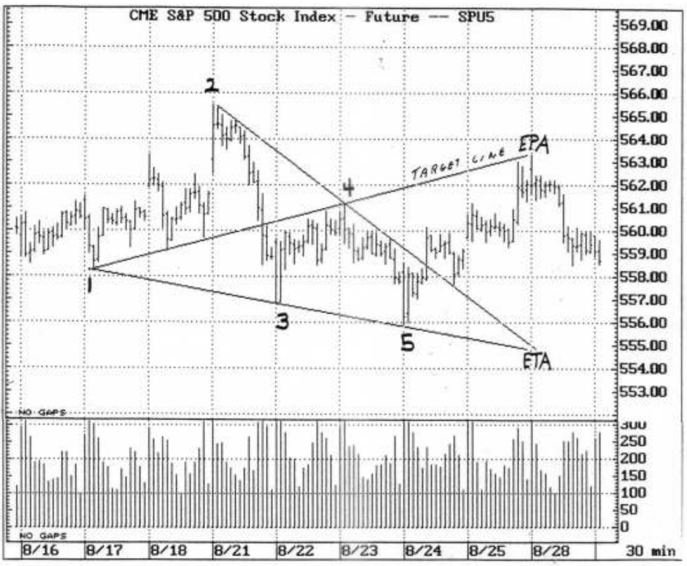

A perfect Wave. If you will compare this 30 min. S&P chart to the Rules for a Bullish Wolfe Wave Structure, you will see that it is perfect. The ETA and EPA are right on target. Follow the rules point by point so that you will become familiar with the count. At point 5 you want to be ready to go long for a move to the 1 to 4 line. Do not expect perfection all the time. It is not necessary!

### EXHIBIT 2 — A perfect Bearish Wave

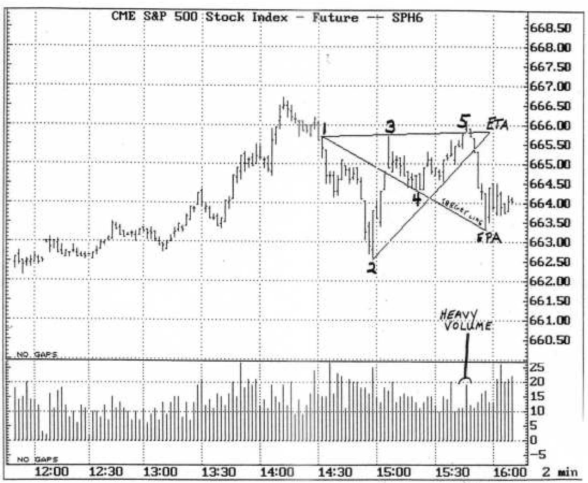

A perfect Bearish Wave. If you will compare this 2 min. S&P chart to the Rules for a Bearish Wolfe Wave Structure, you will see that it is perfect. The ETA and EPA are right on target. At point 5 you want to be ready to go short for a move to the 1 to 4 line. Again, do not expect perfection all the time. You will see that it is not necessary.

### EXHIBIT 3 — The value of Tic volume

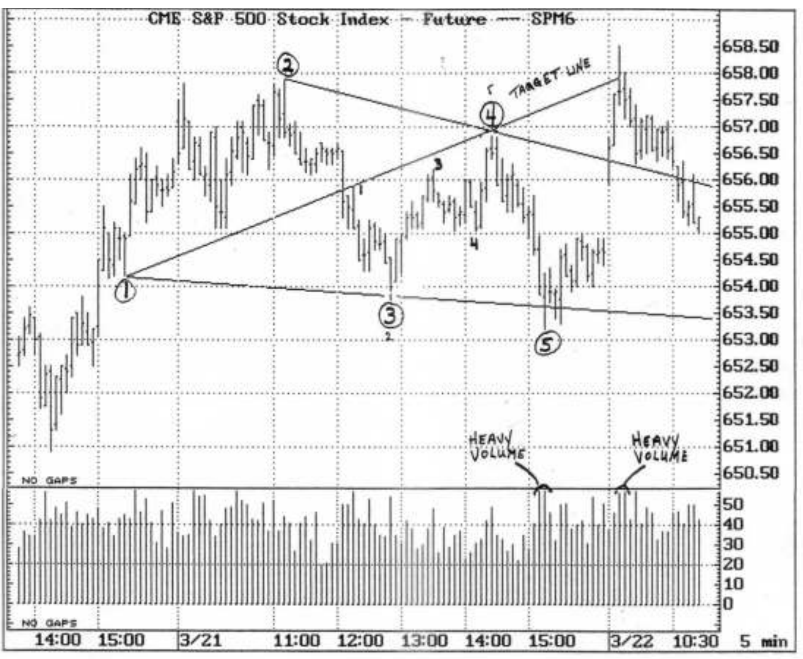

Watch for heavy tic volume. In commodities, actual volume is not reported until the following day. Fortunately, tic volume has a very strong correlation and can be used instead. Important turning points are often accompanied by heavy stopping volume. Note the heavy volume at 5 and then again at the target line.

### EXHIBIT 3a — Reassuring volume

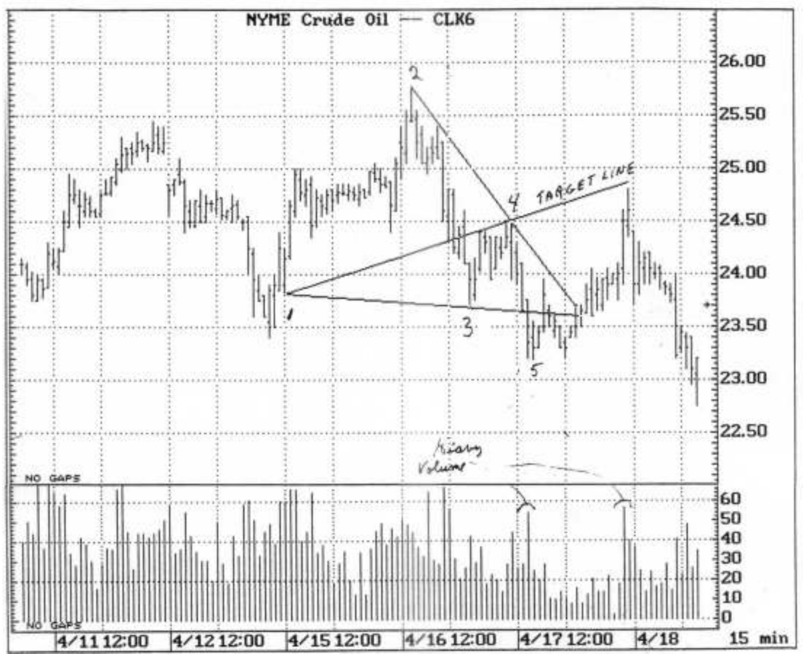

A saucer like shape in tic volume is a reassuring sign. As the price gets to the 5 point, expect to see heavy tic volume. After all, this is an auction and there must be a difference of opinion if we expect to see a change in direction. A good sign that the price has reversed is to see the volume start to decline as the price moves along freely. As it approaches the 1 to 4 target line, volume will start to increase as another difference of opinion is expressed. Eventually it will stop the price. On the chart it will often have a saucer like shape.

### EXHIBIT 4 — Reinforcement of theory

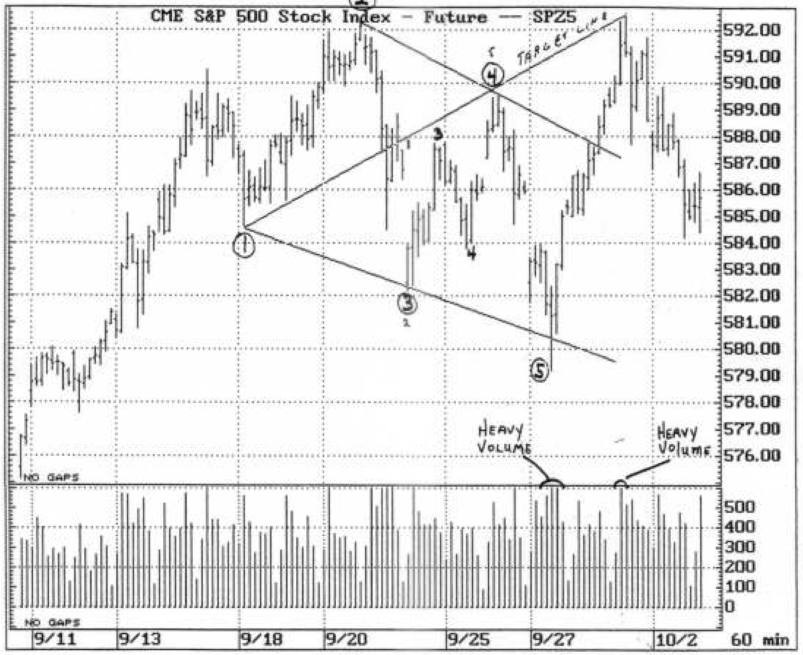

Monotony is good. Notice how similar this 60 min. chart is to the 5 min. chart on the previous page. The volume patterns are the same. This is not a coincidence. Waves are a natural rhythm and continuously repeat themselves. Get into the habit of watching how one Wave influences the next.

### EXHIBIT 5 — Broken trend lines

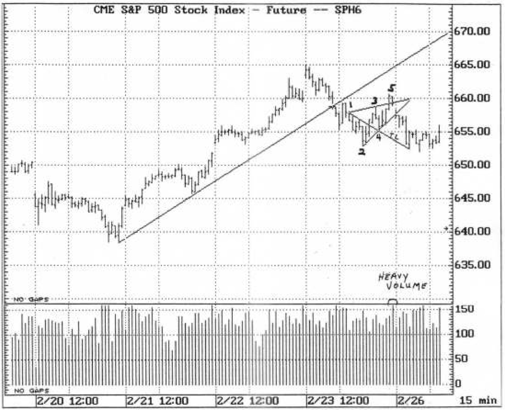

Broken trend lines. Whenever a trend line is broken, it is almost a guarantee that you will find a Wave. Initially, heavy selling drops the price below the support of the trend line. As the price struggles to get back, it meets resistance. The ingredients are in place and the motion acts naturally and forms a Wave. It is very important that you believe through understanding, the physics of Wave trading. In this way you will gain the confidence that is necessary to be a super trader.

### EXHIBIT 6 — Trend line analysis

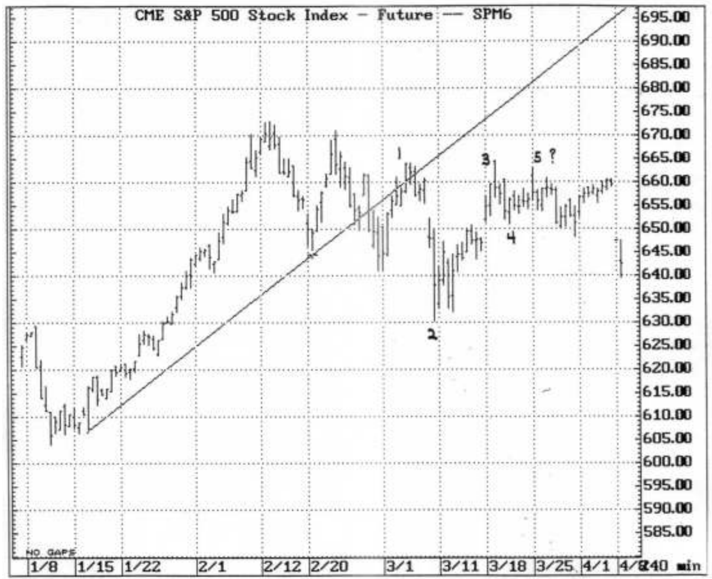

Another broken trend line. What happens big happens small. In this 240 min chart a loosely formed Wave developed after a break in the trend line. The price has difficulty rallying and fails in two attempts to reach the 5 point. The next day the market falls 20 S&P points and nails the 1 to 4 line!

### EXHIBIT 7 — A doubtful Wave

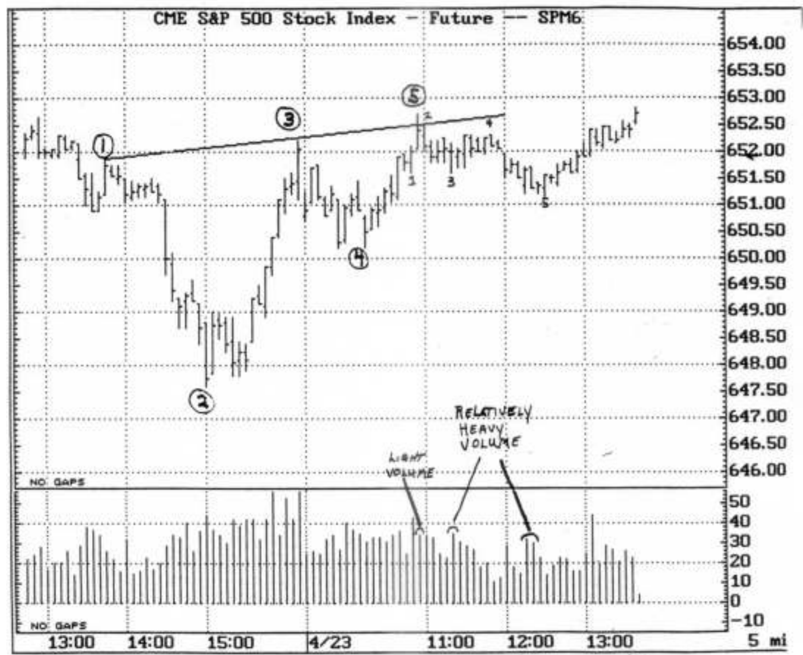

Be suspicious of light volume. When the 5 point does not have heavy stopping volume, immediately look to a shorter time frame for a contrary Wave. In this case the volume was not heavy at 5 and it encountered heavy resistance to the decline just six bars later. This indicated that it could be a 3 of a smaller contrary Wave. It then put in a small rally for a 4 point and then turned down and made a 5 on heavy stopping volume. At this point you would have exited your short position with a small profit.

### EXHIBIT 7a — $ from a failed Wave

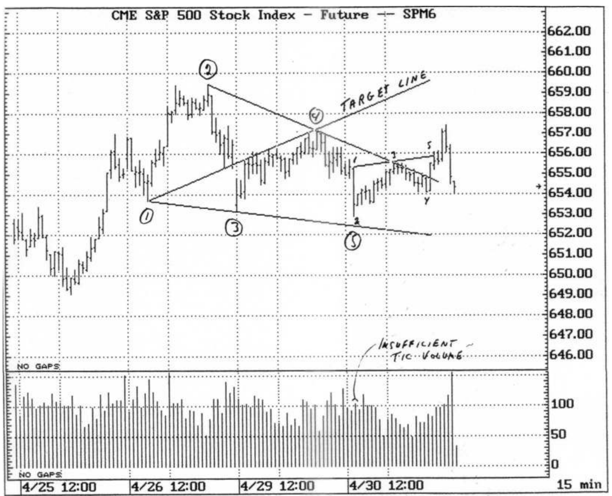

Caution due to light volume. I was anxiously awaiting this trade as the Wave form telegraphed its arrival a day in advance. I went long as soon as it made a low below the price of point 3 as I felt the spike of 3 would mean that a probe down would be short lived. Immediately I was disappointed by the lack of heavy volume. While the price rallied nicely on declining volume, I was forewarned to be on the lookout for a contrary Wave. When the contrary Wave appeared, I was prepared and exited the trade at the 5-point. Was I disappointed that it didn't make it to the target line? Yes, but the satisfaction of trading the plan more than made up for it.

### EXHIBIT 8 — Seeing the "Sweet Zone"

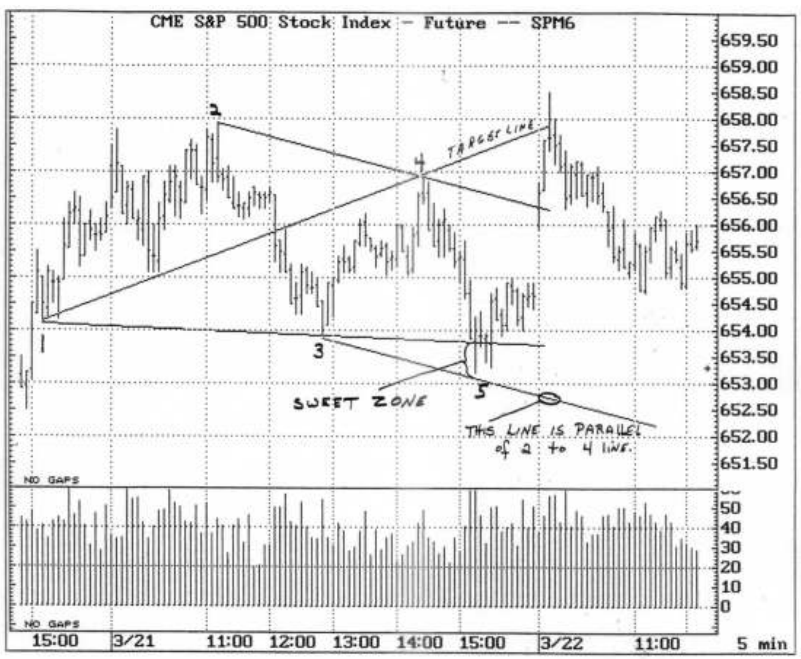

Identifying the "Sweet Zone." The sweet zone is the area of entry on Wave 5. Once you pass or equal point 3, the Wave is complete and you can expect a move to the 1 to 4 line. However, the throw over can be substantial in some cases and expensive if you are trading a longer period chart. What I do is parallel points 2 and 4 to point 3 and in some cases point 1. The area from the price of point 3, to the parallel of points 2 and 4 to point 3 is the sweet zone. This can be extremely valuable as it alerts you to potential risk. In this case the risk was minimal and you had a strong confirmation with volume.

### EXHIBIT 8a — Entry in the Sweet Zone

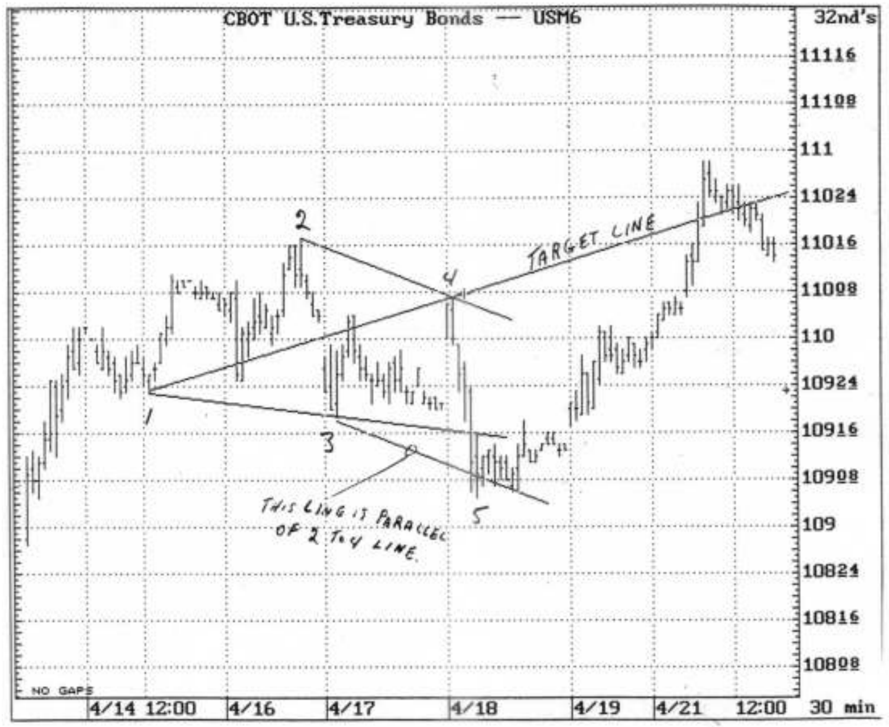

Calculating risk using the Sweet Zone. As you gain experience, it is very important that you concentrate as much as possible on your entry. This is the starting gate. The price that you pay is going to color your thinking throughout the trade. Note how the parallel of the 2 to 4 line to the 3 point pretty much contained the price. Knowing this in advance will allow you to act with confidence. When you have a good position, you are much more likely to trade the plan and in this case for a very nice ride to the 1 to 4 target line.

### EXHIBIT 8b — As I see it

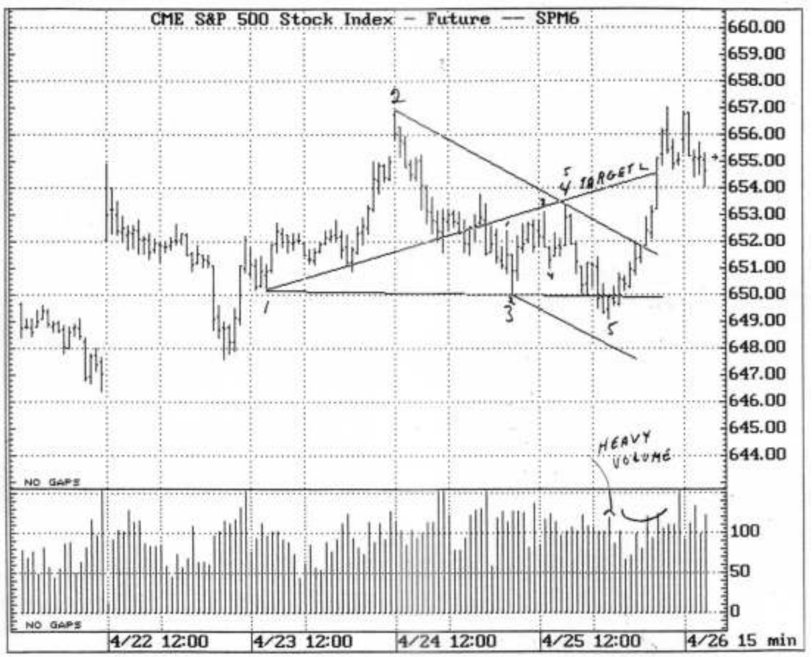

Three lessons in one chart. Experienced Wave traders should have seen this Wave setting up at the 3 point. You would have then been looking for a rally that would mark the 4 point. At point 4, you would be looking for a move down to the Sweet Zone. Once in the Sweet Zone you would be looking for heavy stopping volume. Once aboard, you would like to see declining, saucer like shape volume. At the 1 to 4 line you would be picking up the phone and selling at the market. I am sure this trade would have provided positive slippage, which is very rewarding mentally and monetarily for a job well done.

### EXHIBIT 8c — More Sweet stuff

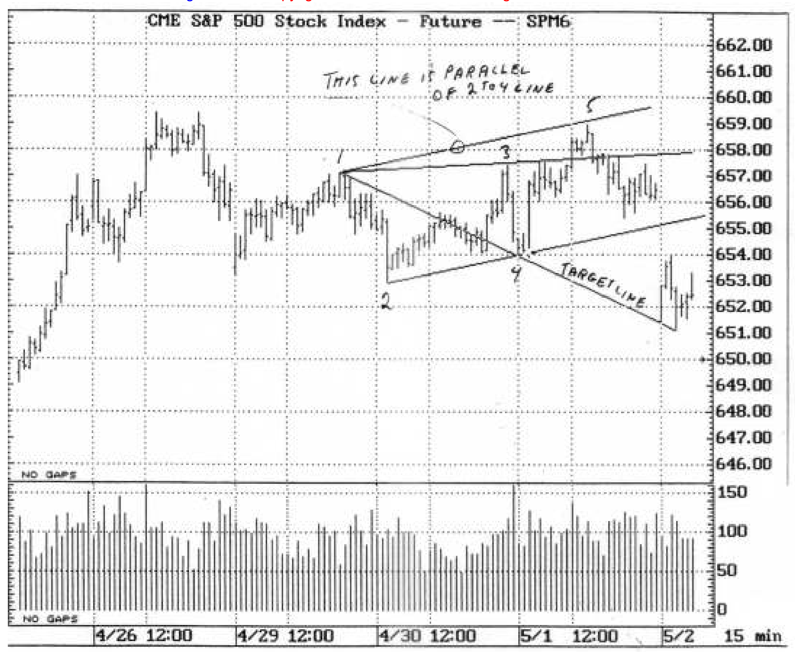

The Sweet Zone using the 1 point for a parallel. Wave trading excels in fast choppy markets. The reason for this is that when the market is moving sideways, neither side has the upper hand and when the music stops, as in musical chairs, there is a mad dash, in this case for the 1 to 4 target line. When paralleling for the sweet zone, it is a good idea to also parallel to the 1 point as there is usually not much difference from using the 3 point as the wave is almost rectangle in shape. Note that the market opened at the 1 to 4 target line. A nice way to start the day.

### EXHIBIT 9 — Identifying spikes

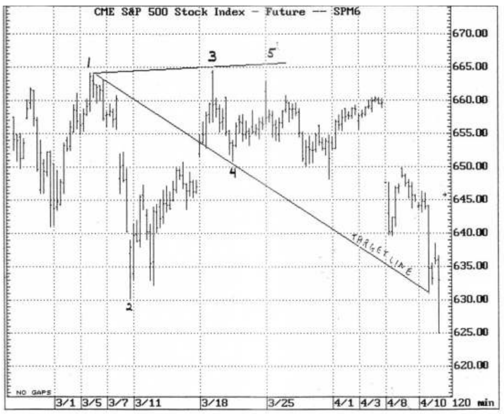

Identifying Spikes. Spikes are isolated vertical bars that stick out of Waves 1 or 3 or both. When drawing the trend line from 1 to 3 they will sometimes cause it to be too high or too low as the case may be and consequently Wave 5 will not get to the price of Wave 3 before reversing. Spikes are usually associated with openings or round numbers or other areas where stops may have been triggered. When the stops are satisfied, the price quickly returns to the norm for that area.

### EXHIBIT 10 — $$$ from gaps

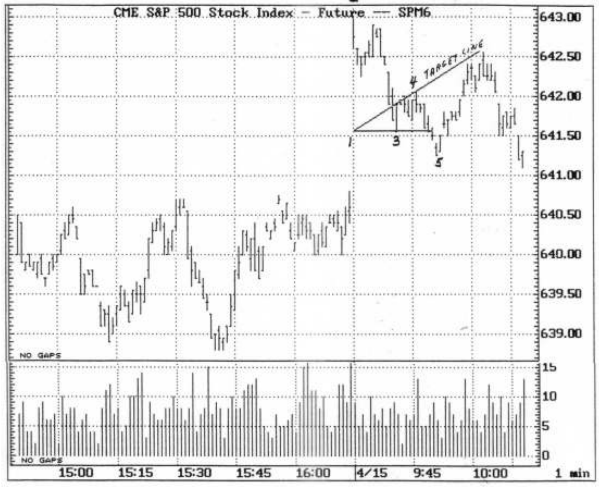

Using a gap for a 1 point. When the market gaps open and appears to be forming a Wave but a suitable 1 point can't be found, use an imaginary 1 point just below 2 and level with 3. I do not recommend this for beginners. Trading somewhat ambiguous Waves should be attempted by advanced students only.

### EXHIBIT 11 — Deja View

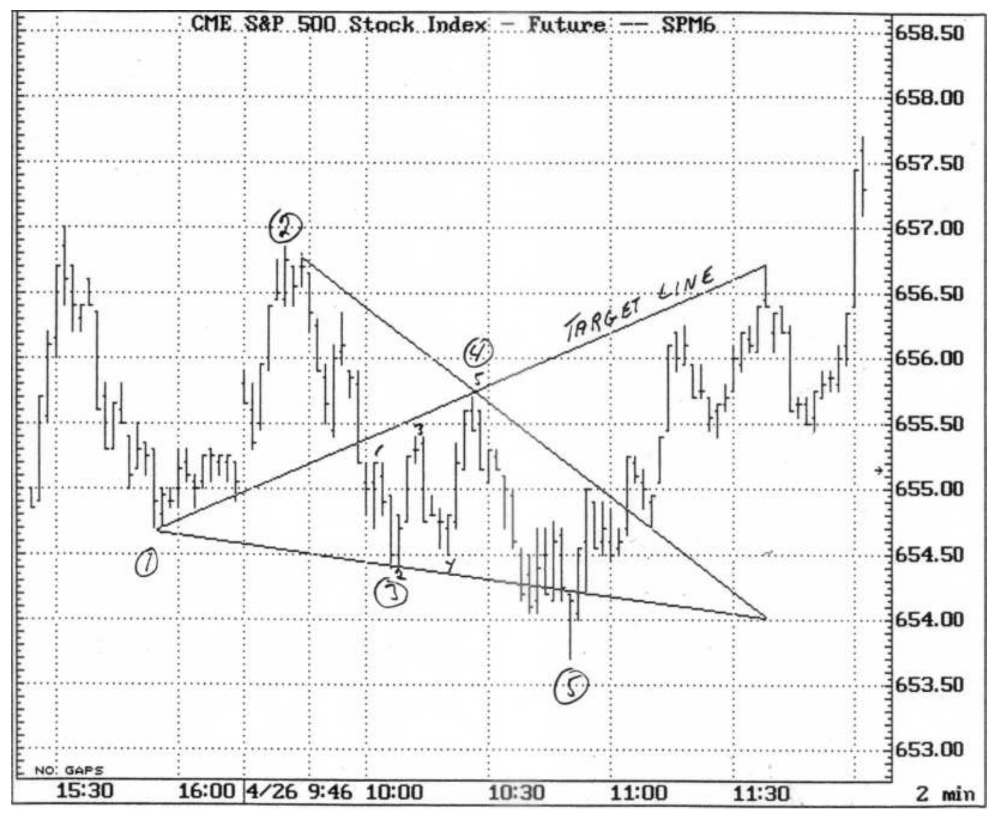

Confidence builder. Hey! I recognize that pattern. Of course you do. You have seen it enough. The Wolfe Wave is a natural rhythm that constantly repeats itself. You have to believe in a methodology before you can trade it. You will soon get so accustomed to seeing the Wave work, that you will be pulling the trigger with confidence. Others fail because; they cannot do what you can.

### EXHIBIT S-1 — Precession

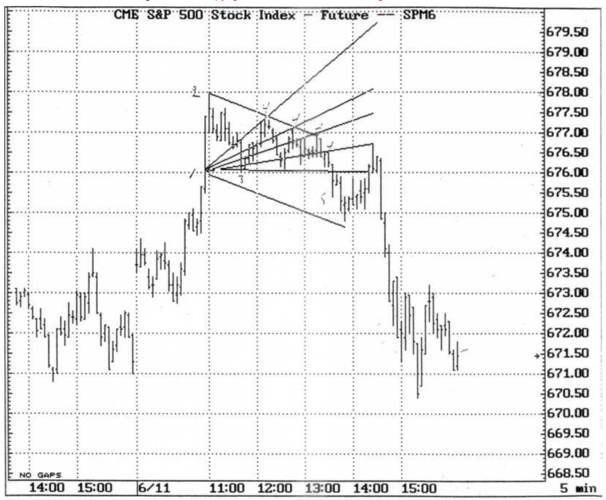

Precession. Beware of charts that show wobble between points 4 and 5. The reason well formed Waves work so well is because when drawing the Wave, you have proportionally found the equilibrium between supply and demand. The 1 to 4 line should be the center of balance. In this example, the 4 points are cascading. When the price probed deep into the sweet zone it showed further signs of weakness. It is advisable to get out at the most conservative 1 to 4 point in these cases.

---

## Closing

To the lucky few that Abide by the Laws of the Universe

Watch a squirrel. It steals an acorn and is on the run, protecting its bounty. Up, down, around and eventually burying the new found food. A slave to Nature.

The squirrel did not earn the nut but paid for it by restitution to the Universe. It plants the food for its siblings, that will hopefully learn through evolution that you reap what you sow.

My treatise is imbedded with "Good Vibrations" for those that pay for it.

Bad karma will surround those that haven't.

Restitution is bad in trading.

*-Bill Wolfe*

---

## BibTeX

```bibtex
@book{wolfe2013seeing,
  author    = {Bill Wolfe and Brian Wolfe},
  title     = {Seeing the Future: Profiting from the Fascinating Science of Technical Analysis},
  year      = {2013},
  copyright = {2013 Bill Wolfe},
  note      = {Available at \url{https://funwiththinkscript.com/wp-content/uploads/2017/03/seeingTheFuture.pdf}}
}

@misc{funwiththinkscript_seeingthefuture,
  author       = {{Fun With ThinkScript}},
  title        = {Seeing the Future by Bill Wolfe \& Brian Wolfe},
  howpublished = {\url{https://funwiththinkscript.com/wp-content/uploads/2017/03/seeingTheFuture.pdf}},
  year         = {2017},
  note         = {PDF download}
}
```
