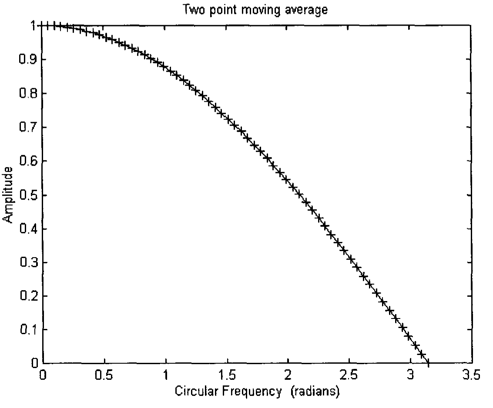
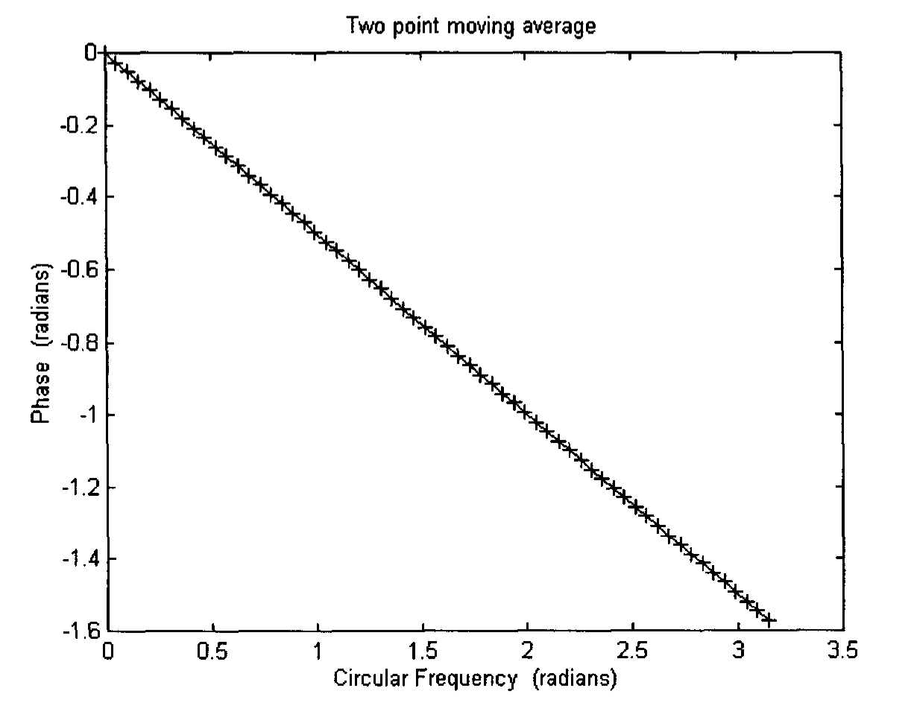
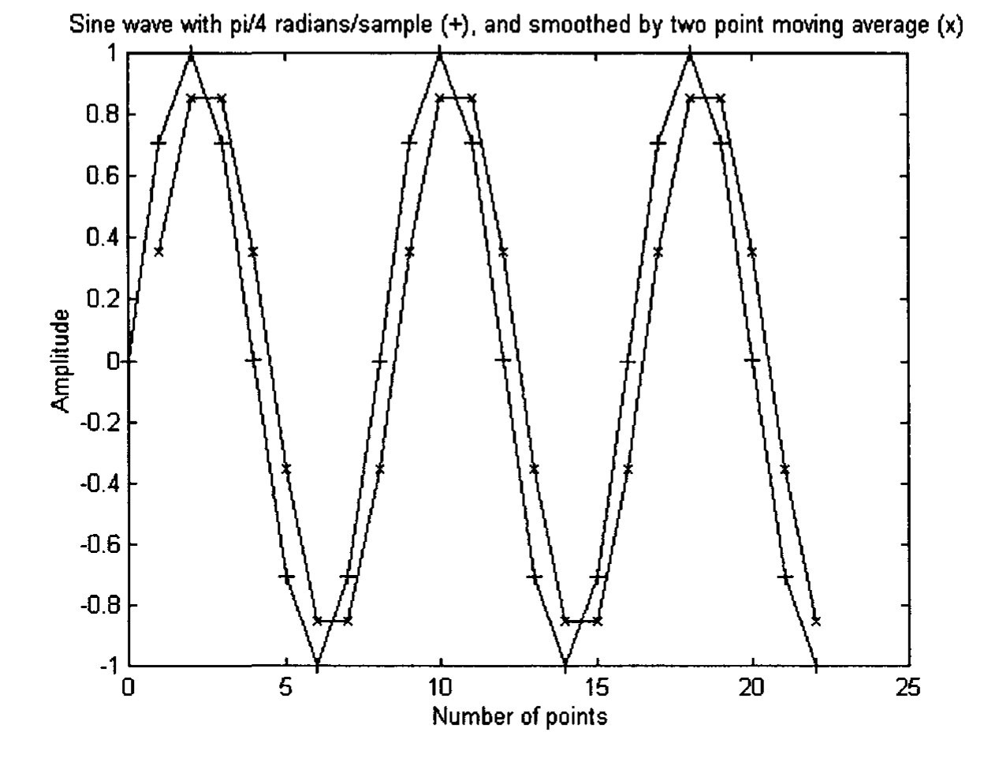
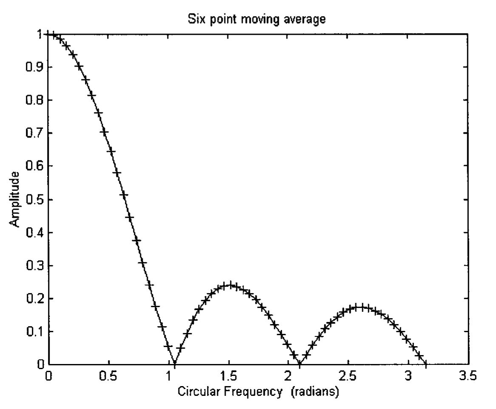
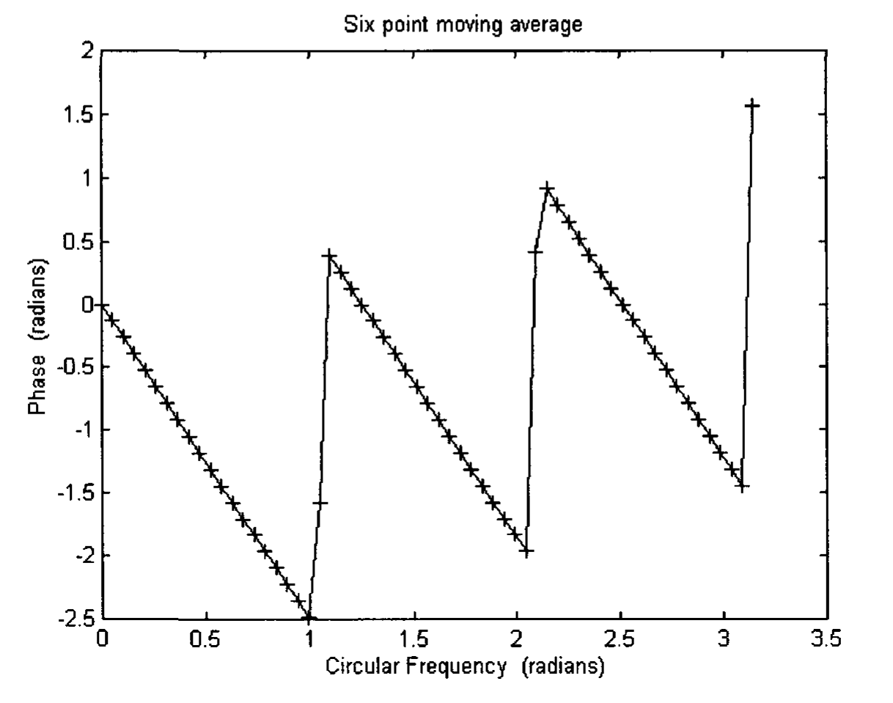
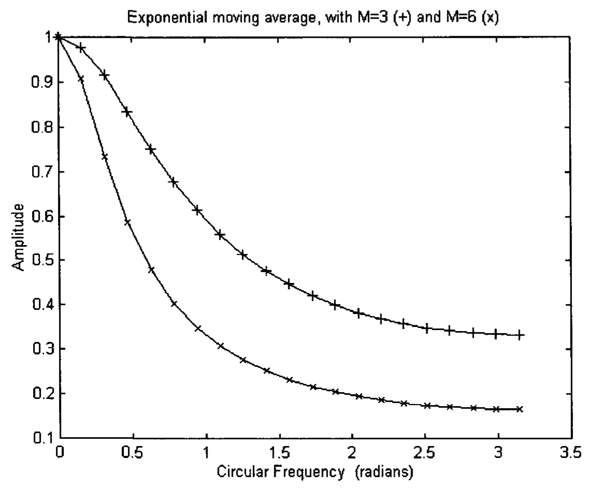
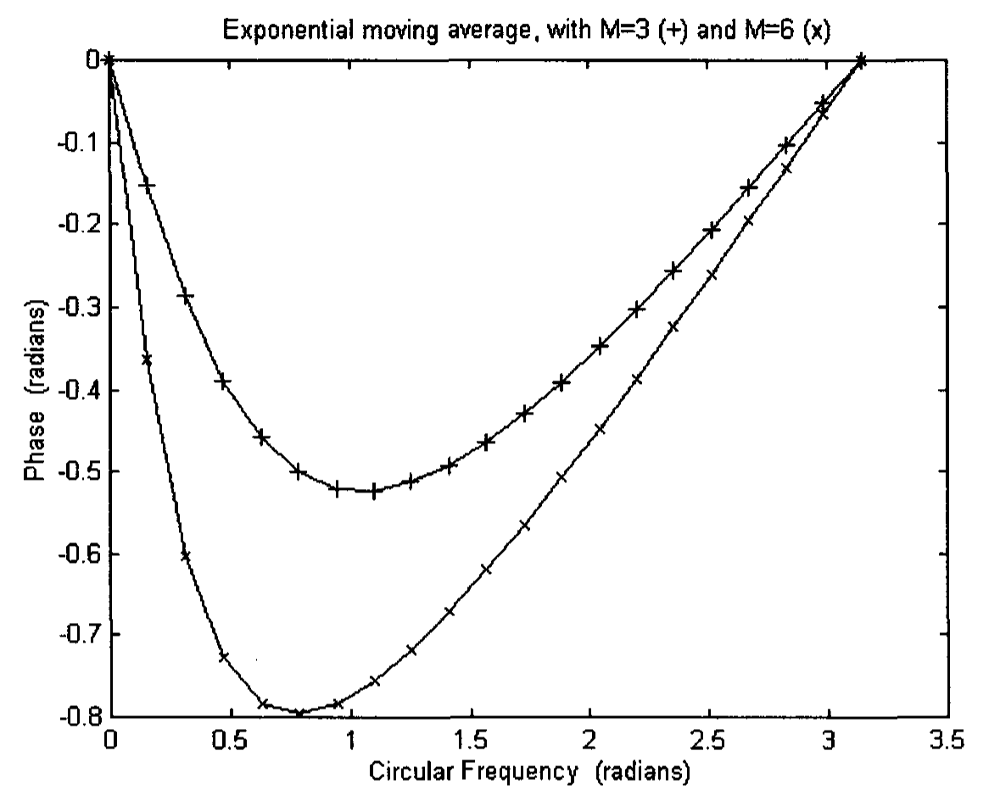

# Appendix 3: Low Pass Filters

A filter can be considered as a function of frequency. Signals of certain frequencies are allowed to pass through while others are blocked off. The output from a filter can be generated by convolving the input signal $x(n)$ with a filter function or unit sample response $h(k)$. The filter function is thus a linear shift-invariant (LSI) system, which is characterized by $h(k)$. It can be divided into two types, those that have a finite-duration impulse response (FIR) and those that have an infinite-duration impulse response (IIR). An FIR system has an impulse response that is zero outside a certain finite time interval.

The convolution formula for a causal FIR system can be written as

$$y(n) = \sum_{k=0}^{M} h(k) x(n-k) \tag{A3.1}$$

while the formula for a causal IIR system can be written as

$$y(n) = \sum_{k=0}^{\infty} h(k) x(n-k) \tag{A3.2}$$

The most common types of filters are low-pass filters and high-pass filters. We will discuss low-pass filters in this Appendix and high-pass filters in the next.

Low-pass filters eliminate high frequency signals or noise. An example is the Simple Moving Average (SMA), which is quite often used by traders (Elders 1993).

## A3.1 Simple Moving Average (SMA)

A simple N-day average is created by adding the prices over N days and dividing by N. It becomes a simple moving average when the next day's weighted price is added to the sum and the weighted first day's price is dropped off. It is thus given by Eq (A3.1) with

$$h(k) = 1/N \tag{A3.3}$$

Day, of course, can be replaced by any time unit. For example, a time unit can be a 15-minute time interval.

### A3.1.1 Two Point Moving Average

For a two point moving average, $N = 2$. From Eq (A3.1) and (A3.3) (Strang and Nguyen 1997, Hamming 1989)

$$y(n) = (1/2)x(n) + (1/2)x(n-1) \tag{A3.4}$$

The frequency response function $H(\omega)$ is, in the general case of N points, given by (see Eq (A2.13))

$$H(\omega) = \sum_{k=0}^{N-1} h(k) \exp(-ik\omega) \tag{A3.5}$$

For the two point moving average,

$$H(\omega) = \frac{1}{2} + \frac{1}{2}\exp(-i\omega) = \left(\cos\frac{\omega}{2}\right)\exp(-i\omega/2) \tag{A3.6}$$

The magnitude and phase of $H(\omega)$ are

$$|H(\omega)| = \cos(\omega/2) \tag{A3.7}$$

$$\phi(\omega) = -\omega/2 \tag{A3.8}$$

The two point moving average has a phase delay which is linear with respect to $\omega$. Graphs of amplitude and phase of the two point moving average are plotted in Fig. A3.1(a) and Fig. A3.1(b). A sine wave with $\pi/4$ radians/sample as well as its two point moving average are plotted in Fig. A3.2. The reduced amplitude and phase lag of the moving average are obvious. It should be noted that in trading, the phase of a filter (or indicator) is more important than its amplitude. A phase delay implies a time delay. A delay in time of executing an order can be costly.

**Fig. A3.1(a).** Amplitude response of a two point moving average.

**Fig. A3.1(b).** Phase response of a two point moving average.

**Fig. A3.2.** A sine wave of circular frequency of π/4 radian (marked as +), and its output response after smoothed by a two point moving average (marked as x).

### A3.1.2 N Point Moving Average

The output response of an N point moving average is given by

$$y(n) = \frac{1}{N} \sum_{k=0}^{N-1} x(n-k) \tag{A3.9}$$

Using Eq (A3.5), the frequency response function $H(\omega)$ is given by:

For N odd,

$$H(\omega) = \frac{1}{N} \exp\left(-i\frac{N-1}{2}\omega\right) \left[1 + 2\cos\omega + 2\cos 2\omega + \cdots + 2\cos\frac{N-1}{2}\omega\right]$$

$$= \frac{1}{N} \exp\left(-i\frac{N-1}{2}\omega\right) \left[1 + 2\sum_{\ell=0}^{(N-1)/2} \cos \ell\omega\right] \tag{A3.10}$$

For N even,

$$H(\omega) = \frac{1}{N} \exp\left(-i\frac{N-1}{2}\omega\right) \left[2\cos\frac{\omega}{2} + 2\cos\frac{3}{2}\omega + \cdots + 2\cos\frac{N-1}{2}\omega\right]$$

$$= \frac{1}{N} \exp\left(-i\frac{N-1}{2}\omega\right) \left[2\sum_{\ell=0}^{N/2} \cos\left(\ell - \frac{1}{2}\right)\omega\right] \tag{A3.11}$$

Thus, for all N, the phase of $H(\omega)$ is given by

$$\phi(\omega) = -\frac{N-1}{2}\omega \tag{A3.12}$$

which is linear with respect to $\omega$.

The larger the number of points, N, the smoother the output response is. However, it will also yield a larger phase lag, according to Eq (A3.12). The amplitude and phase of the six point moving average filter are plotted in Figs. A3.3(a) and (b). In Fig. A3.3(b), the phase should have been linear. The jump in phase is caused by the built-in function arctan used to calculate $\phi(\omega)$ being defined only from $-\pi$ to $\pi$ in the computer program.

**Fig. A3.3(a).** Amplitude response of a six point moving average.

**Fig. A3.3(b).** Phase response of a six point moving average.

## A3.2 Exponential Moving Average (EMA)

An exponential moving average (EMA) is a better tool than a simple moving average. It gives greater weight to the latest data and thus responds to changes faster. It does not drop old data suddenly the way an SMA does. Old data fades away.

The equation for the output response of an EMA is given by

$$y(n) = \alpha x(n) + (1-\alpha)y(n-1) \tag{A3.13}$$

where

$$\alpha = 2/(M+1) \tag{A3.14}$$

M is a positive integer chosen by the trader and is often called the length of the EMA.

Equation (A3.13) makes use of an output response that has already been processed. Filters that employ previously processed values are sometimes called recursive filters. To calculate the frequency response of EMA, the z-transform of Eq (A3.13) is taken (Broesch 1997, Proakis and Manolakis 1996).

$$Y(z) = \alpha X(z) + (1-\alpha)z^{-1}Y(z) \tag{A3.15}$$

where $z = r\exp(i\omega)$ is a complex number in the complex plane, $r$ being the magnitude of $z$. $Y(z)$ is the transform of the output and $X(z)$ is the transform of the input.

Defining the transfer function as the output of the filter over the input of the filter

$$H(z) = Y(z)/X(z) \tag{A3.16}$$

we get, for EMA

$$H(z) = \frac{\alpha}{1-(1-\alpha)z^{-1}} \tag{A3.17}$$

Restricting $z$ in the complex plane to $\exp(i\omega)$ on the unit circle (i.e. $r = 1$), the frequency response function $H(\omega)$ is given by

$$H(\omega) = \frac{\alpha}{1-(1-\alpha)\exp(-i\omega)} \tag{A3.18}$$

The magnitude of $H(\omega)$ is given by (Lyons 1997)

$$|H(\omega)| = \frac{\alpha}{[1 - 2(1-\alpha)\cos\omega + (1-\alpha)^2]^{1/2}} \tag{A3.19}$$

The phase is given by

$$\phi(\omega) = \tan^{-1}\left(\frac{-(1-\alpha)\sin\omega}{1-(1-\alpha)\cos\omega}\right) \tag{A3.20}$$

The amplitude and phase of $H(\omega)$ of EMA are plotted in Figs. A3.4(a) and (b) for $M = 3$ and $M = 6$. It should be noted that the phase lag is, in general, much smaller than that of the N point moving average, which makes it more popular among traders.

Rather than using Eq (A3.13) to calculate EMA, there is a different method which makes its calculation more convenient sometimes. Iterating the previously processed $y$ value in Eq (A3.13), we can write $y(n)$ as

$$y(n) = \sum_{k=0}^{\infty} \alpha(1-\alpha)^k x(n-k) \tag{A3.21}$$

**Fig. A3.4(a).** Amplitude response of an exponential moving average with M = 3 (marked as +) and M = 6 (marked as x).

**Fig. A3.4(b).** Phase response of an exponential moving average with M = 3 (marked as +) and M = 6 (marked as x).

This is a causal IIR with

$$h(k) = \alpha(1-\alpha)^k \tag{A3.22}$$

With $\alpha = 2/(M+1)$, $h(k)$ converges to zero rather quickly as $k$ increases. If $M$ is taken to be 3, $\alpha$ will be equal to 0.5. Summing $k$ from 0 to 13 will yield a rather accurate estimate of the EMA.
