# Appendix 4: High Pass Filters

High pass filter removes low frequency components of a signal and allows high frequency components to pass. It is thus very useful for tracking market turns, which are actually high frequency components.

Before we talk about high pass filter, we would first discuss derivative, which is a significant concept in Calculus, and can also be considered as a high pass filter.

## A4.1 Derivative

Derivative can be considered as the slope of a function or signal. Let the discrete input signal be

$$x(n) = \sin(\omega n) \tag{A4.1}$$

where $n$ is an integer.

The derivative of the signal is

$$\frac{d}{dn} x(n) = \omega \cos(\omega n) \tag{A4.2}$$

In taking derivative, $n$ should have been a continuous variable. Here, we try to get around the problem by considering it first to be a continuous variable and then returning it back to be an integer after taking the derivative.

Figure A4.1 plots $x(n)$ and $(d/dn)x(n)$ with $\omega = \pi/4$. The derivative leads the input signal by $\pi/2$ radians or 90 degrees. It should be noted that the derivative is zero where the input data has its peaks and valleys. Furthermore, peak occurs when the derivative goes from positive to negative, and valley occurs when the derivative goes from negative to positive. In this book, as $n$ represents time, we will call the derivative or first derivative the velocity operator or indicator.

Taking the derivative of Eq (A4.2) or the second derivative of Eq (A4.1), we get

$$\frac{d^2}{dn^2} x(n) = -\omega^2 \sin(\omega n) \tag{A4.3}$$

which is plotted in Fig. A4.2, together with $x(n)$ and $(d/dn)x(n)$. The second derivative represents the concavity of a signal. If the signal is concave down, then the second derivative is negative. If the signal is concave up, then the second derivative is positive. So, at the peak of the signal, the derivative is zero and the second derivative is negative. At the valley of the signal, the derivative is zero and the second derivative is positive. Thus, the second derivative provides a second method to differentiate whether the signal is a peak or a valley. In this book, we will call the second derivative the acceleration operator or indicator.

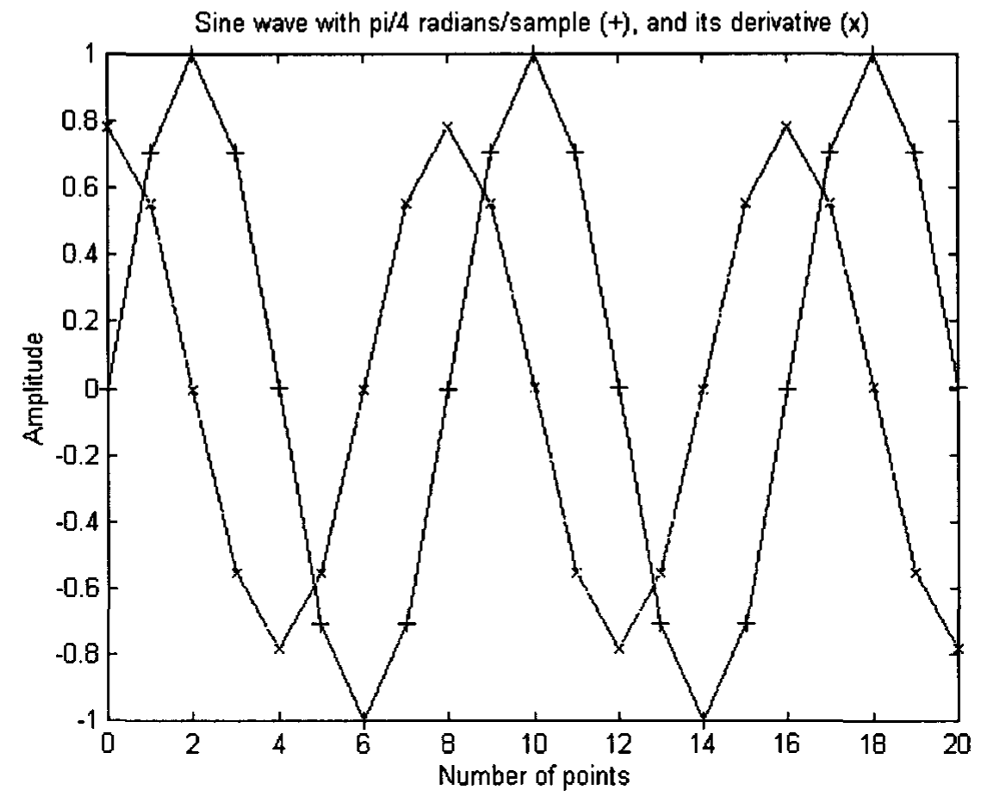
**Fig. A4.1.** A sine wave of circular frequency of pi/4 radian (marked as +), and its (first) derivative (marked as x).

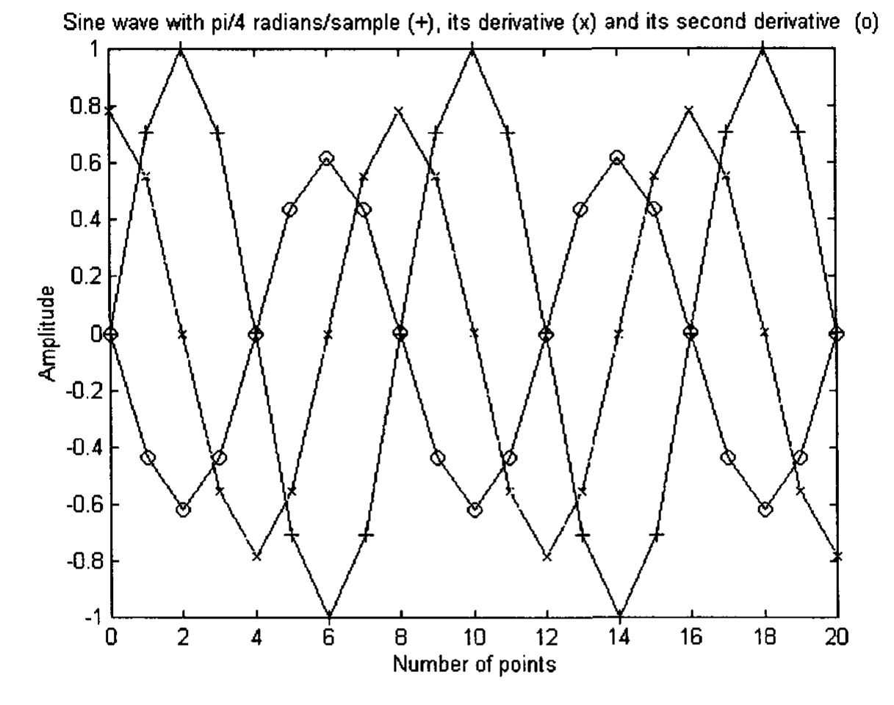
**Fig. A4.2.** A sine wave of circular frequency of pi/4 radian (marked as +), its (first) derivative (marked as x) and its second derivative (marked as o).

But how do we take the derivative of a real signal? In many analog and digital systems, Finite Impulse Response (FIR) differentiators can be designed (Proakis and Manolakis 1996). Let us take a look at a more general signal

$$x(n) = \exp(i\omega n) = \cos(\omega n) + i\sin(\omega n) \tag{A4.4}$$

Taking derivative of Eq (A4.4) yields

$$\frac{d}{dn} x(n) = i\omega \exp(i\omega n) \tag{A4.5}$$

which can be considered as the output $y(n)$. Thus $i\omega$ is the eigenvalue of $d/dn$, i.e.

$$H(\omega) = i\omega \qquad -\pi < \omega < \pi \tag{A4.6}$$

This is the frequency response of an ideal digital differentiator. Its response is linearly proportional to frequency and has a phase lead of $\pi/2$ with respect to the input signal when $\omega > 0$ and a phase lag of $\pi/2$ when $\omega < 0$. This can be considered as a high pass filter. Its Inverse Discrete Time Fourier Transform, which is the same as the unit sample response, is

$$h(k) = \frac{1}{2\pi} \int_{-\pi}^{\pi} H(\omega) e^{i\omega k} d\omega = \frac{\cos \pi k}{k} \qquad -\infty < k < \infty, \; k \neq 0 \tag{A4.7}$$

This example is mentioned to show how an ideal differentiator should look like. However, this is a non-causal filter and cannot be applied in trading, where future data is not available. Causal filters will be considered below.

## A4.2 Moving Difference

This high pass (causal) filter is a twin or mirror filter of the two point moving average low pass filter discussed in Appendix 3. Its output is defined as (Strang and Nguyen 1997)

$$y(n) = (1/2)x(n) - (1/2)x(n-1) \tag{A4.8}$$

(This definition of moving difference is essentially the same as momentum defined by technical analysts (see Eq 4.5), except that it has a normalization constant 1/2.)

The frequency response function $H(\omega)$, which is the Discrete Time Fourier Transform (DTFT) of $h$, is given by

$$H(\omega) = (1/2) - (1/2)\exp(-i\omega) = \sin(\omega/2) \cdot i\exp(-i\omega/2) \tag{A4.9}$$

Its magnitude is

$$|H(\omega)| = |\sin(\omega/2)| \tag{A4.10}$$

and its phase is

$$\phi(\omega) = \begin{cases} \frac{\pi}{2} - \frac{\omega}{2} & 0 < \omega < \pi \\ \frac{\pi}{2} - \frac{\omega}{2} & -\pi < \omega < 0 \end{cases} \tag{A4.11}$$

$|H(\omega)|$ and $\phi(\omega)$ are plotted in Figs. A4.3(a) and (b). This two point moving difference has a phase lag of $\omega/2$ from the ideal case of $\pi/2$ phase lead for $\omega > 0$ or $\pi/2$ phase lag for $\omega < 0$. This would be more or less equivalent to a lag of half a time unit. For example, if a trader is trading in a 30-minute time chart, he or she would not realize a turning point until about 15 minutes later, causing excessive delay in buy-sell decision, which would translate to lost profits.

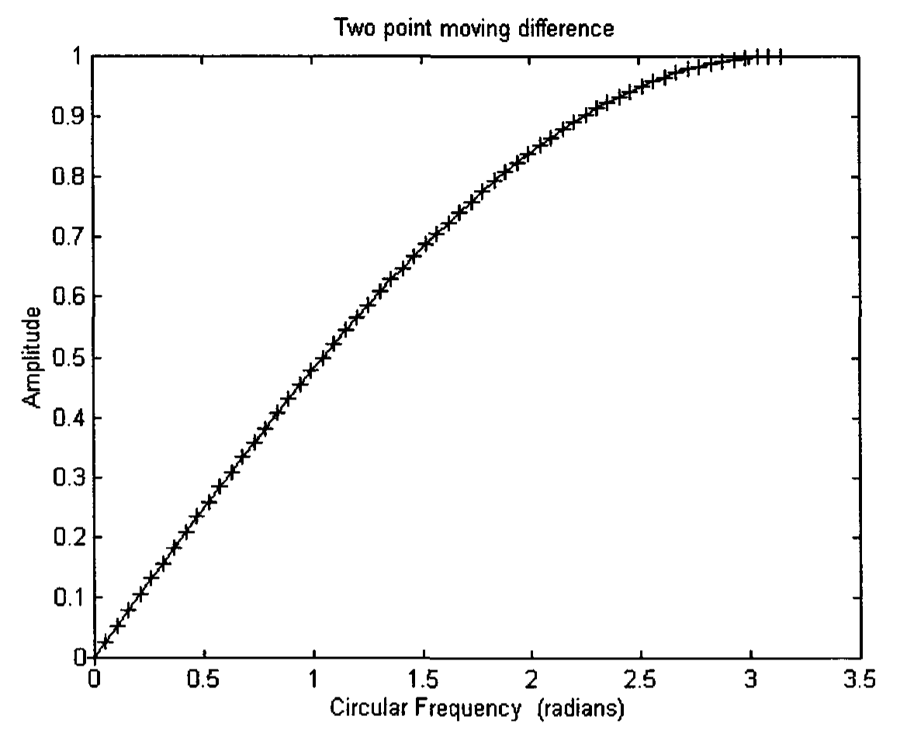
**Fig. A4.3(a).** Amplitude response of a two point moving difference.

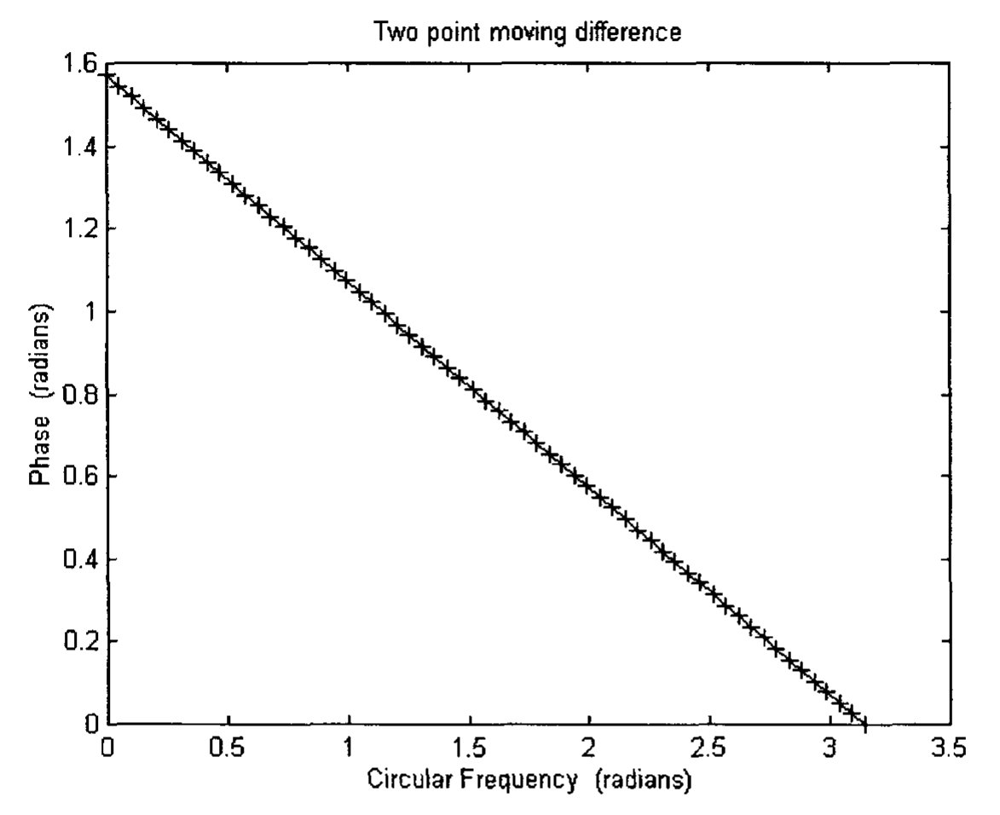
**Fig. A4.3(b).** Phase response of a two point moving difference.

Figure A4.4 plots a sine wave with $\pi/4$ radian per sample as well as the signal after being filtered by a two point moving difference. Note that there is a $\pi/8$ radian phase lag from the ideal case of $\pi/2$ phase lead.

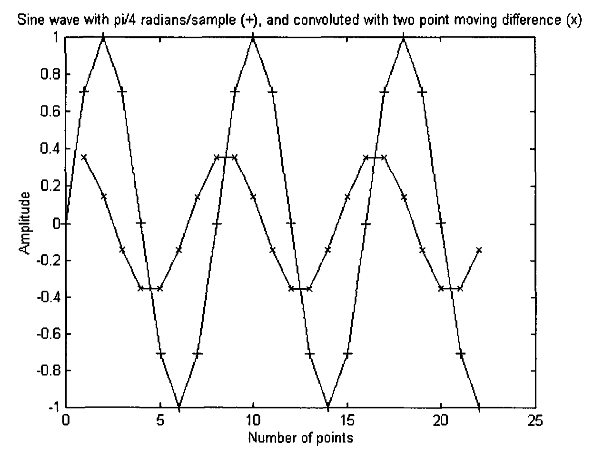
**Fig. A4.4.** A sine wave of circular frequency of pi/4 radian (marked as +), and convoluted (or filtered) with a two point moving difference (marked as x).

In order to reduce the phase lag, we will introduce here a new moving difference which has less phase lag. It will be called a parabolic velocity operator or indicator.

## A4.3 Parabolic Velocity Indicator

A parabola can be written as

$$x(t) = dt^2 + et + f \tag{A4.12}$$

where $x(t)$ is the price at time $t$; $d$, $e$ and $f$ are constant coefficients. For discrete-time signals, it will be written as

$$x(n) = dn^2 + en + f \tag{A4.13}$$

We are interested to find the derivative of the parabola at $n = 0$, which is the most recent data point. We write

$$x_0 = x(0) = f \tag{A4.14a}$$

$$x_{-1} = x(-1) = d - e + f \tag{A4.14b}$$

$$x_{-2} = x(-2) = 4d - 2e + f \tag{A4.14c}$$

Solving Eq (A4.14a-c) for $d$, $e$ and $f$, we get

$$d = (1/2)x_0 - x_{-1} + (1/2)x_{-2} \tag{A4.15a}$$

$$e = (3/2)x_0 - 2x_{-1} + (1/2)x_{-2} \tag{A4.15b}$$

$$f = x_0 \tag{A4.15c}$$

Taking the derivative of Eq (A4.13), we arrive at

$$\frac{dx}{dn} = 2dn + e \tag{A4.16}$$

At $n = 0$,

$$\frac{dx}{dn}\bigg|_{n=0} = e = \frac{3}{2}x_0 - 2x_{-1} + \frac{1}{2}x_{-2} \tag{A4.17}$$

We will thus define the unit sample response $h$ of the parabolic velocity indicator as

$$h = (h(0), h(1), h(2)) = (3/2, -2, 1/2) \tag{A4.18}$$

Therefore, the output response is given by the convolution sum

$$y(n) = h(0)x(n) + h(1)x(n-1) + h(2)x(n-2) = (3/2)x(n) - 2x(n-1) + (1/2)x(n-2) \tag{A4.19}$$

The frequency response or DTFT of $h$ is given by

$$H(\omega) = (3/2) - 2\exp(-i\omega) + (1/2)\exp(-2i\omega) = (3/2) - 2\cos(\omega) + (1/2)\cos(2\omega) + i[2\sin(\omega) - (1/2)\sin(2\omega)] \tag{A4.20}$$

The magnitude and phase of $H(\omega)$ are

$$|H(\omega)| = \{[(3/2) - 2\cos(\omega) + (1/2)\cos(2\omega)]^2 + [2\sin(\omega) - (1/2)\sin(2\omega)]^2\}^{1/2} \tag{A4.21}$$

$$\phi(\omega) = \tan^{-1}\left(\frac{2\sin\omega - (1/2)\sin 2\omega}{3/2 - 2\cos\omega + (1/2)\cos 2\omega}\right) \tag{A4.22}$$

$|H(\omega)|$ and $\phi(\omega)$ are plotted in Figs. A4.5(a) and (b). From the plot of $\phi(\omega)$, we can see that, comparing to the phase of the two point moving difference in Fig. A4.3(b), it has a much less phase lag from the ideal case of $\pi/2$ phase lead.

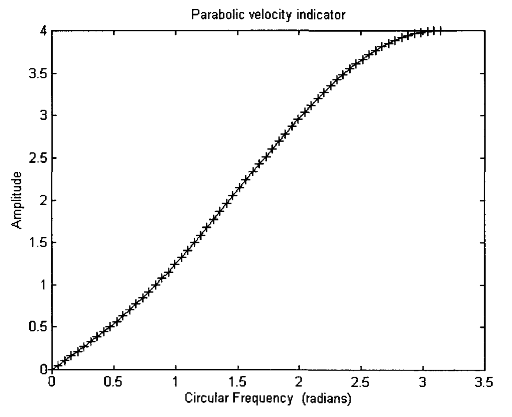
**Fig. A4.5(a).** Amplitude response of a parabolic velocity indicator.

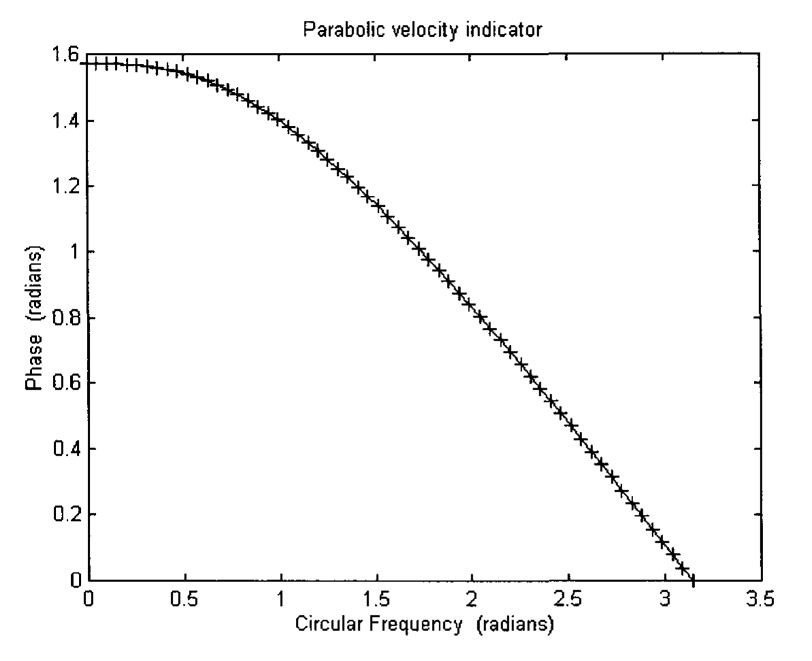
**Fig. A4.5(b).** Phase response of a parabolic velocity indicator.

When the output response of the parabolic velocity indicator is approximately zero, another indicator, the parabolic acceleration indicator can help to determine whether the price is at its peak or at its valley. We will introduce this new indicator in the next section.

## A4.4 Parabolic Acceleration Indicator

Taking the second derivative of Eq (A4.13) or the derivative of Eq (A4.16), we get

$$\frac{d^2 x}{dn^2} = 2d = x_0 - 2x_{-1} + x_{-2} \tag{A4.23}$$

As $d^2x/dn^2$ is independent of $n$, acceleration is the same for $n = 0, -1, -2$.

We will define the unit sample response $h$ of the parabolic acceleration indicator as

$$h = (h(0), h(1), h(2)) = (1, -2, 1) \tag{A4.24}$$

The output response is given by the convolution sum

$$y(n) = x(n) - 2x(n-1) + x(n-2) \tag{A4.25}$$

The frequency response or DTFT of $h$ is given by

$$H(\omega) = 1 - 2\exp(-i\omega) + \exp(-2i\omega) \tag{A4.26}$$

The amplitude and phase of $H(\omega)$ are plotted in Figs. A4.6(a) and (b).

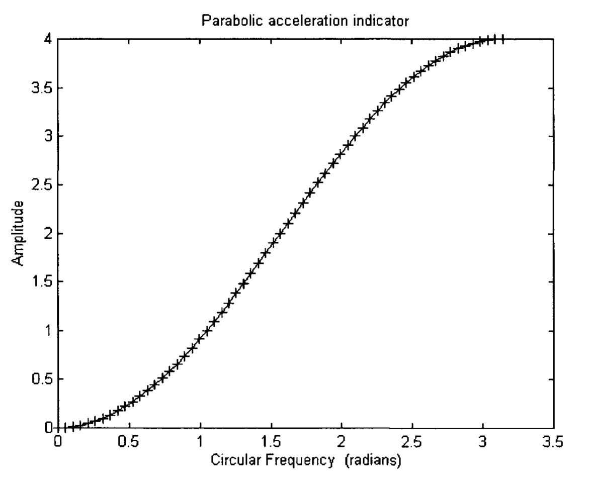
**Fig. A4.6(a).** Amplitude response of a parabolic acceleration indicator.

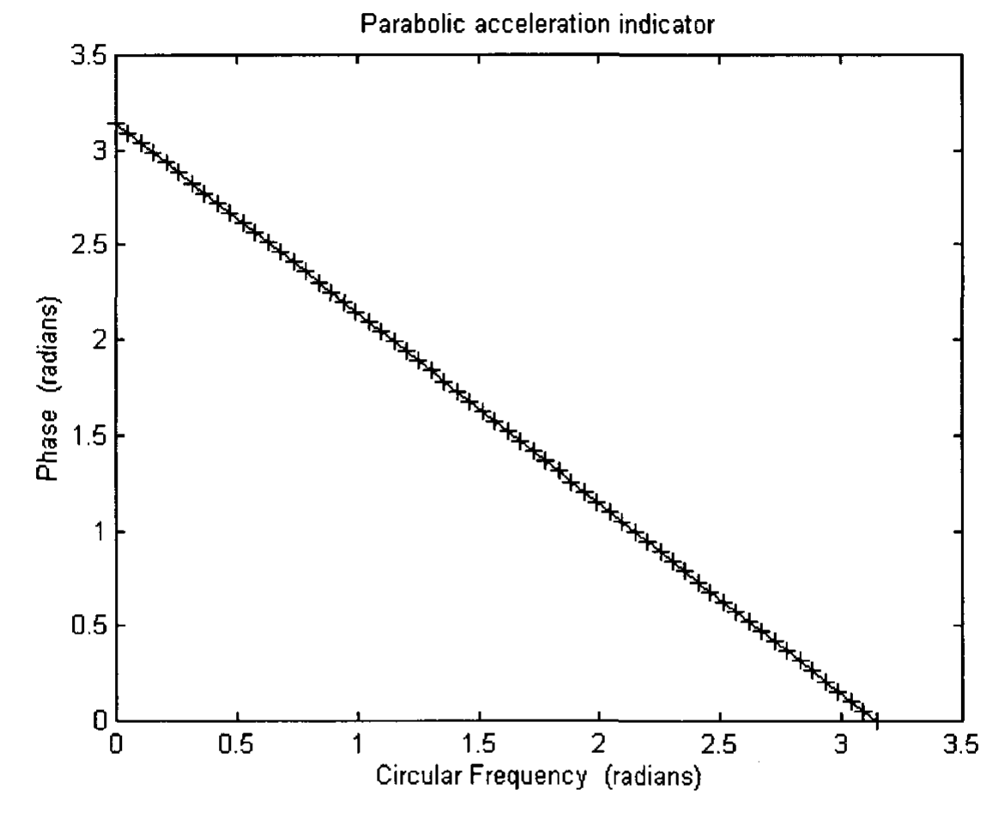
**Fig. A4.6(b).** Phase response of a parabolic acceleration indicator.

While a parabola can fit piecewise a sine wave of single frequency quite well, it does not fit a summation of sine waves very well. A cubic function can do a better job. We will therefore introduce the cubic velocity and acceleration indicators.

## A4.5 Cubic Velocity Indicator

A cubic function can be written as

$$x(t) = ct^3 + dt^2 + et + f \tag{A4.27}$$

where $c$, $d$, $e$ and $f$ are constant coefficients. When $c = 0$, Eq (A4.27) reduces to that of a parabola. For discrete time signals, Eq (A4.27) will be written as

$$x(n) = cn^3 + dn^2 + en + f \tag{A4.28}$$

We are interested to find the derivative of the cubic function at $n = 0$, which is the most recent data point. We write

$$x_0 = x(0) = f \tag{A4.29a}$$

$$x_{-1} = x(-1) = -c + d - e + f \tag{A4.29b}$$

$$x_{-2} = x(-2) = -8c + 4d - 2e + f \tag{A4.29c}$$

$$x_{-3} = x(-3) = -27c + 9d - 3e + f \tag{A4.29d}$$

Solving Eq (A4.29a-d) for $c$, $d$, $e$ and $f$, we get

$$c = (x_0 - 3x_{-1} + 3x_{-2} - x_{-3})/6 \tag{A4.30a}$$

$$d = (2x_0 - 5x_{-1} + 4x_{-2} - x_{-3})/2 \tag{A4.30b}$$

$$e = (11x_0 - 18x_{-1} + 9x_{-2} - 2x_{-3})/6 \tag{A4.30c}$$

$$f = x_0 \tag{A4.30d}$$

Taking the derivative of Eq (A4.28), we arrive at

$$\frac{dx}{dn} = 3cn^2 + 2dn + e \tag{A4.31}$$

At $n = 0$,

$$\frac{dx}{dn}\bigg|_{n=0} = e = (11x_0 - 18x_{-1} + 9x_{-2} - 2x_{-3})/6 \tag{A4.32}$$

We will define the unit sample response $h$ of the cubic velocity indicator as

$$h = (h(0), h(1), h(2), h(3)) = (11/6, -3, 3/2, -1/3) \tag{A4.33}$$

Thus, the output response is given by the convolution sum

$$y(n) = (11/6)x(n) - 3x(n-1) + (3/2)x(n-2) - (1/3)x(n-3) \tag{A4.34}$$

The frequency response or DTFT of $h$ is given by

$$H(\omega) = (11/6) - 3\exp(-i\omega) + (3/2)\exp(-2i\omega) - (1/3)\exp(-3i\omega) \tag{A4.35}$$

The amplitude and phase of $H(\omega)$ are plotted in Figs. A4.7(a) and (b). Comparing to the phase of the parabolic velocity indicator in Fig. A4.5(b), the phase of the cubic velocity indicator in Fig. A4.7(b) has even less phase lag from the ideal case of $\pi/2$ phase lead.

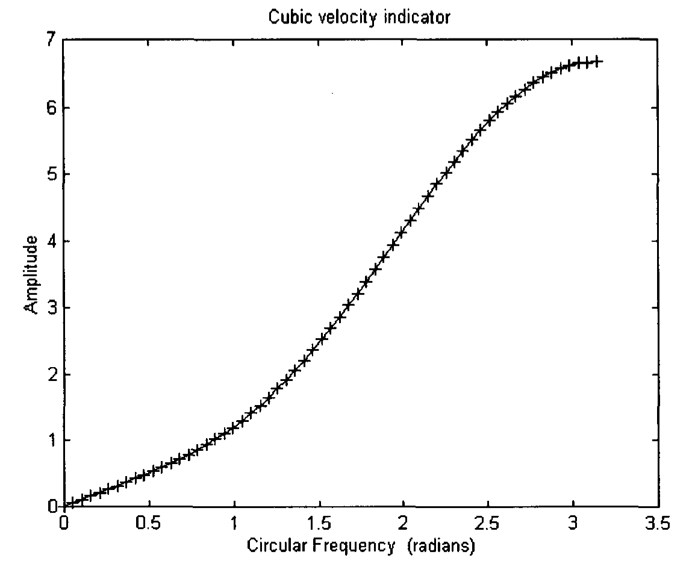
**Fig. A4.7(a).** Amplitude response of a cubic velocity indicator.

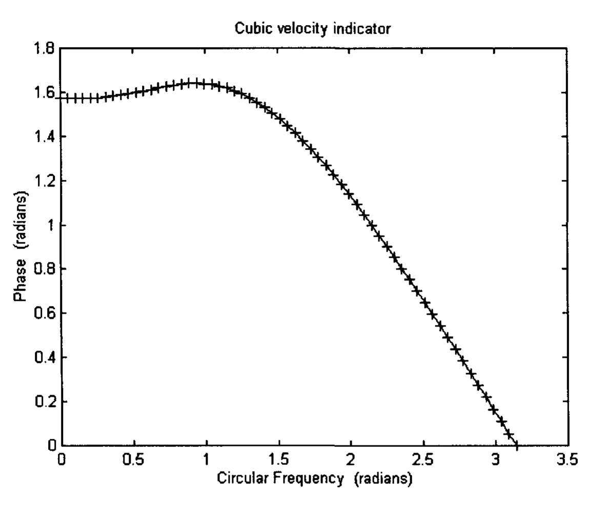
**Fig. A4.7(b).** Phase response of a cubic velocity indicator.

## A4.6 Cubic Acceleration Indicator

Taking the second derivative of Eq (A4.28) or the derivative of Eq (A4.31), we get

$$\frac{d^2 x}{dn^2} = 6cn + 2d \tag{A4.36}$$

At $n = 0$,

$$\frac{d^2 x}{dn^2}\bigg|_{n=0} = 2d = 2x_0 - 5x_{-1} + 4x_{-2} - x_{-3} \tag{A4.37}$$

We will define the unit sample response $h$ of the cubic acceleration indicator as

$$h = (h(0), h(1), h(2), h(3)) = (2, -5, 4, -1) \tag{A4.38}$$

The output response is given by the convolution sum

$$y(n) = 2x(n) - 5x(n-1) + 4x(n-2) - x(n-3) \tag{A4.39}$$

The frequency response or DTFT of $h$ is given by

$$H(\omega) = 2 - 5\exp(-i\omega) + 4\exp(-2i\omega) - \exp(-3i\omega) \tag{A4.40}$$

The amplitude and phase of $H(\omega)$ are plotted in Figs. A4.8(a) and (b). Comparing to the phase of the parabolic acceleration indicator in Fig. A4.6(b), the phase of the cubic acceleration indicator in Fig. A4.8(b) has much less phase lag from the ideal case of $\pi$ phase lead.

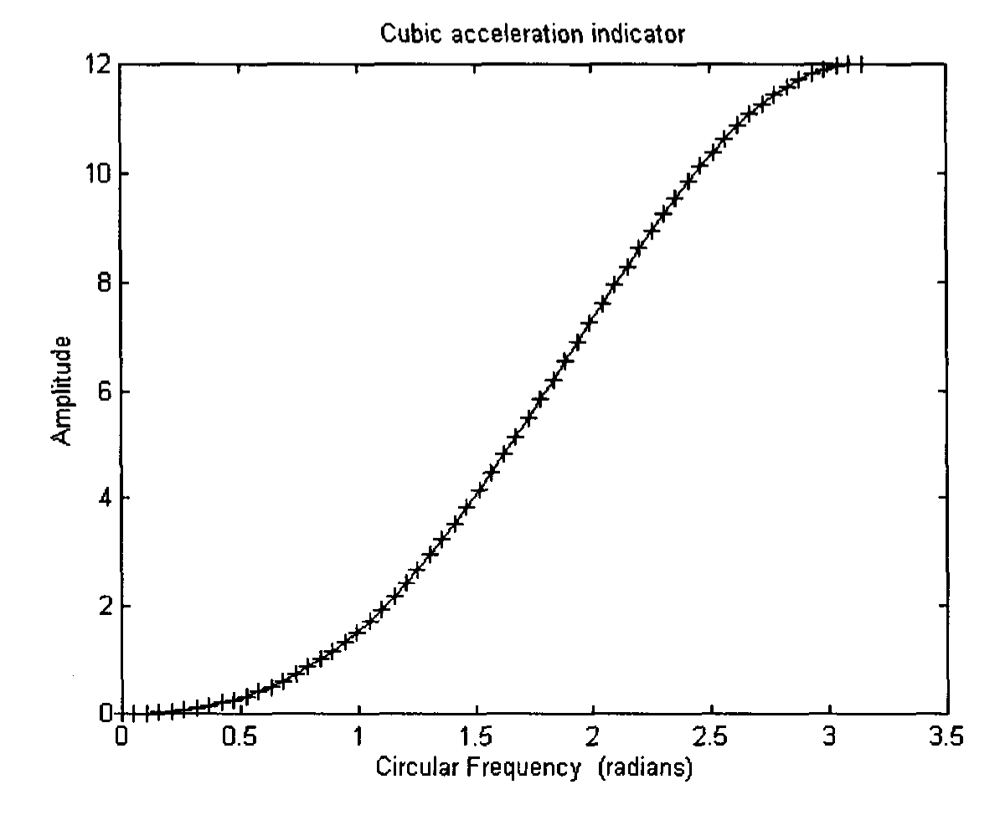
**Fig. A4.8(a).** Amplitude response of a cubic acceleration indicator.

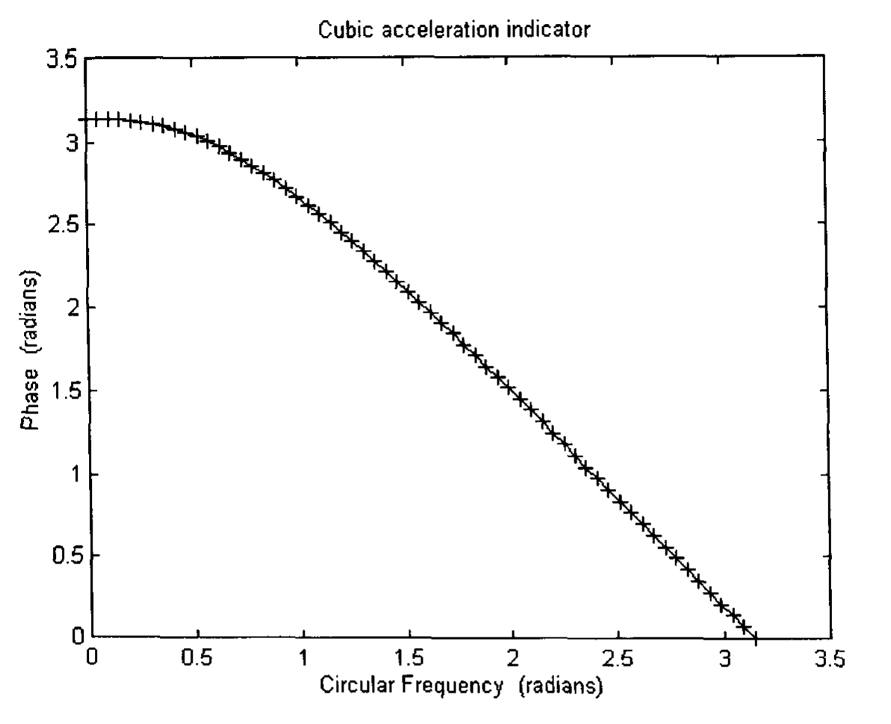
**Fig. A4.8(b).** Phase response of a cubic acceleration indicator.

## A4.7 Properties of a Cubic Function

We will investigate the behavior of a continuous cubic function, which is given by Eq (A4.27). We will then take a look and see whether a cubic function can fit piecewise a signal which consists of the summation of two sine waves. Taking first and second derivatives of Eq (A4.27), we get

$$\frac{dx}{dt} = 3ct^2 + 2dt + e \tag{A4.41}$$

$$\frac{d^2 x}{dt^2} = 6ct + 2d \tag{A4.42}$$

Equating Eq (A4.42) to zero, we get

$$t_m = \frac{-d}{3c} \tag{A4.43}$$

which is the point where the curvature of the cubic function changes sign. Substituting $t_m$ into Eq (A4.27) yields

$$x_m = -\frac{d^3}{27c^2} + et_m + f \tag{A4.44}$$

It can be shown that the cubic function is symmetric with respect to $(t_m, x_m)$ as the symmetric point with respect to $(t_m, x_m)$ of every point of the cubic function is also a point of the cubic function (Ayres 1958). Equating Eq (A4.41) to zero will yield the two points $t_-$ and $t_+$ where the slopes are zero; $t_- < t_m < t_+$.

$$t_{\pm} = \frac{-d \pm \sqrt{d^2 - 3ce}}{3c} \tag{A4.45}$$

Substituting Eq (A4.45) into Eq (A4.27) yields

$$x_{\pm} = x_m \pm \frac{2(d^2 - 3ce)^{3/2}}{27c^2} \tag{A4.46}$$

It can be shown that, for Eqs (A4.45) and (A4.46), when $c > 0$, the positive square root of $(d^2 - 3ce)$ should be taken, while when $c < 0$, the negative square root of $(d^2 - 3ce)$ should be taken.

Can a cubic function simulate summation of sine waves piecemeal and pinpoint its turning points? A plot of the summation of two sine waves, one with amplitude of 1.0 and circular frequency of $\pi/4$ radian and the other with amplitude of 2.0 and circular frequency of $\pi/16$ radian is given in Fig. A4.9. Four of the points (marked as o) were provided for fitting to a cubic function. The two turning points were calculated and plotted (marked as x). It can be seen that the calculated points correspond to the actual turning points quite well. This provides some evidence that for a summation of two sine waves, a fitted cubic function can forecast the turning points quite well if the four points used for fitting are not too far from the turning points. This property will be employed when we introduce the cubic vertex indicator in the next appendix.

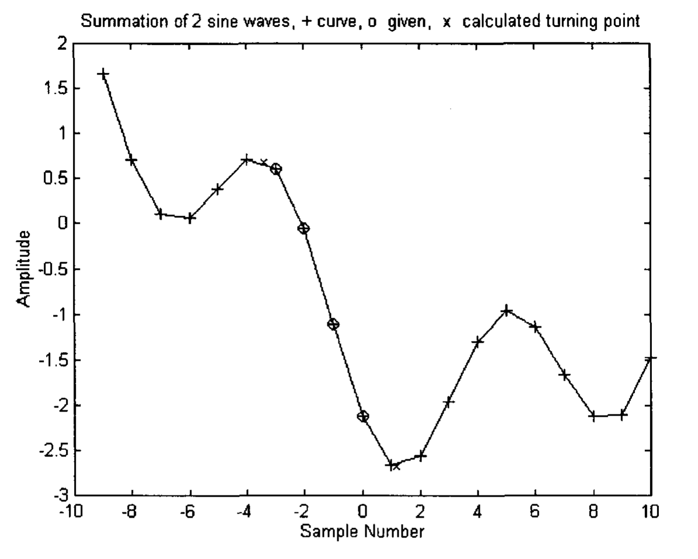
**Fig. A4.9.** Summation of two sine waves (marked as +). Four of the points (marked as o) were used to fit a cubic function, which was then used to calculate two turning points (marked as x).
