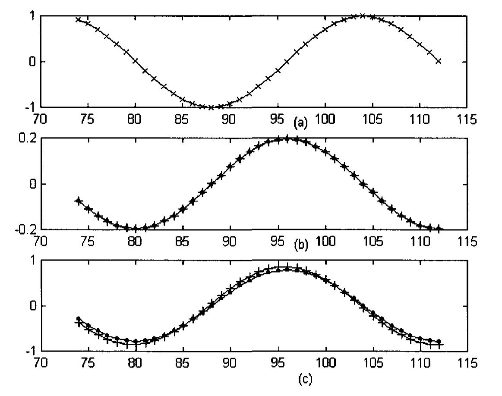

# Appendix 6: Downsampling and Upsampling

Traders work in different timeframes, e.g. 15-minutes chart, 60-minutes chart, etc. A 15-minutes chart can be reduced to a 60-minutes chart. This involves a concept called downsampling. Downsampling is significant as it transforms the frequency content of a signal.

Before we discuss the concept of downsampling, we will introduce two other concepts, the delay operator and the advance operator.

The shift or delay operator, $S$, is a linear operator and can be represented by a matrix (Strang and Nguyen 1997). It is a causal operator and can be written as a lower triangular matrix:

$$S\mathbf{x} = \begin{bmatrix} \cdots & 0 & 0 & 0 & 0 & \cdots \\ \cdots & 1 & 0 & 0 & 0 & \cdots \\ \cdots & 0 & 1 & 0 & 0 & \cdots \\ \cdots & 0 & 0 & 1 & 0 & \cdots \end{bmatrix} \begin{bmatrix} x(-2) \\ x(-1) \\ x(0) \\ x(1) \\ x(2) \end{bmatrix} = \begin{bmatrix} x(-2) \\ x(-1) \\ x(0) \\ x(1) \end{bmatrix} = \begin{bmatrix} y(-1) \\ y(0) \\ y(1) \\ y(2) \end{bmatrix} \tag{A6.1}$$

where $\mathbf{x}$ is the input and $\mathbf{y}$ is the output.

We can also simply write

$$y(n) = x(n-1) \tag{A6.2}$$

This is similar to the situation where time is continuous. A graph of $f(t)$, when shifted one unit time to the right, becomes the graph of $f(t-1)$. The delayed function $f_d(t)$, can be written as

$$f_d(t) = f(t-1) \tag{A6.3}$$

At $t = 1$, the delayed function equals the original function at $t = 0$.

The advance operator or $S$ inverse, $S^{-1}$, has an effect opposite to $S$. It can be written as an upper triangular matrix:

$$S^{-1}\mathbf{x} = \begin{bmatrix} \cdots & 0 & 1 & 0 & 0 & \cdots \\ \cdots & 0 & 0 & 1 & 0 & \cdots \\ \cdots & 0 & 0 & 0 & 1 & \cdots \\ \cdots & 0 & 0 & 0 & 0 & \cdots \end{bmatrix} \begin{bmatrix} x(-1) \\ x(0) \\ x(1) \\ x(2) \\ x(3) \end{bmatrix} = \begin{bmatrix} x(0) \\ x(1) \\ x(2) \\ x(3) \end{bmatrix} = \begin{bmatrix} y(-1) \\ y(0) \\ y(1) \\ y(2) \end{bmatrix} = \mathbf{y} \tag{A6.4}$$

Thus,

$$y(n) = x(n + 1) \tag{A6.5}$$

It can be shown that

$$S^{-1}S\mathbf{x} = SS^{-1}\mathbf{x} = \mathbf{x} \tag{A6.6}$$

or, more generally

$$S^{-n}S^n\mathbf{x} = S^nS^{-n}\mathbf{x} = \mathbf{x} \tag{A6.7}$$

As we discussed in Appendix 2, the Discrete Time Fourier Transform of the unit sample response, $H$, is shift-invariant. This property can be written as

$$H(S\mathbf{x}) = S(H\mathbf{x}) \tag{A6.8}$$

A shift of the input causes a shift of the output.

As each column of $H$ is a delay of the previous column, and all elements of the $n$th diagonal equals $h(n)$, we can write

$$H = \sum h(n) S^n \tag{A6.9}$$

## A6.1 Downsampling

The sequence $v(n) = x(Mn)$ is formed by taking every $M$th sample of $x(n)$. This operation is called downsampling or decimation (Hayes 1999, Strang and Nguyen 1997).

When every other component is removed, downsampling is represented by the symbol $(\downarrow 2)$ (pronounced "down two"), which can be written as a matrix. When odd-numbered components are removed, the matrix form of downsampling is

$$(\downarrow 2)\mathbf{x} = \begin{bmatrix} \cdots & 1 & 0 & 0 & 0 & 0 & \cdots \\ \cdots & 0 & 0 & 1 & 0 & 0 & \cdots \\ \cdots & 0 & 0 & 0 & 0 & 1 & \cdots \end{bmatrix} \begin{bmatrix} x(-2) \\ x(-1) \\ x(0) \\ x(1) \\ x(2) \end{bmatrix} = \begin{bmatrix} x(-2) \\ x(0) \\ x(2) \end{bmatrix} = \begin{bmatrix} v(-1) \\ v(0) \\ v(1) \end{bmatrix} = \mathbf{v} \tag{A6.10}$$

The $n$th component of $\mathbf{v} = (\downarrow 2)\mathbf{x}$ is the $(2n)$th component of $\mathbf{x}$, i.e.,

$$v(n) = x(2n) \tag{A6.11}$$

This downsampling matrix is, thus, the identity matrix, $I$, with odd-numbered rows removed. The identity matrix is a matrix with diagonal elements being 1 and all other elements 0.

In stock market charts, $(\downarrow 2)$ data in the 15-minutes chart will yield the 30-minutes chart; $(\downarrow 4)$ data in the 15-minutes chart will yield the 60-minutes chart.

## A6.2 Upsampling

The transpose of downsampling, $(\downarrow 2)^T$, is upsampling:

$$(\downarrow 2)^T = (\uparrow 2) \tag{A6.12}$$

Upsampling puts zero into the odd-numbered components:

$$u(n) = \begin{cases} v(k) & \text{if } n = 2k \\ 0 & \text{if } n = 2k + 1 \end{cases} \tag{A6.13}$$

The matrix form of upsampling is

$$(\uparrow 2)\mathbf{v} = \begin{bmatrix} \cdots & 1 & 0 & 0 & \cdots \\ \cdots & 0 & 0 & 0 & \cdots \\ \cdots & 0 & 1 & 0 & \cdots \\ \cdots & 0 & 0 & 0 & \cdots \\ \cdots & 0 & 0 & 1 & \cdots \end{bmatrix} \begin{bmatrix} v(-1) \\ v(0) \\ v(1) \end{bmatrix} = \begin{bmatrix} v(-1) \\ 0 \\ v(0) \\ 0 \\ v(1) \end{bmatrix} = \begin{bmatrix} u(-2) \\ u(-1) \\ u(0) \\ u(1) \\ u(2) \end{bmatrix} = \mathbf{u} \tag{A6.14}$$

The upsampling matrix is the matrix with zero rows being inserted between the rows of the identity matrix.

It can be shown that

$$(\downarrow 2)(\uparrow 2) = I \tag{A6.15}$$

However,

$$(\uparrow 2)(\downarrow 2) \neq I \tag{A6.16}$$

as $(\downarrow 2)$ removes the odd-numbered components and $(\uparrow 2)$ replaces the lost components by zeros. Thus,

$$(\downarrow 2)(\uparrow 2)\mathbf{x} = \mathbf{x} \tag{A6.17}$$

But,

$$(\uparrow 2)(\downarrow 2)\mathbf{x} \neq \mathbf{x} \tag{A6.18}$$

However, we can reconstruct $\mathbf{x}$ if we can make use of the delay and advance operators:

$$S^{-1}(\uparrow 2)(\downarrow 2)S\mathbf{x} + (\uparrow 2)(\downarrow 2)\mathbf{x} = \mathbf{x} \tag{A6.19}$$

or, more generally,

$$\sum_{\ell=0}^{N-1} S^{-\ell}(\uparrow M)(\downarrow M)S^\ell \mathbf{x} = \mathbf{x} \tag{A6.20}$$

Traders usually use the same operator or indicator in different time frames. Data from a larger time frame (e.g. 60-minutes chart) can be downsampled from a smaller time frame (e.g. 15-minutes chart). So, the question is, what are the differences in operator responses of a signal and a downsampled signal? Let us take a look at an example where the derivative operator, $d/dn$ is used.

Let the signal be $x(n)$.

$$x(n) = \sin\frac{\pi n}{16} \tag{A6.21}$$

$$\frac{d}{dn}x(n) = \frac{\pi}{16}\cos\frac{\pi n}{16} \tag{A6.22}$$

$$[(\downarrow 4)\, x](n) = \sin\frac{\pi n}{4} \tag{A6.23}$$

$$\frac{d}{dn}(\downarrow 4)x\,(n) = \frac{\pi}{4}\cos\frac{\pi n}{4} \tag{A6.24}$$

Comparing Eq (A6.24) with Eq (A6.22), we can see that the amplitude of the response of the derivative operator is larger by a factor of 4 in the $(\downarrow 4)$ timeframe than that of the original timeframe.

In trading, while amplitude plays a role in the traders' decision making, phase (or time) shift plays a more significant role. We will take a look and see how the phase is shifted in the $(\downarrow 4)$ timeframe from that of the original timeframe. The $(\downarrow 4)$ timeframe should, ordinarily, have only a quarter of the number of data points of the original timeframe. The initial point where we start downsampling would determine what phases of the signal we would be seeing. If we would like to see the various phases of the downsampled signal, we would downsample the original signal starting at different adjacent initial points, operate on the downsampled signals and then reconstruct them back as one signal by using upsampling. This process will be represented by the following equation.

$$[D\mathbf{x}](n) = \sum_{\ell=0}^{3} d_\ell x(n) = \sum_{\ell=0}^{3} S^{-\ell}(\uparrow 4)\frac{d}{dn}(\downarrow 4)S^\ell x(n) = \frac{\pi}{4}\cos\frac{\pi}{16}n = 4\frac{d}{dn}x(n) \tag{A6.25}$$

where

$$d_\ell = S^{-\ell}(\uparrow 4)\frac{d}{dn}(\downarrow 4)S^\ell \tag{A6.26}$$

**Fig. A6.1** (a). A sine wave of circular frequency of pi/16 radian (marked as x). (b). The sine wave is filtered with a cubic velocity indicator (marked as +), and compared with its derivative (marked as continuous line). (c). The sine wave is downsampled four (i.e. every fourth point is taken), the downsampled signal is filtered with a cubic velocity indicator (marked as +) and compared with its derivative (marked as dots). The initial point where downsampling starts is shifted and the calculation repeated.

It should be noted that in an ordinary $(\downarrow 4)$ timeframe, traders see only every other four points in Fig. A6.1(c), i.e. $[d_\ell x](n)$ where $\ell = 0, 1, 2, 3$. Only when $\ell = 0$ will there be no phase shift with respect to the original timeframe as shown in Fig. A6.1(b). When $\ell = 1, 2, 3$, the output response of the operator in the $(\downarrow 4)$ timeframe has a phase lag with respect to that in the original timeframe of Fig. A6.1(b). In this particular case, the phase lag is not caused by the derivative operator, but caused by the signal being downsampled. The output signal of the derivative operator leads the input signal by $\pi/2$, which is independent of the frequency of the input signal. However, other operators or indicators, e.g., the cubic velocity indicator is a function of frequency of the input signal. The output signal was compared in Fig. A6.1(b) and Fig. A6.1(c) to the output response of the cubic velocity indicator, which is slightly dependent on frequency. In Fig. A6.1(b), the output response of the cubic velocity indicator almost exactly overlaps with results calculated from the derivative, illustrating that the indicator can simulate the derivative quite well for a frequency of $\pi/16$ radians. In the reconstructed $(\downarrow 4)$ timeframe of Fig. A6.1(c), the response of the cubic velocity indicator operated on a frequency of $\pi/4$ radians has a slight phase lead compared to the derivative. This is consistent with the phase plot of the cubic velocity indicator shown in Fig. A4.7(b).

In the example above, downsampling transforms a single frequency signal to another single frequency signal of the same shape. This may not necessarily be the case, as we will show in the next section.

## A6.3 Downsampling in the Frequency Domain

Downsampling a pure exponential signal, $x(n) = \exp(in\omega)$, is quite straightforward. For example, the $n$th component of $\mathbf{v} = (\downarrow 2)\mathbf{x}$ is

$$v(n) = \exp(i2n\omega) = x(2n) \tag{A6.27}$$

which is a pure exponential with frequency $2\omega$.

The Fourier Transform of Eq(A6.27) should be

$$V(2\omega) = X(\omega) \tag{A6.28}$$

or

$$V(\omega) = X(\omega/2) \tag{A6.29}$$

However, this is not correct.

If $x_0$ is another pure exponential, with frequency $\omega + \pi$, then

$$x_0(n) = \exp[in(\omega + \pi)] \tag{A6.30}$$

The $n$th component of $\mathbf{v}_0 = (\downarrow 2)\mathbf{x}_0$ is

$$v_0(n) = \exp[i2n(\omega + \pi)] = \exp(i2n\omega) \tag{A6.31}$$

which is the same as $v(n)$. Thus $(\downarrow 2)$ yields a frequency $2\omega$ by doubling $\omega$, and also by doubling $\omega + \pi$. The Fourier Transform of $\mathbf{v} = (\downarrow 2)\mathbf{x}$ should be (Strang and Nguyen 1997)

$$V(\omega) = \frac{1}{2}\left[X\left(\frac{\omega}{2}\right) + X\left(\frac{\omega}{2} + \pi\right)\right] \tag{A6.32}$$

This can be extended to $(\downarrow M)$. The $n$th component of $\mathbf{v} = (\downarrow M)\mathbf{x}$ is

$$v(n) = x(Mn) \tag{A6.33}$$

whose Fourier Transform is (Strang and Nguyen 1997)

$$V(\omega) = \frac{1}{M}\left[X\left(\frac{\omega}{M}\right) + X\left(\frac{\omega}{M} + \frac{2\pi}{M}\right) + \cdots + X\left(\frac{\omega + (M-1)2\pi}{M}\right)\right] \tag{A6.34}$$

Thus, there are $M-1$ aliases in downsampling. Given a sequence $x(n)$, ambiguity exists as to what frequency or mixture of frequencies the original signal contains. This problem can be solved by eliminating the high frequency components from the original signal by applying a low pass filter. Downsampling is then performed on the filtered signal.
