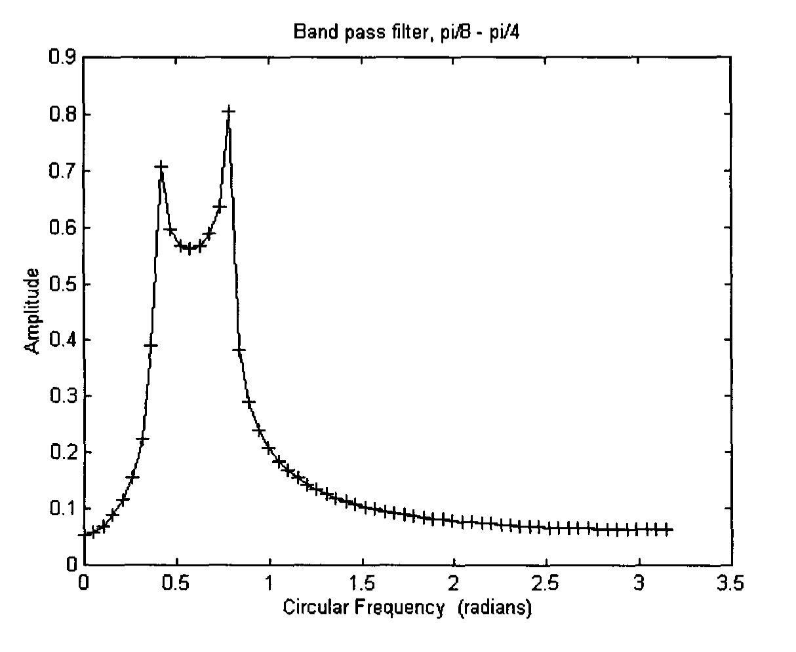
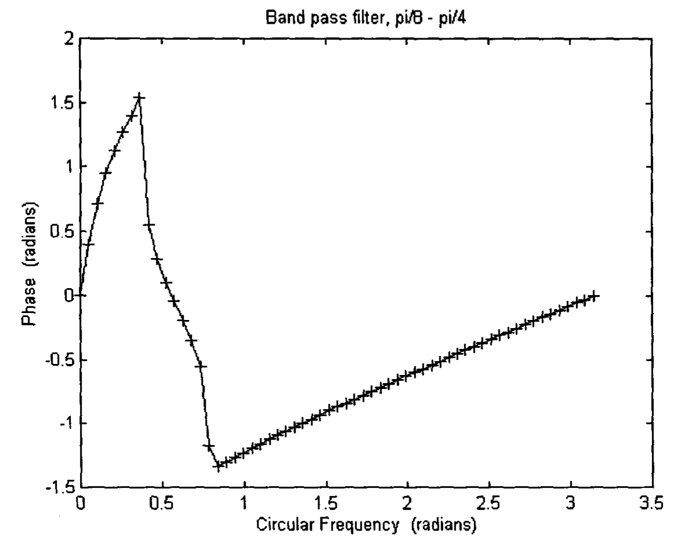
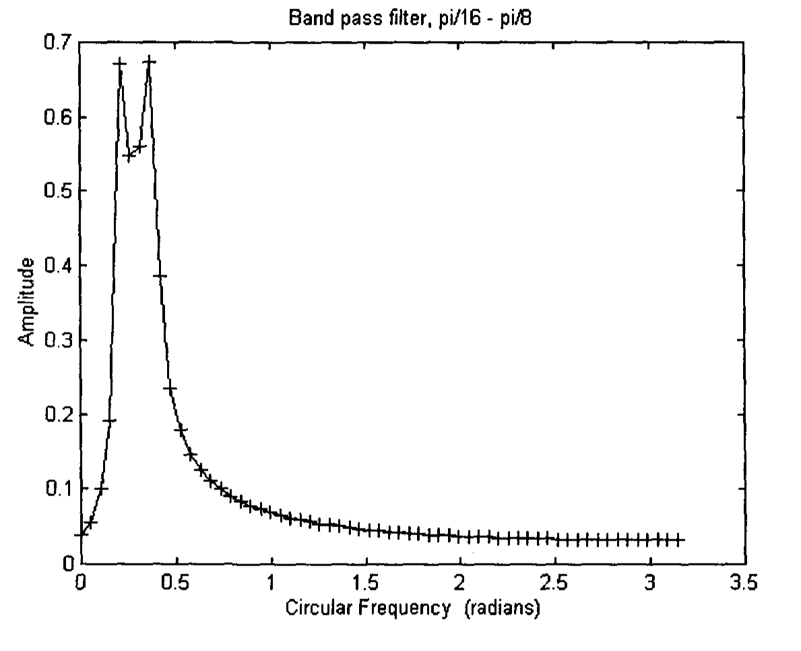
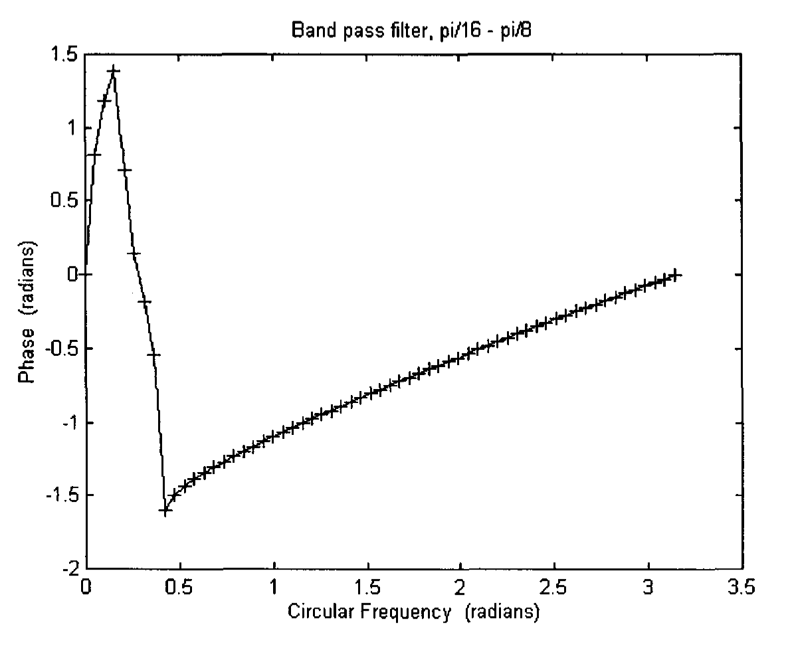
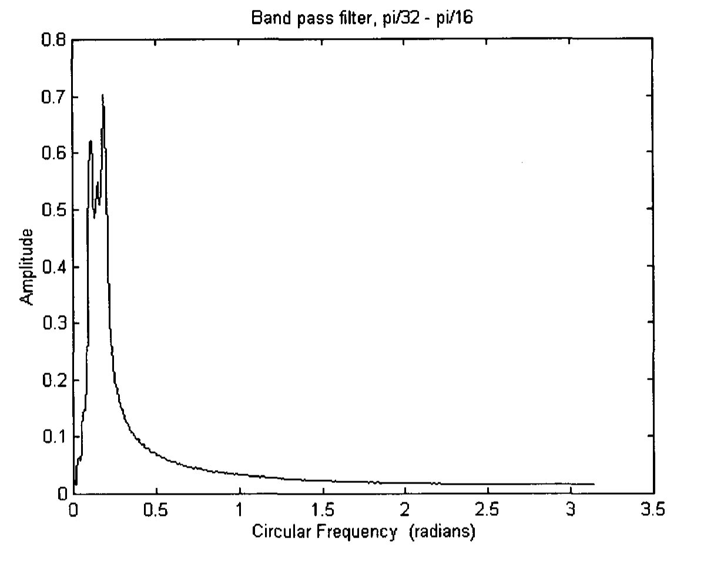
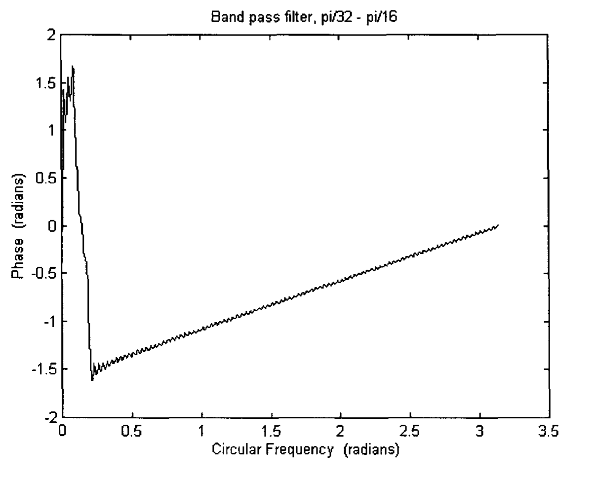

# Appendix 7: Wavelets

Wavelet analysis can be considered as an extension of Fourier Analysis. We will first take a look at Fourier Analysis.

## A7.1 Fourier Analysis

A periodic function $f(t)$ with period $T_0$ can be represented as a sum of sines and cosines, which is called a Fourier series given by the expression (Brigham 1974, p75).

$$f(t) = \frac{a_0}{2} + \sum_{n=1}^{\infty} [a_n \cos(2\pi n f_0 t) + b_n \sin(2\pi n f_0 t)] \tag{A7.1}$$

where $f_0$ is the fundamental frequency and is equal to $1/T_0$. The coefficients are given by the integrals

$$a_n = \frac{2}{T_0} \int_{-T_0/2}^{T_0/2} f(t) \cos(2\pi n f_0 t) \, dt \qquad n = 0, 1, 2, 3, \ldots \tag{A7.2}$$

$$b_n = \frac{2}{T_0} \int_{-T_0/2}^{T_0/2} f(t) \sin(2\pi n f_0 t) \, dt \qquad n = 1, 2, 3, \ldots \tag{A7.3}$$

Eq (A7.1) can be expressed as sine waves only, with phases, $\theta_n$.

$$f(t) = \frac{a_0}{2} + \sum_{n=1}^{\infty} c_n \sin(2\pi n f_0 t + \theta_n) \tag{A7.4}$$

where

$$c_n = \sqrt{a_n^2 + b_n^2} \qquad n = 1, 2, 3, \ldots \tag{A7.5}$$

$$\theta_n = \tan^{-1}\left(\frac{a_n}{b_n}\right) \qquad n = 1, 2, 3, \ldots \tag{A7.6}$$

If the function $f(t)$ is not periodic, we can assume that it is periodic with period $T_0$ equals to the whole sampling time interval. If we know $c_n$ and $\theta_n$, we can plot out each individual sine wave and observe which direction each one is heading.

However, Fourier Analysis has its limitation. Its building blocks are sines and cosines, which oscillate for all time. Therefore, it does not work well with signals of short duration. For example, the Fourier Analysis of a pulse-like signal will yield a large number of waves with high frequency — each of very long duration. When they are added together, they cancel one another out except at the point when they strengthen one another to produce the pulse. Thus, a Fourier Transform cannot give us information about time. Furthermore, it is also highly susceptible to errors. If there is a mistake in the last few minutes of an one-hour signal, the mistake will corrupt the whole Fourier Transform (Hubbard 1998, p23), as the information in one part of a signal is spread throughout the whole transform.

Fourier Analysis requires us to choose between time or frequency. But quite often, we would like to know both time and frequency rather accurately. Windowed Fourier Transform solves some of the problems. Each window corresponds to a specific interval of time, and the frequencies of the signal within that window is analyzed. As each window has a fixed finite length, it imposes quite some drawback. The smaller the window, the more accurate a sharp pulse can be located, but the lower frequency components in the signal will not be observed. If a bigger window is chosen, more of the low frequencies can be seen, but at the sacrifice of locating an event in time.

## A7.2 Wavelet Analysis

A new mathematical technique, called wavelet analysis, can resolve the above-mentioned difficulty. It uses local basis functions called wavelets that can be stretched and translated, thus allowing a flexible resolution in both frequency and time. The window narrows when high frequency signals need to be focused and widens when low frequency signals need to be searched (Lau and Weng 1995).

One of the best known wavelet system is that formed by the sinc function which is written as

$$\phi(t) = \text{sinc}(\pi t) = \frac{\sin(\pi t)}{\pi t} \tag{A7.7}$$

Its Fourier Transform, i.e., its representation in the frequency domain, is a rectangular function and is thus confined to a finite duration, i.e., supported compactly.

Fourier Transform is defined as (Brigham 1974)

$$\Phi(f) = \int_{-\infty}^{\infty} \phi(t) \exp(-i 2\pi f t) \, dt \tag{A7.8}$$

or

$$\Phi(\omega) = \int_{-\infty}^{\infty} \phi(t) \exp(-i\omega t) \, dt \tag{A7.9}$$

while inverse Fourier Transform is defined as

$$\phi(t) = \int_{-\infty}^{\infty} \Phi(f) \exp(i 2\pi f t) \, df \tag{A7.10}$$

or

$$\phi(t) = \frac{1}{2\pi} \int_{-\infty}^{\infty} \Phi(\omega) \exp(i\omega t) \, d\omega \tag{A7.11}$$

The Fourier Transform of the sinc function is given by (Rao and Bopardikar 1998, p72)

$$\Phi(\omega) = \int_{-\infty}^{\infty} \frac{\sin(\pi t)}{\pi t} \exp(-i\omega t) \, dt = \begin{cases} 1 & |\omega| < \pi \\ 0 & \text{otherwise} \end{cases} \tag{A7.12}$$

and is thus bandlimited to the frequency range $-\pi < \omega < \pi$.

In order to qualify as a scaling function, which is the father of wavelets (Hubbard 1998), $\phi(t)$ has to satisfy a two-scale relation (sometimes called the dilation equation or the multi-resolution analysis (MRA) equation) (Rao and Bopardikar 1998, Strang and Nguyen 1997).

$$\phi(t) = 2 \sum_k h(k) \phi(2t - k) \tag{A7.13}$$

where $h(k)$ is the unit impulse response, $k$ being an integer. This means that $\phi(t)$ can be expressed in terms of a weighted sum of shifted $\phi(2t)$.

Eq (A7.13) can be written as

$$\phi(t/2) = 2 \sum_k h(k) \phi(t - k) \tag{A7.14}$$

Taking Fourier Transform of Eq (A7.14) will yield the frequency domain equivalent of the two-scale relation

$$\Phi(2\omega) = H(\omega) \Phi(\omega) \tag{A7.15}$$

which can be rewritten as

$$H(\omega) = \frac{\Phi(2\omega)}{\Phi(\omega)} \tag{A7.16}$$

Using Eq (A7.12), $H(\omega)$ can be written as

$$H(\omega) = \begin{cases} 1 & |\omega| < \pi/2 \\ 0 & \text{otherwise} \end{cases} \tag{A7.17}$$

which is an ideal low pass filter with cutoff frequency $\pi/2$.

Its inverse Fourier Transform (see Eq (A2.15)), which is the coefficients of the ideal low pass filter, is given by (Strang and Nguyen 1997, p45)

$$h(k) = \frac{\sin(\pi k / 2)}{\pi k} = \begin{cases} 1/2 & k = 0 \\ \pm 1/(\pi k) & k \text{ odd} \\ 0 & k \text{ even}, k \neq 0 \end{cases} = \begin{cases} 1/2 & k = 0 \\ 1/(\pi k) & k = \pm 1, \pm 5, \ldots \\ -1/(\pi k) & k = \pm 3, \pm 7, \ldots \\ 0 & k \text{ even}, k \neq 0 \end{cases} \tag{A7.18}$$

The sinc function is thus a scaling function, and it is needed to derive the corresponding wavelet.

But first, an ideal highpass filter $H_1(\omega)$ needs to be constructed. It is orthogonal to the ideal lowpass filter $H(\omega)$, as we can simply set $H_1 = 1$ in the interval where $H = 0$ (Strang and Nguyen 1997)

$$H_1(\omega) = \begin{cases} 0 & |\omega| < \pi/2 \\ 1 & \pi/2 < |\omega| < \pi \end{cases} \tag{A7.19}$$

Its inverse Fourier Transform, which is the coefficient of the ideal high pass filter is given by

$$h_1(k) = \frac{\sin(\pi k)}{\pi k} - \frac{\sin(\pi k / 2)}{\pi k} = \begin{cases} 1/2 & k = 0 \\ -1/(\pi k) & k \text{ odd} \\ 0 & k \text{ even}, k \neq 0 \end{cases} = \begin{cases} 1/2 & k = 0 \\ +1/(\pi k) & k = \pm 1, \pm 5, \ldots \\ 0 & k = \pm 3, \pm 7, \ldots \\ 0 & k \text{ even}, k \neq 0 \end{cases} \tag{A7.20}$$

The wavelet $\psi(t)$ is given by one application of the high pass filter (with downsampling) to $\phi(t)$ (Strang and Nguyen 1997, p52; Rao and Bopardikar 1998, p71).

$$\psi(t) = 2 \sum_k h_1(k) \phi(2t - k) \tag{A7.21}$$

Fourier Transform of Eq (A7.21) is given by

$$\Psi(\omega) = H_1\left(\frac{\omega}{2}\right) \Phi\left(\frac{\omega}{2}\right) = \begin{cases} 1 & \text{for } \pi < |\omega| < 2\pi \\ 0 & \text{otherwise} \end{cases} \tag{A7.22}$$

Its inverse Fourier Transform, $\psi(t)$, is the sinc wavelet

$$\psi(t) = \frac{\sin 2\pi t}{\pi t} - \frac{\sin \pi t}{\pi t} \tag{A7.23}$$

This is called the mother wavelet from which a class of expansion functions $\psi_{j,k}(t)$ can be generated (Burrus et al 1998)

$$\psi_{j,k}(t) = 2^{j/2} \psi(2^j t - k) = 2^{j/2} \psi[2^j(t - 2^{-j}k)] \tag{A7.24}$$

where $j$, $k$ are integers. $2^j$ is the scaling of $t$. $2^{-j}k$ is the translation in $t$. $2^{j/2}$ maintains the norm of the wavelet at different scales, such that

$$\int_{-\infty}^{\infty} \psi_{j,k}(t) \psi_{\ell,m}(t) \, dt = \delta_{j\ell} \delta_{km} \tag{A7.25}$$

where

$$\delta_{j\ell} = \begin{cases} 1 & \text{when } j = \ell \\ 0 & \text{when } j \neq \ell \end{cases} \tag{A7.26}$$

Thus, $\psi_{j,k}(t)$ forms an orthonormal basis. Any function $f(t)$ can be written as (Burrus et al 1998)

$$f(t) = \sum_k c_{j_0}(k) \phi_{j_0,k}(t) + \sum_k \sum_{j=j_0}^{\infty} d_j(k) \psi_{j,k}(t) \tag{A7.27}$$

where $\phi_{j_0,k}(t) = 2^{j_0/2} \phi(2^{j_0} t - k)$ \tag{A7.28}

The coefficients in this wavelet expansion are called the discrete wavelet transform (DWT) of the signal $f(t)$. They are similar to the Fourier series expansion in the Fourier Analysis. These wavelet coefficients can be calculated by inner products

$$c_{j_0}(k) = \langle f(t), \phi_{j_0,k}(t) \rangle = \int f(t) \phi_{j_0,k}(t) \, dt \tag{A7.29}$$

and

$$d_j(k) = \langle f(t), \psi_{j,k}(t) \rangle = \int f(t) \psi_{j,k}(t) \, dt \tag{A7.30}$$

For any practical signal that is bandlimited, there will be an upper scale $j = J$, above which the wavelet coefficients, $d_j(k)$, are very small. Thus, a signal $f(t)$ can be written as

$$f(t) = \sum_k c_{j_0}(k) \phi_{j_0,k}(t) + \sum_k \sum_{j=j_0}^{J} d_j(k) \psi_{j,k}(t) \tag{A7.31}$$

Ignoring $k$ (which represents translation in $t$) in Eq (A7.24), we can write

$$\psi_j(t) = 2^{j/2} \psi(2^j t) \tag{A7.32}$$

For $j = -3, -4, -5$, the sinc wavelets are

$$\psi_{-3}(t) = 2^{-3/2} \left( \frac{\sin(\pi t / 4)}{\pi t} - \frac{\sin(\pi t / 8)}{\pi t} \right) \tag{A7.33}$$

$$\psi_{-4}(t) = 2^{-2} \left( \frac{\sin(\pi t / 8)}{\pi t} - \frac{\sin(\pi t / 16)}{\pi t} \right) \tag{A7.34}$$

$$\psi_{-5}(t) = 2^{-5/2} \left( \frac{\sin(\pi t / 16)}{\pi t} - \frac{\sin(\pi t / 32)}{\pi t} \right) \tag{A7.35}$$

Ignoring the numerical factor on the RHS, the Fourier Transform of Eq (A7.33) – (A7.35) are

$$\frac{\sin(\pi t / 4)}{\pi t} - \frac{\sin(\pi t / 8)}{\pi t} \longleftrightarrow \begin{cases} 1 & \pi/8 < |\omega| < \pi/4 \\ 0 & \text{otherwise} \end{cases} \tag{A7.36}$$

$$\frac{\sin(\pi t / 8)}{\pi t} - \frac{\sin(\pi t / 16)}{\pi t} \longleftrightarrow \begin{cases} 1 & \pi/16 < |\omega| < \pi/8 \\ 0 & \text{otherwise} \end{cases} \tag{A7.37}$$

$$\frac{\sin(\pi t / 16)}{\pi t} - \frac{\sin(\pi t / 32)}{\pi t} \longleftrightarrow \begin{cases} 1 & \pi/32 < |\omega| < \pi/16 \\ 0 & \text{otherwise} \end{cases} \tag{A7.38}$$

Thus, wavelets are essentially bandpass filters. They are called "constant-Q" filters as the ratio of the band width to the center frequency of the band is constant. It should be noted that in Eq (A7.36) – (A7.38), signals that pass through these bandpass filters do not experience any phase shifts, as there is no imaginary part on the RHS. The Fourier integral in these equations integrate from $-\infty$ to $\infty$. This, however, cannot be applied to on-line or real-time applications, where only past but not future data exist. In these applications, the integral integrates from 0 to $\infty$, and the filter is called a causal filter (Strang and Nguyen 1997, Hayes 1999).

The Fourier Transform of a causal low pass filter $[\sin(\omega_0 t)]/(\pi t)$, is given by

$$\int_0^{\infty} \frac{\sin \omega_0 t}{\pi t} \exp(-i\omega t) \, dt = \frac{1}{4} \frac{\omega_0 + \omega}{|\omega_0 + \omega|} + \frac{1}{4} \frac{\omega_0 - \omega}{|\omega_0 - \omega|} + \frac{i}{2\pi} \ln \frac{|\omega_0 + \omega|}{|\omega_0 - \omega|} \tag{A7.39}$$

Thus, the Fourier Transform of a causal band pass filter $[\sin(\omega_0 t)]/(\pi t) - [\sin(\omega_1 t)]/(\pi t)$, where $\omega_1 < \omega_0$, is given by

$$\int_0^{\infty} \left( \frac{\sin \omega_0 t}{\pi t} - \frac{\sin \omega_1 t}{\pi t} \right) \exp(-i\omega t) \, dt$$

$$= \frac{1}{4} \frac{\omega_0 + \omega}{|\omega_0 + \omega|} + \frac{1}{4} \frac{\omega_0 - \omega}{|\omega_0 - \omega|} - \frac{1}{4} \frac{\omega_1 + \omega}{|\omega_1 + \omega|} - \frac{1}{4} \frac{\omega_1 - \omega}{|\omega_1 - \omega|}$$

$$+ \frac{i}{2\pi} \ln \frac{|\omega_0 + \omega| \cdot |\omega_1 + \omega|}{|\omega_0 + \omega| \cdot |\omega_1 - \omega|} \tag{A7.40}$$

As there is an imaginary part in the RHS of Eq (A7.40), any signal of circular frequency $\omega$, will have a phase shift unless

$$-\frac{(\omega_1 + \omega)(\omega_0 - \omega)}{(\omega_1 - \omega)(\omega_0 + \omega)} = 0 \tag{A7.41}$$

The negative sign on the LHS of Eq (A7.41) is required for the frequency band $-\omega_0 < \omega < -\omega_1$ and $\omega_1 < \omega < \omega_0$.

Solving Eq (A7.41)

$$\omega = \sqrt{\omega_1 \omega_0} \tag{A7.42}$$

For $\omega_1 = \omega_0 / 2$,

$$\omega = \omega_0 / \sqrt{2} \tag{A7.43}$$

Table A7.1 lists the higher frequency $\omega_0$ and lower frequency $\omega_1$ of the sinc band pass filters which will ensure zero phase shift of a signal at circular frequency $\omega$.

**Table A7.1.**

|           | $\omega_1$ | $\omega$        | $\omega_0$ |
|-----------|-------------|-----------------|-------------|
| $\psi_{-3}$ | $\pi/8$   | $\pi/(4\sqrt{2})$ | $\pi/4$   |
| $\psi_{-4}$ | $\pi/16$  | $\pi/(8\sqrt{2})$ | $\pi/8$   |
| $\psi_{-5}$ | $\pi/32$  | $\pi/(16\sqrt{2})$ | $\pi/16$ |

The wavelets corresponding to the band pass filters described in Eq (A7.33) – (A7.35) has a continuous variable $t$. They have to be changed to discrete filters in order to convolute with the discrete data. Writing $t = k\Delta t$ where $\Delta t$ is one unit of time interval, which can be a 5 minutes, 15 minutes, etc., $t$ can be changed to $k$. Furthermore, the constant factors on the RHS of Eq (A7.33) – (A7.35) should be ignored. The coefficients corresponding to the discrete band pass filters can be written as

$$h_{-3}(k) = \frac{\sin(\pi k / 4)}{\pi k} - \frac{\sin(\pi k / 8)}{\pi k} \tag{A7.44}$$

$$h_{-4}(k) = \frac{\sin(\pi k / 8)}{\pi k} - \frac{\sin(\pi k / 16)}{\pi k} \tag{A7.45}$$

$$h_{-5}(k) = \frac{\sin(\pi k / 16)}{\pi k} - \frac{\sin(\pi k / 32)}{\pi k} \tag{A7.46}$$

$h_{-3}$, $h_{-4}$, $h_{-5}$ are named high, middle and low wavelet indicator in this book. The $h$'s in Eqs (A7.44) – (A7.46) are different from the $h$ in Eq (A7.13) and $h_1$ in Eq (A7.20). While they are all unit impulse responses, they correspond to different filters. $h_{-3}$ in Eq (A7.44) is plotted in Fig. 9.1. The amplitude and phase of its Fourier Transform are plotted in Figs. A7.1(a) and (b). $h_{-4}$ in Eq (A7.45) is plotted in Fig. 9.2. The amplitude and phase of its Fourier Transform are plotted in Figs. A7.2(a) and (b). $h_{-5}$ in Eq (A7.46) is plotted in Fig. 9.3. The amplitude and phase of its Fourier Transform are plotted in Figs. A7.3(a) and (b). It should be noted that the circular frequencies where the phases are zero in Fig. A7.1(b), Fig. A7.2(b) and Fig. A7.3(b) agree quite well with that shown in Table A7.1.


**Fig. A7.1(a).** Amplitude response of high wavelet indicator.


**Fig. A7.1(b).** Phase response of high wavelet indicator.


**Fig. A7.2(a).** Amplitude response of middle wavelet indicator.


**Fig. A7.2(b).** Phase response of middle wavelet indicator.


**Fig. A7.3(a).** Amplitude response of low wavelet indicator.


**Fig. A7.3(b).** Phase response of low wavelet indicator.

Figure 9.5 plots a 5-minute chart of an US 30 year Treasury Bond Future, $v * h_{-3}$, $v * h_{-4}$ and $v * h_{-5}$ were employed to convolute with the closing price data and were plotted as a thick line, middle thick line and a thin line respectively in the middle plot, $v$ being the cubic velocity indicator. The bottom plot plots

$$(v * h_{-3} + v * h_{-4} + v * h_{-5}) * x = v * (h_{-3} + h_{-4} + h_{-5}) * x \tag{A7.47}$$

where $x$ is the closing price data. $h_{-3} + h_{-4} + h_{-5}$ is equivalent to a band pass filter which will transmit circular frequency from $\pi/32$ to $\pi/4$ radian.

## A7.3 Coefficients of the Sinc Wavelet Indicators

The indicator coefficients $h_{-3}$, $h_{-4}$ and $h_{-5}$ are listed below. The first row of each $h$ corresponds to $k = 0, 1, 2, 3, \ldots$

$h_{-3}$ =

```text
 0.1250  0.1033  0.0466 -0.0230 -0.0796 -0.1038 -0.0906 -0.0496
 0.0000  0.0385  0.0543  0.0472  0.0265  0.0053 -0.0067 -0.0069
 0.0000  0.0061  0.0052 -0.0036 -0.0159 -0.0247 -0.0247 -0.0151
 0.0000  0.0139  0.0209  0.0192  0.0114  0.0029 -0.0031 -0.0033
 0.0000  0.0031  0.0027 -0.0020 -0.0088 -0.0140 -0.0143 -0.0089
 0.0000  0.0085  0.0129  0.0121  0.0072  0.0021 -0.0020 -0.0022
 0.0000  0.0021  0.0019 -0.0014 -0.0061 -0.0098 -0.0101 -0.0063
 0.0000  0.0061  0.0094  0.0088  0.0053  0.0015 -0.0015 -0.0016
 0.0000  0.0016  0.0014 -0.0010 -0.0047 -0.0075 -0.0078 -0.0049
 0.0000  0.0048  0.0073  0.0069  0.0042  0.0012 -0.0012 -0.0013
 0.0000  0.0013  0.0011 -0.0008 -0.0038 -0.0061 -0.0063 -0.0040
 0.0000  0.0039  0.0060  0.0057  0.0035  0.0011 -0.0010 -0.0011
 0.0000  0.0011  0.0010 -0.0007 -0.0032 -0.0051 -0.0053 -0.0034
 0.0000  0.0033  0.0051  0.0049  0.0029  0.0009 -0.0008 -0.0009
 0.0000  0.0009  0.0008 -0.0006 -0.0027 -0.0044 -0.0046 -0.0029
```

$h_{-4}$ =

```text
 0.0625  0.0597  0.0516  0.0391  0.0233  0.0059 -0.0115 -0.0272
-0.0398 -0.0482 -0.0519 -0.0508 -0.0453 -0.0362 -0.0248 -0.0123
 0.0000  0.0108  0.0193  0.0248  0.0266  0.0258  0.0229  0.0189
 0.0133  0.0076  0.0027 -0.0011 -0.0033 -0.0040 -0.0034 -0.0019
 0.0000  0.0018  0.0033  0.0030  0.0272  0.0026  0.0008 -0.0018
-0.0049 -0.0080 -0.0106 -0.0124 -0.0130 -0.0123 -0.0105 -0.0075
-0.0039  0.0000  0.0038  0.0069  0.0092  0.0104  0.0105  0.0096
 0.0079  0.0057  0.0033  0.0012 -0.0005 -0.0016 -0.0019 -0.0017
-0.0009  0.0000  0.0009  0.0016  0.0014  0.0017  0.0004 -0.0010
-0.0027 -0.0044 -0.0059 -0.0070 -0.0074 -0.0071 -0.0061 -0.0044
-0.0023  0.0000  0.0023  0.0042  0.0057  0.0065  0.0066  0.0060
 0.0050  0.0036  0.0021  0.0008 -0.0003 -0.0010 -0.0013 -0.0011
-0.0006  0.0000  0.0006  0.0011  0.0012  0.0009  0.0003 -0.0007
-0.0018 -0.0031 -0.0041 -0.0049 -0.0052 -0.0050 -0.0043 -0.0032
-0.0017  0.0000  0.0016  0.0030  0.0041  0.0047  0.0048  0.0044
 0.0036  0.0027
```

$h_{-5}$ =

```text
 0.0312  0.0309  0.0299  0.0281  0.0258  0.0229  0.0195  0.0158
 0.0117  0.0073  0.0029 -0.0015 -0.0058 -0.0098 -0.0136 -0.0170
-0.0199 -0.0223 -0.0241 -0.0253 -0.0260 -0.0260 -0.0254 -0.0243
-0.0226 -0.0206 -0.0181 -0.0154 -0.0124 -0.0093 -0.0061 -0.0030
 0.0000  0.0028  0.0054  0.0077  0.0096  0.0112  0.0124  0.0132
 0.0136  0.0136  0.0133  0.0127  0.0118  0.0107  0.0094  0.0081
 0.0066  0.0052  0.0038  0.0025  0.0013  0.0003 -0.0005 -0.0012
-0.0017 -0.0019 -0.0020 -0.0019 -0.0017 -0.0014 -0.0010 -0.0005
 0.0000  0.0005  0.0009  0.0013  0.0015  0.0017  0.0017  0.0016
 0.0013  0.0009  0.0004 -0.0002 -0.0009 -0.0017 -0.0024 -0.0032
-0.0040 -0.0047 -0.0053 -0.0058 -0.0062 -0.0064 -0.0065 -0.0064
-0.0062 -0.0058 -0.0052 -0.0046 -0.0038 -0.0029 -0.0020 -0.0010
 0.0000  0.0010  0.0019  0.0027  0.0035  0.0041  0.0046  0.0050
 0.0052  0.0053  0.0053  0.0051  0.0048  0.0044  0.0039  0.0034
 0.0028  0.0023  0.0017  0.0011  0.0006  0.0001 -0.0002 -0.0006
-0.0008 -0.0009 -0.0010 -0.0009 -0.0008 -0.0007 -0.0005 -0.0002
 0.0000  0.0002  0.0005  0.0006  0.0008  0.0009  0.0009  0.0008
 0.0007  0.0005  0.0002 -0.0001 -0.0005 -0.0009 -0.0013 -0.0018
-0.0022 -0.0026 -0.0030 -0.0033 -0.0035 -0.0037 -0.0037 -0.0037
-0.0036 -0.0034 -0.0031 -0.0027 -0.0022 -0.0017 -0.0012 -0.0006
 0.0000  0.0006  0.0011  0.0017  0.0021  0.0025  0.0028  0.0031
 0.0032  0.0033  0.0033  0.0032  0.0030  0.0028  0.0025  0.0022
 0.0018  0.0014  0.0011  0.0007  0.0004  0.0001 -0.0002 -0.0004
-0.0005 -0.0006 -0.0006 -0.0006 -0.0005 -0.0004 -0.0003 -0.0002
 0.0000  0.0002  0.0003  0.0004  0.0005  0.0006  0.0006  0.0006
 0.0005
```

## A7.4 Other Wavelets

In this book, only sinc wavelets have been introduced to analyze market data. Many different kinds of wavelets have been constructed (Von Baeyer 1995, Strang 1994). The analysis wavelet should be carefully matched to the phenomenon of interest so as to bring out the significant information in the signal (Trevino and Andreas 1996). Other wavelets, especially ones with fast decay, should be investigated in the future.

Furthermore, scaling functions are actually low pass filters. They can be employed as powerful trending indicators.
