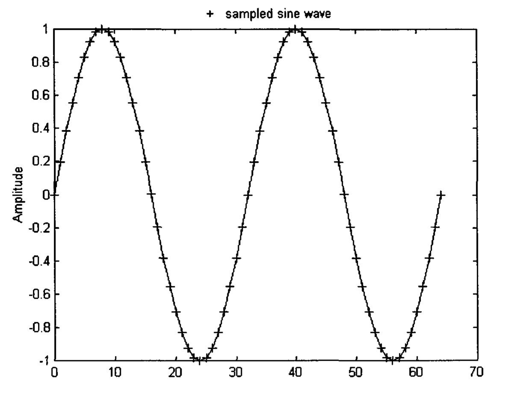
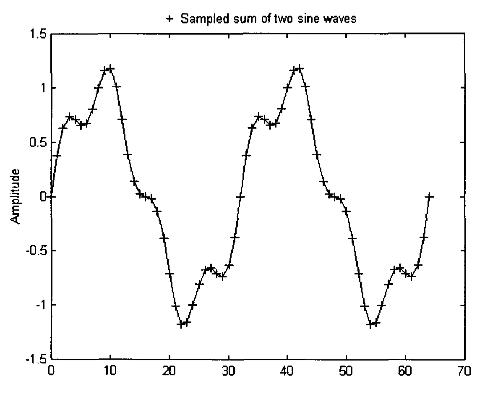
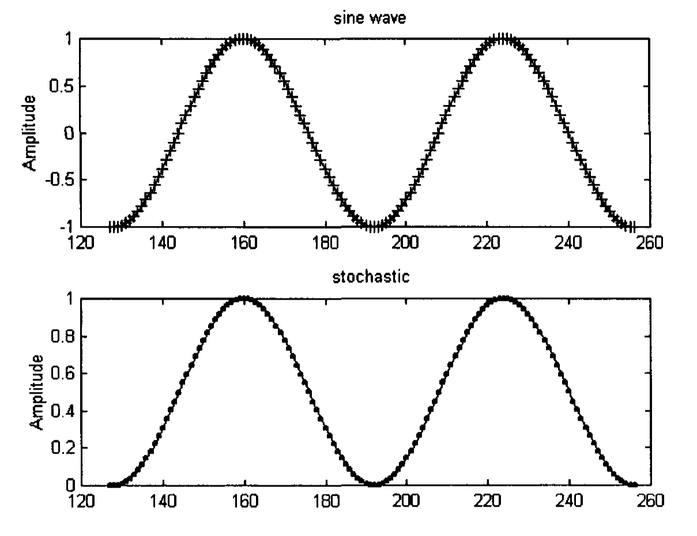
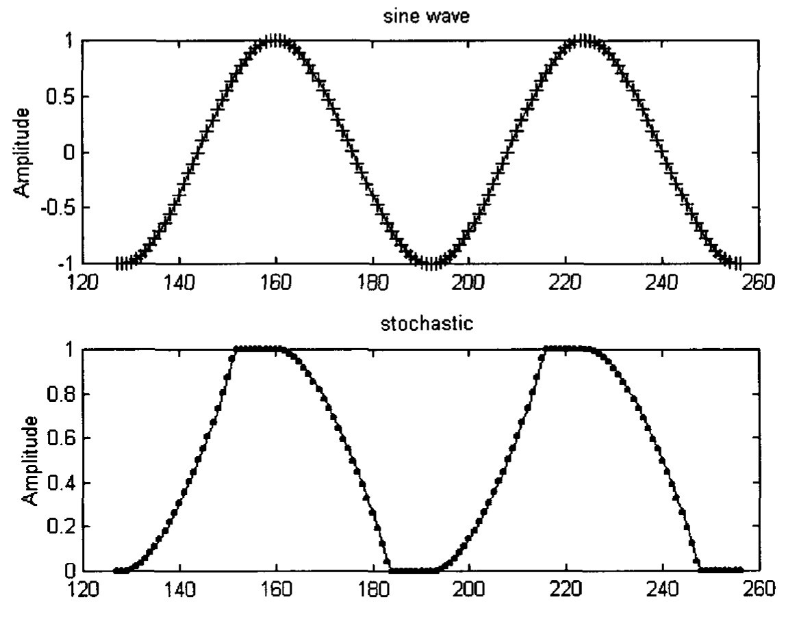
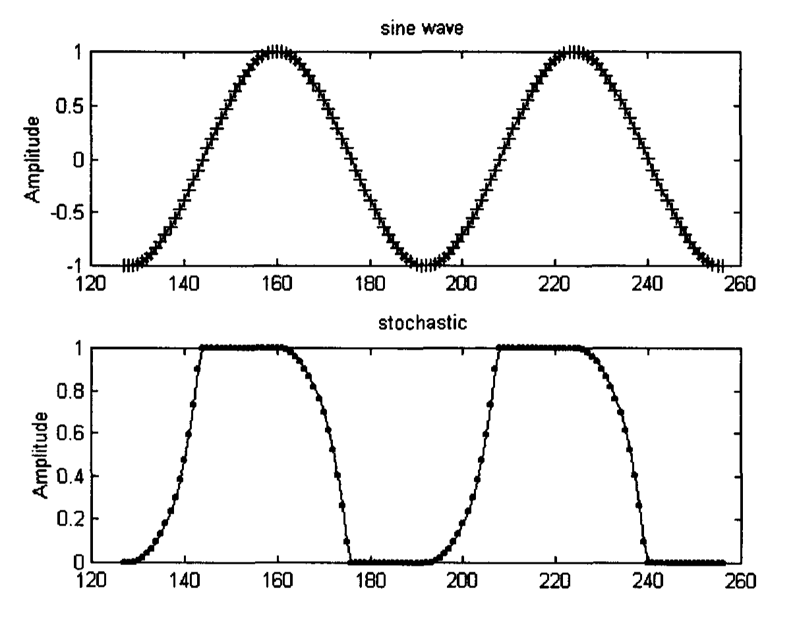
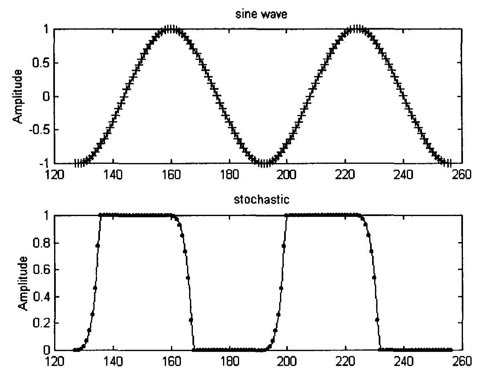

# Chapter 4: Signals and Indicators

This book is about the financial market, but it interprets the market in scientific and mathematical terms. The reason is simple. Quite a number of scientific and mathematical concepts are well established, while some of the financial market concepts are rather evasive. When one reads some books on trading rules on the market, one wonders what is the rationale behind some of these ideas, if there is any at all. Science, generally, can be employed to explain different phenomena. Financial market data, just like any data, can be subjected to scientific and mathematical findings. There is, therefore, no reason why some of the scientific ideas cannot be used to clarify some of the market concepts.

What exactly is a signal in scientific terms? A signal is any physical quantity that changes with time, distance, or any independent variable. A signal depends very much on the tool that we use to extract information from the object under investigation. Given a piece of metal, we can use X-ray or ultrasound or others as a measurement tool. The signal obtained would yield different information about the quality of the metal. The signal originally detected is called raw signal, and it can further be processed to yield information that is hidden and unclear. In the financial market, a raw signal can be the price of commodity futures contracts, or its volume traded in a particular period, or others. A raw signal or a processed signal is a dependent variable; its changes depending on the changes of an independent variable, which is usually taken to be time in the financial market. What technical analysts would like to see is what predicament they can draw from processing the raw signal or data from the market. In general, as money is the bottom line of any trade, price is the most important raw signal that they would process and analyze.

Taking time to be the independent variable, a signal can be considered as a time-varying process. A signal continuous with respect to time is called a continuous-time signal or an analog signal. If it is a function of an integer-valued time variable, $n$, it is called a discrete-time signal or a digitized signal (Lyons 1997, Hayes 1999). Discrete-time signals are often derived by sampling a continuous-time signal, with an analog-to-digital converter. However, a signal can be a discrete-time signal to start with. An example is the tick data in the financial market. A tick is the upward or downward price movement in a security's trade. There can be, e.g., 10 tick data within one minute of trading. To condense all these information, tick data are quite often sampled within a predetermined time interval. For example, in a 10-minute chart, the price of the opening tick and the closing tick, as well as the highest and lowest tick during every 10-minute interval are plotted in the chart. This particular way of plotting data in the financial market differs from that of other disciplines where the closing value in a certain time period is usually taken. This is because traders believe that the high, low, open and close prices do contribute some information with regard to the market activity. In an hourly chart, again, all these four prices are plotted within every hourly interval. In general, the closing prices are more often used to be the raw data. Occasionally, the average of the high and low prices is taken. However, taking the closing prices are more convenient. Furthermore, it is consistent with the mathematical concept of sampling, as, e.g., the closing price of the hourly chart can be obtained by sampling every sixth point of the closing prices of the 10-minute chart.

In 1807, a French mathematician Joseph Fourier showed that any practical signal can be expressed as the sum of a number of sine waves. This summation has been called the Fourier series (Broesch 1997, Hubbard 1998). This theorem would allow us to rewrite any financial data as a sum of sine waves. An example of a single sine wave with two cycles and an amplitude of 1.0 is shown in Fig. 4.1. A single sine wave is a sine wave with a single frequency. The sine wave is sampled at thirty-two points per cycle. Thus, the (sampling) period of the sine wave is 32 points. The (sampling) frequency, which is defined as 1/period, equals to 1/32. Since each cycle is equivalent to $2\pi$ radians (which is equal to 360 degrees, the angle subtended by a circle), the (sampling) circular frequency is $2\pi/32$ or $\pi/16$ radian. Figure 4.2 shows the summation of two sine waves, one with a circular frequency of $\pi/4$ with an amplitude of 1/4 and the other with a circular frequency of $\pi/16$ with an amplitude of 1.0.

**Fig. 4.1.** A single sine wave of amplitude 1.0 with a circular frequency of $\pi/16$, i.e., it is sampled at thirty-two points per cycle.

**Fig. 4.2.** A summation of two sine waves, one with a circular frequency of $\pi/4$ with an amplitude of 1/4 and the other with a circular frequency of $\pi/16$ with an amplitude of 1.0.

To accurately reproduce a signal, the Nyquist theorem (Brigham 1974, Broesch 1997) states the signal has to be sampled at a rate greater than twice the frequency of the highest frequency component existing in the signal, i.e., the number of sampling points per cycle has to be more than two for the highest frequency. This is equivalent to saying that the sampling circular frequency for the highest frequency has to be smaller than $\pi$ radians.

The sampling signal, $x$, can be written as

$$x = (\ldots x(N-1), x(N), x(N+1), \ldots x(-1), x(0), x(1), x(2), \ldots) \tag{4.1}$$

For real time applications (as in the financial market), where no future data is available, the signal $x$ will be written as

$$x = (\ldots x(N-1), x(N), x(N+1), \ldots x(-1), x(0)) \tag{4.2}$$

In the financial market, the most common signal is price, which is usually plotted as bars on a chart in a certain timeframe. As technical analysts believe that price is the most important data in market forecasting, this raw price data is processed and may be even further processed to yield any hidden information. Many manipulations or indicators have been created to predict the market's direction. Most indicators can be considered as systems in digital signal processing, or operators in mathematics, or filters in electrical engineering. Once we understand this relationship, it means that we can transfer the knowledge from other fields to understand the properties of old indicators, as well as to create new indicators. Further explanation of systems is given in Appendix 2. An indicator is basically an operator or mapping that transforms an input signal to an output signal by means of a fixed set of rules. The output signal would hopefully expose certain hidden features in the original input signal. The indicator should be tested on theoretical waveforms like sine waves before applying on real market data. This procedure is usually not performed on financial market indicators.

Some of the most popular financial market indicators are actually convolution sum whose output, $y(n)$, is related to the input, $x(n)$ by

$$y(n) = h(0)x(n) + h(1)x(n-1) + h(2)x(n-2) + \ldots \tag{4.3}$$

where $h(k)$, $k = 0, 1, 2, \ldots$ is the indicator coefficient.

What makes a good indicator? An indicator, like any idea or concept in our daily life, is created such that it should serve certain pragmatic purpose. It should be clear what assumptions have been made and under what condition does the concept not apply. To give an example, the concept 'weight' is used to measure the heaviness of an object. Weight is affected by gravitational pull. Thus, the weight of an object measured on the horizon would be larger than that of the same object when it is measured on Mount Everest. Objects are weightless in outer space as the earth is too far away to exert any gravitational pull. If someone makes up a rule saying that the cost of an object of a certain material should be proportional to the weight of the object, then he should understand that the weight varies somewhat with respect to altitude, and that the rule would not apply in outer space. If he would like his rule to apply to all conditions, he would have to look for a different concept, if it exists. In this particular case, he can change his rule to say that the cost should be proportional to mass, as mass of an object is independent of any gravitational pull. (In Physics, mass is defined as weight divide by acceleration due to gravitational pull). Thus, a good indicator should be an indicator that should apply to all or at least most of the situations of interest, and the conditions that it does not apply should be clearly defined and known before hand. This, unfortunately, is rarely the case with indicators of market data. Let us take a look at two examples.

## 4.1 Stochastic Indicator

The first example is stochastic, an indicator which is quite popular with traders. The word stochastic here has a completely different meaning from the probabilistic meaning as described in Chapter 3. The indicator is somehow called stochastic by chance (Ehlers 1992). Stochastic compares the current closing price with the latest high and the latest low in a time window or interval chosen by the trader (Pring 1991, Ehlers 1992, Elder 1993). Examples of time window are 10 minutes, a day, etc. Stochastic, $K$, is defined as

$$K = (C - L)/(H - L) \tag{4.4}$$

where $C$ = closing price of the current bar, $H$ = the highest price in the chosen time window, $L$ = the lowest price in the chosen time window.

Stochastic is therefore not a convolution sum as described in Eq (4.3). It is a normalized function that varies between zero and one. It can be considered as a high pass filter that filters off very low frequency. We will take a look and see how the chosen time window will affect the behavior of the stochastic.

Imagine a market in a cycle mode and the data being simulated is a single sine wave with a period of 64 points (Fig. 4.3(a)), and choose the time window to be the same as the period of the sine wave. The stochastic would have the same shape as the input data, but swings between zero and one (Fig. 4.3(a)). As such, it does not have any time lag from the input data, which will make it perfect for timing turning points. If the time window is chosen to be more than one period, the stochastic would still have the same output response. However, if the high and low of the preceding cycle are different from those of the current cycle, which usually happens in real market situation, the output response would differ in shape from the input response, causing timing errors.

**Fig. 4.3(a).** The top figure shows a single sine wave, and the bottom figure shows its stochastics whose time window equals the period of the sine wave.

If the time window is chosen to be three-quarter of the period of the input sine wave, the stochastic corresponding to the top of the sine wave would saturate at one, and the stochastic corresponding to the bottom of the sine wave would saturate at zero (Fig. 4.3(b)). If the time window is decreased even more, the saturation gets worse. Figures 4.3(c) and (d) show the stochastic when the time window is chosen to be one-half and one-quarter of the period respectively. As the period of a market cycle varies all the time, it will be difficult to choose a priori what time window to use to analyze the data.

**Fig. 4.3(b).** The top figure shows a single sine wave, and the bottom figure shows its stochastics whose time window equals three-quarter of the period of the sine wave.

**Fig. 4.3(c).** The top figure shows a single sine wave, and the bottom figure shows its stochastics whose time window equals half the period of the sine wave.

**Fig. 4.3(d).** The top figure shows a single sine wave, and the bottom figure shows its stochastics whose time window equals one quarter of the period of the sine wave.

The situation is more complicated when market data consists of several waves. Figure 4.4(a) depicts a market simulated by a summation of two sine waves, the lower frequency has a period of 64 points, and the higher frequency has a period of 16 points. Thus, the period of the low frequency is four times that of the higher frequency. Figure 4.4(b) shows the stochastic when the time window is chosen to be the period of the lower frequency. The stochastic has the same shape as the market data. When the time window is chosen to be half the period of the lower frequency, as in Fig. 4.4(c), the stochastic corresponding to the top and bottom of the waves saturate. A bearish divergence thus occurs at the top, as prices rally to a new high but stochastic does not trace a higher high. Divergence between indicator and price is considered a powerful trading rule by traders. But it should be noted that in this case, divergence occurs only when the time window is chosen to be less than the period of the lower frequency. As the existence of divergence depends very much on the time window one chooses, its implication remains doubtful. In general, as we do not know how many waves are in the market, and what frequencies they are at, the choice of the time window would be difficult. Thus, the usefulness of stochastic as an indicator is limited.

**Fig. 4.4.** (a) The sum of two sine waves, the lower frequency has a period which is four times the period of the high frequency; (b) stochastics of the sum of the two sine waves, with time window equal to the period of the lower frequency; (c) stochastics of the sum of the two sine waves, with time window equal to half the period of the lower frequency.

## 4.2 Momentum Indicator

Another example is the momentum indicator, which is quite popular with traders. Momentum indicator is usually defined as the difference in successive price values (Pring 1991, Ehlers 1992, Elder 1993). It is, therefore, an example of a convolution sum as described in Eq (4.3), with $h(0)$ equals 1 and $h(1)$ equals $-1$. Momentum is defined as:

$$y(n) = x(n) - x(n-1) \tag{4.5}$$

where $y(n)$ is the momentum of the $n$th bar, $x(n)$ is the closing price of the $n$th bar, $x(n-1)$ is the closing price of the bar before the $n$th bar.

Momentum represents a simplification of the rate of change. (Rate of change is called derivative in Calculus). According to technical analysts, a strong momentum would mean that the market is trending, and a weak momentum would imply that a turning point may not be too far ahead. However, for an indicator to be useful, it should truly represent the property that it attempts to depict, and with no time delay. This is not the case with momentum, which lags behind the real rate of change for about half the time interval between adjacent bars. In Fig. 4.5, market price data is modeled as a sine wave. Its rate of change is a cosine wave (as can be shown in Calculus) plotted also in the figure. Cosine wave leads a sine wave by $\pi/2$ radians (or 90 degrees). As noted in the figure, the zero points of the cosine waves correspond to the turning points of the sine wave. This simply implies that zero points of the rate of change of a curve could identify when the curve is going to turn. However, this property has not been exploited by technical analysts. Part of the reason may be that there is no good indicator which actually represents the real rate of change. The best candidate so far, momentum, actually lags behind the real rate of change. This can be seen in Fig. 4.5, where momentum, as calculated from Eq (4.5) is plotted. This time lag originates from the definition of momentum.

**Fig. 4.5.** A single sine wave (marked as +) of amplitude 1.0 with a circular frequency of $\pi/4$ radian (or 45 degrees). Its rate of change (or derivative) (marked as x) and its momentum (marked as o) are also drawn. Note that the momentum lags behind the rate of change.

The definition implies that the market is piecewise linear. However, the market should be treated as piecewise non-linear. Linearity is only a particular case of non-linearity. We will attempt to model the market as piecewise non-linear and amend the function of momentum in Chapter 6.

Most indicators can be divided into trending indicators and oscillator indicators. Examples of these indicators will be described in detail in the next two chapters.
