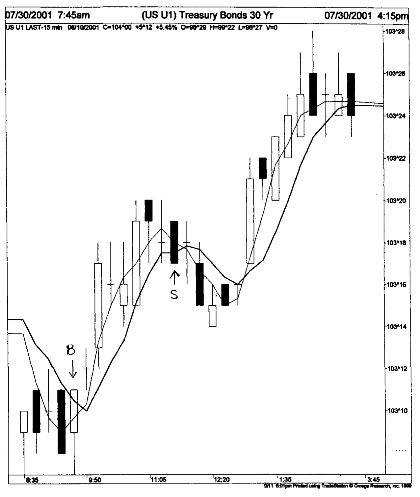
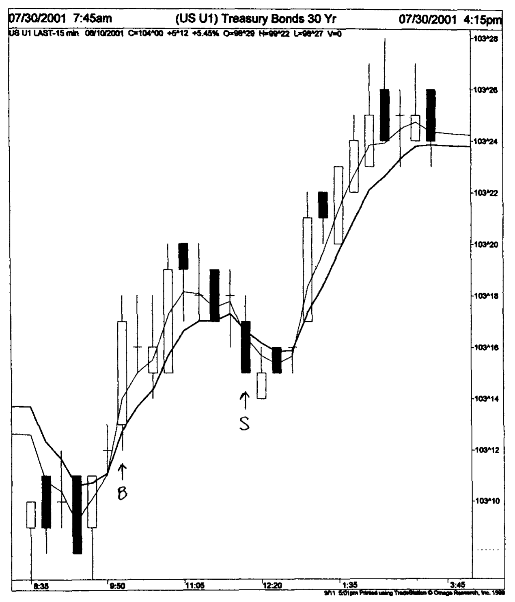

# Chapter 5: Trending Indicators

Trending indicators can help to identify trends. They are actually equivalent to low pass filters in electrical engineering. The low pass filter removes high frequency components and allows low frequency components to pass. In that sense, a trending indicator smoothes the input data. As the smoothing action employs only past data, the filtered output is delayed in phase (or time) relative to the input. Thus the trending indicators are lagging indicators; they turn after the trends reverse. If we want to decrease the lag, the output becomes less smooth. Smoothness and time or phase lag are contradictory properties. Several indicators, with different degrees of smoothness and phase lag have been developed by traders.

## 5.1 Simple Moving Average (SMA)

Simple moving average is by far the most common. A 7-day moving average shows the average price for the last 7 days, i.e., the prices of the last 7 days are added together and divided by 7. For the general case, an $N$-bar moving average is calculated by adding the prices over the last $N$ bars and dividing by $N$. A bar represents a unit time interval being chosen by the trader, e.g., 1 day, 1 hour, 15 minutes, etc. SMA is called moving as the next bar's weighted price will be added to the average and the first bar's weighted price will be discarded. $N$ is called the length of the simple moving average. A larger $N$ will show a smoother average but a larger phase (or time) lag. Figure 5.1 shows a 15-minute chart of the US 30-year Treasury Bond Future. The software used for the charting is TradeStation 2000i manufactured by Omega Research. The prices within a 15 minutes interval is plotted as a Japanese candlestick, which looks like a candle with wicks at both ends. The body of each candle represents the absolute difference between the opening and closing prices. If the closing price is lower than the opening, the body is black. If the closing price is higher, the body is white. The tip of the upper wick represents the high within the 15 minutes interval, and the bottom of the lower wick represents the low within the 15 minutes interval. A simple moving average of the closing price of length 3 (sma3, thin line) and length 6 (sma6, thick line) are plotted with the price data. The latter is slightly smoother and has a larger phase lag than the former. Characteristics of the SMA are described in Appendix 3.

**Fig. 5.1.** A 15-minute chart of the US 30-year Treasury Bond Future. A simple moving average of the closing price of length 3 (thin line) and length 6 (thick line) are plotted with the price data. Chart produced with Omega Research TradeStation2000i.

## 5.2 Exponential Moving Average (EMA)

An exponential moving average is a better trend indicator than a simple moving average as it puts greater weight to most recent data more than older data. The equation for the EMA is given by

$$\text{NEW EMA} = \alpha \times (\text{NEW PRICE}) + (1 - \alpha) \times (\text{OLD EMA}) \tag{5.1}$$

where $\alpha = 2/(M + 1)$.

$M$ is quite often called the length of the EMA. It is sometimes described by some traders as the number of data points (e.g. days) in the EMA. This is incorrect as the number of data points used in the calculation is usually much larger than $M$. A larger $M$ will provide a smoother average but a larger phase lag. Figure 5.2 shows a 15-minute chart, which contains the same price data as those in Fig. 5.1. The closing prices were smoothed by an exponential moving average of length 3 (ema3, thin line) and 6 (ema6, thick line). The latter is smoother and has a larger phase lag than the former. Characteristics of the EMA are described in Appendix 3.

**Fig. 5.2.** A 15-minute chart of the US 30-year Treasury Bond Future. An exponential moving average of the closing price of length 3 (thin line) and length 6 (thick line) are plotted with the price data. Chart produced with Omega Research TradeStation2000i.

## 5.3 Adaptive Moving Average (AMA)

Filtered signal, while smoothing the original data, lags behind it. Researchers have been attempting to create adaptive moving averages to increase the smoothness and decrease the lag as much as possible. An adaptive moving average (AMA) has been constructed by Jurik Research. It was based on years of military research that employed computers to track moving targets. It can smooth data resulting in very small lag.

AMA was programmed to use thirty data points. It has a variable smoothness factor which can have any value between 1 and 500. The moving average responds rapidly to price change when small values are used. Smoother curves are attained for large values. In this book, AMA with smoothness factor of 1 (ama1) and 3 (ama3) will be used. Comparing data filtered by AMA with those filtered by EMA, ama1 is approximately equivalent to EMA with $M=3$ (ema3) while ama3 is approximately equivalent to EMA with $M=6$ (ema6). Figure 5.3 shows a 15-minute chart, which contains the same price data as in Fig. 5.1. The closing prices were smoothed by ama1 (thin line) and ama3 (thick line). The latter is smoother and has a larger phase lag than the former.

**Fig. 5.3.** A 15-minute chart of the US 30-year Treasury Bond Future. An adaptive moving average of the closing price of smoothness 1 (thin line) and smoothness 3 (thick line) are plotted with the price data. Chart produced with Omega Research TradeStation2000i.

## 5.4 Trading Rules using Moving Averages

Most traders like to follow certain predetermined rules to enter and exit the market. As moving averages (MA) show the direction of the trend, the rule is to go with the trend. Some traders also consider a moving average as an area of support and resistance. A dip in a rising market often finds support in an MA and turns up. A rally in a falling market often reverses when it meets resistance in an MA and turns down. Traders using MA to trade the market have constructed several trading rules:

(1) Price crossover of an MA (Pring 1991). The trader will buy when price penetrates and closes above an MA, and sell when price closes below an MA. Figure 5.1 will be used as an example, where the simple moving average of length 6 (thick line) will be chosen as the specified MA. He or she will buy when the Bond price closes above the MA (marked by an arrow denoted with a B), and sell when the price closes below the MA (marked with an arrow denoted with an S).

(2) Fast MA crossover of a slow MA (Pring 1991). The trader will buy when an MA with a smaller phase lag crosses over and is higher than an MA with a larger phase lag. He will sell when the former crosses over and is lower than the latter. In Fig. 5.2, he will buy when ema3 (thin line) crosses over and is above ema6 (thick line) (marked by an arrow denoted with a B). He will sell when ema3 (thin line) crosses over and is below ema6 (thick line) (marked by an arrow denoted with an S).

(3) Enter at retracement (Elder 1993). When an MA rises, the trader will wait for the price to dip close to the MA before buying. A protective stop loss is then placed below the last minor low. The stop loss is moved up when the price rises. When an MA falls, the trader will wait for the price to rally close to the MA before selling short. A protective stop loss is then placed above the last minor high. The stop loss is moved down when the price drops. Figure 5.3 will be used as an example, where the adaptive moving average of length 3 (thick line) will be chosen as the specified MA. The market has been rising in the early part of the chart, but the trader will wait for the price to dip close to the MA before buying (marked by an arrow denoted with a B).

The above trading rules do work some of the time. But as a market is quite unpredictable and contains whipsaws, these trading rules can also fail some of the time.
