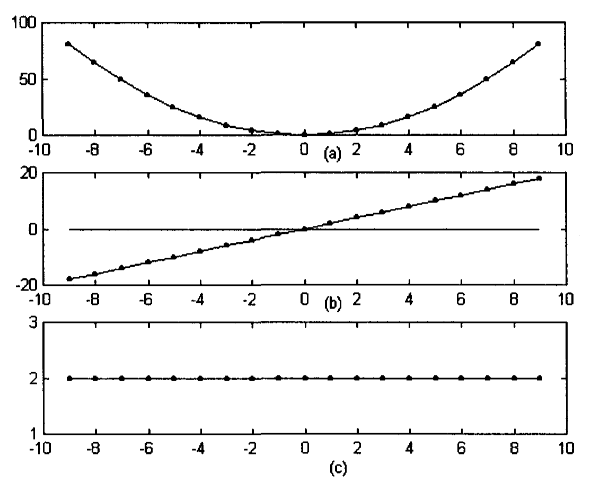
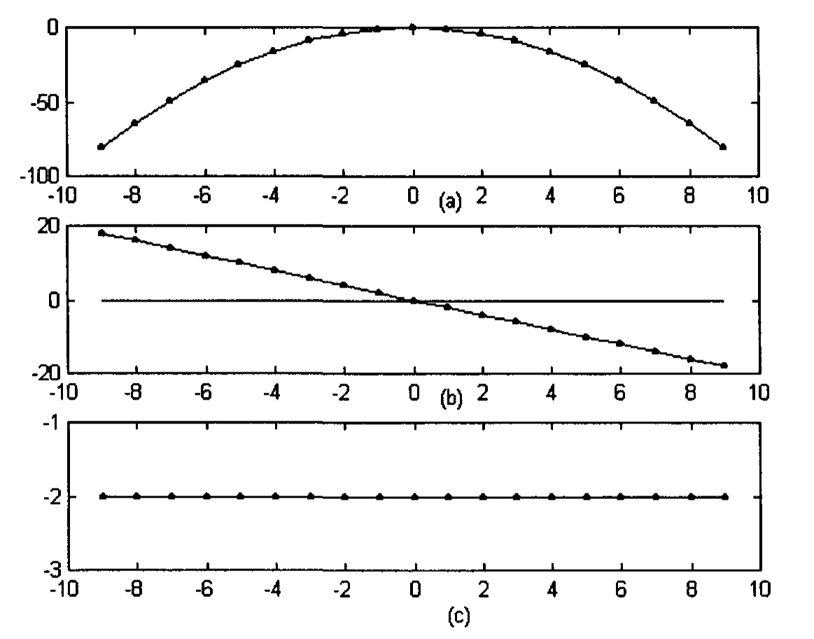
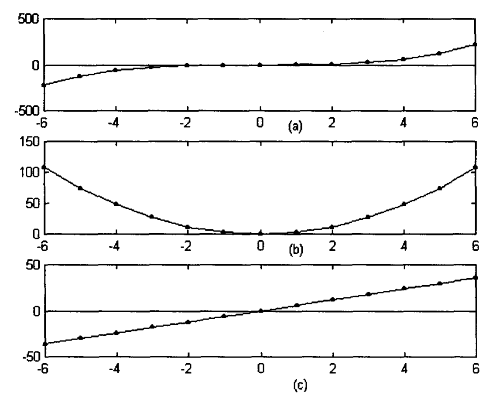
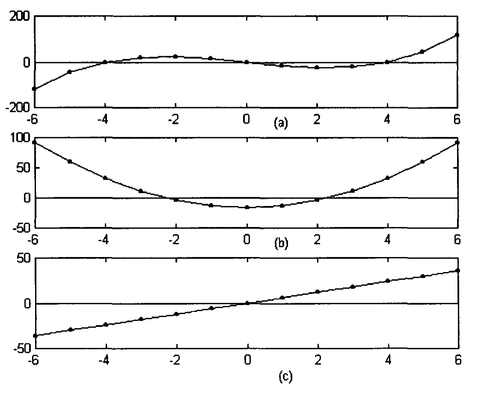
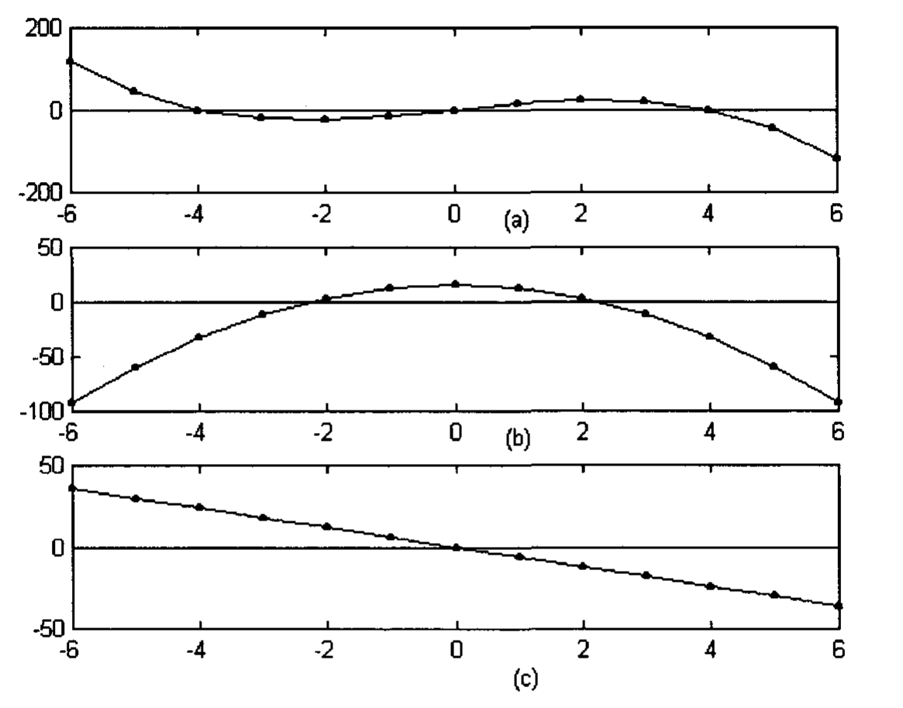

# Chapter 6: Oscillator Indicators

A different kind of indicators from the trending indicators that are discussed in the last chapter is oscillator indicators. Oscillator indicators are actually equivalent to high pass filters in electrical engineering. The high pass filter removes low frequency components and allows high frequency components to pass. Thus, they measure rate of change of price over a given period of time. A common oscillator indicator is the momentum, which is defined as the subtraction of past price from present price (Pring 1991). Rising momentum is interpreted as a bullish factor and declining momentum as a bearish one.

Oscillator indicators have been used mainly in two different manners. Firstly, they can be used to estimate whether the market is overbought or oversold. An oscillator becomes overbought, when it reaches a high level associated with market tops occurred in the past. Overbought implies that the price is too high and the market is ready to turn down. An oscillator becomes oversold when it reaches a low level associated with market bottoms occurred in the past. Oversold implies the market is too low and the price is ready to turn up. Overbought and oversold levels are indicated by horizontal reference lines on the charts. However, these levels are somewhat arbitrary and need to be changed from time to time and from market to market.

Secondly, oscillator indicators can be used in the interpretation of divergences, i.e., when they diverge from prices. Bullish divergences occur when prices fall to a new low while an oscillator does not decline to a new low. Bullish divergences quite often spell the end of downtrends. Bearish divergences occur when prices rally to a new high while an oscillator does not rise to a new peak. Bearish divergences quite often spell the ends of up-trends.

An ideal oscillator indicator should lead price by a phase of $\pi/2$ radians, i.e., 90 degrees (see Appendix 4). However, the conventional oscillator indicators always lag behind this ideal phase. This is probably why it has become necessary to use overbought and oversold levels to signify market turns. The momentum indicator, quite often used by traders, is actually the same as the two point moving difference described in Appendix 4. The moving difference has quite some phase lag from the ideal phase. We will propose two oscillator indicators, the parabolic velocity indicator and the cubic velocity indicator that have very little phase lag from the ideal phase. Velocity measures the rate of change of a quantity with respect to time. At the turning points of the market, the output response of the indicators become zero, thus providing a clear signal for a change in trends. No reference level or any arbitrary parameter is required for their interpretations. Furthermore, a positive velocity implies that the market is trending up, and a negative velocity implies that the market is trending down. Thus, the velocity indicators can be used as trending indicators as well.

## 6.1 Parabolic Velocity Indicator

Traders quite often approximate price-time data as piecewise linear and draw straight lines called trendlines through the data. An ascending trendline shows that the market is trending up. A descending trendline shows that the market is trending down.

However, can price-time data be represented by other curves rather than straight lines? A parabola is the trajectory that a piece of stone will follow when we throw it off the ground. In this case, the parabola curves down. However, the equation of a parabola can be arranged such that it curves up, or curves sideways. Thus, a parabola would seem to be a good candidate to represent market data. It should particularly be noted that at turning points, it is better to approximate the data as piecewise parabolas than piecewise straight lines. In any case, it can be easily shown in analytical geometry that the equation of a straight line is a particular case of the equation of a parabola. Thus, a parabola would be more versatile than a straight line in representing data.


**Fig. 6.1.** Market price data simulated as a parabola concaving up: (a) the parabola; (b) the slope of the parabola; (c) the slope of the slope of the parabola.

Figure 6.1(a) shows a simulation of market bottom by a parabola concaving up. Figure 6.1(b) shows a straight line which represents the slope or gradient of the parabola (slope is called derivative in Calculus, and can easily be calculated from the equation representing the parabola). The slope is initially negative as the market is going downhill. At the turning point, the slope equals zero. The slope is positive when the market is going uphill.


**Fig. 6.2.** Market price data simulated as a parabola concaving down: (a) the parabola; (b) the slope of the parabola; (c) the slope of the slope of the parabola.

Figure 6.2(a) shows a simulation of a market top by a parabola concaving down. Figure 6.2(b) shows a straight line which represents the slope or gradient of the parabola. The slope is initially positive as the market is going uphill. At the turning point, the slope equals zero. The slope is negative when the market is going downhill.

All these mean that at market bottom, slope of the price go from negative to positive and is zero at the turning point. At the market top, slope of the price will go from positive to negative and is zero at the turning point. Thus, the slope is an important indicator of market turns. However, given some arbitrary data, how are we going to find the slope? We will introduce here the parabolic velocity indicator, whose derivation will be given in Appendix 4. Basically, three adjacent market price data points are fitted to a parabola. The slope of the parabola at the most recent data point is then calculated using Calculus. The slope would represent the velocity.

The parabolic velocity indicator is defined as $(3/2, -2, 1/2)$. Thus, the output response, $y$, after the input price data, $x$, is filtered by the indicator is

$$y(n) = \frac{3}{2} x(n) - 2x(n-1) + \frac{1}{2} x(n-2) \tag{6.1}$$

Therefore, the current velocity is given by

$$y(0) = \frac{3}{2} x(0) - 2x(-1) + \frac{1}{2} x(-2) \tag{6.2}$$

where $x(0)$ is the closing price or the smoothed closing price of the current bar, $x(-1)$ is the closing price or the smoothed closing price of one bar ago, $x(-2)$ is the closing price or the smoothed closing price of two bars ago.


**Fig. 6.3.** Market price data simulated as a sine wave of circular frequency of π/4 radian: (a) the sine wave; (b) the sine wave filtered by the parabolic velocity indicator (marked as .), and compared with the slope of the sine wave (marked as +); (c) the sine wave filtered by the parabolic acceleration indicator (marked as .), and compared with the slope of the slope of the sine wave (marked as +).

Figure 6.3(a) shows a market price data simulated as a sine wave. The slope (or derivative) of the sine wave is plotted in Fig. 6.3(b) and compared with the sine wave filtered by the parabolic velocity indicator. The plot shows that the velocity as calculated yields the slope quite well, thus providing us an easy way to calculate the slope.

In the EasyLanguage code of Omega Research's TradeStation2000i, the program for calculating the parabolic velocity indicator can be written as follows:

```EasyLanguage
Plot1(3*AMAFUNC2(c,1)/2-2*AMAFUNC2(c[1],1)+AMAFUNC2(c[2],1)/2,"Plot1");
Plot2(3*AMAFUNC2(c,3)/2-2*AMAFUNC2(c[1],3)+AMAFUNC2(c[2],3)/2,"Plot2");
Plot3(0,"Plot3");
```

`c` represents the closing price of the current bar. `c[1]` represents the closing price of one bar ago, and `c[2]` represents the closing price of two bars ago. AMAFUNC2 is the adaptive moving average function written by Jurik Research. The first input parameter of AMAFUNC2 signifies the closing price series to be smoothed, while the second input parameter indicates the smoothness factor. The larger the smoothness factor, the more smoothed the smoothed data will be. Three plots are drawn. The first one calculates the velocity of closing prices smoothed by a factor of 1. The second one calculates the velocity of the closing prices smoothed by a factor of 3. The third one plots a horizontal straight line where the velocity is zero. This straight line helps to identify when the calculated velocity is approaching zero. AMAFUNC2 can be substituted by other smoothing function. For example, it can be substituted by XAVERAGE, which is a built-in exponential moving average function written by TradeStation2000i. The first input parameter of XAVERAGE signifies the closing price series to be smoothed, while the second input parameter indicates the length of the window (see Chapter 5). The program plotting the parabolic velocity indicators calculated on closing price data smoothed by exponential moving average is listed as follows:

```EasyLanguage
Plot1(3*XAVERAGE(c,3)/2-2*XAVERAGE(c[1],3)+XAVERAGE(c[2],3)/2,"Plot1");
Plot2(3*XAVERAGE(c,6)/2-2*XAVERAGE(c[1],6)+XAVERAGE(c[2],6)/2,"Plot2");
Plot3(0,"Plot3");
```

Next we will take a look at the parabolic acceleration indicator to see how the slope of a slope can be simulated.

## 6.2 Parabolic Acceleration Indicator

Acceleration is the rate of change of velocity. So, if the slope of a curve represents velocity, the slope of the slope of a curve would represent acceleration. The reason that we need to calculate acceleration would be obvious later. Figure 6.1(c) shows the slope of the slope of a concave up parabola (slope of the slope is called second derivative in Calculus, and can easily be calculated from the equation representing the parabola). It is a positive constant. Figure 6.2(c) shows the slope of the slope of a concave down parabola. It is a negative constant. Thus, at market bottom, the slope of the slope is positive. And at market top, the slope of the slope is negative. (It is commonly known in Calculus that when a curve is concaving up, the second derivative is positive; and when the curve is concaving down, the second derivative is negative).

We will define a parabolic acceleration indicator as $(1, -2, 1)$, whose derivation is given in Appendix 4. Basically, three adjacent market price data points are fitted to a parabola. The slope of the slope of the parabola at the most recent data point is then calculated using Calculus. The slope of the slope would represent the acceleration. The output response, $y$, after the input price data, $x$, is filtered by the indicator is

$$y(n) = x(n) - 2x(n-1) + x(n-2) \tag{6.3}$$

Therefore, the current acceleration is given by

$$y(0) = x(0) - 2x(-1) + x(-2) \tag{6.4}$$

The slope of the slope of the sine wave as calculated from Calculus is plotted in Fig. 6.3(c) and compared with the sine wave filtered by the parabolic acceleration indicator. The plot shows that the acceleration as calculated has a phase lag from the slope of the slope. This simply means that a sine wave is not very well fitted with piecewise parabolas.

In EasyLanguage code provided by Omega Research's TradeStation2000i, the parabolic acceleration indicator can be written as follows:

```EasyLanguage
Plot1(AMAFUNC2(c,1)-2*AMAFUNC2(c[1],1)+AMAFUNC2(c[2],1),"Plot1");
Plot2(AMAFUNC2(c,3)-2*AMAFUNC2(c[1],3)+AMAFUNC2(c[2],3),"Plot2");
Plot3(0,"Plot3");
```

Three plots are drawn. The first one calculates the acceleration of closing prices smoothed by AMAFUNC2 using a smoothness factor of 1. The second one calculates the acceleration of the closing prices smoothed by a factor of 3. The third one plots a horizontal straight line where the acceleration is zero. This straight line helps to identify when the calculated acceleration is approaching zero. AMAFUNC2 can be substituted by XAVERAGE. The program plotting the parabolic acceleration indicators calculated on closing price data smoothed by exponential moving average is listed as follows:

```EasyLanguage
Plot1(XAVERAGE(c,3)-2*XAVERAGE(c[1],3)+XAVERAGE(c[2],3),"Plot1");
Plot2(XAVERAGE(c,6)-2*XAVERAGE(c[1],6)+XAVERAGE(c[2],6),"Plot2");
Plot3(0,"Plot3");
```

While the parabolic velocity indicator provides a reasonably good representation of the velocity, the parabolic acceleration indicator has a phase lag compared to the acceleration. We will see in the next section how we can reduce the phase lag using the cubic acceleration indicator. While the parabolic indicators employ only three data points, the cubic indicators will employ four data points.

## 6.3 Cubic Velocity and Acceleration Indicators

Quite often, market moves in waves and is better approximated by a piecewise cubic function rather than by a piecewise parabola. While a parabola can be considered as a mathematical expression of degree two, a cubic function can be considered as a mathematical expression of degree three. Thus, a cubic function is more versatile than a parabola. In any case, it can be shown in analytical geometry that a parabola is a particular case of a cubic function.


**Fig. 6.4.** Market price data simulated as a cubic function: (a) the cubic function; (b) the slope of the cubic function; (c) the slope of the slope of the cubic function.

Figure 6.4(a) shows a simulation of the market continuation by a single cubic function ($x = n^3$). Figure 6.4(b) shows its slope ($3n^2$, calculated using derivatives in Calculus) which is zero at the turning point (or rather an inflection point). When the market continues in the same direction after the turning point, the slope remains positive. The slope of the slope ($6n$, calculated using derivatives in Calculus) approaches zero near the turning point and points up (Fig. 6.4(c)). This is quite different from the constant slope of the slope when the market data looks like a parabola (Fig. 6.2(c)).


**Fig. 6.5.** Market price data simulated as a more complicated cubic function continuing in an uptrend: (a) the cubic function; (b) the slope of the cubic function; (c) the slope of the slope of the cubic function.

Figure 6.5(a) shows a more complicated cubic function. The data rises to a local maximum, retraces to a local minimum and then continues upwards. (This kind of curve appears in market price data quite often.) Figure 6.5(b) shows its slopes, which are zero at the two turning points, the local maximum and the local minimum. Again, when the market continues in the same original direction after the two turning points, the slope of its slope at the two turning points are close to zero and point up (Fig. 6.5(c)).


**Fig. 6.6.** Market price data simulated as a more complicated cubic function continuing in a downtrend: (a) the cubic function; (b) the slope of the cubic function; (c) the slope of the slope of the cubic function.

Figure 6.6(a) shows a cubic function which falls to a local minimum, retraces to a local maximum and then continues downward. (Again, this kind of curve appears in market price data quite often.) Figure 6.6(b) shows its slopes, which are zero at the two turning points, the local minimum and the local maximum. When the market continues in the same original direction after the two turning points, the slope of its slope at the two turning points are close to zero and point down.

The slope of the slope is thus significant in differentiating whether the market is experiencing a major turning point or only minor turning points and will continue in the same original direction after. When the market is experiencing a major turning point, the slope of the slope is approximately a constant. When the market is experiencing only a hiccup and will continue in the original direction after, the slope of the slope will point to the direction that it will continue after.

The problem now then is to find a velocity and acceleration indicators to simulate the slope and the slope of the slope respectively with little phase lag (While the parabolic velocity indicator can simulate the slope quite well, the parabolic acceleration indicator has quite a phase lag from the slope of the slope). The cubic velocity and acceleration indicators will be introduced here and will be used for the rest of the book. Their derivations are given in Appendix 4. Basically, four adjacent market price data points are fitted to a cubic function. The slope and the slope of the slope of the cubic function at the most recent data point are then calculated using Calculus. They would represent the velocity and acceleration.

The cubic velocity indicator is defined as $(11/6, -3, 3/2, -1/3)$. The output response, $y$, after the input price data, $x$, is filtered by the cubic velocity indicator is

$$y(n) = \frac{11}{6} x(n) - 3x(n-1) + \frac{3}{2} x(n-2) - \frac{1}{3} x(n-3) \tag{6.5}$$

Therefore, the current velocity is given by

$$y(0) = \frac{11}{6} x(0) - 3x(-1) + \frac{3}{2} x(-2) - \frac{1}{3} x(-3) \tag{6.6}$$

where $x(0)$ is the closing price or the smoothed closing price of the current bar, $x(-1)$ is the closing price or the smoothed closing price of one bar ago, $x(-2)$ is the closing price or the smoothed closing price of two bars ago, $x(-3)$ is the closing price or the smoothed closing price of three bars ago.


**Fig. 6.7.** Market price data simulated as a sine wave of circular frequency of π/4 radian: (a) the sine wave; (b) the sine wave filtered by the cubic velocity indicator (marked as .), and compared with the slope of the sine wave (marked as +); (c) the sine wave filtered by the cubic acceleration indicator (marked as .), and compared with the slope of the slope of the sine wave (marked as +).

Figure 6.7(a) shows a market price data simulated as a sine wave. The slope of the sine wave, as calculated from Calculus, is plotted in Fig. 6.7(b). The sine wave filtered by the cubic velocity indicator is also plotted, and it agrees quite well with the slope.

In the EasyLanguage code of Omega Research's TradeStation2000i, the program for calculating the cubic velocity indicator can be written as follows:

```EasyLanguage
Plot1(11*AMAFUNC2(c,1)/6-3*AMAFUNC2(c[1],1)+3*AMAFUNC2(c[2],1)/2-AMAFUNC2(c[3],1)/3,"Plot1");
Plot2(11*AMAFUNC2(c,3)/6-3*AMAFUNC2(c[1],3)+3*AMAFUNC2(c[2],3)/2-AMAFUNC2(c[3],3)/3,"Plot2");
Plot3(0,"Plot3");
```

`c` represents the closing price of the current bar. `c[1]` represents the closing price of one bar ago, `c[2]` represents the closing price of two bars ago and `c[3]` represents the closing price of three bars ago. AMAFUNC2 is the adaptive moving average function written by Jurik Research. Three plots are drawn. The first one calculates the velocity of closing prices smoothed by a factor of 1. The second one calculates the velocity of the closing prices smoothed by a factor of 3. The third one plots a horizontal straight line where the velocity is zero. This straight line helps to identify when the calculated velocity is approaching zero. AMAFUNC2 can be substituted by other smoothing function. For example, it can be substituted by XAVERAGE, which is a built-in exponential moving average function written by TradeStation2000i. The program plotting the cubic velocity indicators calculated on closing price data smoothed by exponential moving average is listed as follows:

```EasyLanguage
Plot1(11*XAVERAGE(c,3)/6-3*XAVERAGE(c[1],3)+3*XAVERAGE(c[2],3)/2-XAVERAGE(c[3],3)/3,"Plot1");
Plot2(11*XAVERAGE(c,6)/6-3*XAVERAGE(c[1],6)+3*XAVERAGE(c[2],6)/2-XAVERAGE(c[3],6)/3,"Plot2");
Plot3(0,"Plot3");
```

The cubic acceleration indicator is defined as $(2, -5, 4, -1)$. The output response, $y$, after the input price data, $x$, is filtered by the cubic acceleration indicator is

$$y(n) = 2x(n) - 5x(n-1) + 4x(n-2) - x(n-3) \tag{6.7}$$

Therefore, the current acceleration is given by

$$y(0) = 2x(0) - 5x(-1) + 4x(-2) - x(-3) \tag{6.8}$$

It should be noted that parabolic as well as cubic velocity and acceleration indicators are examples of convolution sums as depicted in Eq. (4.3).


**Fig. 6.8.** Market price data simulated as a sine wave of circular frequency of π/16 radian: (a) the sine wave; (b) the sine wave filtered by the cubic velocity indicator (marked as .), and compared with the slope of the sine wave (marked as +); (c) the sine wave filtered by the cubic acceleration indicator (marked as .), and compared with the slope of the slope of the sine wave (marked as +).

Figure 6.7(c) plots the slope of the slope of the sine wave as calculated from Calculus. The sine wave filtered by the cubic acceleration indicator is also plotted and it agrees reasonably well with the slope of the slope. It has a much less phase lag compared with the sine wave filtered by the parabolic acceleration indicator (Fig. 6.3(c)). The agreement would be even much better if the sine wave is sampled more frequently (Fig. 6.8).

![Fig. 6.9. Market price data simulated as a summation of sine waves of circular frequency of π/16 radian with amplitude 1.0 and π/4 radian with amplitude 0.25, showing double bottoms: (a) the summation of sine waves; (b) the summation of sine waves filtered by the cubic velocity indicator (marked as .), and compared with the slope of the summation of sine waves (marked as +); (c) the summation of sine waves filtered by the cubic acceleration indicator (marked as .), and compared with the slope of the slope of the summation of sine waves (marked as +). Class A bearish and Class B bullish divergences are illustrated here.](assets/ch-06-fig-6-9.png)
**Fig. 6.9.** Market price data simulated as a summation of sine waves of circular frequency of π/16 radian with amplitude 1.0 and π/4 radian with amplitude 0.25, showing double bottoms: (a) the summation of sine waves; (b) the summation of sine waves filtered by the cubic velocity indicator (marked as .), and compared with the slope of the summation of sine waves (marked as +); (c) the summation of sine waves filtered by the cubic acceleration indicator (marked as .), and compared with the slope of the slope of the summation of sine waves (marked as +). Class A bearish and Class B bullish divergences are illustrated here.

Figure 6.9(a) shows a market price data simulated as a summation of two sine waves. Its slope (calculated by using Calculus) is plotted in Fig. 6.9(b) and it agrees quite well with the sine waves filtered by the cubic velocity indicator. Figure 6.9(c) plots the slope of the slope (calculated by using Calculus). It agrees reasonably well with the sine waves filtered by the cubic acceleration indicator. At sample number 34, the market price is experiencing a minor turning point. While the velocity is approximately zero, the acceleration is slightly less than zero and pointing toward the direction where the market will continue. The acceleration implies that the curve may change from concave down to concave up, and the market will go up after a slow down. In a slightly different perspective, since acceleration represents the slope of the velocity, the acceleration here implies that the velocity may change its slope from negative to positive, generating the expectation that the velocity will remain positive and the market will go up. This scenario can be contrasted with sample number 8, which is a major turning point. While the velocity is zero, the acceleration is negative, implying that the market is concaving down. The acceleration is also pointing in the direction where the market is heading. This can be compared with Fig. 6.2 when a major turning point is simulated as a parabola. While the velocity is zero at the turning point, the acceleration is a constant and far from zero.

In the EasyLanguage code of Omega Research's TradeStation2000i, the program for calculating the cubic acceleration indicator can be written as follows:

```EasyLanguage
Plot1(2*AMAFUNC2(c,1)-5*AMAFUNC2(c[1],1)+4*AMAFUNC2(c[2],1)-AMAFUNC2(c[3],1),"Plot1");
Plot2(2*AMAFUNC2(c,3)-5*AMAFUNC2(c[1],3)+4*AMAFUNC2(c[2],3)-AMAFUNC2(c[3],3),"Plot2");
Plot3(0,"Plot3");
```

AMAFUNC2 is the adaptive moving average function. Other smoothing functions can replace this function. The program plotting the cubic acceleration indicators calculated on closing price data smoothed by exponential moving average is listed as follows:

```EasyLanguage
Plot1(2*XAVERAGE(c,3)-5*XAVERAGE(c[1],3)+4*XAVERAGE(c[2],3)-XAVERAGE(c[3],3),"Plot1");
Plot2(2*XAVERAGE(c,6)-5*XAVERAGE(c[1],6)+4*XAVERAGE(c[2],6)-XAVERAGE(c[3],6),"Plot2");
Plot3(0,"Plot3");
```


**Fig. 6.10.** A 15-minute chart of a US 30 year Treasury Bond Future, showing a turning point at the market bottom. Cubic velocity and cubic acceleration indicators are plotted in the middle and bottom figures respectively. Chart produced with Omega Research TradeStation2000i.

Figure 6.10 shows a 15-minute chart of the US 30 year Treasury Bond Future. The price data was smoothed using the adaptive moving average with smoothness 1 (thin line) and smoothness 3 (thick line). Cubic velocity indicators were applied to the moving averages and plotted in the middle of the figure. Cubic acceleration indicators were also applied to the moving averages and plotted in the bottom of the figure. At 11:50 am, the market as shown by the adaptive moving average with a smoothness factor of 3 (ama3) continued to trend down. However, the velocity, as represented by the cubic velocity indicator of ama3 (thick line), approached zero from a negative value in a somewhat linear fashion. The acceleration, as represented by the cubic acceleration indicator of ama3 (thick line) is away from zero and approximately a positive constant, thus implying that the curvature of ama3 of the price data is concaving up. This can be compared with the parabola, its slope and the slope of its slope in Fig. 6.1. The velocity and acceleration in Fig. 6.10 indicated that a major turning point is imminent. After the turning point, the velocity of ama3 remains positive for the whole afternoon, implying that the slope of the curve is positive and the market is trending up. A day-trader who has bought at the turning point can hold the contract until the end of the day.


**Fig. 6.11.** A 15-minute chart of a US 30 year Treasury Bond Future, showing a continuation pattern. Cubic velocity and cubic acceleration indicators are plotted in the middle and bottom figures respectively. Chart produced with Omega Research TradeStation2000i.

Figure 6.11 shows another 15-minute chart of the US 30 years Treasury Bond Future. The price data was again smoothed using the adaptive moving average with smoothness 1 (thin line) and smoothness 3 (thick line). The Bond trended up in the morning. At 12:05 p.m., it appeared as if it was running out of steam and will turn down. However, the velocity of ama3 approached zero in a parabolic fashion. Furthermore, the acceleration of ama3 approached zero from a negative value in an approximately linear fashion. These indications implied that the market might continue upwards. This phenomenon is very similar to the cubic function, its slope, and the slope of its slope in Fig. 6.5. As it happened, the market did continue upwards in the afternoon.

A word of caution needs to be emphasized. As described in Chapter 3, a model can never be perfect in describing real phenomenon. When market price data points are fitted to a cubic function, we are modeling market behavior as piecewise cubic and expect it to behave as such in the very near future. This, of course, does not have to be the case, as the market can do whatever it wants to do.

Nevertheless, the cubic velocity and acceleration indicators are better oscillator tools to increase the probability of forecasting when turning points in the market would occur. In addition, they can be used to explain some of the common market phenomena like divergences and head and shoulders:

## 6.4 Divergences

Books on technical analysis quite often discuss about divergences, i.e. when oscillators diverge from prices. Divergences can give out some good trading signals (Elder 1993). Divergences have been divided into three classes, depending upon how the patterns of price and oscillator look like. Trading books only tell you what would then happen, but do not explain why. Here we provide a simple model of why divergences lead to turnings of market trends.

Market price is simulated as the sum of two sine waves. Cubic velocity indicator is used as an example of an oscillator indicator. The three classes of divergences are:

### 6.4.1 Class A Divergence

Some traders believe that class A divergences identify important turning points. Class A bearish divergences occur when prices reach a new high but an oscillator reaches a lower high than the high of its previous rally. They usually lead to sharp breaks. This can be exemplified in Figs. 6.9(a) and (b). Class A bullish divergences occur when prices reach a new low but an oscillator traces a higher bottom than the bottom of its previous decline. They usually precede sharp rallies. This can be exemplified in Figs. 6.12(a) and (b). As in Fig. 6.9(a), Fig. 6.12(a) is a sum of two sine waves. It differs from Fig. 6.9(a) only by a shift in phase between the two components of sine waves.

![Fig. 6.12. Market price data simulated as a summation of sine waves of circular frequency of π/16 radian with amplitude 1.0 and π/4 radian with amplitude 0.25, showing double tops: (a) the summation of sine waves; (b) the summation of sine waves filtered by the cubic velocity indicator (marked as .), and compared with the slope of the summation of sine waves (marked as +); (c) the summation of sine waves filtered by the cubic acceleration indicator (marked as .), and compared with the slope of the slope of the summation of sine waves (marked as +). Class A bullish and Class B bearish divergences are illustrated here.](assets/ch-06-fig-6-12.png)
**Fig. 6.12.** Market price data simulated as a summation of sine waves of circular frequency of π/16 radian with amplitude 1.0 and π/4 radian with amplitude 0.25, showing double tops: (a) the summation of sine waves; (b) the summation of sine waves filtered by the cubic velocity indicator (marked as .), and compared with the slope of the summation of sine waves (marked as +); (c) the summation of sine waves filtered by the cubic acceleration indicator (marked as .), and compared with the slope of the slope of the summation of sine waves (marked as +). Class A bullish and Class B bearish divergences are illustrated here.

### 6.4.2 Class B Divergence

Some traders believe that class B divergences are less strong than Class A. Class B bearish divergences occur when prices appear as a double top but an oscillator traces a lower second top. This can be exemplified in Figs. 6.12(a) and (b). Class B bullish divergences occur when prices appear as a double bottom but an oscillator traces a higher second bottom. This can be exemplified in Figs. 6.9(a) and (b).

### 6.4.3 Class C Divergence

Some traders believe that class C divergences are the least important. Class C bearish divergences occur when prices rise to a new high but the oscillator forms a double top. This can be exemplified in Figs. 6.13(a) and (b). As in Fig. 6.9(a), Fig. 6.13(a) is a sum of two sine waves. It differs from Fig. 6.9(a) only by a shift in phase between the two components of sine waves.

![Fig. 6.13. Market price data simulated as a summation of sine waves of circular frequency of π/16 radian with amplitude 1.0 and π/4 radian with amplitude 0.25: (a) the summation of sine waves; (b) the summation of sine waves filtered by the cubic velocity indicator (marked as .), and compared with the slope of the summation of sine waves (marked as +); (c) the summation of sine waves filtered by the cubic acceleration indicator (marked as .), and compared with the slope of the slope of the summation of sine waves (marked as +). Class C bearish divergence is illustrated here.](assets/ch-06-fig-6-13.png)
**Fig. 6.13.** Market price data simulated as a summation of sine waves of circular frequency of π/16 radian with amplitude 1.0 and π/4 radian with amplitude 0.25: (a) the summation of sine waves; (b) the summation of sine waves filtered by the cubic velocity indicator (marked as .), and compared with the slope of the summation of sine waves (marked as +); (c) the summation of sine waves filtered by the cubic acceleration indicator (marked as .), and compared with the slope of the slope of the summation of sine waves (marked as +). Class C bearish divergence is illustrated here.

Class C bullish divergences occur when prices fall to a new low but the oscillator traces a double bottom. This can be exemplified in Figs. 6.14(a) and (b). As in Fig. 6.9(a), Fig. 6.14(a) is a sum of two sine waves. Again, it differs from Fig. 6.9(a) only by a shift in phase between the two components of sine waves.

![Fig. 6.14. Market price data simulated as a summation of sine waves of circular frequency of π/16 radian with amplitude 1.0 and π/4 radian with amplitude 0.25: (a) the summation of sine waves; (b) the summation of sine waves filtered by the cubic velocity indicator (marked as .), and compared with the slope of the summation of sine waves (marked as +); (c) the summation of sine waves filtered by the cubic acceleration indicator (marked as .), and compared with the slope of the slope of the summation of sine waves (marked as +). Class C bullish divergence is illustrated here.](assets/ch-06-fig-6-14.png)
**Fig. 6.14.** Market price data simulated as a summation of sine waves of circular frequency of π/16 radian with amplitude 1.0 and π/4 radian with amplitude 0.25: (a) the summation of sine waves; (b) the summation of sine waves filtered by the cubic velocity indicator (marked as .), and compared with the slope of the summation of sine waves (marked as +); (c) the summation of sine waves filtered by the cubic acceleration indicator (marked as .), and compared with the slope of the slope of the summation of sine waves (marked as +). Class C bullish divergence is illustrated here.

Our model of simulating price as the summation of two sine waves with varying relative phases between them thus easily explains all classes of divergences. Our model does not really display the varying degrees of significance for different classes of divergences as suggested by some traders, as we can see from Figs. 6.9, 6.12, 6.13 and 6.14.

## 6.5 Head and Shoulders

This pattern consists of a final rally, which is called the head, separating two smaller rallies, which are called the shoulders. This is a reversal pattern, signifying that the bulls are losing their grip. An uptrend fails to reach a higher high, and a decline falls below the previous low. Our model of the summation of two sine waves can simulate the head and shoulders tops quite well (Fig. 6.15(a)). Figure 6.15(a) differs from Fig. 6.9(a) by a change in amplitude between the two components of sine waves. Figure 6.15(b) shows that the oscillator tops declines, illustrating that the uptrend is over.

![Fig. 6.15. Market price data simulated as a summation of sine waves of circular frequency of π/16 radians with amplitude 1.0 and π/4 radian with amplitude 0.5: (a) the summation of sine waves. The pattern looks like head (denoted as H) and shoulders; (b) the summation of sine waves filtered by the cubic velocity indicator (marked as .), and compared with the slope of the summation of sine waves (marked as +); (c) the summation of sine waves filtered by the cubic acceleration indicator (marked as .), and compared with the slope of the slope of the summation of sine waves (marked as +).](assets/ch-06-fig-6-15.png)
**Fig. 6.15.** Market price data simulated as a summation of sine waves of circular frequency of π/16 radians with amplitude 1.0 and π/4 radian with amplitude 0.5: (a) the summation of sine waves. The pattern looks like head (denoted as H) and shoulders; (b) the summation of sine waves filtered by the cubic velocity indicator (marked as .), and compared with the slope of the summation of sine waves (marked as +); (c) the summation of sine waves filtered by the cubic acceleration indicator (marked as .), and compared with the slope of the slope of the summation of sine waves (marked as +).

An inverse head and shoulders is the opposite of head and shoulders. It signifies that the downtrend is over. Figure 6.16(a) shows a summation of two sine waves simulating an inverse head and shoulders pattern. Figure 6.16(a) differs from Fig. 6.15(a) only by a shift in phase between the two components of sine waves. The corresponding oscillator bottoms in Fig. 6.16(b) increases, showing that the bulls are gaining ground.

![Fig. 6.16. Market price data simulated as a summation of sine waves of circular frequency of π/16 radians with amplitude 1.0 and π/4 radian with amplitude 0.5: (a) the summation of sine waves. The pattern looks like inverse head (denoted as I) and shoulders; (b) the summation of sine waves filtered by the cubic velocity indicator (marked as .), and compared with the slope of the summation of sine waves (marked as +); (c) the summation of sine waves filtered by the cubic acceleration indicator (marked as .), and compared with the slope of the slope of the summation of sine waves (marked as +).](assets/ch-06-fig-6-16.png)
**Fig. 6.16.** Market price data simulated as a summation of sine waves of circular frequency of π/16 radians with amplitude 1.0 and π/4 radian with amplitude 0.5: (a) the summation of sine waves. The pattern looks like inverse head (denoted as I) and shoulders; (b) the summation of sine waves filtered by the cubic velocity indicator (marked as .), and compared with the slope of the summation of sine waves (marked as +); (c) the summation of sine waves filtered by the cubic acceleration indicator (marked as .), and compared with the slope of the slope of the summation of sine waves (marked as +).
