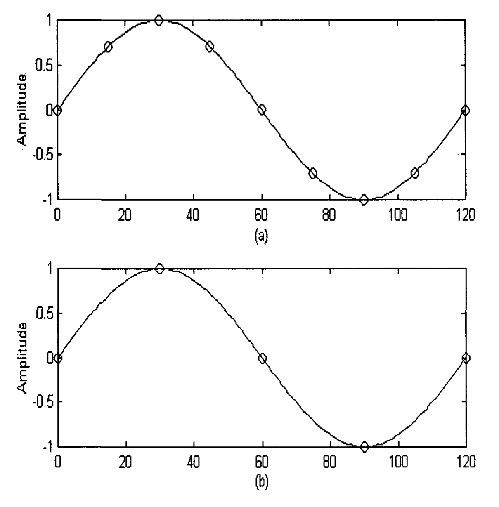
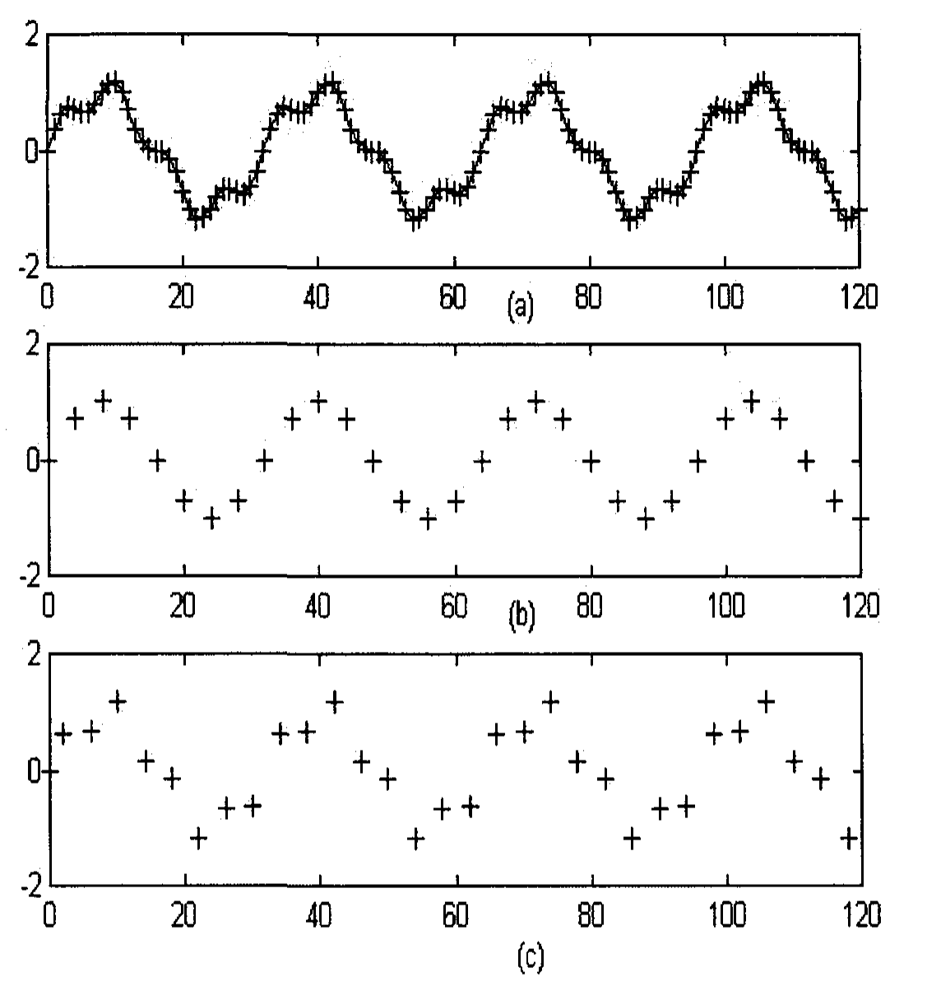

# Chapter 8: Various Timeframes

Traders quite often look at charts of different time frames at the same time. They may use a long-term time chart to decide on the set of conditions that are necessary for taking a position in the market. Then they would wait for an indication in a short-term time chart before entering a market (Elder 1993). But why would traders bother to look at different charts? Before we delve into this question, let us take a look at how time charts are made of.

In each time chart, the data are taken from a raw signal by sampling at equal time intervals. The raw price signal in the financial market is the tick data. A tick is an upward or downward price movement. In a 15-minute chart, the data is sampled at a 15 minute interval, i.e., the closing price at every 15 minute interval is captured. Similarly, in a daily chart, the daily closing price is recorded. Figures 8.1(a) and (b) show a market price signal simulated as a pure sine wave. The sine wave in Fig. 8.1(a) was sampled at eight points per cycle, yielding a sampled signal of circular frequency of $\pi/4$ radian (i.e., 45 degrees). If the horizontal axis is taken to be time in minutes, the figure can be considered as a 15-minute chart. Taking every other sample of Fig. 8.1(a) will yield Fig. 8.1(b), which shows a sine wave sampled at four points per cycle, yielding a sampled signal of circular frequency of $\pi/2$ radians (i.e., 90 degrees). Figure 8.1(b) can then be considered as a 30-minute chart. The procedure of taking every $M$th sample point is called downsampling, which will be discussed in more detail in Appendix 6.

**Fig. 8.1.** (a) A sine wave sampled at eight points per cycle; (b) taking every other sample of (a) yields a sine wave sampled at four points per cycle.

Market price data are seldom made up of a pure sine wave. They are usually composed of waves of different frequencies and magnitudes. In general, data of higher frequencies (i.e., smaller periods) have smaller amplitude than those of lower frequencies (i.e., larger periods). For example, the variation of daily closing price is much smaller than the variation of monthly closing price (Mandelbrot 1983, Mantegna and Stanley 1995). Thus, market price data can be simulated as a superposition of sine waves, with higher frequencies having smaller amplitudes. Let us take a look at an example. Figure 8.2(a) shows the sum of two sine waves, the first one has a lower frequency with an amplitude of 1, and the second one has a higher frequency with an amplitude of 1/4:

$$x(n) = \sin(\pi n/16) + (1/4) \sin(\pi n/4)$$

where $n = 0, 1, 2, \ldots$ (8.1)

Downsampling 4 (i.e., taking every 4th point) of the above signal will produce the signal shown in Fig. 8.2(b), which can be represented by:

$$y(n) = \sin(\pi n/4) + (1/4) \sin(\pi n)= \sin(\pi n/4)$$

where $n = 0, 1, 2, \ldots$ (8.2)

as $\sin(\pi n)$ equals 0 for all $n$.

Thus, downsampling 4 as represented in Fig. 8.2(b) provides the perfect low pass filter, filtering off completely the signal of higher frequency. Furthermore, it does not alter the amplitude of the signal of the lower frequency, nor does it change its phase.

However, it should be noted that the filtered signal is affected by the initial point of downsampling. For example, if that point is shifted, as shown in Fig. 8.2(c), the filter will not be a perfect filter. Part of the signal of the higher frequency is not filtered off. But, in spite of that, we can still see mainly the wave of the lower frequency, which represents the major action. Thus, irrespective of where we start downsampling, downsampling would provide some kind of filtering action, filtering off smaller events and leaving behind significant movements. If Fig. 8.2(a) is considered as a 15-minute chart, Figs. 8.2(b) and (c) can be considered as 60-minute charts. The trader can take a look at the 60-minute chart to see whether the conditions are ripe to take a position in the market. He or she can then wait for an indication in the 15-minute chart before entering an order. Thus, a long-term chart produces some kind of lag-free filtering operation, filtering signals of higher frequencies that are described in more details in a short-term chart. Traders look at the long-term chart for set-ups, then zero in on the short-term chart for entry. Long-term charts provide the trader with an idea where the market will be heading in the long run. Short-term charts will provide a trader entry points where he has less risk of losing a large amount of capital before the market is heading in the direction that he expects. A trader should limit his risk by limiting his capital loss. Professional traders usually have stop loss orders to protect their capital. A stop loss order is an order to a broker, setting the sell price below the current market price if the trader has bought, or the buying price above the current market price if the trader has sold short. A stop loss order is useful, as there is no certainty in market behavior. A trade may not follow the direction as forecasted from a long-term chart.

**Fig. 8.2.** (a) Market data simulated as the sum of two sine waves; (b) Signal in (a) is downsampled by taking every 4th point; (c) Signal in (a) is downsampled by taking every 4th point, but the points are shifted by two positions as compared to (b).

## 8.1 Under-sampling

Before we apply an indicator on a sampled signal in a certain timeframe, we have to ensure that the signal is not under-sampled, i.e., there should be enough points to represent a cycle. In Chapter 4, we discussed the Nyquist Theorem, which states that in order to accurately reproduce a signal of a certain frequency, the signal has to be sampled at a rate greater than twice the frequency. That is, each cycle has to be sampled for more than two points, which is equivalent to saying that the sampling circular frequency has to be smaller than $\pi$ radians. Figure 8.3(a) shows a sine wave with three cycles, sampled at four points per cycle, i.e., the sampled signal has a circular frequency of $\pi/2$ radians. If a trader decides then to sample every third point, as shown in Fig. 8.3(b) (e.g., convert a 10-minute chart to a 30-minute chart), one-and-a-half cycle is sampled for only two points. In other words, the sampling circular frequency will be $3\pi/2$ radians. According to the Nyquist Theorem, the signal cannot be represented accurately. The sampled signal can actually be misled to be believed that it is a signal of a lower frequency, which is shown in Fig. 8.3(c) as the sine wave with one cycle. As the cycle is sampled every quarter of a cycle, the misrepresented sampled signal has a circular frequency of $\pi/2$ radians. This is an example of aliasing, which results from sampling a signal less than twice per cycle (Proakis and Manolakis 1996). Aliasing introduces a signal that can be quite different from the original signal. If an indicator is applied to the sampled points, it will only lead to a misleading output response.

How can a trader recognize that the signal that he is analyzing is an aliased signal? First, in a certain time chart, he should identify a signal of his own interest. Then, he should compare that time chart with shorter-term time charts to see whether the signal maintains roughly the same shape in all time charts. In order to facilitate the comparison, computer trading programs should have an option to have different time frames lining up in a horizontal fashion, similar to the display in Fig. 8.3. This would allow the trader to quickly recognize whether a signal is under-sampled. If a signal in a certain time chart is under-sampled, then he should choose a shorter-term time chart where it is not. This would ensure that he is not analyzing an alias signal.

In order for a signal not to be under-sampled, all we need is two points per cycle. However, very often, we need more points than that to yield a good indicator response. As a general guideline, a cycle needs to have more than 4 points. An indicator response depends on how many points per cycle the signal is being sampled. This is called its frequency characteristics. We will discuss this in the next section.

**Fig. 8.3.** (a) A sine wave of three cycles sampled at four points per cycle; (b) taking every third sample of (a) yields a sine wave sampled at two points per one-and-a-half cycle; (c) the signal in (b) is under-sampled and would appear to look like a signal of a different frequency.

## 8.2 Frequency Characteristics of an Indicator

As discussed in Chapter 4, most indicators can be considered as filters in electrical engineering. The output response of a filter, which can be analyzed in terms of amplitude and phase, depends on the frequency of the signal. In trading, phase is more important than amplitude, as it represents the time lag of an indicator. In general, the lower the frequency (i.e., the more number of sampled points per cycle), the smaller the time lag, and the faster the indicator will respond. An example is shown in Figs. 6.7 and 6.8. In Fig. 6.7(a), the signal is sampled at 8 points per cycle, while in Fig. 6.8(a), the signal is sampled at 32 points per cycle. Thus, the signal in Fig. 6.8(a) has a lower frequency than the signal in Fig. 6.7(a). The cubic velocity indicator response of the signal shown in Fig. 6.8(b) has a slightly faster time response than that shown in Fig. 6.7(b). Similarly, but more obviously, the cubic accelerator indicator response of the signal shown in Fig. 6.8(c) has a much faster time response than that shown in Fig. 6.7(c). A much faster time response would mean that the trader could react faster to the behavior of the market. A signal with 32 points per cycle in a 15-minute time chart would become a signal with 8 points per cycle in a 60-minute time chart. The same indicator applying to the signals would yield a slightly faster response in the 15-minute time chart than that in the 60-minute time chart. The time response would vary from indicator to indicator. Frequency characteristics of some of the indicators are shown in Appendices 3 and 4.
