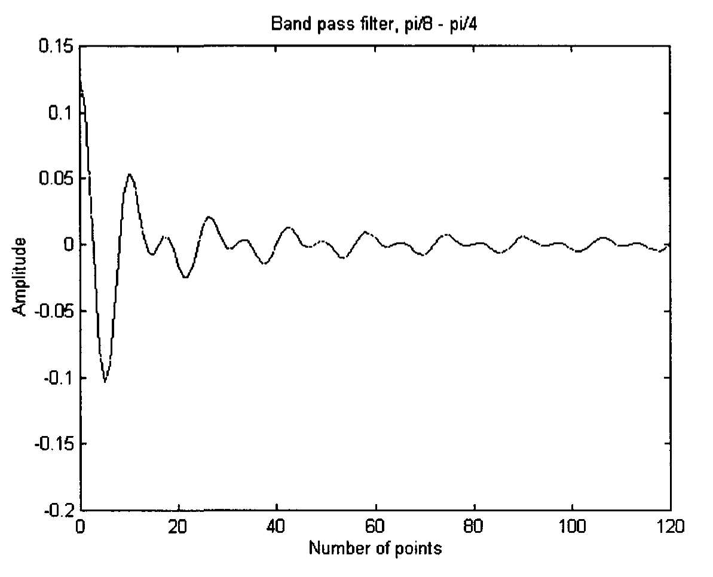
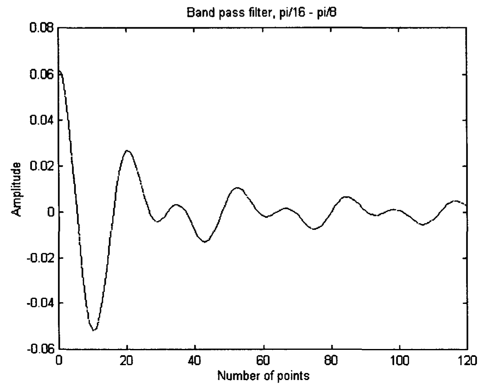
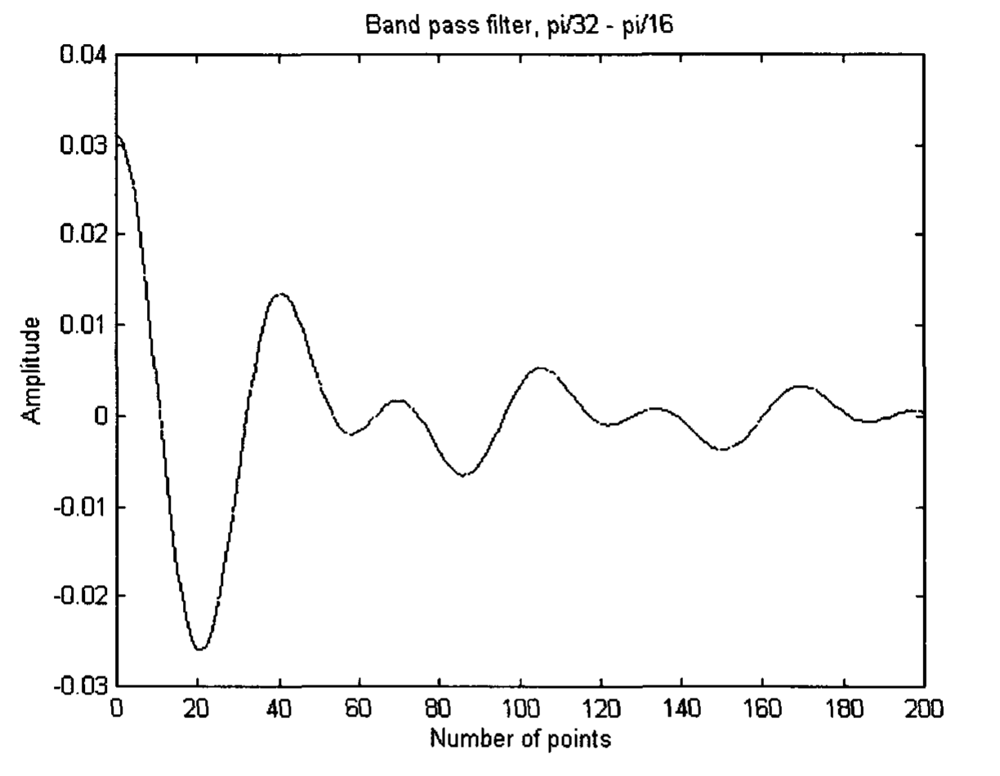

# Chapter 9: Wavelet Analysis

Wavelet analysis is a mathematical technique introduced in the nineteen eighties. Before then, signals are quite often analyzed by using Fourier Analysis. The Fourier Theorem states that every signal, no matter how complicated it may look, can be reproduced by adding a sufficient number of periodic curves called sine waves. Each sine wave has its own frequency and amplitude. In addition to how a signal can be synthesized, any arbitrary signal can also be analyzed. This is performed by using a certain filtering procedure to find out how much a particular sine wave contributes to a signal. The resulting list of sine waves is called the Fourier representation of a signal. Sine waves are periodic, and they go on and on forever. They are thus ideal for long, regular signals. However, sine waves do not cope well with signals of short duration. For a narrow spike, Fourier Analysis yields a very large number of sine waves of high frequencies, each of very long duration. When these sine waves are added together, they cancel each other out except at one point where they interfere constructively, creating the spike. Each sine wave component, taking individually, cannot pinpoint the timing of the spike.

This weakness of Fourier Analysis can be improved by using a procedure called windowed Fourier Analysis, where the signal is divided into a sequence of finite time slots called windows, and Fourier representation is found for each slot. However, as each window has a fixed, finite length, it is still not possible to locate a sharp spike very precisely. We would know which window the spike belongs to, but not exactly where it happens within the window.

Wavelet Analysis uses a flexible time window, and special mathematically designed waves called wavelets that can be stretched and translated in both frequency and time. The wavelets narrow while focusing on high frequency signals, and widen while searching for low frequency background. As a result, the frequency of the low frequency components are accurately defined at the expense of poor time localization. On the contrary, high frequency bands are precisely determined in time, but their frequencies are not well resolved (Lau and Weng 1995). This, however, is exactly what traders would like to see. They would like to know the long term trend from the low frequency background. At the same time, they would like to know the exact timing which can be extracted from high frequency signals when they would like to enter the market. As well, the wavelet approach is particularly appropriate in handling very irregular non-stationary data series. It deals well with signals of short duration, like bubbles and crashes.

In Chapter 5, we pointed out that trending indicators are actually low pass filters. They block out high frequency components of signals such as whipsaws but allow low frequency components of signals to go through. In other words, they smooth out the signals such that the traders would realize where the market is trending. In Chapter 6, we pointed out that oscillator indicators are high pass filters. They block out low frequency components such as trends and transmit high frequency components. They are used to find out the change of trend. Wavelets can be considered as band pass filters. They eliminate the very low frequencies and the very high frequencies and transmit the middle range frequencies. This is like keeping the middle layers of an onion. The middle layers can be further separated into different layers by adjusting the width of the wavelets. Unlike Fourier Analysis, which uses only sine waves as analyzing waves, wavelets come in different forms. Here, we will employ the sine wavelet, which is one of the commonly used wavelets, to analyze market price data. The width of the wavelet is changed such that it can filter out different range of frequencies. Three ranges of frequencies will be chosen. We will call these filters as high, middle and low wavelet indicators.

## 9.1 High Wavelet Indicator

The high wavelet indicator is a band pass filter which will transmit high circular frequency of the range between $\pi/8$ and $\pi/4$ radian, which corresponds to periods of 16 bars and 8 bars respectively. Its coefficients are given by

$$h_{-3}(k) = \frac{1}{\pi k} \left( \sin \frac{7\pi k}{8} - \sin \frac{\pi k}{4} \right) \qquad k = 0, 1, 2, 3, \ldots \tag{9.1}$$

Its derivation is given in Appendix 7. The values of its coefficients are plotted in Fig. 9.1 and listed in Appendix 7. The number of coefficients are arbitrarily chosen to be 121 (i.e., $k = 120$). For $k$ larger than 120, the coefficients are much smaller than those where $k$ are less than 120, and therefore ignored. The subscript '-3' of $h$ is a certain way to identify the wavelet indicator and will be explained in Appendix 7.

**Fig. 9.1.** Coefficients of the high wavelet indicator.

## 9.2 Middle Wavelet Indicator

The middle wavelet indicator is a band pass filter which will transmit middle circular frequency of the range between $\pi/16$ and $\pi/8$ radian, which corresponds to periods of 32 bars and 16 bars respectively. Its coefficients are given by

$$h_{-4}(k) = \frac{1}{\pi k} \left( \sin \frac{\pi k}{8} - \sin \frac{\pi k}{16} \right) \qquad k = 0, 1, 2, 3, \ldots \tag{9.2}$$

Its derivation is given in Appendix 7. The values of its coefficients are plotted in Fig. 9.2 and listed in Appendix 7. The number of coefficients are arbitrarily chosen to be 121 (i.e., $k = 120$). For $k$ larger than 120, the coefficients are much smaller than those where $k$ are less than 120, and therefore ignored.

**Fig. 9.2.** Coefficients of the middle wavelet indicator.

## 9.3 Low Wavelet Indicator

The low wavelet indicator is a band pass filter which will transmit low circular frequency of the range between $\pi/32$ and $\pi/16$ radian, which corresponds to periods of 64 bars and 32 bars respectively. Its coefficients are given by

$$h_{-5}(k) = \frac{1}{\pi k} \left( \sin \frac{\pi k}{16} - \sin \frac{\pi k}{32} \right) \qquad k = 0, 1, 2, 3, \ldots \tag{9.3}$$

Its derivation is given in Appendix 7. The values of its coefficients are plotted in Fig. 9.3 and listed in Appendix 7. The number of coefficients are arbitrarily chosen to be 201 (i.e. $k = 200$). For $k$ larger than 200, the coefficients are much smaller than those where $k$ are less than 200, and therefore ignored.

**Fig. 9.3.** Coefficients of the low wavelet indicator.

These wavelet indicators can be used to resolve market price data within one time frame into different frequency components. These can be compared to using trending indicators on various time frames (Note that trending indicators are low pass filters and always leave the low frequency background of the signal in the filtered signal). Thus, wavelet indicators offer traders the advantage of looking at market movements within one time frame but seeing the slow and fast activities simultaneously.

We will first take a look at how a high wavelet indicator can filter out the low frequency component of a signal, and how a cubic velocity indicator will act on the filtered signal as to indicate the peaks and valleys of the high frequency signal. Figure 9.4(a) shows a sine wave $p_1$ of high frequency (circular frequency $= \pi/6$) and a sine wave $p_2$ of low frequency (circular frequency $= \pi/16$) and their sum. The sum signal is then filtered by the high wavelet indicator (which will filter off the low frequency signal), and the filtered signal is then operated on by the cubic velocity indicator. The final result agrees reasonably well with the theoretical result shown in Fig. 9.4(b), where the derivative (or slope) of $p_1$ is plotted. This shows that the high wavelet indicator can filter away the low frequency component of the signal quite well. The cubic velocity indicator can then help to identify the top and bottom of this high frequency component. However, it should be mentioned that the agreement depends on the frequency of the signal being analyzed, as wavelet indicators, just like any other indicators, can shift the filtered signal from the original signal in time or phase.

**Fig. 9.4.** (a) shows the sum (marked as +) of a high frequency sine wave p1 (marked as \*) and a low frequency sine wave p2 (marked as x); (b) the sum signal is filtered by the high wavelet indicator and then operated on by the cubic velocity indicator. This signal (marked as .) is then compared to the derivative (or slope) of p1 (marked as \*).

Figure 9.5 shows a 5-minute chart of an US 30 year Treasury Bond Future. The top plot displays market price as well as its smoothing by $ama_1$ (thin line) and $ama_3$ (thick line). These ama lines are plotted for references only. The middle plot shows the cubic velocity indicator applied to the market closing price data after they have been filtered by the high (thick line), middle (middle thick line), and low (thin line) wavelet indicators. The bottom plot shows the summation of the amplitudes of all these three lines. This bottom plot can be considered as filtering the data with a band pass filter between $\pi/32$ and $\pi/4$ and then applying a cubic velocity indicator on the filtered data.

**Fig. 9.5.** A 5-minute chart of an US 30 year Treasury Bond Future. The middle plot shows the cubic velocity indicator applied to the market closing price data after they have been filtered by the high (thick line), middle (middle thick line), and low (thin line) wavelet indicators. The bottom plot shows the summation of the amplitudes of all these three lines. Chart produced with Omega Research TradeStation2000i.

At 9:50 a.m., the middle plot shows that all three lines are pointing up, providing a good entry point to go long in the market. At 12:50 p.m., the thin line is approximately zero and pointing down, implying that the long term trend is over. However, at that moment, the thick and middle thick line are positive and pointing up at the same time, showing that the bulls are coming back to support the market. At 2:50 p.m., the three lines are either negative or approximately zero and pointing down, indicating a good point to exit the market.

In this wavelet analysis, the very high (higher than $\pi/4$ radians) and very low (lower than $\pi/32$ radians) frequencies have been eliminated. Wavelet indicators, can, however, be constructed to include some of the very high, or some of the very low frequencies, if needed. Thus, wavelet indicators would form an efficient way to monitor a market in one time frame by dividing the signal into different frequency components. Nevertheless, they do have certain disadvantages. A large number of coefficients are required to perform good filtering in order to transmit certain frequency bands. Since frequency in market price data changes quite fast, a large number of coefficients will contribute some inaccuracy in the filtering. In addition, except at certain frequencies where there are no phase lags, wavelet indicators do introduce a certain amount of phase lag. The phase lags would be described in more detail in Appendix 7.
