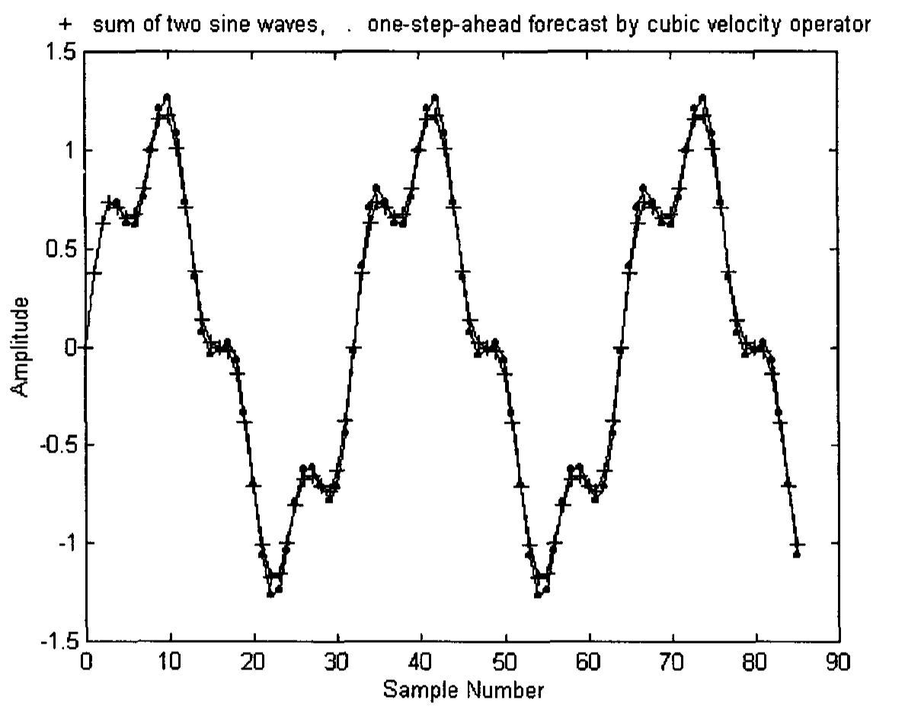
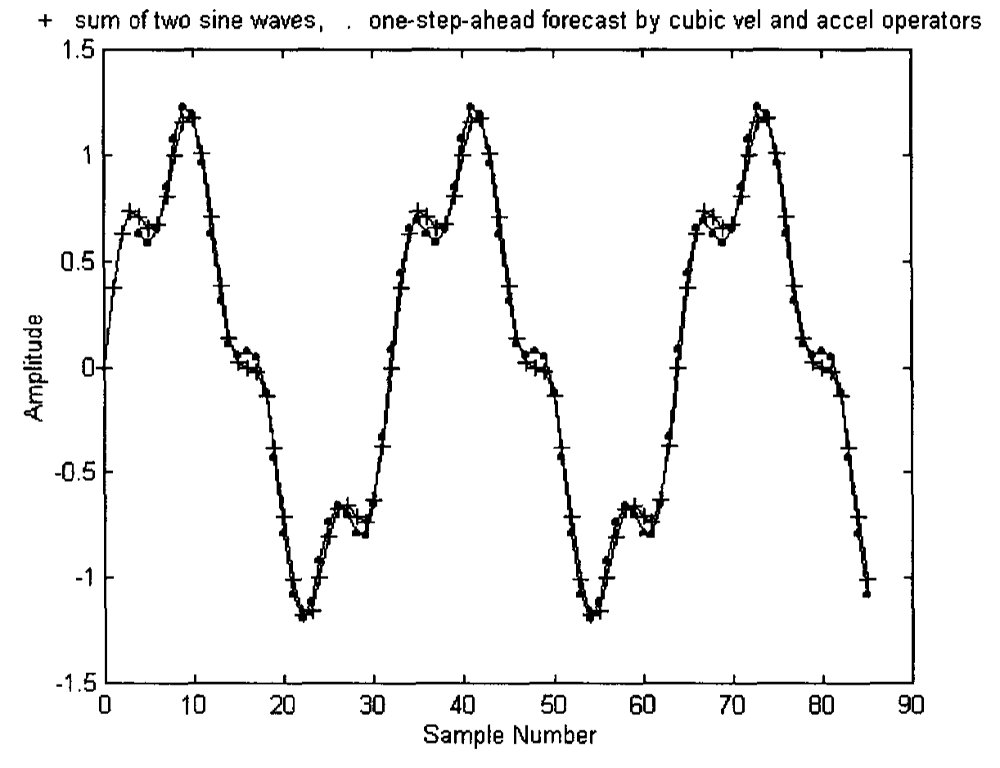
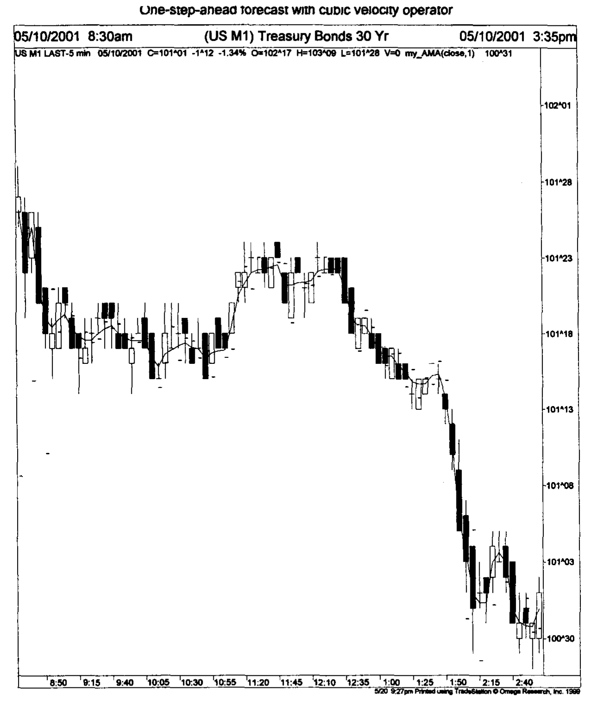

# Chapter 10: Other New Techniques

Two new ideas will be presented in this chapter to facilitate traders to make their decisions earlier so that they would have an advantage over other traders.

## 10.1 Skipped Convolution

Traders usually take specific market action from a chosen time frame and make certain judgement. For example, if a trader has a habit to trade in a 15-minute time frame, he will wait until the end of every 15 minutes (or near the end of every 15 minutes if his trading program can update the indicators every tick, a tick being the upward or downward price movement in a security's trades) before he makes a decision whether to enter a market. However, the market action can arrive 5 or 10 minutes earlier. It would, therefore, definitely be an advantage to recognize the action a few minutes earlier than other traders who are trading at the 15-minute time frame. What we can do is to use a 5-minute time frame, but analyze the signal in every 15-minute time interval. In that case, we would know the market action of the 15-minute time frame, but in every 5 minutes. We will introduce here a concept that will allow the trader to analyze the signal from a smaller time frame but using a larger time frame interval.

The concept is called skipped convolution whose mathematical details will be described in Appendix 8.

For an indicator with coefficients $h(0)$, $h(1)$, $h(2)$ and $h(3)$, its output response after convoluting with the market data is given by

$$y(0) = h(0)x(0) + h(1)x(-1) + h(2)x(-2) + h(3)x(-3) \tag{10.1}$$

where $x(0)$ is the closing price or the smoothed closing price of the current bar, $x(-1)$ is the closing price or the smoothed closing price of one bar ago, $x(-2)$ is the closing price or the smoothed closing price of two bars ago, $x(-3)$ is the closing price or the smoothed closing price of three bars ago.

If this indicator is applied in the 5-minute chart, but we would like to see its output response as if it were in a 15-minute chart, we can define the response in a skipped convolution with a skip 3:

$$y_3(0) = h(0)x(0) + h(1)x(-3) + h(2)x(-6) + h(3)x(-9) \tag{10.2}$$

where $x(-3)$ is the closing price or the smoothed closing price of three bars ago, $x(-6)$ is the closing price or the smoothed closing price of six bars ago, $x(-9)$ is the closing price or the smoothed closing price of nine bars ago.

Equation (10.2) will give us the output response of the indicator as if it were in a 15-minute chart but at every 5-minute interval. This means that if a specific market action comes 5 minutes or 10 minutes after a 15-minute interval in a 15-minute chart, the trader using Eq (10.2) in a 5-minute chart will detect the action 5 minutes or 10 minutes earlier than the trader using the same indicator in a 15-minute chart.

If the indicator is applied in the 5-minute chart, but we would like to see its output response as if it were in a 60-minute chart, we can define the response in a skipped convolution with a skip 12:

$$y_{12}(0) = h(0)x(0) + h(1)x(-12) + h(2)x(-24) + h(3)x(-36) \tag{10.3}$$

where $x(-12)$ is the closing price or the smoothed closing price of twelve bars ago, $x(-24)$ is the closing price or the smoothed closing price of twenty-four bars ago, $x(-36)$ is the closing price or the smoothed closing price of thirty-six bars ago.

Equation (10.3) will give us the output response of the indicator as if it were in a 60-minute chart but at every 5-minute interval. This means that if a specific market action comes 5, 10, 15, ... 50, 55 minutes after a 60-minute interval in a 60-minute chart, the trader using Eq (10.3) in a 5-minute chart will detect the action 5, 10, 15, ... 50, 55 minutes earlier than the trader using the same indicator in a 60-minute chart.

In the EasyLanguage code of Omega Research's TradeStation2000i, the program for calculating the skipped exponential moving average with a length of 3 can be written as a function as follows:

```EasyLanguage
Inputs: P(Numeric), D(Numeric);
emaL3D=
0.5*c[P+0]+0.25*c[P+D]+0.125*c[P+2*D]+0.0625*c[P+3*D]+0.0312*c[P+4*D]
+0.0156*c[P+5*D]+0.0078*c[P+6*D]+0.0039*c[P+7*D]+0.0020*c[P+8*D]
+0.0010*c[P+9*D]+0.0005*c[P+10*D]+0.0002*c[P+11*D]+0.0001*c[P+12*D]
+0.0001*c[P+13*D]
```

`emaL3D` is an exponential moving average function with length equals to 3 and a skip parameter equals to $D$. When $D = 1$, it is the same as an ordinary exponential moving average of length 3. The input numeric parameter $D$ allows the traders to skip analyzing price data at a predetermined regular interval. $P$ is another input numeric parameter. It allows the trader to choose the bar $P$ where he will start smoothing the data. This last feature would be useful when an indicator, e.g., cubic velocity indicator is applied to the smoothed skipped data. The coefficients in the program is calculated from Eq (A3.22) with $M = 3$ in Appendix 3.

For an exponential moving average of length equal to 6 and a skip parameter equals to $D$, it can be written as a function in the EasyLanguage code as follows:

```EasyLanguage
Inputs: P(Numeric), D(Numeric);
emaL6D=
0.2857*c[P+0]+0.2041*c[P+D]+0.1458*c[P+2*D]+0.1041*c[P+3*D]
+0.0744*c[P+4*D]+0.0531*c[P+5*D]+0.0379*c[P+6*D]+0.0271*c[P+7*D]
+0.0194*c[P+8*D]+0.0138*c[P+9*D]+0.0099*c[P+10*D]+0.0071*c[P+11*D]
+0.0050*c[P+12*D]+0.0036*c[P+13*D]+0.0026*c[P+14*D]+0.0018*c[P+15*D]
+0.0013*c[P+16*D]+0.0009*c[P+17*D]+0.0007*c[P+18*D]+0.0005*c[P+19*D]
+0.0003*c[P+20*D]
```

The coefficients in the program is calculated from Eq (A3.22) with $M = 6$ in Appendix 3.

After smoothing the data with an exponential moving average in a skip fashion, we can apply an indicator to the smoothed data if we choose. The indicator can be a skipped indicator. The following program, written as an indicator in EasyLanguage code, shows how to apply the skipped cubic velocity indicator on the smoothed skipped data.

```EasyLanguage
{Skipped cubic velocity indicator}
Inputs: D(Numeric);
Plot1(11*emaL3D(0,D)/6-3*emaL3D(D,D)+3*emaL3D(2*D,D)/2
    -emaL3D(3*D,D)/3,"Plot1");
Plot2(11*emaL6D(0,D)/6-3*emaL6D(D,D)+3*emaL6D(2*D,D)/2
    -emaL6D(3*D,D)/3,"Plot2");
Plot3(0,"Plot3");
```

In this program, $D$ is an input parameter, which provides the skipping for the cubic velocity indicator. It should be noted that the skip parameter $D$ of the skipped indicator has the same value as the skip parameter $D$ of the exponential moving average functions. The first plot plots the response of the skipped cubic velocity indicator after the data has been skipped smoothed by an exponential moving average of length 3. The second plot plots the response of the skipped cubic velocity indicator after the data has been skipped smoothed by an exponential moving average of length 6. The third plot plots a horizontal straight line as a reference where the velocity is 0.

An example is given in Fig. 10.1, which shows a 5-minute chart of a US 30 year Treasury Bond Future. Exponential moving averages, ema3 and ema6 (see Chapter 5) with a skip 3 ($D = 3$ in `emaL3D` and `emaL6D` function programs) were first employed to smooth the market price. A cubic velocity indicator with a skip 3 convolution ($D = 3$ in the skipped cubic velocity indicator program) was employed to convolute with the smoothed skipped data. This is equivalent to getting a 15-minute chart response but in a 5-minute interval. The velocity responses (ema3, thin line; ema6, thick line) are shown in the middle plot. Exponential moving averages, ema3 and ema6, with a skip 12 ($D = 12$ in `emaL3D` and `emaL6D` function programs), were also used to smooth the market price. A cubic velocity indicator with a skip 12 convolution ($D = 12$ in the skipped cubic velocity indicator program) was employed to convolute with the smoothed skipped data. This is equivalent to getting a 60-minute chart response but in a 5-minute interval. The velocity responses (ema3, thin line; ema6, thick line) are shown in the bottom plot.


**Fig. 10.1.** A 5-minute chart of a US 30 year Treasury Bond Future. The middle plot shows a skip 3 cubic velocity indicator applied to the market closing price data after they have been filtered by skip 3 exponential moving averages. The bottom plot shows a skip 12 cubic velocity indicator applied to the market closing price data after they have been filtered by skip 12 exponential moving averages. Chart produced with Omega Research TradeStation2000i.

At 11:10 a.m. (marked by an up arrow), the skip 3 velocities and the skip 12 velocities approached zero and pointed up. These implied that both the 15-minute traders and the 60-minute traders are bullish in the market. That signified a good buy entry point.

At 2:15 p.m. (marked by a down arrow), the skip 3 velocities and the skip 12 velocities approached zero and pointed down. These implied that both the 15-minute traders and the 60-minute traders are bearish on the market. That signified a good exit point. In both cases, we do not need to wait till the end of every 15 minutes or every 60 minutes to find out the indicator response in a 15-minute or 60-minute chart. We would know their response every 5 minutes, thus providing an advantage.

## 10.2 Forecasts

Traders would like to see forecasts of market values. You may run into a trading newsletter that claims that they can forecast what point the Dow Jones Industrial Average will be at a few years from now. However, market forecasting is a highly inaccurate exercise. It is even far less accurate than weather forecasting. The weather is a consequence of multiple forces in nature, which is complicated. The market is a consequence of thousands of human minds, which are even more complicated. In general, assuming if any event is forecastable at all, the farther the future is from the present moment, the larger the error would the forecast be. This is simply because events happening between the present and the forecasted future will affect the future being forecasted.

As the financial market has a highly unpredictable behavior, all traders can really hope for is that the actual market value lies within a certain % limit of the forecasted value (Box, Jenkins and Reinsel 1994). We will suggest here a forecasting method that makes use of the cubic velocity indicator and the cubic acceleration indicator. Even though the method can be used to forecast market value a few bars ahead, it is expected that the error will be large. Therefore, we will concentrate on forecasting market value only one bar ahead. This is called one-step-ahead forecast.

Using the cubic velocity indicator, the one-step-ahead forecast is given by

$$x(1) = \frac{11}{6}x(0) - 3x(-1) + \frac{3}{2}x(-2) - \frac{1}{3}x(-3) \tag{10.4}$$

where $x(1)$ is the forecasted closing price one bar ahead, $x(0)$ is the closing price or the smoothed closing price of the current bar, $x(-1)$ is the closing price or the smoothed closing price one bar ago, $x(-2)$ is the closing price or the smoothed closing price of two bars ago, $x(-3)$ is the closing price or the smoothed closing price of three bars ago.

The derivation of Eq (10.4) is given in Appendix 8.

Figure 10.2 shows a summation of two sine waves and the one-step-ahead forecast given by Eq (10.4). The forecasted values agree with the given values quite well.


**Fig. 10.2.** A summation of sine waves (marked as +) of circular frequency of π/16 radian with amplitude 1.0 and π/4 radian with amplitude 0.25. The one-step-ahead forecast (marked as .) using the cubic velocity indicator is also plotted.

A slightly modified forecasting method employs both the cubic velocity indicator and the cubic acceleration indicator. The one-step-ahead forecast is given by

$$x(1) = \frac{25}{6}x(0) - \frac{23}{2}x(-1) + \frac{23}{2}x(-2) - \frac{25}{6}x(-3) \tag{10.5}$$

The derivation of Eq (10.5) is given in Appendix 8.

Figure 10.3 shows a summation of two sine waves and the one-step-ahead forecast given by Eq (10.5). Again, the forecasting values agree with the given values quite well. While the agreements are better than those in Fig. 10.2 in some locations, the agreements are slightly worse than those in Fig. 10.2 in other locations. We therefore simply choose Eq (10.4) to be our one-step-ahead forecast in market trading.


**Fig. 10.3.** A summation of sine waves (marked as +) of circular frequency of π/16 radian with amplitude 1.0 and π/4 radian with amplitude 0.25. The one-step-ahead forecast (marked as .) using the cubic velocity and acceleration indicators is also plotted.

In the EasyLanguage code of Omega Research's TradeStation2000i, the program for calculating the forecasting indicator can be written as follows:

```EasyLanguage
Input: smooth(1);
Plot1(17/6*AMAFUNC2(c[1],smooth)-3*AMAFUNC2(c[2],smooth)
    +3/2*AMAFUNC2(c[3],smooth)-1/3*AMAFUNC2(c[4],smooth),"Plot1");
```

`AMAFUNC2` is the adaptive moving average function written by Jurik Research. The first input parameter of `AMAFUNC2` signifies the closing price series to be smoothed, while the second input parameter indicates the smoothness factor. The smoothness factor, called "smooth" in the program is an input parameter. It is taken to be 1 by default (shown inside the brackets after "smooth" in the first line of the program).

Figure 10.4 shows a 5-minute chart of the US 30 year Treasury Bond Future. An adaptive moving average with smoothness 1 (ama1) was used to average the closing price and is shown in a thin line. The one-step-ahead forecasted values are plotted in dashes and agreed reasonably with the closing prices they predicted.


**Fig. 10.4.** A 5-minute chart of a US 30 year Treasury Bond Future. The one-step-ahead forecast using the cubic velocity indicator are plotted in dashes. Chart produced with Omega Research TradeStation2000i.

The forecasting model described here is a simple model of what may happen. More sophisticated forecasting model, which analyses the frequency content of the data, has been described by Santana and Mendes (1992). Forecasting is performed using on-line adaptive filter predictors. However, market behavior can change drastically at a moment's notice. Any forecasting model should, at best, be looked upon as only some kind of guidance. Also, the forecasted value should include errors of estimation.
