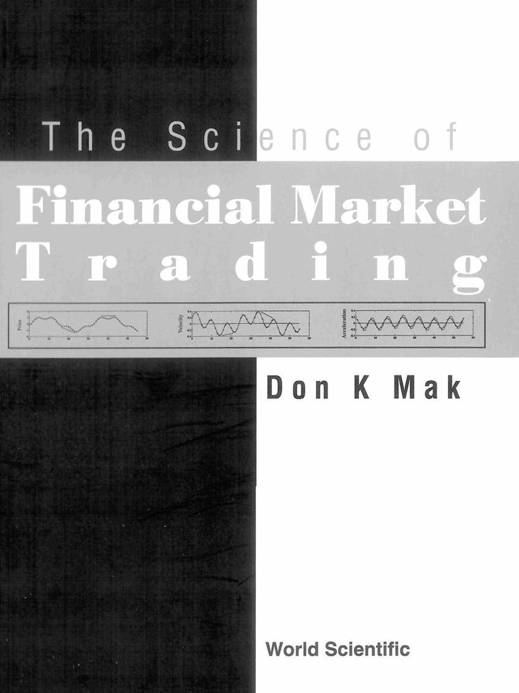

# The Science of Financial Market Trading

**Don K. Mak** (2003)

```bibtex
@book{mak2003science,
  author    = {Mak, Don K.},
  title     = {The Science of Financial Market Trading},
  year      = {2003},
  publisher = {World Scientific},
  address   = {Singapore},
  isbn      = {978-981-238-252-8},
  doi       = {10.1142/5178},
  url       = {https://www.worldscientific.com/worldscibooks/10.1142/5178}
}
```

## Chapters

1. [Introduction](ch-01.md)
2. [Is the Market Random?](ch-02.md)
3. [Models of the Financial Market](ch-03.md)
4. [Signals and Indicators](ch-04.md)
5. [Trending Indicators](ch-05.md)
6. [Oscillator Indicators](ch-06.md)
7. [Vertex Indicators](ch-07.md)
8. [Various Timeframes](ch-08.md)
9. [Wavelet Analysis](ch-09.md)
10. [Other New Techniques](ch-10.md)
11. [Trading Systems](ch-11.md)
12. [Financial Markets are Complex](ch-12.md)

## Appendices

- [Appendix 1: Time Series Analysis](ap-01.md)
- [Appendix 2: Signals and Systems](ap-02.md)
- [Appendix 3: Low Pass Filters](ap-03.md)
- [Appendix 4: High Pass Filters](ap-04.md)
- [Appendix 5: Vertices](ap-05.md)
- [Appendix 6: Downsampling and Upsampling](ap-06.md)
- [Appendix 7: Wavelets](ap-07.md)
- [Appendix 8: Skipped Convolution and Forecasting](ap-08.md)
