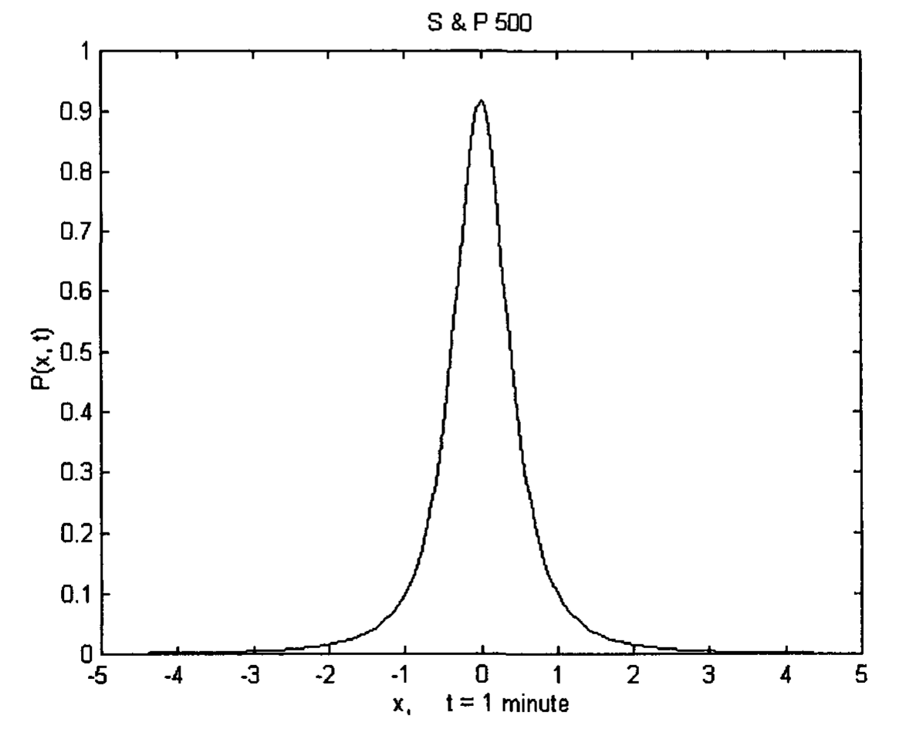

# Chapter 2: Scientific Review of the Financial Market

How the financial market has been modeled in different endeavors has been described by Mak [2003]. From all perspectives, it seems as if it would be best modeled as a complex phenomenon. A complex system contains a number of agents who are intelligent and adaptive. The agents make decisions on the basis of certain rules. They can modify old rules or create new rules as new information arises. They know at most what a few other agents are doing. They then decide what to do next based upon this limited information [Waldrop 1992, Casti 1995, Johnson et al 2003]. Scientists and mathematicians have been trying to draw some conclusions from the complex financial system. Some of their recent attempts are described below.

## 2.1 Econophysics

Over the past two decades, a growing number of physicists has become involved in the analysis of the financial markets and economic systems. Using tools developed in statistical mechanics, they were able to contribute to the modelling of the dynamics of the economy in a practical fashion. A new field, known as econophysics, has thus emerged [Mantegna and Stanley 2000]. The field benefits from the large database of economic transactions already recorded. Several findings are described below.

### 2.1.1 Log-Normal Distribution of Stock Market Data

In 1900, Bachelier wrote that price change in the stock market followed a one-dimensional Brownian motion, which has a normal (Gaussian) distribution [Mandelbrot 1983, 1997]. Since the 1950's, the distribution of the stock price changes has been considered by several mathematicians. The Gaussian distribution was soon replaced by the log-normal distribution. Stock prices are performing a geometric Brownian motion, and the differences of the logarithms of prices are Gaussian distributed. A full review of these investigations can be found in Crow and Shimizu [1988].

Recently, Antoniou et al [2003] analyzed the statistical relations between prices and corresponding traded volumes of a number of stocks in the United States and European markets. They found that, for most stocks, the statistical distribution of the daily closing prices normalized by corresponding traded volumes (price/volume) fits well the log-normal function. The statistical distribution is given by:

$$f(x) = \frac{A}{x \sigma \sqrt{2\pi}} \exp\left(-\frac{1}{2\sigma^2}(\ln x - \mu)^2\right) \tag{2.1}$$

where $x$ = price/volume, $A$ is a normalizing factor, $\sigma$ is the dispersion, $\mu$ is the mean value.

For some other stocks, the log-normal function is attained after application of a detrending process.

They have also discovered that the distributions of the stocks' traded volumes normalized by their trends fit closely the log-normal functions. However, market indices have significantly more complicated characters, and cannot be approximated by log-normal functions.

Other stock market models have been proposed by other researchers. They are particularly employed to explain the observation that the tails of distributions in real data are fatter than expected for a log-normal distribution.

### 2.1.2 Levy Distribution

Among the alternative models proposed is the conjecture that price change is governed by a Levy stable distribution [Mandelbrot 1983, 1997]. The distribution is leptokurtic, i.e., it has wings larger than those of a normal process. It has described well the price variations of many commodity prices, interest rates and stock market prices [Mandelbrot 1983].

In 1995, Mantegna and Stanley showed that the central part of the probability distribution of the Standard & Poor 500 index (S & P 500) can be described by the Levy stable process. Furthermore, when the process is rescaled, the transformations fit well time intervals spanning three orders of magnitude, from 1,000 min to 1 min. The Levy distribution will be described in more detail in Chapter 12.

### 2.1.3 Tsallis Entropy

Time evolving financial markets can be described in terms of anomalously diffusing systems, where a mean-square displacement scales with time, $t$, according to a power-law, $t^\alpha$ [Michael and Johnson, 2002]. Anomalously diffusion systems can be treated by employing the nonlinear Fokker-Planck equation associated with the Ito-Langevin process [Tsallis and Bukman 1996]. The solution of the equation is a time-dependent probability distribution which maximize the Tsallis entropy. The probability distribution can be written as:

$$P(x, t) = \frac{1}{Z(t)} \left\{1 + \beta(t)(q-1)[x - x^*(t)]^2\right\}^{-1/(q-1)} \tag{2.2}$$

where $x$ is a price change during a time interval $t$, $x^*$ is the mean, $Z$ (a normalization constant) and $\beta$ are Lagrange multipliers, $q$ is a Tsallis parameter.

The 1-min-interval data of the S & P 500 stock market index collected from July 2000 to January 2001 has been used as a test case. A nonlinear $\chi^2$ fit of Eq (2.2) for $t = 1$ minute yields $q = 1.64 \pm 0.02$, $\beta = 4.90 \pm 0.11$. $Z$ can be calculated to be $1.09 \pm 0.02$. The data fits the probability distribution, $P$, quite well.

It can be shown that, in compliance with probability theory:

$$\int P(x, t) \approx 1 \tag{2.3}$$

The data were then fitted to different time intervals $t$, viz, 10 min and 60 min with $q = 1.64$ fixed, and $\beta$ determined by the fit. These data again fit the Tsallis distribution, $P$, quite well. This shows that $P$ yields a solution to the time evolving Fokker-Planck equation, which describes an anomalously diffusing system. Anomalous diffusion implies that price changes during successive time intervals are not independent. This is consistent with traders responding to earlier price changes. The diffusion of the financial market indicates correlation, and hence a non-trivial time dependence.

**Fig 2.1** Tsallis distribution, P, of the 1-min-interval data of the S & P 500 index.

Symmetrical probability distributions of market price changes can imply that the market is random. To a first approximation, it probably is. However, looking at the market in more detail, is it really random? We will take a look at this issue in the next section.

## 2.2 Non-Randomness of the Market

The academia has been insisting that the market can be described by the Random Walk Hypothesis. The randomness is achieved through the active participation of many investors and traders. They aggressively digest any information that is available, and incorporate those information into the market prices, thus eliminating any profit opportunities. Therefore, in an informationally efficient market, price changes must be unforecastable. The Efficient Market Hypothesis actually states that, in an active market that includes many well-informed rational investors, securities will be appropriately priced and reflect all available information. The Efficient Market Hypothesis is considered as a close relative of the Random Walk Hypothesis.

### 2.2.1 Random Walk Hypothesis and Efficient Market Hypothesis

In the last decade or so, some academics are having a second thought about the randomness of the market. In the book "A Non-Random Walk Down Wall Street", Lo and MacKinlay [1999] has demonstrated convincingly that the financial markets are predictable to some degree.

They first pointed out that the Random Walk Hypothesis and the Efficient Markets Hypothesis are not equivalent statements. One does not imply the other, and vice versa. In other words, random prices does not imply a financial market with rational investors, and non-random prices does not imply the opposite. The Efficient Market Hypothesis only takes into account the rationality of the investors and information available, but not of the risk that some investors are willing to take. If a security's expected price change is positive, an investor may choose to hold the asset and bear the associated risk. On the contrary, if the investor wants to avert risk at a certain time, he may choose to dump his security to avoid having unforecastable returns. At any time, there are always investors who have unexpected liquidity needs. They would trade and possibly lose money. This does not mean that they do not know the information, nor are they irrational.

Lo and MacKinlay [1999] further employed a variance-ratio test (see section 2.2.2) to show that the market was not random. They also discovered that they were not the first study to reject the random walk. Papers describing the departures from random walk have been published since 1960, but were largely ignored by the academic community. They then concluded that the apparent inconsistency of their findings and the general support of the Random Walk Hypothesis is largely caused by the misconception that the Random Walk Hypothesis is equivalent to the Efficient Market Hypothesis, and the dedication of the economists to the latter.

### 2.2.2 Variance-Ratio Test

Lo and MacKinlay [1999] has proposed a test for the random walk based on the comparison of variances at different sampling intervals, as variance is considered a more sensitive parameter than a mean when data is sampled at finer intervals. The test makes use of the fact that the variance of the increments of a random walk is linear with respect to the sampling interval. If stock prices are induced by a random walk, then, the variance of a monthly sample must be four times as large as that of a weekly sample.

They employed for computation the 1216 weekly observations from September 6, 1962 to December 26, 1985 of the equal-weighted Center for Research in Security Prices (CRSP) returns index. The modified variance ratios of the 2-week, 4-week, 8-week and 16-week returns to the 1-week return were calculated. All these ratios are statistically different from 1 at the 5% level of significance. This can be compared with the random walk where the modified variance ratio is 1. Thus, they concluded that the random walk null hypothesis could be rejected. They further pointed out that the modified variance ratio of 2-week return to 1-week return should be approximately equal to 1 plus the first-order autocorrelation coefficient estimator of weekly returns. The first-order autocorrelation for weekly returns thus calculated is approximately 30%. Therefore, the random walk null hypothesis can be easily rejected even on the basis of autocorrelation alone. Using the same variance analysis with daily returns, they also found that the case against the random walk was equally compelling.

They then changed the base observation period to 4 weeks. The modified variance ratios of the 8-week, 16-week, 32-week and 64-week returns to the 4-week return were calculated. The ratios showed that the random walk model could not be rejected. The result is consistent with previous studies which have also found weak evidence against the random walk when using monthly data.

All these results are further supported by a modified R/S statistic test which will be described in the next section.

### 2.2.3 Long-Range Dependence?

There are many theories that business cycles exist, and economics time series can exhibit long-range (monthly and yearly) dependence. To test this dependence, Lo and MacKinlay [1999] modified a "range over standard deviation" ("R/S") statistic which was first proposed by the English hydrologist Harold Edwin Hurst and later refined by Mandelbrot. The R/S statistic is the range of partial sums of deviations in a time series from its mean, rescaled by its standard deviation. However, it cannot distinguish between short-range and long-range dependence. The R/S statistic has to be modified so that its statistical behavior is invariant over short-term memory, but deviates over long-term memory. The modified statistic was then applied to daily and monthly CRSP stock return indexes over several sample periods. After correcting for short-range dependence, there was no evidence that long-range dependence existed. The test showed that there was little dependence in daily stock returns beyond one or two months.

Furthermore, the autocorrelograms of the daily and monthly stock return indexes were also plotted, with a maximum lag of 360 for daily returns, and 12 for monthly. It was found that for both indexes, only the lowest order autocorrelation coefficients were statistically significant.

Thus, the long-range dependence of stock returns uncovered by previous studies may not be the long-term memory in the time series, but simply the result of short-range dependence.

### 2.2.4 Varying Non-Randomness

In an update to their original variance ratio test for the weekly US stock market indexes, Lo and MacKinlay [1999] found that the more current data (1986--1996) conformed more closely to the random walk than the original 1962--1985 data. Upon investigation, they discovered that over the past decade, a few investment firms had exercised daily equity trading strategies devised to exploit the kind of patterns they revealed in 1988. This can provide a plausible explanation why recent data is more random. This observation also supports the idea that the market is a complex system. Traders, being very adaptive, will learn new information, and actively modify their rules to their advantages [Mak 2003]. This, in turn, will affect the market, and narrow any profitable opportunities.

## 2.3 Financial Market Crash

While probability distributions, like the Levy distribution, describes the central part of the distribution of market price variation quite well, they do not match the rare events, like the market crashes. Market crashes are outliers. Outliers are extreme values that do not fit the model. If so, another model needs to be considered to explain these rare occurrences.

### 2.3.1 Log-Periodicity Phenomenological Model

Sornette [2003] first formed an hypothesis that the time evolution of market prices were random walks. Using this hypothesis, he derived a result where the distribution of market drops would be exponential. Comparing this result with that constructed from indices of various countries, he found an apparent discrepancy, especially with respect to the large market drops usually known as crashes. It was then concluded that crashes could not be completely random. If so, they might be somewhat forecastable as other catastrophes, like earthquakes and ruptures of pressure tanks.

Sornette [2003] drew comparison of crashes to critical phenomena and nonlinear interactions in modern physics. He proposed a signature before a crash, a "bubble", as a log-periodic correction imposed on a power law for an observable exhibiting a singularity at time $t_c$, where $t_c$ is the time where the crash has the highest probability to occur. The oscillatory market index data is fitted to the following mathematical expression:

$$F_{lp}(t) = A_2 + B_2(t_c - t)^m [1 + C \cos(\omega \log((t_c - t)/T))] \tag{2.4}$$

The power law, $A_2 + B_2(t_c - t)^m$, represents the advancing price in the bull market. The price accelerates and eventually ends in a spike. This corresponds to a pattern described as a "half moon" by technical analysts [Prechter and Frost 1990]. Sornette noted the presence of oscillatory-like deviations in the trend. The oscillation is described by the cosine function of the logarithm of $(t_c - t)/T$. $A_2$, $B_2$, $t_c$, $m$, $C$, $\omega$ and $T$ are all fitting parameters. These parameters, of course, vary for different bubbles.

It should be noted that, unlike some catastrophes like earthquakes, bubbles and crashes are events occurred in financial markets, which are complex systems. A complex system contains a number of agents, who are intelligent and adaptive [Waldrop 1992; Casti 1995; Mak 2003]. They make decisions and behave according to certain rules. They can change the rules as new information arises. Thus, phenomena of natural disasters may be quite different from rare events in the financial markets.

Furthermore, critical phenomena and phase transitions in thermodynamics and statistical mechanics are interesting and significant areas to be studied [Stanley 1971; Huang 1963]. Nevertheless, comparing market crashes to these critical events can only be qualitative. In the market, rules can be changed. For example, following the market crash of October, 1987, the U.S. Securities and Exchange Commission installed the so-called circuit breakers to head off one-day stock market tumbles in the future. The market will be halted after a one-day decline of 10% in the Dow Jones Industrial Average. This inactive period will allow the traders to pause and evaluate their positions. These circuit breakers will definitely affect market crashes as well as their precursory patterns in the future.

### 2.3.2 Omori Law

The relaxation dynamics of a financial market just after a crash can be viewed in terms of a complicated system when the system experiences an extreme event. The relaxation is described by a power-law distribution, which implies that rare events can occur with a finite non-negligible probability. It has been shown that the dynamics follow the Omori Law [Lillo and Mantegna 2003]. The law describes the nonstationary period observed after a big earthquake. It says that, after a main earthquake, the number of aftershock earthquakes per unit time measured at time $t$, $n(t)$, decays as a power law. The law is written as

$$n(t) = K(t + \tau)^{-p} \tag{2.5}$$

where $K$ and $\tau$ are two positive constants, and $p$ is the exponent. The cumulative number of aftershocks, $N(t)$, observed until time $t$ after the earthquake can be obtained by integrating Eq (2.5) between 0 and $t$. $N(t)$ is thus given by

$$N(t) = \frac{K[(t+\tau)^{1-p} - \tau^{1-p}]}{1-p} \qquad p \neq 1 \tag{2.6a}$$

$$N(t) = K \ln(t/\tau + 1) \qquad p = 1 \tag{2.6b}$$

When the 1-min logarithm changes of the S & P 500 index, $r(t)$, (a quantity essentially equivalent to index return), is investigated after a financial crash, it has been found that the number of times $|r(t)|$ exceeds a given threshold, behaves like the Omori Law -- somewhat similar to $n(t)$. While the value of the exponent $p$ for earthquakes ranges between 0.9 and 1.5, $p$ for the financial market varies in the interval between 0.70 and 0.99. It has been further noted that the index return cannot be modeled in terms of independent identically distributed random process after a market crash. This observation would substantiate the claim that the market is not a random phenomenon.
