# Chapter 3: Causal Low Pass Filters

Trending indicators are used by traders to identify trends. They basically smooth the input data [Mak 2003]. They are actually low pass filters which filter off the high frequencies, leaving the low frequencies behind.

A filter is said to be causal if the output of the filter depends only on present and past inputs, but does not depend on future inputs [Proakis and Manolakis 1996, Strang and Nguyen 1997]. For traders, the indicators have to be causal as no future data is available.

## 3.1 Ideal Causal Trending Indicator

An ideal causal trending indicator to the traders would look like a brick wall filter whose bandwidth ranges from 0 to a cutoff frequency $\omega_c$. ($\omega$, in units of radians, is quite often called the circular frequency, and is equal to $2\pi f$, where $f$ is the reciprocal of the period, $T$). Frequencies larger than $\omega_c$ would be eliminated, while frequencies larger than 0 and less than $\omega_c$ will be kept with amplitude unchanged. In addition, for those frequencies kept, the phase would be unchanged, i.e., there is no time or phase lag. However, this design is mathematically impossible.

We have to live with something less ideal. One of the causal trending indicators favored by traders is the exponential moving average [Pring 1991, Elder 1993, 2002, Mak 2003]. This indicator will be described in the next section.

## 3.2 Exponential Moving Average

An exponential moving average (EMA) is a better tool than a simple moving average (SMA). A simple moving average takes the average of the input data with equal weights [Elder 1993, Mak 2003]. An exponential moving average gives greater weight to the latest data and thus responds to changes faster. It does not drop old data suddenly the way an SMA does. Old data fades away.

The equation for the output response of an EMA is given by

$$y(n) = \alpha x(n) + (1 - \alpha) y(n-1) \tag{3.1}$$

where

$$\alpha = 2/(M+1) \tag{3.2}$$

$M$ is a positive integer chosen by the trader and is often called the length of the EMA. Thus, $\alpha$ has to be equal or less than 1.

Equation (3.1) makes use of an output response that has already been processed. Filters that employ previously processed values are sometimes called recursive filter. To calculate the frequency response of EMA, the z-transform of Eq (3.1) is taken [Broesch 1997, Proakis and Manolakis 1996].

$$Y(z) = \alpha X(z) + (1 - \alpha) z^{-1} Y(z) \tag{3.3}$$

where $z = r \exp(i\omega)$ is a complex number in the complex plane, $r$ being the magnitude of $z$. $Y(z)$ is the transform of the output and $X(z)$ is the transform of the input.

Defining the transfer function as the output of the filter over the input of the filter

$$H(z) = Y(z)/X(z) \tag{3.4}$$

we get, for EMA

$$H(z) = \frac{\alpha}{1 - (1 - \alpha) z^{-1}} \tag{3.5}$$

The EMA has a single pole in its transfer function. A pole is a zero of the denominator polynomial of the transfer function $H(z)$. Restricting $z$ in the complex plane to $\exp(i\omega)$ on the unit circle (i.e. $r = 1$), the frequency response function $H(\omega)$ is given by

$$H(\omega) = \frac{\alpha}{1 - (1 - \alpha) \exp(-i\omega)} \tag{3.6}$$

The magnitude of $H(\omega)$ is given by [Lyons 1997]

$$|H(\omega)| = \frac{\alpha}{[1 - 2(1-\alpha)\cos\omega + (1-\alpha)^2]^{1/2}} \tag{3.7}$$

The phase is given by

$$\phi(\omega) = \tan^{-1} \frac{-(1 - \alpha) \sin\omega}{1 - (1 - \alpha) \cos\omega} \tag{3.8}$$

The magnitude and phase of $H(\omega)$ of EMA are plotted in Fig 3.1(a) and (b) respectively for $M = 3$ and $M = 6$, from $\omega = 0$ to $\pi$.

Traders quite often like to express the phase lag in terms of a lag in the number of data points (bars) [Ehlers 2001]. The lag in the number of data points can easily be calculated by dividing the phase, $\phi$, by the circular frequency, $\omega$. Fig 3.1(b) can be re-plotted in Fig 3.1(c) in terms of the lag in the number of bars. It should be noted that for $M = 3$, the phase lag is less than 1 bar. This small lag makes the EMA a rather popular tool for traders.

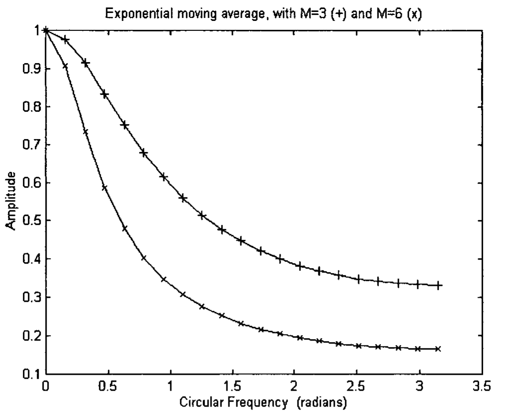

**Fig 3.1(a)** Amplitude response of an exponential moving average with M = 3 (marked as +) and M = 6 (marked as x) is plotted versus circular frequency ω from 0 to π.

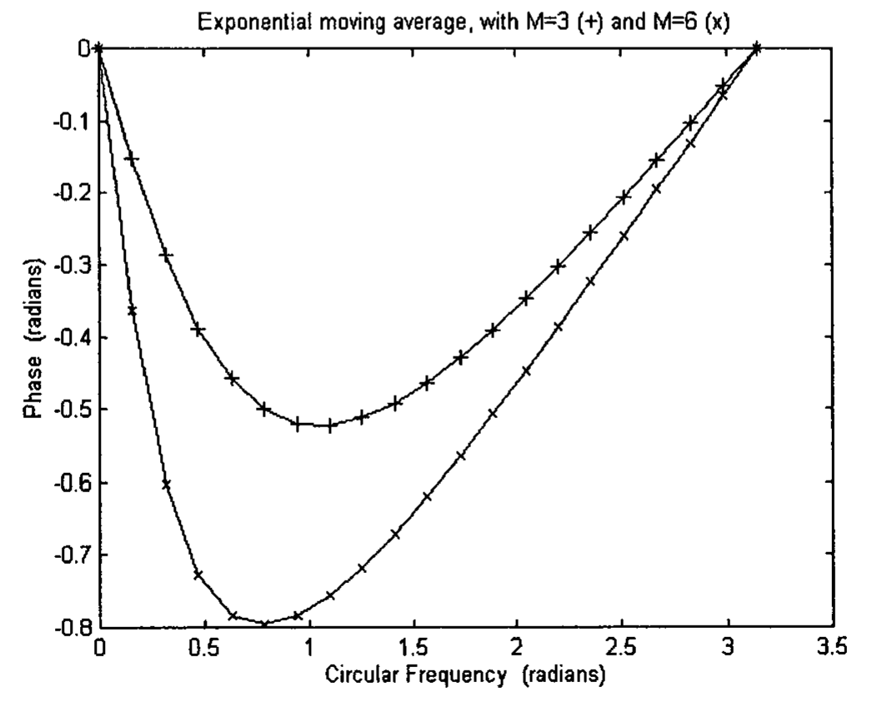

**Fig 3.1(b)** Phase response of an exponential moving average with M = 3 (marked as +) and M = 6 (marked as x).

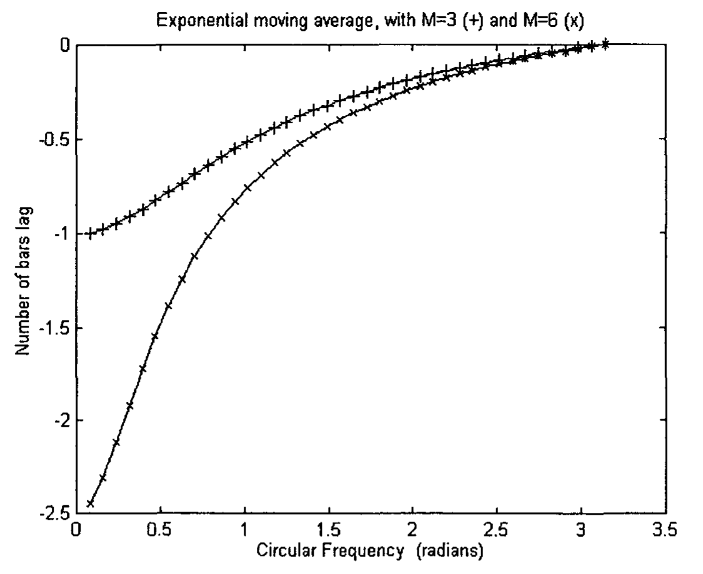

**Fig 3.1(c)** Phase response in terms of the number of bars lag of an exponential moving average with M = 3 (marked as +) and M = 6 (marked as x).

## 3.3 Butterworth Filters

One of the most commonly used low pass filters among electrical engineers is the Butterworth filter [Hamming 1989, Oppenheim et al 1999, Hayes 1999, Ehlers 2001]. We will analyze this filter for comparison purpose. The system function, $H(s)$ of the Butterworth filter can be given by [Hayes 1999]:

$$H(s) = \frac{1}{1 + a_1 s + a_2 s^2 + \cdots + a_{N-1} s^{N-1} + s^N} \tag{3.9}$$

where

$s = j\omega/\omega_c$

$\omega_c$ is the 3-dB cutoff circular frequency

$N$ is the order of the filter (number of poles in the transfer function)

$a$'s are coefficients of the polynomial and can be found in Hayes [1999].

The amplitude and phase of Eq (3.9) for $N = 1, 2, 3, 4$ with $\omega_c = 1$ are plotted in Fig 3.2(a) and 3.2(b) respectively. From Fig 3.2(a), it can be seen that the amplitude response of the filter decreases monotonically with $\omega$. As the filter order $N$ increases, the transition band, the region between the passband, where signals are passed, and the stopband, where signals are filtered off, becomes narrower. From Fig 3.2(b), we can see that a single pole Butterworth filter has a much larger phase lag than the single pole exponential moving average. As the number of poles increase, the phase lag gets larger. Thus, while the Butterworth filter is a very useful filter for electrical engineers, it is not so useful to traders.

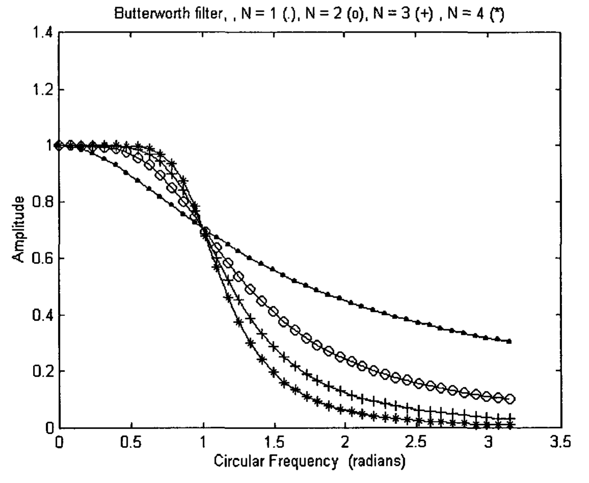

**Fig 3.2(a)** Amplitude response of the Butterworth filter for N = 1, 2, 3, 4 with $\omega_c = 1$.

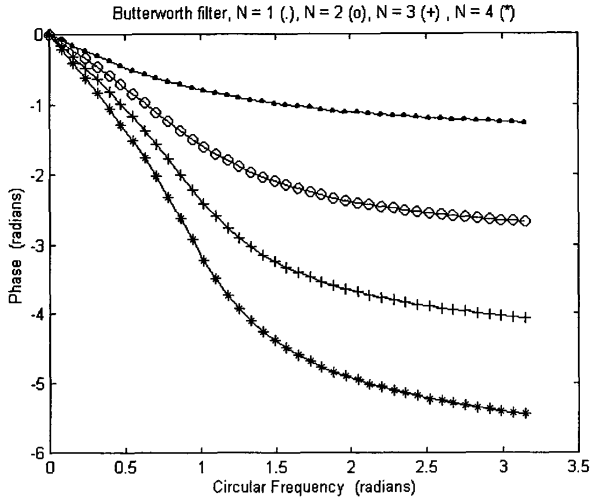

**Fig 3.2(b)** Phase response of the Butterworth filter for N = 1, 2, 3, 4 with $\omega_c = 1$.

## 3.4 Sine Function, n = 2

Sine functions have been mentioned in Mak [2003]. They can be considered as scaling functions, which are the father of wavelets [Hubbard 1998]. Scaling functions are actually low-pass filters while wavelets are band-pass filters. Wavelets will be considered in more detail in Chapter 5. Here we discuss the sine functions, which can be regarded as ideal low-pass filters [Strang 1997]. A sine function is considered a very good low pass filter as the frequency response looks like a step function with a cutoff frequency, $\omega_c$, eliminating signals with frequencies above the cutoff. It looks like a brick wall filter.

The discrete sine function can be written as:

$$h_n(k) = \frac{\sin \frac{\pi k}{n}}{\pi k} \quad \text{where } n = 1, 2, 3, \ldots \tag{3.10}$$

Eqn (3.10) can be considered as the scaling function for the sine wavelets [Mak 2003, P211]. For $n = 2$, the discrete sine function is written as

$$h_2(k) = \frac{\sin \frac{\pi k}{2}}{\pi k} \tag{3.11}$$

The coefficients, $h_2(k)$ is the unit impulse response of a low pass filter. They are plotted in Fig 3.3 for $k = 0, 1, \ldots, 120$. For $k$ larger than 120, $h_2(k)$ is approximately equal to zero, and does not have a large impact on the moving average of the data that it is convoluting. The coefficients $h_2(k)$ are listed in Appendix 1.

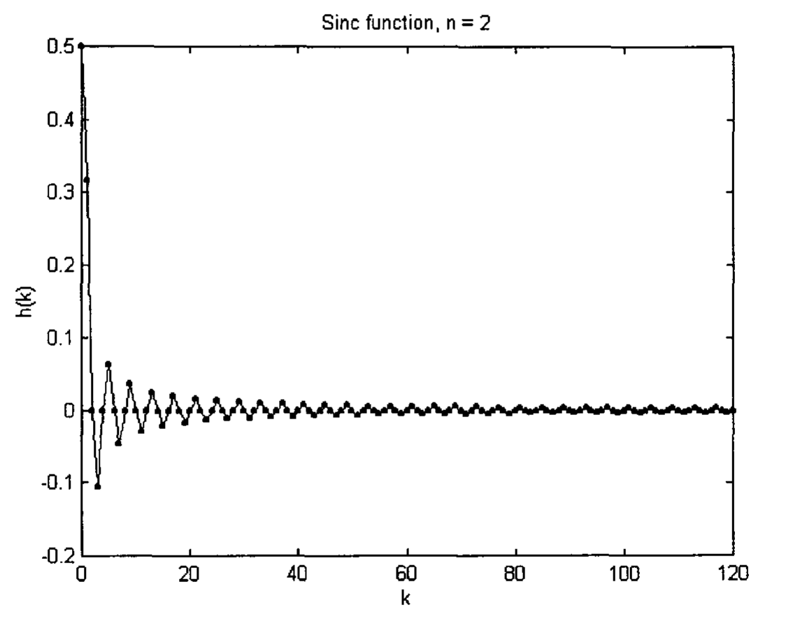

**Fig 3.3** The coefficients, $h_2(k)$, of the sinc function with $n = 2$.

The Fourier Transform of $h_2(k)$ can provide the frequency characteristics of the low pass filter. The amplitude and phase of the Fourier Transform are plotted in Fig 3.4(a) and (b) versus circular frequency $\omega$. Fig 3.4(a) shows that the low pass filter has a cutoff frequency at $\pi/2$. Fig 3.4(b) shows that it has a phase lag of less than 0.41 radians for circular frequency less than 1.3 radians. This means that it has less phase lag than the exponential moving average with $M = 3$ for this frequency range. However, for frequencies close to $\pi/2$, the phase lag increases drastically.

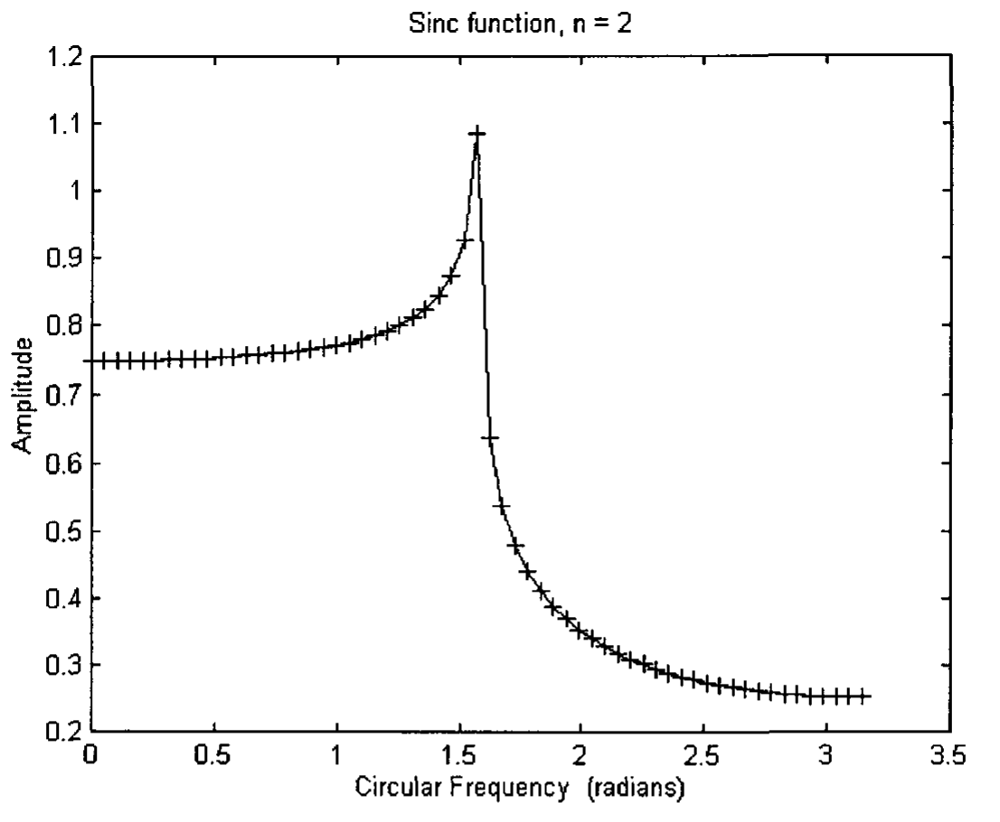

**Fig 3.4(a)** Amplitude response of the sinc function with $n = 2$.

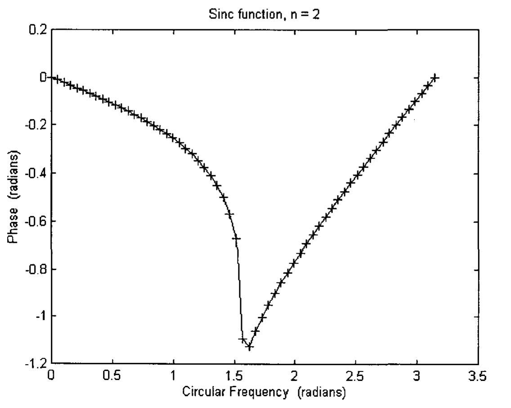

**Fig 3.4(b)** Phase response of the sinc function with $n = 2$.

## 3.5 Sine Function, n = 4

For $n = 4$, the discrete sine function is written as

$$h_4(k) = \frac{\sin \frac{\pi k}{4}}{\pi k} \tag{3.12}$$

The coefficients, $h_4(k)$ is the unit impulse response of a low pass filter. They are plotted in Fig 3.5 for $k = 0, 1, \ldots, 120$. For $k$ larger than 120, $h_4(k)$ is approximately equal to zero, and does not have a large impact on the moving average of the data that it is convoluting. The coefficients $h_4(k)$ are listed in Appendix 1.

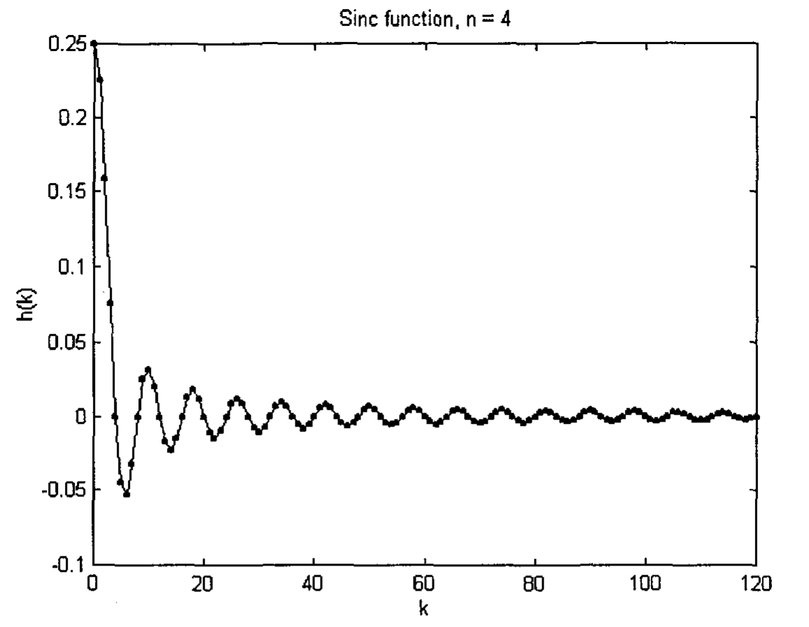

**Fig 3.5** The coefficients, $h_4(k)$, of the sinc function with $n = 4$.

The Fourier Transform of $h_4(k)$ can provide the frequency characteristics of the low pass filter. The amplitude and phase of the Fourier Transform are plotted in Fig 3.6(a) and (b) versus the circular frequency $\omega$. Fig 3.6(a) shows that the low pass filter has a cut-off frequency at $\pi/4$. Fig 3.6(b) shows that it has a phase lag of less than 0.4 radians for circular frequency less than 0.5 radians. This means that it has less phase lag than the exponential moving average with $M = 3$ for this frequency range. However, for frequencies close to $\pi/4$, the phase lag increases drastically.

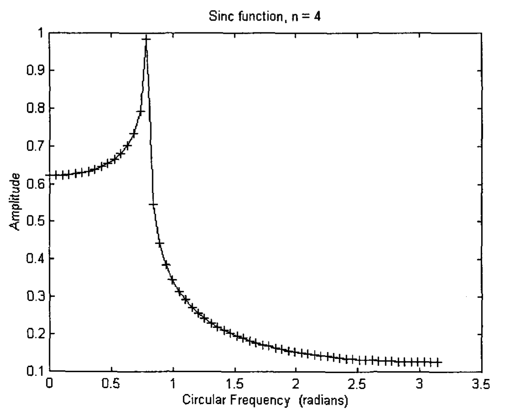

**Fig 3.6(a)** Amplitude response of the sinc function with $n = 4$.

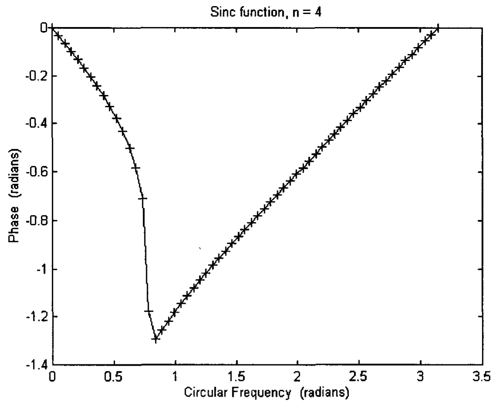

**Fig 3.6(b)** Phase response of the sinc function with $n = 4$.

Despite some of its shortcomings, the sine functions can be useful low-pass filters or trending indicators for traders due to their brick wall nature and small phase lag for part of the frequency range. They can be particularly useful when the sine wavelet filters are used at the same time [Mak 2003]. Their potentiality should be exploited.

## 3.6 Adaptive Exponential Moving Average

Moving averages that will adapt to the market environment have been suggested [Ehlers 2001]. One possibility is to vary the parameter, $\alpha$, in the original exponential moving average. Several illustrations have been given by Ehlers [2001]. Here, we create one example where $\alpha$ is a function of the circular frequency $\omega$. The estimation of $\omega$ will be considered in Chapter 6.

The equation for the output response of an EMA has been given by (Eq (3.1) and (3.2)):

$$y(n) = \alpha x(n) + (1 - \alpha) y(n-1) \tag{3.13}$$

where

$$\alpha = 2/(M+1) \tag{3.14}$$

To make the EMA adaptive, $\alpha$ would be made a variable ranging between a maximum $c$ (< 1) when $\omega$ is less than or equal to $\omega_0$ and a minimum value when $\omega$ is equal to $\pi$. The maximum and minimum values will be chosen by the trader. Thus, $\alpha$ would be dependent upon the circular frequency $\omega$, and can be written as follows:

$$\alpha = \begin{cases} c & \omega \leq \omega_0 \\ a/\omega + b & \omega_0 < \omega < \pi \end{cases} \tag{3.15}$$

Thus, for large $\omega$, $\alpha$ will be smaller and $M$ would be larger. This simply means that noisier data would be smoothed with an EMA with a larger $M$. We will set the maximum value of $\alpha$ to be 0.5 and the minimum value of $\alpha$ to be 0.05. When $\omega$ is less than or equal to 1 radian, $\alpha$ will be set to 0.5. When $\omega$ is equal to $\pi$ radian, $\alpha$ will be set to 0.05. Thus, substituting (1, 0.5) and ($\pi$, 0.05) into Eqn (3.15) will yield:

$$\alpha = \begin{cases} 0.5 & \omega \leq 1 \\ 0.66/\omega - 0.16 & 1 < \omega < \pi \end{cases} \tag{3.16}$$

The amplitude and phase of the transfer function $H(z)$ for $\alpha = 0.5$ (i.e. $M = 3$), $\alpha = 0.05$ ($M = 39$) and the adaptive $\alpha$ is plotted in Fig 3.7(a) and 3.7(b) respectively. It can be noted that the phase of the adaptive EMA is always less than 0.7 radians. The number of bars lag for different $\alpha$'s are plotted in Fig 3.7(c) and expanded in Fig 3.7(d) for $\alpha = 0.5$ (i.e. $M = 3$) and the adaptive $\alpha$, showing that the adaptive EMA has at most 1 bar lag. Thus, this adaptive EMA is a much better trending tool than the original EMA. However, it has the disadvantage that the circular frequency, $\omega$, has to be estimated accurately.

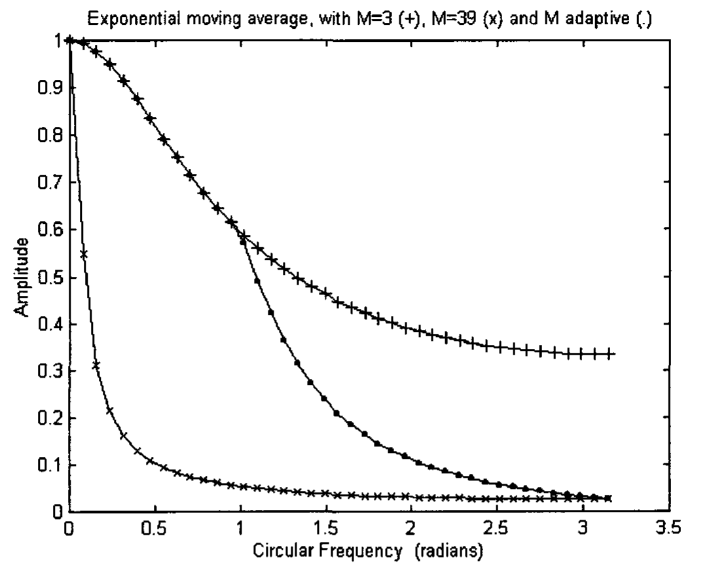

**Fig 3.7(a)** Amplitude response of the exponential moving average with $M = 3$ (plotted as +), $M = 39$ (plotted as x), and an adaptive $M$ (plotted as .).

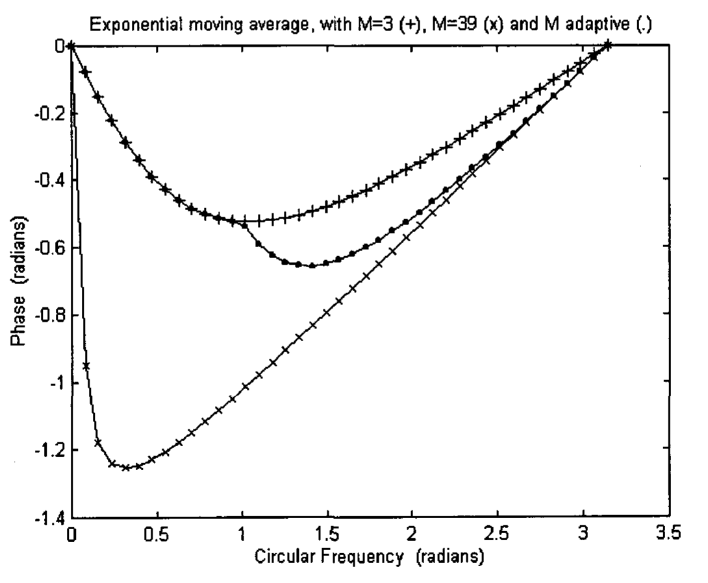

**Fig 3.7(b)** Phase response of the exponential moving average with $M = 3$ (plotted as +), $M = 39$ (plotted as x), and an adaptive $M$ (plotted as .).

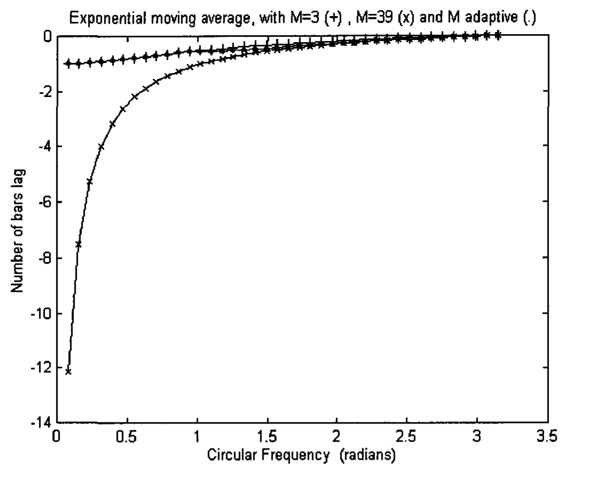

**Fig 3.7(c)** Number of bars lag of the exponential moving average with $M = 3$ (plotted as +), $M = 39$ (plotted as x), and an adaptive $M$ (plotted as .).

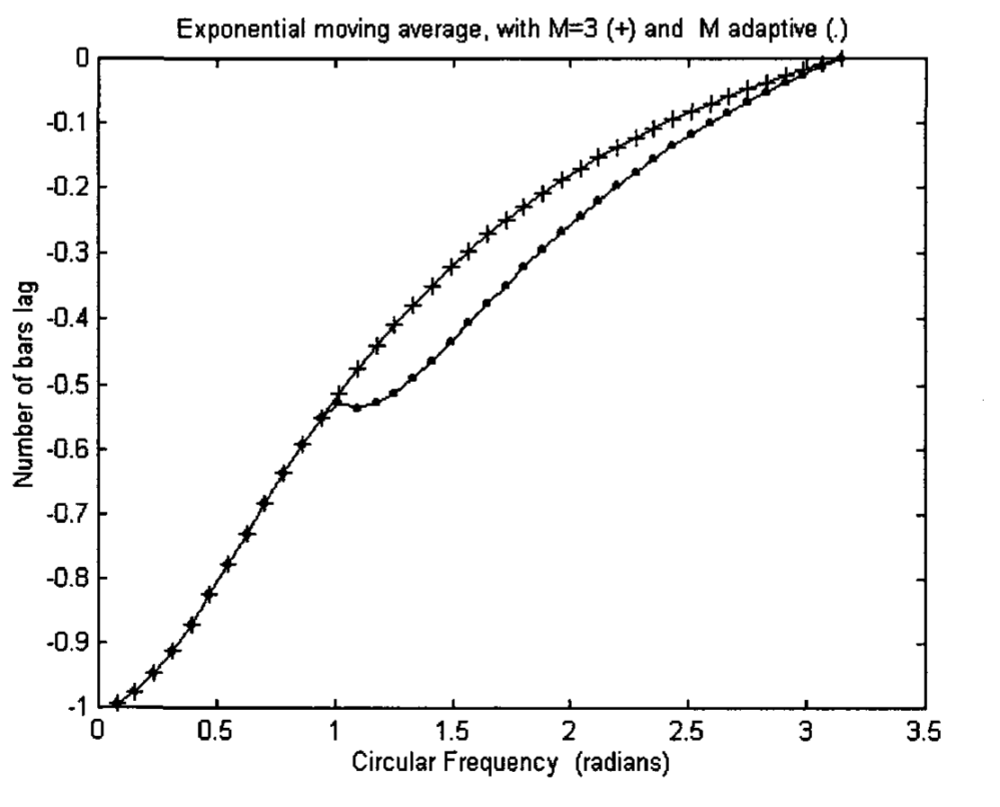

**Fig 3.7(d)** Number of bars lag of the exponential moving average with $M = 3$ (plotted as +) and an adaptive $M$ (plotted as .).

In the next chapter, we will see how the lag of an EMA can be reduced by some other means.
