# Chapter 4: Reduced Lag Filters

We can see from the last chapter that the popular exponential moving average (EMA) has a much less phase lag than some other filters, e.g., the Butterworth filter. Thus, it would be encouraging to modify the EMA such that it can have a lesser phase lag, at least in the pass-band where signals are passed.

In 1960, Dr. R. E. Kalman applied the concept of optimal estimation to terrestrial and space navigation system. The technique has proven to be a very useful tool. Some traders have modified his filtering technique to tracking the market. Basically, they make use of a forecasted price which is a function of the current price and an estimated velocity (or slope) of the price. One modification has been created by Ehlers [2001], and is called the zero-lag EMA (ZEMA).

## 4.1 "Zero-lag" EMA (ZEMA)

Dr. Ehlers [2001] has simplified the Kalman filter to a single equation. The modified EMA, called the Zero-lag EMA (ZEMA) would be written as:

$$\text{ZEMA} = \alpha \times (\text{CURRENT PRICE} + K \cdot V) + (1 - \alpha) \times (\text{OLD ZEMA}) \tag{4.1}$$

where

$$\alpha = 2/(M + 1) \tag{4.2}$$

$K$ is an adjustable parameter, $V$ is an estimate of the velocity of market price (see, e.g., below), and (CURRENT PRICE + $K \cdot V$) is used to estimate what the next price would be.

More specifically, he wrote:

- $V$ = Current Price - Price of 3 bars ago
- $K = 0.5$
- $\alpha = 0.25$, which means that $M = 7$.

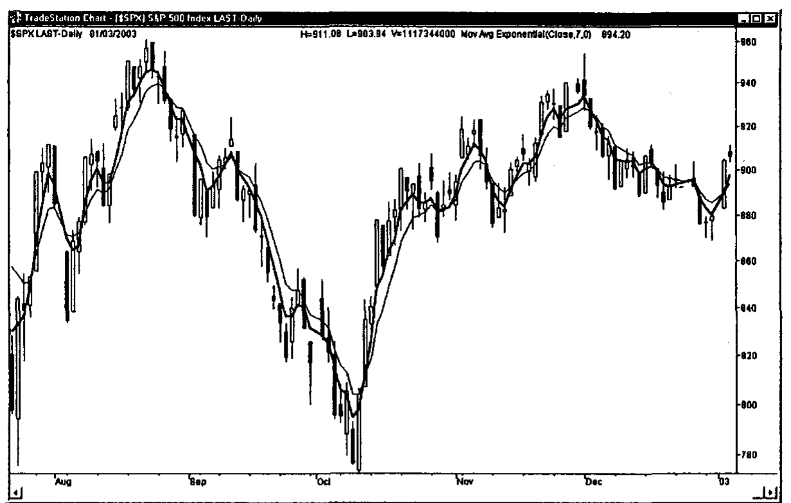

**Fig 4.1** The S & P 500 daily data are plotted together with the zero lag exponential moving average (ZEMA) (thick line) and EMA with $\alpha = 0.25$, i.e., $M = 7$ (thin line). *Chart produced with Omega Research TradeStation 2000i.*

In Fig 4.1 the S&P 500 daily data are plotted together with ZEMA (thick line) and EMA with $\alpha = 0.25$ (thin line). The prices within a one-day interval is plotted as a Japanese candlestick, which looks like a candle with wicks at both ends. The body of each candle represents the absolute difference between the opening and closing prices. If the closing price is lower than the opening, the body is black. If the closing price is higher, the body is white. The tip of the upper wick represents the high within the one-day interval, and the bottom of the lower wick represents the low within the one-day interval.

The zero-lag EMA did produce less lag than the original EMA with $\alpha = 0.25$. However, to check whether ZEMA has zero lag, we need to take a look at the phase plot of its response function, which is derived in Appendix 2. The amplitude and phase of the ZEMA response function are plotted in Fig 4.2(a) and (b). From Fig 4.2(a), it can be seen that the amplitude of ZEMA is somewhat larger than that of its original EMA for almost all frequencies. From Fig 4.2(b), it can be seen that the phase lag of ZEMA is much less than that of its original EMA for a large portion of the frequency range. However, its phase lag can be larger for a certain range of frequencies. In general, ZEMA cannot be described as zero lag, or even near zero lag.

ZEMA, just like EMA, can be considered as an infinite impulse response filter, i.e., it has an infinite number of nonzero filter (or indicator) coefficients, $h(k)$ [Mak, 2003]. However, for all practical purpose, it can be translated to a finite impulse response filter (see Appendix 2). The indicator coefficients of a finite impulse response can give us insight as to how an output signal is transformed from an input signal. The indicator coefficients, $h(k)$, of ZEMA is plotted in Fig 4.2(c), where $k = 0, 1, 2, 3, \ldots$ It can be seen from the figure that all the coefficients are positive and the first three coefficients are much larger than the rest, meaning that the first three price data points play a much larger role in determining the ZEMA output.

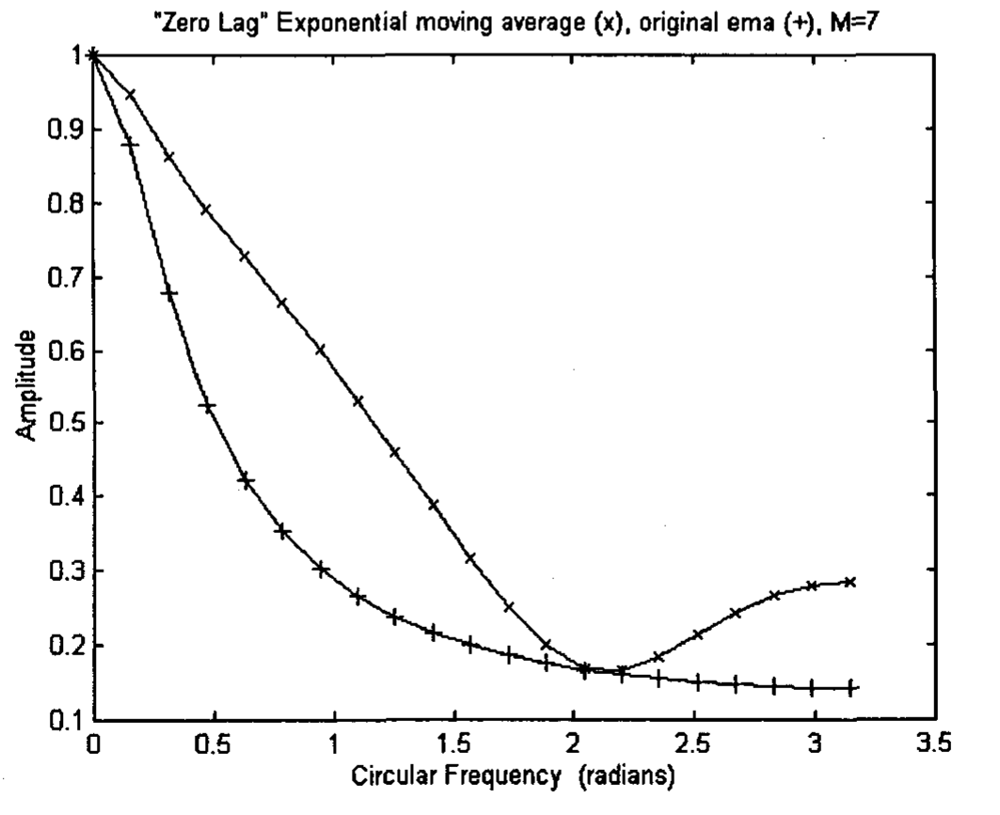

**Fig 4.2(a)** Amplitude response of the zero-lag exponential moving average (ZEMA) (plotted as x). Amplitude response of the exponential moving average (EMA) with $M = 7$ (plotted as +) is plotted in comparison.

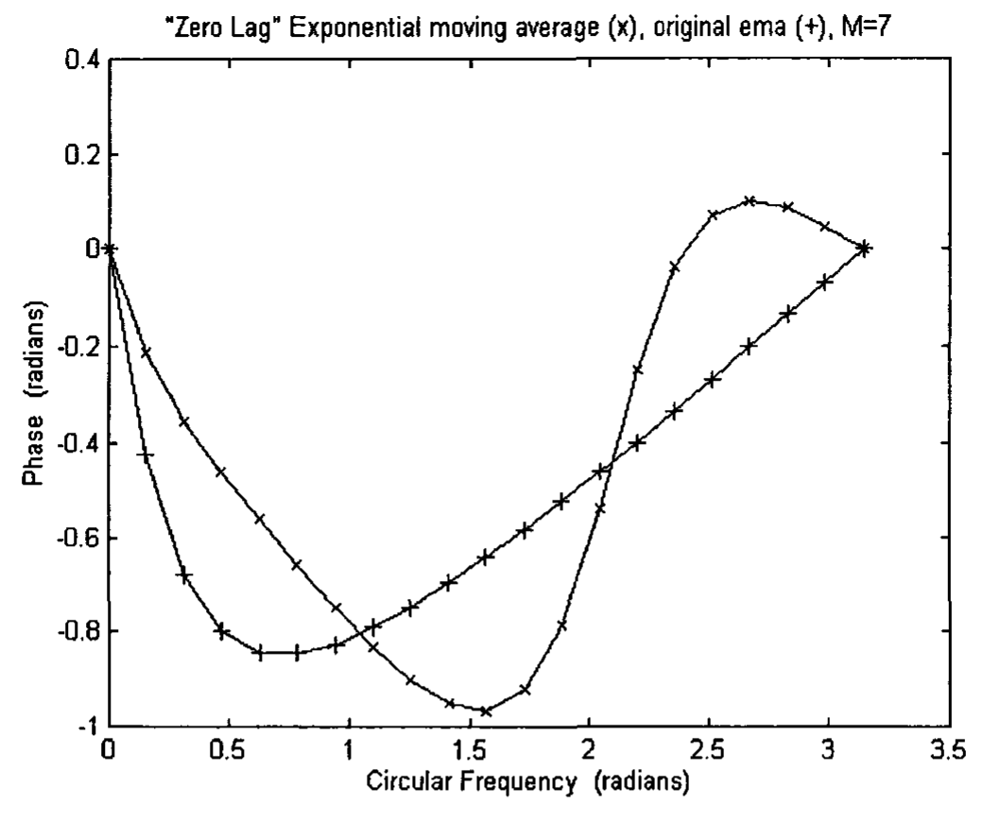

**Fig 4.2(b)** Phase response of the zero-lag exponential moving average (ZEMA) (plotted as x). Phase response of the exponential moving average (EMA) with $M = 7$ (plotted as +) is plotted in comparison.

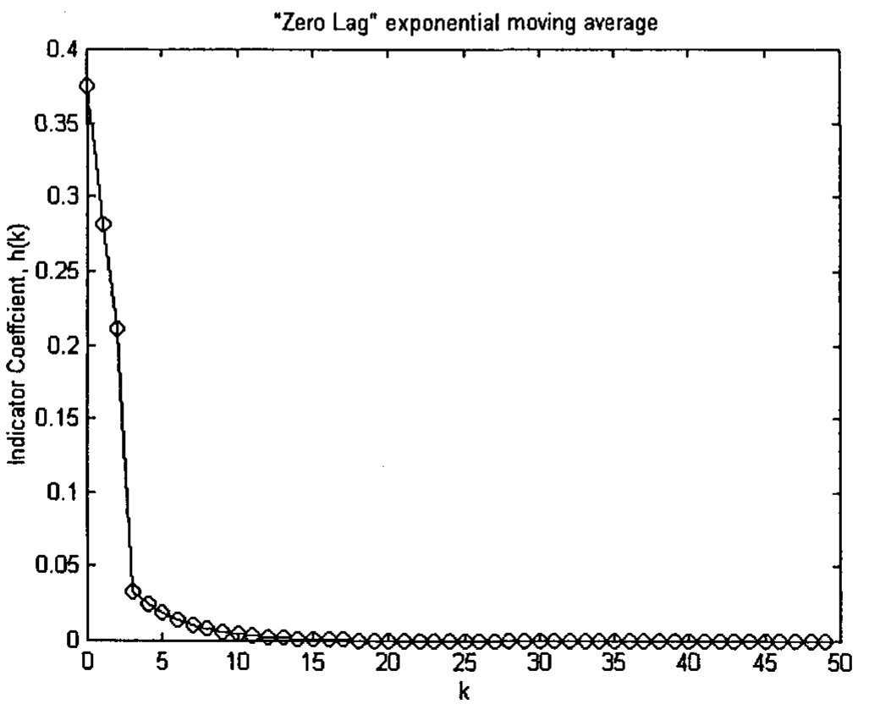

**Fig 4.2(c)** The indicator coefficients, $h(k)$, of the zero-lag exponential moving average (ZEMA).

In the next section, we will attempt to modify Eq (4.1) to see whether we can come up with a low pass filter which has much less phase lag.

## 4.2 Modified EMA (MEMA)

We modify Eq (4.1) and write

$$\text{MEMA} = \alpha \times (\text{CURRENT PRICE} + V) + (1 - \alpha) \times (\text{OLD MEMA}) \tag{4.3}$$

where

$$\alpha = 2/(M + 1) \tag{4.4}$$

$V$ is an estimate of the velocity, $M$ will be chosen to be 6. (CURRENT PRICE + $V$) is used to estimate what the next price would be. The cubic velocity indicator would be used to estimate $V$. Cubic velocity indicator has been described in Mak [2003] and will also be discussed in Chapter 8.

### 4.2.1 Modified EMA (MEMA), with a Skip 1 Cubic Velocity

The skip 1 cubic velocity mentioned in this section is actually exactly the same as the cubic velocity indicator. In the following two sections, we will be using skip 2 and skip 3 cubic velocity, as velocity is estimated using non-consecutive or skipped past price data. The concept of skipping came from a new idea, skipped convolution, introduced by Mak [2003]. Skipped convolution will be discussed in more detail in Chapter 9.

Eq (4.3) can be written as

$$y(n) = \alpha \left\{ x(n) + \left[ \frac{11}{6} x(n) - 3x(n-1) + \frac{3}{2} x(n-2) - \frac{1}{3} x(n-3) \right] \right\} + (1 - \alpha) \, y(n-1) \tag{4.5}$$

where $y(n)$ is the output response, $y(n-1)$ is the output response of one bar ago, $x(n)$ is the closing price, $x(n-1)$ is the closing price of one bar ago, $x(n-2)$ is the closing price of two bars ago, $x(n-3)$ is the closing price of three bars ago.

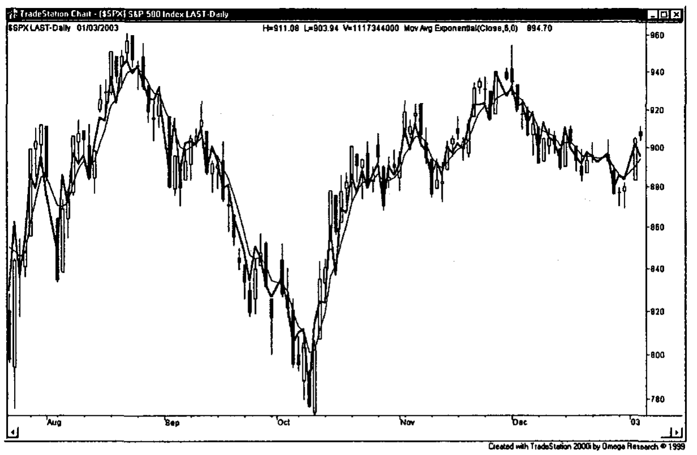

**Fig 4.3** The S & P 500 daily data are plotted together with the modified exponential moving average (MEMA) with a skip 1 cubic velocity (thick line) and an EMA with $M = 6$ (thin line). *Chart produced with Omega Research TradeStation 2000i.*

Fig 4.3 shows the S&P 500 data plotted with the modified EMA (thick line), which is compared with the original EMA with $M = 6$ (thin line). While the modified EMA does have a faster response than the original EMA, the response is not smooth. Before we attempt to improve on its smoothness, we will first take a look at the amplitude and phase of the response function of the modified EMA (Fig 4.4(a) and (b)). From Fig 4.4(b), we can see that the modified EMA has a much less phase lag than that of the original EMA, and that makes it rather suitable for trading purpose. However, from Fig 4.4(a), we can see that it is not exactly a low pass filter, as it allows high frequencies to pass through, which makes its output response rather not smooth.

For the sake of scientific insight, we will take a look at the indicator coefficient if we translate Eq (4.5) into a finite impulse response filter (see Appendix 2). Fig 4.4(c) plots the indicator coefficients of the modified EMA. It can be noted that the second coefficient is negative. This can be compared with the indicator coefficients of other low pass filters, (e.g., EMA [Mak 2003, P119, 120]), where all coefficients are positive.

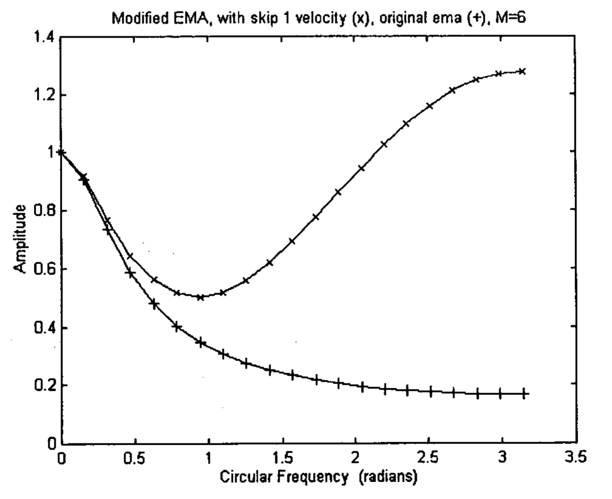

**Fig 4.4(a)** Amplitude response of the modified exponential moving average (MEMA) with a skip 1 cubic velocity (plotted as x). Amplitude response of the exponential moving average with $M = 6$ is plotted in comparison (plotted as +).

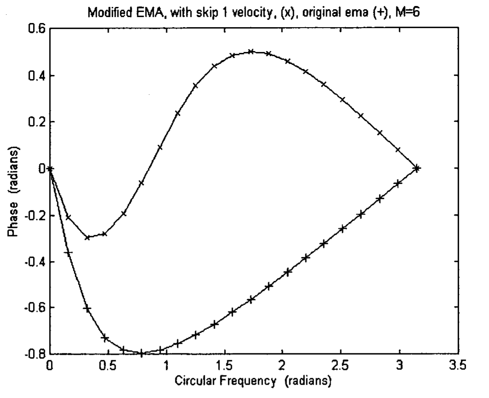

**Fig 4.4(b)** Phase response of the modified exponential moving average (MEMA) with a skip 1 cubic velocity (plotted as x). Phase response of the exponential moving average with $M = 6$ is plotted in comparison (plotted as +).

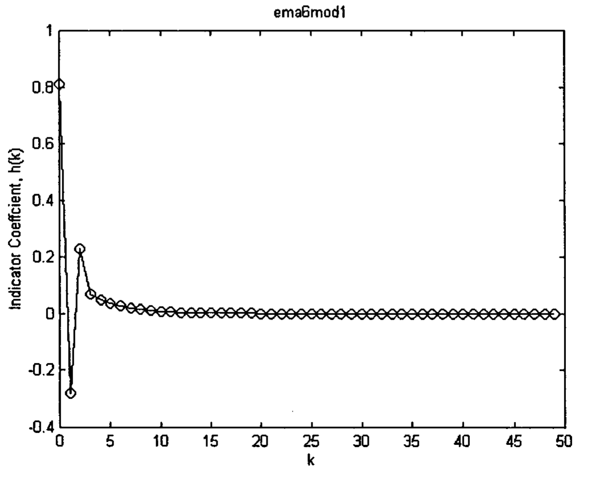

**Fig 4.4(c)** The indicator coefficients, $h(k)$, of the modified exponential moving average (MEMA) with a skip 1 cubic velocity.

### 4.2.2 Modified EMA (MEMA), with a Skip 2 Cubic Velocity

The output response of the modified EMA, with a skip 1 velocity can be smoothed if we increase the skip of the velocity.

Eq (4.3) can be written as

$$y(n) = \alpha \left\{ x(n) + \frac{1}{2} \left[ \frac{11}{6} x(n) - 3x(n-2) + \frac{3}{2} x(n-4) - \frac{1}{3} x(n-6) \right] \right\} + (1 - \alpha) \, y(n-1) \tag{4.6}$$

where $y(n)$ is the output response, $y(n-1)$ is the output response of one bar ago, $x(n)$ is the closing price, $x(n-2)$ is the closing price of two bars ago, $x(n-4)$ is the closing price of four bars ago, $x(n-6)$ is the closing price of six bars ago.

Because we use a skip 2 velocity, the factor $\frac{1}{2}$ in Eq (4.6) is necessary for yielding the correct velocity estimate.


**Fig 4.5** The S & P 500 daily data are plotted together with the modified exponential moving average (MEMA) with a skip 2 cubic velocity (thick line) and an EMA with $M = 6$ (thin line). *Chart produced with Omega Research TradeStation 2000i.*

Fig 4.5 shows the S&P 500 data plotted with the modified EMA using a skip 2 velocity (thick line), which is compared with the original EMA with $M = 6$ (thin line). The modified EMA have a faster response than the original EMA. Furthermore, the response is smoother than that of the modified EMA with a skip 1 velocity. We will take a look at the amplitude and phase of the response function of this modified EMA (Fig 4.6(a) and (b)). From Fig 4.6(a), we can see that the modified EMA is a low pass filter. From Fig 4.6(b), it can be seen the beginning part of the low frequencies being passed through has an approximately zero phase lag. However, the latter part of the low frequencies being passed through does have a larger phase lag than that of the original EMA. This, in general, would make this indicator a reasonable moving average for trading purpose. We will take a look at the indicator coefficient if we translate Eq (4.6) into a finite impulse response filter (see Appendix 2). Fig 4.6(c) plots the indicator coefficients of the modified EMA. It can be noted that the third and fourth coefficients are negative.

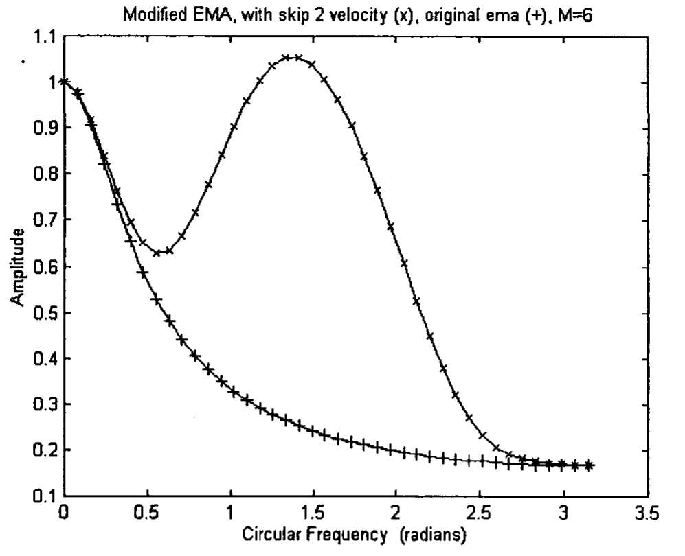

**Fig 4.6(a)** Amplitude response of the modified exponential moving average (MEMA) with a skip 2 cubic velocity (plotted as x). Amplitude response of the exponential moving average with $M = 6$ is plotted in comparison (plotted as +).

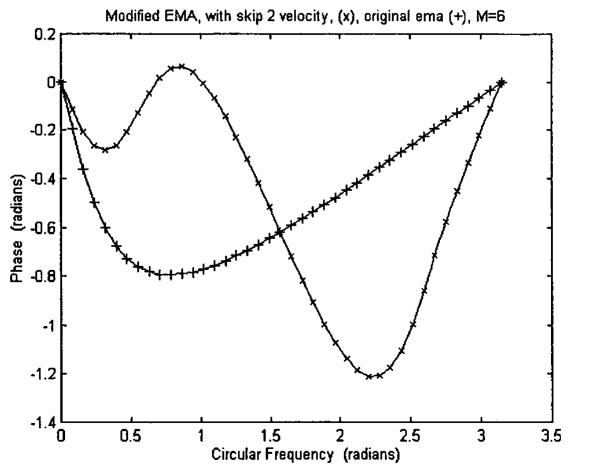

**Fig 4.6(b)** Phase response of the modified exponential moving average (MEMA) with a skip 2 cubic velocity (plotted as x). Phase response of the exponential moving average with $M = 6$ is plotted in comparison (plotted as +).

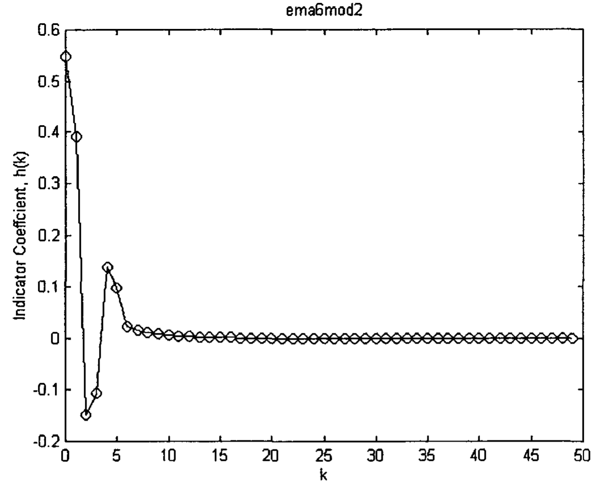

**Fig 4.6(c)** The indicator coefficients, $h(k)$, of the modified exponential moving average (MEMA) with a skip 2 cubic velocity.

### 4.2.3 Modified EMA (MEMA), with a Skip 3 Cubic Velocity

The output response of the modified EMA, with a skip 2 velocity can be further smoothed if we increase the skip of the velocity even further.

Eq (4.3) can be written as

$$y(n) = \alpha \left\{ x(n) + \frac{1}{3} \left[ \frac{11}{6} x(n) - 3x(n-3) + \frac{3}{2} x(n-6) - \frac{1}{3} x(n-9) \right] \right\} + (1 - \alpha) \, y(n-1) \tag{4.7}$$

where $y(n)$ is the output response, $y(n-1)$ is the output response of one bar ago, $x(n)$ is the closing price, $x(n-3)$ is the closing price of three bars ago, $x(n-6)$ is the closing price of six bars ago, $x(n-9)$ is the closing price of nine bars ago.

Because we use a skip 3 velocity, the factor $\frac{1}{3}$ in Eq (4.7) is necessary for yielding the correct velocity estimate.

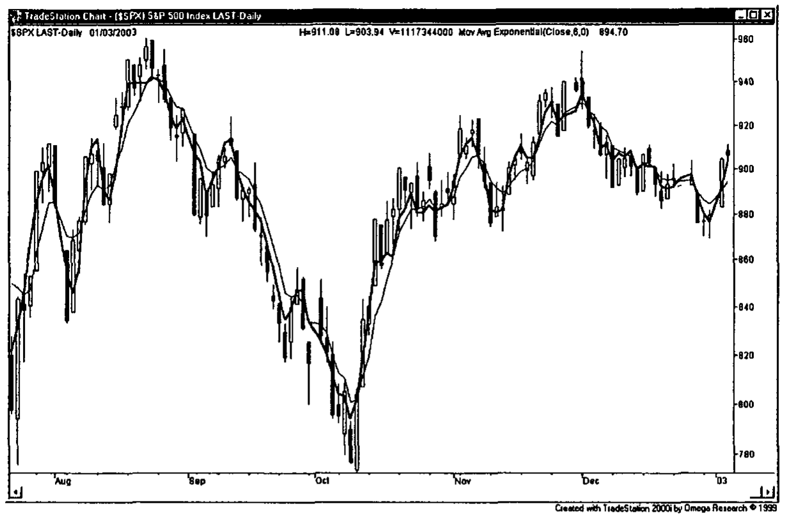

**Fig 4.7** The S & P 500 daily data are plotted together with the modified exponential moving average (MEMA) with a skip 3 cubic velocity (thick line) and an EMA with $M = 6$ (thin line). *Chart produced with Omega Research TradeStation 2000i.*

Fig 4.7 shows the S&P 500 data plotted with the modified EMA using a skip 3 velocity (thick line), which is compared with the original EMA with $M = 6$ (thin line). The modified EMA have a faster response than the original EMA. Furthermore, the response is smoother than that of the modified EMA with a skip 2 velocity. We will take a look at the amplitude and phase of the response function of this modified EMA (Fig 4.8(a) and (b)). From Fig 4.8(a), we can see that the modified EMA is a low pass filter with a lesser bandwidth than that of the modified EMA with a skip 2 velocity. From Fig 4.8(b), it can be seen the beginning part of the low frequencies being passed through has an approximately zero phase lag. However, the latter part of the low frequencies being passed through does have a larger phase lag than that of the original EMA. This, in general, would make this indicator a reasonably good moving average for trading purpose. From Fig 4.8(a), it can be seen that the amplitude has a peak when circular frequency is equal to $\pi$ (i.e. 180 degrees). This can increase noise to the output. The indicator coefficient can be viewed if we translate Eq (4.7) into a finite impulse response filter (see Appendix 2). Fig 4.8(c) plots the indicator coefficients of the modified EMA. It can be noted that the fourth, fifth and sixth coefficients are negative.

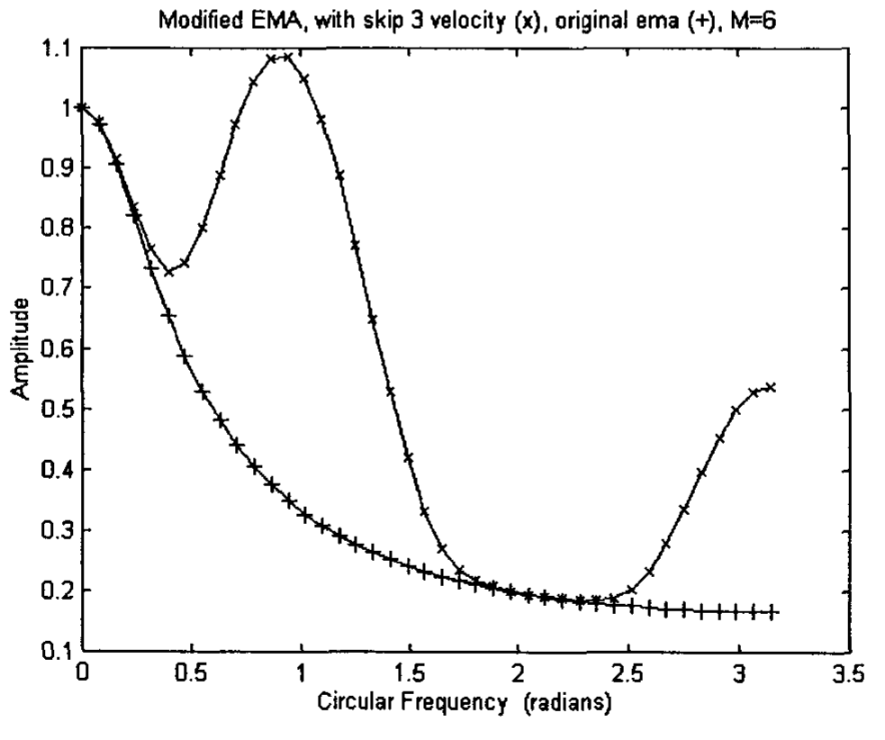

**Fig 4.8(a)** Amplitude response of the modified exponential moving average (MEMA) with a skip 3 cubic velocity (plotted as x). Amplitude response of the exponential moving average with $M = 6$ is plotted in comparison (plotted as +).

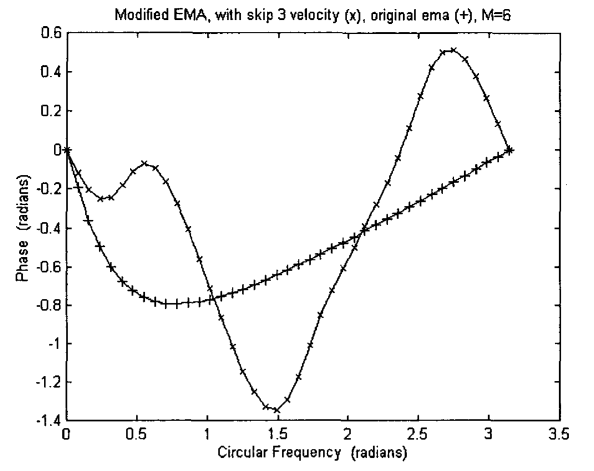

**Fig 4.8(b)** Phase response of the modified exponential moving average (MEMA) with a skip 3 cubic velocity (plotted as x). Phase response of the exponential moving average with $M = 6$ is plotted in comparison (plotted as +).

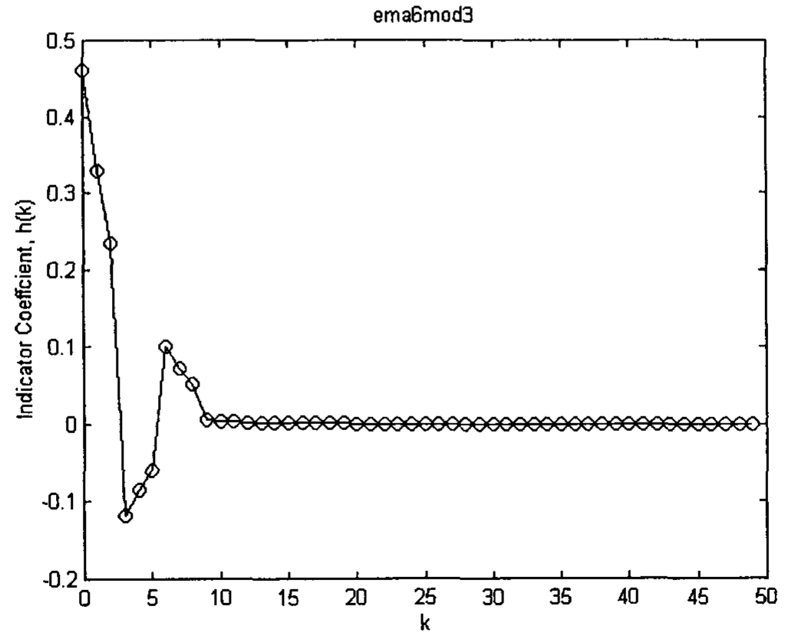

**Fig 4.8(c)** The indicator coefficients, $h(k)$, of the modified exponential moving average (MEMA) with a skip 3 cubic velocity.

The exponential moving averages modified with cubic velocity do have certain advantages. Phase lag in their low pass bands are generally less than those of the original exponential moving average. Comparing the amplitude and phase responses of the MEMA with a skip 1, 2 and 3 cubic velocity, it appears that the one with a skip 2 cubic velocity would provide the smoothest low pass filter for trading purposes.

### 4.2.4 Computer Program for Modified EMA (MEMA)

In the EasyLanguage code of Omega Research's TradeStation 2000i, the program for calculating the modified EMA can be written as follows:

```EasyLanguage
Description: This Indicator plots Exponential Moving Average
that has been modified with the cubic velocity indicator which was
calculated at interval of d, d=1,2,3,4,5,...., d is called the skip.

Inputs: d(3), Length(6);
Plot1(XAVERAGE(c + 1/d*(11/6*c - 3*c[d] + 3/2*c[2*d] - 1/3*c[3*d]), Length),
    "plot1");
```

XAVERAGE is a built-in exponential moving average function written by TradeStation 2000i. The first input parameter of XAVERAGE signifies the modified closing price series to be smoothed, while the second input parameter indicates the length, $M$, of the EMA. `c` represents the closing price of the current bar. `c[d]` represents the closing price of $d$ bars ago. `c[2*d]` represents the closing price of $2d$ bars ago, and `c[3*d]` represents the closing price of $3d$ bars ago. $d$ is an input parameter, and can be changed. It is taken to be 3 by default. The closing price, `c`, is modified by the skipped cubic velocity indicator. Length, $M$, of the Exponential Moving Average is taken to be 6 by default.
