# Chapter 5: Causal Wavelet Filters

Wavelet analysis is a mathematical tool introduced in the nineteen eighties. The technique has been discussed in detail in several books, e.g., Strang and Nguyen 1997, Rao and Bopardikar 1998, Burrus et al 1998, Daubechies 1992, Mallat 1999 and Kaiser 1994. It is particularly useful for analyzing signals of short duration. A brief summary is given in Mak [2003]. It has also been pointed out that wavelets can be an advantageous instrument for dissecting market data [Mak 2003].

Wavelets are actually bandpass filters and are adaptable to investigate market movements of long or short interval. Bandpass filters are filters that eliminate low and high frequency signals, retaining signals of middle frequencies. In that sense, they eliminate the slow trend and the noise of market actions. They can be further divided into different bands, thus giving traders the market rhythms in more details.

There are different kinds of wavelets, each one has its own father, which is called the scaling function. Scaling function is actually a low pass filter, which can yield the trend of the market. It has a cutoff frequency, $\omega_c$. Signals above $\omega_c$ will be eliminated. However, the eliminated signals can be analyzed by wavelets. Thus, together with their father, wavelets can tell the trader what the market is up to.

The cutoff frequency, $\omega_c$, of the scaling function can be chosen arbitrarily. To draw an analogy: imagine an onion with 12 layers. It can be divided into a center core of 4 layers and then other outer layers, or it can be divided into a center core of 6 layers, and other outer layers, or ... The center core is the scaling function, and the outer layers are the wavelets. In the terminology of electrical engineering, if there is a brick wall filter ranging in circular frequency from 0 to $\pi$, it can be divided into a low pass filter ranging in circular frequency from 0 to $\pi/8$ and then other bandpass filters, or it can be divided into a low pass filter ranging from 0 to $\pi/4$ and then other bandpass filters, or ...

Sine wavelets are one kind of wavelets, and have been described in Mak [2003]. Their scaling function is described in Chapter 3 of the present book. In this chapter, we will describe another popular wavelets called the Mexican Hat wavelets. As will be shown later, the causal Mexican Hat wavelet has much fewer filter coefficients than the sine wavelets, thus making it a more convenient tool for computational purpose. The Mexican Hat scaling function does not have an analytical form [Mallat 1999], and would not be investigated here.

## 5.1 Mexican Hat Wavelet

Mexican Hat wavelet can be expressed as

$$\psi(t) = (1 - 2t^2)\exp(-t^2) \tag{5.1}$$

This wavelet, different from the sine wavelet, has the advantage that it has a compact support in time, $t$, i.e., it spans in time with finite duration. It is obtained by taking the second derivative of the negative Gaussian function $\exp(-t^2/2)$. $\psi(t)$ is plotted in Fig 5.1. The Fourier Transform, $\Psi(\omega)$, of $\psi(t)$ is given by [Rao 1998 P13, Mallat 1999 P80].

$$F\{\psi(t)\} = \Psi(\omega) = \int_{-\infty}^{\infty} \psi(t) e^{-j\omega t} \, dt = -\sqrt{2\pi} \, \omega^2 e^{-\omega^2/4} \tag{5.2}$$

Amplitude of $\Psi(\omega)$ is plotted in Fig 5.2. It can be seen that the wavelet is a band-pass function. A function is a band-pass function if its Fourier Transform is confined to a frequency interval $\omega_1 < |\omega| < \omega_2$, where $\omega_1 > 0$ and $\omega_2$ is finite. The Fourier Transform of the Mexican Hat wavelet peaks at exactly 2 radians. Thus the wavelet provides a filter which centers at 2 radians.

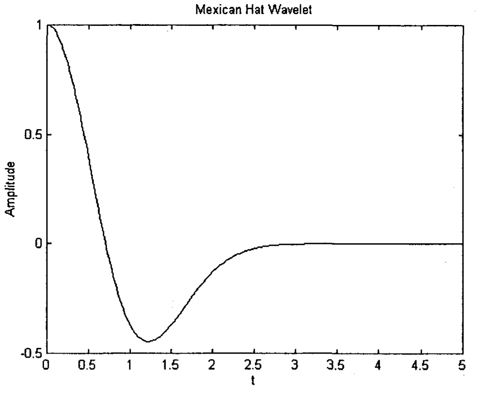
**Fig 5.1.** Mexican Hat wavelet in the time domain.

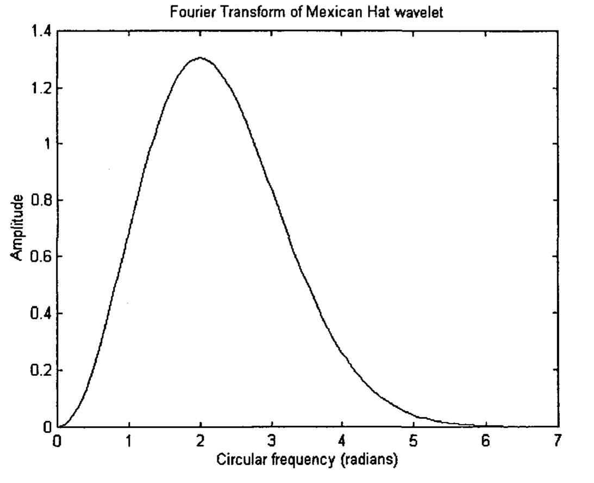
**Fig 5.2.** Amplitude of the Fourier Transform of the Mexican Hat wavelet plotted in circular frequency ω from 0 to 2π.

## 5.2 Dilated Mexican Hat Wavelet

The Fourier Transform of a wavelet which is dilated by a factor of $a$ is given by [Rao and Bopardikar 1998, Brigham 1974].

$$F\{\psi(t/a)\} = |a| \Psi(a\omega) \tag{5.3}$$

where $\psi(t)$ is called the mother wavelet, $|a|$ is the absolute value of $a$.

The center frequency of $F\{\psi(t/a)\}$ is $1/|a|$ times the center frequency of the Fourier Transform of the mother wavelet, $F\{\psi(t)\}$. When $\psi(t)$ is the Mexican Hat wavelet, its Fourier Transform centers at a frequency of 2 radians. Therefore, the Fourier Transform of its dilated waveform centers at $2/|a|$ radians. Thus, the larger the value of $|a|$, the smaller the center frequency is.

The magnitude of the frequency response, i.e., the absolute value of the LHS of Eqn (5.3), for different values of $a$, of the Mexican Hat Wavelet, are shown in Fig 5.3. The magnitude of the peaked frequencies, when divided by the respective $|a|$, are equal to each other.

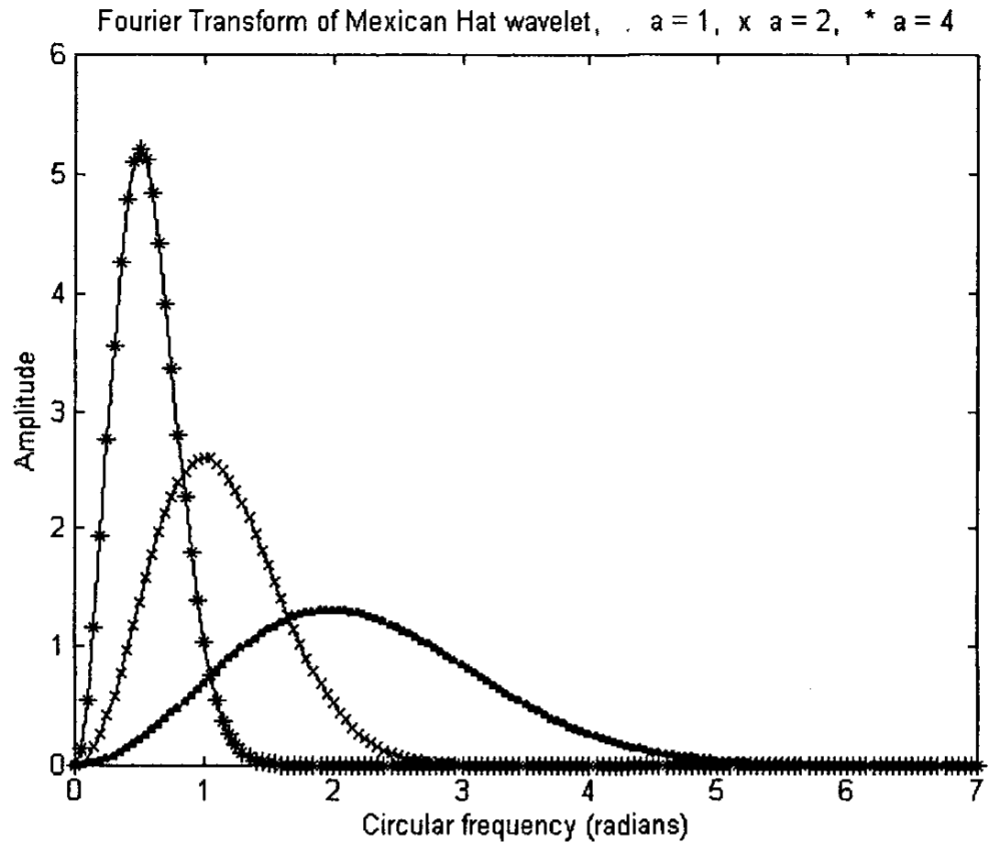
**Fig 5.3.** Amplitude of the Fourier Transform of the Mexican Hat wavelet for a = 1 (plotted as .), a = 2 (plotted as x) and a = 4 (plotted as *).

## 5.3 Causal Mexican Hat Wavelet

It should be noted that the RHS of Eqn (5.2) is real, i.e., there is no phase shift for all frequencies. This is because $\psi(t)$ is integrated in $t$ from $-\infty$ to $+\infty$. In real time data analysis, since we have only past data and no future data, the data would exist only from $-\infty$ to 0. Referring to the convolution formula, this will translate into integrating $\psi(t)$ in $t$ from 0 to $+\infty$ [Proakis and Manolakis 1996]. The Fourier Transform, $\Psi_1(\omega)$ will form a causal filter, and will be given by

$$\Psi_1(\omega) = \int_0^{\infty} \psi(t) e^{-j\omega t} \, dt \tag{5.4}$$

Substituting (5.1) into (5.4) for the Mexican Hat Wavelet, Eqn (5.4) can be expressed as

$$\Psi_1(\omega) = -\frac{\sqrt{\pi}}{4} \omega^2 e^{-\omega^2/4} + j\frac{\sqrt{\pi}}{4} \omega e^{-\omega^2/4} - \int_0^{\infty} e^{-t^2} \sin\omega t \, dt = R + jI \tag{5.5}$$

where $R$ and $I$ are the real part and imaginary part of $\Psi_1(\omega)$ respectively. The phase of $\Psi_1(\omega)$ is given by

$$\phi_1(\omega) = \tan^{-1}\left(\frac{I}{R}\right) \tag{5.6}$$

This would mean that if $I = 0$, $\phi_1(\omega) = 0$. Referring to Eqn (5.5), this implies the phase of $\Psi_1(\omega)$ is zero when

$$\omega e^{-\omega^2/4} = \int_0^{\infty} e^{-t^2} \sin\omega t \, dt \tag{5.7}$$

Thus, market price signal of that particular frequency $\omega$ will experience a zero phase shift (i.e., no time delay) after being filtered by the Mexican Hat wavelet. As the center frequency of a Fourier Transform of a wavelet can be shifted by dilating the wavelet, the circular frequency $\omega$, which corresponds to zero phase shift, can be varied.

This would mean that if we are interested in filtering out a particular frequency in a signal, we can vary $a$ in Eqn (5.3) such that the filter can output that frequency with a zero phase shift. This method has been suggested in the application of the sine wavelet filter [Mak 2003].

## 5.4 Discrete Fourier Transform

We have been dealing with continuous Fourier Transform. As market data are discrete data, we need to use discrete Fourier Transform, which is given by

$$H(\omega) = \sum_{n=0}^{\infty} h(n) e^{-jn\omega} \tag{5.8}$$

The filter coefficients, $h(n)$, would replace $\psi(t)$ for $t = n$. When $\psi(t)$ is dilated to $\psi(t/a) = \psi(t')$, the dilated filter coefficients, $h_a(n)$ would be equal to $\psi(t')$ when $t' = n$. For example, when $a = 2$, $\psi(t)$ in Fig 5.1 will be stretched horizontally by a factor of 2 to $\psi(t')$. Choosing $t' = 0, 1, 2, 3, \ldots$

$$h_2 = (1 \quad 0.3896 \quad -0.3679 \quad -0.3689 \quad -0.1282 \quad -0.0222 \quad -0.0021 \quad -0.0001 \quad 0.0 \quad 0.0 \quad \ldots) \tag{5.9}$$

The $h_2$'s are shown in Fig 5.4.

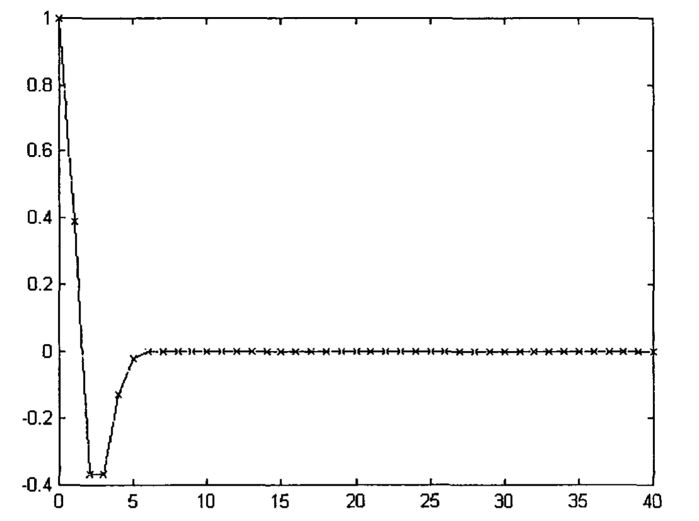
**Fig 5.4.** The filter coefficients h₂(n) of the discrete Mexican Hat wavelet with a = 2, plotted against n.

From Eqn (5.8), the phase of $H(\omega)$ is given by

$$\phi_H(\omega) = \tan^{-1}\left(\frac{-\sum_n h(n)\sin(n\omega)}{\sum_n h(n)\cos(n\omega)}\right) \tag{5.10}$$

$\phi_H(\omega)$, for $a = 2$ (i.e., when $h = h_2$) is plotted in Fig 5.5 as dots. It can be observed that it begins at zero phase at $\omega = 0$, and terminates at zero phase at $\omega = \pi$. This is called a minimum-phase system [Proakis and Manolakis 1996]. Between $\omega = 0$ and $\omega = \pi$, the phase becomes zero at a frequency which we will call $\omega_0$. The phase of the continuous Fourier Transform, $\phi_1(\omega)$, given by Eqn (5.6) is also plotted in Fig 5.5 for comparison purpose. $\phi_1(\omega)$ also has a zero phase at an $\omega$ close to $\omega_0$. But as it is calculated from a continuous Fourier Transform, it has a different value from $\omega_0$.

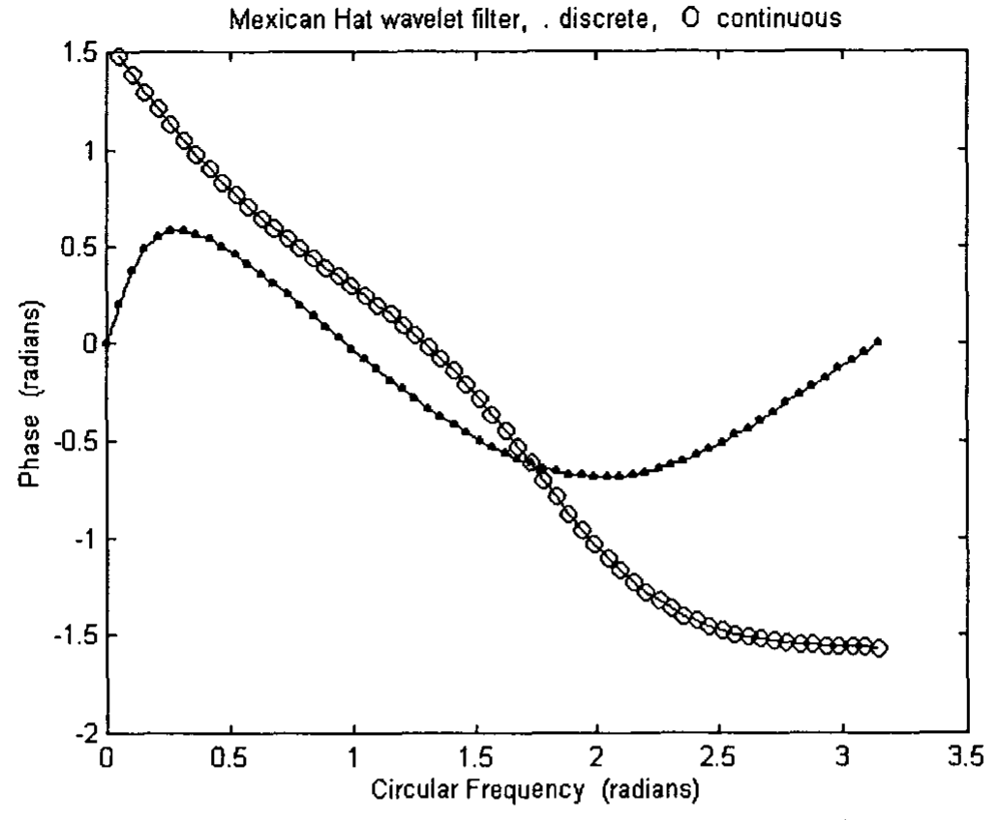
**Fig 5.5.** The phase of the discrete Mexican Hat wavelet (plotted as .). The phase of the continuous Mexican Hat wavelet is plotted here as comparison (plotted as o).

The amplitude of $H(\omega)$ in Eqn (5.8) for $a = 2$ for the Mexican Hat wavelet is plotted in Fig 5.6 as dots. The amplitude of the continuous Fourier Transform $\Psi_1(a\omega)$ is calculated from Eqn (5.5). It is then multiplied by $|a|$ in accordance with Eqn (5.3), and plotted in Fig 5.6 for comparison purpose. It has approximately the same shape as the amplitude of $H(\omega)$. However, $H(\omega)$ has an undesirable amplitude of 0.5 for a signal whose frequency is $\omega = 0$. The factor 0.5 can be obtained by substituting the filter coefficients in Eqn (5.9) into Eqn (5.8) with the frequency $\omega = 0$. This means that the real time discrete Mexican Hat wavelet filter, while mostly functioning as a band-pass filter, cannot block out some of the low frequencies. This is a disadvantage. Nevertheless, it should be noted that the $\omega$ which corresponds to the maximum amplitude of $H(\omega)$ in Fig 5.6 approximately equals to the $\omega$ which has zero phase in Fig 5.5. This is a very advantageous feature of the filter.

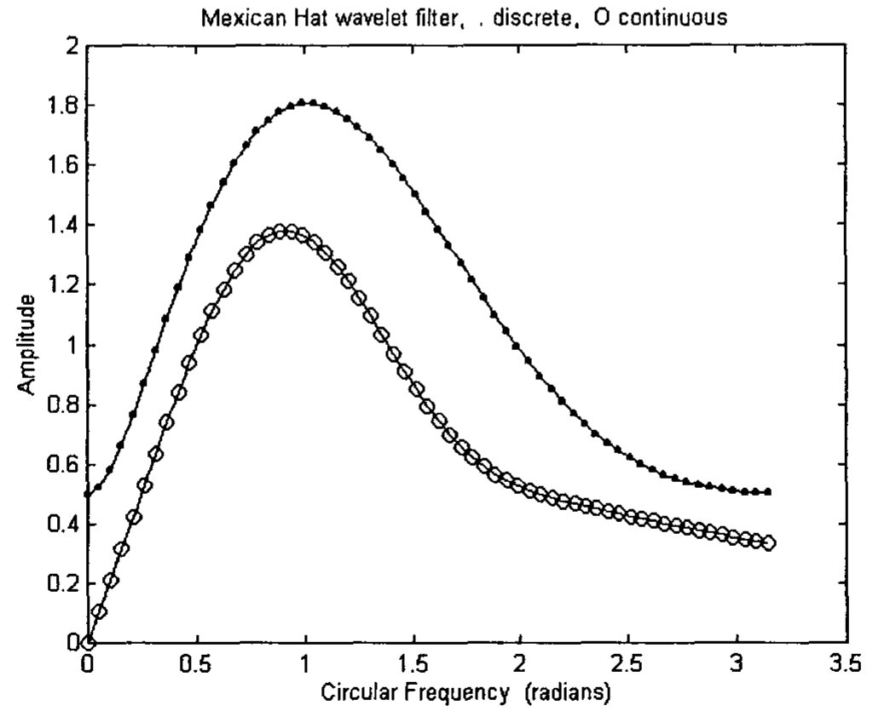
**Fig 5.6.** The amplitude of the discrete Mexican Hat wavelet (plotted as .). The amplitude of the continuous Mexican Hat wavelet is plotted here as comparison (plotted as o).

## 5.5 Calculation of Zero Phase Frequencies

The phases for $a = 1, 2, 4$ and $8$ calculated using Eqn (5.10) are plotted in Fig 5.7. The frequencies, $\omega_0$'s, which correspond to zero phases for different $a$'s, can be exactly located by using numerical analysis. They are listed in Table 5.1. The $\omega_1$'s, which correspond to the maximum amplitude of $H(\omega)$'s for different $a$'s can also be found using numerical analysis. They are also listed in Table 5.1.

**Table 5.1**

| $a$ | $2/a$ | $\omega_0$ (radians) (zero phase) | $\omega_1$ (radians) (maximum amplitude) |
|------|--------|------|------|
| 64 | 0.03125 | 0.0289 | 0.0345 |
| 32 | 0.0625 | 0.0578 | 0.0689 |
| 16 | 0.125 | 0.1156 | 0.1371 |
| 8 | 0.25 | 0.2316 | 0.2712 |
| 4 | 0.5 | 0.4670 | 0.5311 |
| 2 | 1 | 0.9686 | 1.0198 |
| 3/2 | 4/3 | 1.3558 | 1.3233 |

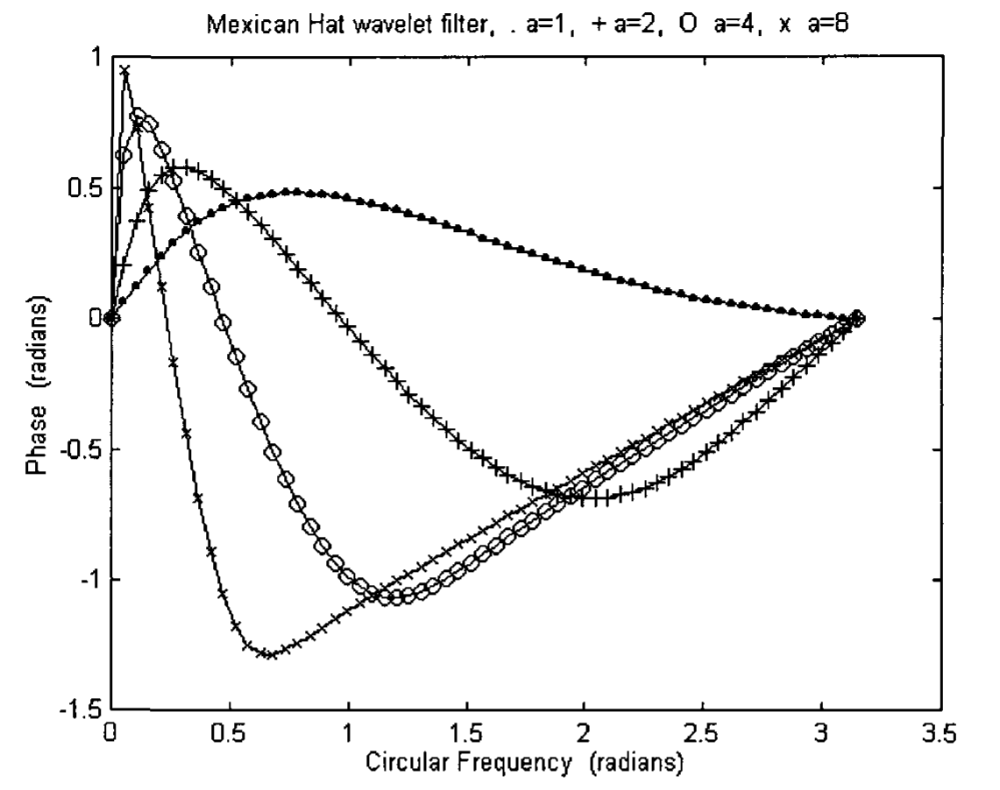
**Fig 5.7.** The phase of the discrete Mexican Hat wavelet for a = 1 (plotted as .), a = 2 (plotted as +), a = 4 (plotted as o) and a = 8 (plotted as x).

Had the filter been non-causal and continuous as in Eqn (5.2), the zero phase $\omega_0$'s would be exactly equal to $2/a$, and the Fourier Transform would attain maximum amplitude at that frequency. However, because of its causality, it can be seen from Table 5.1 that the zero phase $\omega_0$ is only approximately equal to $2/a$. Furthermore, the zero phase $\omega_0$'s are approximately equal to the $\omega_1$'s where the filter attains maximum amplitudes. In spite of these, the Mexican Hat wavelet can make a very good band-pass filter. As the zero phase $\omega_0$ is approximately equal to $2/a$, this would imply that if we know the frequency of a signal, then we can find $a$ of the causal discrete Mexican hat wavelet filter which will render a zero phase shift after the signal is filtered. In order to determine $a$ more accurately, $2/a$ is curve fitted to the frequency $\omega_0$. The fitted $2/a$, $(2/a)_f$, is given by Eqn (5.11)

$$(2/a)_f = 1.091\omega_0 - 0.071\omega_0^2 \tag{5.11}$$

It is listed in column 3 of Table 5.2. $a_f$ can then be calculated as 2 times the reciprocal of column 3 and is listed in column 4. It can be seen that $a_f$ is approximately equal to $a$, which is listed in column 5.

**Table 5.2**

| $\omega_0$ (radians) (zero phase) | $2/a$ | $(2/a)_f = 1.091\omega_0 - 0.071\omega_0^2$ | $a_f$ | $a$ |
|------|------|------|------|------|
| 0.0289 | 0.03125 | 0.031478 | 63.54 | 64 |
| 0.0578 | 0.0625 | 0.062837 | 31.83 | 32 |
| 0.1156 | 0.125 | 0.1252 | 15.97 | 16 |
| 0.2316 | 0.25 | 0.2489 | 8.035 | 8 |
| 0.4670 | 0.5 | 0.494 | 4.048 | 4 |
| 0.9687 | 1 | 0.990 | 2.02 | 2 |
| 1.3558 | 1.3333 | 1.349 | 1.483 | 1.5 |

As the amplitude of the filtered signal is different from that of the original signal, we would like to normalize the discrete Fourier Transform such that the filtered signal would have the same amplitude as the original signal for frequency $\omega_0$. The amplitude, $|H(\omega_0)|$, which corresponds to the $\omega_0$ with zero phase shift, is listed in column 3 of Table 5.3. This amplitude is calculated when we arbitrarily assumed that the number of filter coefficients could be truncated at 41. Increasing the number of filter coefficients would only have slightly changed the amplitude. $|H(\omega_0)|$ are curve fitted to $a_f$, yielding an $|H(\omega_0)|_f$:

$$|H(\omega_0)|_f = 0.488 + 0.646 \, a_f + 0.0001 \, a_f^2 \tag{5.12}$$

This is listed in column 4 of Table 5.3. They compared reasonably with $|H(\omega_0)|$ listed in column 3. An input signal of unit amplitude of frequency $\omega_0$ will yield an output signal of amplitude $|H(\omega_0)|$ after filtering. To normalize any output signal of frequency $\omega_0$, the amplitude of the filtered signal will be divided by $|H(\omega_0)|_f$, where $|H(\omega_0)|_f$ is calculated from Eqn (5.12).

**Table 5.3**

| $\omega_0$ (radians) (zero phase) | $a_f$ | $|H(\omega_0)|$ | $|H(\omega_0)|_f$ |
|------|------|------|------|
| 0.0289 | 63.54 | 41.75 | 41.95 |
| 0.0578 | 31.83 | 21.12 | 21.16 |
| 0.1156 | 15.97 | 10.81 | 10.83 |
| 0.2316 | 8.035 | 5.66 | 5.69 |
| 0.4670 | 4.048 | 3.08 | 3.11 |
| 0.9687 | 2.02 | 1.80 | 1.79 |
| 1.3558 | 1.483 | 1.48 | 1.45 |

## 5.6 Examples of Filtered Signals

We will now look at the output response of a real time Mexican Hat wavelet filter when the input signal has one or more than one frequencies. We would assume that we know the frequencies of the input signal and would like the signal of one of the frequencies, $\omega_0$, to be filtered out with a zero phase shift (i.e., no time lag). Knowing $\omega_0$, the computer program will calculate $a_f$ from Eqn (5.11) and $|H(\omega_0)|_f$ from Eqn (5.12). The filter coefficients, $h_a(n) = \psi(t/a_f = n)$ are calculated and used to convolute with the input signal. The number of coefficients needed can be set to $4 \times \text{round}(a_f)$ as the other coefficients are approximately zero in value and would hardly affect the computation (see Fig. 5.4). The functional value of $\text{round}(a_f)$ is equal to an integer after $a_f$ is being rounded off.

### 5.6.1 Signal with Frequency π/4

An input signal of price, $p = \sin(n\pi/4)$, is plotted as 'o' in Fig 5.8. It was then filtered by the Mexican Hat wavelet. The filtered signal is plotted as 'x' in the same figure. The two signals almost overlap each other. This implies that the filtered output signal has negligible phase shift from the input signal.

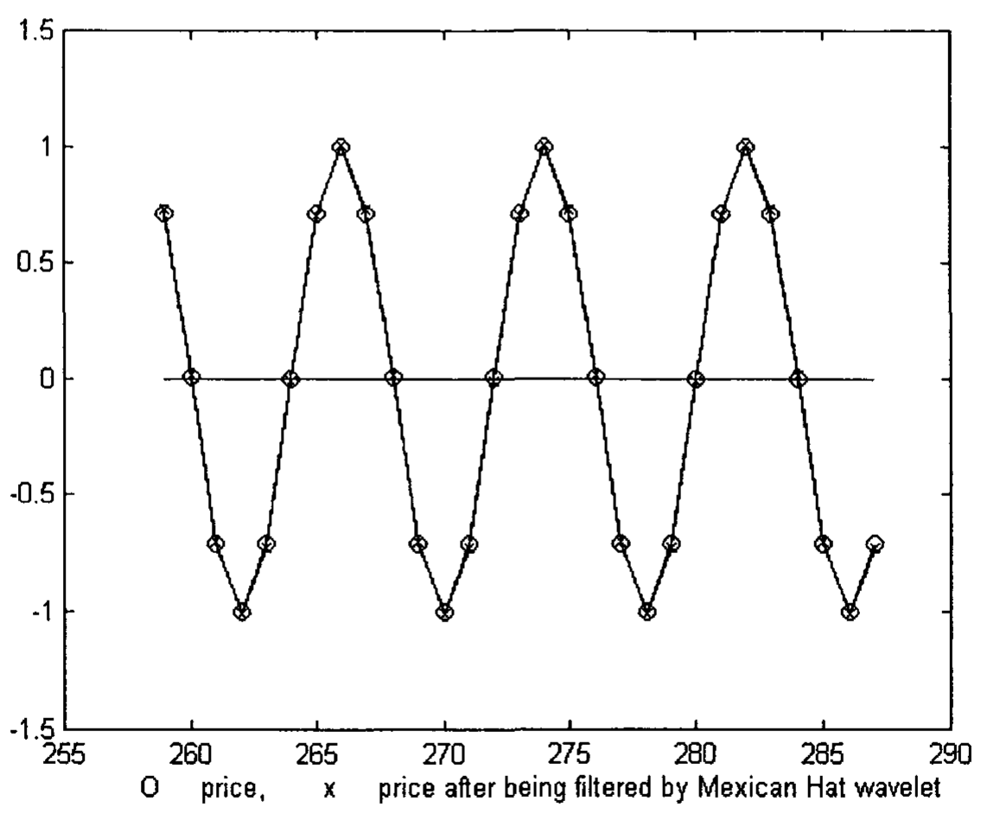
**Fig 5.8.** An input signal of price, p = sin(nπ/4), is plotted as 'o'. The signal is filtered by the Mexican Hat wavelet and the output response is plotted as 'x'.

As described in Mak [2003], the first and second derivatives can be used to forecast the direction of the market. The cubic velocity and acceleration indicators can simulate the first and second derivative respectively [Mak 2003]. We will therefore take a look at the two derivatives. The first derivative of $p$, i.e. $(\pi/4)\cos(n\pi/4)$, is plotted in Fig 5.9(a) and compared with the velocity obtained by operating on the filtered signal with the cubic velocity indicator. (Cubic velocity indicator is described in Chapter 8). The agreement is reasonably well. The second derivative of $p$, i.e., $-(\pi/4)^2\sin(n\pi/4)$, is plotted in Fig 5.9(b) and compared with the acceleration obtained by operating on the filtered signal with the cubic acceleration indicator. (Cubic acceleration indicator is described in Chapter 8). The agreement is still reasonable.

**Fig 5.9.** (a) The first derivative of p, i.e. (π/4)cos(nπ/4), is plotted as 'o' and compared with the velocity (plotted as x) obtained by operating on the Mexican Hat wavelet filtered signal with the cubic velocity indicator. (b) The second derivative of p, i.e., -(π/4)²sin(nπ/4), is plotted as 'o' and compared with the acceleration (plotted as x) obtained by operating on the Mexican Hat wavelet filtered signal with the cubic acceleration indicator.

### 5.6.2 Signal with Frequency π/32

We will try the filter on an input signal with a lower frequency. An input signal of price, $p = \sin(n\pi/32)$, is plotted as 'o' in Fig 5.10. It was then filtered by the Mexican Hat wavelet. The filtered signal is plotted as 'x' in the same figure. The two signals almost overlap each other. This implies that the filtered output signal has negligible phase shift from the input signal.

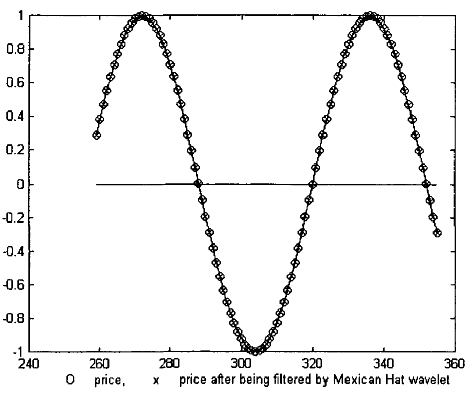
**Fig 5.10.** An input signal of price, p = sin(nπ/32), is plotted as 'o'. The signal is filtered by the Mexican Hat wavelet and the output response is plotted as 'x'.

The first derivative of $p$, i.e. $(\pi/32)\cos(n\pi/32)$, is plotted in Fig 5.11(a) and compared with the velocity obtained by operating on the filtered signal with the cubic velocity indicator. The two signals almost overlap each other. The second derivative of $p$, i.e., $-(\pi/32)^2\sin(n\pi/32)$, is plotted in Fig 5.11(b) and compared with the acceleration obtained by operating on the filtered signal with the cubic acceleration indicator. Again, the two signals almost overlap each other. The agreement is much better than the higher frequency of $\pi/4$ because the cubic velocity and cubic acceleration indicators have much less phase shifts at lower frequencies.

**Fig 5.11.** (a) The first derivative of p, i.e. (π/32)cos(nπ/32), is plotted as 'o' and compared with the velocity (plotted as x) obtained by operating on the Mexican Hat wavelet filtered signal with the cubic velocity indicator. (b) The second derivative of p, i.e., -(π/32)²sin(nπ/32), is plotted as 'o' and compared with the acceleration (plotted as x) obtained by operating on the Mexican Hat wavelet filtered signal with the cubic acceleration indicator.

### 5.6.3 Signal with Frequencies π/4, and π/32

We will try the filter on an input price, $p$, with a high frequency signal $p_1$ superimposed on a low frequency signal $p_2$ with larger amplitude.

$$p = p_1 + p_2 = \sin(n\pi/4) + 5\sin(n\pi/32) \tag{5.13}$$

The low frequency component will be eliminated by the Mexican Hat wavelet. Fig 5.12(a) plots $p_1$, $p_2$ and the summation of $p_1$ and $p_2$. Fig 5.12(b) shows the signal after being filtered. The frequency component $p_1$ is plotted as comparison. Some of the low frequency component has not been filtered off. This is comprehensible as the real time discrete Mexican Hat filter cannot filter off some of the low frequencies (see Fig 5.6).

**Fig 5.12.** (a) An input signal of price, p = p₁ + p₂ = sin(nπ/4) + 5sin(nπ/32), is plotted as '+'. The high frequency component, p₁, is plotted as 'o' and the low frequency component, p₂, is plotted as '.'. (b) The input signal is filtered by the Mexican Hat wavelet designed to eliminate the low frequency component. The output response is plotted as 'x'. The high frequency component of the original input signal, p₁, is plotted as 'o' for comparison.

The first derivative of $p_1$, i.e. $(\pi/4)\cos(n\pi/4)$, is plotted in Fig 5.13(a) and compared with the velocity obtained by operating on the filtered signal with the cubic velocity indicator. The agreement is reasonably well. The second derivative of $p_1$, i.e., $-(\pi/4)^2\sin(n\pi/4)$, is plotted in Fig 5.13(b) and compared with the acceleration obtained by operating on the filtered signal with the cubic acceleration indicator. The agreement is still reasonable. The cubic velocity and acceleration indicators are actually high pass filters. They therefore are able to eliminate the low frequency component that is not filtered off by the Mexican Hat wavelet.

**Fig 5.13.** (a) The first derivative of p₁, i.e. (π/4)cos(nπ/4), is plotted as 'o' and compared with the velocity (plotted as x) obtained by operating on the Mexican Hat wavelet filtered signal with the cubic velocity indicator. (b) The second derivative of p₁, i.e., -(π/4)²sin(nπ/4), is plotted as 'o' and compared with the acceleration (plotted as x) obtained by operating on the Mexican Hat wavelet filtered signal with the cubic acceleration indicator.

## 5.7 High, Middle and Low Mexican Hat Wavelet Filters

If the frequencies of the signal are not known, we can attempt to use a series of Mexican Hat Wavelet filters to filter the signal. One series can be chosen to have $a = 1.483$ (high), $4.048$ (middle), $15.97$ (low) (see Table 5.3). The filter coefficients are then normalized by dividing by $|H(\omega_0)|_f$ (see Table 5.3) and are listed as follows:

$$h_{\text{high}}(n) = (0.6897 \quad 0.0397 \quad -0.2951 \quad -0.0828 \quad -0.0065 \quad -0.0002 \quad 0.0000)$$

$$h_{\text{middle}}(n) = (0.3215 \quad 0.2656 \quad 0.1289 \quad -0.0183 \quad -0.1154 \quad -0.1434 \quad -0.1213 \quad -0.0805 \quad -0.0441 \quad -0.0204 \quad -0.0081 \quad -0.0027 \quad -0.0008 \quad -0.0002 \quad 0.0000)$$

$$h_{\text{low}}(n) = (0.0923 \quad 0.0913 \quad 0.0880 \quad 0.0828 \quad 0.0758 \quad 0.0673 \quad 0.0575 \quad 0.0469 \quad 0.0358 \quad 0.0245 \quad 0.0135 \quad 0.0029 \quad -0.0068 \quad -0.0155 \quad -0.0230 \quad -0.0292 \quad -0.0341 \quad -0.0377 \quad -0.0399 \quad -0.0411 \quad -0.0411 \quad -0.0403 \quad -0.0387 \quad -0.0365 \quad -0.0339 \quad -0.0311 \quad -0.0280 \quad -0.0250 \quad -0.0220 \quad -0.0191 \quad -0.0164 \quad -0.0139 \quad -0.0117 \quad -0.0097 \quad -0.0080 \quad -0.0065 \quad -0.0053 \quad -0.0042 \quad -0.0033 \quad -0.0026 \quad -0.0020)$$

These coefficients are plotted in Fig 5.14. Amplitude of the Fourier Transform of these filter coefficients are plotted in Fig 5.15. Note that the amplitudes of the peaks are 1, as the filter coefficients are normalized.

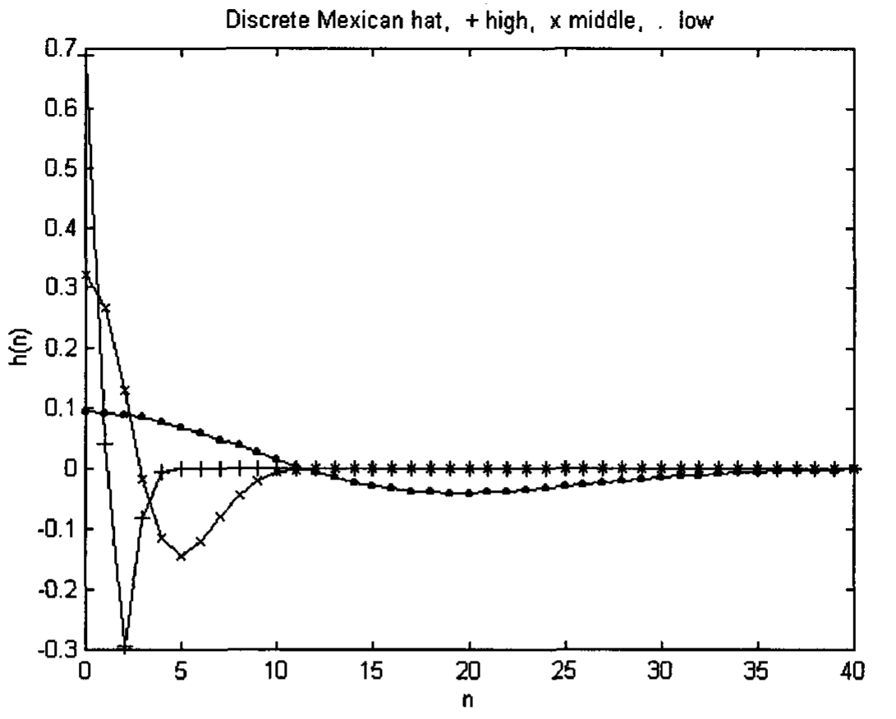
**Fig 5.14.** High (+), Middle (x) and Low (.) Mexican Hat Wavelet coefficients.

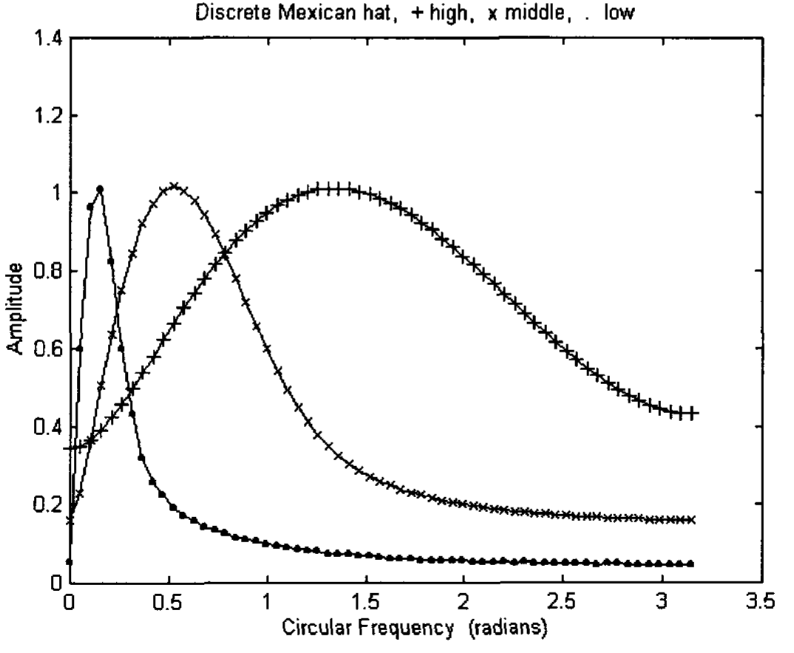
**Fig 5.15.** Amplitudes of the Fourier Transform of the High (+), Middle (x) and Low (.) Mexican Hat Wavelet coefficients.

## 5.8 Limitations of Mexican Hat Wavelet Filters

While the discrete causal Mexican Hat wavelet filters form a series of bandpass filters, they do not have very good resolutions. This, of course, has always been a problem with designing filters. As we can see from Fig 5.15, the amplitudes of their Fourier Transforms overlap each other. This would cause a signal of a single frequency to appear as a signal in all the filtered signals.

Fig 5.16 shows an input sine wave with a single low circular frequency of 0.116 radians. It was filtered by the series of Wavelet filters. The output signal from the low wavelet filter (plotted as .) almost coincides with the input signal (plotted as o). However, the output signals from the high and middle wavelet filters also produce signals of lower amplitude. These signals are simply caused by their frequency bands spreading into the low frequency range, as can be observed in Fig 5.15.

**Fig 5.16.** The input signal (plotted as o) has a circular frequency of 0.116 radians. It was filtered by the High, Middle and Low Wavelet filters. The output signal from the Low wavelet filter (plotted as .) almost coincides with the input signal (plotted as o). However, the output signals from the High and Middle wavelet filters also produce signals of lower amplitude.

Fig 5.17 shows an input sine wave with a single circular frequency of 0.467 radians. It was filtered by the series of Wavelet filters. The output signal from the middle wavelet filter (plotted as x) almost coincides with the input signal (plotted as o). However, the output signals from the high and low wavelet filters also produce signals of lower amplitude. Again, this is consistent with what is being shown in Fig 5.15.

**Fig 5.17.** The input signal (plotted as o) has a circular frequency of 0.467 radians. It was filtered by the High, Middle and Low Wavelet filters. The output signal from the Middle wavelet filter (plotted as x) almost coincides with the input signal (plotted as o). However, the output signals from the High and Low wavelet filters also produce signals of lower amplitude.

Fig 5.18 shows an input sine wave with a single circular frequency of 1.36 radians. It does not look like a pure sine wave simply because the sampled points are not dense enough to show a pure sine wave. The signal was filtered by the series of Wavelet filters. The output signal from the high wavelet filter (plotted as +) almost coincides with the input signal (plotted as o). However, the output signals from the middle and low wavelet filters also produce signals of lower amplitude. Again, this is consistent with what is being shown in Fig 5.15.

**Fig 5.18.** The input signal (plotted as o) has a circular frequency of 1.36 radians. It was filtered by the High, Middle and Low Wavelet filters. The output signal from the high wavelet filter (plotted as +) almost coincides with the input signal (plotted as o). However, the output signals from the Middle and Low wavelet filters also produce signals of lower amplitude.

Compared to the sine wavelet filters [Mak 2003], the Mexican Hat wavelet filters use a much smaller number of coefficients, $h(n)$, to convolute with the input signal. However, the sine wavelet filters have much sharper frequency bandwidths than the Mexican Hat wavelet filters. Other wavelet filters can be used. Their amplitude and phase characteristics should be inspected to exploit their properties.
