# Chapter 7 — Phase

Traders depend on indicators to tell them where the market is heading. For example, trends can be identified by trending indicators, which are actually causal low pass filters with phase or time lag. As traders would like to know changing market movement as early as possible, reducing phase lag would be of particular interest. One approach to reduce the phase lag has been discussed in Chapter 4. Another approach is to ask whether it is possible to predetermine the phase with respect to the frequency range, and work backward to find out what the indicator should be? We will develop a method in this chapter to solve this problem — for limited cases.

In signal processing, a system is an operator or a mapping that transforms an input signal into an output signal by means of a fixed set of operations [Mak 2003]. A system is causal if the output of the system at any time depends only on present and past inputs, but not on future inputs. A system which is not causal is noncausal. A noncausal system has an output which depends on present and past inputs, as well as on future inputs. Thus, in real-time signal processing, as future values of the signal cannot be observed, a noncausal system is physically unrealizable.

In trading the financial market, as no future value is available, only causal system can be implemented. Causality implies a strong relationship between $H_R(\omega)$ and $H_I(\omega)$, the real and imaginary components of the frequency response $H(\omega)$ of a system. This relationship is discussed in the next section.

## 7.1 Relation between the Real and Imaginary Parts of the Fourier Transform of a Causal System

The relationship between the real and imaginary components of the Fourier Transform of a causal system is given by [Proakis and Manolaskis 1996]:

$$H_I(\omega) = -\frac{1}{2\pi} \int_{-\pi}^{\pi} H_R(\lambda) \cot\frac{\omega - \lambda}{2} \, d\lambda \tag{7.1}$$

Thus, $H_I(\omega)$ is uniquely determined from $H_R(\omega)$ through Eqn (7.1). The integral in Eqn (7.1) is called a discrete Hilbert Transform.

As an example, we can take a look at the two point moving average, whose coefficients are given by $(\frac{1}{2}, \frac{1}{2})$. The Fourier transform of the two point moving average is given by [Strang 1997, Mak 2003]:

$$H(\omega) = \frac{1}{2} + \frac{1}{2} \exp(-i\omega) = \cos^2(\omega/2) - i \frac{1}{2} \sin(\omega) \tag{7.2}$$

Substituting the real part of $H(\omega)$ into Eqn (7.1), we have

$$H_I(\omega) = -\frac{1}{2\pi} \int_{-\pi}^{\pi} \cos^2\frac{\lambda}{2} \cot\frac{\omega - \lambda}{2} \, d\lambda \tag{7.3}$$

Writing $\lambda' = (\omega - \lambda)/2$, Eqn (7.3) can be written as

$$H_I(\omega) = \frac{1}{\pi} \int_{(\omega+\pi)/2}^{(\omega-\pi)/2} \cos^2\left(\frac{\omega}{2} - \lambda'\right) \cot \lambda' \, d\lambda' \tag{7.4}$$

After simplifying, and using the fact that

$$\int_{(\omega+\pi)/2}^{(\omega-\pi)/2} \cot \lambda' \, d\lambda' = 0 \tag{7.5}$$

we get

$$H_I(\omega) = -\frac{1}{2} \sin(\omega) \tag{7.6}$$

which is the imaginary part of Eqn (7.2).

## 7.2 Calculation of the Frequency Response Function, $H(\omega)$

Eqn (7.1) implies that, for a causal system, if the phase $\phi(\omega)$ is given, it may be possible to calculate $H(\omega)$. The phase $\phi(\omega)$ is given by

$$\tan \phi(\omega) = H_I(\omega) / H_R(\omega) \tag{7.7}$$

Substituting Eqn (7.7) into Eqn (7.1) yields

$$H_R(\omega) \tan \phi(\omega) = -\frac{1}{2\pi} \int_{-\pi}^{\pi} H_R(\lambda) \cot\frac{\omega - \lambda}{2} \, d\lambda \tag{7.8}$$

In computer calculation, the integral in Eqn (7.8) needs to be changed to a discrete summation with

$$-\pi = \lambda_0, \lambda_1, \lambda_2, \ldots, \lambda_n = \pi$$

If $\phi(\omega)$ is known or given, setting $\omega$ to be one of the $\lambda_i$'s will yield $n+1$ equations, with $n+1$ unknowns $H_R(\lambda_j)$. However, it would mean that in each equation, one of the cotangent terms would become infinity when $\omega$ equals the $\lambda_i$ that it is set equal to. Thus, we need to set each of the $\omega_i$ to be slightly away from the $\lambda_i$'s, and then make the approximation on the LHS of Eqn (7.8) that $H_R(\omega_i) \approx H_R(\lambda_i)$ so that the equations can be solved. In order to yield an accurate calculation of the integral, $\omega_i$ has to be set equal to $\lambda_i + \delta\lambda/2$, where $\delta\lambda = \lambda_i - \lambda_{i-1}$.

From Eqn (7.8), the $n+1$ equations can be written as follows:

$$r_0 t_0 = -(r_0 c_{00} + r_1 c_{01} + r_2 c_{02} + \cdots + r_n c_{0n}) \, \delta\lambda/(2\pi)$$

$$r_1 t_1 = -(r_0 c_{10} + r_1 c_{11} + r_2 c_{12} + \cdots + r_n c_{1n}) \, \delta\lambda/(2\pi)$$

$$r_2 t_2 = -(r_0 c_{20} + r_1 c_{21} + r_2 c_{22} + \cdots + r_n c_{2n}) \, \delta\lambda/(2\pi)$$

$$\vdots$$

$$r_n t_n = -(r_0 c_{n0} + r_1 c_{n1} + r_2 c_{n2} + \cdots + r_n c_{nn}) \, \delta\lambda/(2\pi) \tag{7.9}$$

where $r_i = H_R(\lambda_i) \approx H_R(\omega_i)$

$t_i = \tan \phi(\omega_i)$

$c_{ij} = \cot[(\omega_i - \lambda_j)/2]$

One of the $H_R(\lambda_j)$ can be set arbitrarily. Since the magnitude of $H(\omega)$ is usually equal to 1, and we would most likely prefer $\phi(\omega = 0) = 0$, we can set $r_m = H_R(\lambda = 0) = 1$, where $m = n/2 + 1$. The $n+1$ equations in (7.9) can be written as

$$-r_m c_{0m} = (2\pi r_0 t_0/\delta\lambda + r_0 c_{00}) + r_1 c_{01} + r_2 c_{02} + \cdots + r_n c_{0n}$$

$$-r_m c_{1m} = r_0 c_{10} + (2\pi r_1 t_1/\delta\lambda + r_1 c_{11}) + r_2 c_{12} + \cdots + r_n c_{1n}$$

$$-r_m c_{2m} = r_0 c_{20} + r_1 c_{21} + (2\pi r_2 t_2/\delta\lambda + r_2 c_{22}) + \cdots + r_n c_{2n}$$

$$\vdots$$

$$-r_m c_{nm} = r_0 c_{n0} + r_1 c_{n1} + r_2 c_{n2} + \cdots + (2\pi r_n t_n/\delta\lambda + r_n c_{nn}) \tag{7.10}$$

The LHS of Eqn (7.10) can be set as constants as described above. That leaves $n$ unknowns, $r_i$'s, $i \neq m$, in $n+1$ equations. For this over-determined case of having more equations than unknowns, a least square solution of the unknowns can be found [Hanselman and Littlefield 1997].

After $r_i = H_R$ are found, $H_I$ can be determined from Eqn (7.1). The filter $H$ is then completely determined.

### 7.2.1 Example — The Two Point Moving Average

We will use the two point moving average as an example. We know that the phase of its $H(\omega)$, $\phi(\omega)$, is given by [Mak 2003]:

$$\phi(\omega) = -\omega/2 \tag{7.11}$$

Knowing only this phase, we will reconstruct $H(\omega)$ using the above method. The real part of $H(\omega)$ is shown in Fig 7.1. The calculated values are compared with the theoretical values which are given by the real part of the RHS of Eqn (7.2). The slight discrepancy is caused by the approximation as described above.

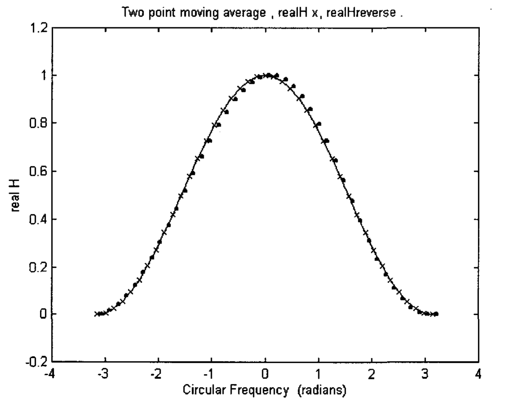

**Fig 7.1** The real part of the Fourier Transform of the two point moving average are calculated using the method described in this chapter. The calculated values (plotted as .) are compared with the theoretical values (plotted as x and joined by a line) which are given by the real part of the RHS of Eqn (7.2).

The imaginary part of $H(\omega)$ is shown in Fig 7.2. The calculated values are compared with the theoretical values which are given by the imaginary part of the RHS of Eqn (7.2). Again, the slight discrepancy is caused by the approximation as described above.

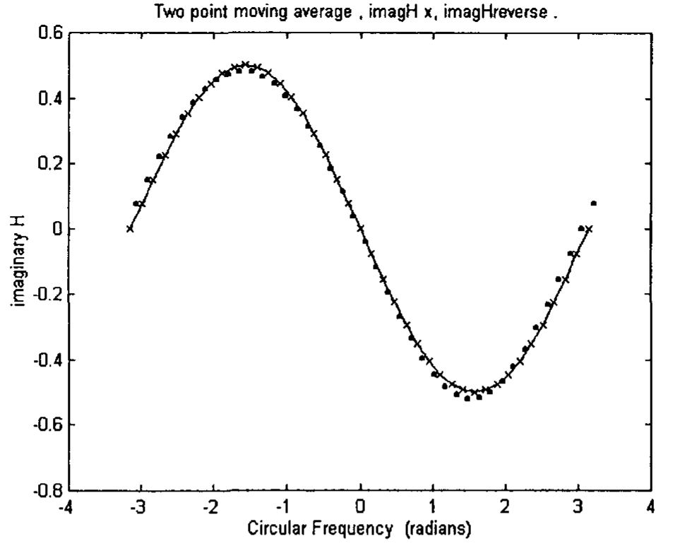

**Fig 7.2** The imaginary part of the Fourier Transform of the two point moving average are calculated using the method described in this chapter. The calculated values (plotted as .) are compared with the theoretical values (plotted as x and joined by a line) which are given by the imaginary part of the RHS of Eqn (7.2).

The discrepancy can be decreased by calculating the integral in Eqn (7.8) by setting $\omega_i$ to be equal to $\lambda_i - \delta\lambda/2$, where $\delta\lambda = \lambda_i - \lambda_{i-1}$. The $H_R(\omega_i)$ calculated will be averaged with the $H_R(\omega_i)$ calculated earlier when $\omega_i$ was set equal to $\lambda_i + \delta\lambda/2$.

The average $H_R(\omega_i)$ are plotted in Fig 7.3 and compared with the theoretical values which are given by the real part of Eqn (7.2). The agreement is much better than that in Fig 7.1.

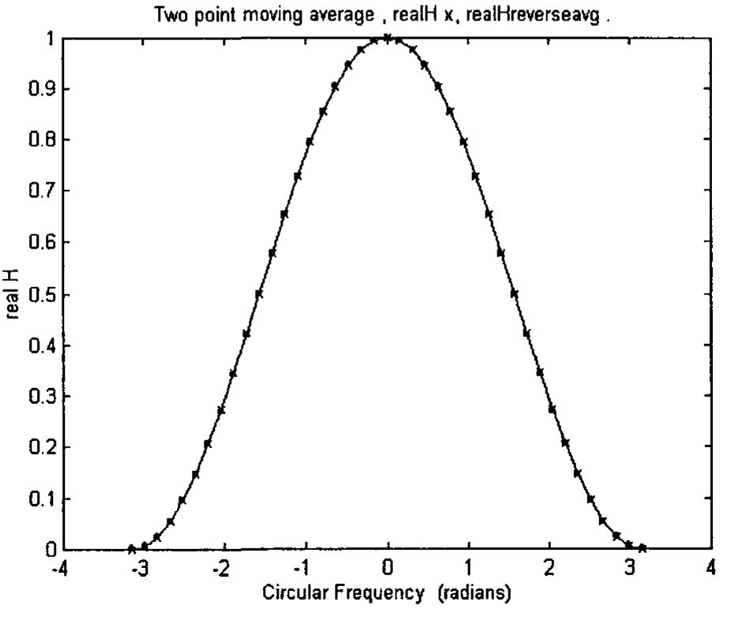

**Fig 7.3** The real part of the Fourier Transform of the two point moving average are calculated using the improved method. The calculated values (plotted as .) are compared with the theoretical values (plotted as x and joined by a line) which are given by the real part of the RHS of Eqn (7.2). The agreement is much better than that in Fig 7.1.

The average $H_I(\omega_i)$ are plotted in Fig 7.4 and compared with the theoretical values which are given by the imaginary part of Eqn (7.2). The agreement is much better than that in Fig 7.2.

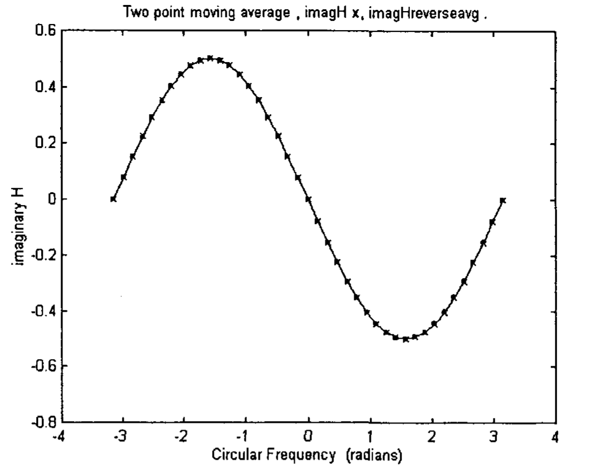

**Fig 7.4** The imaginary part of the Fourier Transform of the two point moving average are calculated using the improved method. The calculated values (plotted as .) are compared with the theoretical values (plotted as x and joined by a line) which are given by the imaginary part of the RHS of Eqn (7.2). The agreement is much better than that in Fig 7.2.

The average $H_R(\omega_i)$ and the average $H_I(\omega_i)$ can be used to calculate the average magnitude of $H(\omega_i)$ and compared with the theoretical values calculated in Eqn (7.2). These are plotted in Fig 7.5.

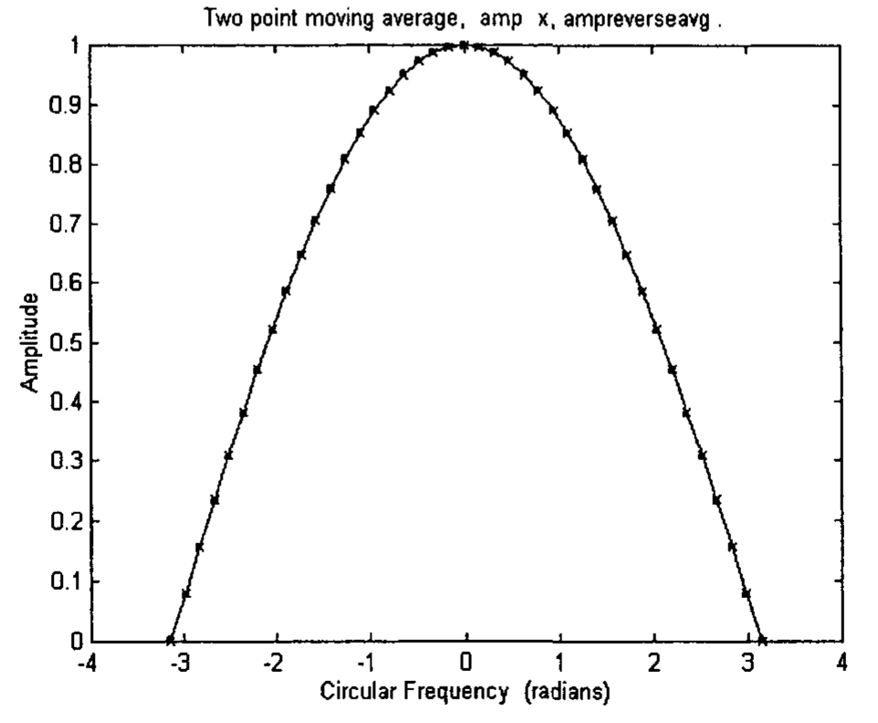

**Fig 7.5** The magnitude of the Fourier Transform of the two point moving average are calculated using the improved method. The calculated values (plotted as .) are compared with the theoretical magnitude (plotted as x and joined by a line) which can be calculated from the RHS of Eqn (7.2).

The phase calculated from the average $H_R(\omega_i)$ and the average $H_I(\omega_i)$ is plotted in Fig 7.6, and compared with the theoretical phase in Eqn (7.11). The agreement is good except for the two end points. The discrepancy is caused by the very small disagreement between the calculated average of the real and imaginary parts with the corresponding theoretical values.

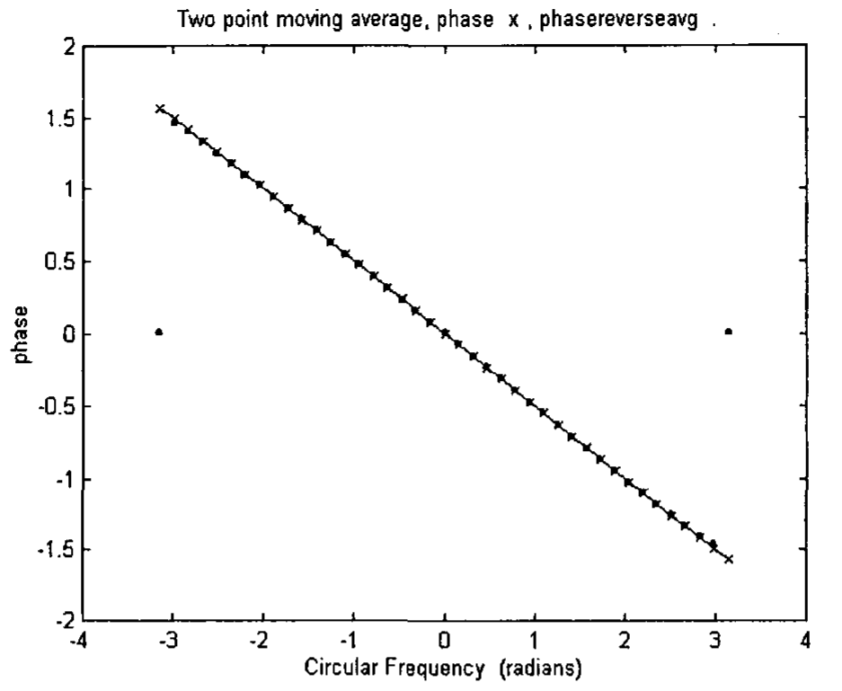

**Fig 7.6** The phase of the Fourier Transform of the two point moving average are calculated using the improved method. The calculated values (plotted as .) are compared with the theoretical phase (plotted as x and joined by a line) given by Eqn (7.11). The agreement is good except for the two end points. The discrepancy is caused by the very small disagreement between the calculated averages of the real and imaginary parts with the corresponding theoretical values.

The unit impulse response of a system, $h(k)$ is related to $H(\omega)$ by the Discrete Time Fourier Transform [Oppenheim et al 1999].

$$h(k) = \frac{1}{2\pi} \int_{-\pi}^{\pi} H(\omega) \exp(i\omega k) \, d\omega \tag{7.12}$$

From Eqn (7.12) and using the average $H_R(\omega_i)$ and the average $H_I(\omega_i)$, $h(k)$ can be calculated. They are plotted in Fig 7.7, with $h(0) = 0.5000$, $h(1) = 0.4993$, and $h(k) \approx 0$ for $k > 1$. This result agrees very well with the theoretical values, $h(0) = h(1) = \frac{1}{2}$ in Eqn (7.2).

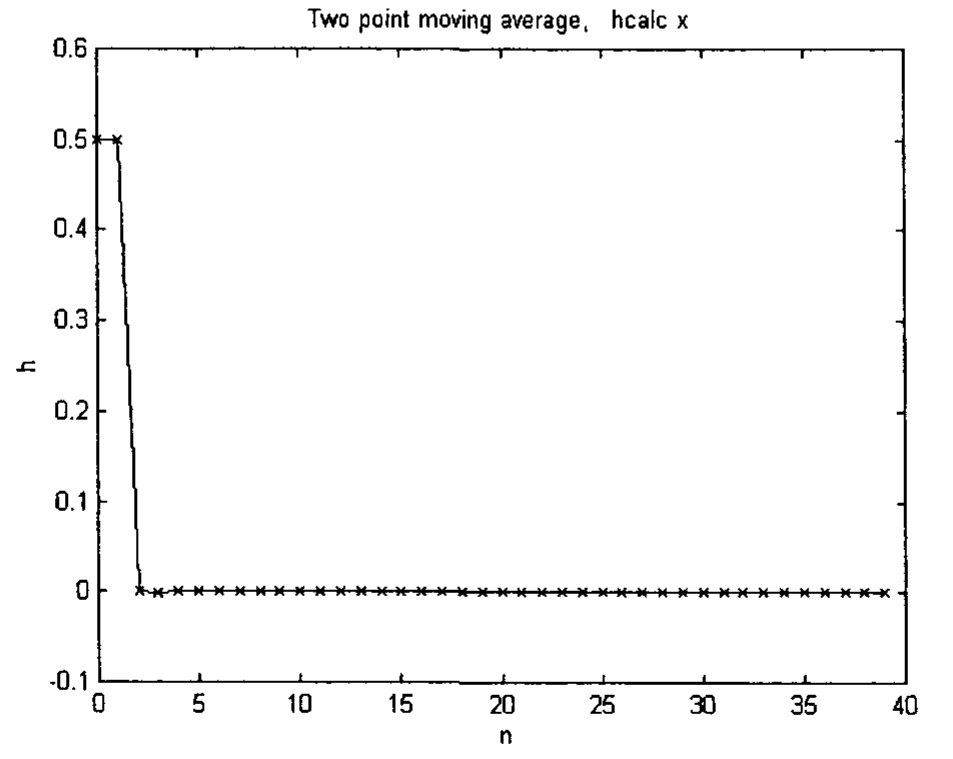

**Fig 7.7** The unit impulse response of the two point moving average are calculated using the improved method. The calculated values (plotted as x and joined by a line) agree very well with the theoretical values, which are given as $h(0) = h(1) = \frac{1}{2}$ in Eqn (7.2).

## 7.3 Computer Program for Calculating $H(\omega)$ and $h(n)$ of a Causal System

The computer program for calculating $H(\omega)$ and $h(n)$, given only the phase, $\phi(\omega)$, has been written in MATLAB programming language, and is listed below:

```matlab
% phasegivenproglbook
% Given only the phase of the Fourier Transform (FT) of the two point
% moving average, H, calculate the real and imaginary part of H
% use both angle0 and angle1 to calculate the integral; take average
% to calculate h
clear
mend = 40; % mend = n in book
m = (0:1:mend);
nend = mend - 1; % used for h later
n = (0:1:mend);
dang = 2*pi/mend; % interval for integration
ang = -pi + dang*m; % ang ranges from -pi to pi
angle0 = ang + dang/2; % shifted from ang to avoid infinity in cotangent
angle1 = ang - dang/2; % shifted from ang to avoid infinity in cotangent

% Set up the theoretical values for the Fourier Transform of the two point
% moving average. These theoretical values are used for comparing with the
% calculated values later. They are not used for calculations.
for L = 1:mend+1
    H(L) = 0.5 + 0.5*exp(-i*ang(L)); % FT of two point moving average
    amp(L) = abs(H(L));
    phase(L) = -ang(L)/2; % This is also equal to angle(H(L))
    realH(L) = real(H(L));
    imagH(L) = imag(H(L));
end
% End of set up

figure(1) % Plot theoretical value of phase of two point moving average
plot(ang, phase, 'k.-')
title('Two point moving average')
xlabel('Circular Frequency (radians)');
ylabel('Phase (radians)')

% Calculation starts here
rm = 1; % set an arbitrary value to the element of realH when omega = 0
for I = 1:mend+1
    for J = 1:mend+1
        r(I,J) = 1;
    end
end
for I = 1:mend+1
    r(I, mend/2+1) = rm; % set realH(omega=0) to be rm, usually 1
end

for I = 1:mend+1
    factor = 2; % factor can be changed to other number, e.g., 3
    phasegiven(I) = -angle0(I)/factor;
    phasegiven1(I) = -angle1(I)/factor;
    for J = 1:mend+1
        if (I == J)
            C(I,J) = r(I,J)*((2*pi/dang)*tan(phasegiven(I)) + ...
                cot((angle0(I) - ang(J))/2));
            C1(I,J) = r(I,J)*((2*pi/dang)*tan(phasegiven1(I)) + ...
                cot((angle1(I) - ang(J))/2));
        else
            C(I,J) = r(I,J)*cot((angle0(I) - ang(J))/2);
            C1(I,J) = r(I,J)*cot((angle1(I) - ang(J))/2);
        end
    end
end

% Set up matrix equation
for I = 1:mend+1
    bb(I) = -C(I, mend/2+1);
    bb1(I) = -C1(I, mend/2+1);
end
BB = bb';   % BB is the transpose of matrix bb
BB1 = bb1'; % BB1 is the transpose of matrix bb1

for I = 1:mend+1
    for J = 1:mend/2
        AA(I,J) = C(I,J);
        AA1(I,J) = C1(I,J);
    end
end
for I = 1:mend+1
    for J = mend/2+1:mend
        AA(I,J) = C(I,J+1);
        AA1(I,J) = C1(I,J+1);
    end
end

realHminus1 = AA\BB;   % MATLAB least-square solution
realHminus11 = AA1\BB1; % Solution of matrix equation found

realHreverse(mend/2+1) = rm;
realHreverse1(mend/2+1) = rm;
for I = 1:mend/2
    realHreverse(I) = realHminus1(I);
    realHreverse1(I) = realHminus11(I);
end
for I = mend/2+2:mend+1
    realHreverse(I) = realHminus1(I-1);
    realHreverse1(I) = realHminus11(I-1);
end

for I = 1:mend+1
    realHreverseavg(I) = (realHreverse(I) + realHreverse1(I))/2;
end

for M = 1:mend+1
    for L = 1:mend+1
        yH(L) = realHreverseavg(L)*cot((angle0(M) - ang(L))/2);
        yH1(L) = realHreverseavg(L)*cot((angle1(M) - ang(L))/2);
    end
    imagHreverse(M) = -(1/(2*pi))*trapz(ang, yH);
    imagHreverse1(M) = -(1/(2*pi))*trapz(ang, yH1);
end

for I = 1:mend+1
    imagHreverseavg(I) = (imagHreverse(I) + imagHreverse1(I))/2;
    ampreverseavg(I) = sqrt(realHreverseavg(I)^2 + imagHreverseavg(I)^2);
    phasereverseavg(I) = atan(imagHreverseavg(I)/realHreverseavg(I));
end

figure(2)
plot(ang, realH, 'bx-', ang, realHreverseavg, 'r.')
title('Two point moving average , realH x, realHreverseavg .')
xlabel('Circular Frequency (radians)');
ylabel('real H')

figure(3)
plot(ang, imagH, 'bx-', ang, imagHreverseavg, 'r.')
title('Two point moving average , imagH x, imagHreverseavg .')
xlabel('Circular Frequency (radians)');
ylabel('imaginary H')

figure(4)
plot(ang, amp, 'kx-', ang, ampreverseavg, 'r.')
title('Two point moving average, amp x, ampreverseavg .')
xlabel('Circular Frequency (radians)');
ylabel('Amplitude')

figure(5)
plot(ang, phase, 'kx-', ang, phasereverseavg, 'r.')
title('Two point moving average, phase x , phasereverseavg .')
xlabel('Circular Frequency (radians)');
ylabel('phase')

% Calculate h
for k = 1:nend+1
    for L = 1:mend+1
        integrand(L) = (realHreverseavg(L) + i*imagHreverseavg(L)) * ...
            exp(i*ang(L)*(k-1));
    end
    hcalc(k) = (1/(2*pi))*trapz(ang, integrand); % Mak 2003, P146
end

figure(6)
plot(n, hcalc, 'kx-')
title('Two point moving average, hcalc x')
xlabel('n');
ylabel('h')
```

### 7.3.1 Example, $\phi(\omega) = -\omega/3$

In the above program, if we change the phase given, we will get a different $H(\omega)$ and $h(n)$. For example, if the phase is given as:

$$\phi(\omega) = -\omega/3 \tag{7.13}$$

the magnitude of $H(\omega)$ calculated would be different from that of the two point moving average. Fig 7.8 plots the magnitude of $H(\omega)$ and compared that with the magnitude of the two point moving average. Fig 7.9 plots the $h(n)$ calculated.

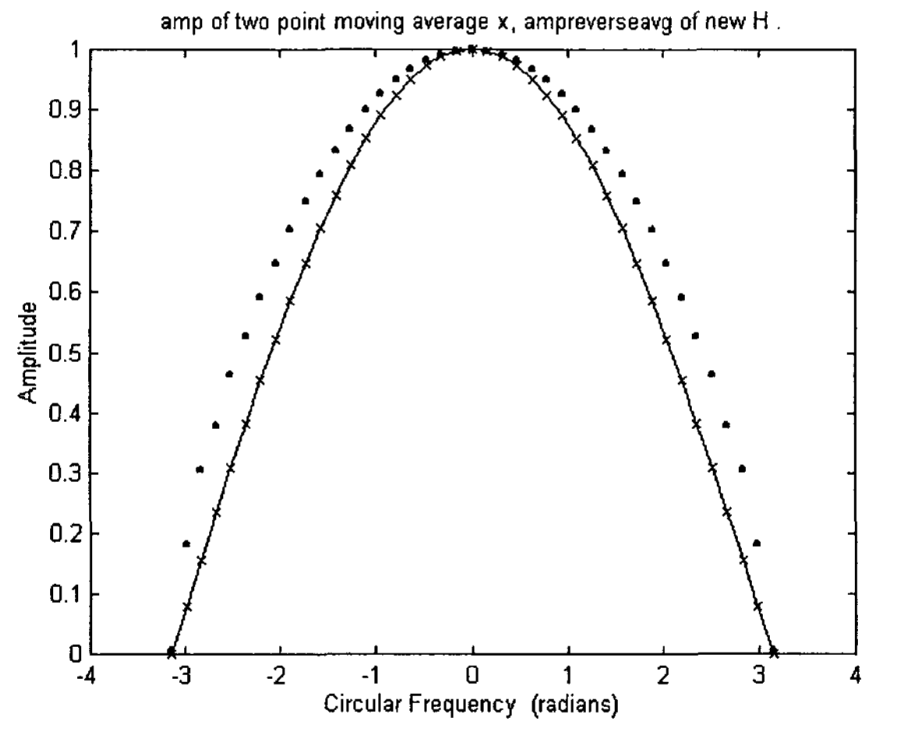

**Fig 7.8** Given the phase, $\phi(\omega) = -\omega/3$, the magnitude of the Fourier Transform, $|H(\omega)|$, is calculated using the improved method, and plotted as '.'. The magnitude of the Fourier Transform of the two point moving average is plotted for comparison (plotted as x and joined by a line).

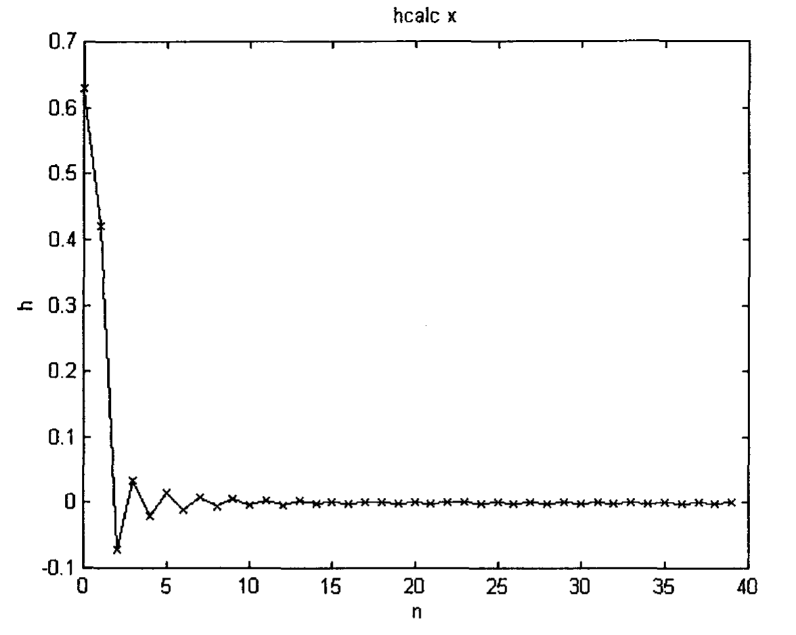

**Fig 7.9** Given the phase, $\phi(\omega) = -\omega/3$, the unit impulse response, $h(n)$ are calculated using the improved method. The calculated values are plotted as x and joined by a line.

### 7.3.2 Example, $\phi(\omega) = A\sin(\omega)$

In the computer program, the phase can be changed to another form. For example, it can be changed to:

$$\phi(\omega) = A\sin(\omega) \tag{7.14}$$

where $A$ is the amplitude of the sine wave. For $A = -0.8$, the magnitude of $H(\omega)$ calculated is shown in Fig 7.10. The phase calculated is shown in Fig 7.11, and compared with the phase given in Eqn (7.14). The unit impulse response, $h(n)$, calculated is shown in Fig 7.12. The form of the phase shown in Eqn (7.14) is somewhat similar to that of the exponential moving average (see Fig 3.1(b)). The magnitude of $H(\omega)$, and the unit impulse response, $h(n)$, calculated are thus comparable to those of the exponential moving average.

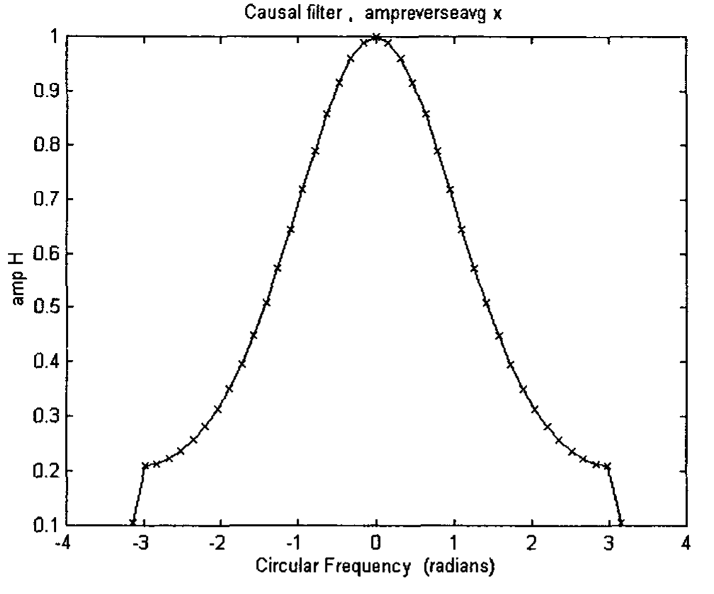

**Fig 7.10** Given the phase, $\phi(\omega) = A\sin(\omega)$, the magnitude of the Fourier Transform, $|H(\omega)|$, is calculated using the improved method. It is plotted as x and joined by a line.

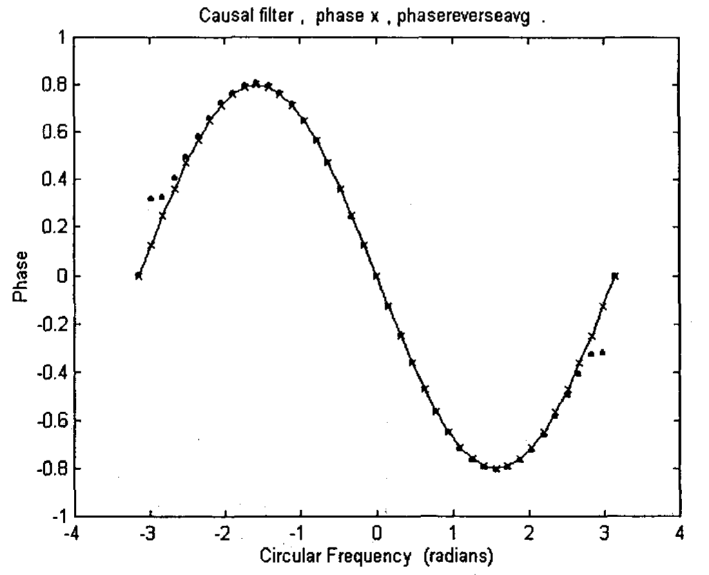

**Fig 7.11** Given the phase, $\phi(\omega) = A\sin(\omega)$, the phase of the Fourier Transform is calculated using the improved method. The calculated values (plotted as .) are compared with the theoretical phase (plotted as x and joined by a line) given by Eqn (7.14).

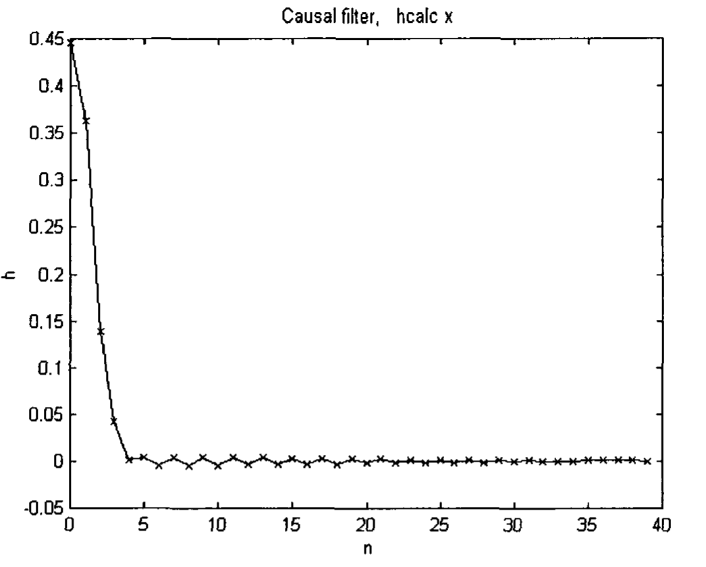

**Fig 7.12** Given the phase, $\phi(\omega) = A\sin(\omega)$, the unit impulse response, $h(n)$ are calculated using the improved method. The calculated values are plotted as x and joined by a line.

The mathematical technique described above can handle only some simple forms of phase spectrum as input. For other arbitrary phase spectrum inputs, other more robust mathematical techniques need to be developed.

## 7.4 Derivation of $H_R(\omega)$ in Terms of $H_I(\omega)$ for a Causal System

For completeness purpose, the relationship between $H_R(\omega)$ in terms of $H_I(\omega)$ is derived below:

The impulse response $h(n)$ can be decomposed into an even and an odd sequence [Proakis and Manolaskis 1996]:

$$h(n) = h_e(n) + h_o(n) \tag{7.15}$$

where

$$h_e(n) = \frac{1}{2} [h(n) + h(-n)] \tag{7.16}$$

$$h_o(n) = \frac{1}{2} [h(n) - h(-n)] \tag{7.17}$$

If $h(n)$ is causal, it is possible to recover $h(n)$ from its odd component $h_o(n)$ for $1 \leq n < \infty$. Since $h_o(n) = 0$ for $n = 0$, $h(0)$ cannot be recovered from $h_o(n)$. We need to know $h(0)$. It can be shown that

$$h(n) = 2 h_o(n) u(n) + h(0) \delta(n) \qquad n \geq 0 \tag{7.18}$$

The Fourier transform for (7.18) is

$$H(\omega) = H_R(\omega) + jH_I(\omega) = \frac{1}{\pi} \int_{-\pi}^{\pi} H_I(\lambda) U(\omega - \lambda) \, d\lambda + h(0) \tag{7.19}$$

where $U(\omega)$ is the Fourier transform of the unit step sequence $u(n)$. Although $u(n)$ is not absolutely summable, it has a Fourier transform [Proakis and Manolaskis 1996]

$$U(\omega) = \pi\delta(\omega) + \frac{1}{2} - \frac{1}{2} j \cot(\omega/2) \qquad -\pi < \omega < \pi \tag{7.20}$$

By substituting (7.20) into (7.19) and carrying out the integration, we obtain the relation between $H_I(\omega)$ and $H_R(\omega)$ as

$$H_R(\omega) = \frac{1}{2\pi} \int_{-\pi}^{\pi} H_I(\lambda) \cot\frac{\omega - \lambda}{2} \, d\lambda + h(0) \tag{7.21}$$
