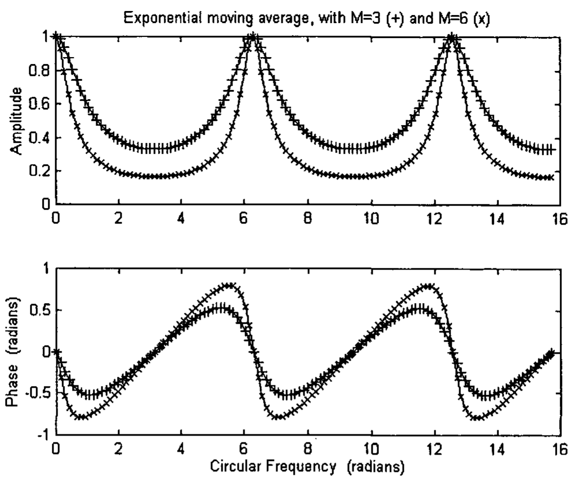
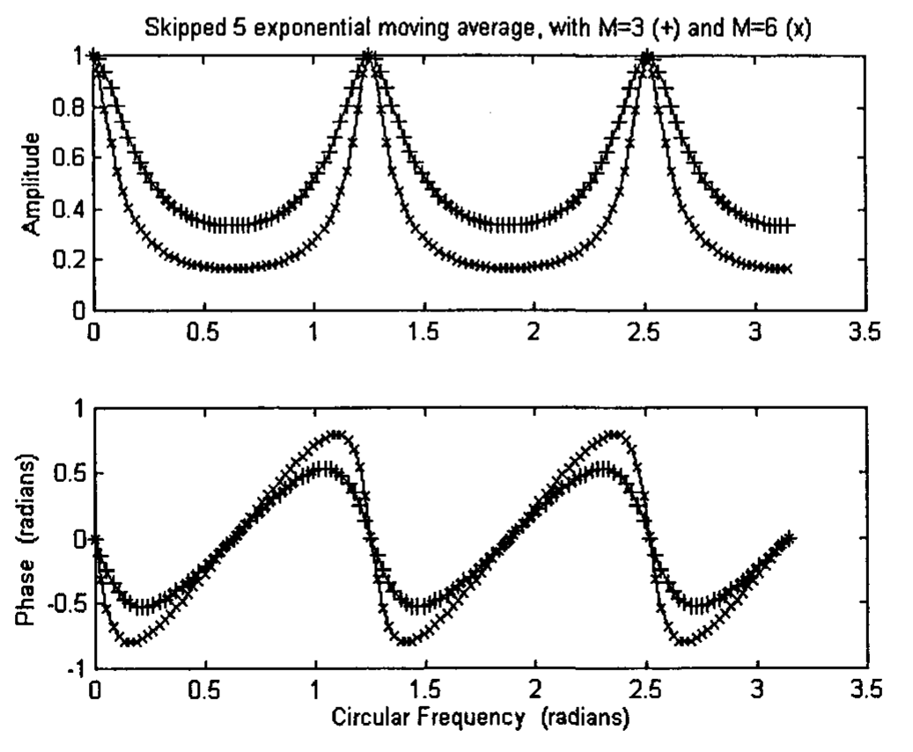

# Chapter 9 Skipped Convolution

Skipped convolution has been introduced by Mak [2003]. It has the advantage that it can alert traders of a trading opportunity earlier. In this chapter, we will take a look at its frequency response and some of its limitations.

## 9.1 Frequency Response

### 9.1.1 Frequency Response of a Convolution

We will first take a look at the conventional convolution. The output, $y(n)$, of the convolution of a unit impulse response, $h(k)$, of a Finite Impulse Response (FIR) filter with an input signal $x(n)$ can be written as [Mak 2003]

$$y(n) = \sum_{k=0}^{K} h(k) x(n-k) \tag{9.1}$$

The performance of a filter may be improved by making use of the output values that have already been processed. That is, previous values of $y$ can be used. In that case, the output, $y(n)$ can be written as:

$$y(n) = \sum_{k=0}^{K} h(k) x(n-k) + \sum_{\ell=1}^{L} g(\ell) y(n-\ell) \tag{9.2}$$

If the $g$ coefficients in Eq (9.2) were set to zero, Eq (9.2) would be reduced to Eq (9.1). The first term on the RHS of Eq (9.2) corresponds to the FIR filter, which is sometimes called a non-recursive filter, as it does not make use of previously processed signal. The second term on the RHS of Eq (9.2) corresponds to the Infinite Impulse Response (IIR) filter, which is sometimes called a recursive filter as it makes use of previously processed values [Broesch 1997].

Fourier Transform of Eq (9.2) would yield a frequency response function $H(\omega)$:

$$H(\omega) = \frac{Y(\omega)}{X(\omega)} = \frac{\sum_{k=0}^{K} h(k) e^{-i\omega k}}{1 - \sum_{\ell=1}^{L} g(\ell) e^{-i\omega \ell}} \tag{9.3}$$

### 9.1.2 Frequency Response of a Skipped Convolution

The output response of a skipped convolution can be written as:

$$y_D(n) = \sum_{k=0}^{K} h(k) x(n - Dk) + \sum_{\ell=1}^{L} g(\ell) y_D(n - D\ell) \tag{9.4}$$

where $D$ is the skip parameter.

Fourier Transform of Eq (9.4) would yield a frequency response function $H_D(\omega)$:

$$H_D(\omega) = \frac{Y_D(\omega)}{X(\omega)} = \frac{\sum_{k=0}^{K} h(k) e^{-iD\omega k}}{1 - \sum_{\ell=1}^{L} g(\ell) e^{-iD\omega \ell}} \tag{9.5}$$

Comparing Eq (9.5) with Eq (9.3), it can be seen that $H_D(\omega)$ is equal to $H(D\omega)$, i.e., $H_D(\omega)$ is equal to $H(\omega)$ compressed by a factor of $D$.

$$H_D(\omega) = H(D\omega) \tag{9.6}$$

We will take a look at an example in the following section.

## 9.2 Skipped Exponential Moving Average

The equation for the output response of a skipped EMA is given by

$$y_D(n) = \alpha x(n) + (1 - \alpha) y_D(n - D) \tag{9.7}$$

where

$$\alpha = 2/(M + 1) \tag{9.8}$$

$M$ is a positive integer chosen by the trader and is often called the length of the EMA, and $D$ is the skip parameter.

Eq (9.7) makes use of an output response that has already been processed $D$ bars ago. When $D = 1$, Eq (9.7) reduces to the ordinary exponential moving average.

To calculate the frequency response of the skipped EMA, Eq (9.5) can be used. Alternatively, we can take the z-transform of Eq (9.7) [Broesch 1997, Proakis and Manolakis 1996].

$$Y_D(z) = \alpha X(z) + (1 - \alpha) z^{-D} Y_D(z) \tag{9.9}$$

where $z = r \exp(i\omega)$ is a complex number in the complex plane, $r$ being the magnitude of $z$. $Y_D(z)$ is the transform of the output and $X(z)$ is the transform of the input.

Defining the transfer function as the output of the filter over the input of the filter

$$H_D(z) = Y_D(z) / X(z) \tag{9.10}$$

we get, for EMA

$$H_D(z) = \frac{\alpha}{1 - (1 - \alpha) z^{-D}} \tag{9.11}$$

The skipped EMA has a single pole in its transfer function. A pole is a zero of the denominator polynomial of the transfer function $H_D(z)$. Restricting $z$ in the complex plane to $\exp(i\omega)$ on the unit circle (i.e. $r = 1$), the frequency response function $H_D(\omega)$ is given by

$$H_D(\omega) = \frac{\alpha}{1 - (1 - \alpha) \exp(-iD\omega)} \tag{9.12}$$

The magnitude of $H_D(\omega)$ is given by

$$|H_D(\omega)| = \frac{\alpha}{[1 - 2(1-\alpha)\cos D\omega + (1-\alpha)^2]^{1/2}} \tag{9.13}$$

The phase is given by

$$\phi_D(\omega) = \tan^{-1} \frac{-(1-\alpha)\sin D\omega}{1 - (1-\alpha)\cos D\omega} \tag{9.14}$$

The amplitude and phase of $H(\omega)$ of the EMA for $M = 3$ and $M = 6$ are plotted in Fig 9.1 from 0 to $5\pi$. The amplitude and phase of $H_D(\omega)$ of the skipped EMA with $D = 5$ are plotted in Fig 9.2 for $M = 3$ and $M = 6$ from 0 to $\pi$. In consistent with Eq (9.6), Fig 9.2 is exactly the same as Fig 9.1 but compressed by a factor of 5. Comparing Fig 9.2 with Fig 9.1, it can be seen that while, in general, the phase lag of the skipped convolution is less than that of the convolution, the skipped convolution can pick up frequencies larger than $\pi$ from the original input signal, thus making the output signal of the skipped convolution noisier.


**Fig 9.1** The amplitude and phase of the discrete time Fourier Transform, H(ω), of the exponential moving average for M = 3 (marked as +) and M = 6 (marked as x) are plotted from 0 to 5π.


**Fig 9.2** The amplitude and phase of H_D(ω) of the skipped exponential moving average with D = 5 are plotted for M = 3 (marked as +) and M = 6 (marked as x) from 0 to π.

In the EasyLanguage code of Omega Research's TradeStation2000i, the program for calculating the skipped convolution function of an exponential moving average can be written as follows:

```EasyLanguage
Description: Exponential Moving Average skipped convolution function

Inputs: Price(NumericSeries), Length(NumericSimple), D(Numeric);
Variables: alpha(0);
alpha = 2 / (Length + 1);
XAverageD = alpha * Price + (1 - alpha) * XAverageD[D];
```

In the above program, alpha is the parameter corresponding to Eq (9.8), and XAverageD is the function corresponding to Eq (9.7).

The program for calculating the indicator for plotting the skipped convolution function of an exponential moving average can be written as follows:

```EasyLanguage
Description: This Indicator plots skipped Exponential Moving Average

Inputs: Length(6), D(5);
Plot1(XAverageD(c, Length, D), "XAverageD");
```

In the above program, the default value of length is taken to be 6, and the default value of the skip parameter, $D$, is taken to be 5. These values, of course, can be easily changed before execution. The first variable in the function XAverageD, c, corresponds to the Price data in the function program.

An S&P 500 Index data is plotted in Fig 9.3 together with an exponential moving average with $M = 6$ (thin line), and two skipped exponential moving average with $M = 6$ and $D = 2$ (middle thick line) and $D = 3$ (thickest line). It can be noted that the line with $D = 2$ is less smooth than the ordinary exponential moving average and the line with $D = 3$ is less smooth than the line with $D = 2$. This is consistent with what is described earlier, and also shown in Fig 9.2. The skipped convolution can pick up frequencies larger than $\pi$ from the input signal. This is a limitation of the skipped convolution. This limitation is related to that of downsampled signal. The relation between skipped convolution and downsampled signal will be considered in the next section.


**Fig 9.3** An S&P 500 Index data is plotted together with an exponential moving average with M = 6 (thin line), and two skipped exponential moving average with M = 6 and D = 2 (middle thick line) and D = 3 (thickest line). Chart produced with Omega Research TradeStation2000i.

## 9.3 Skipped Convolution and Downsampled Signal

Traders quite often look at financial data in multiple timeframes [Elder 1993]. For example, they will analyze the data in a daily chart, as well as a weekly chart. They would consider the market movements in the weekly chart as the long-term trend, and the price data in the daily chart as short-term actions. The price data in a weekly chart can be considered as taking every fifth data point from a daily chart, but at the end of the week. Thus, the weekly chart can be considered as a downsampled signal from the daily chart. However, there is no reason why a weekly chart cannot be constructed from the daily chart by taking the daily closing price every Thursday or Tuesday. This is why the concept of skipped convolution can be useful. As said earlier, the skipped convolution can alert a trader earlier of a market action.

A signal of frequency $\pi/10$ radian in a daily chart would become a signal of frequency $\pi/2$ in the weekly chart. However, a signal of frequency $\pi/2$ in the weekly chart can also contain other frequencies from the daily chart, namely,

$$\pi/10 + 2\pi/5, \quad \pi/10 + 4\pi/5, \quad \pi/10 + 6\pi/5, \quad \pi/10 + 8\pi/5$$

which are called aliases [Mak 2003].

A downsampled signal $v(n)$, can be written as

$$v(n) = x(Dn) \tag{9.15}$$

where $x(n)$ is the original signal, and $D$ is the downsampled parameter. That is, every $D$th sample of $x$ is taken to construct $v$.

There exists a relationship between $Y_D(\omega)$, the output response of a skipped convolution of an indicator on the original signal and $H(\omega)V(\omega)$, the output response of an indicator of a downsampled signal.

From Eq (9.5) and (9.6),

$$Y_D(\omega) = H_D(\omega) X(\omega) = H(D\omega) X(\omega) \tag{9.16}$$

Eq (9.16) can be re-written as

$$Y_D(\omega/D) = H(\omega) X(\omega/D) \tag{9.17}$$

The Fourier Transform of the convolution between a unit impulse response, $h(n)$ and a downsampled signal $v(n)$ can be written as $H(\omega)V(\omega)$, where $V(\omega)$ is the Fourier Transform of $v(n)$. $V(\omega)$ contains a mixture of frequencies from the original signal. From Mak [2003],

$$H(\omega)V(\omega) = \frac{H(\omega)}{D} \left[ X\left(\frac{\omega}{D}\right) + X\left(\frac{\omega + 2\pi}{D}\right) + \ldots + X\left(\frac{\omega + (D-1)2\pi}{D}\right) \right] \tag{9.18}$$

Using Eq (9.17), Eq (9.18) can be re-written as

$$H(\omega)V(\omega) = \frac{1}{D} \left[ Y_D\left(\frac{\omega}{D}\right) + Y_D\left(\frac{\omega + 2\pi}{D}\right) + \ldots + Y_D\left(\frac{\omega + (D-1)2\pi}{D}\right) \right] \tag{9.19}$$

In deriving Eq (9.19), the following relation is being used:

$$H(\omega + 2D\pi) = H(\omega) \tag{9.20}$$

Eq (9.19) thus establishes the relationship between $H(\omega)V(\omega)$, the output response of an indicator on a downsampled signal and $Y_D(\omega)$, the output response of a skipped convolution of an indicator on the original signal. This implies that an indicator applied on a downsampled signal contains more frequencies than a trader would like to have. This definitely would affect the decision made by traders. Further discussions will be given in Chapter 11.
