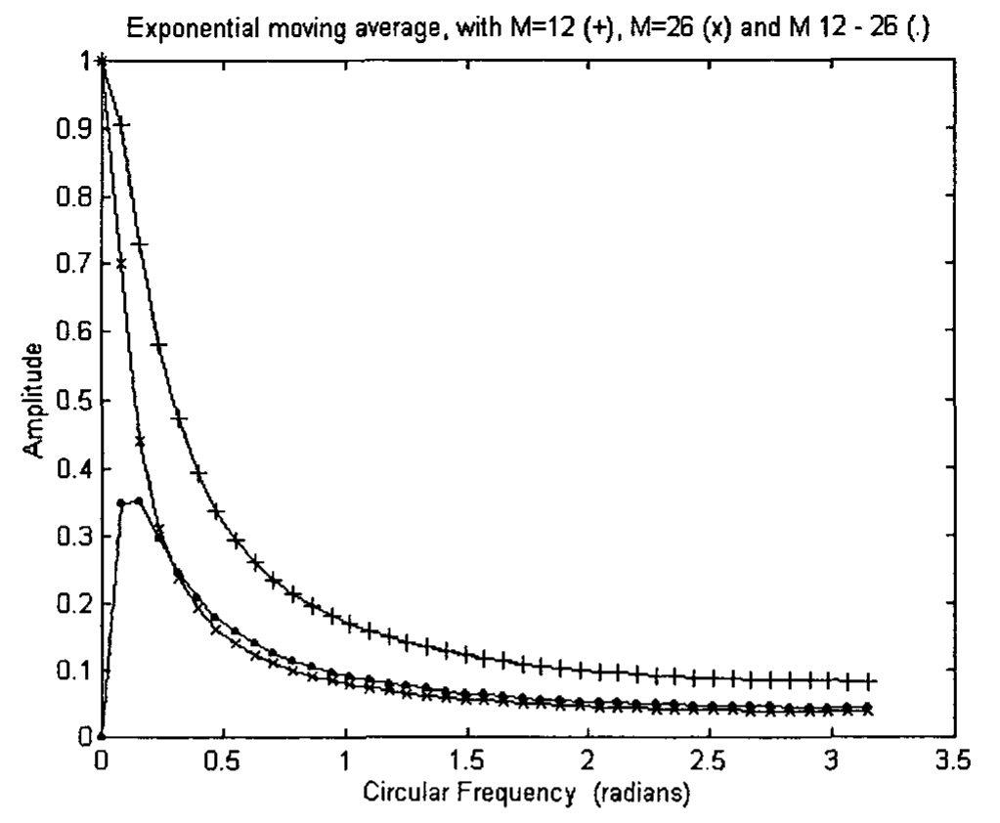
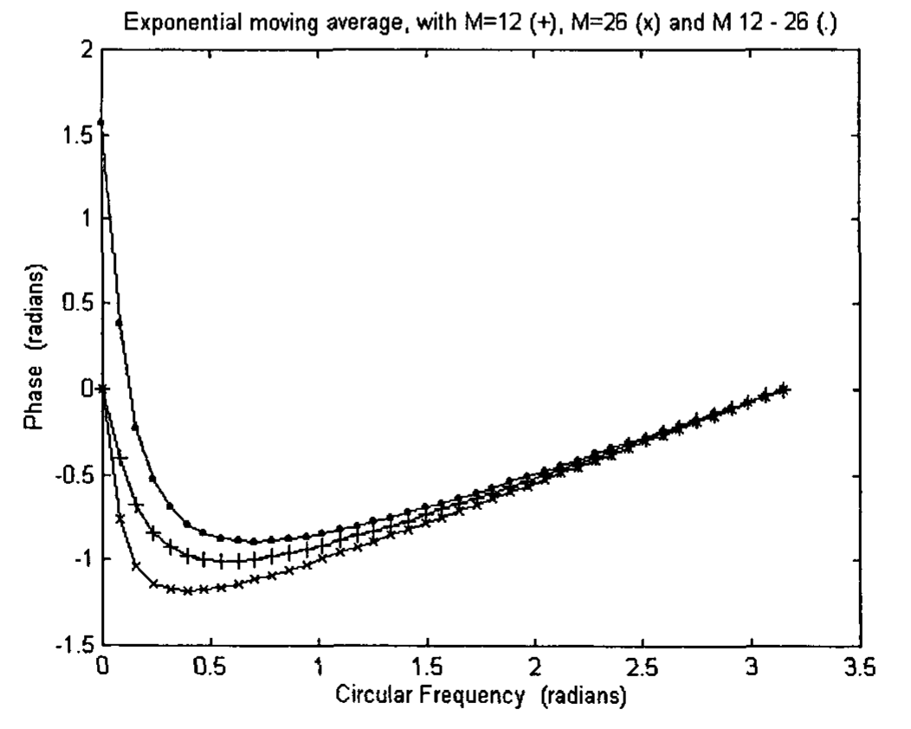
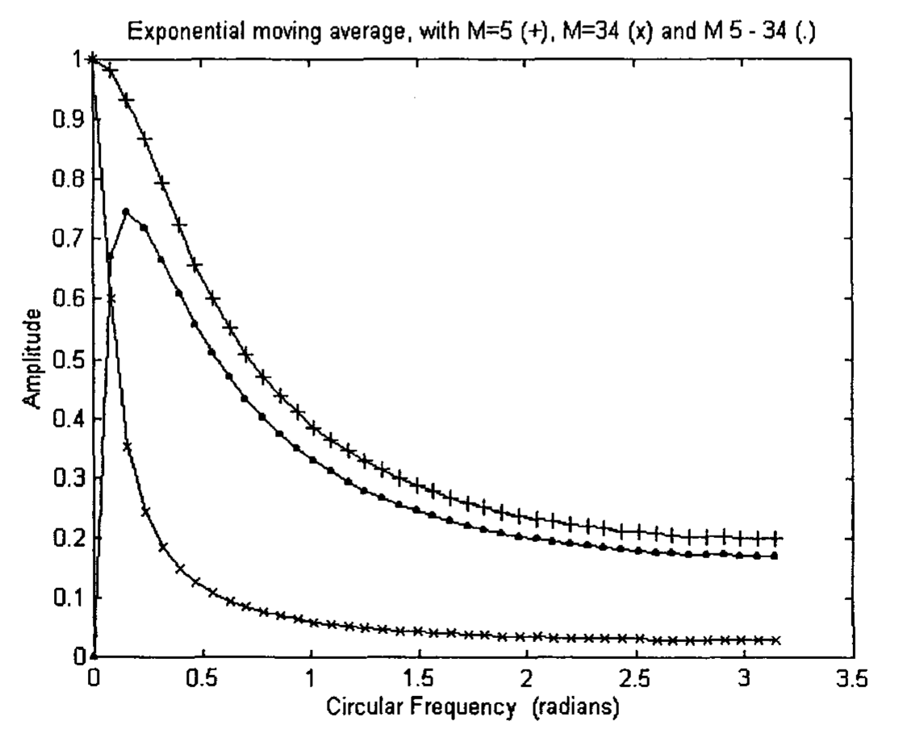
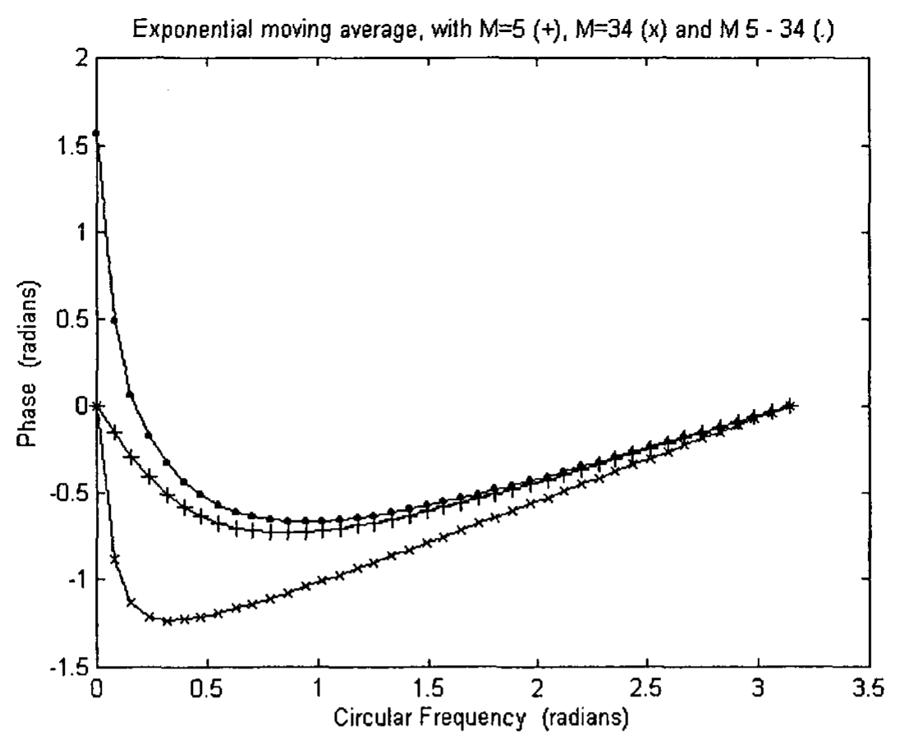
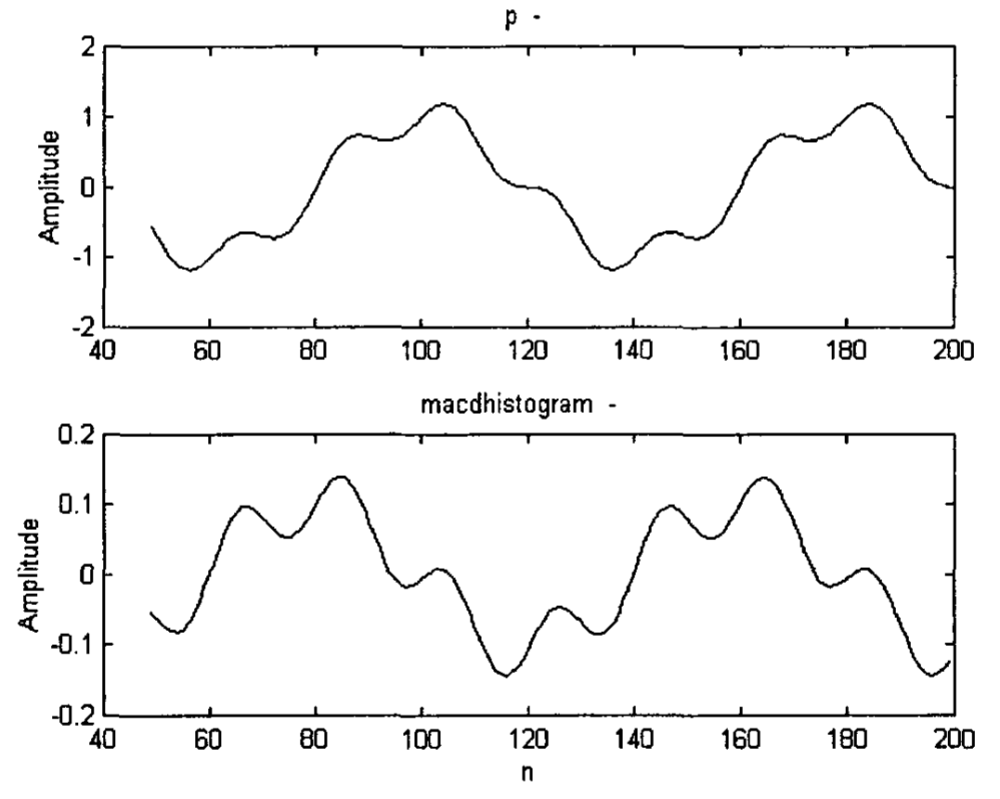
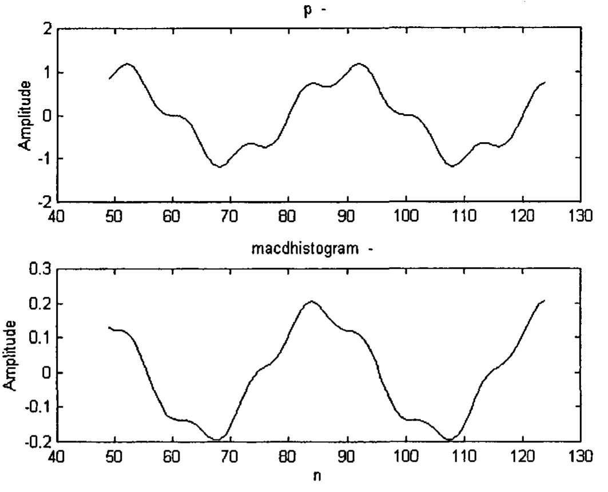

# Chapter 10: Trading Tactics

Traders employ different tactics to trade the market. One example is the divergence between price and velocity. They say that when divergence occurs, the market is going to change direction. However, no explanation is given why this would happen. We will explain this in the next section. Furthermore, they never analyze the tools that they use, and clarify their advantages and limitations. We will examine their popular indicators in the following sections.

## 10.1 Velocity Divergence

When a piece of stone is thrown upwards, it rises higher and higher, but its speed is getting lesser and lesser. At the highest point, its speed is zero. It then reverses direction. A similar phenomenon appears also in the financial market. While the price is getting higher, the slope of the price is getting smaller. This kind of divergence is exploited by traders, who look at this as good trading opportunities [Pring 1991, Elder 1993, Mak 2003].

Conventionally, slope is represented by momentum (which is actually a two-point moving difference) by traders. However, as is pointed out by Mak [2003], the newly coined velocity indicators have much less phase lag than momentum. Velocity will thus be used instead of momentum here to analyze the data.

Thus, if there is a divergence between the price and the velocity, it is forecasted that the price will change direction. An example is given in Fig 10.1, where the S&P500 weekly data in the year 2002 and 2003 is plotted. The S&P 500 reached an all time high of approximately 1550 in March 2000. It then dropped 50% to approximately 775, forming a triple bottom in July, October 2002 and March 2003. In the price chart in Fig 10.1, an adaptive moving average (created by Jurik Research) of smoothness 3 is plotted as a line. A quartic velocity and a quartic acceleration of the adaptive moving average are plotted in the middle and bottom figures respectively. Slightly before the three points where the S&P 500 index are hitting triple bottoms, the successive magnitudes of the (negative) quartic velocity are getting smaller and smaller, thus showing a divergence (Note that the velocity of price leads the price). The implication is that the index would soon rise. As it happened, it did rise like a phoenix. The velocity maintains more or less positive after April, 2003, in consistence with the rising price. The advantage about price and velocity divergence is that this occurrence precedes the turning point, where the velocity is zero, thus giving plenty of time to alert the trader.

**Fig 10.1** A weekly chart of the S&P 500 Index. The price data was smoothed using the adaptive moving average with smoothness 3 (shown as a line in the top figure). Quartic velocity and quartic acceleration indicators are plotted in the middle and bottom figures respectively. Chart produced with Omega Research TradeStation2000i.

## 10.2 Moving Average Convergence-Divergence (MACD)

### 10.2.1 MACD Indicator

The MACD indicator is a popular indicator used by traders [Elder 1993, 2002; Pring 1991; Appel 1991]. The indicator was developed by Gerald Appel, an analyst and money manager in New York [Elder 1993, 2002].

The indicator consists of two lines: the MACD line and the Signal line. The MACD line is composed of two exponential moving averages, a fast EMA and a slow EMA. The line is called MACD (moving average convergence-divergence) because the fast EMA is continually converging toward and diverging from the slow EMA. Fast EMA has a smaller length, $M$, than that of slow EMA. The slow EMA (e.g. $M_2 = 26$) is subtracted from the fast EMA (e.g. $M_1 = 12$). Their difference is plotted. This is called the (fast) MACD line. An EMA (e.g. $M_3 = 9$) of the (fast) MACD line is calculated and plotted on the same chart. This is called the slow Signal line.

The trading rule is based on the crossover between the MACD and Signal lines. When the fast MACD line crosses above the slow Signal line, a buy signal is generated. When the fast line crosses below the slow line, a sell signal is implemented.

This trading rule is somewhat similar to the crossover between a fast EMA line and a slow EMA line [Pring 1991; Mak 2003]. The trader will buy when the fast EMA crosses over and is above the slow EMA. He will sell when the fast EMA crosses over and is below the slow EMA.

Now, the question is: is the MACD trading rule better than the EMA trading rule? And what exactly is the MACD line? We will find that out in the next section.

### 10.2.2 MACD Line

The MACD line is the difference between two exponential moving averages. We would like to find out the amplitude and phase of the Fourier Transform of the MACD line.

The Fourier Transform of an exponential moving average is a low pass filter. The Fourier Transform of the difference of two exponential moving averages is simply the difference in their respective Fourier Transform [Brigham 1974, P31]. Let $H_1(\omega)$ and $H_2(\omega)$ be the Fourier Transform of the fast EMA and the slow EMA respectively. The Fourier Transform of the MACD line, $H_4(\omega)$ is simply given by:

$$H_4(\omega) = H_1(\omega) - H_2(\omega) \tag{10.1}$$

#### 10.2.2.1 Fast EMA ($M_1 = 12$) and Slow EMA ($M_2 = 26$)

Taking the lengths of the fast EMA and the slow EMA to be 12 and 26 respectively (12 and 26 are common parameters used by traders [Elder 1993, 2002]), their amplitudes as well as the amplitude of $H_4(\omega)$ are plotted in Fig 10.2(a). This simply shows that $H_4(\omega)$ is a band-pass filter. When the amplitudes of two low pass filters are the same at $\omega = 0$, their difference should yield a band-pass filter. The MACD line filters off the very slow moving market movement near $\omega = 0$, thus removing some of the slowly changing trend. This can make the timing of a crossover between an MACD line and the Signal line a better timing than the crossover of a fast EMA line and a slow EMA line. Fig 10.2(a) also shows that the MACD line in this particular case is as smooth as the slow EMA, making it a very good filter.

To show that the MACD line functions even better than the EMA, we can take a look at Fig 10.2(b), which plots the phases of the fast EMA and slow EMA, as well as the phase of the MACD line. It can be seen that the MACD line has a lesser phase lag than even the fast EMA. At $\omega = 0$, the real and imaginary part of $H_4(\omega)$ is 0. Thus, the phase of the MACD line at $\omega = 0$ is of the indeterminate form. However, using the De l'Hopital's Rule [e.g. Kaplan 1952, P27], it can be shown that the phase is equal to $\pi/2$. The phase $\pi/2$ is thus plotted at $\omega = 0$ for $H_4(\omega)$. Therefore, because the MACD line has a smaller phase lag, the MACD trading technique would provide a quicker crossover and therefore buy or sell signal than a comparative EMA trading technique. Thus, it is no wonder that some experienced traders embrace the MACD trading tactic.

**Fig 10.2(a)** The amplitudes of the Fourier Transform of the fast EMA (M1 = 12) (plotted as +) and the slow EMA (M2 = 26) (plotted as x), and the amplitude of the MACD line (plotted as .) are plotted versus the circular frequency omega.

**Fig 10.2(b)** The phases of the Fourier Transform of the fast EMA (M1 = 12) (plotted as +) and the slow EMA (M2 = 26) (plotted as x), and the phase of the MACD line (plotted as .) are plotted versus the circular frequency omega.

An example would be given. In Fig 10.3, the top figure plots a signal, $p$, composed of waves of two frequencies to simulate market price data:

$$p = 0.25\sin(\pi n/10) + \sin(\pi n/40) \tag{10.2}$$

where $n$ is an integer.

Two exponential moving averages (EMA) of length 12 and 26 are plotted on the same figure. Their crossovers would provide entry and exit points for traders to trade the market. The bottom figure in Fig 10.3 plots the MACD line ($M_1 = 12$ and $M_2 = 26$) and the Signal line ($M_3 = 9$). Again, their crossover would provide entry and exit points for trading the market. It can be seen that the crossovers of the MACD line and Signal line provides much better timing and therefore profitability than the crossovers of the two EMA lines.

**Fig 10.3** The top figure plots a simulated price data as a line. The fast EMA (M1 = 12) (plotted as .) and the slow EMA (M2 = 26) (plotted as +) of the price data are also plotted. The bottom figure plots the MACD line (plotted as a line) and the Signal line (plotted as .). Note that the crossovers of the MACD line and the Signal Line appear earlier than the crossovers of the two EMA lines, thus providing better timing for trading purposes.

#### 10.2.2.2 Fast EMA ($M_1 = 5$) and Slow EMA ($M_2 = 34$)

The lengths of the fast and slow EMA for the MACD line are quite often taken to be 5 and 34 [Elder 1993]. The amplitudes and phases of the two EMA's and their MACD line are plotted in Fig 10.4(a) and (b) respectively. Comparing Fig 10.4(a) with 10.2(a), it can be seen the amplitudes of both MACD lines peak at about 0.2 radian. Fig 10.4(b) shows that, again, the MACD line has a lesser phase lag than even the fast EMA. However, Fig 10.4(a) shows that it is only about as smooth as the fast EMA. Thus, it is not as good a band-pass filter as the one we discussed in section 10.2.2.1. This simply means that the length of the EMA's have to be chosen carefully to optimize one's trading tactics. In order that the MACD line is approximately as smooth as the slow EMA, the length of the slow EMA should be approximately twice as long as that of the fast EMA. Another set of lengths commonly used for the fast and slow EMA's are 8 and 17 [Pring 1991].

**Fig 10.4(a)** The amplitudes of the Fourier Transform of the fast EMA (M1 = 5) (plotted as +) and the slow EMA (M2 = 34) (plotted as x), and the amplitude of the MACD line (plotted as .) are plotted versus the circular frequency omega.

**Fig 10.4(b)** The phases of the Fourier Transform of the fast EMA (M1 = 5) (plotted as +) and the slow EMA (M2 = 34) (plotted as x), and the phase of the MACD line (plotted as .) are plotted versus the circular frequency omega.

## 10.3 MACD-Histogram

It has been said that the MACD-Histogram offers a better insight into the balance of power between the bulls and bears than the MACD [Elder 1993, 2002]. Not only does it show whether the bulls or bears are in control, it also shows whether they are growing stronger or weaker.

Now, are these claims correct? First, let us see how the MACD-Histogram is defined. It is defined as the difference between the MACD line and the Signal line:

$$\text{MACD-Histogram} = \text{MACD line} - \text{Signal line} \tag{10.3}$$

The MACD-Histogram is usually plotted as a histogram to distinguish it from the MACD line, but it can just as well be plotted as a line. As discussed earlier, the signal line is the exponential moving average of the MACD line. Let the Fourier Transform of this exponential moving average be denoted by $H_3(\omega)$. Then the Fourier Transform of the Signal line will be given by $H_3(\omega) H_4(\omega)$. The Fourier Transform of the MACD-Histogram, $H_5(\omega)$, according to Eq (10.3) will be given by

$$H_5(\omega) = H_4(\omega) - H_3(\omega) H_4(\omega) \tag{10.4a}$$

$$= (1 - H_3(\omega)) H_4(\omega) \tag{10.4b}$$

As $H_3(\omega)$ is a low pass filter, and $H_4(\omega)$ is a band-pass filter, $H_3(\omega) H_4(\omega)$ is a band-pass filter. Eq (10.4a) would mean that $H_5(\omega)$ is a band-pass filter, which is formed from the difference between two band-pass filters. Eq (10.4a) can be rewritten in the form of Eq (10.4b). As $(1 - H_3(\omega))$ is a high pass filter, $H_5(\omega)$ can also be considered as a combination between a high pass filter and a band-pass filter.

Taking the lengths of the fast EMA, slow EMA and the EMA of the MACD line to be 12, 26 and 9, the amplitudes and phases of the MACD line, Signal line and MACD-Histogram are plotted in Fig 10.5(a) and (b). Fig 10.5(a) shows that the MACD-Histogram is a band-pass filter, having a peak at a frequency slightly larger than that of the MACD line (which is also a band-pass filter). It filters off more of the low frequency component of a signal than the MACD line. Fig 10.5(b) shows that it has less phase lag than the MACD line, thus the MACD-Histogram can detect market movement faster. The phase of the Signal line is the sum of the phase of $H_3(\omega)$ and the phase of $H_4(\omega)$. At $\omega = 0$, since the phase of $H_3(\omega) = 0$ and the phase of $H_4(\omega) = \pi/2$, the phase of the Signal line $= \pi/2$. At $\omega = 0$, the amplitude of $H_5(\omega)$ is 0, which implies that the real and imaginary part of $H_5(\omega)$ is 0, and the phase is in an indeterminate form. To calculate that phase, it would be easier to use Eq (10.4b) than (10.4a), as the phase of $H_5(\omega)$ is simply given by the sum of the phase of $(1 - H_3(\omega))$ and the phase of $H_4(\omega)$. Using again the De l'Hopital's Rule, the phase of the high pass filter, $(1 - H_3(\omega))$ at $\omega = 0$ is found to be $\pi/2$. As the phase of $H_4(\omega)$ at $\omega = 0$ is $\pi/2$, the phase of $H_5(\omega)$ is $\pi$.

**Fig 10.5(a)** The amplitudes of the MACD line (plotted as +), Signal line (plotted as x) and MACD-Histogram (plotted as .) are plotted versus the circular frequency omega. The lengths of the fast EMA, slow EMA and the EMA of the MACD line are taken to be 12, 26 and 9 respectively.

**Fig 10.5(b)** The phases of the MACD line (plotted as +), Signal line (plotted as x) and MACD-Histogram (plotted as .) are plotted versus the circular frequency omega. The lengths of the fast EMA, slow EMA and the EMA of the MACD line are taken to be 12, 26 and 9 respectively.

The lengths of the EMA associated with the MACD, 12, 26 and 9 have become standard values used as defaults in most trading software packages. It has been said that changing these numbers has little impact on the MACD signals, unless their ratios are changed drastically [Elder 2002]. This is probably due to the fact that the peak of the MACD-Histogram does not change much even though those numbers are changed. The peak of the MACD Histogram for the values 12, 26, and 9 is located at 0.21 radians (Fig 10.5(a)). If the values were changed to 3, 6, and 9, the peak would only shift to 0.58 radian (Fig 10.6(a)). However, this slight shift can make a difference, which is more accentuated in the phase plot. Fig 10.6(b) plots the phase of the MACD line, Signal line and MACD-Histogram for the values 3, 6, and 9. It should be noted that the phase of the MACD-Histogram is almost zero for circular frequencies greater than 0.5 radian. As its phase lag is less than that of the MACD-Histogram with values of 12, 26 and 9, this property seems to make it a good candidate as a band-pass filter. However, its usefulness is much limited as it retains a certain portion of high frequency noises.

For years, traders have been attempting to develop zero lag low pass filters without too much success [Ehlers 1992, 2001]. But the trick is to develop not low pass filter, but band pass filter with almost zero phase lag. MACD line and MACD Histogram are band pass filters with almost zero lag. Their characteristics have not been pointed out so far. Thus, it does need mathematical analysis to discover the importance of these filters.

Qualitatively, the MACD-Histogram does not provide any significant difference from the MACD line, as contrasted to what some traders would like to think. However, the MACD-Histogram does filter out more low frequency component than the MACD line. This can make it a very useful indicator. While an exponential moving average (e.g. an EMA of length = 26) can monitor the long term trend of the market, the MACD-Histogram can denote the middle term movement with very little time lag. High frequency components are usually eliminated in trading, as they are considered as noise. Thus, as long as the trader keeps an eye on the long and middle trends, he would have a good understanding of the market.

**Fig 10.6(a)** The amplitudes of the MACD line (plotted as +), Signal line (plotted as x) and MACD-Histogram (plotted as .) are plotted versus the circular frequency omega. The lengths of the fast EMA, slow EMA and the EMA of the MACD line are taken to be 3, 6 and 9 respectively.

**Fig 10.6(b)** The phases of the MACD line (plotted as +), Signal line (plotted as x) and MACD-Histogram (plotted as .) are plotted versus the circular frequency omega. The lengths of the fast EMA, slow EMA and the EMA of the MACD line are taken to be 3, 6 and 9 respectively.

### 10.3.1 MACD-Histogram Divergence

Some traders claim that the divergences between MACD-Histogram and price give some of the strongest signals in technical analysis. These divergences identify major turning points and yield strong buy or sell signals [Elder 1993, 2002]. When prices fall to a new low but the indicator falls to a more shallow low than the preceding one, the MACD-Histogram traces a bullish divergence. This implies that the bears have grown weaker and traders should go long. When prices rise to a new high but the indicator rises to a lower peak than the preceding one, the MACD-Histogram traces a bearish divergence. The bulls are receding and traders should go short. These deductions are actually not quite true.

It should be noted that there is a fundamental difference between MACD-Histogram divergence and velocity (or momentum) divergence. Velocity (or momentum) is a high-pass filter that simulates the slope of the price data [Mak 2003]. Thus, divergence between price and velocity implies that price and its slope are going into different directions. The market is going to turn. The MACD-Histogram, as discussed above, is a band-pass filter. It filters off the low frequency (long cycles) and high frequency (short cycles), leaving behind the middle frequency. Its divergence from the price means that its middle frequency signal generates a different opinion from that of the total price.

If the lengths of the exponential moving averages are chosen to be $M_1 = 12$, $M_2 = 26$ and $M_3 = 9$, the MACD-Histogram will peak at about a circular frequency of approximately 0.21 radians (see Fig 10.5(a)). We will see how an MACD-Histogram divergence can arise.

As an example, we will simulate the market price movement as follows:

$$p = 0.25\sin(\pi n/10) + \sin(\pi n/40) \tag{10.5}$$

where $p$ is the price, and $n$ is a positive integer.

The frequency of $\pi/10$ radian corresponds to a $2\pi/(\pi/10) = 20$ bar cycle. (If a daily chart is being used, a 20 bar cycle means that the cycle is approximately one month.) In Fig 10.7, $p$ is plotted in the top figure, while the MACD-Histogram of $p$ is plotted in the bottom figure. The MACD-Histogram, acting as a band-pass filter, filters out part of the $\pi/40$ signal and retains most of the $\pi/10$ signal. As it can be observed in the figure at $n = 85$ and $n = 105$, while the price, $p$, rises to a new high, the Histogram rises to a lower peak. Trading rule would dictate the trader to go short. As it happens, the price, $p$, does turn down. At $n = 115$ and $n = 135$, the total price, $p$, falls to a new low, the Histogram falls to a higher low. Trading rule would dictate the trader to go long. The price, $p$, does turn up after. Thus, in this particular example, the trading rule of MACD-Histogram divergence works very well.

**Fig 10.7** The top figure plots a simulated price $p = 0.25\sin(\pi*n/10) + \sin(\pi*n/40)$. The bottom figure plots the macdhistogram of the price. The trading rule of MACD-Histogram divergence works in this case.

We will take a look at another example:

$$p = 0.25\sin(\pi n/5) + \sin(\pi n/20) \tag{10.6}$$

In Fig 10.8, $p$ is plotted in the top figure, while the MACD-Histogram of $p$ is plotted in the bottom figure. As it can be observed in the figure at $n = 84$ and $n = 92$, while the price, $p$, rises to a new high, the Histogram rises to a lower peak. This shows a bearish divergence. As it happens, the price, $p$, does turn down. At $n = 98$ and $n = 108$, the total price, $p$, falls to a new low, the Histogram also falls to a new low. No divergence is thus observed. However, the price, $p$, turns up after.

**Fig 10.8** The top figure plots a simulated price $p = 0.25\sin(\pi*n/5) + \sin(\pi*n/20)§. The bottom figure plots the macdhistogram of the price. The trading rule of MACD-Histogram divergence does not necessarily work.

Thus, the occurrence of any MACD-Histogram divergence would depend very much on the frequencies of the market price signal. The divergence may not happen sometimes. Hence, it is believed that the velocity divergence would be a more reliable indicator. The velocity divergence has also an advantage over the MACD-Histogram divergence. It can be observed in Fig 10.7 and 10.8 that the peaks (or valleys) of the MACD-Histogram do not have any phase lead as compared to the peaks (or valleys) of the price. This, of course, is consistent with the phase plot in Fig 10.5(b). However, the peaks (or valleys) of the velocity of the price has a phase lead of approximately $\pi/2$ compared to the peaks (or valleys) of the price [Mak 2003]. This provides an early warning of the market turn, which would happen when the velocity becomes zero later.

## 10.4 Exponential Moving Average of an Exponential Moving Average

Exponential moving average (EMA) is quite often used to smooth the price data. The direction of its slope is considered to be an important message. When the EMA rises, the crowd is bullish. It is a good time to go long. When the EMA falls, the crowd is bearish. It is a good time to go short [Elder 2002].

An EMA with a short length is quite sensitive to price changes. It allows the trader to catch new trends sooner. However, it also changes its direction more often. An EMA with a longer length does not change direction so often, but it has a larger time lag in recognizing turning points. As a rule, the longer the trend the trader attempts to catch, the larger the length of the EMA should be chosen.

The longer the length of the EMA, the smoother the data. Alternatively, some traders suggest smoothing the EMA with another EMA [Pring 1991]. However, this would create a much larger time lag with respect to the data.

Smoothing one EMA with another EMA is equivalent to convoluting the unit impulse response of the EMA with the unit impulse response of another EMA. The Fourier Transform of the operation is equal to the product of their individual Fourier Transform [Brigham 1974]. The phase is therefore equal to the sum of their individual phases.

As an example, an EMA of length 6 is applied onto an EMA of length 3. The amplitude and phase of its Fourier Transform is shown in Fig 10.9(a) and (b) respectively. The amplitude is equal to the product of the amplitude of an EMA of length 6 and the amplitude of an EMA of length 3. The phase is equal to the sum of the phase of an EMA of length 6 and the phase of an EMA of length 3. The amplitude and phase of the Fourier Transform of an EMA of length 10 are also plotted in the same figures for comparison purpose. It can be seen from Fig 10.9(a) that it has a similar filtering capability as the EMA of an EMA. The EMA of the EMA does produce a smoother line, as it retains more low frequency component and rejects more high frequency component (Fig 10.9(a)). However, this is done at the expense of a much larger phase lag (Fig 10.9(b)). Thus, it would seem that it would be more practical to choose an EMA of longer length to smooth the data than to use an EMA of an EMA.

**Fig 10.9(a)** The amplitude of the Fourier Transform of an EMA of length 6 applied onto an EMA of length 3 is plotted (as x) versus the circular frequency omega. The amplitude of the Fourier Transform of an EMA of length 10 is also plotted (as +) for comparison purpose.

**Fig 10.9(b)% The phase of the Fourier Transform of an EMA of length 6 applied onto an EMA of length 3 is plotted (as x) versus the circular frequency omega. The phase of the Fourier Transform of an EMA of length 10 is also plotted (as +) for comparison purpose.
