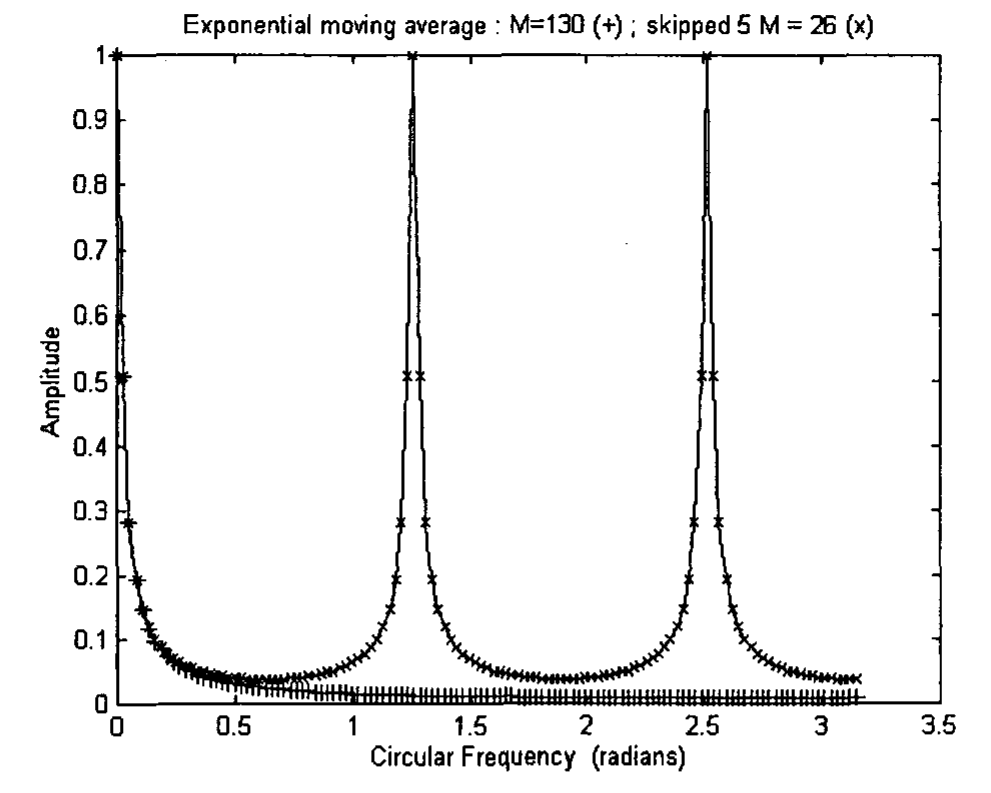
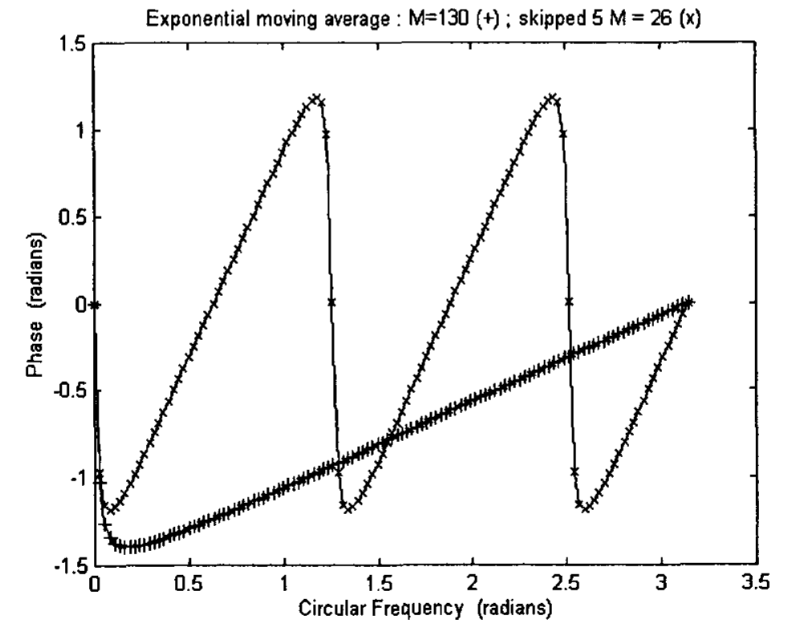
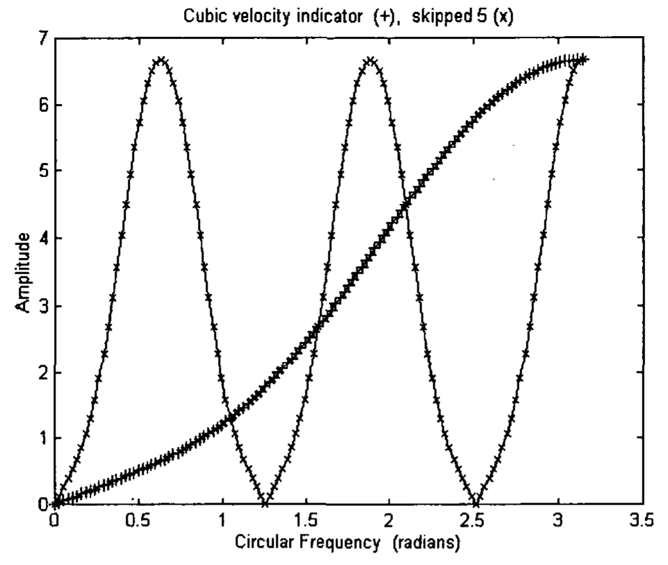
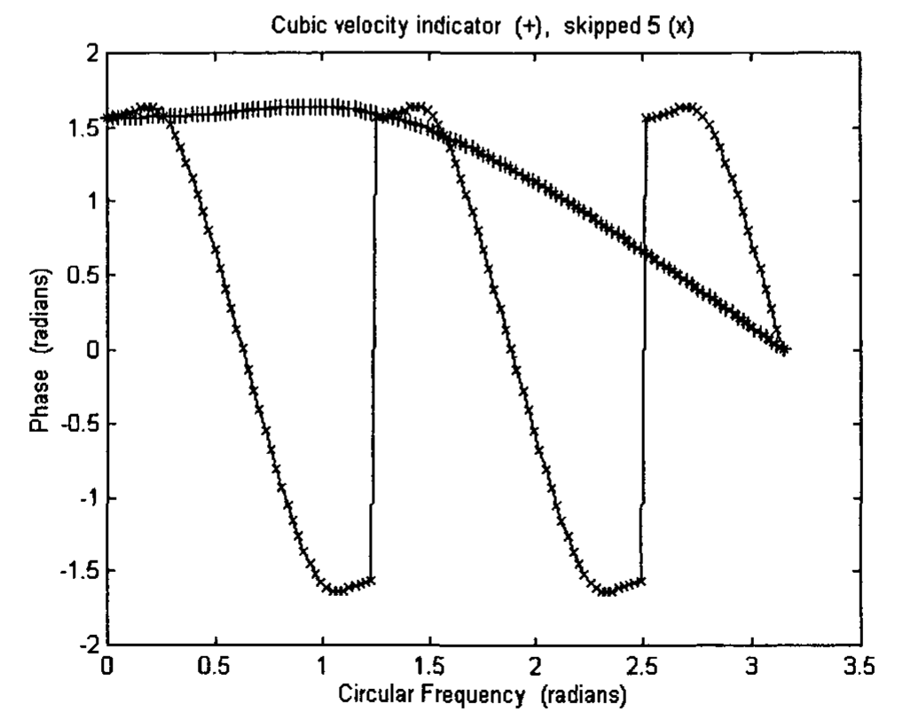
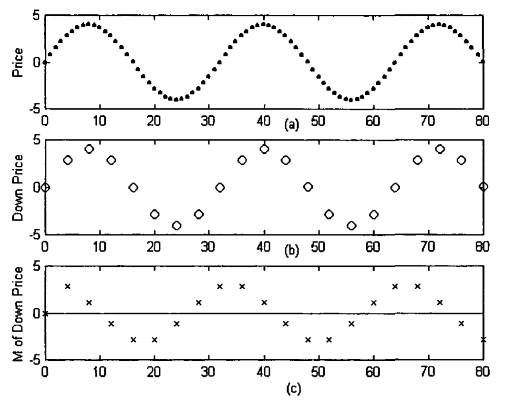
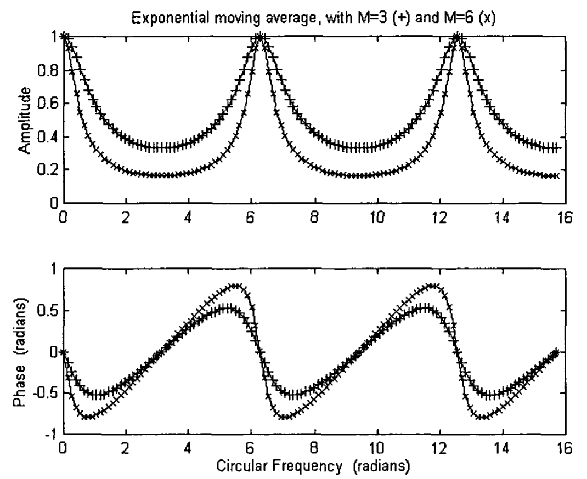
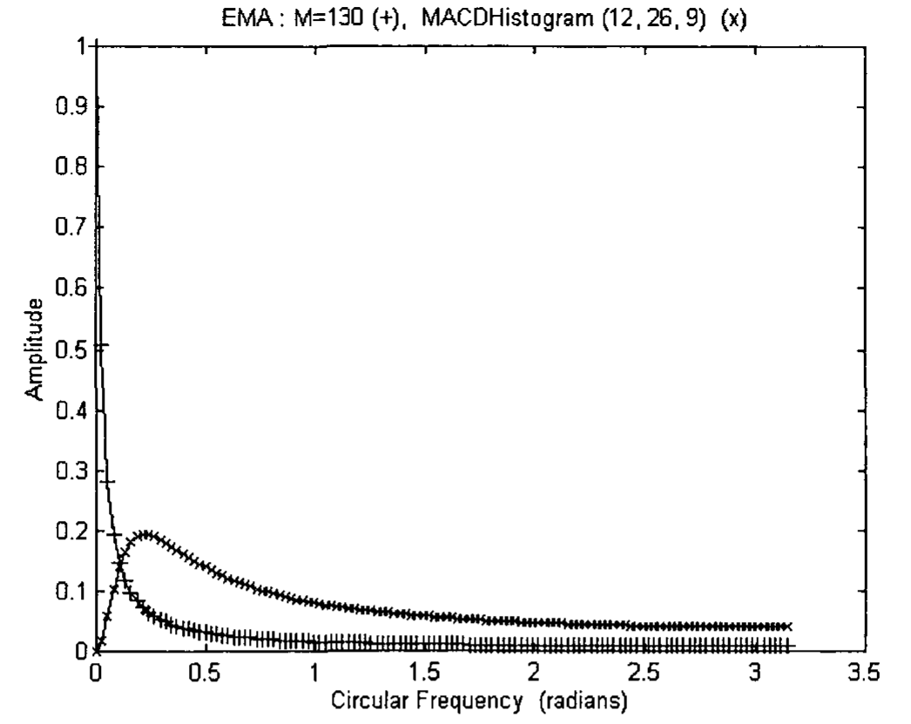
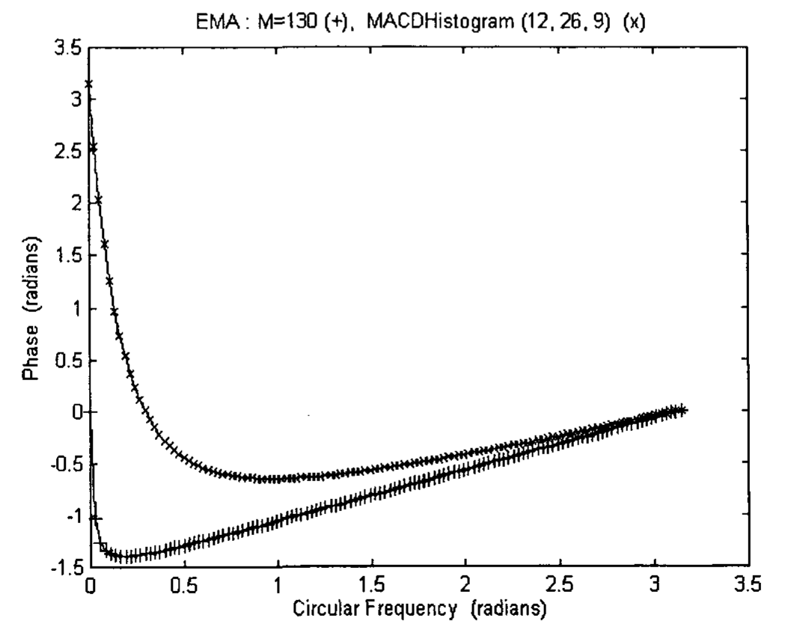

# Chapter 11

## Trading System

Many trading systems have been proposed by traders. However, their usefulness is seldom analyzed. In this chapter, we will discuss how we can analyze a trading system mathematically. Some trading systems use multiple timeframes. We will discuss the advantages and disadvantages. One trading system, the triple screen trading system, will be taken as an example.

## 11.1 Multiple Timeframes

Some traders recommend using several timeframes to analyze the market. A method of using triple screens has been suggested by Elder [1993, 2002]. In the first screen, a strategic decision to trade long or short is made using a trend-following indicator on a long-term chart. In the second screen, a tactical decision about entries and exits is formed using oscillators on an intermediate-term chart. (Oscillators measure the speed or slope of the trend. Examples of oscillators are momentum, velocity, etc.) In the third screen, methods for placing buy and sell orders are implemented on a short-term chart, or on the same intermediate-term chart. The method can consist of, e.g., using a breakout or pullback to enter trades.

An intermediate timeframe is any timeframe chosen by the trader. It can be a weekly chart, a daily chart, or a five-minute chart. The long-term chart is decided by multiplying the unit time interval of the intermediate chart by a certain factor, e.g., five. If the intermediate chart is daily, then the long-term chart is weekly. If the intermediate chart is five minutes, then the long-term chart can be half-hourly. Similarly, the short-term chart is decided by dividing the unit time interval of the intermediate chart by the same factor. For a daily intermediate chart, the short-term chart can be hourly. For a five-minute chart, the short-term chart is a one-minute chart. The factor chosen is not that critical. It can be a factor of four instead of five. Thus, if a trader's intermediate timeframe is a weekly chart, his long-term frame will be a monthly chart.

What does it mean by going from an intermediate timeframe to a long-term timeframe? Let's take the factor of five. It simply means taking every fifth point of the data points in the intermediate time frame to form the data points in the long-term frame. Mathematically, it is called downsampling five [Mak 2003]. An original signal of frequency $\pi/10$ radian will become a signal of $\pi/2$ radian in the long-term frame. A signal of $\pi/50$ radian will become a signal of $\pi/10$ radian. You can imagine the frequencies in the frequency response plot of the market price signal in the intermediate timeframe to stretch by a factor of five to form the frequencies in the frequency response plot in the long-term frame. Does a long-term frame help in analyzing the market? We will find out in the following section.

### 11.1.1 Long-Term Timeframe

#### 11.1.1.1 Advantages

It is common for traders to apply a trending indicator, e.g., an exponential moving average (EMA) on the data. As said earlier, a trending indicator is a low pass filter. Compared to an exponential moving average of a certain length applied to the data in an intermediate time-chart, downsampling the data to a long-term time chart and applying the same exponential moving average would mean pushing more signals of high frequencies out of the original signal in the intermediate time frame. Signals of low frequencies will be more emphasized. This effectively means increasing the length of the exponential moving average in the intermediate time chart, thus narrowing the bandwidth of the low pass filter. However, there is an advantage of downsampling to a long-term chart as compared to increasing the length of an EMA in an intermediate chart. There is less phase lag.

Mathematically, we would not be able to calculate the frequency response of an indicator on downsampled signal. However, we can calculate the frequency response of a skipped convolution of an indicator, which should provide some insight to an indicator on downsampled signal.

Fig 11.1(a) plots the amplitude response of an exponential moving average of length 130, and the amplitude response of a skipped 5 convolution of an exponential moving average of length 26. It can be seen that their amplitudes are approximately the same for $\omega < 0.5$. That means, for $\omega < 0.5$, the two EMA's have similar smoothing capability. It can actually be shown that, for $\omega$ close to 0, a skipped $D$ convolution of an exponential moving average of length $M$ has similar smoothing capability to an exponential moving average of length approximately equal to $DM$, where $D$ is the skip parameter.

**Fig 11.1(a)** The amplitudes of the Fourier Transform of an exponential moving average of length 130 (plotted as +) and a skipped 5 convolution of an exponential moving average of length 26 (plotted as x) are plotted versus the circular frequency $\omega$.

Fig 11.1(b) plots the phase response of an exponential moving average of length 130, and the phase response of a skipped 5 convolution of an exponential moving average of length 26. It can be seen that, except in the high frequency range, the skipped convolution has much less phase lag. This implies that the EMA of a downsampled signal has less phase lag than the phase of an EMA of similar smoothing capability in the original signal.

**Fig 11.1(b)** The phase of the Fourier Transform of an exponential moving average of length 130 (plotted as +) and a skipped 5 convolution of an exponential moving average of length 26 (plotted as x) are plotted versus the circular frequency $\omega$.

Thus, analyzing market data in a long-term timeframe does have an advantage. The trending indicator would have less phase lag compared to the same trending indicator with similar smoothing capacity in an intermediate timeframe.

The long-term frame has also an obvious advantage that the trader has less data to handle and visualize. He can see the forest instead of the trees. However, it does have its disadvantages.

#### 11.1.1.2 Disadvantages

(1) While trending indicators, e.g., the EMA, provides less phase lag in downsampled signal than the original signal, oscillator indicators, e.g., the momentum indicator and velocity indicators provide more phase lag. We will illustrate this with an example in the frequency domain. Fig 11.2(a) shows the amplitude of the frequency response of the cubic velocity indicator as well as the skipped 5 convolution of the cubic velocity indicator. Fig 11.2(b) shows the phase of the frequency response of the cubic velocity indicator as well as the skipped 5 convolution of the cubic velocity indicator. From Fig 11.2(b), it can be implied that except for frequency near $\pi$, cubic velocity on downsampled signal has a larger phase lag than the cubic velocity on the original signal.

**Fig 11.2(a)** The amplitudes of the Fourier Transform of the cubic velocity indicator (plotted as +) and the skipped 5 convolution of the cubic velocity indicator (plotted as x) are plotted versus the circular frequency $\omega$.

**Fig 11.2(b)** The phases of the Fourier Transform of the cubic velocity indicator (plotted as +) and the skipped 5 convolution of the cubic velocity indicator (plotted as x) are plotted versus the circular frequency $\omega$.

We will also take a look at an example in the time domain. Fig 11.3(a) shows an original price signal having a frequency of $\pi/16$ radian (denoted by .) and the down 4 price signal which has a frequency of $\pi/4$ (denoted by o). The 2-bar momentum indicator (which is the same as the 2-point moving difference) applied to the original signal has a phase lag of $\pi/32$ (= $\pi/16 \times \frac{1}{2}$) radian from the ideal phase lead of $\pi/2$ [Mak 2003]. The output is shown in Fig 11.3(b). The unit impulse response of the momentum indicator is defined here as (1, -1). As it takes two points to calculate the momentum, the very first point (which is arbitrarily set to zero) in Fig 11.3(b) should be ignored. Fig 11.3(c) shows the down 4 momentum signal. It can be seen that the phase difference between the downsampled momentum and the downsampled price (in Fig 11.3(a)) is preserved. However, if the price signal is downsampled first (thus becoming a signal of frequency of $\pi/4$), and then the momentum indicator is applied to the downsampled price, the output would have a phase lag of $\pi/8$ (= $\pi/4 \times \frac{1}{2}$) radian from the ideal phase lead of $\pi/2$, when compared to the downsampled price signal.

![Fig 11.3 (a) shows an original price signal having a frequency of $\pi/16$ radian (plotted as .) and the down 4 price signal which has a frequency of $\pi/4$ (plotted as o). (b) shows the 2-bar momentum indicator applied to the original signal. It has a phase lag of $\pi/32$ (= $\pi/16 \times \frac{1}{2}$) radian from the ideal phase lead of $\pi/2$ [Mak 2003]. (c) shows the down 4 momentum signal.](assets/ch-11-fig-11-3.png)
**Fig 11.3** (a) shows an original price signal having a frequency of $\pi/16$ radian (plotted as .) and the down 4 price signal which has a frequency of $\pi/4$ (plotted as o). (b) shows the 2-bar momentum indicator applied to the original signal. It has a phase lag of $\pi/32$ (= $\pi/16 \times \frac{1}{2}$) radian from the ideal phase lead of $\pi/2$ [Mak 2003]. (c) shows the down 4 momentum signal.

Fig 11.4(a) shows the original price data. Fig 11.4(b) shows the down 4 price data. The momentum indicator is applied to the down 4 price data, and plotted in Fig 11.4(c). Again, as it takes two points to calculate the momentum, the very first point (which is arbitrarily set to zero) in Fig 11.4(c) should be ignored. It can be seen that the phase lag of the momentum from the downed price data is much larger in Fig 11.4(c) than that shown in Fig 11.3(c). This is simply caused by the fact that the phase lag of momentum of signal of frequency $\pi/4$ is much larger than that of signal of frequency $\pi/16$. Thus, it can make quite some difference whether the indicator is applied in the long-term time-frame or the indicator is applied in the original time-frame and the output is then downsampled to the long-term time-frame. In other words, the indicator operation and downsampling is not commutative.

**Fig 11.4** (a) shows the original price data having a frequency of $\pi/16$ radian. (b) shows the down 4 price data. (c) shows the momentum indicator applied to the down 4 price data.

(2) The data in the long-term frame contain aliases, which is a mixture of frequencies from the original signal in the intermediate frame. For example, after downsampling 5, the signal of the $\pi/2$ frequency in the altered signal can contain a mixture of signals of frequencies

$$\pi/10, \quad \pi/10 + 2\pi/5, \quad \pi/10 + 4\pi/5, \quad \pi/10 + 6\pi/5, \quad \pi/10 + 8\pi/5$$

from the original signal [Mak 2003].

EMA of the signal of the $\pi/2$ frequency in the long-term frame can thus contain EMA's of the mixture of signals of the above frequencies from the intermediate timeframe.

(3) The EMA's of the mixtures of signals contain different amplitudes and phase lags or leads. Fig 11.5 plots the amplitude and phase of EMA3 (EMA of length 3) and EMA6 (EMA of length 6) from 0 to $5\pi$. It can be noted that while the amplitude falls between 0 to $\pi$, it rises between $\pi$ to $2\pi$. Also, while there is a phase lag between 0 to $\pi$, there is a phase lead between $\pi$ to $2\pi$.

**Fig 11.5** The top figure plots the amplitudes of the Fourier Transform of the exponential moving average of length 3 (plotted as +) and length 6 (plotted as x) versus the circular frequency $\omega$ from 0 to $5\pi$. The bottom figure plots the phases.

Fig 11.6 plots a market price simulated by a pure sine wave of frequency $\pi/4$. Downsampling 5 would yield a signal of frequency $5\pi/4$. The EMA of length 3 of this signal is plotted in the figure (denoted as +) in the format of skipped convolution. This would represent how the EMA of the signal would look like in the long-term chart, but in a more detailed fashion [Mak 2003]. An EMA of length 13 (EMA13), which should yield similar smoothness of the original signal is also plotted (denoted as x) for comparison. In consistent with Fig 11.5, the EMA3 of signal of frequency $5\pi/4$ has an amplitude larger than the EMA13 of the original signal, and a phase lead compared to the original signal.

**Fig 11.6** plots a market price simulated by a pure sine wave of frequency $\pi/4$ (plotted as . and joined by a line). Downsampling 5 would yield a signal of frequency $5\pi/4$. The EMA of length 3 (EMA3) of this signal is plotted (as +) in the format of skipped convolution. An EMA of length 13 (EMA13) is also plotted (as x) for comparison.

Thus, reducing the data from a timeframe to a timeframe with a longer term would have several disadvantages. Fortunately, with respect to the second and third disadvantages, the situation is not so bad, as higher frequencies (smaller cycle period) in market data has proportionately smaller amplitudes than the amplitudes in lower frequencies (longer cycle period). This amplitude variation has been pointed out by Ehlers [1992]. The amplitude of a market cycle has been observed empirically to be in proportion to the selected time scale. Thus, if the time and price scales were removed from the daily and weekly bar charts for the same commodity, one would not be able to tell which one is weekly, and which one is daily. This observation is consistent with the findings by Mantegna and Stanley [1995], who discovered that the successive variations of the S&P 500 index, $Z$, scaled with respect to the time interval, $\Delta t$. Scaling behavior was observed for time intervals spanning three orders of magnitude, from 1 minute to 1000 minutes. The probability distribution for the scaled variable, $Z/(\Delta t)^{0.712}$ is approximately the same for all these time intervals.

## 11.2 Multiple Screen Trading System

As mentioned earlier, a triple screen trading system has been suggested by Elder [1993, 2002]. We can look at the system in the following perspective. The first screen would preferably represent a low frequency that portraits the market trend. The second screen would represent a middle frequency that offers buying or selling opportunities. The third screen would represent a high frequency that triggers a buy or sell order. As the first two screens are used for decision making, and the third screen is used for placing orders, we will only consider the first two screens below.

The first screen is a long-term chart, which is taken to be weekly by Elder. A trend-following indicator should be applied to the data in the long-term chart, and a strategic decision should be made whether to trade long or short, or to stand aside. The original version of the Triple Screen Trading System employed the slope of the weekly MACD-Histogram as its weekly trend-following indicator [Elder 1993]. This, of course, is not correct. MACD-Histogram, as discussed earlier, is not a low-pass trending indicator, but a band-pass indicator. This indicator was eventually found to be very sensitive, yielding many buy and sell signals. It was then replaced by the slope of a weekly exponential moving average, which is used as the main trend-following indicator on long-term charts [Elder 2002]. When the weekly EMA rises, it identifies a bull move, and the trader should go long. When it falls, it indicates a bear move, and the trader should go short. As EMA is a trending indicator, it suits well for the first screen.

The second screen is an intermediate-term chart, which is taken to be daily by Elder. It was suggested that oscillators should be used to look for trading opportunities in the direction of the long-term trend. When the weekly trend is up, the trader should wait for the daily oscillators to fall, suggesting buy signals. When the weekly trend is down, the trader should look for daily oscillators to rise, giving sell signals. One of the choices of oscillators is the MACD-Histogram [Elder 2003]. This is not exactly correct. MACD-Histogram is not an oscillator, which is a high-pass filter. As we will show later, the slope of the MACD-Histogram should be used. The MACD-Histogram, acting as a band-pass filter, retains the middle frequency. The slope of the middle frequency would signify buying or selling opportunities. As a matter of fact, even though Elder [2002] plotted MACD-Histogram in his second screen, he was using the turning points of the MACD-Histogram to indicate trading opportunities. This is thus consistent with what we are suggesting here.

When the trend in the first screen is up, the trader should wait for the indicator in the second screen to go from negative to positive before executing a buy order. He can take profit when the indicator in the second screen goes from positive to negative. However, he should not sell short at this point.

When the trend in the first screen is down, the trader should wait for the indicator in the second screen to go from positive to negative before executing a sell order. He can take profit when the indicator in the second screen goes from negative to positive. However, he should not go long at this point.

We will devise here a trading plan, which is a slight modification of what is suggested by Elder [2002]:

(1) In the first screen, instead of the EMA of length 26 (used by Elder) applied to the market price in the long-term timeframe, we will use an EMA of length 130 in an intermediate timeframe. As discussed earlier, an EMA of length 130 has similar smoothness capability as an EMA of length 26 in a down 5 long-term timeframe. However, operating in the intermediate timeframe would eliminate some of the disadvantages of the long-term timeframe. A convolution of a velocity indicator is constructed on the EMA of length 130 and is plotted. If the velocity is positive, the trader will consider going long. If the velocity is negative, then the trader will consider going short. The cubic velocity indicator introduced by Mak [2003] is used here as it can easily tell whether the slope that it represents is positive or negative. It saves the effort of eyeballing the slope of the EMA, which is what Elder [2002] does.

(2) In the second screen, an intermediate-term timeframe would be used as suggested by Elder [2002]. However, instead of the MACD-Histogram used by Elder [2002], we will be using the cubic velocity of the MACD-Histogram. This would serve as an oscillator. The default values of the MACD-Histogram used by traders (12, 26 and 9) will be used. When the velocity in the first screen is positive, the trader would buy when the oscillator in the second screen goes from negative to positive. He will take profit when the velocity in the second screen becomes negative. When the velocity in the first screen is negative, the trader would sell when the oscillator in the second screen goes from positive to negative. He will take profit when the velocity in the second screen becomes positive.

Fig 11.7(a) plots the amplitude responses of the EMA of length 130 and the MACD-Histogram. Fig 11.7(b) plots the phase responses of the EMA of length 130 and the MACD-Histogram. It can be seen from Fig 11.7(a) that the EMA of length 130 retains the low frequency of the signal and eliminates other frequencies, especially the high frequency, while the MACD-Histogram retains the middle frequency and attempts to eliminate the low frequency and the high frequency.

**Fig 11.7(a)** The amplitudes of the Fourier Transform of the EMA of length 130 (plotted as +) and the MACD-Histogram (plotted as x) are plotted versus circular frequency $\omega$.

**Fig 11.7(b)** The phases of the Fourier Transform of the EMA of length 130 (plotted as +) and the MACD-Histogram (plotted as x) are plotted versus circular frequency $\omega$.

### 11.2.1 Examples of a Trading System

Theoretical waveforms with a low, middle and high frequencies will be used as examples here. Ideally, the EMA applied in the first screen will eliminate the middle and high frequencies and retain only the low frequency, and the MACD-Histogram applied in the second screen will eliminate the low and high frequencies and retain only the middle frequency.

(1) A price signal, $p$, of three frequencies is constructed as follows:

$$p = 4\sin(\pi n/100) + \sin(\pi n/20) + 0.1\sin(\pi n/4)$$

where $n$ is a positive integer.

This price signal is plotted in Fig 11.8(a). An exponential moving average (EMA) of length 130 (denoted by +) is applied to the price signal. A cubic velocity indicator is applied to the EMA and plotted in Fig 11.8(b), which forms the first screen. An MACD-Histogram of values 12, 26 and 9 is applied to the original price signal. The cubic velocity of the MACD-Histogram is then calculated and is plotted in Fig 11.8(c), which forms the second screen.

**Fig 11.8** (a) The price signal is plotted as a line. An EMA of length 130 (denoted by +) is applied to the price signal. (b) A cubic velocity indicator is applied to the EMA in (a). This forms the first screen. (c) The cubic velocity of the MACD-Histogram is plotted. This forms the second screen.

Ideally, the first screen should present a signal of the low frequency $\pi/100$, and the second screen should display a signal of the middle frequency $\pi/20$. This would provide traders with clear-cut buy and sell signals. In reality, as trending and oscillator indicators are never perfect, we would see a mixture of the two signals in both screens. Hopefully, the first screen would contain mostly the low frequency, and the second screen would contain mostly the middle frequency.

At $n = 394$, the velocity in the first screen (Fig 11.8(b)) changes from negative to positive. The trader should wait for the velocity in the second screen (Fig 11.8(c)) to go from negative to positive, which happens at $n = 425$. The trader should then buy and hold until $n = 444$, when the velocity in the second screen becomes negative.

At $n = 494$, the velocity in the first screen (Fig 11.8(b)) changes from positive to negative. The trader should wait for the velocity in the second screen (Fig 11.8(c)) to go from positive to negative, which happens at $n = 525$. The trader should then sell and hold until $n = 544$, when the velocity in the second screen becomes positive.

(2) A price signal, $p$, of three frequencies is constructed as follows:

$$p = 4\sin(\pi n/50) + \sin(\pi n/10) + 0.1\sin(\pi n/2)$$

where $n$ is a positive integer.

This price signal is plotted in Fig 11.9(a). An exponential moving average (EMA) of length 130 (denoted by +) is applied to the price signal. A cubic velocity indicator is applied to the EMA and plotted in Fig 11.9(b), which forms the first screen. An MACD-Histogram of values 12, 26 and 9 is applied to the original price signal. The cubic velocity of the MACD-Histogram is then calculated and is plotted in Fig 11.9(c), which forms the second screen.

**Fig 11.9** (a) The price signal is plotted as a line. An EMA of length 130 (denoted by +) is applied to the price signal. (b) A cubic velocity indicator is applied to the EMA in (a). This forms the first screen. (c) The cubic velocity of the MACD-Histogram is plotted. This forms the second screen.

At $n = 349$, the velocity in the first screen (Fig 11.9(b)) changes from positive to negative. The trader should wait for the velocity in the second screen (Fig 11.9(c)) to go from positive to negative, which happens at $n = 366$. The trader should then sell and hold until $n = 375$, when the velocity in the second screen becomes positive.

At $n = 399$, the velocity in the first screen (Fig 11.9(b)) changes from negative to positive. The trader should wait for the velocity in the second screen (Fig 11.9(c)) to go from negative to positive, which happens at $n = 416$. The trader should then buy and hold until $n = 425$, when the velocity in the second screen becomes negative.

(3) The trading system, however, will not work for the above two examples if the amplitude of the high frequency signal is increased from 0.1 to 0.25.

Take, for example, a price signal, $p$, of three frequencies constructed as follows:

$$p = 4\sin(\pi n/50) + \sin(\pi n/10) + 0.25\sin(\pi n/2)$$

where $n$ is a positive integer.

This price signal is plotted in Fig 11.10(a). An exponential moving average (EMA) of length 130 (denoted by +) is applied to the price signal. A cubic velocity indicator is applied to the EMA and plotted in Fig 11.10(b), which forms the first screen. An MACD-Histogram of values 12, 26 and 9 is applied to the original price signal. The cubic velocity of the MACD-Histogram is then calculated and is plotted in Fig 11.10(c), which forms the second screen.

**Fig 11.10** (a) The price signal is plotted as a line. An EMA of length 130 (denoted by +) is applied to the price signal. (b) A cubic velocity indicator is applied to the EMA in (a). This forms the first screen. (c) The cubic velocity of the MACD-Histogram is plotted. This forms the second screen.

The first screen (Fig 11.10(b)) looks similar to but noisier than Fig 11.9(b). We can still easily tell when the market is trending up, and when it is trending down. However, in Fig 11.10(c), as MACD-Histogram does not eliminate high frequency signal well, the velocity of the MACD-Histogram, shown in this second screen (Fig 11.10(c)), is therefore, quite noisy. Thus, it is difficult to find buying and selling opportunities.

### 11.2.2 Triple Screen Trading System

In section 11.2.1, market price is modeled as a combination of a low frequency, a middle frequency, and a high frequency. The objective of the trading plan devised is to isolate the low frequency in the first screen and the middle frequency in the second screen. These two screens correspond to the first two screens of the Triple Screen suggested by Elder [1993, 2002]. The examples described in section 11.2.1 shows that the popular Triple Screen Trading System does make sense. However, its success would very much depend on the frequencies and amplitudes of the frequencies of the signal.

It is possible that the Triple Screen Trading System can be improved by using scaling function and wavelets. While the scaling function serves as a low pass filter, the wavelets can serve as band-pass filters [Mak 2003].

## 11.3 Test of a Trading System

As the frequencies (or periods) of a market price signal change quite often, there is only certain probabilities that a trading plan is profitable. A trader would not, of course, expect a trading plan to be profitable in all market conditions.

To test whether a trading plan is reasonable and profitable, the following steps should be performed:

(1) The frequency characteristics, i.e., the amplitude and phase, of the indicators applied to market data in the multiple screens should be studied.

(2) The trading plan should be applied to various theoretical waveforms of different frequencies and amplitudes to see what are its advantages and limitations.

(3) The trading plan should be applied to a large number of real market data to see whether it is profitable.

As any trading system would have only a limited probability of success in an ever-changing financial market, a trader should learn how to manage his money. We will deal with the money management issue in the next two chapters.
