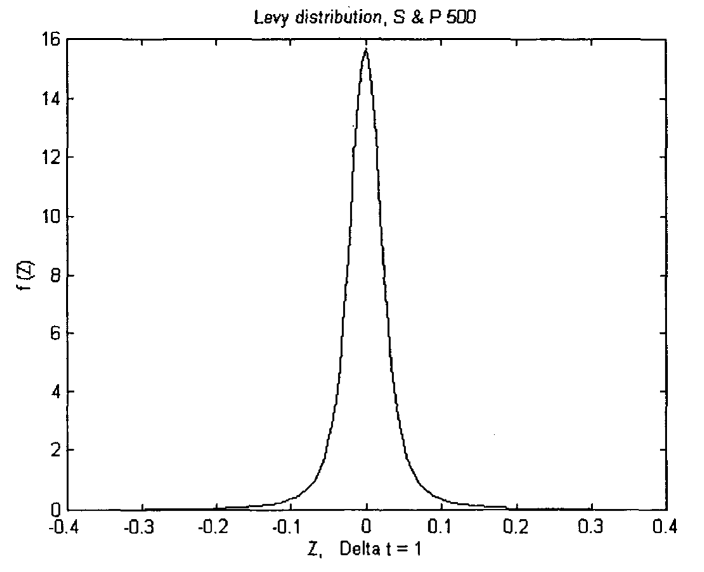
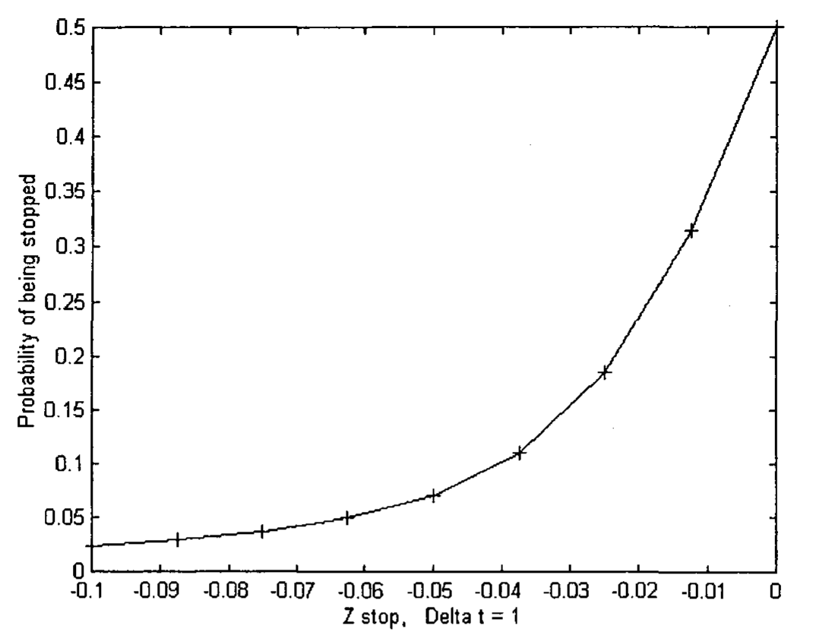
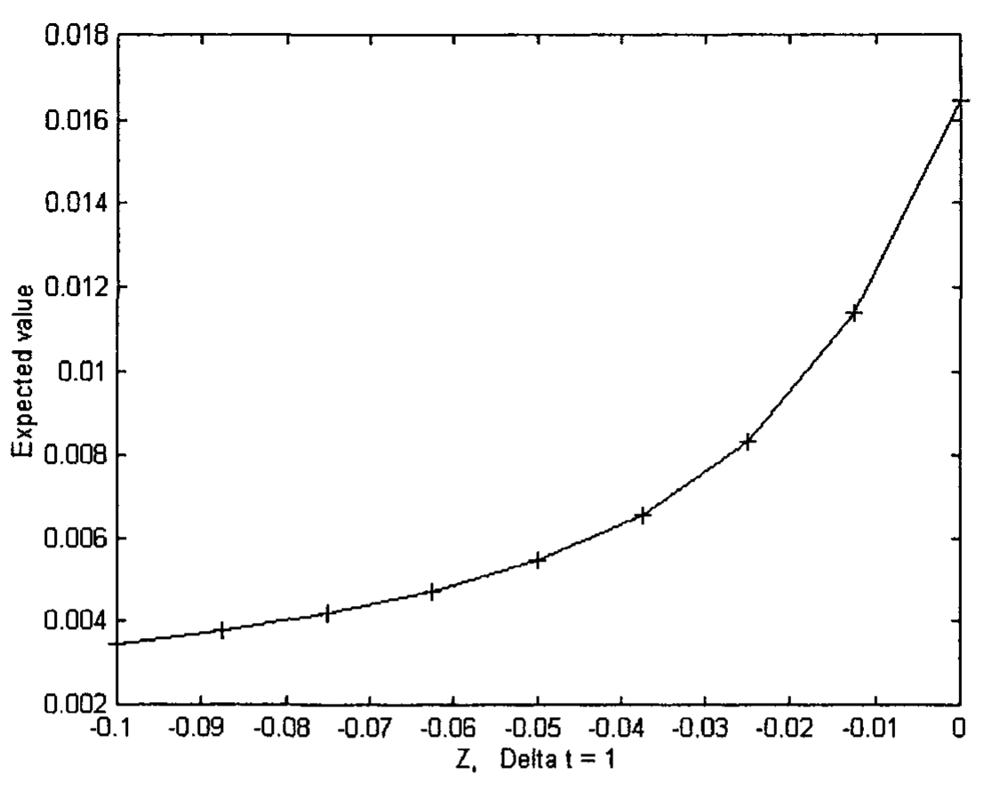

# Chapter 12: Money Management — Time Independent Case

Management is the act of handling direction or control of a task. Ideally, one should use the minimum resources - time, effort, and money - to achieve the maximum success. The act of managing money - money management, is how one should utilize his money to attain the maximum reward.

In the financial market, a trader should realize that the task that he is performing has only a certain probability of success, and, as such, he should not put all his eggs in one basket. Furthermore, he needs to realize that he may run into a string of losses in a row. He thus needs to arrange his finance such that he can survive those draw-downs. A professional trader would arrange to cut his loss in every single trade. He would put a stop-loss order at the same time he puts in a buy or sell order. He usually would limit his loss to two percent of his equity in a single trade.

If a trader knows the probability distribution of the variations of share prices, it would definitely help him with his money management planning. The variation of share price is quite often taken as a random process. While this may not necessarily be true, it can be taken as a good approximation for calculation purpose. As described in Mantegna and Stanley [2000], idealization and approximation are quite common in scientific investigations. For example, in Physics, frictionless motion has been employed to develop laws in dynamics, while, in the real world, frictionless motion rarely happens. Thus, while the financial market may not be a random process, we may be able to devise some useful results assuming that it is.

## 12.1 Probability Distribution of Price Variation

We will take a look at the probability distribution of the price variation of the market and how money management technique can be designed with that information. The S & P 500 index would be taken as an example. The statistical distribution of the S & P 500 index has been studied for a time-scale that ranges from 1 minute to 1000 minutes during a six-year period from January 1984 to December 1989 [Mantegna and Stanley 1995]. It has been found that, except for the most rare events, it is a stochastic process that is quite well described by a Levy stable symmetrical process. The Levy distribution is given by:

$$L(Z, \Delta t) \equiv \frac{1}{\pi} \int_0^{\infty} \exp(-\gamma \Delta t \, q^\alpha) \cos(qZ) \, dq \tag{12.1}$$

where

- $Z = y(t + \Delta t) - y(t)$ is the successive index variation
- $y(t)$ is the value of the S & P 500 index
- $\Delta t$ is taken to be 1 time unit
- $\alpha$ is an index determined empirically to be $1.40 \pm 0.05$
- $\gamma$ is a scale factor determined empirically as $0.00375$

The notation, $Z$, has a different meaning from the same notation denoted in Section 2.1.3. It is used here to conform to the notation of Mantegna and Stanley [1995, 2000]. The probability distribution $f(Z)$, which is given by Eq (12.1), is plotted in Fig 12.1. For $\Delta t$ equals to 1, the standard deviation, $\sigma$, is determined from the experimental data and is equal to 0.0508 [Mantegna and Stanley 1995]. The experimental data agrees well with the theoretical Levy profile up to $|Z|/\sigma < 6$ (i.e., $|Z| < 0.3$ approximately). For $|Z|/\sigma > 6$, the data falls off exponentially from the stable distribution. The fall-off can be more easily visualized in Mantegna and Stanley [1995] where $\log_{10} f(Z)$ is plotted versus $Z/\sigma$.

**Fig 12.1** Levy stable symmetrical distribution of the S & P 500 for time interval Delta t = 1 minute, alpha = 1.40 and gamma = 0.00375.

The S & P 500 data has been re-scaled for $\Delta t = 3$, 10, 32, 100, 316 and 1000 minutes under the transformations [Mantegna and Stanley 1995]

$$Z_m(\Delta t = 1) \equiv \frac{Z}{(\Delta t)^{1/\alpha}} \tag{12.2}$$

and

$$L_m(Z_m, \Delta t = 1) \equiv \frac{L(Z, \Delta t)}{(\Delta t)^{-1/\alpha}} \tag{12.3}$$

All the data collapse on the $\Delta t = 1$ minute distribution. Thus, it was concluded that a Levy distribution describes well the probability distribution of the S & P 500 index over time intervals spanning three orders of magnitude.

We have calculated the area under the curve $L(Z, \Delta t)$ for $\Delta t = 1$ (depicted in Fig 12.1) and obtained a result of 0.9996. We will consider the area equals to 1 for all calculations later. Thus, we will consider $L(Z, \Delta t) = f(Z)$ as a probability density function (pdf), as it satisfies the conditions [Freund 1992, Meyer 1966]:

(1) $f(Z) > 0$ for $-\infty < Z < \infty$ (12.4a)

(2) $\int_{-\infty}^{\infty} f(Z) \, dZ = 1$ (12.4b)

## 12.2 Probability of Being Stopped Out in a Trade

Given the probability density function $f(Z)$, we will be able to calculate the probability, $p$, that a trade will be stopped out if a trader sets his stop-loss value to be $Z_{\text{stop}}$. The probability, $p$, can be given by:

$$p = \int_{-\infty}^{s} f(Z) \, dZ \tag{12.5}$$

where $s = Z_{\text{stop}} < 0$

We assume that the trader is buying and therefore going long. As the theory for selling short is very similar, the mathematical formulation would not be repeated here. Table 12.1 lists the $Z_{\text{stop}}$'s and their $p$ values for $\Delta t = 1$. In the table, $A$ is the area below the Levy distribution enclosed by $Z_{\text{stop}}$ and $-Z_{\text{stop}}$ (which is positive). It represents the probability that the variation in $Z$ will lie within $Z_{\text{stop}}$ and $-Z_{\text{stop}}$. $p$ can then be calculated as $(1 - A)/2$. When $Z_{\text{stop}}$ is set at $-0.05$, which is approximately minus one standard deviation, $A$ is approximately equal to 0.86. This can be compared with a standard normal distribution where $A$ equals to 0.68 for one standard distribution. Thus, the Levy distribution is more advantageous to the trader than if the market had a normal distribution, as the probability of being stopped out is less. $p' = 1 - p$ is the probability that the trade will not be stopped out if the stop-loss value is set to $Z_{\text{stop}}$. $p$ is plotted versus $Z_{\text{stop}}$ in Fig 12.2. It can be noted that $p$ increases somewhat exponentially as $Z_{\text{stop}}$ approaches 0. The figure is significant as it shows the trader what kind of risk he would encounter. He needs to set his stop-loss such that his trade would not have a high probability of being stopped out.

| $Z_{\text{stop}}$ | $A$ | $p = (1-A)/2$ | $p' = 1 - p$ | $E(Z')$ |
|---|---|---|---|---|
| 0 | 0 | .5 | .5 | .0165 |
| -0.0125 | .3690 | .3155 | .6845 | .0114 |
| -0.025 | .6319 | .1841 | .8159 | .0083 |
| -0.0375 | .7805 | .1097 | .8903 | .0066 |
| -0.05 | .8584 | .0708 | .9292 | .0055 |
| -0.0625 | .9008 | .0496 | .9504 | .0047 |
| -0.075 | .9259 | .0371 | .9629 | .0042 |
| -0.0875 | .9419 | .0291 | .9709 | .0038 |
| -0.10 | .9528 | .0236 | .9764 | .0035 |

**Table 12.1** The probability of being stopped out of a trade, $p$, and the expected value of a trade, $E(Z')$ depends on the stop-loss value $Z_{\text{stop}}$. The calculation is performed for the S & P 500 index for time interval $\Delta t = 1$ minute. The index is assumed to be completely random.

**Fig 12.2** The probability of being stopped, p, at different Z_stop's. The calculation is performed for the S & P 500 index for time interval Delta t = 1 minute. The index is assumed to be completely random.

As $f(Z) = L(Z)$, it can be shown from Eq (12.5), (12.2) and (12.3) that

$$p(Z, \Delta t) = p_m(Z_m, \Delta t = 1) \tag{12.6}$$

Thus, a trader trading in a timeframe with time unit $\Delta t$ and setting his stoploss to $Z$, can find out the probability of his trade being stopped by using Eq (12.2) and then look it up in Table 12.1, where $Z_{\text{stop}} = Z_m$, and $p = p_m(Z_m, \Delta t = 1)$.

It should be noted that the data of Mantegna and Stanley [1995] employed here used closing prices of the market value, and did not consider high and low value during the time interval $\Delta t$. Thus, the actual probability of being stopped out should be higher. Furthermore, their data was taken from the market from January 1984 to December 1989. Traders who want to trade today's market need to check the current data and see whether any parameters have been changed from those listed in Eq (12.1).

## 12.3 Expected Value of a Trade

In probability theory, if $Z'$ is a continuous random variable with probability density function (pdf) $f$, the expected value of $Z'$ is defined as [Freund 1992, Meyer 1966]

$$E(Z') = \int_{-\infty}^{\infty} Z f(Z) \, dZ \tag{12.7}$$

where $Z$ is a possible value of $Z'$. $E(Z')$ is also referred to as the mean value of $Z'$. If $f(Z)$ is symmetrical with respect to $Z$, the mean value is equal to 0. Therefore, if a trader enters a trade, and does not put a stop-loss order, his expected return is 0. However, if he puts in a stop-loss order, his expected return is given as follows:

$$E(Z') = s \int_{-\infty}^{s} f(Z) \, dZ + \int_{s}^{\infty} Z f(Z) \, dZ \tag{12.8}$$

where $s = Z_{\text{stop}}$ is the stop-loss value and is negative.

Eq (12.8) simply means that the trader limits his loss to the stop-loss value, $s$. If $f(Z)$ is symmetrical with respect to $Z$, Eq (12.8) can be written as

$$E(Z') = \int_{-s}^{\infty} (Z + s) f(Z) \, dZ \tag{12.9}$$

As $Z$ in the right-hand-side of Eq (12.9) is greater than or equal to $-s$ (which is positive), the integrand inside the integral is greater than or equal to zero. Therefore, the expected value is always positive. It simply means that for a completely random market, the trader can make a profit in the long run if he puts stop-losses to his trades. Fig 12.3 plots the expected value of being stopped, $E(Z')$, at different $Z_{\text{stop}}$'s. The calculation is performed for the S & P 500 index for time interval $\Delta t = 1$ minute.

**Fig 12.3** The expected value of being stopped, E(Z'), at different Z_stop's. The calculation is performed for the S & P 500 index for time interval Delta t = 1 minute. The index is assumed to be completely random.

If $f(Z)$ is not symmetrical with respect to $Z$, Eq (12.8) can still be positive, depending upon how $f(Z)$ is distributed. As long as Eq (12.8) is positive, the trader would have a positive gain in the long run.

Some professional traders claim that even if the market were random, with good money management, the market is still profitable. The result derived here supports their claim.

The expected values, $E(Z')$, of the S & P 500 is listed in Table 12.1 as a function of stop-loss values. As the S & P 500 index is discrete, but we take an approximation in our equations that it is continuous, the actual expected values should be slightly less than those listed in the Table. The expected value is largest when the stop-loss value is set equal to zero. However, no trader in his right mind would set the stop-loss value to be zero, as it corresponds to the largest probability where the trade will be stopped out. Thus, he has to find a compromise somewhere - a stop-loss value where he can afford the risk even in a string of losses (draw-down) but still will give him a reasonable profit in the long run.

The expected value can be re-scaled under the transformation:

$$E_m(Z_m', \Delta t = 1) \equiv \frac{E(Z', \Delta t)}{(\Delta t)^{1/\alpha}} \tag{12.10}$$

Thus, to find the expected value at certain time unit, $\Delta t$, the $Z_{\text{stop}}$ and $E(Z')$ of each row in Table 12.1 should be multiplied by $(\Delta t)^{1/\alpha}$.

In this Chapter, we consider the trade being terminated in one time unit (e.g., 1 minute, 3 minutes, etc.). However, traders usually would hold the trade for much longer. What kind of gain or loss would he expect? We will consider this in the next Chapter. We will also show that, for the case of a trailing stop-loss, the scenario is consistent with the scenario described in this Chapter.
