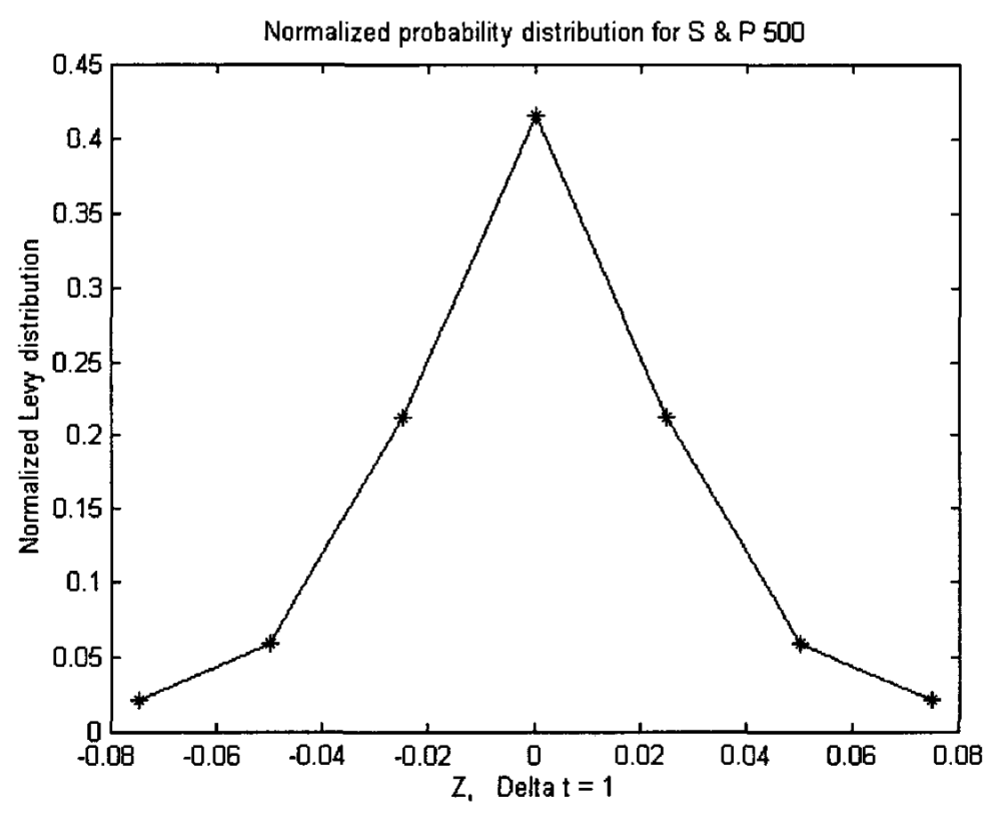
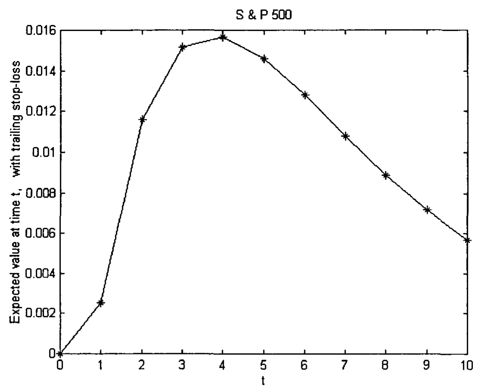
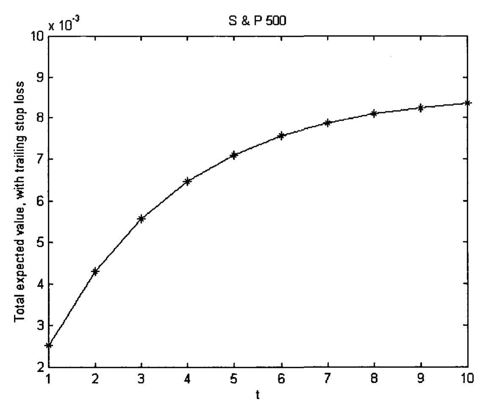
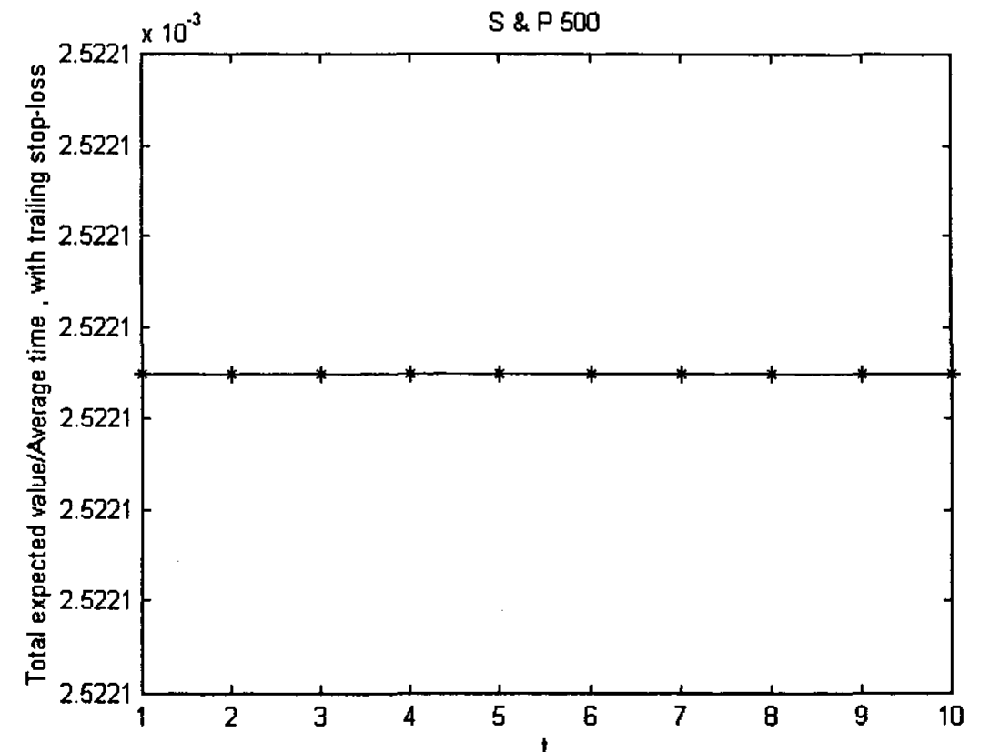
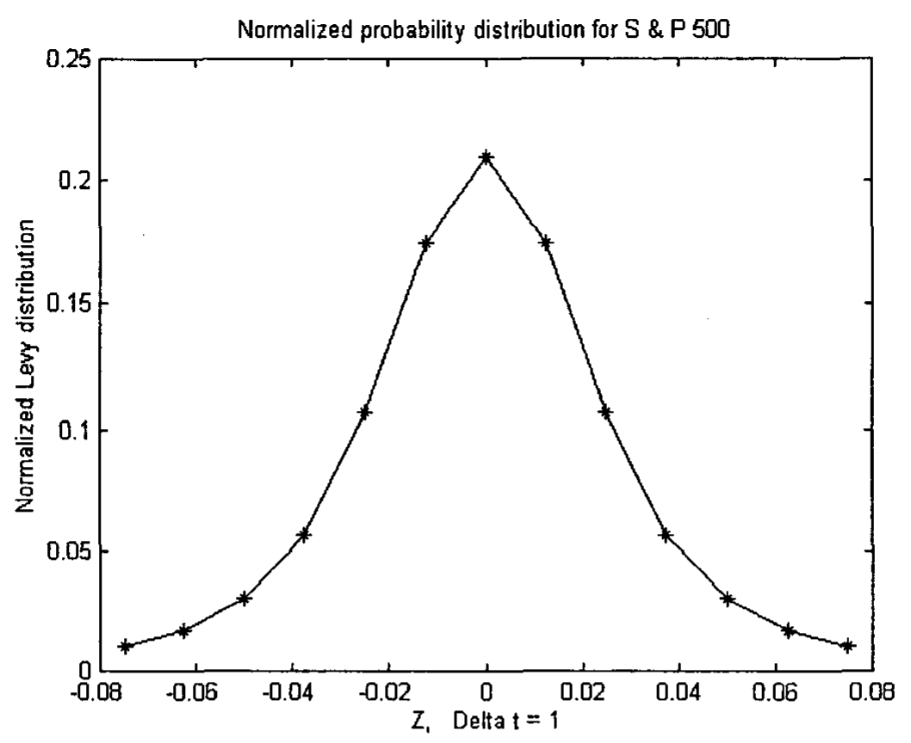
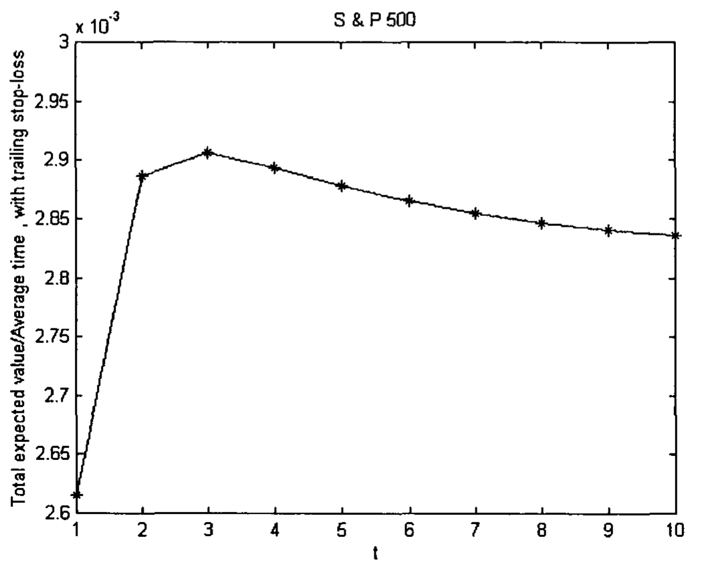
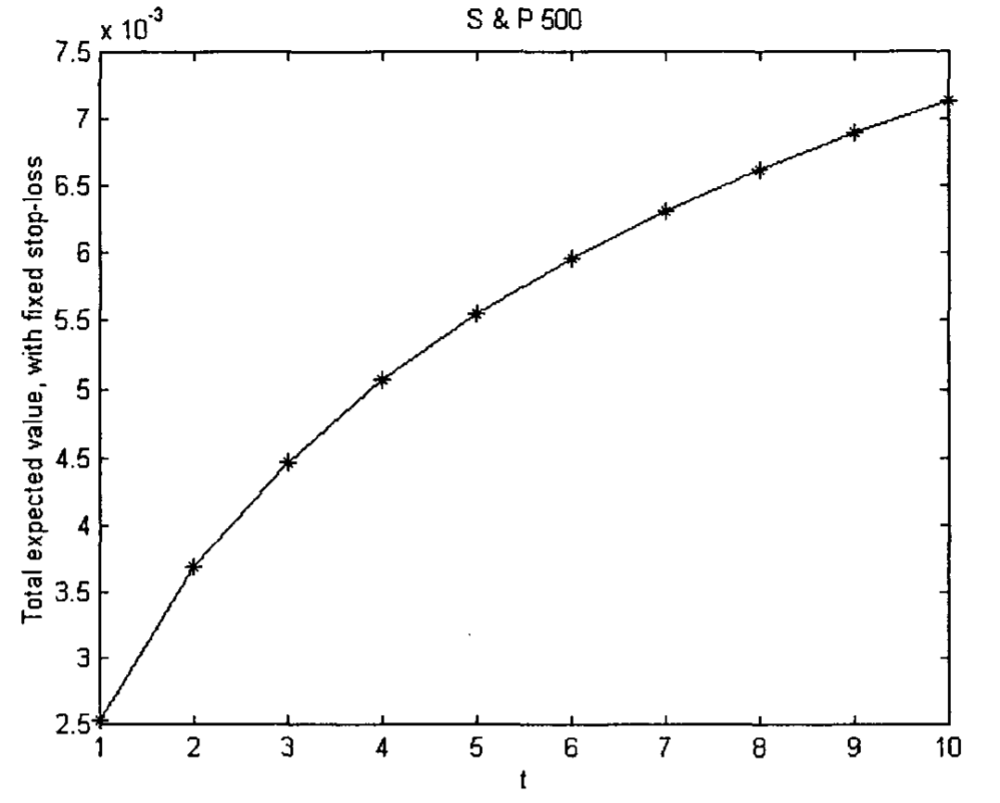
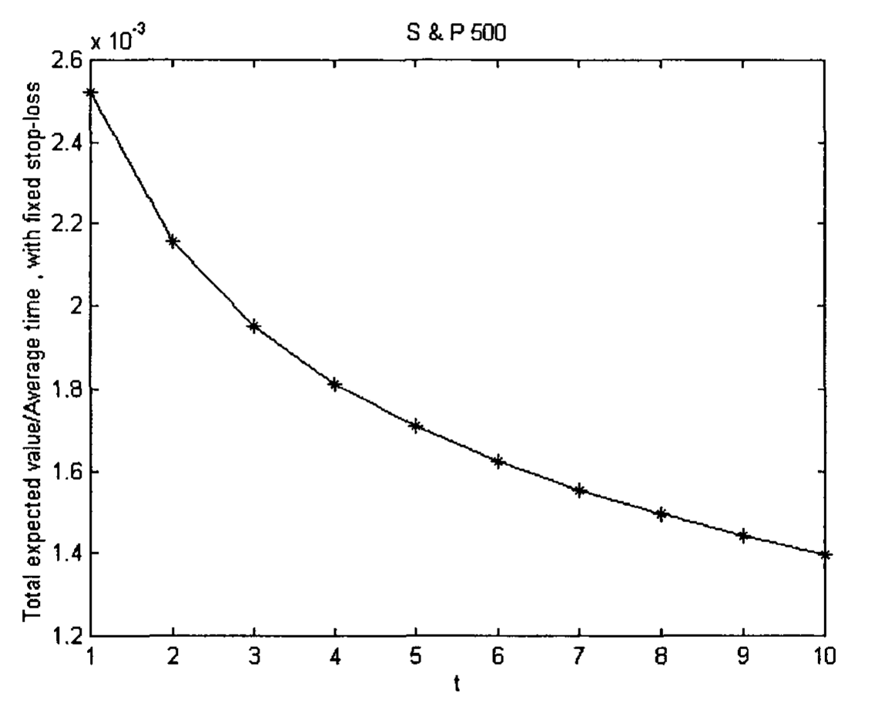

# Chapter 13 Money Management — Time Dependent Case

In the last chapter, we discuss the scenario of a trader entering a trade and holding it for one time unit. If he puts in a stop-loss order every time he puts in a trade, he would expect a positive return in the long run.

However, a trader usually holds his trade for more than one time unit to increase his gain, if any. If so, at what time units (e.g., number of days) should he get out, in order to maximize his profit? Would that depend on the value of the stop-loss order he puts in? We will attempt to answer these questions in this Chapter. But first, we will describe some of the probability theory that needs to be used later.

## 13.1 Basic Probability Theory

### 13.1.1 Experiment and the Sample Space

In discussing probability, an experiment is defined as a process that generates well-defined outcomes or sample points. One and only one of the outcomes will occur. The set of all possible outcomes of the experiment forms the sample space, $S$. For example, in tossing a coin, the sample space is {head, tail}. In rolling a dice, the sample space is {1, 2, 3, 4, 5, 6}. When a trader puts a stop-loss order in his trade, the possible outcomes in day one will form a sample space {trade stopped, trade not stopped}.

### 13.1.2 Events

With respect to a particular sample space, an event is a set of possible outcomes, or a collection of sample points. In the terminology of set theory, an event is a subset of a sample space. For example, in the rolling of a dice, if we describe an event as when an odd number occurs, the event would be {1, 3, 5}.

Events can be combined to form new events. If A and B are events, the union of A and B, $A \cup B$ is the event which occurs if and only if A or B or both occur. Thus, the union of A and B contains all sample points belonging to A or B or both.

The intersection of A and B, $A \cap B$ is the event which occurs if and only if both A and B occur. Thus, the intersection of A and B contains the sample points belonging to both A and B.

Two events, A and B, are defined to be mutually exclusive if they cannot occur together. The two events have no sample points in common. This can be expressed as $A \cap B = \emptyset$; i.e., the intersection of A and B is an empty set.

Furthermore, the following properties are defined for the probability of A, $P(A)$ [Meyer 1965]:

$$0 \leq P(A) \leq 1 \tag{13.1}$$

$$P(S) = 1 \tag{13.2}$$

If A and B are mutually exclusive events,

$$P(A \cup B) = P(A) + P(B) \tag{13.3}$$

If $A_1, A_2, \ldots A_n, \ldots$ are pair-wise mutually exclusive events, it follows from property (3) that

$$P\left(\bigcup_{i=1}^{\infty} A_i\right) = \sum_{i=1}^{\infty} P(A_i) \tag{13.4}$$

Eq (13.4) is sometimes called the Addition Law for mutually exclusive events [Anderson et al 2005].

### 13.1.3 Independent Events

The probability of an event is quite often influenced by whether a related event has already occurred. The conditional probability of event A, given that event B has occurred is denoted by $P(A|B)$, which is read as "the probability of A given B". $P(A|B)$ is defined as [Meyer 1965]:

$$P(A|B) = \frac{P(A \cap B)}{P(B)} \quad \text{provided that } P(B) > 0 \tag{13.5}$$

There are many situations that the occurrence of event A has no bearing to whether event B has occurred. That is, events A and B are totally unrelated. The independence of two events A and B is defined as:

$$P(A \cap B) = P(A)P(B) \tag{13.6}$$

This definition is essentially equivalent to:

A and B are independent events if

$$P(A|B) = P(A) \tag{13.7a}$$

or

$$P(B|A) = P(B) \tag{13.7b}$$

Eq (13.6) is sometimes called the Multiplication Law for independent events [Anderson et al 2005]. Both the Addition Law for mutually exclusive events, Eq (13.4) and the Multiplication Law for independent events, Eq (13.6) will be used to calculate the probabilities of certain events in the financial market in the following sections.

## 13.2 Trailing Stop-Loss

A trailing stop-loss is a stop-loss where the trader moves the stop with respect to the increasing share price to protect his profit. The difference between the share price and the stop can be a constant or a function of the market price [Elder 1993, 2002] throughout the trade. We will only consider the difference being a constant here.

We will give an example. A trader buys at $t = 0$. The share price is arbitrarily set to $x = 0$. Any gain from then on is considered positive, and any loss negative. At $t = 1$, the trade can remain where it is, at $x = 0$, with a probability $p(x_0) = 1/2$, or increase to +1 with a probability $p(x_1) = 1/4$, or decrease to -1 with a probability $p(x_{-1}) = 1/4$ (Fig. 13.1(a)). If he puts a stop-loss order at $x = -1$, then he will be out of the market if the trade drops to -1 at $t = 1$. He will remain in the market only if the trade is at 0 or 1. If the trade is at $x = 1$, and he decides to put in a trailing stop-loss order, he would advance his stop-loss from $x = -1$ to $x = 0$. The trade will then go onto the next time unit, i.e., $t = 2$. At $t = 2$, the trade can again, remain at $x = 0$, with a probability of 1/2, or increase to 1 with a probability of 1/4, or decrease to -1 with a probability of 1/4 (Fig 13.1(b)). If the trade decreases to -1, he will be out of the market. If the trade was at $x = 1$ at $t = 1$, it can remain at $x = 1$ with a probability of 1/2, or increase to $x = 2$ with a probability of 1/4, or decrease to 0 with a probability of 1/4 (Fig 13.1(c)). If the trade decreases to 0, it will be stopped out. If it increases to 2, the trader can again move the stop-loss from $x = 0$ to $x = 1$. As long as he is not being stopped, he can go onto the next time unit (e.g., the next day). Every time the trade advances, he will move the stop-loss order up. This would, hopefully increases his profit. Eventually, at $t = k$, he decides to cash out. We will now work out what is the probability that this will happen, and what is his expected gain, or loss.

**Fig. 13.1** (a) Probability distribution of the share price at t = 1. The original share price purchased at t = 0 was x = 0. (b) and (c) Probability distribution of the share price at t = 2. For (b), the share price centers at 0 from t = 1. For (c), the share price centers at 1 from t = 1.

### 13.2.1 Probability and Expected Value

Let $S_i$ be the event that the trade will be stopped out of the market at $t = i$ and $S_i'$ will be the event that the trade will not be stopped. Let $C_k$ be the event that the trader decides to cash out the trade. Then the probability that the trade will not be stopped until the trader decides to cash out at $t = k$, will be given by:

$$P_c(t = k) = P(S_1' \cap S_2' \cap S_3' \cap \ldots \cap S_{k-1}' \cap C_k)$$

$$= P(S_1') P(S_2') P(S_3') \ldots P(S_{k-1}') P(C_k)$$

$$= P(S_1') P(S_2') P(S_3') \ldots P(S_{k-1}') \tag{13.8}$$

as $P(C_k) = 1$.

Thus the probability is the same as the probability that the trade has not been stopped at $t = k - 1$. In deriving Eq (13.8), the Multiplication Law for independent events, Eq (13.6), has been used, as the events are independent of each other.

Eq (13.8) can be written as

$$P_c(t=k) = \sum_{i_1=-n+1}^{m} p(x_{i_1}) \sum_{i_2=-n+1}^{m} p(x_{i_2}) R_{T_2,s} \ldots \sum_{i_{k-1}=-n+1}^{m} p(x_{i_{k-1}}) R_{T_{k-1},s} \tag{13.9}$$

where

$p(x_i)$ is the probability that the trade will take on a value $x_i$, $i = -m, \ldots -1, 0, 1, \ldots m$

$x_i = i \Delta d$, $\Delta d$ is the interval between two adjacent x's.

$x_i < 0$ for $i < 0$; $x_0 = 0$; $x_i > 0$ for $i > 0$

$x_{-n}$ ($= s < 0$) is the stop-loss value

The subscript $j$ in $i_j$ represents the $j$-th time unit, where $j = 1, 2, \ldots k-1$.

The lower bound of the summation sign is $-n+1$. This means that the sum starts from an $x_i$ value that has not been stopped. It sums all the values that are larger than the stop-loss value.

$T_j$ is one of the possible values that the trade has attained on the $j$-th time unit (e.g. the $j$-th day), and is given by

$$T_j = x_{i_1} + x_{i_2} + \ldots + x_{i_{j-1}} + x_{i_j} = (i_1 + i_2 + \ldots + i_{j-1} + i_j)\Delta d \tag{13.10}$$

$$R_{T_j,s} = \begin{cases} 1 & T_j > s \\ 0 & \text{otherwise} \end{cases} \tag{13.11}$$

$R$ is a step function and is usually denoted by $S$ [e.g., Butkov 1968]. It is denoted by $R$ here so as not to be confused with the stop-loss value $s$. When $T_j$ is larger than the original stop-loss value, $s$, $R$ equals to 1. Otherwise, $R$ equals to 0.

The expected value at $t = k$ is given by:

$$E_c(t=k) = \sum_{i_1=-n+1}^{m} p(x_{i_1}) \sum_{i_2=-n+1}^{m} p(x_{i_2}) R_{T_2,s} \ldots \sum_{i_{k-1}=-n+1}^{m} p(x_{i_{k-1}}) R_{T_{k-1},s}$$

$$\times \sum_{i_k=-m}^{m} p(x_{i_k}) [(1-D_r)s(1-D_t) + D_r(T_{k-1}+s)(1-D_t) + (1-D_s)sD_t + D_s T_k D_t] \tag{13.12}$$

where

$$D_r = R_{T_{k-1}+s,s} \tag{13.13a}$$

$$D_t = R_{T_k, T_{k-1}+s} \tag{13.13b}$$

$$D_s = R_{T_k, s} \tag{13.13c}$$

and

$$R_{a,b} = \begin{cases} 1 & a > b \\ 0 & \text{otherwise} \end{cases} \tag{13.14}$$

While $s$ represents the original stop-loss, $T_{k-1} + s$ represents the trailing stop-loss. $(1-D_r)$ is equal to 1 when the trailing stop-loss is less than or equal to the original stop-loss, or, simply, $T_{k-1}$ is less than or equal to 0; otherwise, $(1-D_r)$ is equal to 0. $(1-D_t)$ is equal to 1 when $T_k$ is less than or equal to the trailing stop-loss; otherwise, it is equal to 0. $(1-D_s)$ is equal to 1 when $T_k$ is less than or equal to the original stop-loss; otherwise, it is equal to 0.

Thus, the first two terms inside the square bracket of Eq (13.12) means that $T_k$ is less than or equal to the trailing stop-loss. However, the first term implies that the trade is stopped by the original stop-loss, and therefore takes on the value, $s$, while the second term implies that the trade is stopped by the trailing stop-loss, and therefore takes on the value of the trailing stop-loss. The third and fourth term inside the square bracket means that $T_k$ is larger than the trailing stop-loss. However, the third term implies that the trade is stopped by the original stop-loss, as $T_k$ is less than or equal to the stop-loss, and therefore takes on the stop-loss value, $s$. The fourth term implies that the trade is not stopped at all, but is cashed out by the trader, at whatever value, $T_k$, that the trade has attained.

Note that the last summation starts from $-m$, this means that for a trade that is being stopped, the sum adds up all the probability $p(x)$ for $x$ which is less than or equal to the stop-loss value, or the trailing stop-loss value.

As an example, we will choose the possible values of $x_i$ to be (-0.075, -0.05, -0.025, 0, 0.025, 0.05, 0.075) and calculate the normalized probabilities at those values for the S & P 500 at $\Delta t = 1$ minute using Eq (12.1). This probability distribution is shown in Fig. 13.2. The probabilities have been normalized such that their sum is equal to 1.

**Fig. 13.2** Example values of the normalized probabilities of the S & P 500 index at Δt = 1 minute, used for the calculation of the expected value of a trade. Here, Δd = 0.025.

**Fig. 13.3** Expected value of a trade at t minutes, provided that the trade has not been stopped out of the market before t. The trailing stop-loss value is set equal to -0.025 S & P 500 index point.

Choosing the stop-loss value to be equal to -0.025, the expected value $E_c$ is calculated and plotted versus time t, in Fig 13.3. It can be seen that $E_c$ goes through a local maximum. The implication is that once the trader decides on what the stop-loss value is, he should cash out at t where $E_c$ is maximum in order to gain maximum benefit. This, of course, assumes that the trade has not been stopped out before then.

### 13.2.2 Total Probability and Total Expected Value

In the last section, we discuss the probability and expected value of a trade at time $t = k$, assuming that the trade has not been stopped out before $t = k$. What is the probability and expected value if the trade has been stopped, either by the original stop-loss or the trailing stop-loss before then? And what are the total probability and the total expected value of all these events that can happen? We will attempt to answer these questions.

The total probability, $P_T$, that a trade may be stopped by the original stop-loss or the trailing stop-loss before $t = k$ or the trader decides to cash the trade out at $t = k$, is given by:

$$P_T = P[S_1 \cup (S_1' \cap S_2) \cup (S_1' \cap S_2' \cap S_3) \cup \ldots$$

$$\ldots \cup (S_1' \cap S_2' \cap S_3' \cap \ldots \cap S_{k-1})$$

$$\cup (S_1' \cap S_2' \cap S_3' \cap \ldots \cap S_{k-1}' \cap C_k)]$$

$$= P(S_1) + P(S_1' \cap S_2) + P(S_1' \cap S_2' \cap S_3) + \ldots$$

$$\ldots P(S_1' \cap S_2' \cap S_3' \cap \ldots \cap S_{k-1})$$

$$+ P(S_1' \cap S_2' \cap S_3' \cap \ldots \cap S_{k-1}' \cap C_k)$$

$$= P_s(t=1) + P_s(t=2) + P_s(t=3) + \ldots + P_s(t=k-1) + P_c(t=k) \tag{13.15}$$

$S_1$ means that the trade is being stopped at $t = 1$. $(S_1' \cap S_2)$ means that the trade is not stopped at $t = 1$, but is stopped at $t = 2$. $(S_1' \cap S_2' \cap S_3' \cap \ldots \cap S_{k-1}' \cap C_k)$ means that the trade is not stopped before $t = k$, but is cashed out by the trader at $t = k$. In deriving Eq (13.15), the Summation Law for mutually exclusive events, Eq (13.4), has been used.

The probability that the trade is being stopped at $t = j$, $P_s(t = j)$ is given by

$$P_s(t=j) = \sum_{i_1=-n+1}^{m} p(x_{i_1}) \sum_{i_2=-n+1}^{m} p(x_{i_2}) R_{T_2,s} \ldots \sum_{i_{j-1}=-n+1}^{m} p(x_{i_{j-1}}) R_{T_{j-1},s}$$

$$\times \sum_{i_j=-m}^{m} p(x_{i_j}) [(1-D_r)(1-D_t) + D_r(1-D_t) + (1-D_s)D_t] \tag{13.16}$$

where $j = 1, 2, \ldots k-1$.

It can be shown that, given

$$\sum_{i=-m}^{m} p(x_i) = 1 \tag{13.17}$$

$P_T$ is equal to 1.

This is simply because $P_T$ in Eq (13.15) is equivalent to:

$$P_T = \sum_{i_1=-m}^{m} p(x_{i_1}) \sum_{i_2=-m}^{m} p(x_{i_2}) \ldots \sum_{i_{k-1}=-m}^{m} p(x_{i_{k-1}}) \sum_{i_k=-m}^{m} p(x_{i_k}) \tag{13.18}$$

As each summation is equal to 1, $P_T$ is equal to 1.

The total expected value, $E_T$, that a trade may be stopped by the original stop-loss or the trailing stop-loss before $t = k$ or the trader decides to cash the trade out at $t = k$, is given by:

$$E_T = E[S_1 \cup (S_1' \cap S_2) \cup (S_1' \cap S_2' \cap S_3) \cup \ldots$$

$$\ldots \cup (S_1' \cap S_2' \cap S_3' \cap \ldots \cap S_{k-1})$$

$$\cup (S_1' \cap S_2' \cap S_3' \cap \ldots \cap S_{k-1}' \cap C_k)]$$

$$= E(S_1) + E(S_1' \cap S_2) + E(S_1' \cap S_2' \cap S_3) + \ldots$$

$$\ldots E(S_1' \cap S_2' \cap S_3' \cap \ldots \cap S_{k-1})$$

$$+ E(S_1' \cap S_2' \cap S_3' \cap \ldots \cap S_{k-1}' \cap C_k)$$

$$= E_s(t=1) + E_s(t=2) + E_s(t=3) + \ldots + E_s(t=k-1) + E_c(t=k) \tag{13.19}$$

The expected value when the trade is being stopped at $t = j$, $E_s(t = j)$ is given by:

$$E_s(t=j) = \sum_{i_1=-n+1}^{m} p(x_{i_1}) \sum_{i_2=-n+1}^{m} p(x_{i_2}) R_{T_2,s} \ldots \sum_{i_{j-1}=-n+1}^{m} p(x_{i_{j-1}}) R_{T_{j-1},s}$$

$$\times \sum_{i_j=-m}^{m} p(x_{i_j}) [(1-D_r)s(1-D_t) + D_r(T_{j-1}+s)(1-D_t) + (1-D_s)sD_t] \tag{13.20}$$

The total expected value, $E_T$, is plotted in Fig 13.4.

**Fig. 13.4** Total expected value of a trade at t minutes, when the trailing stop-loss value is set equal to -0.025 S & P 500 index point.

### 13.2.3 Average Time

As a trade can be stopped at $t = 1$, or $t = 2$, ..., or cashed out by the trader at $t = k$, the average time of a trade, $E_t$, can be described as the expected value of time that a trade is being stopped or cashed out, and is given by

$$E_t = P_s(t=1) \times 1 + P_s(t=2) \times 2 + P_s(t=3) \times 3 + \ldots + P_s(t=k-1) \times (k-1) + P_c(t=k) \times k \tag{13.21}$$

### 13.2.4 Total Expected Value/Average Time

The average profit per average time unit, $E_A$, is given by:

$$E_A = E_T / E_t \tag{13.22}$$

Taking $s = x_{-1}$, $E_A$ is found to be a constant with respect to t, whatever m is chosen to be ($2m+1$ is the number of possible discrete values of $x_i$, i.e, $x_{-m}, x_{-m+1}, \ldots, x_{m-1}, x_m$). Using the probability distribution depicted in Fig 13.2, $E_A$ is calculated and plotted versus t, showing that it is a constant. This finding is surprising and interesting, especially considering that the numerator and denominator in Eq (13.22) has different mathematical formulations. The constant value, 0.00252, in Fig. 13.5 is much less than the value of 0.0083 listed in Table 13.1, as only a few $x_i$'s are used in the calculation for illustration purpose (m is only taken to be 3 and $\Delta d$ is taken to be 0.025). 0.0083 is considered a more accurate representation for a stop-loss value of -0.025. Taking s to be less than $x_{-1}$, (e.g., $x_{-2}$), $E_A$ will approach a near constant after the first few time units. Using a probability distribution depicted in Fig 13.6, and $s = x_{-2}$, $E_A$ is calculated and plotted versus t in Fig 13.7. The initial lower value is caused by the trade being stopped by the original stop-loss. As t increases, most trades are stopped by the trailing stop-losses.

The implication of all these is that if the trader decides to stay in the market all the time (i.e., he will get back in the market as soon as he gets out), it does not matter which time unit (e.g., which day) he predetermines to cash out his trade. His profit would be the same. It can further be implied that he can leave his trade in the market, with a trailing stop-loss, and let the market stop him out. This, actually, is what a number of professional traders choose to do. This method has an advantage that if the market is not completely random, and is directional some of the time, the trader can rip the most benefit.

The above result can be compared with the result in the time-independent case. When a trader puts a trailing stop-loss to his trade, the difference between the market value and the stop-loss is always a constant. The result obtained, thus, should be, and is, consistent with that derived from the time-independent case.

The probability model employed here ignores commissions. Thus, the trade would be less profitable if the trader chooses to cash out his trade within the first few time units, providing he is not being stopped out before then.

A MATLAB program for calculating probabilities and expected value of a trade for the S & P 500 index using trailing stop-loss order is listed in Appendix 5. It can be modified to calculate other markets if the probability distribution of the other markets is used in the program.

**Fig. 13.5** Total expected value/Average time of a trade at t minutes. The trailing stop-loss value is set equal to -0.025 (= x₋₁) S & P 500 index point.

**Fig. 13.6** Example values of the normalized probabilities of the S & P 500 index at Δt = 1 minute, used for the calculation of the expected value of a trade. Here, Δd = 0.0125.

**Fig. 13.7** Total expected value/Average time of a trade at t minutes. The trailing stop-loss value is set equal to -0.025 (= x₋₂) S & P 500 index point.

As a comparison to the trailing stop-loss technique, we will calculate the probabilities and expected values of a trade using a fixed stop-loss order in the next section. It will be shown that the fixed stop-loss technique is less profitable than the trailing one.

## 13.3 Fixed Stop-Loss

The trader can choose to fix his stop-loss instead of letting it trailing, i.e., he leaves the stop-loss value not changed during the whole trade. This technique has the advantage that he does not have to watch the market at all. He can decide to cash out his trade at $t = k$, provided that the trade has not been stopped out before then. We will now work out what is the probability that this can happen, and what is his expected gain, or loss.

### 13.3.1 Probability and Expected Value

Let $S_i$ be the event that the trade will be stopped out of the market at $t = i$ and $S_i'$ will be the event that the trade will not be stopped. Let $C_k$ be the event that the trader decides to cash out the trade. Then the probability that the trade will not be stopped until the trader decides to cash out at $t = k$, will be given by:

$$P_c(t=k) = P(S_1' \cap S_2' \cap S_3' \cap \ldots \cap S_{k-1}' \cap C_k)$$

$$= P(S_1') P(S_2') P(S_3') \ldots P(S_{k-1}') P(C_k)$$

$$= P(S_1') P(S_2') P(S_3') \ldots P(S_{k-1}') \tag{13.23}$$

as $P(C_k) = 1$.

Thus the probability is the same as the probability that the trade has not been stopped at $t = k - 1$.

Eq (13.23) can be written as

$$P_c(t=k) = \sum_{i_1=-m}^{m} p(x_{i_1}) R_{T_1,s} \sum_{i_2=-m}^{m} p(x_{i_2}) R_{T_2,s} \ldots \sum_{i_{k-1}=-m}^{m} p(x_{i_{k-1}}) R_{T_{k-1},s} \tag{13.24}$$

where

$p(x_i)$ is the probability that the trade will take on a value $x_i$, $i = -m, \ldots -1, 0, 1, \ldots m$

$x_i = i \Delta d$, $\Delta d$ is the interval between two adjacent x's.

$x_i < 0$ for $i < 0$; $x_0 = 0$; $x_i > 0$ for $i > 0$

$x_{-n}$ ($= s < 0$) is the stop-loss value

The subscript $j$ in $i_j$ represents the $j$-th time unit, where $j = 1, \ldots k-1$.

$T_j$ is one of the possible values that the trade has attained on the $j$-th time unit (e.g. the $j$-th day), and is given by

$$T_j = x_{i_1} + x_{i_2} + \ldots + x_{i_{j-1}} + x_{i_j} = (i_1 + i_2 + \ldots + i_{j-1} + i_j)\Delta d \tag{13.25}$$

$$R_{T_j,s} = \begin{cases} 1 & T_j > s \\ 0 & \text{otherwise} \end{cases} \tag{13.26}$$

When $T_j$ is larger than the fixed stop-loss value, $s$, $R$ equals to 1. Otherwise, $R$ equals to 0.

The lower bound of the summation sign is $-m$, and the upper bound is $m$. However, the step function $R$, means that the sum starts from an $x_i$ value that has not been stopped. It sums all the values that are larger than the stop-loss value.

The expected value at $t = k$ is given by:

$$E_c(t=k) = \sum_{i_1=-m}^{m} p(x_{i_1}) R_{T_1,s} \sum_{i_2=-m}^{m} p(x_{i_2}) R_{T_2,s} \ldots \sum_{i_{k-1}=-m}^{m} p(x_{i_{k-1}}) R_{T_{k-1},s}$$

$$\times \sum_{i_k=-m}^{m} p(x_{i_k}) [s(1 - R_{T_k,s}) + T_k R_{T_k,s}] \tag{13.27}$$

The first term inside the square bracket means that the trade is being stopped by the fixed stop-loss value. The summation starts from $-m$, this means that for a trade that is being stopped, the sum adds up all the probability $p(x)$ for $x$ which is less than or equal to the fixed stop-loss value. The second term inside the square bracket means that the trader cashes out at whatever value the market has attained.

### 13.3.2 Total Probability and Total Expected Value

In the last section, we discuss the probability and expected value of a trade at time $t = k$, assuming that the trade has not been stopped out before $t = k$. What is the probability and expected value if the trade has been stopped by the fixed stop-loss before then? And what is the total probability and the total expected value of all these events that can happen?

The total probability, $P_T$, that a trade may be stopped by the fixed stop-loss before $t = k$ or the trader decides to cash the trade out at $t = k$, is given by:

$$P_T = P[S_1 \cup (S_1' \cap S_2) \cup (S_1' \cap S_2' \cap S_3) \cup \ldots$$

$$\ldots \cup (S_1' \cap S_2' \cap S_3' \cap \ldots \cap S_{k-1})$$

$$\cup (S_1' \cap S_2' \cap S_3' \cap \ldots \cap S_{k-1}' \cap C_k)]$$

$$= P(S_1) + P(S_1' \cap S_2) + P(S_1' \cap S_2' \cap S_3) + \ldots$$

$$\ldots P(S_1' \cap S_2' \cap S_3' \cap \ldots \cap S_{k-1})$$

$$+ P(S_1' \cap S_2' \cap S_3' \cap \ldots \cap S_{k-1}' \cap C_k)$$

$$= P_s(t=1) + P_s(t=2) + P_s(t=3) + \ldots + P_s(t=k-1) + P_c(t=k) \tag{13.28}$$

$S_1$ means that the trade is being stopped at $t = 1$. $(S_1' \cap S_2)$ means that the trade is not stopped at $t = 1$, but is stopped at $t = 2$. $(S_1' \cap S_2' \cap S_3' \cap \ldots \cap S_{k-1}' \cap C_k)$ means that the trade is not stopped before $t = k$, but is cashed out by the trader at $t = k$. In deriving Eq (13.28), the Summation Law for mutually exclusive events, Eq (13.4), has been used.

The probability that the trade is being stopped at $t = j$, $P_s(t = j)$ is given by

$$P_s(t=j) = \sum_{i_1=-m}^{m} p(x_{i_1}) R_{T_1,s} \sum_{i_2=-m}^{m} p(x_{i_2}) R_{T_2,s} \ldots \sum_{i_{j-1}=-m}^{m} p(x_{i_{j-1}}) R_{T_{j-1},s}$$

$$\times \sum_{i_j=-m}^{m} p(x_{i_j}) (1 - R_{T_j,s}) \tag{13.29}$$

It can be shown that, given

$$\sum_{i=-m}^{m} p(x_i) = 1 \tag{13.30}$$

$P_T$ is equal to 1.

This is simply because $P_T$ is equivalent to:

$$P_T = \sum_{i_1=-m}^{m} p(x_{i_1}) \sum_{i_2=-m}^{m} p(x_{i_2}) \ldots \sum_{i_{k-1}=-m}^{m} p(x_{i_{k-1}}) \sum_{i_k=-m}^{m} p(x_{i_k}) \tag{13.31}$$

As each summation is equal to 1, $P_T$ is equal to 1.

The total expected value, $E_T$, that a trade may be stopped by the fixed stop-loss before $t = k$ or the trader decides to cash the trade out at $t = k$, is given by:

$$E_T = E[S_1 \cup (S_1' \cap S_2) \cup (S_1' \cap S_2' \cap S_3) \cup \ldots$$

$$\ldots \cup (S_1' \cap S_2' \cap S_3' \cap \ldots \cap S_{k-1})$$

$$\cup (S_1' \cap S_2' \cap S_3' \cap \ldots \cap S_{k-1}' \cap C_k)]$$

$$= E(S_1) + E(S_1' \cap S_2) + E(S_1' \cap S_2' \cap S_3) + \ldots$$

$$\ldots E(S_1' \cap S_2' \cap S_3' \cap \ldots \cap S_{k-1})$$

$$+ E(S_1' \cap S_2' \cap S_3' \cap \ldots \cap S_{k-1}' \cap C_k)$$

$$= E_s(t=1) + E_s(t=2) + E_s(t=3) + \ldots + E_s(t=k-1) + E_c(t=k) \tag{13.32}$$

The expected value when the trade is being stopped at $t = j$, $E_s(t = j)$ is given by:

$$E_s(t=j) = \sum_{i_1=-m}^{m} p(x_{i_1}) R_{T_1,s} \sum_{i_2=-m}^{m} p(x_{i_2}) R_{T_2,s} \ldots \sum_{i_{j-1}=-m}^{m} p(x_{i_{j-1}}) R_{T_{j-1},s}$$

$$\times \sum_{i_j=-m}^{m} p(x_{i_j}) \cdot s(1 - R_{T_j,s}) \tag{13.33}$$

Using the probability distribution shown in Fig. 13.2 and choosing the fixed stop-loss value to be equal to -0.025, the total expected value, $E_T$, is plotted in Fig 13.8. Comparing the result with that plotted in Fig 13.4, it shows that a trade with a trailing stop-loss is more profitable than one with a fixed stop-loss.

**Fig. 13.8** Total expected value of a trade at t minutes, when the fixed stop-loss value is set equal to -0.025 S & P 500 index point. This figure should be compared with Fig 13.4, where trailing stop-loss is used.

### 13.3.3 Average Time

As a trade can be stopped at $t = 1$, or $t = 2$, ..., or cashed out by the trader at $t = k$, the average time of a trade, $E_t$, can be described as the expected value of time that a trade is being stopped or cashed out, and is given by

$$E_t = P_s(t=1) \times 1 + P_s(t=2) \times 2 + P_s(t=3) \times 3 + \ldots + P_s(t=k-1) \times (k-1) + P_c(t=k) \times k \tag{13.34}$$

### 13.3.4 Total Expected Value/Average Time

The average profit per average time unit, $E_A$, is given by:

$$E_A = E_T / E_t \tag{13.35}$$

Using the probability distribution depicted in Fig 13.2, and taking $s = x_{-1}$, $E_A$ is calculated and plotted versus t in Fig 13.9. It shows that $E_A$ decreases from 0.00252 at $t = 1$ somewhat exponentially with respect to t. Thus, comparing Fig 13.9 with Fig 13.5, setting a trailing stop-loss is much more profitable than setting a fixed stop-loss for a trade. It is, therefore, no wonder, that the fixed stop-loss is not a money management technique preferred by traders.

A MATLAB program for calculating probabilities and expected value of a trade for the S & P 500 index using fixed stop-loss order is listed in Appendix 5. It can be modified to calculate other markets if the probability distribution of the other markets is used in the program.

**Fig. 13.9** Total expected value/Average time of a trade at t minutes. The fixed stop-loss value is set equal to -0.025 S & P 500 index point. This figure should be compared with Fig 13.5, where a trailing stop-loss is used.
