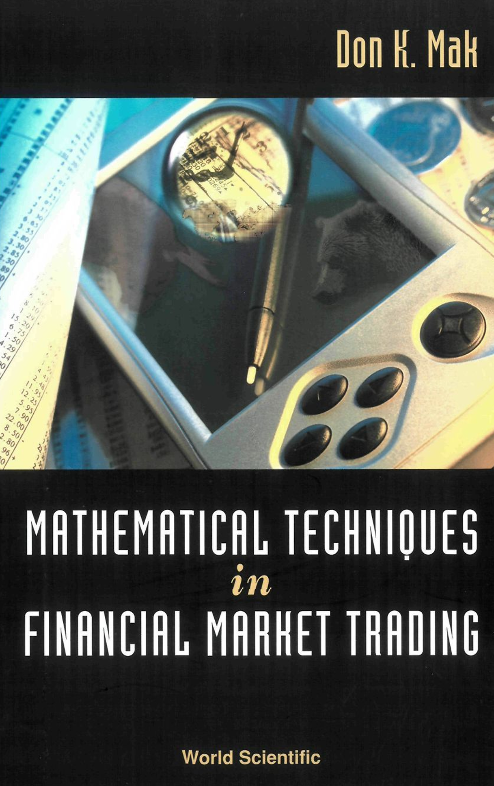

# Mathematical Techniques in Financial Market Trading

**Don K. Mak** (2006)

```bibtex
@book{mak2006mathematical,
  author    = {Mak, Don K.},
  title     = {Mathematical Techniques in Financial Market Trading},
  year      = {2006},
  publisher = {World Scientific},
  address   = {Singapore},
  isbn      = {978-981-256-699-7},
  doi       = {10.1142/6055},
  url       = {https://www.worldscientific.com/worldscibooks/10.1142/6055}
}
```

## Chapters

1. [Introduction](ch-01.md)
2. [Scientific Review of the Financial Market](ch-02.md)
3. [Causal Low Pass Filters](ch-03.md)
4. [Reduced Lag Filters](ch-04.md)
5. [Causal Wavelet Filters](ch-05.md)
6. [Instantaneous Frequency](ch-06.md)
7. [Phase](ch-07.md)
8. [Causal High Pass Filters](ch-08.md)
9. [Skipped Convolution](ch-09.md)
10. [Trading Tactics](ch-10.md)
11. [Trading System](ch-11.md)
12. [Money Management — Time Independent Case](ch-12.md)
13. [Money Management — Time Dependent Case](ch-13.md)
14. [The Reality of Trading](ch-14.md)

## Appendices

- [Appendix 2](ap-02.md)
- [Appendix 3: Frequency](ap-03.md)
- [Appendix 4: Higher Order Polynomial High Pass Filters](ap-04.md)
- [Appendix 5: MATLAB Programs for Money Management](ap-05.md)
