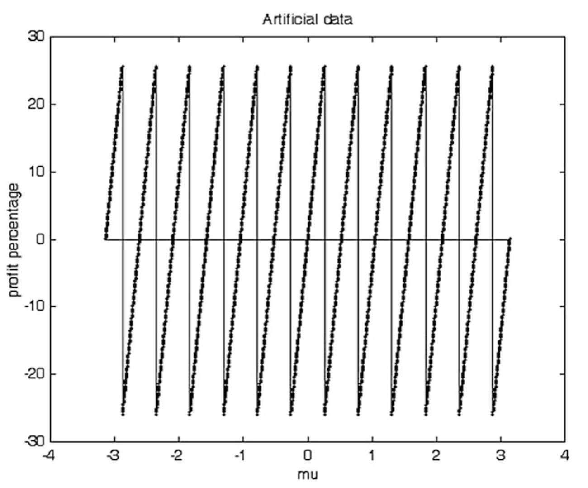
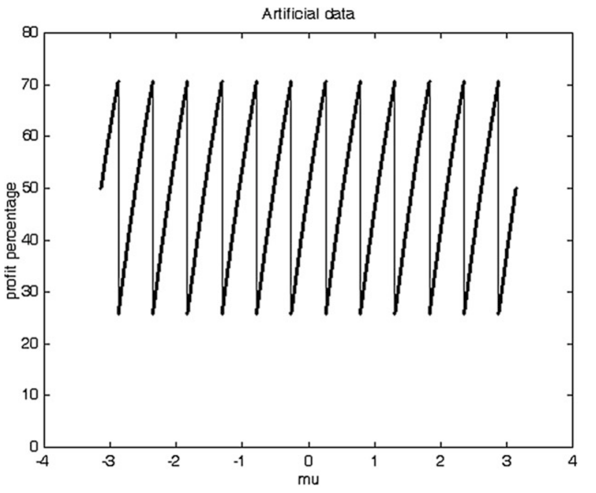
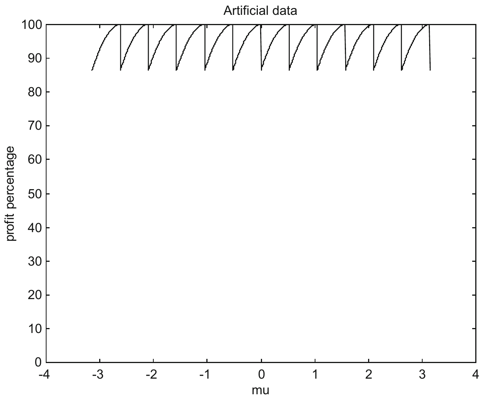
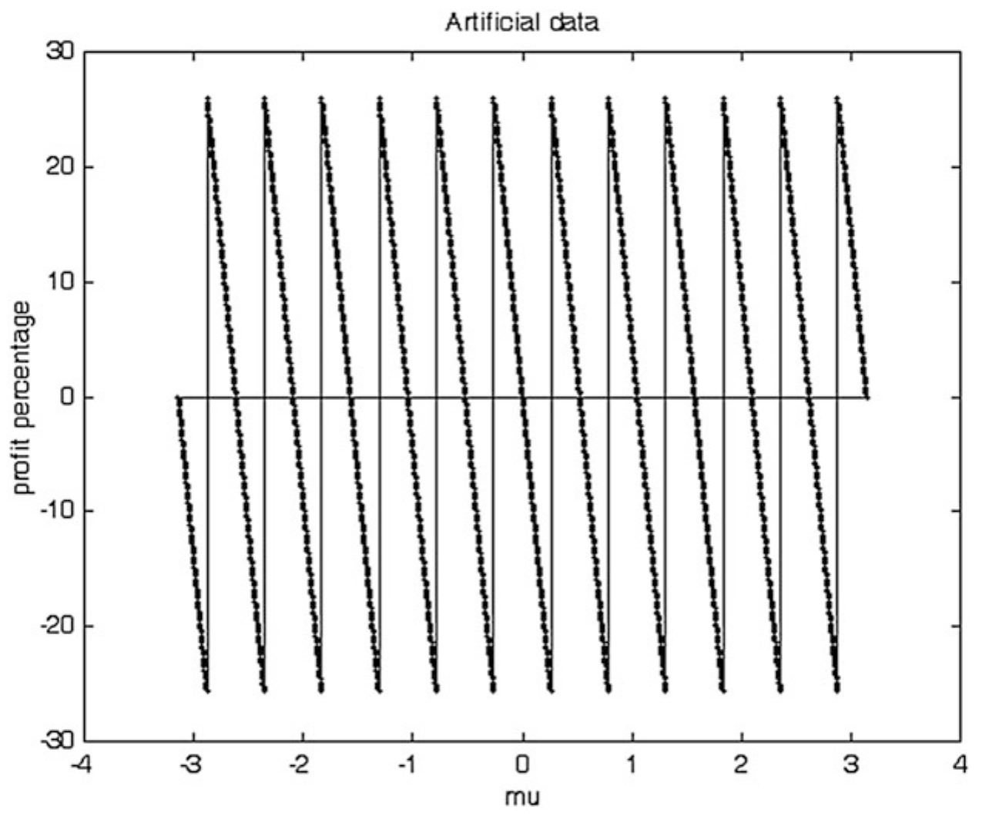
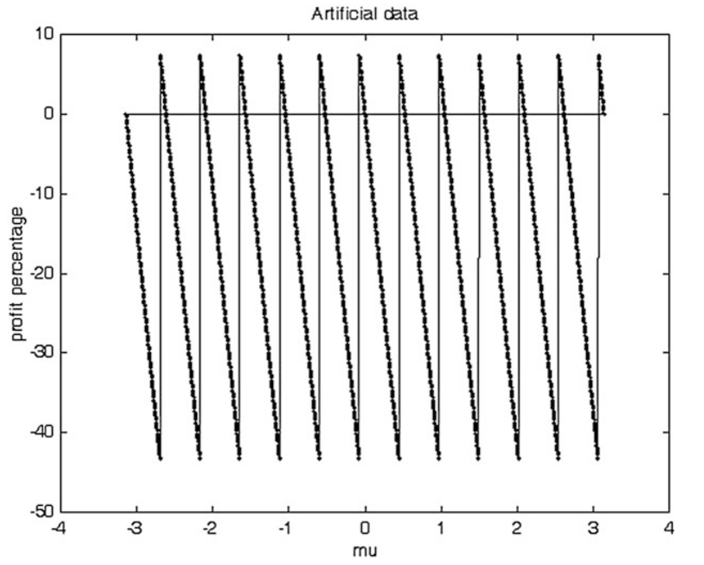
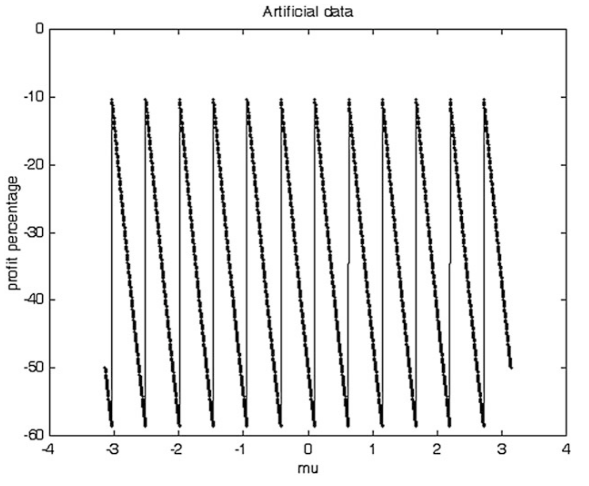

# Appendix A: Sure and Unsure Profit and Loss Zones

The frequency spectrum of the velocity indicator of a trading tactic can be divided into a Profit Zone and a Loss Zone. If the frequencies of the price signal lie within the Profit Zone, the trade will make a profit. If the frequencies of the price signal lie within the Loss Zone, the trade will make a loss.

As the price signal is not continuous, but is sampled, sampling delay can cause losses in the Profit Zone, or profit in the Loss Zone. Thus, Profit Zone can be divided into Sure Profit Zone and Unsure Profit Zone. Within the former, the trade will definitely make a profit. Within the latter, the trade can make a profit or a loss.

Similarly, the Loss Zone can be divided into Sure Loss Zone, and Unsure Loss Zone. Within the former, the trade will definitely make a loss. Within the latter, the trade can make a profit or a loss.

## A.1 Profit Zone

In Table A.1 (which is the same as Table 2.3), $\omega$ is the circular frequency, or the sampling rate of the price signal, which is a sine wave of a single frequency. $\phi$ is the phase lead of the velocity indicator from the signal, where $0 < \phi < \pi$. $\mu$ is the phase shift of the original price signal caused by sampling delay.

**Table A.1** Sure Profit Zone and Unsure Profit Zone

| Zone | Condition | Result |
|------|-----------|--------|
| Sure Profit Zone | $\phi > \omega$ | Always makes a profit |
| Unsure Profit Zone | $\phi < \omega$ | $\mu < \phi$ ($\mu > 0$) makes a profit |
| | | $\mu \ge \phi$ ($\mu > 0$) makes a loss |

(See Fig. 3.22 to find out how the Profit Zone can be divided into Sure and Unsure Profit Zone)

In the Profit Zone, $0 < \phi < \pi$.
Maximum of $\mu$ is $\omega$, the circular frequency, i.e., $\mu \le \omega$.

In the Sure Profit Zone, $\phi > \omega > \mu$.

In the Unsure Profit Zone, $\phi < \omega$.
When $0 < \mu \le \phi$, the trade would make a profit.
When $\phi < \mu < \omega$, the trade would make a loss.

### A.1.1 Unsure Profit Zone

#### Examples

We will take a look at two examples with the original price signal represented by

$$\text{Price} = \sin(\omega \, n + \theta_0) = \sin(\omega \, n + (\omega - \mu)) \tag{A.1}$$

where the original phase offset (phase lead, in this case) $\theta_0 = \omega - \mu > 0$.

The filtered price from the velocity indicator would then be written as

$$\text{Filtered price} = \sin(\omega \, n + \theta_0 + \phi) = \sin(\omega \, n + (\omega - \mu) + \phi) \tag{A.2}$$

**Example A.1**

$\text{Price} = \sin(\pi/6 \, n + (\pi/6 - \mu))$

where the circular frequency $\omega = \pi/6$ and the original phase offset $\theta_0 = \pi/6 - \mu$.

A filtered price is arbitrarily set to have a phase lead $\phi$ of $\pi/12$ from the price signal.

The filtered price would then be

$\text{Filtered Price} = \sin(\pi/6 \, n + (\pi/6 - \mu) + \pi/12)$

Using the program tradeartif (with the parameter tactic = 12), it can be shown that the trade makes a profit for $0 < \mu \le \pi/12$, and makes a loss for $\pi/12 < \mu < \pi/6$. The computational results also agree with the theoretical calculations from the program buysellprice.

**Example A.2**

$\text{Price} = \sin(\pi/3 \, n + (\pi/3 - \mu))$

where the circular frequency $\omega = \pi/3$ and the original phase offset $\theta_0 = \pi/3 - \mu$.

A filtered price (filtered by a velocity indicator) is arbitrarily set to have a phase lead $\phi$ of $\pi/12$ from the price signal.

The filtered price would then be

$\text{Filtered Price} = \sin(\pi/3 \, n + (\pi/3 - \mu) + \pi/12)$

Using the program tradeartif (with the parameter tactic = 12), it can be shown that the trade makes a profit for $0 < \mu \le \pi/12$, and makes a loss for $\pi/12 < \mu < \pi/3$. The computational results also agree with the theoretical calculations from the program buysellprice.

The above two examples just show that, in the Unsure Profit Zone, a trade makes a profit for $0 < \mu \le \phi$, and makes a loss for $\phi < \mu < \omega$, in agreement with Table A.1.

$\mu$ can actually be extended to less than 0 ($\mu < 0$) or larger than $\omega$ ($\mu > \omega$) for Eq. (A.1) and (A.2) to include larger original phase offset.

$\mu$ is less than 0 for the two examples below:

In Example 2.4 in Chapter 2, where $\phi = 0$
The phase offset $\theta_0 = \pi/4$ can be written as $\pi/6 + \pi/12 = \pi/6 - (-\pi/12)$
Thus, $\mu = -\pi/12$.

In Example 2.5 in Chapter 2, where $\phi = \pi/12$
The phase offset $\theta_0 = \pi/4$ can be written as $\pi/6 + \pi/12 = \pi/6 - (-\pi/12)$
Thus $\mu = -\pi/12$

#### Plots

As in Chapter 2, we can set

$$n_{\text{buy}} = \text{Integer}\left((2\pi - \theta_0 - \phi)/\omega\right) + 1 \tag{2.1}$$

$$\text{Buy price} = \sin(n_{\text{buy}} \times \omega + \theta_0) \tag{2.2}$$

And, as sine wave is an odd function,

$$\text{Sell price} = -\text{Buy price} \tag{2.5}$$

$$\text{Profit} = 2 \times \text{Sell Price} \tag{2.6}$$

$$\text{Profit\%} = \text{Profit}/2 \times 100\% \tag{2.7}$$

where

- $n_{\text{buy}}$ = n where the buying indication is triggered
- $\theta_0 = \omega - \mu$ = the initial phase offset of the price signal,
- $\mu$ is the phase shift of the price signal due to sampling
- $\phi$ is the phase lead of the velocity indicator from the price signal, and
- Integer is the integer portion of the argument.

In Eq. (2.7), 2 = peak $-$ valley of the sine wave, whose amplitude equals 1.

The above equations form the basis of the program unsure, which plots profit % versus $\mu$.

Given $\omega = \pi/6$ and $\phi = \pi/12 \approx 0.26$, Fig. A.1 shows a plot of profit % versus $\mu$. The figure shows that

When $\mu = 0$, profit % = 0, and as $\mu$ increases, profit % slowly increases to 25.9%
When $\mu <$ and $\approx \pi/12$, profit % $\approx$ 25.9
But, when $\mu >$ and $\approx \pi/12$, profit % $\approx -25.9$

This simply means that a very slight change in $\mu$ at $\phi = \pi/12$ can change a trade from taking a profit to taking a loss.

**Fig. A.1** Profit % of a trade is plotted versus $\mu$, the phase shift of the price signal due to sampling. $\omega = \pi/6$ and $\phi = \pi/12$, i.e., $\phi < \omega$, which is the Unsure Profit Zone, where a trade can make a profit or a loss. This figure is plotted by the program unsure.

### A.1.2 Sure Profit Zone

The program unsure can also be used to plot profit percentage in the Sure Profit Zone, when $\phi > \omega$.

**Example A.3**

Given $\omega = \pi/6$ and $\phi = \pi/4$, Fig. A.2 shows a plot of profit % versus $\mu$.

**Fig. A.2** Profit % of a trade is plotted versus $\mu$, the phase shift of the price signal due to sampling. $\omega = \pi/6$ and $\phi = \pi/4$, i.e., $\phi > \omega$, which is the Sure Profit Zone.

Figure A.2 shows that when $\phi > \omega$, the trade is profitable all the time, in agreement with Table A.1. However, variation in $\mu$ does affect the profit %.

**Example A.4**

Given $\omega = \pi/6$ and $\phi = \pi/2$, Fig. A.3 shows a plot of profit % versus $\mu$.

**Fig. A.3** Profit % of a trade is plotted versus $\mu$, the phase shift of the price signal due to sampling. $\omega = \pi/6$ and $\phi = \pi/2$, i.e., $\phi > \omega$, which is the Sure Profit Zone.

Figure A.3 shows that when $\phi > \omega$, the trade is profitable all the time, in agreement with Table A.1. As $\phi = \pi/2$, the optimal phase lead for a velocity indicator, profit % can achieve 100%. However, variation in $\mu$ can reduce the profit %.

## A.2 Loss Zone

In Table A.2, $\omega$ is the circular frequency, or the sampling rate of the price signal, which is a sine wave of a single frequency. $\phi$ is the phase lead of the velocity indicator from the signal, where $0 > \phi > -\pi$. $\mu$ is the phase shift of the original price signal caused by sampling delay.

**Table A.2** Sure Loss Zone and Unsure Loss Zone

| Zone | Condition | Result |
|------|-----------|--------|
| Sure Loss Zone | $\phi > -\pi + \omega$ | always makes a loss |
| Unsure Loss Zone | $\phi < -\pi + \omega$ | $\mu < \phi + \pi$ ($\mu > 0$) makes a loss |
| | | $\mu \ge \phi + \pi$ ($\mu > 0$) makes a profit |

The original price signal is represented by

$$\text{Price} = \sin(\omega \, n + \theta_0) = \sin(\omega \, n + (\omega - \mu)) \tag{A.1}$$

where the original phase offset (phase lead, in this case) $\theta_0 = \omega - \mu$.

The filtered price from the velocity indicator would then be written as

$$\text{Filtered price} = \sin(\omega \, n + \theta_0 + \phi) = \sin(\omega \, n + (\omega - \mu) + \phi) \tag{A.2}$$

### A.2.1 Unsure Loss Zone

#### Example

**Example A.5**

$\text{Price} = \sin(\pi/6 \, n + (\pi/6 - \mu))$

where the circular frequency $\omega = \pi/6$ and the original phase offset $\theta_0 = \pi/6 - \mu$.

A filtered price is arbitrarily set to have a phase lead $\phi$ of $-\pi + \pi/12$ from the price signal.

The filtered price would then be

$\text{Filtered Price} = \sin(\pi/6 \, n + (\pi/6 - \mu) - \pi + \pi/12)$

Using the program tradeartif (with the parameter tactic = 12), it can be shown that the trade makes a profit for $\pi/12 < \mu \le \pi/6$, and makes a loss for $0 < \mu < \pi/12$. The computational results also agree with the theoretical calculations from the program buysellprice, as shown in Fig. A.4.

Also, in Example 2.8 in Chapter 2, $\mu = \pi/9$. And the trade makes a profit.

#### Plots

**Example A.6**

Given $\omega = \pi/6$ and $\phi = -\pi + \pi/12$, Fig. A.4 shows a plot of profit % versus $\mu$.

**Fig. A.4** Profit % of a trade is plotted versus $\mu$, the phase shift of the price signal due to sampling. $\omega = \pi/6$ and $\phi = -\pi + \pi/12$, i.e., $\phi < -\pi + \omega$, which is the Unsure Loss Zone, where a trade can make a profit or a loss. This figure is plotted by the program unsure.

**Example A.7**

Given $\omega = \pi/6$ and $\phi = -\pi + \pi/7$, Fig. A.5 shows a plot of profit % versus $\mu$.

**Fig. A.5** Profit % of a trade is plotted versus $\mu$, the phase shift of the price signal due to sampling. $\omega = \pi/6$ and $\phi = -\pi + \pi/7$, i.e., $\phi < -\pi + \omega$, which is the Unsure Loss Zone, where a trade can make a profit or a loss.

### A.2.2 Sure Loss Zone

**Example A.8**

Given $\omega = \pi/6$ and $\phi = -\pi + \pi/5$, Fig. A.6 shows a plot of profit % versus $\mu$.

**Fig. A.6** Profit % of a trade is plotted versus $\mu$, the phase shift of the price signal due to sampling. $\omega = \pi/6$ and $\phi = -\pi + \pi/5$, i.e., $\phi > -\pi + \omega$, which is the Sure Loss Zone, where a trade always makes a loss.
