# 2 Market Turning Points

It sure would be nice if the market is always trending up. Investors can simply buy and hold, and sell the stocks when they need money. Unfortunately, the market never behaves as such. One assertion that seems to be certain for the behavior of the market is: the market always goes up, but then again, it will always come down. Thus, traders need to know when the market turns, and hopefully predict the turning points some time ahead. They can go long (buy) when the market goes up, and sell short (sell) when the market comes down. For the forecasting and identification of the turning points, we can turn to a mathematics discipline called Calculus for help. Calculus is the mathematical study of continuous change. It relates to instantaneous rates of change and slopes of curves. It was developed independently by Issac Newton in England and Gottfried Leibniz in Germany in the late seventeenth century.

## 2.1 Price Data

As explained in Mak (2003), it would be much easier to interpret the ideas of market price movements by choosing some simple waveforms to simulate the market price as a start. We can then progress to more complicated waveforms, and then eventually analyze the real market data.

In 1807, a French mathematician, Joseph Fourier, showed that any practical signal can be expressed as the sum of a number of sine waves. This summation has been called the Fourier series (Broesch 1997; Hubbard 1998). This theorem will allow us to rewrite any financial data as a sum of sine waves.

Thus, to start off with something simple, we will simulate the price with a single sine wave. As an example, we will choose a sine wave of 1.5 cycles, with an amplitude of 1.0, and a period ($T$) of 40 as shown in Fig. 2.1. (A sine wave can be formed by the projection of a rotating vector of a circle on the vertical axis. Rotating the vector by 360° ($= 2\pi$ radians) will form 1 cycle of the sine wave.) For simplicity of understanding, we can assume that it is a daily chart (i.e., the unit time is 1 day), and the period of 1 cycle is then 40 trading days. Frequency, $f$, is defined as the reciprocal of a period, and is therefore equal to $1/T = 1/(40 \text{ unit time})$. Circular frequency, $\omega$, is defined as $2\pi \times \text{frequency} = 2\pi f = 2\pi/40$ (radians/unit time).

For this single sine wave, a trader surely would buy at the dip and sell at the peak in order to make maximum profit. Looking at Fig. 2.1, he would go into a short position (sell) on Day 10 ($t = 10$), and close his position (buy) on Day 30 ($t = 30$). He would also go into a long position (buy) on Day 30 ($t = 30$), and close his position (sell) on Day 50 ($t = 50$).

But only knowing the past data, and not future data, how is he going to predict that the market is going to turn?

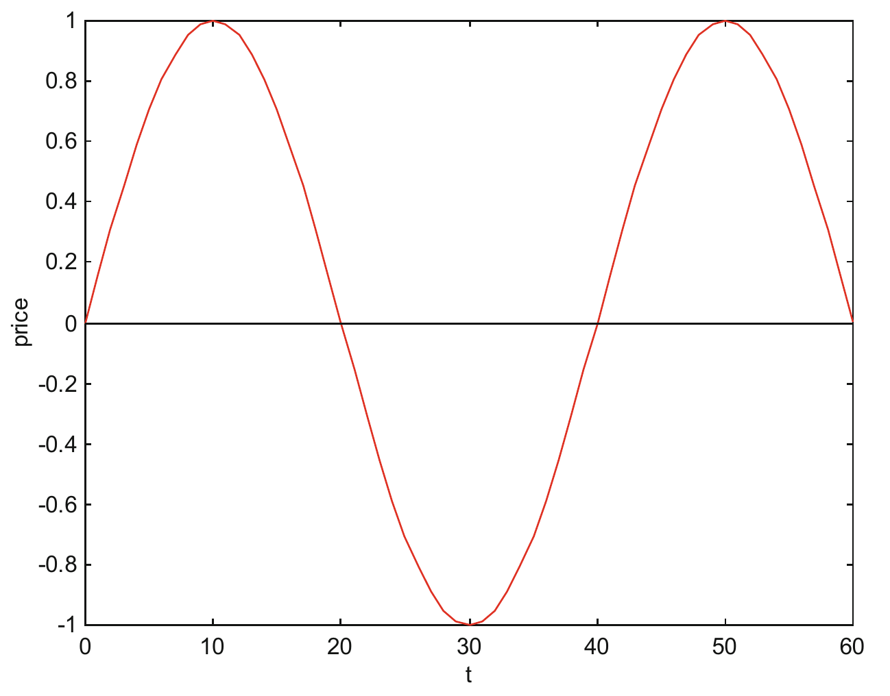

**Fig. 2.1** Simulated price data. Price (plotted as a red line) is plotted versus time $t$, as a sine wave with a period of 40 trading days.

## 2.2 Velocity

The answer is by simply finding the slope of the curve (Mak 2003). The slope of the curve is the instantaneous rate of change of the curve, and is called first derivative, or simply derivative in Calculus. The derivative of a sine wave is a cosine wave. A cosine wave is actually the same as a sine wave but with 90° added to its phase, and that is why a cosine wave leads the sine wave by 90° ($= \pi/2$ radians). Thus, a cosine wave actually looks exactly like a sine wave but shifted by 90° to the left side. As the period of the wave corresponds to 360°, shifting by 90° would correspond to a shifting of 1/4 of a cycle, i.e., 10 days when the period is 40 days. The cosine wave leads as it cuts the zero-crossing faster by 90° than the sine wave. The slope is plotted in blue color in Fig. 2.2(a). We will borrow a term from Physics and called this slope velocity. In Physics, velocity measures the rate of change of distance over time (this definition has been simplified, as velocity in Physics is a vector quantity that has a direction). In trading terminology here, we replace distance by price.

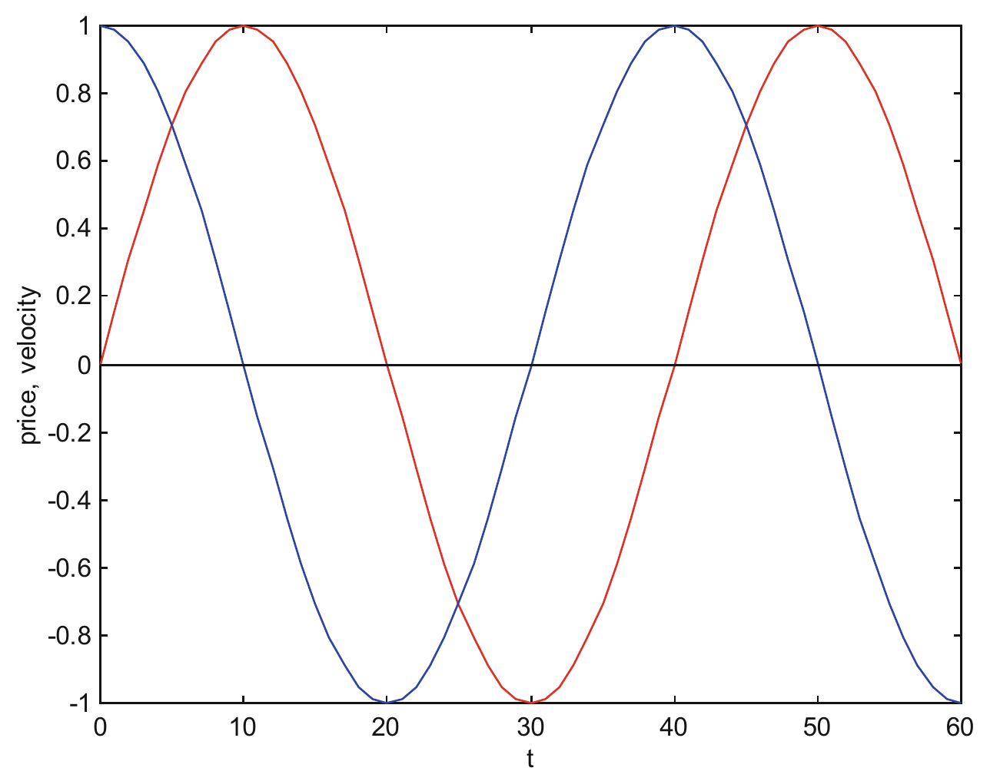

**Fig. 2.2(a)** Simulated price data. Price (plotted as a red line) is plotted versus time $t$, as a sine wave with a period of 40 trading days. Velocity is plotted as a blue line. It represents the slope of the price.

It can be noted from Fig. 2.2(a) that, as long as velocity is +ve, e.g., $t = 30$ to $t = 50$, price is increasing, and as long as velocity is −ve, e.g., $t = 10$ to $t = 30$, price is decreasing. At the peak and trough of the price data ($t = 10, 30, 50$), the slope or the velocity equals 0. At the peak, e.g., $t = 10$, velocity goes from +ve to −ve. And at the trough, e.g., $t = 30$, velocity goes from −ve to +ve.

Thus, when a trader sees that the velocity is approaching from the −ve side to the +ve side, he would predict that the price is bottoming out, and he can go long (buy) at velocity $= 0$. And as long as the velocity turns positive and holds +ve, he can hold. When a trader sees that the velocity is approaching from the +ve side to the −ve side, he would predict that the price is peaking out, and he can sell short (sell) at velocity $= 0$. And as long as the velocity turns negative and holds −ve, he can hold. Thus, a simple trading rule can be found in Table 2.1.

**Table 2.1** Trading rule using velocity

| Velocity | 0 (−ve to +ve) | > 0 | 0 (+ve to −ve) | < 0 |
|---|---|---|---|---|
| Trading rule | Buy | Hold | Sell | Hold |

One can simplify the trading rule as: go long when velocity is positive, and sell short when velocity is negative. However, for the sake of clarity, we will only consider the trader going long, and not selling short, even though the ideas in this book can easily be applied to the latter.

The advantage of monitoring the velocity is that the velocity will approach 0 at the turning points. And that is much more noticeable than monitoring the turning of the price data. It should also be noted that if we add a constant to the price data (e.g., constant + sine wave), the velocity would still be the same as if the constant were not added, as the slope (or derivative) of a constant is zero (Fig. 2.2(b)). Real market data can be represented as a constant with cycles of waves riding on top of the constant. The advantage of looking at the slope is that we can simply ignore the constant.

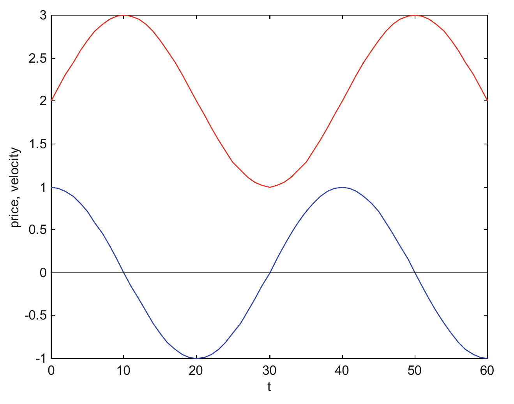

**Fig. 2.2(b)** Simulated price data. A constant has been added to the price of Fig. 2.2(a). Price (plotted as a red line) is plotted versus time $t$, as a sine wave with a period of 40 trading days. Velocity is plotted as a blue line. It represents the slope of the price. The velocity is exactly the same as the velocity shown in Fig. 2.2(a).

Thus, by simply monitoring the velocity, we would know when the market is going to turn. This, of course, sounds too good to be true, and it is. The problem is: how are we going to find the velocity. Price data can be represented as waves of different frequencies, as well as summation of all these waves. It would be difficult to find a velocity that reflects the slopes of all these waves. At best, we can try to create velocity indicators that can emulate velocity. However, as we will soon find out, this is not an easy task.

## 2.3 Velocity Indicators

In the following chapters, we will describe some existing indicators for simulating the velocity, as well as some new indicators we introduce. Existing indicators are indicators that have been used by traders. As indicators can only use past data for calculation, the velocity indicators would always lag behind the ideal phase lead of $\pi/2$ radians $= 90°$, as shown in Fig. 2.2(a). The lag of the velocity indicator would definitely influence whether the trader makes or loses money.

In Fig. 2.3(a)–(d) below, we will arbitrarily choose the amplitude of the price signal to be 1 and the amplitude of the velocity indicator signal to be 0.8 so as to show their differences more clearly. The velocity indicators will be drawn with different phase lags from the price, in order to show how phase lag can make or break.

Figures 2.3(a), (b), (c), and (d) shows a velocity indicator having a phase lead of $\pi/2$, 0, $-\pi/2$, and $-\pi$ radians respectively from the price data. Following the trading rule in Table 2.1, the trader will make maximal profit, zero profit, maximal loss, and zero profit respectively.

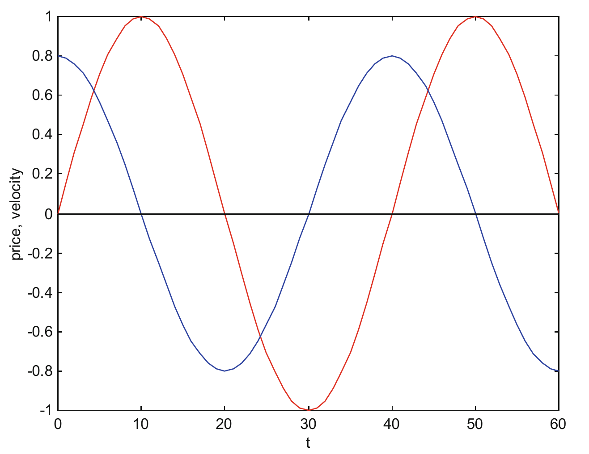

**Fig. 2.3(a)** Simulated price data. Price (plotted as a red line) is plotted versus time $t$, as a sine wave with a period of 40 trading days. Velocity indicator of the price data is plotted as a blue line. Here the velocity indicator has an ideal phase lead of $\pi/2$ radians, which is the same as Fig. 2.2(a). Following the trading rule of Table 2.1, maximal profit will be made.

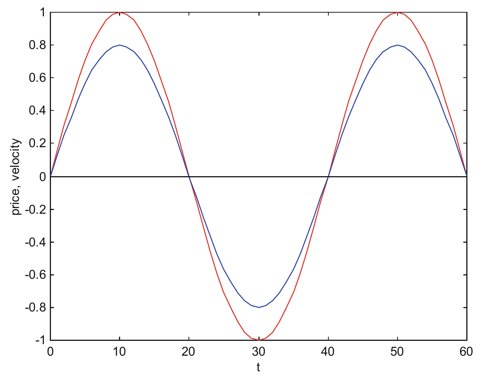

**Fig. 2.3(b)** Simulated price data. Price (plotted as a red line) is plotted versus time $t$, as a sine wave with a period of 40 trading days. Velocity indicator of the price data is plotted as a blue line. Here the velocity indicator has a phase lead of 0 radians, i.e., it is totally in phase with the signal. Following the trading rule of Table 2.1, zero profit will be made.

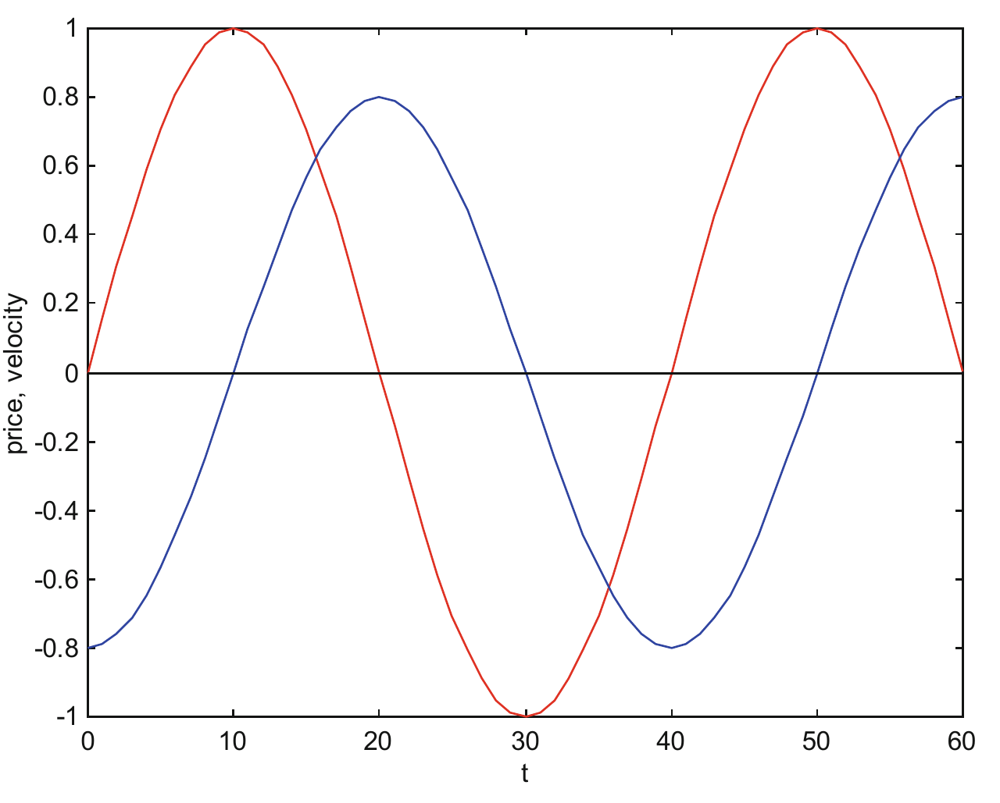

**Fig. 2.3(c)** Simulated price data. Price (plotted as a red line) is plotted versus time $t$, as a sine wave with a period of 40 trading days. Velocity indicator of the price data is plotted as a blue line. Here the velocity indicator has a phase lead of $-\pi/2$ radians ($=$ a phase lag of $\pi/2$ radians). Following the trading rule of Table 2.1, maximal loss will be made.

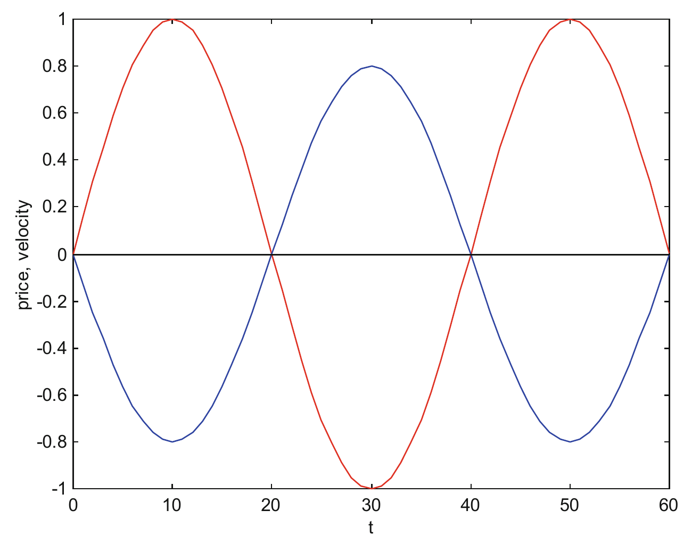

**Fig. 2.3(d)** Simulated price data. Price (plotted as a red line) is plotted versus time $t$, as a sine wave with a period of 40 trading days. Velocity indicator of the price data is plotted as a blue line. Here the velocity indicator has a phase lead of $-\pi$ radians ($=$ phase lag of $\pi$ radians $=$ phase lead of $\pi$ radians), i.e., it is opposite in phase with the signal. Following the trading rule of Table 2.1, zero profit will be made.

We can create the following table.

**Table 2.2** Trading profit made by following the trading rule of Table 2.1. (a)–(d) corresponds to Figs. 2.3(a)–(d)

|  | (a) | (b) | (c) | (d) |
|---|---|---|---|---|
| Velocity indicator phase, $\phi$, with respect to price signal | $\pi/2$ lead | 0 ($= 2\pi$) | $-\pi/2$ lead ($\pi/2$ lag $= 3\pi/2$ lead) | $-\pi$ lead ($= \pi$ lead $= \pi$ lag) |
| Profit | 1 | 0 | −1 | 0 |

Thus from Table 2.2, it can be seen that the trader will make maximum profit in (a) and zero profit in (b). He will lose all the money in (c) and make zero profit in (d). In between all these cases, he will either make some profit or lose some money. Profit $= 1$ in Table 2.2 means the maximum profit the trader can make, i.e., he buys at the bottom, and sells at the top. Profit $= -1$ would mean he buys at the top, and sells at the bottom.

### 2.3.1 Profit Zone and Loss Zone

The trading outcome can be described as: if the velocity indicator leads the price signal between 0 and $\pi$, the trader will make money; if the velocity indicator leads the price signal between $\pi$ and $2\pi$ (which is equivalent to leading between $-\pi$ and 0 and equivalent to lagging between $\pi$ and 0), the trader will lose money. Thus, when we design a velocity indicator, we should aim at making it to have a phase lead between 0 and $\pi$, and preferably a phase lead of $\pi/2$ radians with respect to the price data, such that maximum profit can be attained. As the phase lead or lag of the velocity indicator of a signal would depend on the frequency of the signal (see, e.g., Chapter 3), it would be challenging to find a velocity indicator that would make a trade profitable for a large range of frequency. We would call the range of frequency $\omega$ of a velocity indicator which has a phase lead $\phi$, that lies between 0 and $\pi$ as the Profit Zone for that velocity indicator, while the range of frequency which has a phase lead $\phi$, that lies between 0 and $-\pi$ as the Loss Zone. An example will be given in Sections 3.2.1 in Chapter 3.

Other factor also affects the profitability of a trade, as we will show below.

## 2.4 Sampling

### 2.4.1 Sampling Can Affect the Profitability of a Trade

As the price signal, and consequently the filtered price signal (price signal after operated on by an indicator), are not continuous, but are sampled, sampling would affect the profitability of a trade. Buy indication occurs when the velocity crosses over from negative to positive, and should trigger a buy when it is exactly at zero. However, as the data are sampled, the buy indication is thus delayed to the next sampled datum when velocity is greater than 0. Similarly, sell indication occurs when the velocity crosses over from positive to negative, and should trigger a sell when it is exactly at zero. However, as the data are sampled, the sell indication is delayed.

Thus, the profitability of a trade would depend upon when the data are sampled. Three examples are shown below, with exactly the same price signal but sampled slightly shifted from the others. A trade using the same velocity indicator, which is arbitrarily phase shifted by the ideal $\pi/2$ lead from the sampled price signals, would produce different profits for the three examples.

The price signal is simulated by a single sine wave of amplitude 1 and circular frequency $\omega = \pi/6$. Had the price signal been continuous, a velocity indicator with a phase lead of $\pi/2$, will buy at the very bottom and sell at the very top, thus making a profit of 2.0. However, as the price signal is sampled, the trade will produce a profit less than 2.0.

**Example 2.1**

Figure 2.4 plots the price in the top figure, and the filtered price in the middle figure, with

$$\text{Price} = \sin(\pi/6 \cdot n)$$

$$\text{Filtered Price} = \sin(\pi/6 \cdot n + \pi/2)$$

The trader will buy at $n = 10$, which is marked by an \* in the bottom figure, and sell at $n = 16$, which is marked by a + in the bottom figure, thus making a profit of 1.73, which is less than the ideal profit of 2.0. Figure 2.4 can be plotted using the computer program tradeartif, with the parameter tactic set equal to 12, $\theta_0 = 0$, and thetashift ($=$ phase lead) set to $\pi/2$.

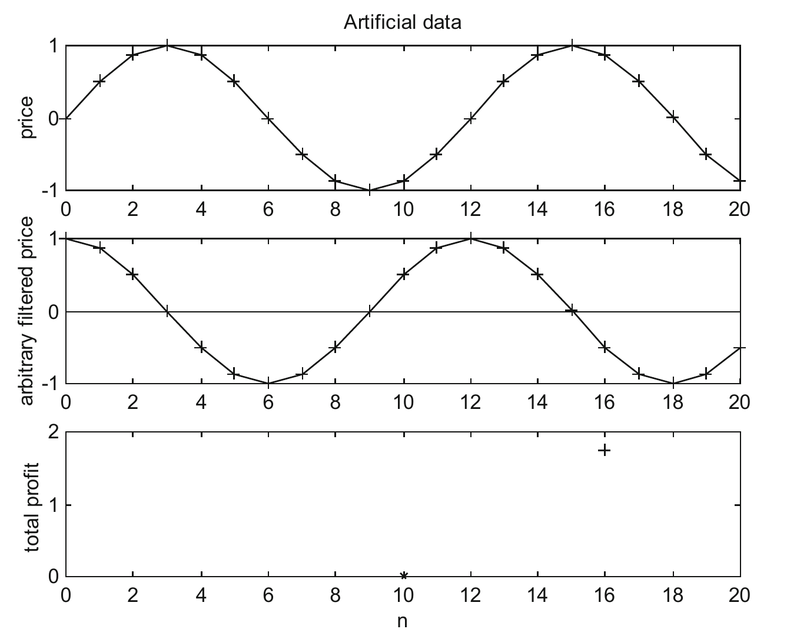

**Fig. 2.4** Price is plotted in the top figure, and the filtered price in the middle figure. In the bottom figure, buy indication is marked by an \* at $n = 10$ and sell indication by a + at $n = 16$, thus making a profit of 1.73, i.e., the profit % is 86.5%.

**Example 2.2**

Figure 2.5 plots the price in the top figure, and the filtered price in the middle figure, with

$$\text{Price} = \sin(\pi/6 \cdot n + \pi/8)$$

$$\text{Filtered Price} = \sin(\pi/6 \cdot n + \pi/8 + \pi/2)$$

The trader will buy at $n = 9$, which is marked by an \* in the bottom figure, and sell at $n = 15$, which is marked by a + in the bottom figure, thus making a profit $= 1.85$, which is less than the ideal profit of 2.0.

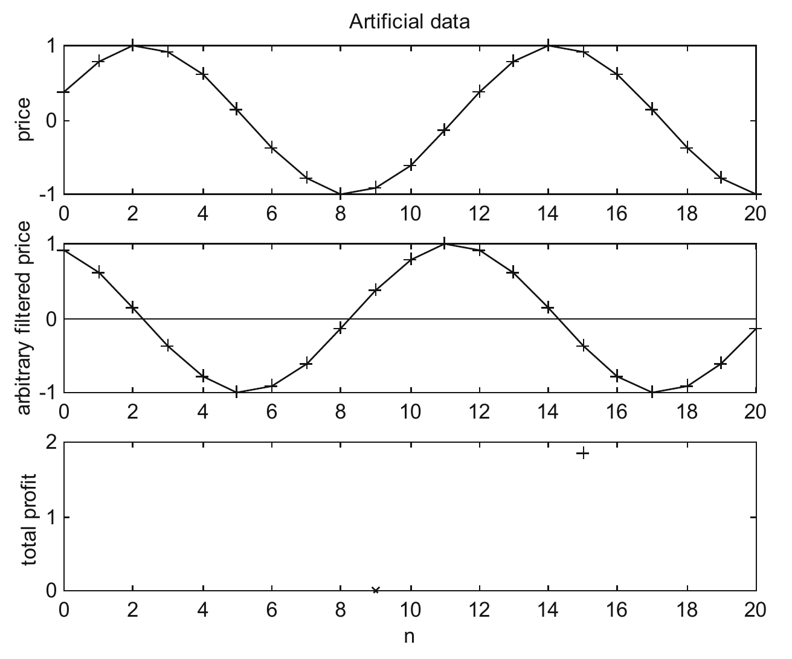

**Fig. 2.5** Price is plotted in the top figure, and the filtered price in the middle figure. In the bottom figure, buy indication is marked by an \* at $n = 9$ and sell indication by a + at $n = 15$, thus making a profit of 1.85, i.e., the profit % is 92.5%.

**Example 2.3**

Figure 2.6 plots the price in the top figure, and the filtered price in the middle figure, with

$$\text{Price} = \sin(\pi/6 \cdot n + \pi/4)$$

$$\text{Filtered Price} = \sin(\pi/6 \cdot n + \pi/4 + \pi/2)$$

The trader will buy at $n = 8$, which is marked by an \* in the bottom figure, and sell at $n = 14$, which is marked by a + in the bottom figure, thus making a profit $= 1.93$, which is less than the ideal profit of 2.0.

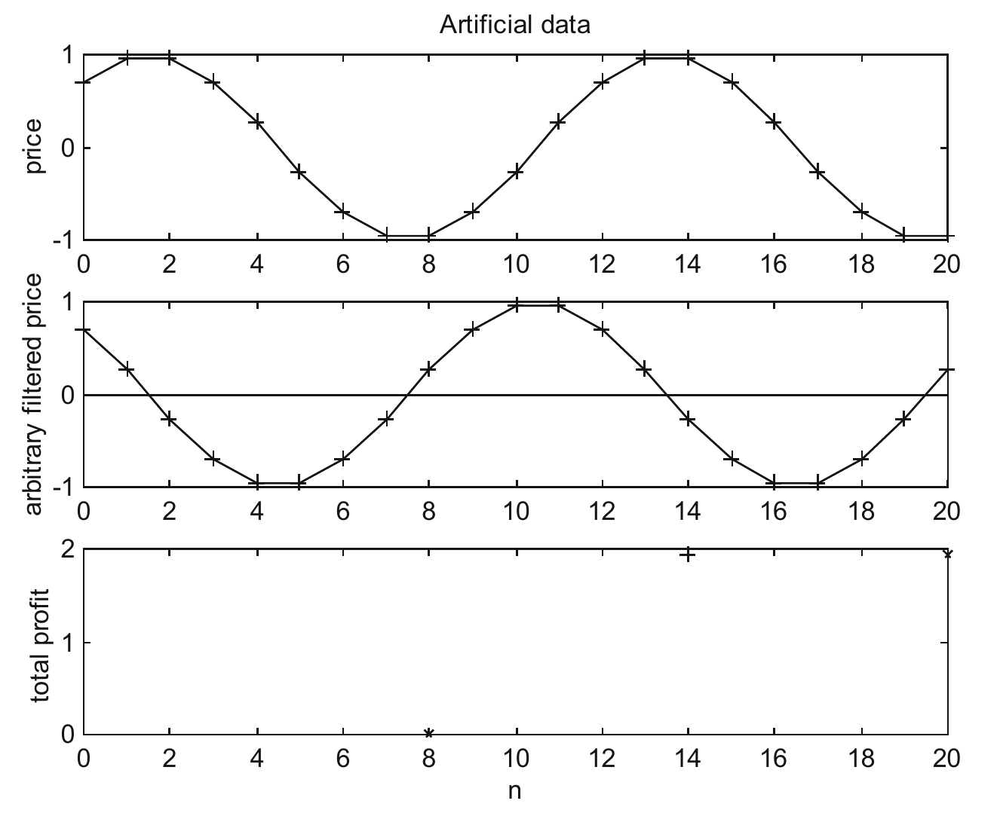

**Fig. 2.6** Price is plotted in the top figure, and the filtered price in the middle figure. In the bottom figure, buy indication is marked by an \* at $n = 8$ and sell indication by a + at $n = 14$, thus making a profit of 1.93, i.e., the profit % is 96.6%.

In each of the examples, the initial phase angle of the price signal is changed to emulate the erratic phase shift of the price signal at the moment when the signal is sampled. It can be seen from the three examples above, that, depending on when the price data are sampled, profit made in a trade can differ, even though the phase lead of the velocity indicator from the price data is exactly the same.

#### 2.4.1.1 Theoretical Calculation of Profit

If the price data is a single sine wave, the Buy Price, Sell Price, and Profit can actually be calculated from

$$n_{\text{buy}} = \text{Integer}\left(\frac{2\pi - \theta_0 - \phi}{\omega}\right) + 1 \tag{2.1}$$

$$\text{Buy price} = \sin(n_{\text{buy}} \cdot \omega + \theta_0) \tag{2.2}$$

$$n_{\text{sell}} = \text{Integer}\left(\frac{3\pi - \theta_0 - \phi}{\omega}\right) + 1 \tag{2.3}$$

$$\text{Sell price} = \sin(n_{\text{sell}} \cdot \omega + \theta_0) \tag{2.4}$$

Or, as sine wave is an odd function,

$$\text{Sell price} = -\text{Buy price} \tag{2.5}$$

$$\text{Profit} = \text{Sell price} - \text{Buy price} = 2 \times \text{Sell Price} \tag{2.6}$$

$$\text{Profit\%} = \text{Profit}/2 \times 100\% \tag{2.7}$$

where

- $n_{\text{buy}}$ = $n$ where the buying indication is triggered
- $n_{\text{sell}}$ = $n$ where the selling indication is triggered
- $\theta_0$ is the initial phase offset of the price signal,
- $\phi$ is the phase lead of the velocity indicator from the price signal
- Integer is the integer portion of the argument.

In Eq. (2.7), 2 = peak – valley of the sine wave, whose amplitude equals 1. Equations (2.1)–(2.7) form the basis of the computer program buysellprice.

**For Example 2.3**

As $\omega = \pi/6$, $\theta_0 = \pi/4$, and $\phi = \pi/2$:

- $n_{\text{buy}} = 8$
- Buy price $= -0.966$
- $n_{\text{sell}} = 14$
- Sell price $= 0.966$
- Profit $= 1.93$
- Profit % $= 96.6\%$

The result of this theoretical calculation agrees with that of the computational calculation described above (Fig. 2.6). The idea of this exercise is that when the circular frequency, and the sampling delay of the price signal simulated as a single sine wave are known, the profit or loss of a trade can be calculated. This is because the phase lead of the velocity indicator acting on the price signal can be pre-determined from the Discrete Time Fourier Transform (DTFT) (see Chapter 3), and the phase lead is given as an input data. However, in real market data or even in artificial data, the computational phase lead of the velocity indicator can have a slight error from the theoretical phase lead calculated, as the computational result uses only limited past data, while DTFT uses infinite past data for some of the velocity indicators. The computational calculation can result in filtered price not an odd function due to minor computational error, causing the Sell price not equal to minus Buy price. In those cases, the computational result can differ from the theoretical calculation.

Not only can sampled data affect profitability, it can also change a trade in the Profit Zone from a profit to a loss, as we will show in the next section.

### 2.4.2 Loss in the Profit Zone

When the velocity indicator has a phase lead that lies between 0 and $\pi$ from the price signal, the trade would be profitable. However, as the data are not continuous curves, but are sampled, losses can sometimes occur. Thus, sampled data can cause losses in the Profit Zone where the phase lead of the velocity indicator is greater than or equal to 0, and especially in the neighborhood which is slightly larger than 0.

**Example 2.4**

Figure 2.7 shows the price signal in the top figure, and the filtered signal in the middle figure. The top figure shows an artificial price data represented by

$$\text{Price} = \sin(\pi/6 \cdot n + \pi/4)$$

where the price has a circular frequency $\omega$ of $\pi/6$, and an original phase offset $\theta_0$ of $\pi/4$.

The filtered signal, shown in the middle figure is arbitrarily set to be exactly the same as the price signal, i.e., the phase lead is equal to 0. Had the signal and filtered signal been continuous curves, no profit or loss would be made. However, because the data are sampled, a buy indication is triggered only after the data point crosses 0, i.e., at $n = 11$, buying at 0.26. Similarly, a sell indication is triggered at $n = 17$, selling at $-0.26$, thus contributing a loss of 0.52, as shown in the bottom figure. This computational result agrees with the theoretical calculation using the program buysellprice.

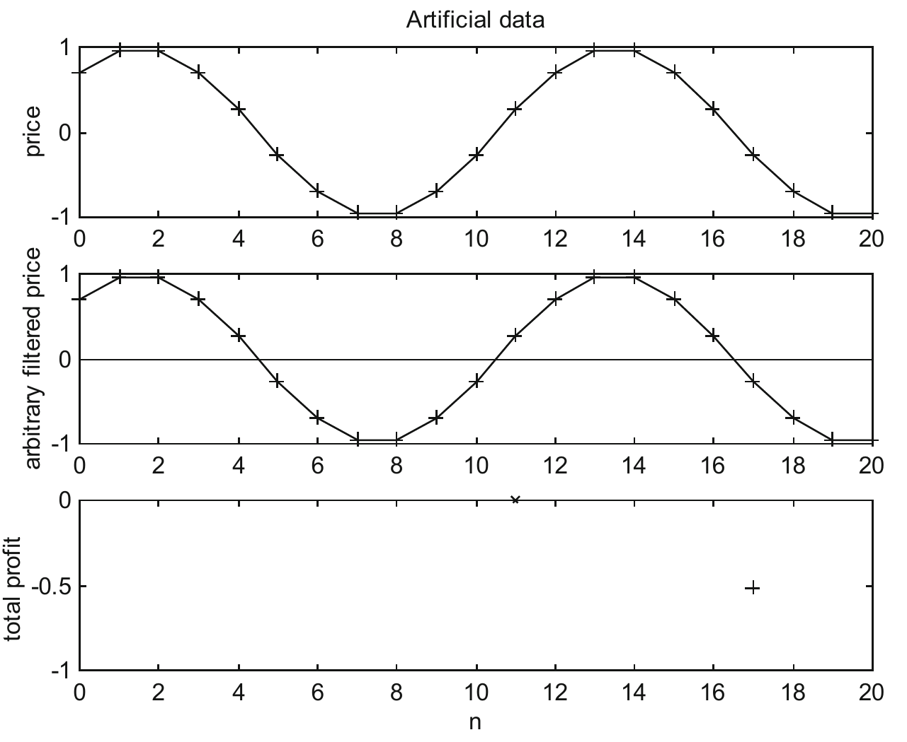

**Fig. 2.7** Price is plotted in the top figure, and the filtered price, which is arbitrarily set to be exactly the same as the price signal, is plotted in the middle figure. In the bottom figure, buy indication is marked by an \* at $n = 11$ (bought at 0.26) and sell indication by a + at $n = 17$ (sold at $-0.26$), thus making a loss of 0.52.

**Example 2.5**

Figure 2.8 shows the price signal in the top figure, which is the same as the price signal in the top figure of Fig. 2.7. The middle figure of Fig. 2.8 shows that an arbitrary phase lead $\phi$ of $\pi/12$ is added to the price data, and is then used as filtered price data. The filtered price data would then be

$$\text{Filtered Price} = \sin(\pi/6 \cdot n + \pi/4 + \pi/12)$$

As $\pi/12$ lies within the Profit Zone (0 to $\pi$), the trade should have been profitable. However, because the data is sampled, the trade actually contributes a loss of 0.52, as shown in the bottom figure. This computational result agrees with the theoretical calculation using the program buysellprice.

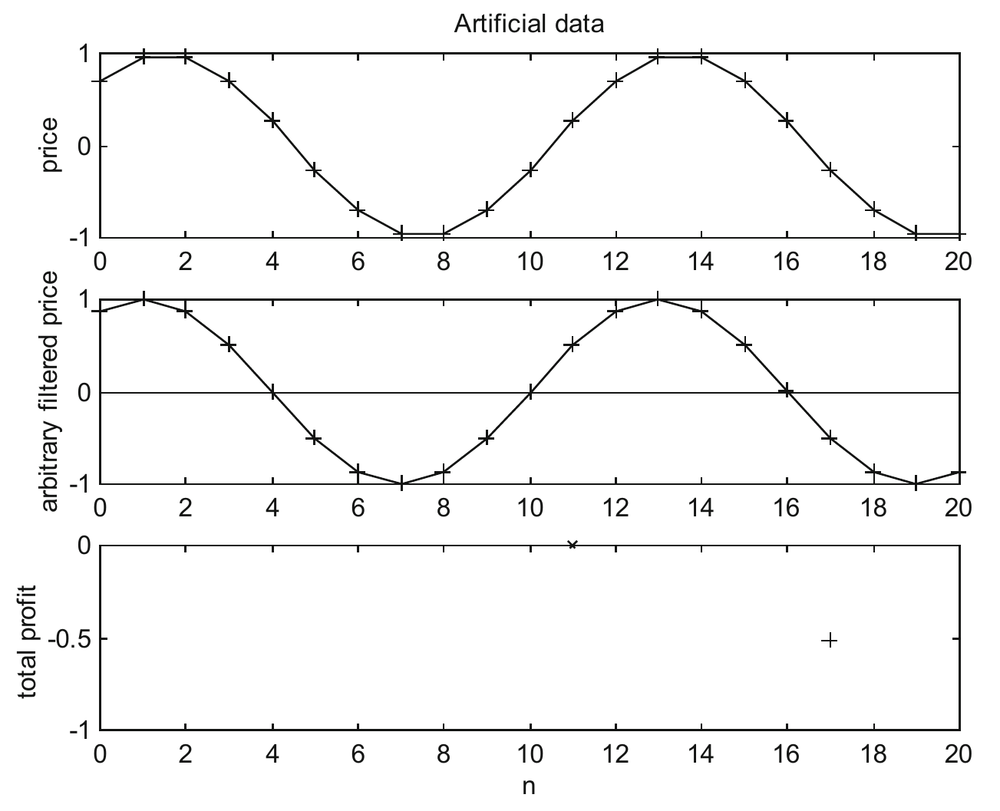

**Fig. 2.8** Price is plotted in the top figure, and the filtered price, with a phase lead arbitrarily set to $\pi/12$ from the price, is plotted in the middle figure. In the bottom figure, buy indication is marked by an \* at $n = 11$ (bought at 0.26) and sell indication by a + at $n = 17$ (sold at $-0.26$), thus making a loss of 0.52.

### 2.4.3 Sure Profit Zone and Unsure Profit Zone

For a signal with circular frequency $\omega$, if a velocity indicator has a phase lead between 0 and $\pi$, and the phase lead is larger than $\omega$, the trade will surely make a profit. We will define the region of $\omega$ where a trade will surely make profit the Sure Profit Zone. If the velocity indicator has a phase lead between 0 and $\pi$, but the phase lead is smaller than $\omega$, the trade may or may not make a profit. We will define this region of $\omega$ the Unsure Profit Zone. We will define $\mu$ to be the phase shift of the price signal caused by sampling delay. In the Unsure Profit Zone, the trade will make a profit if $\mu$ is less than the phase lead of the velocity indicator. The trade will lose money if $\mu$ is larger than the phase lead of the velocity indicator. The description of the Sure Profit Zone and Unsure Profit Zone is listed in Table 2.3.

**Table 2.3** Sure Profit Zone and Unsure Profit Zone

| Sure Profit Zone | $\phi > \omega$ | always makes a profit |
|---|---|---|
| Unsure Profit Zone | $\phi < \omega$ | $\mu \leq \phi$ ($\mu > 0$) makes a profit |
|  |  | $\mu > \phi$ ($\mu > 0$) makes a loss |

$\phi$ is the phase lead of the velocity indicator, and lies between 0 and $\pi$. $\mu$ is the phase shift of the price signal caused by sampling delay.

More details will be discussed in Appendix A and Section 3.2.1.2 in Chapter 3. Examples for the Unsure Profit Zone are given below:

**Example 2.6**

$\omega = \pi/6$ and $\phi = \pi/12$. This is an example of Unsure Profit Zone as $\phi < \omega$. $\mu = \pi/12.01$. As $\mu < \phi$, the trade is supposed to make a profit. $\theta_0 = \omega - \mu$ = the initial phase offset of the price signal.

Using the program tradeartif with the tactic parameter set to 12, Fig. 2.9 can be drawn, with the Profit % of the trade equals 25.9. This result agrees with the theoretical calculation from the program buysellprice.

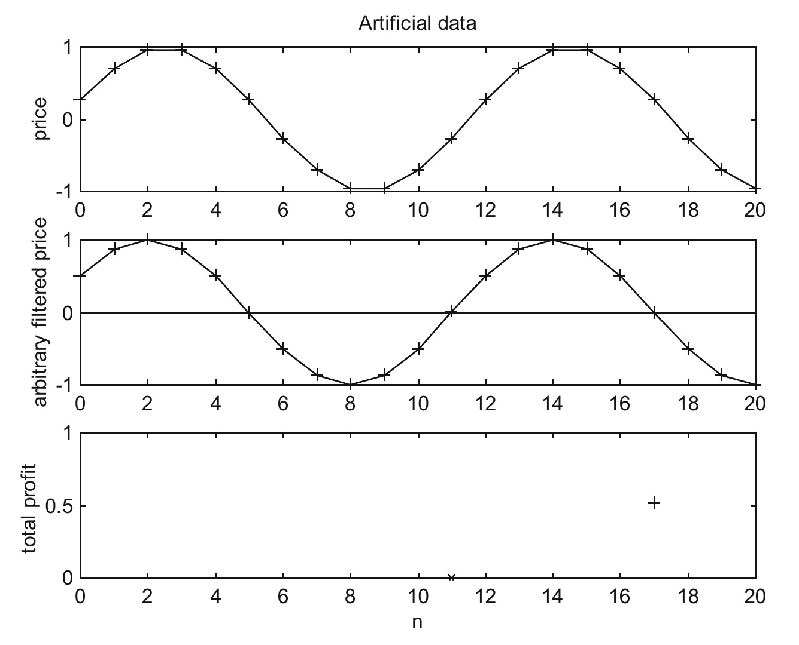

**Fig. 2.9** Price is plotted in the top figure, with the initial phase offset $\theta_0 = \omega - \mu = \pi/6 - \pi/12.01$. The filtered price, with a phase lead arbitrarily set to $\pi/12$ from the price, is plotted in the middle figure. In the bottom figure, buy indication is marked by an \* at $n = 11$ (bought at $-0.26$) and sell indication by a + at $n = 17$ (sold at 0.26), thus making a profit of 0.52, which is approximately 25.9%.

**Example 2.7**

$\omega = \pi/6$ and $\phi = \pi/12$. This is an example of Unsure Profit Zone as $\phi < \omega$. $\mu = \pi/11.99$. As $\mu > \phi$, the trade is supposed to make a loss. $\theta_0 = \omega - \mu$ = the initial phase offset of the price signal.

Using the program tradeartif with the tactic parameter set to 12, Fig. 2.10 can be drawn, with the Profit % of the trade equals $-25.9$. This result agrees with the theoretical calculation from the program buysellprice.

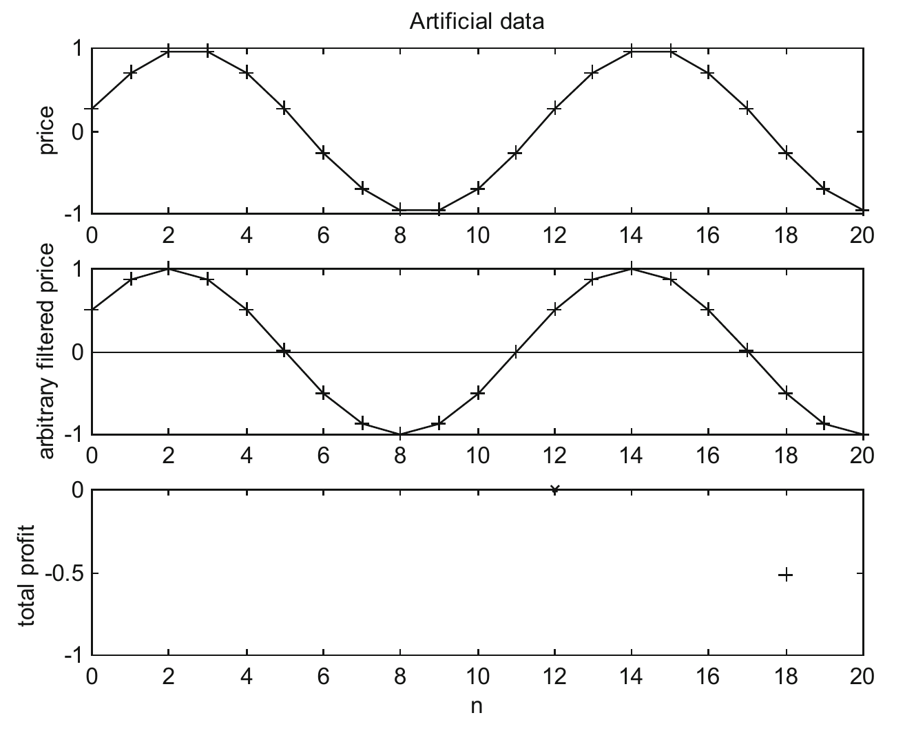

**Fig. 2.10** Price is plotted in the top figure, with the initial phase offset $\theta_0 = \omega - \mu = \pi/6 - \pi/11.99$. The filtered price, with a phase lead arbitrarily set to $\pi/12$ from the price, is plotted in the middle figure. In the bottom figure, buy indication is marked by an \* at $n = 12$ (bought at 0.26) and sell indication by a + at $n = 18$ (sold at $-0.26$), thus making a loss of 0.52, which is approximately $-25.9\%$.

Comparing Figs. 2.9 and 2.10, we can see that a slight change in the timing when the original price signal is sampled, can affect whether a trade is profitable or not. These results actually agree with the theoretical calculations shown in Fig A.1 in Appendix A. Figure A.1 also shows that even when a trade is profitable, changes in the sampling timing affects the profitability of a trade, as it has also been shown in Examples 2.1–2.3 above. This would simply mean that the earlier the trader can detect the market turning point, the better the chance that he can make a better profit if the trade is profitable, or avoid a loss, or avoid a larger loss if the trade is losing money. But how is he going to do that? There is actually a trick he can use called skipped convolution, which can be employed to detect market action earlier.

### 2.4.4 Skipped Convolution

A technical indicator convolutes with a signal to form a filtered signal. In the case of a velocity indicator, the filtered signal would emulate velocity, which would track the turning points. Traders would definitely like to detect the turning points in the market as early as possible. A new concept, called skipped convolution has been introduced in 2003 to enable earlier detection of market action (Mak 2003, 2006). Let us explain further.

For a trader who makes his decision on the daily chart, he would be looking at the closing price of each day. However, when the market turns south, he probably would like to know at what time during the day the market is turning, rather than waiting to find out at the end of the day. In that case, he can use a chart of lower time frame, e.g., an hourly chart. Assuming there are five trading hours in 1 day, he can create a daily chart from the hourly chart but with more details. A skipped convolution with a skip 5 will be used. Velocity indicator would operate on the closing prices of the first hour of each day, then on the closing prices of the second hour of each day, etc. These details would let the trader know at which hour of the day that the market is turning, rather than for him to find out at the end of the day, where loss would be much larger. He can, of course, use a half-hour chart if more details need to be known. This tactic can possibly cut his losses, or can change his trade from making a loss to making a profit, or a profitable trade to be more profitable. This tactic is particularly important when the market crashes, as a trader would like to get out of the market as soon as he knows when it is going to turn. An example of skipped convolution in real market trading would be given in Chapter 7.

Skipped convolution, of course, has its disadvantages. The trader has to monitor the market more often (unless he has an automated trading system, which lets the computer executes and monitors the trades). A trader who ordinarily monitors the market at the end of the day would have to monitor it at the end of each hour when the market opens, if he chooses hourly skipped convolution. (Of course, if the trader does not want to monitor the market every hour, he can put a stop loss order to his trade to cut his loss in case of market crash). Furthermore, if the market fluctuates during the day, more buy and sell indications can be triggered.

### 2.4.5 Profit in the Loss Zone

In contrast to loss in the Profit Zone, sampled data can cause profit in the Loss Zone in the neighborhood where the phase lead is larger than $-\pi$.

**Example 2.8**

Figure 2.11 shows an artificial price data of

$$\text{Price} = \sin(\pi/6 \cdot n + \pi/18)$$

An arbitrary phase lead of the velocity indicator, $-\pi + \pi/12$, is then added to the price data, to form the filtered price data. The filtered price data would then be

$$\text{Filtered Price} = \sin(\pi/6 \cdot n + \pi/18 - \pi + \pi/12)$$

As $-\pi + \pi/12$ lies within the Loss Zone, the trade should have lost money. However, because the data is sampled, the trade actually makes money.

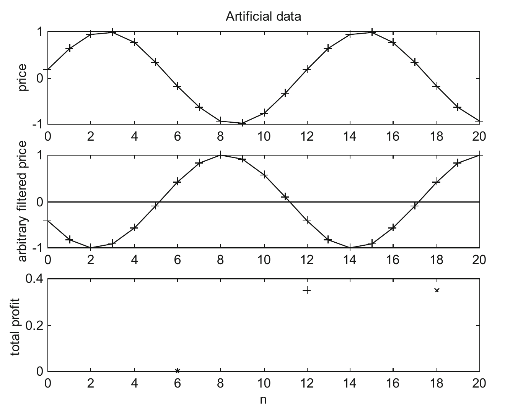

**Fig. 2.11** Price is plotted in the top figure, and the filtered price in the middle figure. In the bottom figure, buy indication is marked by an \* at $n = 6$ (bought at $-0.17$) and sell indication by a + at $n = 12$ (sold at 0.17), thus making a profit of 0.34.

The Loss Zone can be divided into Sure Loss Zone, where a trade will definitely lose money, and an Unsure Loss Zone, where a trade can make a profit or a lost. This would be detailed in Appendix A. However, as we will see later, velocity indicators having phase lead slightly larger than $-\pi$ will not be used in this book, thus the topic Profit in the Loss Zone will not be explored further.

### 2.4.6 Multiple Frequencies

In Sections 2.4.1, 2.4.2 and 2.4.3, market price data is described as having one single frequency. However, quite often, they are made up of multiple frequencies, each frequency having various phase shifts from others. As velocity indicators have been designed to retain low frequencies as well as high frequencies (as we would see in later chapters), buy/sell indications, and therefore profitability of low frequencies trades can be affected by the presence of high frequency components.

Furthermore, the actual velocity indicators created so far (as we will see in later chapters) lead the price signal by the ideal $\pi/2$ radians only at $\omega = 0$, and lead the price signal by less than $\pi/2$ radians at other $\omega$'s. Thus, finding the velocity of the actual real market data is a complicated issue. Hopefully, we can cast some light in solving the real problem by calculating the phase shifts of the velocity indicators across the whole frequency spectrum.

## 2.5 Acceleration

Another term that we can borrow from Physics is acceleration, which is the rate of change of velocity. We can consider it to be the slope of the slope of the curve, which is called second derivative in Calculus. Assume again that the curve is a sine wave, then the second derivative of a sine wave, according to Calculus, is a minus sine wave, which leads a sine wave by $\pi$ radians ($= 180°$). It is plotted in Fig. 2.12 as a green curve. Note that when acceleration is +ve (e.g., from $t = 20$ to 40), the price data is concave up. And when acceleration is −ve (e.g., from $t = 40$ to 60), the price data is concave down. When acceleration changes from −ve to +ve, the slope of the velocity changes from −ve to +ve. When acceleration changes from +ve to −ve, the slope of the velocity changes from +ve to −ve. This, of course, should be obvious.

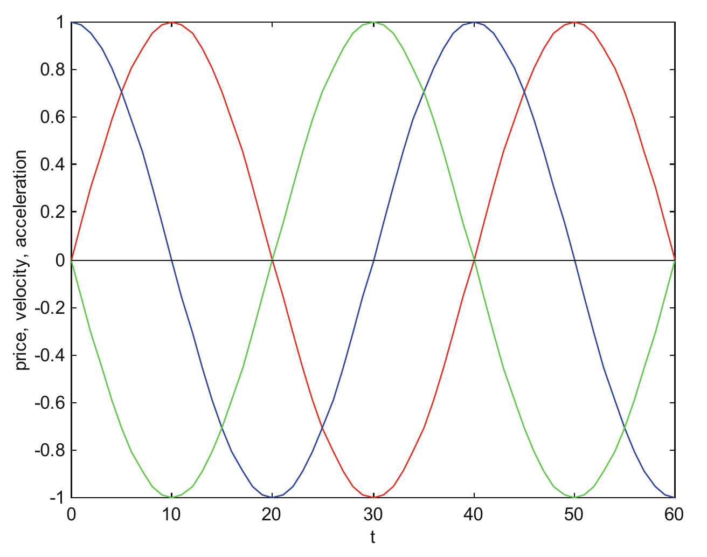

**Fig. 2.12** Simulated price data. Price (plotted as a red line) is plotted versus time $t$, as a sine wave with a period of 40 trading days. Velocity is plotted as a blue line. It represents the slope of the price. Acceleration is plotted as a green line. It represents the slope of the slope of the price.

We can compare velocity and acceleration to driving a car in a straight line. When the car is being driven forward, velocity is +ve. When the car is being reversed or driven backward, velocity is −ve. When the car is driving forward, and the driver steps on the pedal, the car is accelerating. When the driver eases up on the pedal, the car is decelerating, i.e., acceleration is −ve, and velocity is slowing. However, the car is still going forward, and distance is increasing. In trading, that means when acceleration is negative, the price can still go up (e.g., $t = 40$ to 50). By the same token, when acceleration is positive, the price can still go down (e.g., $t = 20$ to 30). Thus, acceleration does not play any role in whether market price is going up or down. However, in principle, it can play a role in deciding whether traders would get out of the market or hold their positions, as we will show later.

Acceleration would not be of much use when the price data looks like a sine wave, as the information of velocity is sufficient for the traders to make decision. However, quite often, the price data rises to a local maximum, retraces to a local minimum, and then continues upward (Mak 2003). Figure 2.13 shows such an example, where the price data is simulated by a cubic function. The slope of the price data or velocity would be zero at both turning points. When the market continues in the same direction after the two turning points, the slope of the slope, or acceleration at the two turning points are close to zero and points up. This can be compared with the acceleration pattern of the sine wave when it experiences a major turning point turning down, when acceleration is not close to zero (Fig. 2.12).

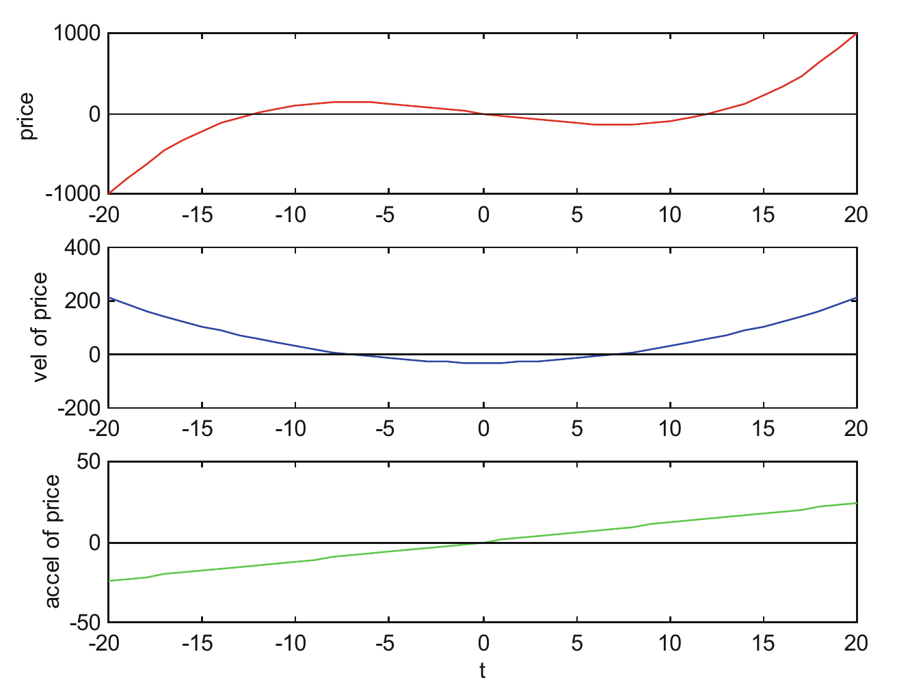

**Fig. 2.13** Price data simulated by a cubic function. At the first turning point, velocity is zero, implying that the price will go down. However, acceleration, though negative, is pointing up, implying that it can change to positive. Acceleration changing from negative to positive, means that the price curve changes from concave down to concave up.

At $t \approx -7$, velocity changes from +ve to −ve, meaning that the price data will be going south, and the trader should sell. However, it can be seen that the acceleration is increasing, implying the price data can change from a concave down to a concave up pretty soon. Thus, instead of selling, the trader can choose to hold. An example of real data can be found in Fig. 6.11 of Mak (2003).

Figure 2.14 shows a cubic function which falls to a local minimum, then traces to a local maximum and then continues downward. The slope of the price data are zero at the two turning points. When the market continues in the same original direction, the slope of the slope or the acceleration are close to zero and points down. This can be compared with the acceleration pattern of the sine wave when it experiences a major turning point turning up, when acceleration is not close to zero (Fig. 2.12).

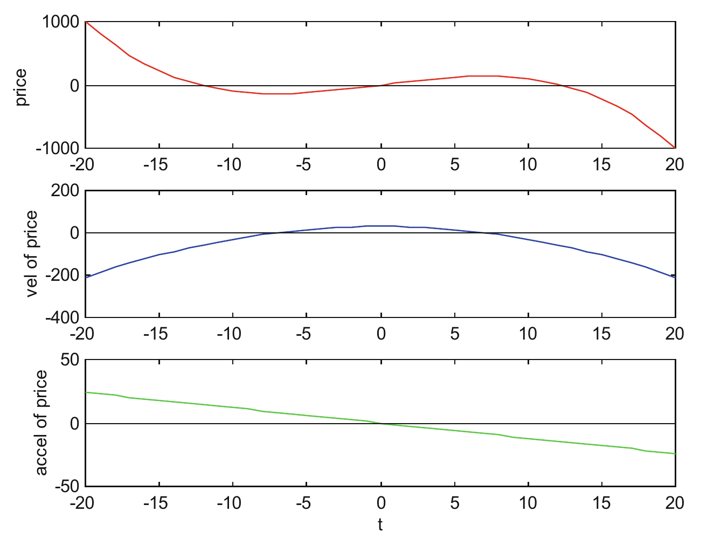

**Fig. 2.14** Price data simulated by a cubic function. At the first turning point, velocity is zero, implying that the market price may turn up. However, acceleration, though positive, is pointing down, implying that it can turn negative, and the market can go further down shortly. Acceleration changing from positive to negative, means that the price curve changes from concave up to concave down.

At $t \approx -7$, velocity changes from −ve to +ve, meaning that the price data will be going north, and the trader should buy. However, it can be seen that the acceleration is decreasing, implying the price data can change from a concave up to a concave down pretty soon. Thus, instead of buying, the trader can choose to hold if he sells short.

## 2.6 Acceleration Indicators

Acceleration indicators (Mak 2003, 2006) simulating acceleration should ideally lead the price signal by $\pi$ radians $= 180°$. However, the actual acceleration indicators created so far only lead the price signal by $\pi$ radians at $\omega = 0$, and lead the price signal by less than $\pi$ radians at other $\omega$'s. Thus, they are not used as acceleration indicators in trading, but are sometimes used as velocity indicators instead. Traders may not have realized that using acceleration indicators as velocity indicators actually has an advantage, as the ideal phase lead for velocity is $\pi/2$, which lies in the middle between 0 and $\pi$, the region where profit will be made.

Velocity indicators and acceleration indicators play a significant role in many traders' tactics, even though they may not have realized it. We will discuss these further in later chapters.
