# 3 Simple Moving Average

moving average, the price of each of the last 10 days will be multiplied by 1/10, and these reduced prices will be added to form the moving average. $1/N$ is called the unit sample (impulse) response $h(k)$, where $k = 0, 1, 2, \ldots, N-1$. For a 10-day moving average, $h(0) = h(1) = \ldots = h(9) = 1/10$. In signal processing, the unit sample response of a dynamic system (or technical indicator, in trading terminology) is its output when presented with a brief input signal, called an impulse. Here, each daily price is an impulse.

Figure 3.1 shows the S & P 500 daily index data taken from April 24, 2019 to August 12, 2019. A 10-day Simple Moving Average, plotted as a line, is used to smooth the data, showing that it lags behind the index.

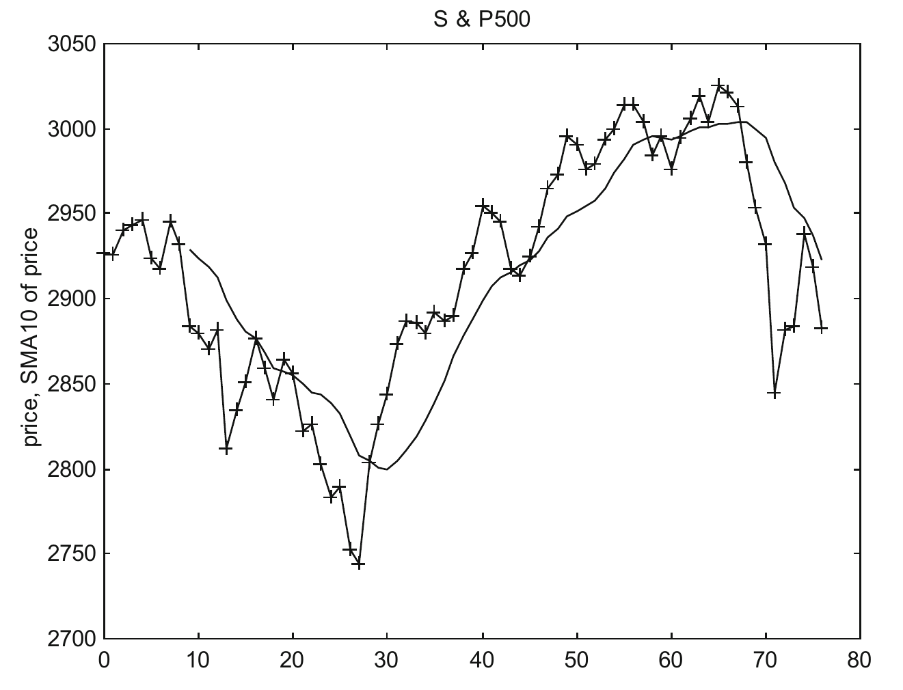

**Fig. 3.1** The S & P 500 daily index from April 24, 2019 to August 12, 2019 are plotted (+), together with a 10-day Simple Moving Average (SMA) plotted as a line. Note that the SMA lags behind the index.

As emphasized in Mak (2003), it will be very informative for the traders to find out the frequency response of the unit sample response, $H(\omega)$, which is also called the Discrete Time Fourier Transform (DTFT) of the unit sample response. The frequency response will yield the amplitude as well as the phase (or time) lag of a signal at various frequencies. In signal processing, it is more common to find the frequency response in terms of the circular frequency $\omega$, where $\omega = 2\pi \times \text{frequency}$. Frequency is equal to $1/\text{period}$, where period is the duration of a cycle. If the price data goes through a 40 day cycle, frequency is equal to $1/(40 \text{ days})$. The circular frequency $\omega$ will be equal to $2\pi \times (1/40) = \pi/20$ radians. The equations of the frequency response of the SMA is given in Appendix B.

In Engineering, the amplitude response is important, and phase response is almost never calculated. However, in trading, phase is significant, as it tells the time delay of the output signal from the input signal after being operated on by the technical indicator.

## 3.1 Simple Moving Average (SMA)

### 3.1.1 Simple Moving Average, N = 10

The amplitude response of a simple moving average with $N = 10$ is shown in Fig. 3.2. It can be seen that the amplitude is zero at several frequencies.

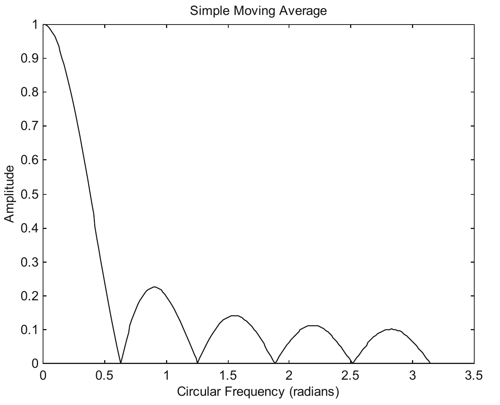

**Fig. 3.2** The amplitude response of a simple moving average with $N = 10$.

From the Eq. (B.4) in Appendix B, one can see that the amplitude response of an $N$ point moving average is zero when

$$\omega = 2m\pi/N, \quad \text{where } m = 1, 2, 3, 4, 5, \ldots$$

Thus, for a 10 point moving average, i.e., $N = 10$, its amplitude response is zero when

$$\omega = \pi/5\ (\approx 0.628),\ 2\pi/5\ (\approx 1.257),\ 3\pi/5\ (\approx 1.885),\ 4\pi/5\ (\approx 2.513),\ \pi, \ldots \quad \text{radians}$$

as are shown in Fig. 3.2. That is, the simple moving average of the signal at those frequencies completely disappears from the radar.

Figure 3.3 shows one cycle of a sine wave of $\omega = \pi/5$. It can be seen that addition of those 10 points would yield a sum of 0. And that is why a simple moving average of the sine wave at that frequency would disappear.

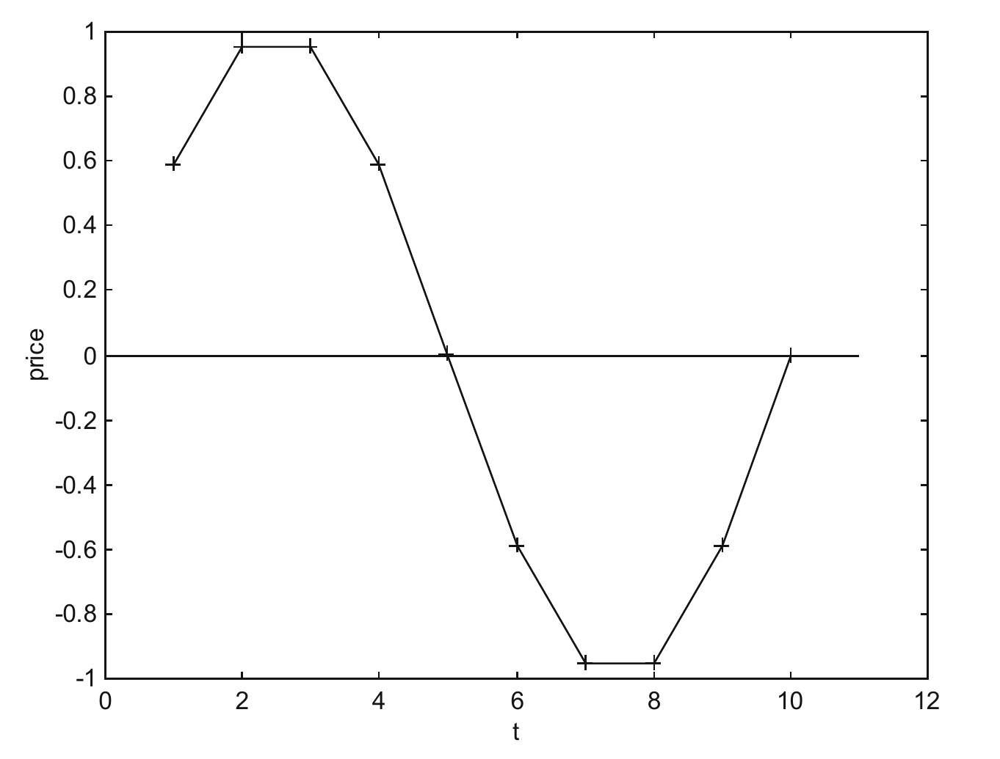

**Fig. 3.3** One cycle of a sine wave of $\omega = \pi/5$. Addition of these 10 points (shown as +) would yield a sum of 0.

#### 3.1.1.1 Wrapped and Unwrapped Phase

The phase of an indicator computed in trading programs is a wrapped phase, which is equal to the phase computed in DTFT using arctangent.

Figure 3.4 shows the wrapped phase of the phase response of a simple moving average with $N = 10$. Simple Moving Average, acting as a filter to the input signal, delays the signal by the wrapped phase, which is the angle of the frequency response of the unit sample response, $H(\omega)$. The wrapped phase is constrained to lie between the interval $-\pi$ to $\pi$, or $0$ to $2\pi$ and does not necessarily represents the actual phase delay. The unwrapped phase, which is the actual phase delay, can be calculated from the wrapped phase by adding appropriate multiples of $\pi$, so that the frequency phase response is a continuous function of frequency. The unwrapped phase of the phase response of a simple moving average with $N = 10$ can be calculated from Eq. (B.7) in Appendix B, and is shown in Fig. 3.5.

The unwrapped phase of $H(\omega)$ of the SMA, for $N$, is given by (Mak 2003)

$$\phi(\omega) = -((N - 1)/2) \cdot \omega \tag{B.7}$$

which is linear with respect to $\omega$.

So, for $N = 10$,

$$\phi(\omega) = -(9/2)\,\omega$$

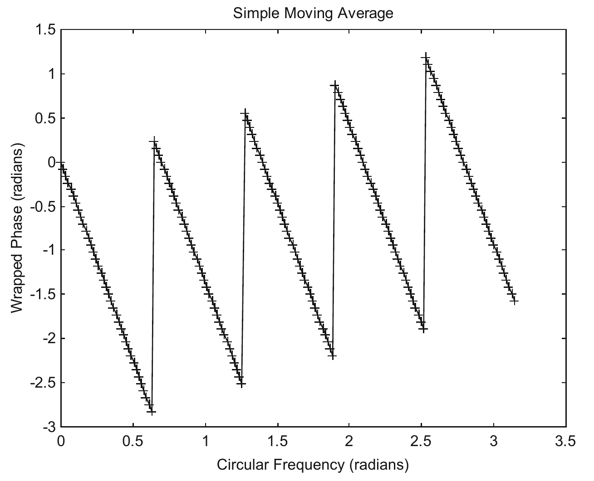

**Fig. 3.4** The wrapped phase of the phase response of a simple moving average with $N = 10$.

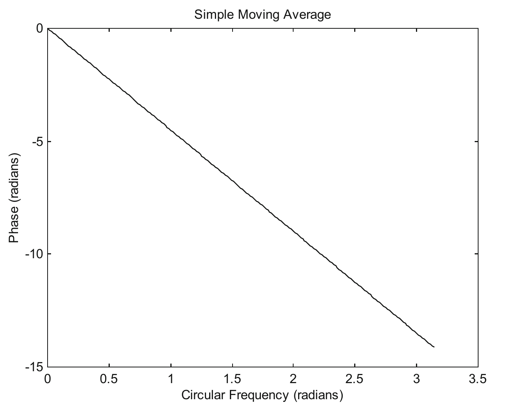

**Fig. 3.5** The unwrapped phase of the phase response of a simple moving average with $N = 10$.

At those points where the amplitudes of SMA with $N = 10$ are 0, using Eq. (B.8), the wrapped phases $\phi(\omega)$ approaches

$$-(9/10)\,m\pi, \quad \text{where } m = 1, 2, 3, 4, 5, \ldots \tag{3.1}$$

These wrapped phases and their corresponding unwrapped phases of SMA with $N = 10$ is shown in Table 3.1. The wrapped phase numbers correspond to the minimal points in Fig. 3.4. The amplitude, wrapped phase and unwrapped phase of the SMA can be computed from the program `sma`.

**Table 3.1** Wrapped phases and unwrapped phases of SMA with $N = 10$, for Eq. (3.1) with $m = 1, 2, 3, 4, 5$. Amplitudes of SMA of the signals are 0.

| $m$ | Wrapped phase (radians) | Unwrapped phase (radians) |
|-----|------------------------|--------------------------|
| 1 | −2.83 | $(9/10)\pi$ (= −2.83) |
| 2 | −2.52 | $(9/10)\,2\pi$ (= −5.66 = −2.52 − π) |
| 3 | −2.19 | $(9/10)\,3\pi$ (= −8.48 = −2.19 − 2π) |
| 4 | −1.89 | $(9/10)\,4\pi$ (= −11.31 = −1.89 − 3π) |
| 5 | −1.57 | $(9/10)\,5\pi$ (= −14.14 = −1.57 − 4π) |

#### 3.1.1.2 How Does the Wrapped and Unwrapped Phase Affect the Smoothed Output of a Signal?

We will show how the wrapped and unwrapped phase affect the smoothed output of a signal. Figures 3.6, 3.7, 3.8, 3.9, 3.10, 3.11, and 3.12 shows the 10 point Simple Moving Average (SMA) of price simulated as a sine wave with frequencies $\omega$ taken from Table 3.2. The SMA of price is phase shifted from the price by the wrapped phase. From Figs. 3.6, 3.7, and 3.8, the unwrapped phase is the same as the wrapped phase. Figure 3.9 is a more detailed version of Fig. 3.3. In Fig. 3.9, $\omega = \pi/5 \approx 0.628$ radians, the amplitude of the 10 point Simple Moving Average (SMA) equals 0, and the phase $\phi(\omega)$ approaches −2.83 radians, in consistent with Fig. 3.4, and Table 3.1. For an $\omega$ slightly larger than $\pi/5$, e.g., $\pi/4.95 \approx 0.6346$, amplitude = 0.0101, the wrapped phase, as shown in Fig. 3.4, is slightly larger than 0 (the unwrapped phase would be slightly larger than $-\pi$), it can be shown that the wrapped SMA does lead the signal slightly (figure not shown here).

**Table 3.2** Wrapped phases, unwrapped phases and amplitudes of the frequency response of the SMA with $N = 10$ at various frequencies.

| $\omega$ (radians) | Wrapped phase (radians) | Unwrapped phase (radians) | Amplitude | Figure |
|---------------------|------------------------|--------------------------|-----------|--------|
| $\pi/20.83 \approx 0.15$ | −0.68 | −0.68 | 0.9 | 3.6 |
| $\pi/9 \approx 0.35$ | $-\pi/2$ | $-\pi/2$ | 0.57 | 3.7 |
| $\pi/6.283 \approx 0.5$ | −2.25 | −2.25 | 0.24 | 3.8 |
| $\pi/5 \approx 0.628$ | −2.83 | −2.83 | 0 | 3.9 |
| $2\pi/9 \approx 0.698$ | 0 | $-\pi$ | 0.09 | 3.10 |
| $3\pi/9 \approx 1.047$ | $\pi/2$ | $-3\pi/2$ | 0.17 | 3.11 |
| $4\pi/9 \approx 1.396$ | 0 | $-2\pi$ | 0.1 | 3.12 |

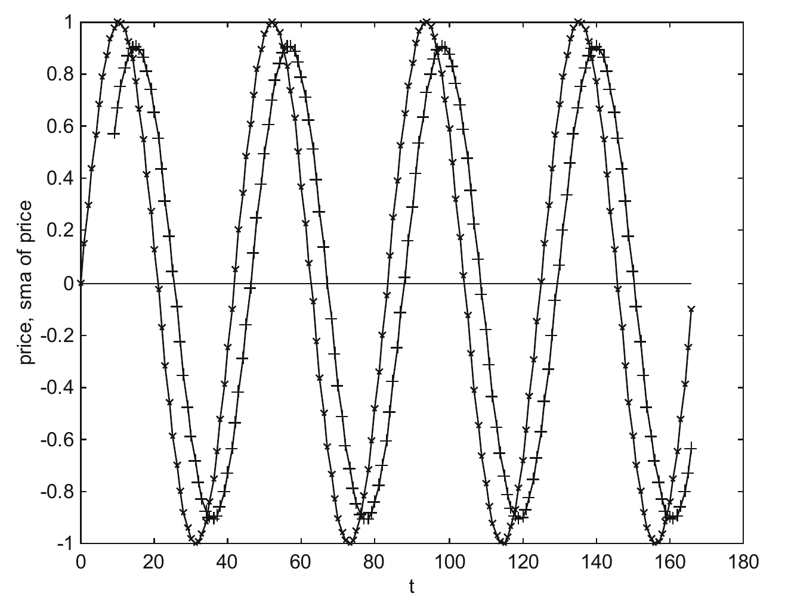

**Fig. 3.6** Price simulated as a sine wave (marked as x) of amplitude = 1 and $\omega = \pi/20.83 \approx 0.15$ radian. Its 10 point Simple Moving Average (SMA) (marked as +) has a phase $\phi(\omega)$ of −0.68 radian from the sine wave. The amplitude of the Simple Moving Average is approximately 0.90. If a trader buys when the price crosses the SMA from below, and sells when the price crosses the SMA from above, he will make about 90% of the maximum possible profit. This figure can be drawn with the program `smasig`.

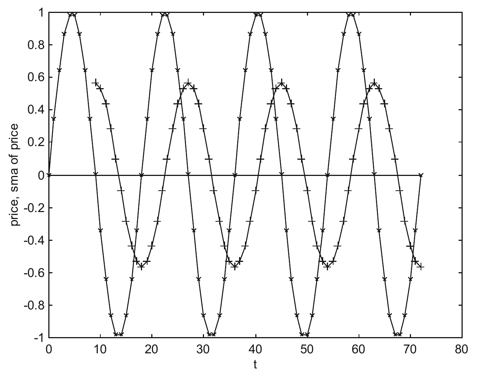

**Fig. 3.7** Price simulated as a sine wave (marked as x) of amplitude = 1 and $\omega = \pi/9 \approx 0.35$ radian. Its 10 point Simple Moving Average (SMA) (marked as +) has a phase $\phi(\omega)$ of $-\pi/2$ radians from the sine wave. The amplitude of the Simple Moving Average is approximately 0.57.

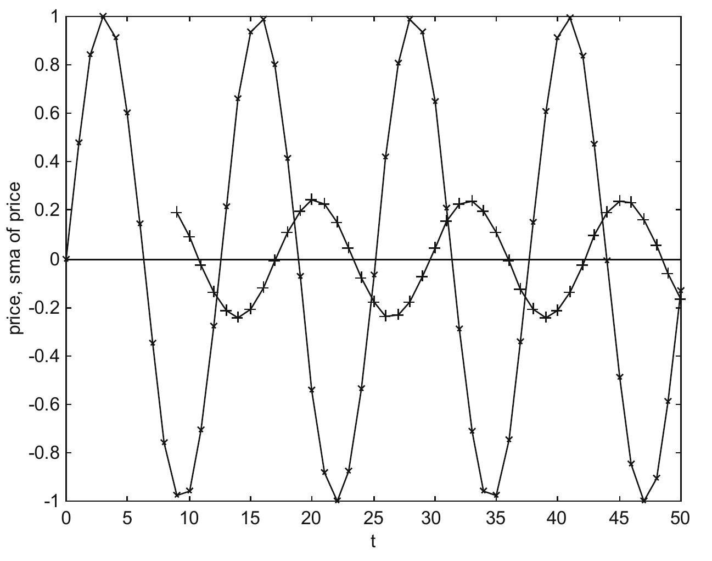

**Fig. 3.8** Price simulated as a sine wave (marked as x) of amplitude = 1 and $\omega = \pi/6.283 \approx 0.5$ radian. Its 10 point Simple Moving Average (SMA) (marked as +) has a phase $\phi(\omega)$ of −2.25 radians from the sine wave. The amplitude of the Simple Moving Average is approximately 0.24.

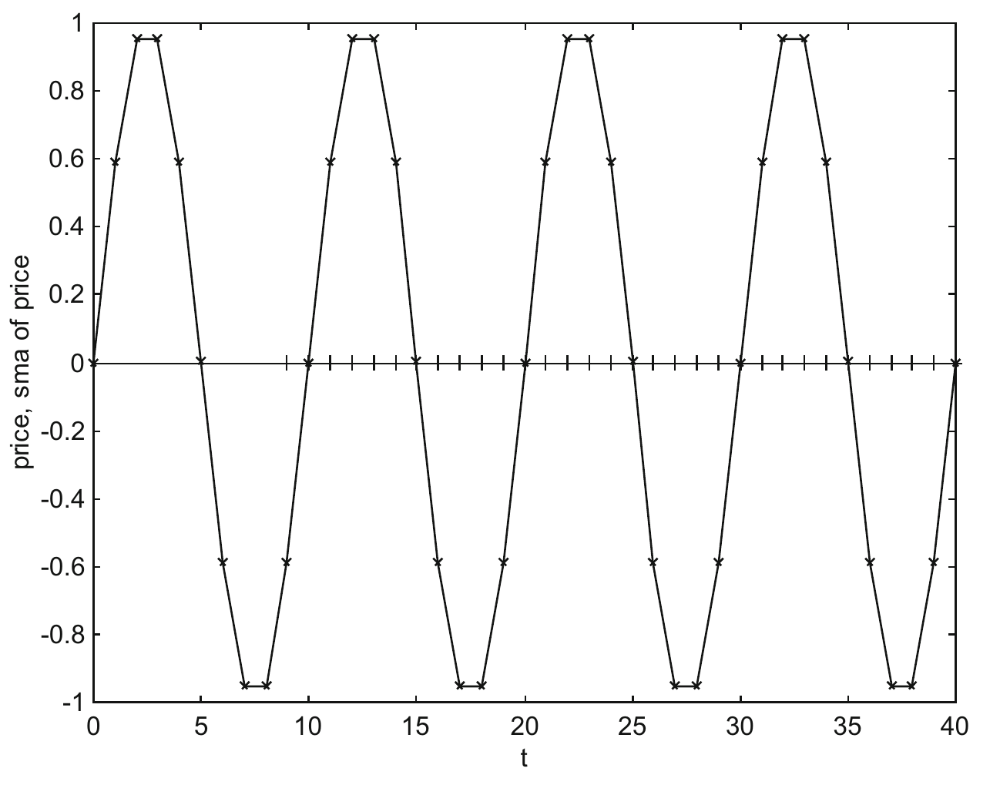

**Fig. 3.9** Price simulated as a sine wave (marked as x) of amplitude = 1 and $\omega = \pi/5 \approx 0.63$ radian. Its 10 point Simple Moving Average (SMA) (marked as +) approaches a phase $\phi(\omega)$ of −2.83 radians from the sine wave. The amplitude of the Simple Moving Average equals 0.

For Figs. 3.10, 3.11, and 3.12, $\omega$ is larger than $\pi/5$ ($\approx 0.628$), the unwrapped phase shift, which represents the real phase delay, is different from the wrapped phase shift. This simply means that the apparent SMA, as calculated in trading programs provided to traders, does not actually offer a real representation of the SMA of the price, and thus can cause errors in trading tactics using SMA as a technical indicator.

Nevertheless, we will see in the Fourier Analysis of real market data in Chapter 7, that the amplitudes of frequencies of $\omega$ less than 0.5 is much larger than those of frequencies of $\omega$ larger than 0.5, with amplitudes of frequencies of $\omega$ less than 0.11 most significant. Thus, trading tactics employing SMA with $N = 10$, may not be much affected. However, trading tactics using SMA with $N$ much larger than 10, may contain errors. Thus, systematic errors do occur in Awesome Oscillator and Accelerator Oscillator, two popular trading indicators employing SMA with $N$ larger than 10. We will further explain these problems in Chapter 5.

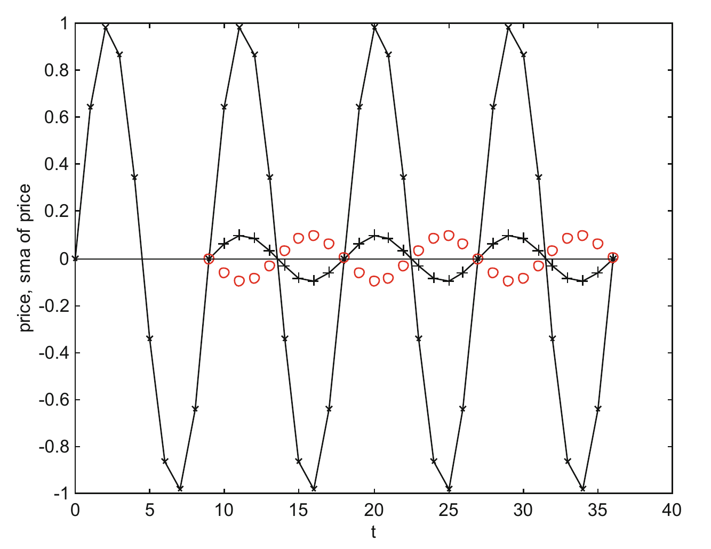

**Fig. 3.10** Price simulated as a sine wave (marked as x) of amplitude = 1 and $\omega = 2\pi/9 \approx 0.698$ radian. Its 10 point Simple Moving Average (SMA) (marked as +) has a wrapped phase $\phi(\omega)$ of 0 radian from the sine wave. Its unwrapped phase is actually $-\pi$ radians and is marked by a red o. The amplitude of the Simple Moving Average is approximately 0.09. The program `smasig2` is used to plot this figure.

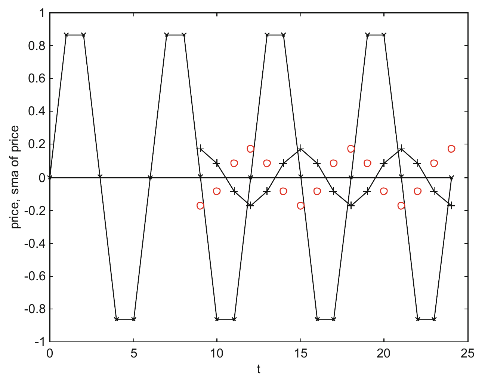

**Fig. 3.11** Price simulated as a sine wave (marked as x) of amplitude = 1 and $\omega = 3\pi/9 \approx 1.05$ radians. Its 10 point Simple Moving Average (SMA) (marked as +) has a wrapped phase $\phi(\omega)$ of $\pi/2$ radian from the sine wave. Its unwrapped phase is actually $-3\pi/2$ radians and is marked by a red o. The amplitude of the Simple Moving Average is approximately 0.17. The program `smasig2` is used to plot this figure.

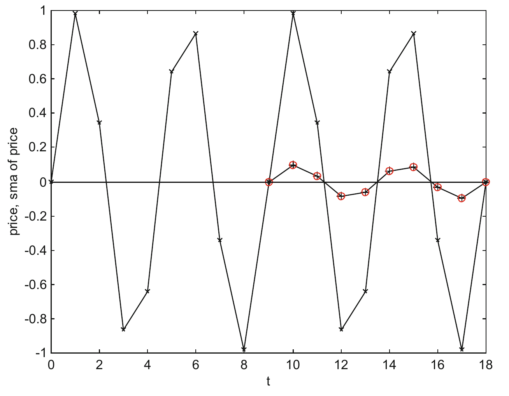

**Fig. 3.12** Price simulated as a sine wave (marked as x) of amplitude = 1 and $\omega = 4\pi/9 \approx 1.4$ radians. Its 10 point Simple Moving Average (SMA) (marked as +) has a wrapped phase $\phi(\omega)$ of 0 radian from the sine wave. Its unwrapped phase is actually $-2\pi$, and is marked by a red o. As sine wave has a period of $2\pi$, SMA with unwrapped phase here appears the same as SMA with wrapped phase. The amplitude of the Simple Moving Average is approximately 0.1. The program `smasig2` is used to plot this figure.

### 3.1.2 Simple Moving Average, N = 20

The amplitude response of a simple moving average with $N = 20$ is shown in Fig. 3.13. Again it can be seen that the amplitude is zero at several frequencies.

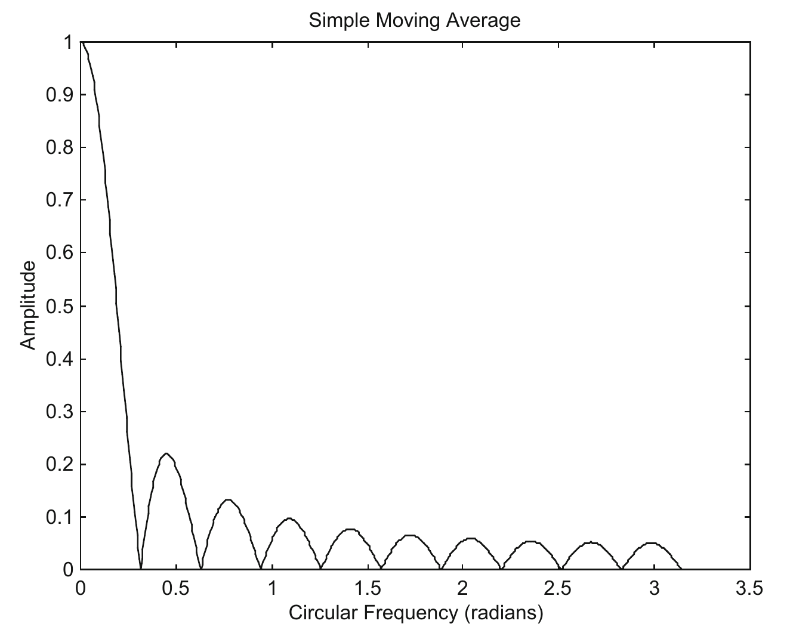

**Fig. 3.13** The amplitude response of a simple moving average with $N = 20$.

From Eq. (B.4) in Appendix B, one can see that the amplitude response of an $N$ point moving average is zero when

$$\omega = 2m\pi/N, \quad \text{where } m = 1, 2, 3, 4, 5, \ldots$$

Thus, amplitude response of SMA, $N = 20$ is zero when

$$\omega = \pi/10\ (\approx 0.314),\ \pi/5,\ 3\pi/10,\ 4\pi/10,\ \pi/2, \ldots \quad \text{radians}$$

as are shown in Fig. 3.13.

The wrapped phase of the phase response of SMA with $N = 20$ is shown in Fig. 3.14, and its unwrapped phase in Fig. 3.15. For $\omega$ larger than $\pi/10$ ($\approx 0.314$), the unwrapped phase shift, which represents the real phase delay, is different from the wrapped phase shift.

The unwrapped phase of $H(\omega)$ of the SMA, for $N$, is given by

$$\phi(\omega) = -((N - 1)/2) \cdot \omega \tag{B.7}$$

So, for $N = 20$, $\phi(\omega) = -(19/2)\,\omega$

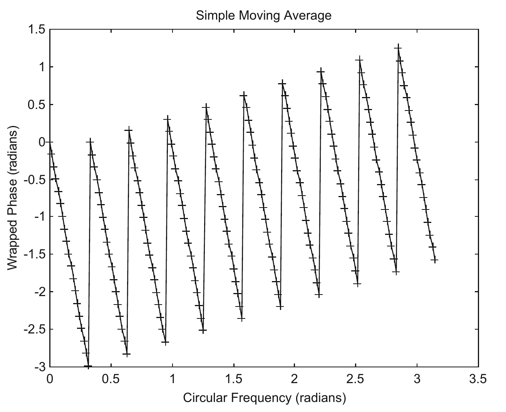

**Fig. 3.14** The wrapped phase of the phase response of a simple moving average with $N = 20$.

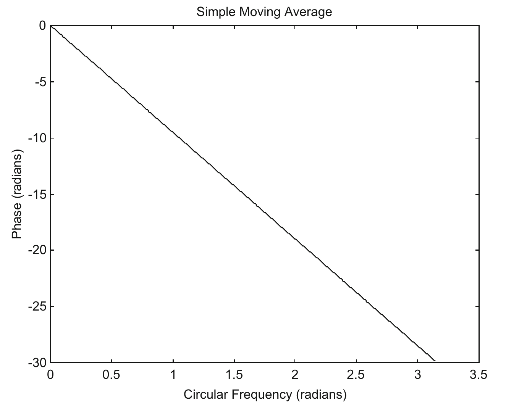

**Fig. 3.15** The unwrapped phase of the phase response of a simple moving average with $N = 20$.

Examples of the unwrapped phase of SMA with $N = 20$, calculated from Eq. (B.7) are given in Table 3.3.

**Table 3.3** Examples of unwrapped phase and amplitudes of SMA with $N = 20$ at various frequencies.

| $\omega$ (radians) | Unwrapped phase, $\phi(\omega)$ (radians) | Amplitude |
|---------------------|------------------------------------------|-----------|
| $\pi/19 = 0.165$ | $-\pi/2$ | 0.61166 |
| $2\pi/19 = 0.331$ | $-\pi$ | 0.0565 |
| $3\pi/19 = 0.496$ | $-3\pi/2$ | 0.1972 |
| $4\pi/19 = 0.661$ | $-2\pi$ | 0.0563 |

### 3.1.3 Simple Moving Average, N = 100

The amplitude response of a simple moving average with $N = 100$ is shown in Fig. 3.16. Again it can be seen that the amplitude is zero at several frequencies. From Eq. (B.4) in Appendix B, its amplitude response is zero when

$$\omega = \pi/50\ (\approx 0.0628),\ 2\pi/50,\ 3\pi/50,\ 4\pi/50,\ \pi/10,\ 6\pi/50,\ 7\pi/50,\ 8\pi/10\ (\approx 0.503), \ldots \quad \text{radians}$$

as are shown in Fig. 3.16.

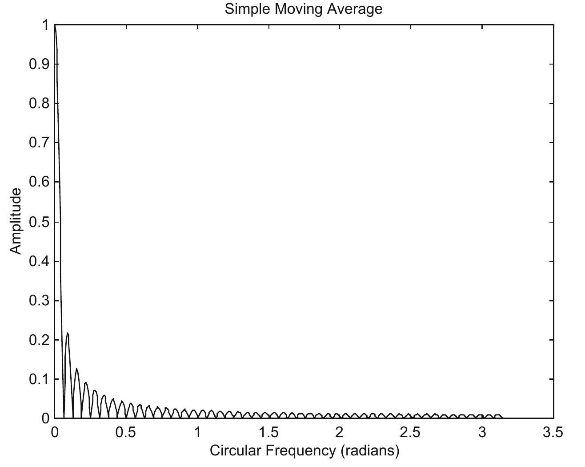

**Fig. 3.16** The amplitude response of a simple moving average with $N = 100$.

The wrapped phase of the phase response of the simple moving average with $N = 100$ is shown in Fig. 3.17, and its unwrapped phase in Fig. 3.18. For $\omega$ larger than $\pi/50$ ($\approx 0.0628$), the unwrapped phase shift, which represents the real phase delay, is different from the wrapped phase shift.

The unwrapped phase of $H(\omega)$ of the SMA, for $N$, is given by

$$\phi(\omega) = -((N - 1)/2) \cdot \omega \tag{B.7}$$

So, for $N = 100$, $\phi(\omega) = -(99/2)\,\omega$

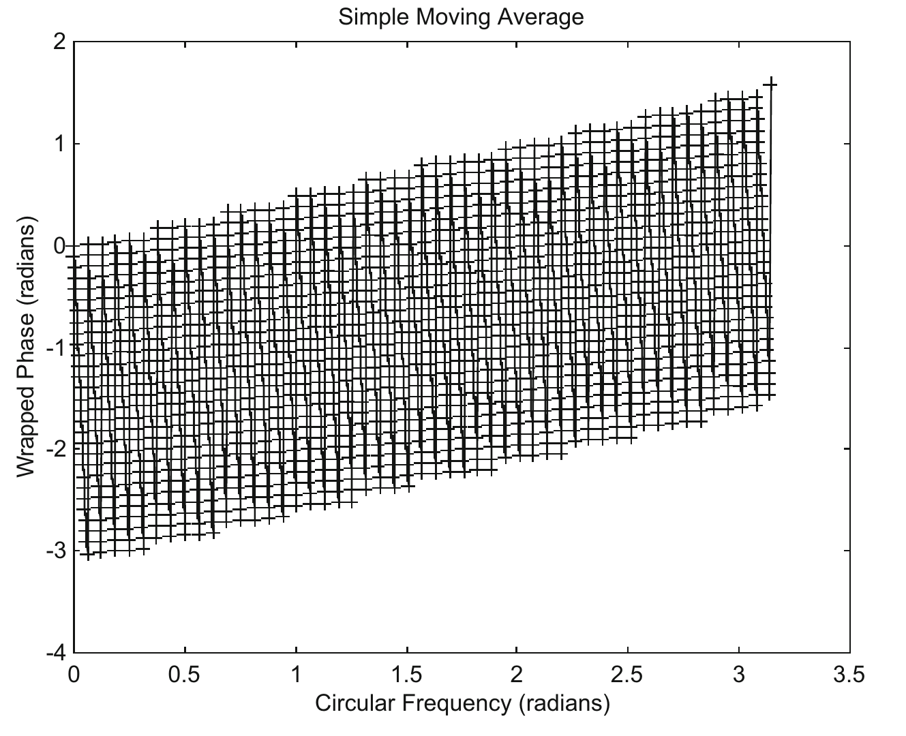

**Fig. 3.17** The wrapped phase of the phase response of a simple moving average with $N = 100$.

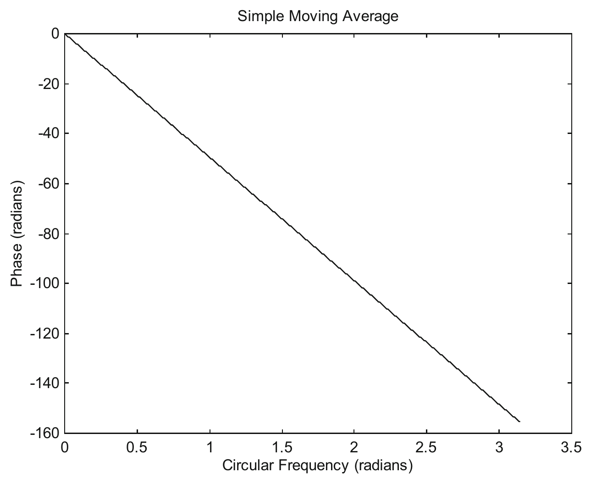

**Fig. 3.18** The unwrapped phase of the phase response of a simple moving average with $N = 100$.

Examples of the unwrapped phase of SMA with $N = 100$, calculated from Eq. (B.7) are given in Table 3.4. Comparing the numbers in Table 3.4 with those in Table 3.3, it can be seen that the unwrapped phase decreases much faster for $N = 100$ than $N = 20$, as is also obvious from Eq. (B.7).

**Table 3.4** Examples of unwrapped phase and amplitudes of SMA with $N = 100$ at various frequencies.

| $\omega$ (radians) | Unwrapped phase, $\phi(\omega)$ (radians) | Amplitude |
|---------------------|------------------------------------------|-----------|
| $\pi/99 = 0.0317$ | $-\pi/2$ | 0.6366 |
| $2\pi/99 = 0.0635$ | $-\pi$ | 0 |
| $3\pi/99 = 0.0952$ | $-3\pi/2$ | 0.2123 |
| $4\pi/99 = 0.1269$ | $-2\pi$ | 0 |

Trading tactics using SMA with $N$ larger than 100 (Chan et al. 2014) are quite popular among traders. However, as said earlier, the Simple Moving Average has two disadvantages. Its amplitude can disappear at certain frequencies, and its phase delay can differ from the real phase delay. The problem is more amplified at large $N$, e.g., $N = 100$. As we will see in Chapter 7, frequencies, $\omega$, of real market data are more relevant when $\omega$ is less than 0.5 radian. However, for $N = 100$, the amplitudes of its SMA are zero ten times for $\omega$ less than 0.5 radian, and its unwrapped phases differ from the wrapped phases for $\omega$ larger than $\pi/50$ ($\approx 0.0628$ radian), and thus, not representing the real time delay. Thus, trading tactics employing SMA, and especially with $N$ larger than e.g., 20 can generate a lot of erroneous signals.

## 3.2 Trading Tactics Using Simple Moving Average

A simple trading tactic that has been used by traders is to buy when the price crosses over the SMA of the price from below, and sells when price crosses over the SMA of the price from above. As (Price − SMA of Price) can be considered as a velocity indicator, the trading tactic is the same as buy when velocity changes from negative to positive, and sell when velocity changes from positive to negative. The mathematics of the frequency response of (Price − SMA of Price) can be found in section B.3 of Appendix B. The frequency response will be symbolized as $(1 - \text{SMA})$ (see Appendix B).

### 3.2.1 Price − Simple Moving Average of Price, N = 10

The amplitude of the frequency response of $(1 - \text{SMA}, N = 10)$ is plotted in Fig. 3.19. Just like any velocity indicator, it is a high pass filter, filtering off the low frequency components. From Fig. 3.19, it can be seen that, for an input signal, a certain portion of $\omega$ less than 0.5 radians are retained in the output. This is useful as real market data contains significant percentage of low frequency components less than 0.5 radian.

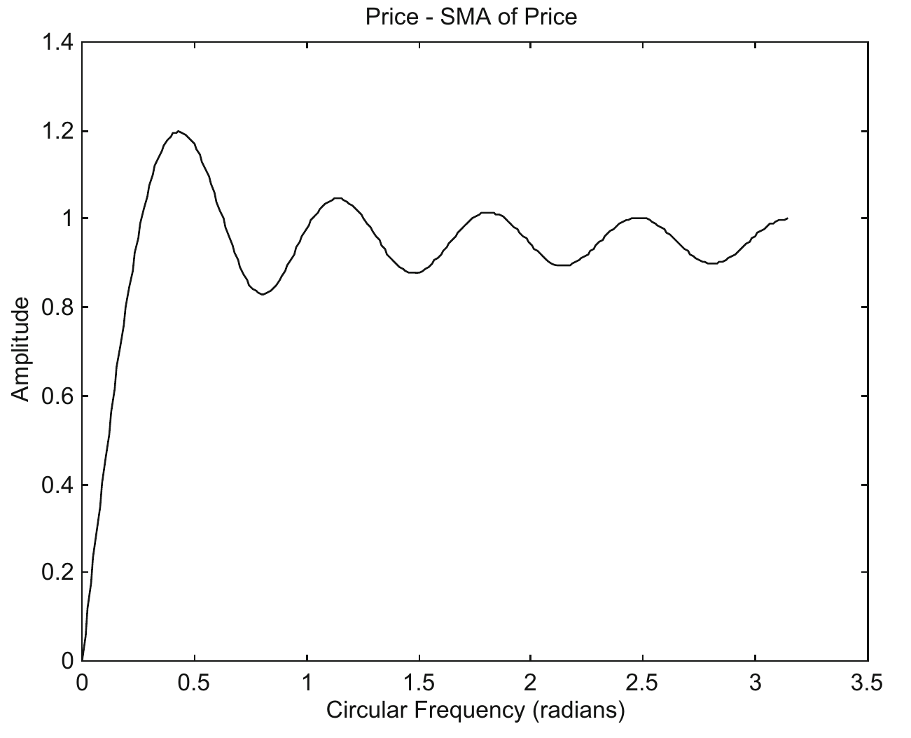

**Fig. 3.19** The amplitude response of $(1 - \text{Simple Moving Average with } N = 10)$.

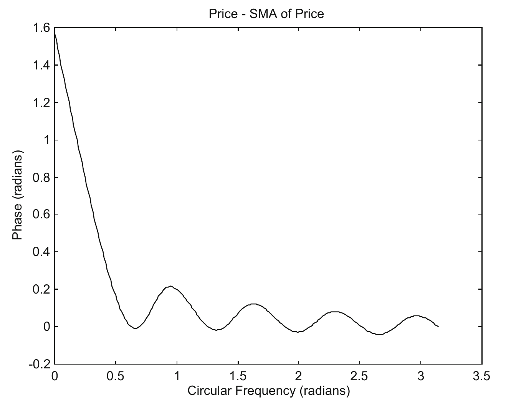

**Fig. 3.20** The phase response of $(1 - \text{Simple Moving Average with } N = 10)$.

The wrapped phase response of $(1 - \text{Simple Moving Average with } N = 10)$ is plotted in Fig. 3.20. The unwrapped phase is the same as the wrapped phase. The phase is $\pi/2$ when $\omega$ approaches 0. The phase decreases to 0 when $\omega$ approaches 0.628 radians, where the amplitude is 0. As a matter of fact, when the amplitude of SMA is 0, the phase is 0 (Appendix B), i.e., when

$$\omega = \pi/5\ (\approx 0.628),\ 2\pi/5\ (\approx 1.257),\ 3\pi/5\ (\approx 1.885),\ 4\pi/5\ (\approx 2.513),\ \pi, \ldots \quad \text{radians}$$

And it is also 0 when the phase of the SMA is 0 (Appendix B), i.e., when

$$\omega = 0.6981,\ 1.3963,\ 2.0944,\ 2.7925 \ldots \quad \text{radians}$$

The phase is only slightly less than 0 when:
- $0.628 < \omega < 0.6981$
- $1.257 < \omega < 1.3963$
- $1.885 < \omega < 2.0944$
- $2.513 < \omega < 2.7925$

As the phase lead of the above four zones lies between 0 and $-\pi$, the four zones can be considered as Loss Zones. However, for $0.628 < \omega < \pi$ radians, the phase is always greater than $-0.04 \approx 0$ radians. Thus, as an approximation, one can say that the Profit Zone, when the phase $\phi$, lies between $-\pi$ and 0 in this case, is $0 < \omega < \pi$, and one would expect that this velocity indicator would yield a reasonably profitable indicator when $\omega < 0.628$. An example is given in Fig. 3.21 for price simulated as a sine wave of amplitude = 1 and $\omega = \pi/30 \approx 0.10$ radian. The velocity indicator, Price − Simple Moving Average (SMA), $N = 10$, of Price is also plotted. If traders buy when the velocity changes from negative to positive, and sell when the velocity changes from positive to negative, they will make about 91% of the maximum possible profit.

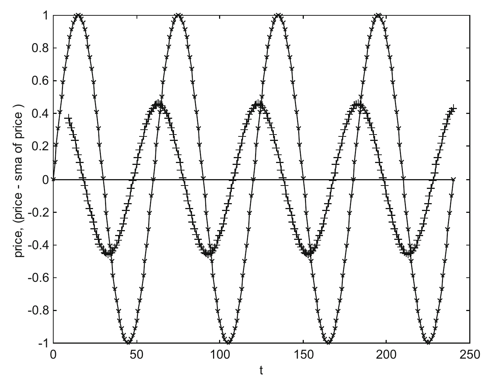

**Fig. 3.21** Price simulated as a sine wave (marked as x) of amplitude = 1 and $\omega = \pi/30 \approx 0.10$ radians. The velocity indicator, Price − 10 point Simple Moving Average (SMA) of Price (marked as +) has a phase lead $\phi(\omega)$ of 1.24 radians from the sine wave. The amplitude of the $(1 - \text{Simple Moving Average}, N = 10)$ is approximately 0.46. If traders buy when the velocity changes from negative to positive, and sell when the velocity changes from positive to negative, they will make 91.4% of the maximum possible profit (see also Table 3.5), where maximum possible profit = peak − valley = 2. The computer program `pmsmasig` has been used.

#### 3.2.1.1 Computational and Theoretical Profit and Loss

The amount of profit traders made would depend on the frequency $\omega$ of the price signal, the initial phase angle, $\theta_0$, of the price signal, as well as the phase lead, $\phi$, of the velocity indicator. As the price data is not a continuous curve, the sampled price would correspond to the sampled velocity indicator when the velocity changes sign. As an example, Fig. 3.21 shows the price simulated as a sine wave of amplitude = 1 and $\omega = \pi/30 \approx 0.10$ radian. The velocity indicator, price − Simple Moving Average (SMA), $N = 10$, of price has a phase lead $\phi(\omega)$ of 1.24 radians from the sine wave. As one can see from the figure, the sampled velocity indicator is slightly less than 0 (at $t = 48$) before it changes to positive, and there is also a phase delay when it changes from positive to negative (at $t = 78$). The profit % can be computed from the price signal when the velocity indicator changes sign (using the program `pmsmasig`), and is given by $(1/2) \times (\text{sell price} - \text{buy price}) = (1/2) \times (0.9135 - (-0.9135)) \approx 0.914 = 91.4\%$ as shown in Table 3.5. The factor of $(1/2)$ is relevant as the maximum profit from valley to peak is 2.

Profit% can also be calculated by using Eqs. (2.1) – (2.7) in Chapter 2. This theoretical profit is calculated from the program `buysellprice`, using the phase, $\phi$, which is computed from the program `pmsma`. The theoretical profit also yields 91.4% as shown in Table 3.5, and is in agreement with the computational result above.

Table 3.5 lists price data simulated as sine waves with frequencies from 0.1 to 0.5 radian, with initial phase angles, Theta0 ($\theta_0$) of 0, $\pi/2$, $\pi$ and $3\pi/2$ radians. The maximum possible gain traders can make equals (the peak of the price − the valley of the price), i.e., $2 \times \text{amplitude}$ (with amplitude = 1). Profit % is the percentage of the maximum profit that can be made. The table shows that, for input price signal with $\omega < 0.5$, this trading tactic when the velocity indicator (Price − Simple Moving Average of Price with $N = 10$) changes sign, can make reasonably good profit.

**Table 3.5** Price data simulated as sine waves with frequencies from 0.1 to 0.5 radian, with initial phase angles Theta0, $\theta_0$, of 0, $\pi/2$, $\pi$ and $3\pi/2$ radians.

| $\omega$ (radian) | Theta0 = 0 profit (%) | Theta0 = π/2 profit (%) | Theta0 = π profit (%) | Theta0 = 3π/2 profit (%) | $\phi$ (radians) | Theoretical profit (%) |
|---|---|---|---|---|---|---|
| $\pi/30 \approx 0.1$ | 91.4 | 91.4 | 91.4 | 91.4 | 1.2404 | 91.4 |
| $\pi/15 \approx 0.2$ | 74.3 | 66.9 | 74.3 | 66.9 | 0.9175 | 74.3, 66.9 |
| $\pi/10 \approx 0.3$ | 30.9 | 30.9 | 30.9 | 30.9 | 0.6118 | 30.9 |
| $\pi/8 \approx 0.4$ | 38.3 | 38.3 | 38.3 | 38.3 | 0.4020 | 38.3 |
| $\pi/6 \approx 0.5$ | 0 | 0 | 0 | 0 | 0.1196 | 0 |

Profit % is the percentage of the maximum profit that can be made using the velocity indicator (Price − SMA of Price, with $N = 10$). The computer program `pmsmasig` is used to compute the profit % in columns 2–5. Theoretical profit % in column 7 is calculated from the program `buysellprice`, with $\phi$(radians) taken from the program `pmsma` for the corresponding $\omega$'s.

When $\omega = \pi/30, \pi/15, \pi/10$ and $\pi/8$, $\phi > \omega$, the trade makes a profit. When $\omega = \pi/6$, $\phi < \omega$, the trade makes zero profit. The theoretical profit % agrees with the computational one very well.

However, real market signal consists of frequency $\omega$ higher than 0.5, where the phase of $(1 - \text{SMA with } N = 10)$ can be equal to or close to 0. Because of sampling delay losses for phases close to 0, this trading tactic is not that profitable when real market data is used, as we will show later in Chapter 7.

#### 3.2.1.2 Sure Profit Zone and Unsure Profit Zone

We have pointed out in Chapter 2, that the maximum phase shift of a buy/sell indication from a velocity indicator caused by sampling delay is $\omega$ for a certain $\omega$. Thus, we can plot a straight line of Phase $\phi = \omega$ on a phase, $\phi$, plot of a velocity indicator to show that there is a certain region of $\omega$ that the trade can surely make a profit, and some other part of the region when a trade may make a profit or a loss.

As an example, we plot a straight line of $\phi = \omega$ on Fig. 3.20, thus producing Fig. 3.22. The intersection point of the straight line plot with the phase plot is approximately $\omega = 0.40$. We can describe $0 < \omega < 0.40$ as a Sure Profit Zone, as a trade with $0 < \phi < \pi/2$ and $\phi > \omega$ will surely make a profit. $0.40 < \omega < \pi$ is described as an Unsure Profit Zone. The trade will make a profit if $\mu$, the phase shift caused by sampling delay, is less than the phase lead $\phi$ (> 0), of the velocity indicator. The trade will lose money if $\mu$ is larger than the phase lead of the velocity indicator. In the Sure Profit Zone, $\mu$, whose maximum is $\omega$, is always less than $\phi$, and the trade will always make a profit. In the Unsure Profit Zone, $\mu$ may or may not be less than $\phi$, and thus may or may not make a profit. This has been summarized in Table 2.3 in Chapter 2.

**Table 2.3** Sure Profit Zone and Unsure Profit Zone.

| | Condition | Result |
|---|---|---|
| Sure Profit Zone | $\phi > \omega$ | Always makes a profit |
| Unsure Profit Zone | $\phi < \omega$ | $\mu < \phi$ ($\mu > 0$) makes a profit; $\mu \geq \phi$ ($\mu > 0$) makes a loss |

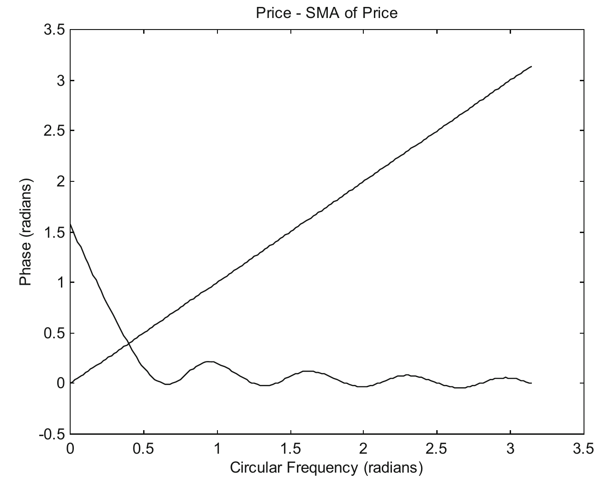

**Fig. 3.22** The phase, $\phi$, of $(1 - \text{Simple Moving Average with } N = 10)$ plotted versus $\omega$, as in Fig. 3.20. A straight line of Phase = $\omega$ is plotted, intersecting the phase plot at $\omega \approx 0.40$. The region $0 < \omega < 0.40$ is defined as the Sure Profit Zone, while the region $0.40 < \omega < \pi$ is defined as the Unsure Profit Zone.

### 3.2.2 Price − Simple Moving Average of Price, N = 20

The amplitude of the frequency response of $(1 - \text{SMA}, N = 20)$ is plotted in Fig. 3.23. From Fig. 3.23, it can be seen that for an input signal, a certain portion of $\omega$ less than 0.5 radians are retained in the output.

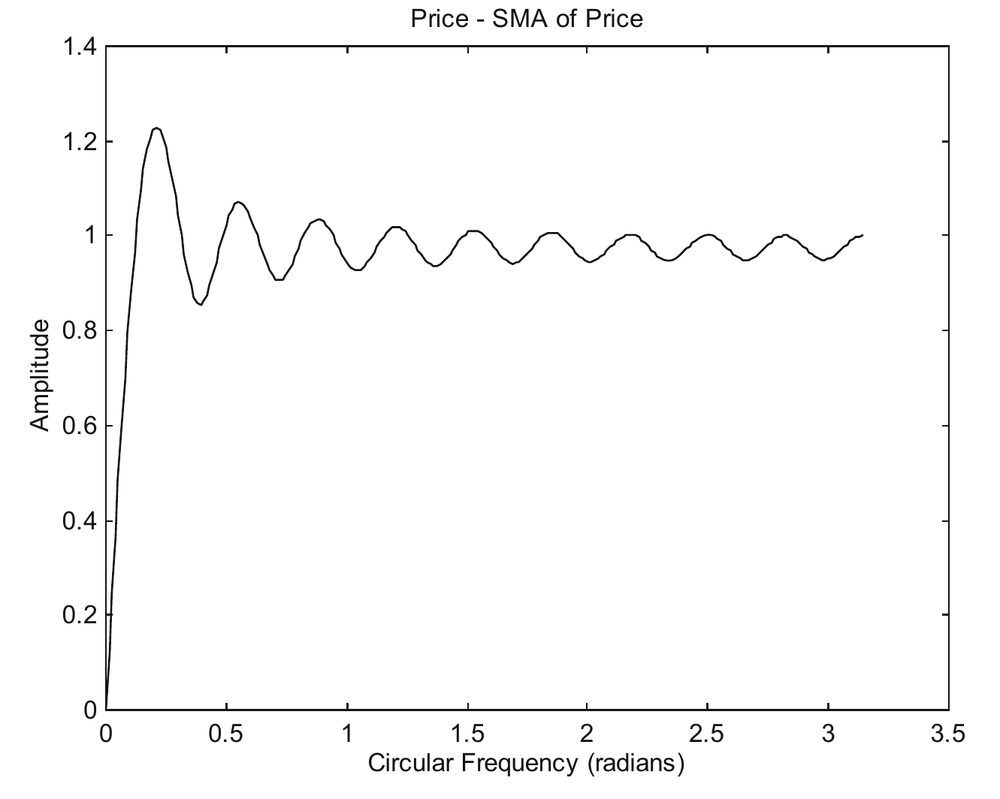

**Fig. 3.23** The amplitude response of $(1 - \text{Simple Moving Average with } N = 20)$.

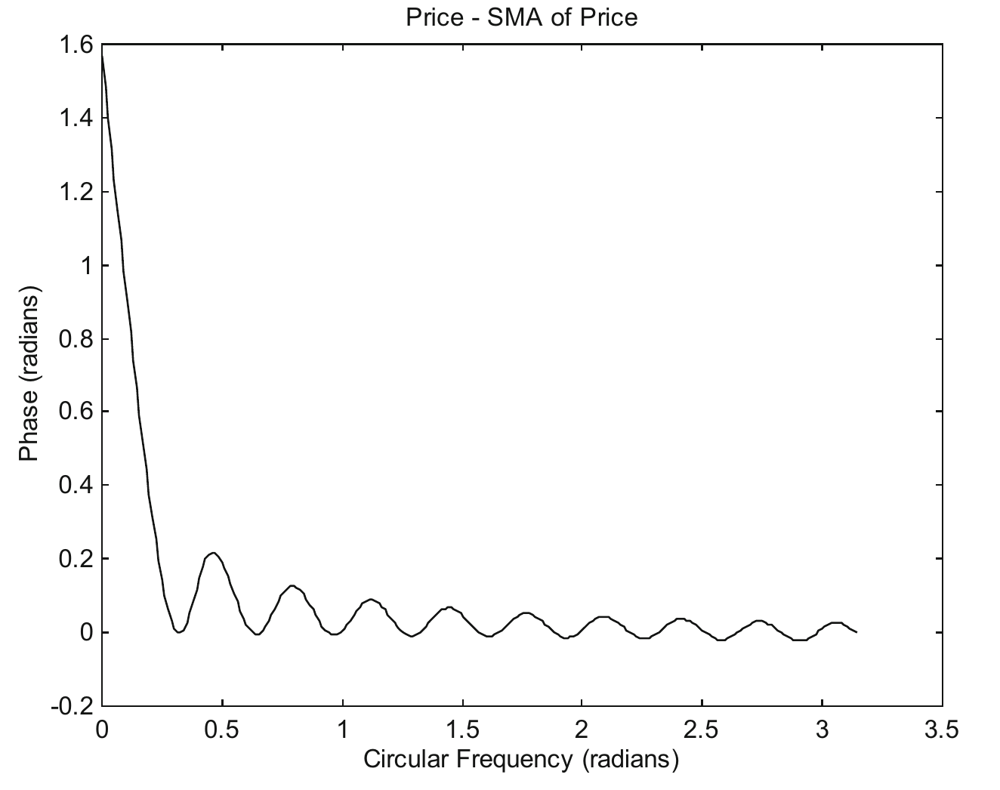

**Fig. 3.24** The phase response of $(1 - \text{Simple Moving Average with } N = 20)$.

The phase response of $(1 - \text{Simple Moving Average with } N = 20)$ is plotted in Fig. 3.24. The unwrapped phase is the same as the wrapped phase. The phase is $\pi/2$ when $\omega$ approaches 0, and decreases to 0 when $\omega$ approaches 0.31 radians. For $\omega > 0.31$ radians, the phase is always greater than $-0.023 \approx 0$ radians. Thus, as an approximation, one can say that the Profit Zone, when the phase lies between $-\pi$ and 0 in this case, is $0 < \omega < \pi$. If a straight line of Phase $\phi = \omega$ is plotted on Fig. 3.24, it will intersect the phase plot at $\omega \approx 0.23$. The region $0 < \omega < 0.23$ is described as the Sure Profit Zone, while the region $0.23 < \omega < \pi$ is described as the Unsure Profit Zone. Because of the narrow Sure Profit Zone, one would not expect that this velocity indicator would yield a reasonably profitable indicator.

Table 3.6 lists price data simulated as sine waves with frequencies from 0.1 to 0.5 radian, with initial phase angles of 0, $\pi/2$, $\pi$ and $3\pi/2$ radians. The table shows that this trading tactic when the velocity indicator (Price − SMA of Price, $N = 20$) changes sign, would not make reasonably good profit.

**Table 3.6** Price data simulated as sine waves with frequencies from 0.1 to 0.5 radian, with initial phase angles of 0, $\pi/2$, $\pi$ and $3\pi/2$ radians.

| $\omega$ (radian) | Theta0 = 0 profit (%) | Theta0 = π/2 profit (%) | Theta0 = π profit (%) | Theta0 = 3π/2 profit (%) | $\phi$ (radians) | Theoretical profit (%) |
|---|---|---|---|---|---|---|
| $\pi/30 \approx 0.1$ | 74.3 | 74.3 | 74.3 | 74.3 | 0.9011 | 74.3 |
| $\pi/15 \approx 0.2$ | 20.8 | 10.5 | 20.8 | 10.5 | 0.3132 | 20.8, 10.5 |
| $\pi/10 \approx 0.3$ | −30.9 | −30.9 | −30.9 | −30.9 | 0 | −30.9 |
| $\pi/8 \approx 0.4$ | 0 | 0 | 0 | 0 | −0.118 | 0 |
| $\pi/6 \approx 0.5$ | 0 | 0 | 0 | 0 | −0.1537 | 0 |

Profit % is the percentage of the maximum profit that can be made using the velocity indicator (Price − SMA of Price, $N = 20$). The computer program `pmsmasig` is used to compute the profit % in columns 2–5. Theoretical profit % in column 7 is calculated from the program `buysellprice`, with $\phi$(radians) taken from the program `pmsma` for the corresponding $\omega$'s.

It should be noted that when $\omega = \pi/10$, both the computational and theoretical calculations are not reliable, as the Simple Moving Average, $N = 20$ of the price signal is zero. Price − SMA20 is simply equal to the Price itself.

When $\omega = \pi/30$ and $\pi/15$, $\phi > \omega$, the trade makes a profit. When $\omega = \pi/8$ and $\pi/6$, $\phi < \omega$, the trade makes zero profit. This is in agreement with Table 2.3 that the trade can make a profit or a loss.

### 3.2.3 Price − Simple Moving Average of Price, N = 100

The amplitude of the frequency response of $(1 - \text{SMA}, N = 100)$ is plotted in Fig. 3.25. From Fig. 3.25, it can be seen that, for an input signal, a certain portion of $\omega$ less than 0.5 radians are retained in the output.

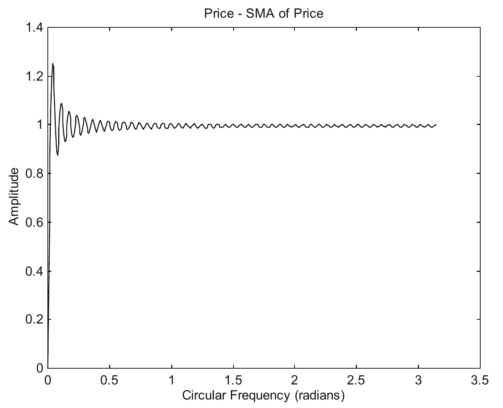

**Fig. 3.25** The amplitude response of $(1 - \text{Simple Moving Average with } N = 100)$.

The phase response of $(1 - \text{SMA}, N = 100)$ is plotted in Fig. 3.26. The unwrapped phase is the same as the wrapped phase. The phase is $\pi/2$ when $\omega$ approaches 0, and decreases quickly to 0 when $\omega$ approaches 0.065 radians. For $\omega > 0.065$ radians, the phase is always greater than $-0.004 \approx 0$ radians. Thus, as an approximation, one can say that the Profit Zone, when the phase lies between $-\pi$ and 0 in this case, is $0 < \omega < \pi$. If a straight line of Phase $\phi = \omega$ is plotted on Fig. 3.26, it will intersect the phase plot at $\omega \approx 0.056$, 0.073 and 0.11. The region $0 < \omega < 0.056$ and $0.073 < \omega < 0.11$ are described as Sure Profit Zones, and the regions $0.056 < \omega < 0.073$ and $0.11 < \omega < \pi$ are described as the Unsure Profit Zones. Because of the narrow Sure Profit Zones, one would not expect that this velocity indicator would yield a reasonably profitable indicator.

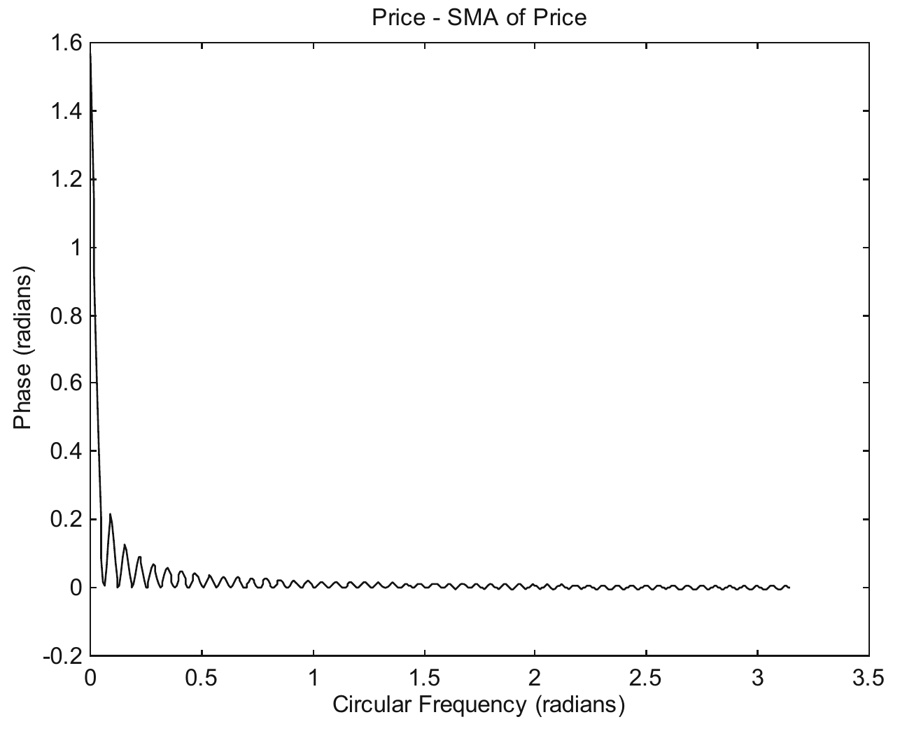

**Fig. 3.26** The phase response of $(1 - \text{Simple Moving Average with } N = 100)$.

Table 3.7 lists price data simulated as sine waves with frequencies from 0.1 to 0.5 radian, with initial phase angles of 0, $\pi/2$, $\pi$ and $3\pi/2$ radians. The table shows that this trading tactic when the velocity indicator, (Price − SMA of Price, $N = 100$) changes sign, cannot make good profit. As a matter of fact, there is a high chance that traders would lose some money.

**Table 3.7** Price data simulated as sine waves with frequencies from 0.1 to 0.5 radian, with initial phase angles of 0, $\pi/2$, $\pi$ and $3\pi/2$ radians.

| $\omega$ (radian) | Theta0 = 0 profit (%) | Theta0 = π/2 profit (%) | Theta0 = π profit (%) | Theta0 = 3π/2 profit (%) | $\phi$ (radians) | Theoretical profit (%) |
|---|---|---|---|---|---|---|
| $\pi/30 \approx 0.1$ | 10.5 | 10.5 | 10.5 | 10.5 | 0.1363 | 10.5 |
| $\pi/15 \approx 0.2$ | 0 | −10 | 0 | −10 | 0.0703 | 0, −10 |
| $\pi/10 \approx 0.3$ | −15, −31 | −15 | −15 | −31 | 0 | −31 |
| $\pi/8 \approx 0.4$ | 0 | 0 | 0 | 0 | −0.0208 | 0 |
| $\pi/6 \approx 0.5$ | 0 | 0 | 0 | 0 | −0.0242 | 0 |

Profit % is the percentage of the maximum profit that can be made using the velocity indicator (Price − SMA of Price, $N = 100$). The computer program `pmsmasig` is used to compute the profit % in columns 2–5. Theoretical profit % in column 7 is calculated from the program `buysellprice`, with $\phi$(radians) taken from the program `pmsma` for the corresponding $\omega$'s.

It should be noted that when $\omega = \pi/10$, both the computational and theoretical calculations are not reliable, as the Simple Moving Average, $N = 100$ of the price signal is zero. Price − SMA100 is simply equal to the Price itself.

When $\omega = \pi/30$, $\phi > \omega$, the trade makes a profit. When $\omega = \pi/15$, $\phi < \omega$, the trade makes zero profit or makes a loss, depending on the sampling delay. When $\omega = \pi/10$, $\pi/8$, and $\pi/6$, $\phi < \omega$, the trades do not make any profit. This is in agreement with Table 2.3 that the trade can make a profit or a loss.

### 3.2.4 Comparison of Price − Simple Moving Average of Price, N = 10, 20 and 100

As mentioned earlier, to a good approximation, we can consider the Profit Zone of (Price − SMA of Price) to be $0 < \omega < \pi$.

Price − SMA of Price with $N = 10$, popular among traders, apparently looks like a profitable trading tactic. However, as pointed out in the above sections, the high frequency components in real market data can generate whipsaws, and can easily turn an originally profitable trade into a loss.

Some traders like to use larger $N$, e.g., $N = 20$, 100 or more (Chan et al. 2014). Nevertheless, the larger the $N$, the less is the Sure Profit Zone, as we can see in Table 3.8, and there is less chance a trade will make money. Also, within the Unsure Profit Zone, the larger the area enclosed by the straight line Phase $\phi = \omega$, the phase plot and $\omega = \pi$ (as in Fig. 3.22), the higher the probability that a trade will lose money. It can be seen from the phase plots that the area gets larger and larger as $N$ increases. Thus, the larger the $N$, the less the probability that a trade will make money.

**Table 3.8** Sure and Unsure Profit Zones for SMA for $N = 10$, 20 and 100.

| SMA, $N$ | Sure Profit Zone (radians) | Unsure Profit Zone (radians) |
|----------|---------------------------|------------------------------|
| 10 | $0 < \omega < 0.40$ | $0.40 < \omega < \pi$ |
| 20 | $0 < \omega < 0.23$ | $0.23 < \omega < \pi$ |
| 100 | $0 < \omega < 0.056$; $0.073 < \omega < 0.11$ | $0.056 < \omega < 0.073$; $0.11 < \omega < \pi$ |

As we do not think that Price − SMA of Price, $N = 100$, would make good profit, this tactic would not be used in trading real market data in Chapter 7.

In the next chapter, we will discuss the smoothing indicator, exponential moving average, and the trading tactic, Price − Exponential Moving Average of Price. We will show later that this tactic is more reliable and more profitable than Price – Simple Moving Average of Price.
