# 4 Exponential Moving Average

Exponential Moving Average (EMA) is another smoothing indicator. Like the Simple Moving Average, it is a low pass filter, which removes high frequency components and allows low frequency components to pass.

## 4.1 Exponential Moving Average (EMA)

An exponential moving average is a better indicator than a simple moving average as it puts greater weight to most recent data more than older data. The equation for the EMA is given by

$$\text{NEW EMA} = \alpha \cdot (\text{NEW PRICE}) + (1 - \alpha) \cdot (\text{OLD EMA}) \tag{4.1}$$

where $\alpha = 2/(M + 1)$

$M$ is quite often called the length of the EMA. It is sometimes described by some traders as the number of data points (e.g. days) in the EMA. This is incorrect as the number of data points used in the calculation is usually much higher than $M$. For the EMA, a larger $M$ will provide a smoother average but a larger phase lag. Figure 4.1 shows the S & P 500 daily index data taken from April 24, 2019 to August 12, 2019. An Exponential Moving Average of length 6, plotted as a line, is used to smooth the data, showing that it lags behind the index. Characteristics of the EMA are described in Appendix C.

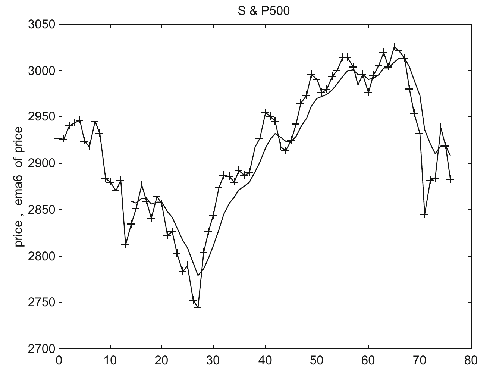

**Fig. 4.1** The S & P 500 daily index from April 24, 2019 to August 12, 2019 are plotted (+), together with an Exponential Moving Average (EMA) of length 6, plotted as a line. Note that the EMA lags behind the index.

An exponential moving average (EMA) gives greater weight to the latest data and thus responds to changes faster. It does not drop old data suddenly the way an SMA does. Old data simply fade away.

Equation (4.1) for the output response of an EMA can be re-written as

$$y(n) = \alpha x(n) + (1 - \alpha) y(n - 1) \tag{4.2}$$

where $y(n)$ is the output data, $x(n)$ is the input data, and is equal to price here.

Equation (4.2) makes use of an output response that has already been processed. Iterating the previously processed $y$ value in Eq. (4.2), we can write $y(n)$ as

$$y(n) = \sum_{k=0}^{\infty} \alpha (1 - \alpha)^k x(n - k) \tag{4.3}$$

Thus, the unit sample (impulse) response $h(k)$ can be written as

$$h(k) = \alpha (1 - \alpha)^k \tag{4.4}$$

where $k = 0, 1, 2, \ldots, \infty$

Note that when $k = 0$, $h(k) = \alpha = 2/(M + 1)$.

Thus, it can be seen that exponential moving average (EMA), which is also known as exponentially weighted moving average (EWMA), is an infinite impulse response filter that applies weighting factor which decreases exponentially.

For $M = 3, 6, 9, 12, 26$, $h(k)$ are plotted in Fig. 4.2.

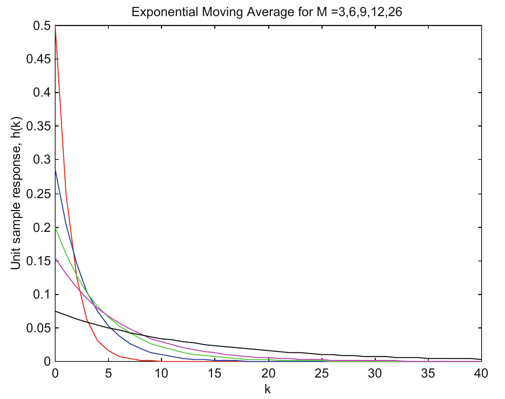

**Fig. 4.2** Unit sample response, $h(k)$, of an exponential moving average are plotted for $M = 3$ (red), 6 (blue), 9 (green), 12 (magenta), 26 (black). The figure can be plotted with the program `hema`.

The equations of $H(\omega)$, the frequency response of the EMA is given in Appendix C.

The amplitude and phase of $H(\omega)$ of the EMA, for $M = 3$ and 6 are plotted in Figs. 4.3 and 4.4.

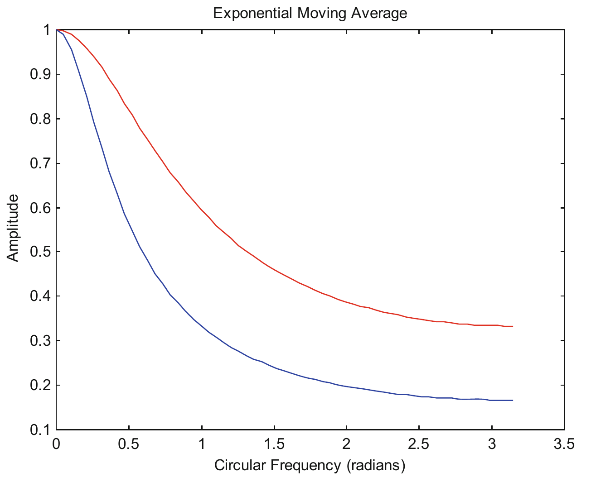

**Fig 4.3** Amplitudes of $H(\omega)$ of the EMA, for $M = 3$ (red) and 6 (blue).

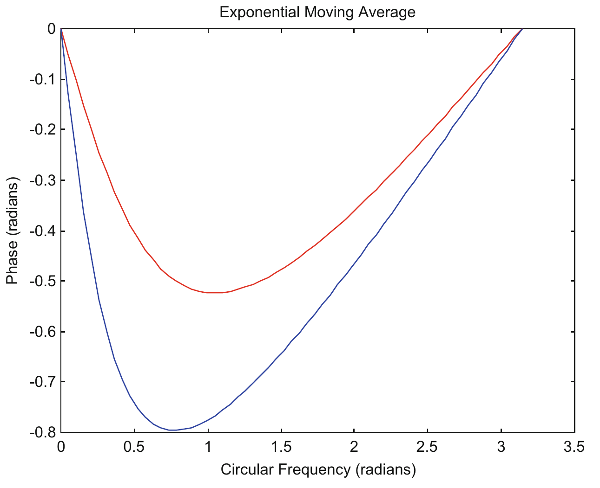

**Fig 4.4** Phases of $H(\omega)$ of the EMA, for $M = 3$ (red) and 6 (blue).

Note that the amplitudes of EMA do not go to zero, as in SMA. Also, the phases of EMA do not necessarily decrease as the circular frequency $\omega$ gets larger, as in SMA. These are the advantages of EMA over SMA, rendering trading tactics using EMA more reliable than those using SMA.

## 4.2 Trading Tactics Using Exponential Moving Average

A simple trading tactic that has been used by traders is to buy when the price crosses over the EMA of the price from below, and sells when price crosses over the EMA of the price from above. As (Price $-$ EMA of Price) can be considered as a velocity indicator, the trading tactics is the same as buy when velocity changes from negative to positive, and sell when velocity changes from positive to negative.

### 4.2.1 Price $-$ Exponential Moving Average of Price, $M = 3$

The frequency response of (Price $-$ EMA of Price) is shown in Appendix C, and will be denoted as $(1 - \text{EMA})$. The amplitude response of $(1 - \text{EMA}, M = 3)$ is plotted in Fig. 4.5. Just like any velocity indicator, it is a high pass filter, filtering off the low frequency components. From Fig. 4.5, it can be seen that a certain portion of $\omega$ less than 0.5 radians are retained. This is useful as real market data contains significant percentage of low frequency components less than 0.5 radians.

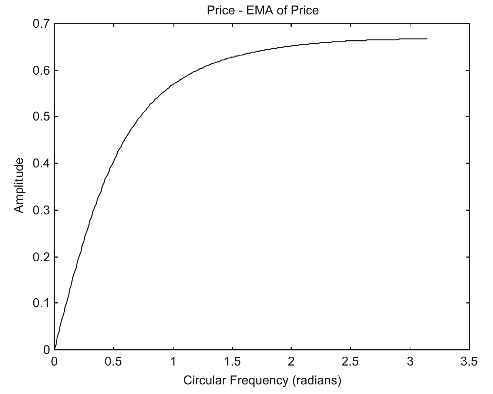

**Fig. 4.5** The amplitude response of $(1 - \text{exponential moving average with } M = 3)$.

The phase response of $(1 - \text{exponential moving average with } M = 3)$ is plotted in Fig. 4.6. The phase is $\pi/2$ when $\omega$ approaches 0, and decreases to 0 when $\omega$ approaches $\pi$ radians. As all phase lies between $\pi/2$ and 0, the Profit Zone would be $0 < \omega < \pi$. A straight line of Phase $\phi = \omega$ can be plotted on Fig. 4.6. The intersection point of the straight line plot with the phase plot is approximately $\omega = 0.72$. We can describe $0 < \omega < 0.72$ as a Sure Profit Zone, as a trade with $0 < \phi < \pi/2$ and $\phi > \omega$ will surely make a profit. $0.72 < \omega < \pi$ is described as an Unsure Profit Zone. The trade will make a profit if $\mu$, the phase shift caused by sampling delay, is less than the phase lead $\phi$ (> 0), of the velocity indicator. The trade will lose money if $\mu$ is larger than the phase lead of the velocity indicator. In the Sure Profit Zone, $\mu$, whose maximum is $\omega$, is always less than $\phi$, and the trade will always make a profit. In the Unsure Profit Zone, $\mu$ may or may not be less than $\phi$, and thus may or may not make a profit.

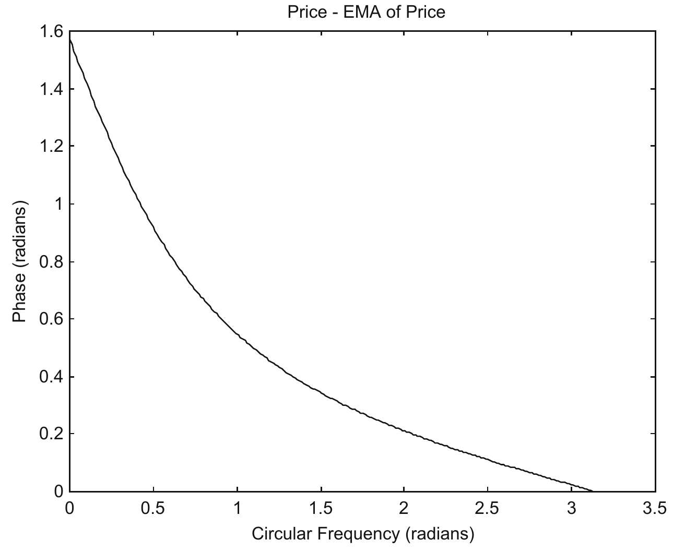

**Fig. 4.6** The phase response of $(1 - \text{exponential moving average with } M = 3)$.

As the Sure Profit Zone is reasonably large, one would expect that this velocity indicator would yield a reasonably profitable indicator. An example is given in Fig. 4.7 for price simulated as a sine wave of amplitude $= 1$ and $\omega = \pi/30 \approx 0.10$ radian. The velocity indicator, Price $-$ Exponential Moving Average of Price with $M = 3$ is also plotted. If traders buy when the velocity changes from negative to positive, and sell when the velocity changes from positive to negative, they will make about 98% of the maximum possible profit.

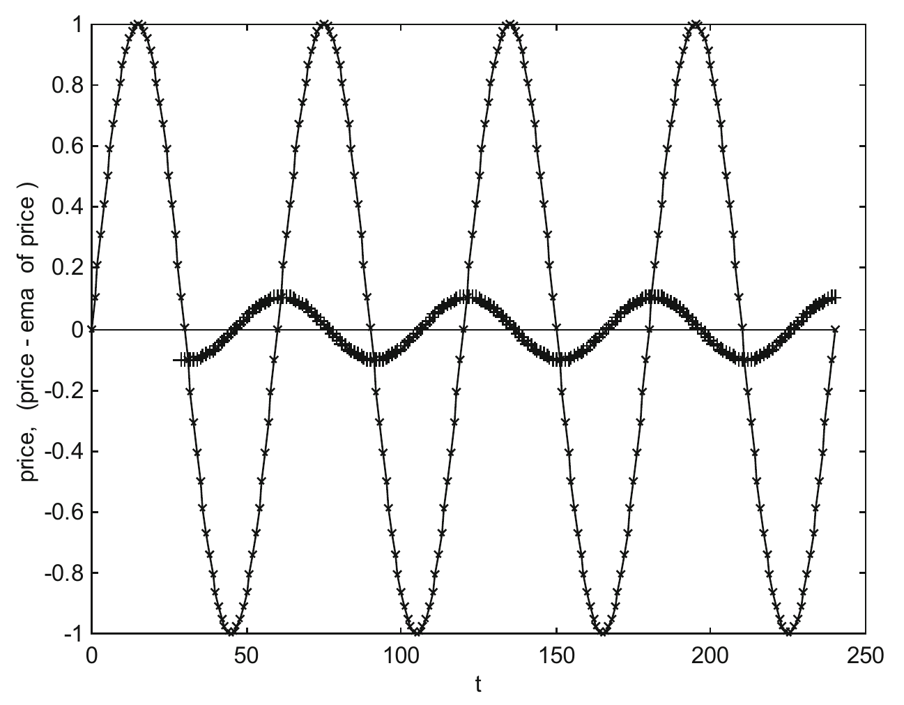

**Fig. 4.7** Price simulated as a sine wave (marked as x) of amplitude $= 1$ and $\omega = \pi/30 \approx 0.10$ radians. The velocity indicator, Price $-$ EMA of Price with $M = 3$ (marked as +) has a phase lead $\phi(\omega)$ of 1.4 radians from the sine wave. The amplitude of the $(1 - \text{EMA with } M = 3)$ is approximately 0.1. If traders buy when the velocity changes from negative to positive, and sell when the velocity changes from positive to negative, they will make about 98% of the maximum possible profit.

Table 4.1 lists price data simulated as sine waves with frequencies from 0.1 to 0.5 radian, at initial phase angles of 0, $\pi/2$, $\pi$ and $3\pi/2$ radians. The maximum possible gain traders can make equals (the peak of the price $-$ the valley of the price), i.e., $2 \times \text{amplitude}$ (with amplitude $= 1$). Profit % is the percentage of the maximum profit that can be made. The table shows that this trading tactic when the velocity indicator (Price $-$ EMA of Price with $M = 3$) changes sign, can make reasonably good profit.

**Table 4.1** Price data simulated as sine waves with frequencies from 0.1 to 0.5 radian, with initial phase angles $\theta_0$ of 0, $\pi/2$, $\pi$ and $3\pi/2$ radians.

| $\omega$ (radian) | $\theta_0 = 0$ profit (%) | $\theta_0 = \pi/2$ profit (%) | $\theta_0 = \pi$ profit (%) | $\theta_0 = 3\pi/2$ profit (%) | $\phi$ (radians) | Theoretical profit (%) |
|---|---|---|---|---|---|---|
| $\pi/30 \approx 0.1$ | 97.8 | 97.8 | 97.8 | 97.8 | 1.4148 | 97.8 |
| $\pi/15 \approx 0.2$ | 95.1 | 91.4 | 95.1 | 91.4 | 1.2654 | 95.1, 91.4 |
| $\pi/10 \approx 0.3$ | 80.9 | 80.9 | 80.9 | 80.9 | 1.1272 | 80.9 |
| $\pi/8 \approx 0.4$ | 70.7 | 70.7 | 70.7 | 70.7 | 1.0328 | 70.7 |
| $\pi/6 \approx 0.5$ | 50.0 | 50.0 | 50.0 | 50.0 | 0.8937 | 50.0 |

Profit % is the percentage of the maximum profit that can be made using the velocity indicator (Price $-$ EMA of Price, with $M = 3$). The computer program `pmemasig` is used to compute the profit % in columns 2–5. Theoretical profit % in column 7 is calculated from the program `buysellprice`, with $\phi$ (radians) taken from the program `pmema` for the corresponding $\omega$'s.

In Table 4.1, for each $\omega$, $\phi > \omega$, thus, all trades make a profit.

### 4.2.2 Price $-$ Exponential Moving Average of Price, $M = 6$

The amplitude response of $(1 - \text{EMA}, M = 6)$ is plotted in Fig. 4.8. From Fig. 4.8, it can be seen that a certain portion of $\omega$ less than 0.5 radian are retained.

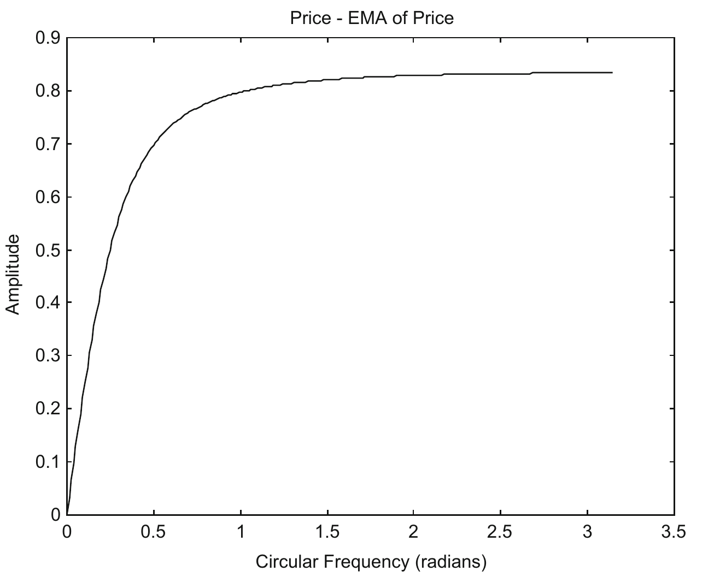

**Fig. 4.8** The amplitude response of $(1 - \text{exponential moving average with } M = 6)$.

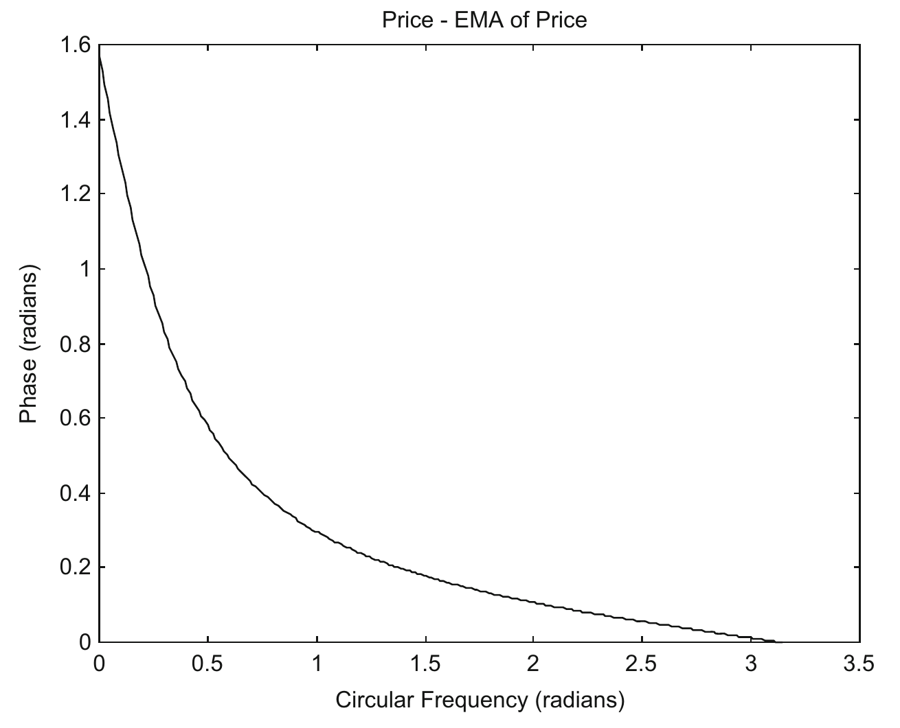

**Fig. 4.9** The phase response of $(1 - \text{exponential moving average with } M = 6)$.

The phase response of $(1 - \text{exponential moving average with } M = 6)$ is plotted in Fig. 4.9. The phase is $\pi/2$ when $\omega$ approaches 0, and decreases to 0 when $\omega$ approaches $\pi$ radians. As all phase lies between $\pi/2$ and 0, the Profit Zone would be $0 < \omega < \pi$. A straight line of Phase $\phi = \omega$ can be plotted on Fig. 4.9. The intersection point of the straight line plot with the phase plot is approximately $\omega = 0.54$. We can describe $0 < \omega < 0.54$ as a Sure Profit Zone, as a trade with $0 < \phi < \pi/2$ and $\phi > \omega$ (i.e., $\omega < \phi < \pi/2$) will surely make a profit. $0.54 < \omega < \pi$ is described as an Unsure Profit Zone. The trade will make a profit if $\mu$, the phase shift caused by sampling delay, is less than the phase lead $\phi$ (>0), of the velocity indicator. The trade will lose money if $\mu$ is larger than the phase lead of the velocity indicator. In the Sure Profit Zone, $\mu$, whose maximum is $\omega$, is always less than $\phi$, and the trade will always make a profit. In the Unsure Profit Zone, $\mu$ may or may not be less than $\phi$, and thus may or may not make a profit.

One would expect that this velocity indicator would yield a reasonably profitable indicator, even though it may not be as profitable as the velocity indicator $(1 - \text{exponential moving average with } M = 3)$, as the area below the phase curve is less than the corresponding area for $M = 3$.

Table 4.2 lists price data simulated as sine waves with frequencies from 0.1 to 0.5 radian, at initial phase angles of 0, $\pi/2$, $\pi$ and $3\pi/2$ radians. The table shows that this trading tactic, when the velocity indicator (price $-$ exponential moving average of price with $M = 6$) changes sign, can make reasonably good profit.

**Table 4.2** Price data simulated as sine waves with frequencies from 0.1 to 0.5 radian, with initial phase angles $\theta_0$ of 0, $\pi/2$, $\pi$ and $3\pi/2$ radians.

| $\omega$ (radian) | $\theta_0 = 0$ profit (%) | $\theta_0 = \pi/2$ profit (%) | $\theta_0 = \pi$ profit (%) | $\theta_0 = 3\pi/2$ profit (%) | $\phi$ (radians) | Theoretical profit (%) |
|---|---|---|---|---|---|---|
| $\pi/30 \approx 0.1$ | 95.1 | 95.1 | 95.1 | 95.1 | 1.2661 | 95.1 |
| $\pi/15 \approx 0.2$ | 74.3 | 80.9 | 74.3 | 80.9 | 1.0082 | 74.3, 80.9 |
| $\pi/10 \approx 0.3$ | 58.8 | 58.8 | 58.8 | 58.8 | 0.8109 | 58.8 |
| $\pi/8 \approx 0.4$ | 38.3 | 38.3 | 38.3 | 38.3 | 0.6974 | 38.3 |
| $\pi/6 \approx 0.5$ | 50.0 | 50.0 | 50.0 | 50.0 | 0.5564 | 50.0 |

Profit % is the percentage of the maximum profit that can be made using the velocity indicator (Price $-$ EMA of Price, with $M = 6$). The computer program `pmemasig` is used to compute the profit % in columns 2–5. Theoretical profit % in column 7 is calculated from the program `buysellprice`, with $\phi$ (radians) taken from the program `pmema` for the corresponding $\omega$'s.

In Table 4.2, for each $\omega$, $\phi > \omega$, thus, all trades make a profit.

### 4.2.3 EMA of Price, $M = 3$ $-$ EMA of Price, $M = 6$

In the trading tactic Price $-$ EMA of Price, as the first parameter Price is not smoothed, its high frequencies can produce some whipsaws. We will see whether having it smoothed can provide a more profitable trading tactic. We will try using (EMA, $M = 3$ $-$ EMA, $M = 6$). The amplitude response of (EMA, $M = 3$ $-$ EMA, $M = 6$) is plotted in Fig. 4.10. From Fig. 4.10, it can be seen that a certain portion of $\omega$ less than 0.5 radians are retained.

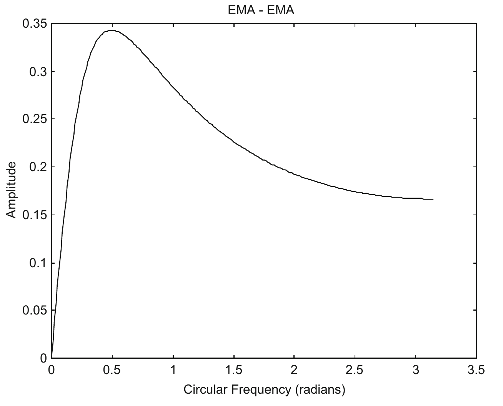

**Fig. 4.10** The amplitude response of (EMA with $M = 3$ $-$ EMA with $M = 6$).

The phase response of (EMA with $M = 3$ $-$ EMA with $M = 6$) is plotted in Fig. 4.11. The phase is $\pi/2$ when $\omega$ approaches 0, and decreases to 0 when $\omega$ approaches 0.64 radian. The phase then becomes negative and increases back to 0 when $\omega$ approaches $\pi$ radians. If a straight line of Phase $\phi = \omega$ is plotted on Fig. 4.11, it will intersect the phase plot at $\omega \approx 0.38$. The region $0 < \omega < 0.38$ is described as a Sure Profit Zone, while the region $0.38 < \omega < 0.64$ is described as the Unsure Profit Zone. $0.64 < \omega < \pi$ is described as the Loss Zone, as $\phi < 0$ and a trade will always lose money. Because of the narrow Sure Profit Zone and the long Loss Zone, one would not expect that this velocity indicator would yield a reasonably profitable indicator.

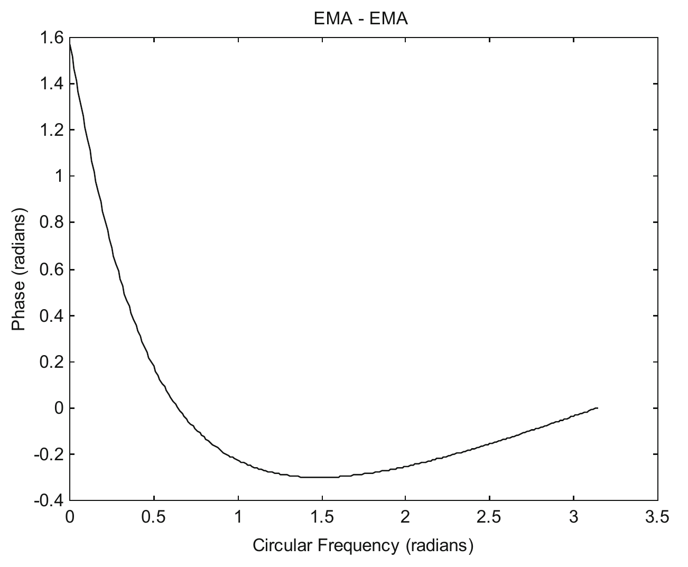

**Fig. 4.11** The phase response of (EMA with $M = 3$ $-$ EMA with $M = 6$).

Table 4.3 lists price data simulated as sine waves with frequencies from 0.1 to 0.5 radian, at initial phase angles of 0, $\pi/2$, $\pi$ and $3\pi/2$ radians. From $\pi/30$ to $\pi/10$, $\phi > \omega$, the trade is in the Sure Profit Zone, and it will always make a profit. For $\pi/8$ and $\pi/6$, $0 < \phi < \omega$, the trade lies in the Unsure Profit Zone, and may or may not make a profit.

**Table 4.3** Price data simulated as sine waves with frequencies from 0.1 to 0.5 radian, with initial phase angles $\theta_0$ of 0, $\pi/2$, $\pi$ and $3\pi/2$ radians.

| $\omega$ (radian) | $\theta_0 = 0$ profit (%) | $\theta_0 = \pi/2$ profit (%) | $\theta_0 = \pi$ profit (%) | $\theta_0 = 3\pi/2$ profit (%) | $\phi$ (radians) | Theoretical profit (%) |
|---|---|---|---|---|---|---|
| $\pi/30 \approx 0.1$ | 91.4 | 91.4 | 91.4 | 91.4 | 1.1626 | 91.4 |
| $\pi/15 \approx 0.2$ | 58.8 | 66.9 | 58.8 | 66.9 | 0.8074 | 58.8, 66.9 |
| $\pi/10 \approx 0.3$ | 30.9 | 30.9 | 30.9 | 30.9 | 0.5244 | 30.9 |
| $\pi/8 \approx 0.4$ | 0 | 0 | 0 | 0 | 0.3558 | 0 |
| $\pi/6 \approx 0.5$ | 0 | 0 | 0 | 0 | 0.1412 | 0 |

Profit % is the percentage of the maximum profit that can be made using the velocity indicator (EMA of Price, $M = 3$ $-$ EMA of Price, $M = 6$). The computer program `macdsig` (with $M_1 = 3$, and $M_2 = 6$) is used to compute the profit % in columns 2–5. Theoretical profit % in column 7 is calculated from the program `buysellprice`, with $\phi$ (radians) taken from the program `emamema` for the corresponding $\omega$'s.

### 4.2.4 EMAACCEL

We can create an acceleration indicator using EMA's, and call it EMAACCEL. This would be similar to the Moving Average Convergence Divergence Histogram (MACDH) which is a popular indicator used by traders, and which will be described in Chapter 6. It has been said that MACDH, even though it is an acceleration indicator, has been used by aggressive trader as a velocity indicator (Chan et al. 2014). We will show later that MACDH does perform quite well when used as a velocity indicator. Here, for EMAACCEL we would be using $M$'s, lengths of the EMA, much lower than the $M$'s used by MACDH, to see whether we can make any improvement on MACDH. EMAACCEL is defined as

$$\text{EMAACCEL} = (\text{ema3} - \text{ema6}) - \text{ema9}(\text{ema3} - \text{ema6})$$

where:
- $\text{ema3} = \text{EMA}, M = 3$ of price
- $\text{ema6} = \text{EMA}, M = 6$ of price
- $\text{ema9}(\text{ema3} - \text{ema6}) = \text{EMA}, M = 9$ of $(\text{ema3} - \text{ema6})$

As (ema3 – ema6) and ema9 (ema3 – ema6) are both velocity indicators, EMAACCEL will be an acceleration indicator. The amplitude response of EMAACCEL is plotted in Fig. 4.12. From Fig. 4.12, it can be seen that a certain portion of $\omega$ less than 0.5 radians are retained. The phase response of EMAACCEL is plotted in Fig. 4.13. The phase is $\pi$ when $\omega$ approaches 0, and decreases to 0 when $\omega$ approaches 0.96 radian. The phase then becomes negative and decreases to $-0.1935$ radian at $\omega = 1.73$ radians. It then increases back to 0 when $\omega$ approaches $\pi$ radians. If a straight line of Phase $\phi = \omega$ is plotted on Fig. 4.13, it will intersect the phase plot at $\omega \approx 0.53$. The region $0 < \omega < 0.53$ is described as a Sure Profit Zone, while the region $0.53 < \omega < 0.96$ is described as the Unsure Profit Zone. $0.96 < \omega < \pi$ is described as the Loss Zone, as $\phi < 0$ and a trade will always lose money. Because of the long Loss Zone, it is not at all clear whether this acceleration indicator, when used as a velocity indicator, would yield a reasonably profitable indicator.

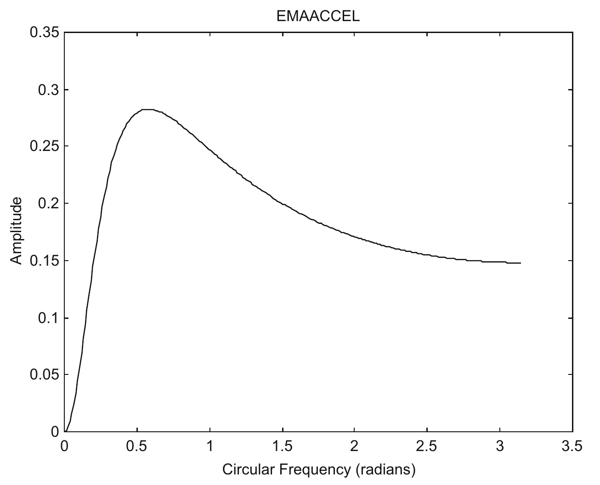

**Fig. 4.12** The amplitude response of EMAACCEL.

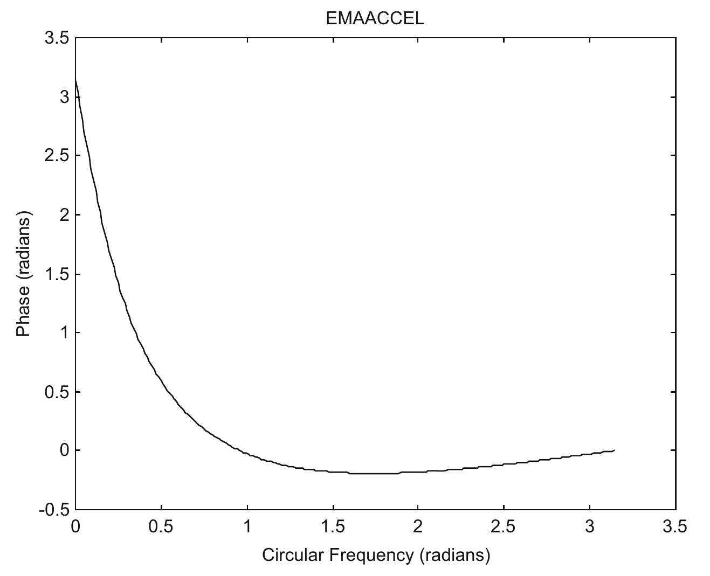

**Fig. 4.13** The phase response of EMAACCEL.

Table 4.4 lists price data simulated as sine waves with frequencies from 0.1 to 0.5 radian, at initial phase angles of 0, $\pi/2$, $\pi$ and $3\pi/2$ radians. For all $\omega$ listed, $\phi > \omega$, the trade is thus in the Sure Profit Zone, and it will always make a profit.

**Table 4.4** Price data simulated as sine waves with frequencies from 0.1 to 0.5 radian, with initial phase angles $\theta_0$ of 0, $\pi/2$, $\pi$ and $3\pi/2$ radians.

| $\omega$ (radian) | $\theta_0 = 0$ profit (%) | $\theta_0 = \pi/2$ profit (%) | $\theta_0 = \pi$ profit (%) | $\theta_0 = 3\pi/2$ profit (%) | $\phi$ (radians) | Theoretical profit (%) |
|---|---|---|---|---|---|---|
| $\pi/30 \approx 0.1$ | 80.9 | 80.9 | 80.9 | 80.9 | 2.2926 | 80.9 |
| $\pi/15 \approx 0.2$ | 99.5 | 100 | 99.5 | 100 | 1.6206 | 99.5, 100 |
| $\pi/10 \approx 0.3$ | 80.9 | 80.9 | 80.9 | 80.9 | 1.1361 | 80.9 |
| $\pi/8 \approx 0.4$ | 70.7 | 70.7 | 70.7 | 70.7 | 0.8652 | 70.7 |
| $\pi/6 \approx 0.5$ | 50.0 | 50.0 | 50.0 | 50.0 | 0.5343 | 50.0 |

Profit % is the percentage of the maximum profit that can be made using EMAACCEL as a velocity indicator. The computer program `emaaccelsig` is used to compute the profit % in columns 2–5. Theoretical profit % in column 7 is calculated from the program `buysellprice`, with $\phi$ (radians) taken from the program `emaaccel` for the corresponding $\omega$'s.

We will use EMAACCEL on real market data in Chapter 7, and see how it would perform.
