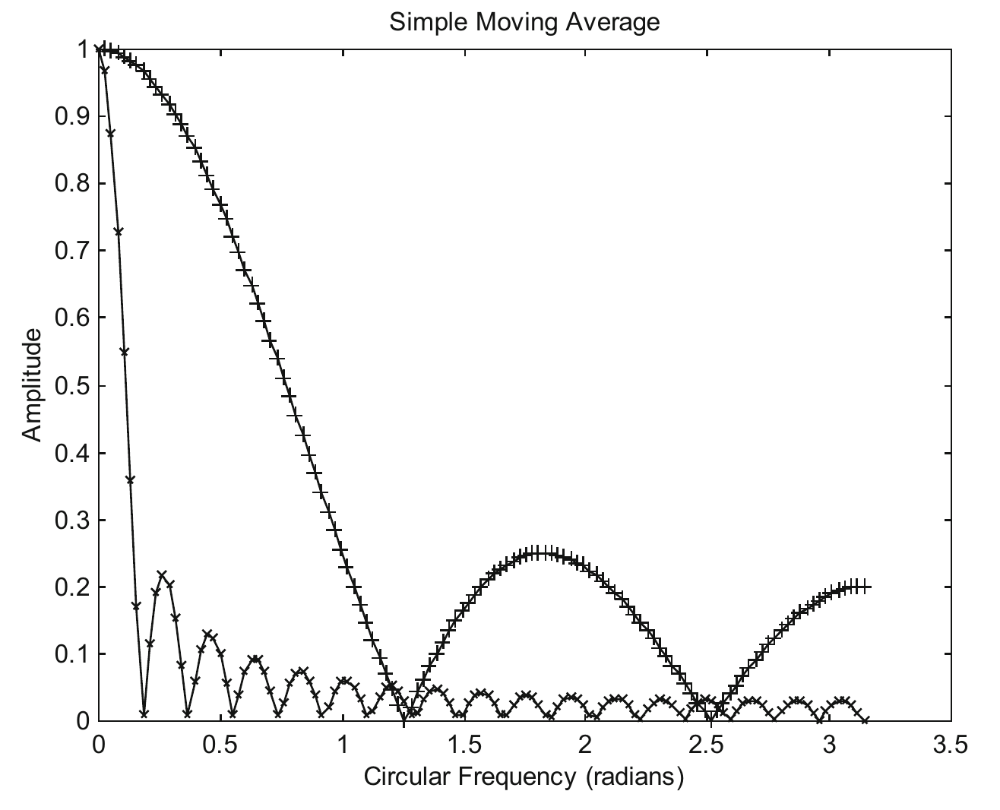
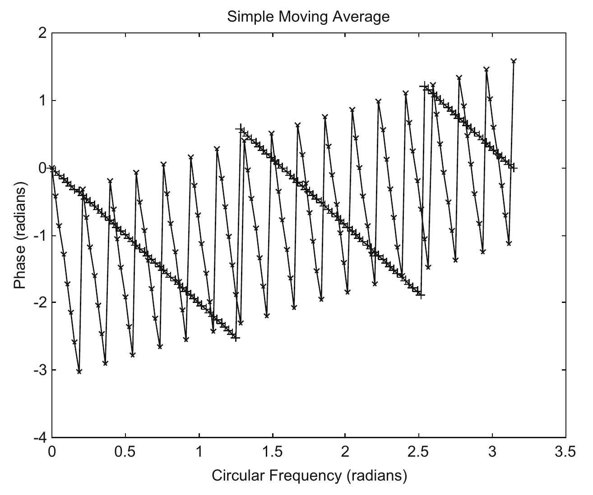
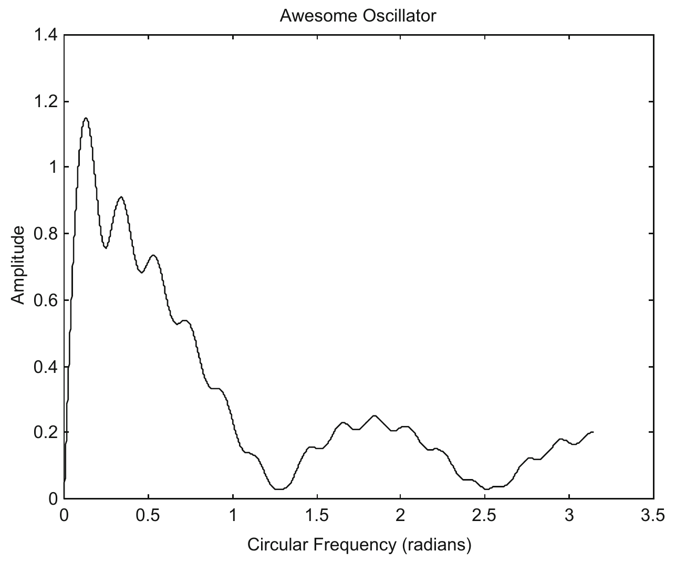
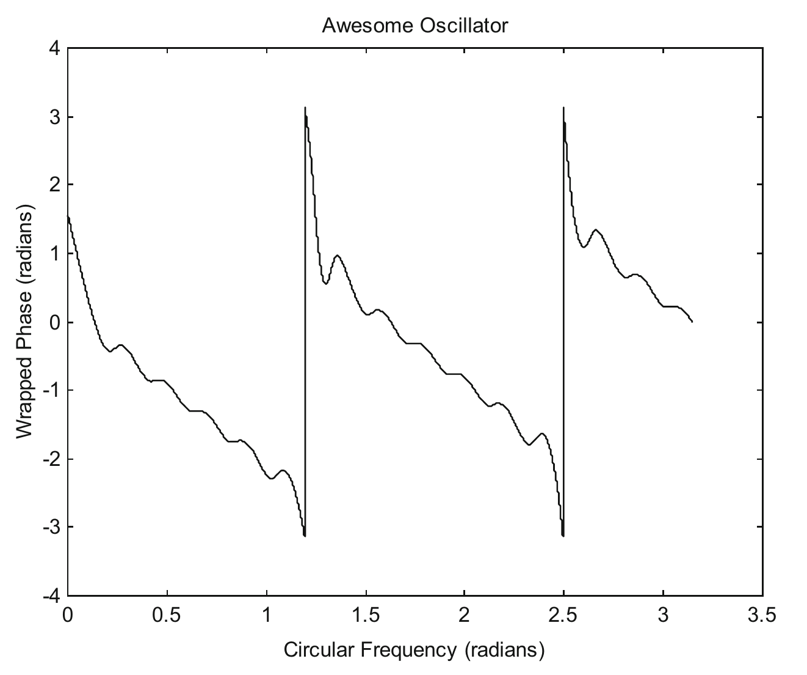
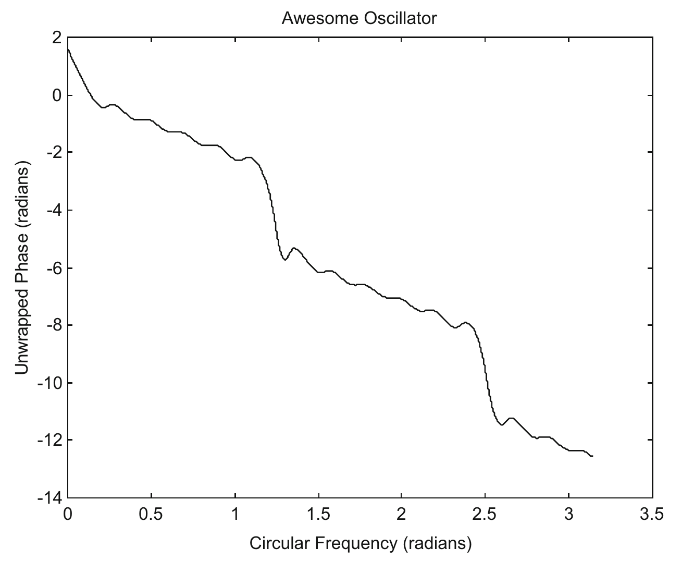
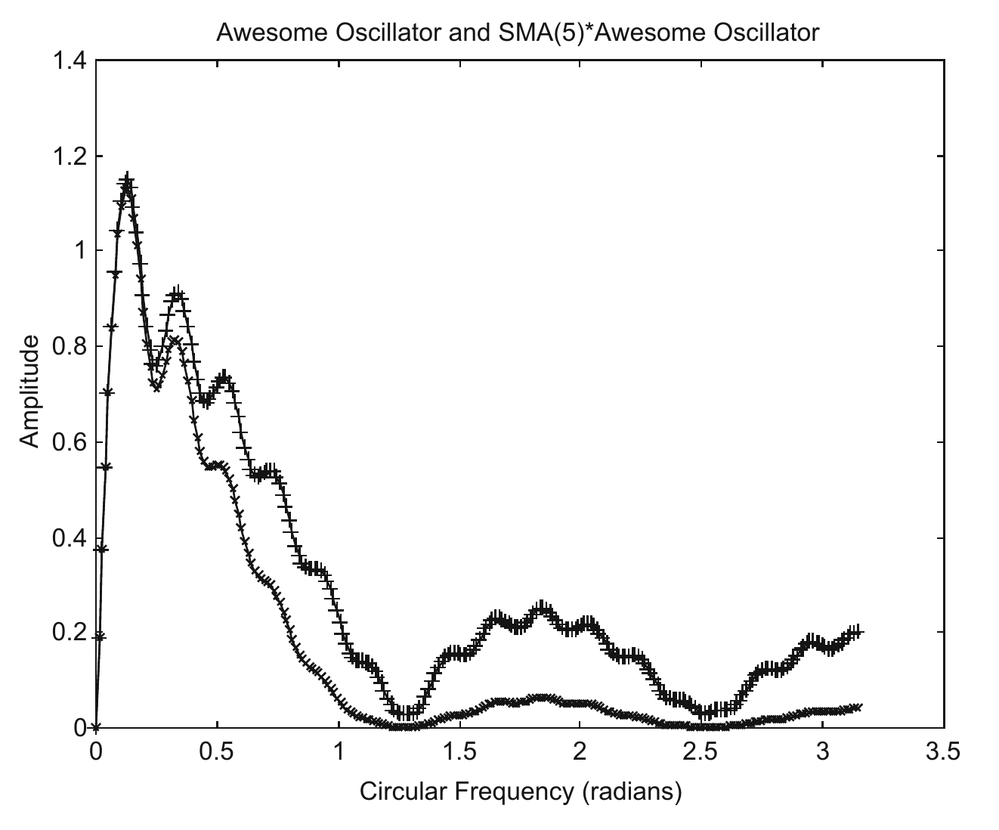
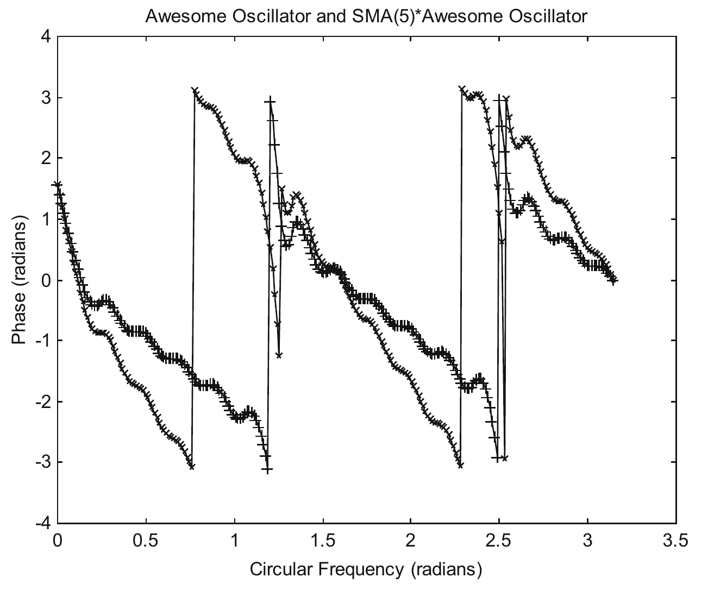
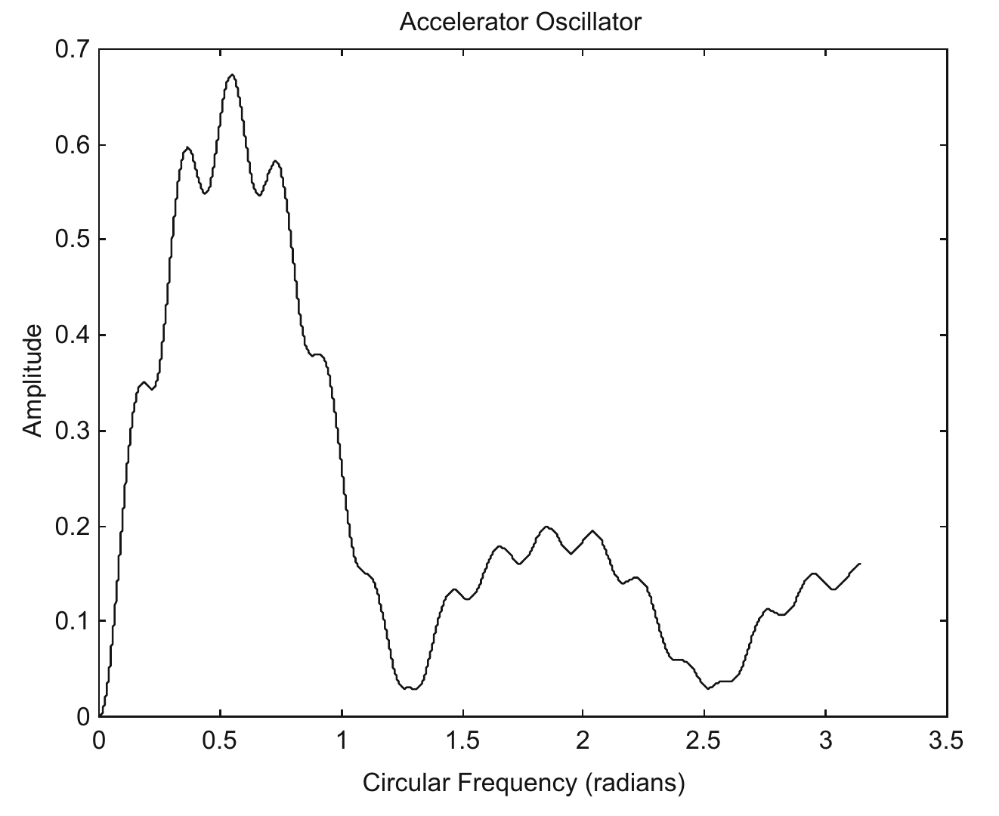
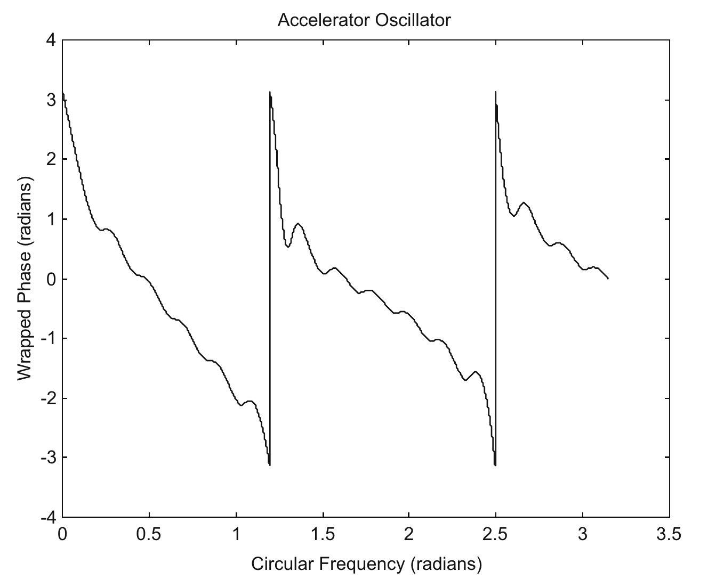
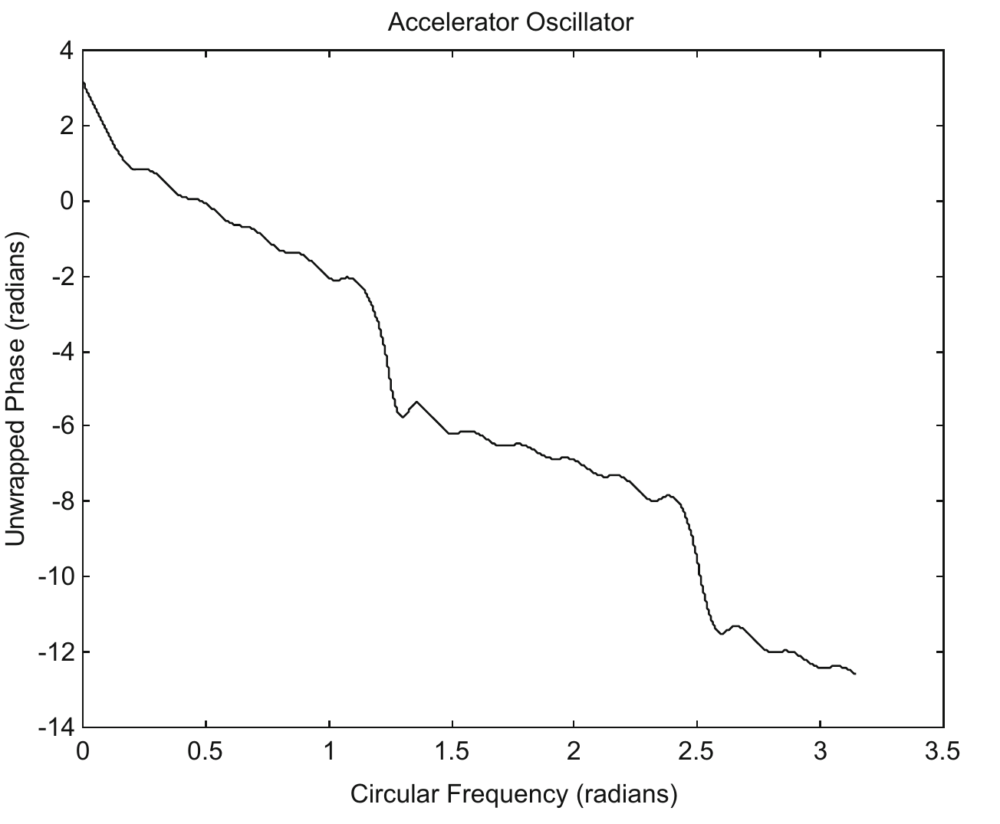

# 5 Awesome Oscillator and Accelerator Oscillator

In this chapter, we will analyze two popular trading tactics that use Simple Moving Averages.

## 5.1 Awesome Oscillator (AO)

Awesome Oscillator (AO) has been developed by Bill Williams to measure market momentum (or actually, velocity). The indicator is based on his recommendations from his books "Trading Chaos" (Williams 1995), and "New Trading Dimensions" (Williams 1998). It calculates the difference of a 5 period ($N = 5$) and a 34 period ($N = 34$) Simple Moving Average of the price. Thus, AO is a velocity indicator. The price used to calculate the Simple Moving Averages is not closing price, but rather each bar's midpoints. Here, we will take an approximation, and perform the calculations using closing prices, as the end results would not be that much different.

The AO can be compared to the MACD (which will be discussed in Chapter 6) introduced by Gerald Appel in the late 1970's. While the MACD employs Exponential Moving Averages (EMA), the AO employs Simple Moving Averages (SMA).

The amplitudes of the frequency response $H(\omega)$ of the Simple Moving Averages ($N = 5$ and 34) are plotted in Fig. 5.1. The phases of the frequency response $H(\omega)$ of the Simple Moving Averages ($N = 5$ and 34) are plotted in Fig. 5.2.

The amplitude of the frequency response $H(\omega)$ of the Awesome Oscillator is plotted in Fig. 5.3, using the program awesome. The Awesome Oscillator attains a maximum amplitude of 1.15 at $\omega = 0.13$ radians. It retains a significant portion of frequencies less than 0.5 radian. This would be useful, as the amplitudes of frequencies $\omega$ of real market data less than 0.5 radian are much larger than those of frequencies $\omega$ larger than 0.5 radian.

The phase of the frequency response $H(\omega)$ of the Awesome Oscillator (AO) is plotted in Fig. 5.4. The phase lies between $-\pi$ and $\pi$. When the phase is constrained between $-\pi$ and $\pi$, it is called wrapped phase (see Chapter 3).

The wrapped phase of the AO lies between

$$
\begin{aligned}
\pi/2 < \phi < 0 &\quad \text{for } 0 \le \omega < 0.13 \text{ radian,} \\
0 < \phi < \pi &\quad \text{for } 0.13 < \omega < 1.19 \text{ radians} \\
-\pi < \phi < 0 &\quad \text{for } 1.19 \le \omega < 1.62 \text{ radian,} \\
0 < \phi < \pi &\quad \text{for } 1.62 < \omega < 2.5 \text{ radians} \\
-\pi < \phi < 0 &\quad \text{for } 2.5 \le \omega < \pi \text{ radian}
\end{aligned}
$$

It is quite often necessary to unwrap the phase by adding appropriate multiples of $2\pi$ in order to get the correct phase delay. The unwrapped phase of the frequency response $H(\omega)$ of the Awesome Oscillator is plotted in Fig. 5.5.

The unwrapped phase of the AO is the same as the wrapped phase between $\omega = 0$ and 1.19 radians. The unwrapped phase is $\pi/2$ when $\omega$ approaches 0, and decreases to 0 when $\omega$ approaches 0.13 radian. If a straight line of Phase $\phi = -\omega$ is plotted on Fig. 5.5, it will intersect the phase plot at $\omega \approx 0.12$ radian. The region $0 < \omega < 0.12$ is described as a Sure Profit Zone, while the region $0.12 < \omega < 0.13$ is described as the Unsure Profit Zone. $0.13 < \omega < \pi$ is described as the Loss Zone, as $\phi < 0$ and a trade will always lose money. Because of the short Profit Zone ($0 < \omega < 0.13$), and the long Loss Zone, Awesome Oscillator is definitely not a profitable indicator. Furthermore, for $\omega > 1.19$ radians, the wrapped phase is different from the unwrapped phase, which represents the real time delay, thus causing a systematic error in the AO.

Table 5.1 lists price data simulated as sine waves with frequencies from 0.1 to 0.5 radian, at initial phase angles of 0, $\pi/2$, $\pi$ and $3\pi/2$ radians. The maximum possible gain traders can make equals (the peak of the price $-$ the valley of the price), i.e., $2 \times$ amplitude of the sine wave (with amplitude $= 1$). Profit % is the percentage of the maximum profit that can be made. The table shows that the trading tactic using the Awesome Oscillator as a velocity indicator, cannot make good profit. As a matter of fact, it can lose a lot of money.

**Table 5.1** Price data simulated as sine waves with frequencies from 0.1 to 0.5 radian, with initial phase angles Theta0, $\theta_0$, of 0, $\pi/2$, $\pi$ and $3\pi/2$ radians.

| $\omega$ (radian) | Theta0 = 0 radian profit (%) | Theta0 = $\pi/2$ radians profit (%) | Theta0 = $\pi$ radians profit (%) | Theta0 = $3\pi/2$ radians profit (%) | Theoretical $\phi$ from DTFT (radians) | Theoretical profit (%) |
|---|---|---|---|---|---|---|
| $\pi/30 \approx 0.1$ | 20.8 | 20.8 | 20.8 | 20.8 | 0.3099 | 20.8 |
| $\pi/15 \approx 0.2$ | $-58.8$ | $-50$ | $-58.8$ | $-50$ | $-0.4331$ | $-58.8$, $-50$ |
| $\pi/10 \approx 0.3$ | $-58.8$ | $-58.8$ | $-58.8$ | $-58.8$ | $-0.4593$ | $-58.8$ |
| $\pi/8 \approx 0.4$ | $-92.4$ | $-92.4$ | $-92.4$ | $-92.4$ | $-0.8252$ | $-92.4$ |
| $\pi/6 \approx 0.5$ | $-86.6$ | $-86.6$ | $-86.6$ | $-86.6$ | $-0.9723$ | $-86.6$ |

Profit % is the percentage of the maximum profit that can be made using the velocity indicator Awesome Oscillator. The computer program `awesig` is used to compute the profit % in columns 2–5. Theoretical profit % in column 7 is calculated from the program `buysellprice`, with $\phi$ (radians) taken from the program `awesome` for the corresponding $\omega$'s.

As said earlier, the phase of AO lies between $\pi/2$ and 0 only for $0 \le \omega \le 0.13$ radian. Thus, it will only be profitable for signals of $\omega$ less than 0.13 radian, and will not be profitable for signals of $\omega$ greater than 0.13 radian. This is reflected in Table 5.1.

## 5.2 Accelerator Oscillator (AC)

Accelerator Oscillator (AC) was introduced by Bill Williams (who also developed the Awesome Oscillator) in his book "Trading Chaos" (Williams 1995) to help traders gauge the change in momentum (or actually, acceleration). The AC can be compared to the MACDH (which will be discussed in Chapter 6) introduced by Thomas Aspray in 1986. While the MACDH employs Exponential Moving Averages (EMA), the AC employs Simple Moving Averages (SMA). The AC measures the difference between the Awesome Oscillator (AO) and its 5 period Simple Moving Average. We will call the 5 period Simple Moving Average of the Awesome Oscillator $\text{SMA}(5) \cdot \text{Awesome Oscillator}$.

Thus,

$$\text{AC} = \text{AO} - \text{SMA}(5) \cdot \text{AO}$$

As the Awesome Oscillator is a velocity indicator, the Accelerator Oscillator is therefore an acceleration indicator. Figure 5.6 plots the amplitudes of the frequency response $H(\omega)$ of the Awesome Oscillator and the $\text{SMA}(5) \cdot \text{Awesome Oscillator}$. And Fig. 5.7 plots the phases of the frequency response $H(\omega)$ of the Awesome Oscillator and the $\text{SMA}(5) \cdot \text{Awesome Oscillator}$.

Figure 5.8 plots the amplitude of the frequency response $H(\omega)$ of the Accelerator Oscillator. The Accelerator Oscillator attains a maximum amplitude of 0.67 at $\omega = 0.55$ radians.

Figure 5.9 plots the wrapped phase of the frequency response $H(\omega)$ of the Accelerator Oscillator. And Fig. 5.10 plots the unwrapped phases of the frequency response $H(\omega)$ of the Accelerator Oscillator. The unwrapped phase is the same as the wrapped phase between $\omega = 0$ and 1.19 radians.

The phase of the AC equals $-\pi$ when $\omega$ approaches 0. This is a typical property of an acceleration indicator. The wrapped phase of the AC lies between

$$
\begin{aligned}
-\pi < \phi < 0 &\quad \text{for } 0 \le \omega < 0.47 \\
0 < \phi < \pi &\quad \text{for } 0.47 < \omega < 1.19 \\
-\pi < \phi < 0 &\quad \text{for } 1.19 \le \omega < 1.62 \\
0 < \phi < \pi &\quad \text{for } 1.62 < \omega < 2.5 \\
-\pi < \phi < 0 &\quad \text{for } 2.5 \le \omega < \pi
\end{aligned}
$$

It is equal to $-\pi/2$ radian at $\omega \approx 0.14$ ($= \pi/22.4$) radian. As described earlier, $-\pi/2$ radian is the most profitable phase shift for a velocity indicator. AC, even though it is an acceleration indicator, can be used as a velocity indicator. AC will be profitable for $0 \le \omega \le 0.47$ radians when $-\pi < \phi < 0$. Its phase characteristics provides a much wider range of profitability than that of the AO, whose phase lies between $-\pi/2$ and 0 only for $0 \le \omega \le 0.13$ radians.

If a straight line of Phase $\phi = -\omega$ is plotted on Fig. 5.10, it will intersect the phase plot at $\omega \approx 0.36$. The region $0 < \omega < 0.36$ is described as a Sure Profit Zone, while the region $0.36 < \omega < 0.47$ is described as the Unsure Profit Zone. $0.47 < \omega < \pi$ is described as the Loss Zone, as $\phi < 0$ and a trade will always lose money. Accelerator Oscillator may be a profitable indicator. However, for $\omega > 1.19$ radians, the wrapped phase is different from the unwrapped phase, which represents the real time delay, thus causing a systematic error in the AC.

Table 5.2 lists price data simulated as sine waves with frequencies from 0.1 to 0.5 radian, at initial phase angles of 0, $\pi/2$, $\pi$ and $3\pi/2$ radians. The maximum possible gain traders can make equals (the peak of the price $-$ the valley of the price), i.e., $2 \times$ amplitude of the sine wave (with amplitude $= 1$). Profit % is the percentage of the maximum profit that can be made. The table shows that the trading tactic, using the Accelerator Oscillator as a velocity indicator, may make a reasonably good profit.

**Table 5.2** Price data simulated as sine waves with frequencies from 0.1 to 0.5 radian, with initial phase angles Theta0, $\theta_0$, of 0, $\pi/2$, $\pi$ and $3\pi/2$ radians.

| $\omega$ (radian) | Theta0 = 0 radian profit (%) | Theta0 = $\pi/2$ radians profit (%) | Theta0 = $\pi$ radians profit (%) | Theta0 = $3\pi/2$ radians profit (%) | Theoretical $\phi$ from DTFT (radians) | Theoretical profit (%) |
|---|---|---|---|---|---|---|
| $\pi/30 \approx 0.1$ | 99.5 | 99.5 | 99.5 | 99.5 | $-1.7237$ | 99.5 |
| $\pi/15 \approx 0.2$ | 58.8 | 66.9 | 58.8 | 66.9 | $-0.8245$ | 58.8, 66.9 |
| $\pi/10 \approx 0.3$ | 58.8 | 58.8 | 58.8 | 58.8 | $-0.6435$ | 58.8 |
| $\pi/8 \approx 0.4$ | 0 | 0 | 0 | 0 | $-0.1628$ | 0 |
| $\pi/6 \approx 0.5$ | $-50.0$ | $-50.0$ | $-50.0$ | $-50.0$ | 0.1715 | $-50.0$ |

Profit % is the percentage of the maximum profit that can be made using the Accelerator Oscillator as a velocity indicator. The computer program `accelsig` is used to compute the profit % in columns 2–5. Theoretical profit % in column 7 is calculated from the program `buysellprice`, with $\phi$ (radians) taken from the program `accelosc` for the corresponding $\omega$'s.

Table 5.2 reflects what is described above. The region $0 < \omega < 0.36$ is described as a Sure Profit Zone, while the region $0.36 < \omega < 0.47$ is described as the Unsure Profit Zone. $0.47 < \omega < \pi$ is described as the Loss Zone, as $\phi < 0$ and a trade will always lose money.

The mathematical characteristics of Accelerator Oscillator (AC), and also Awesome Oscillator (AO), have never been described, and traders may not have understood their properties. AC and AO are sometimes used somewhat differently from what is described above. However, no matter how they are being employed, their inherent properties remain the same. Thus, it is important to understand how they behave at various frequencies of the signal.
