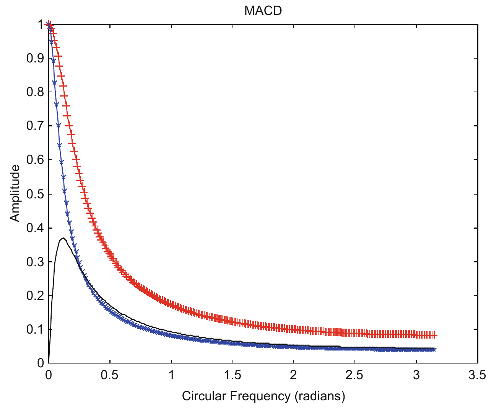
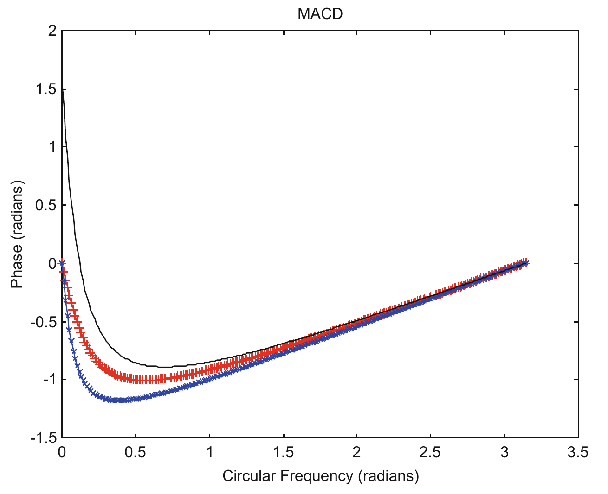
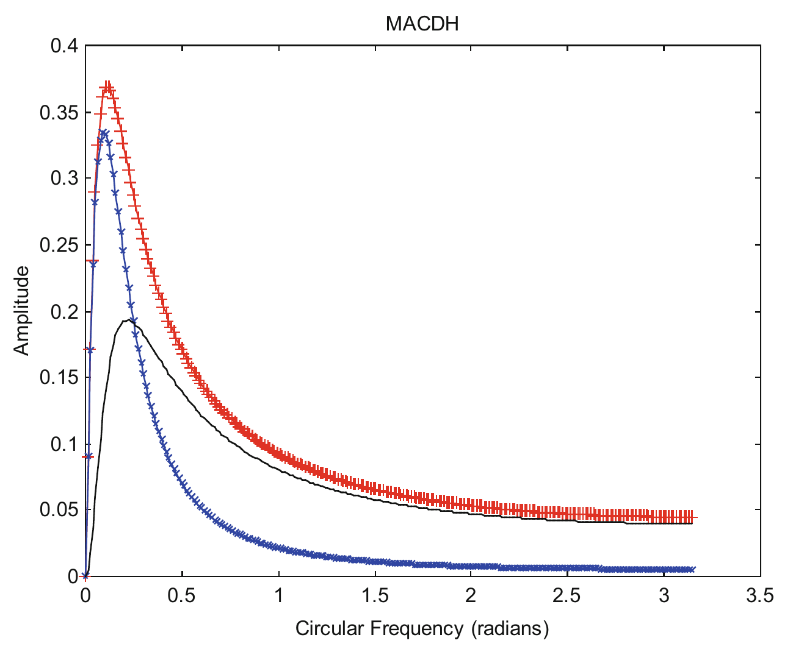
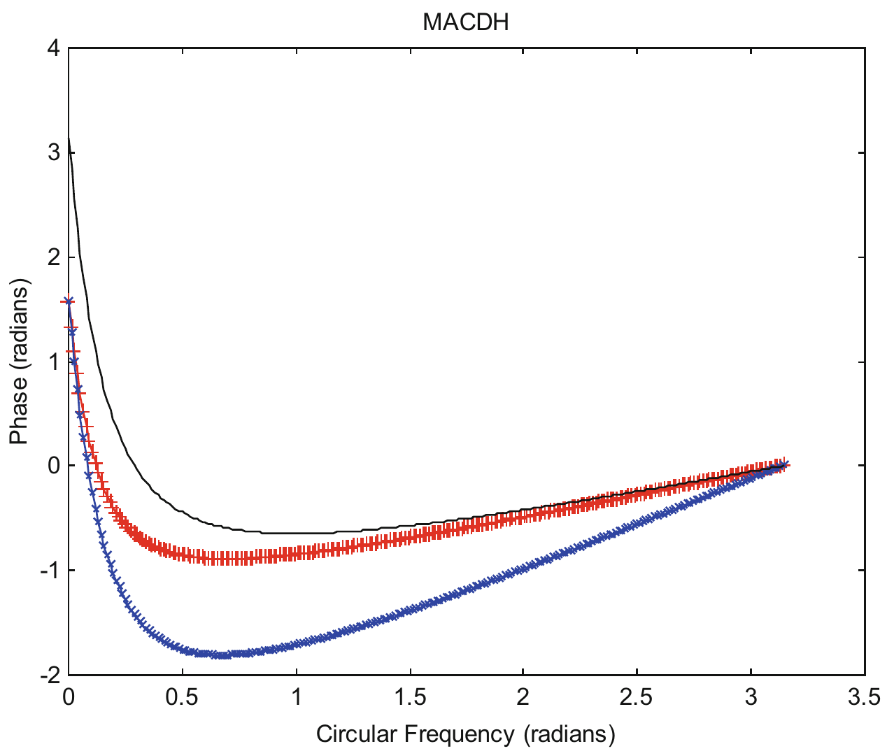
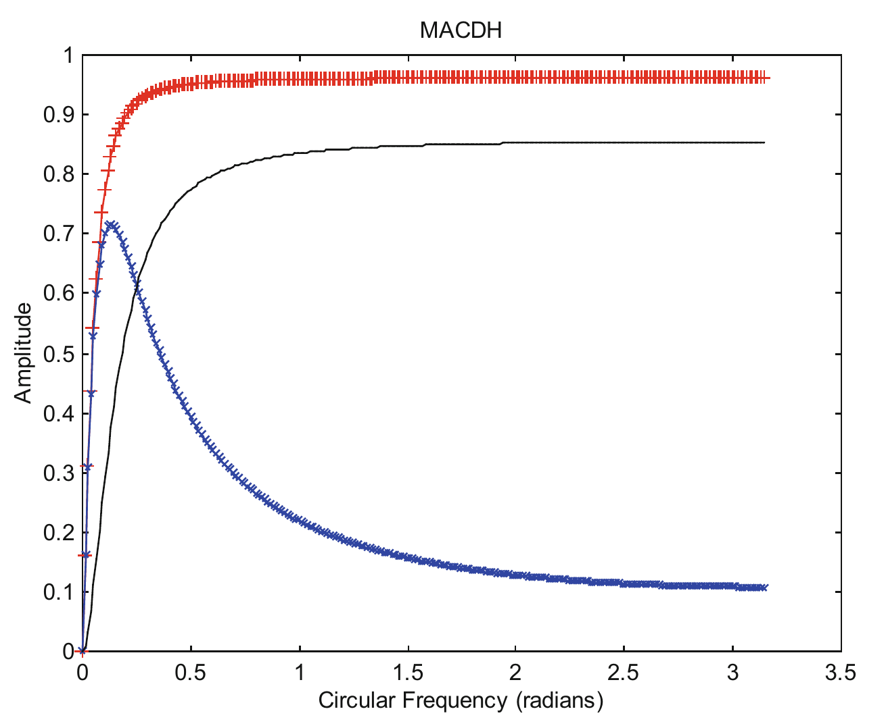
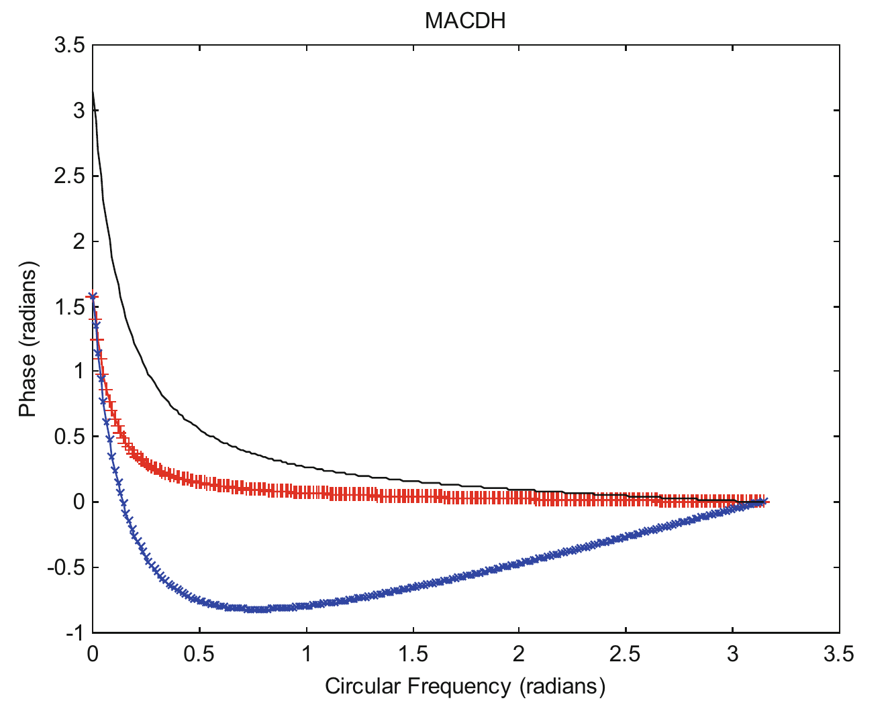

# 6 Moving Average Convergence-Divergence and Its Histogram

The Moving Average Convergence-Divergence (MACD) and its Histogram (MACDH), which use exponential moving averages for smoothing the price data, are two indicators that have been used by traders for the last 40 years.

## 6.1 Moving Average Convergence-Divergence (MACD)

The Moving Average Convergence-Divergence (MACD) indicator is a popular indicator used by traders (Elder 1993, 2002; Pring 1991; Appel 1991). The indicator was developed by Gerald Appel, an analyst and money manager in New York (Elder 1993, 2002) in the late 1970s.

The MACD indicator, often called the MACD line, is composed of two exponential moving averages, a fast EMA and a slow EMA. The line is called MACD (moving average convergence-divergence) because the fast EMA is continually converging toward and diverging from the slow EMA. Fast EMA has a smaller length, $M$, than that of slow EMA. The slow EMA ($M_2 = 26$) is subtracted from the fast EMA ($M_1 = 12$). Their difference, i.e., MACD = fast EMA − slow EMA, is plotted.

The trading rule used is based on the crossover between the fast EMA and the slow EMA. When the fast EMA crosses above the slow EMA, i.e., MACD changes from negative to positive, a buy indication is generated. When the fast EMA crosses below the slow EMA, i.e., MACD changes from positive to negative, a sell indication is implemented.

As the MACD line is actually the difference between two exponential moving averages of the price signal, it was pointed out by Chan et al. (2014) that it is actually a velocity indicator. As said earlier, it is very beneficial to take a look at the frequency response of a velocity indicator by applying Fourier Transform. The Fourier Transform of an exponential moving average is a low pass filter. The Fourier Transform of the difference of two exponential moving averages is simply the difference in their respective Fourier Transform (Brigham 1974, p. 31). Let $H_1(\omega)$ and $H_2(\omega)$ be the Fourier Transform of the fast EMA and the slow EMA respectively. The Fourier Transform of the MACD line, $H_4(\omega)$ is simply given by:

$$H_4(\omega) = H_1(\omega) - H_2(\omega) \tag{6.1}$$

As both $H_1(\omega)$ and $H_2(\omega)$ are low pass filters, their difference, $H_4(\omega)$ can be considered to be a band-pass filter (Mak 2006), which passes frequencies within a certain range, and rejects or attenuates frequencies outside that range. It can be shown that at $\omega = 0$, the phase of $H_4(\omega) = \pi/2$ (Appendix C), i.e., MACD leads the signal by $\pi/2$, which is the characteristics of velocity as discussed earlier. This also somewhat justifies that the MACD is a velocity indicator.

The amplitude of fast EMA ($M_1 = 12$) and slow EMA ($M_2 = 26$), and MACD are plotted in Fig. 6.1. The amplitude of MACD attains a maximum of 0.37 at $\omega = 0.12$ radian.

**Fig. 6.1** The amplitude of fast EMA ($M_1 = 12$) (red), slow EMA ($M_2 = 26$) (blue), and MACD (black) are plotted versus circular frequency, $\omega$.

The phase of fast EMA ($M_1 = 12$) and slow EMA ($M_2 = 26$), and MACD are plotted in Fig. 6.2.

**Fig. 6.2** The phase of fast EMA ($M_1 = 12$) (red), slow EMA ($M_2 = 26$) (blue), and MACD (black) are plotted versus circular frequency, $\omega$.

The phase of MACD starts off as $\pi/2$ at $\omega = 0$. It decreases to 0 at $\omega = \pi/26.18 \approx 0.12$ radian, and further decreases to a maximum phase lag of $-0.8914$ ($= -\pi/3.5 > -\pi/2$) radian at $\omega = 0.6938$ radian, and then slowly increases back to 0 at $\omega = \pi$ radians. That is, the phase remains negative for $0.12 < \omega < \pi$ radians. This would mean that if a trader uses MACD as a velocity indicator, he will only make a profit when the circular frequency of the signal $\omega$ is less than 0.12 radian. $0 < \omega < 0.12$ is therefore described as the Profit Zone. He would lose money when $0.12 < \omega < \pi$ radians, which is described as the Loss Zone. If a straight line of Phase $\phi = -\omega$ is plotted on Fig. 6.2, it will intersect the phase plot of MACD at $\omega \approx 0.11$. The region $0 < \omega < 0.11$ is described as a Sure Profit Zone, while the region $0.11 < \omega < 0.12$ is described as the Unsure Profit Zone. Because of the narrow Profit Zone as well as the Sure Profit Zone, one would not expect that this velocity indicator would yield a reasonably profitable indicator.

Table 6.1 lists price data simulated as sine waves with frequencies from 0.1 to 0.5 radian, at initial phase angles of 0, $\pi/2$, $\pi$ and $3\pi/2$ radians. The maximum possible gain traders can make equals (the peak of the price − the valley of the price), i.e., $2 \times$ amplitude (with amplitude = 1). Profit % is the percentage of the maximum profit that can be made. The table shows that the trading tactic employing the sign changes of the velocity indicator MACD, cannot make good profit.

**Table 6.1** Price data simulated as sine waves with frequencies from 0.1 to 0.5 radian, with initial phase angles Theta0, $\theta_0$, of 0, $\pi/2$, $\pi$ and $3\pi/2$ radians.

| | $\theta_0 = 0$ radian | $\theta_0 = \pi/2$ radians | $\theta_0 = \pi$ radians | $\theta_0 = 3\pi/2$ radians | Theoretical $\phi$ taken from DTFT | |
|---|---|---|---|---|---|---|
| $\omega$ (radian) | profit (%) | profit (%) | profit (%) | profit (%) | $\phi$ (radians) | profit (%) |
| $\pi/30 \approx 0.1$ | 10.5 | 10.5 | 10.5 | 10.5 | 0.1241 | 10.5 |
| $\pi/15 \approx 0.2$ | −58.8 | −50.0 | −58.8 | −50.0 | −0.4449 | −58.8, −50.0 |
| $\pi/10 \approx 0.3$ | −80.9 | −80.9 | −80.9 | −80.9 | −0.6911 | −80.9 |
| $\pi/8 \approx 0.4$ | −81.5 | −81.5 | −81.5 | −81.5 | −0.7867 | −92.4 |
| $\pi/6 \approx 0.5$ | −86.6 | −86.6 | −86.6 | −86.6 | −0.8649 | −86.6 |

Profit % is the percentage of the maximum profit that can be made using the velocity indicator MACD. The computer program `macdsig` is used to compute the profit % in columns 2–5. Theoretical profit % in column 7 is calculated from the program `buysellprice`, with $\phi$(radians) taken from the program `macd` for the corresponding $\omega$'s.

At $\omega = \pi/8$ radian, the theoretical result is not equal to the computational result. This is caused by the latter using only limited past data while the former uses infinite past data. The limited past data results in the sell price not equal to buy price, as is assumed in the theoretical calculation. In this particular case, the buy price is 0.924, while the sell price is 0.707, thus yielding a profit % of −81.5.

## 6.2 Moving Average Convergence-Divergence Histogram (MACDH)

MACDH was introduced by Thomas Aspray in 1986 (Penn 2010). It has received high praise from several traders, as it has been claimed to offer a deeper insight between the power of bulls and bears than the original MACD (Elder 1993; Murphy 1996). The indicator consists of two lines: the MACD line and the Signal line. The MACD line is composed of two exponential moving averages, a fast EMA and a slow EMA. Fast EMA has a smaller length, $M$, than that of slow EMA. The slow EMA ($M_2 = 26$) is subtracted from the fast EMA ($M_1 = 12$). Their difference is plotted. This is called the (fast) MACD line. An EMA ($M_3 = 9$) of the (fast) MACD line is calculated and plotted on the same chart. This is called the slow Signal line. The trading rule is based on the crossover between the MACD and Signal lines. When the fast MACD line crosses above the slow Signal line, a buy indication is generated. When the fast line crosses below the slow line, a sell indication is implemented.

As has been said, the MACD-Histogram offers a better insight into the balance of power between the bulls and bears than the MACD (Elder 1993, 2002). Not only does it show whether the bulls or bears are in control, it also shows whether they are growing stronger or weaker. Now, is this claim correct? It is, in a certain sense, correct, as MACDH emulates acceleration.

First, we can take a look at how the MACD-Histogram is defined. It is defined as the difference between the MACD line and the Signal line:

$$\text{MACD Histogram} = \text{MACD line} - \text{Signal line} \tag{6.2}$$

The MACD-Histogram is usually plotted as a histogram to distinguish it from the MACD line, but it can just as well be plotted as a line. As discussed earlier, the Signal line is the exponential moving average of the MACD line. That means, the MACD line is smoothed to form the Signal Line. As both the MACD line and Signal Line can be considered as velocity indicators, their difference, the MACD-Histogram, can be considered to be an acceleration indicator (Chan et al. 2014).

Let the Fourier Transform of the exponential moving average applied on the MACD (to form the Signal Line) be denoted by $H_3(\omega)$. Then the Fourier Transform of the Signal line will be given by $H_3(\omega) H_4(\omega)$. The Fourier Transform of the MACD-Histogram, $H_5(\omega)$, according to Eq. (6.2) will be given by

$$H_5(\omega) = H_4(\omega) - H_3(\omega) H_4(\omega) \tag{6.3a}$$

$$= (1 - H_3(\omega)) H_4(\omega) \tag{6.3b}$$

As $H_3(\omega)$ is a low pass filter, and $H_4(\omega)$ is a band-pass filter, $H_3(\omega) H_4(\omega)$ is a band-pass filter. Eq (6.3a) would mean that $H_5(\omega)$ is a band-pass filter, which is formed from the difference between two band-pass filters. Eq (6.3a) can be rewritten in the form of Eq. (6.3b). As $(1 - H_3(\omega))$ is a high pass filter, $H_5(\omega)$ is a band-pass filter as it can also be considered as a combination between a high pass filter and a band-pass filter.

Taking the lengths of the fast EMA, slow EMA and the EMA of the MACD line to be 12, 26 and 9, the amplitudes and phases of the MACD line, Signal line and MACD-Histogram are plotted in Figs. 6.3 and 6.4. Figure 6.3 shows that the MACD-Histogram is a band-pass filter, having a peak at a frequency slightly larger than that of the MACD line (which is also a band-pass filter). It filters off more of the low frequency component of a signal than the MACD line. MACDH attains a maximum amplitude of 0.19 at $\omega = 0.22$ radians.

**Fig. 6.3** The amplitudes of the MACD line (red), Signal line (blue) and MACD-Histogram (black). The lengths of the fast EMA, slow EMA and the EMA of the MACD line are 12, 26 and 9 (Mak 2006).

Figure 6.4 shows that MACDH has less phase lag than the MACD line. The phase of the Signal line is the sum of the phase of $H_3(\omega)$ and the phase of $H_4(\omega)$. At $\omega = 0$, since the phase of $H_3(\omega) = 0$ and the phase of $H_4(\omega) = \pi/2$, the phase of $H_3(\omega) H_4(\omega) = \pi/2$. At $\omega = 0$, the amplitude of $H_5(\omega)$ is 0, which implies that the real and imaginary part of $H_5(\omega)$ is 0, and the phase is in an indeterminate form. To calculate that phase, it would be easier to use Eq. (6.3b) than Eq. (6.3a), as the phase of $H_5(\omega)$ is simply given by the sum of the phase of $(1 - H_3(\omega))$ and the phase of $H_4(\omega)$. Using again the De l'Hôpital's Rule, the phase of the high pass filter, $(1 - H_3(\omega))$ at $\omega = 0$ is found to be $\pi/2$. As the phase of $H_4(\omega)$ at $\omega = 0$ is $\pi/2$, the phase of $H_5(\omega)$ is $\pi$, i.e., MACDH leads the signal by $\pi$, which is the characteristics of acceleration as discussed earlier. This somewhat justifies that MACDH is an acceleration indicator. However, MACDH is quite often used as a velocity indicator for "aggressive" trading (Chan et al. 2014).

**Fig. 6.4** The phases of the MACD line (red), Signal line (blue) and MACD-Histogram (black). The lengths of the fast EMA, slow EMA and the EMA of the MACD line are 12, 26 and 9 (Mak 2006).

The phase of MACDH starts off as $\pi$ at $\omega = 0$. It decreases to $\pi/2$ radian at $\omega = 0.0809$ radian ($= \pi/38.8$), and then to 0 at $\omega = 0.29$ radian, and further decreases to a maximum phase lag of $-0.6485$ ($= -\pi/4.8 > -\pi/2$) radians at $\omega = 0.9948$ radian, and then slowly increases to 0 at $\omega = \pi$ radians. That is, the phase remains negative for $0.29 < \omega < \pi$ radians. This would mean that if a trader uses MACDH as a velocity indicator, he will only make a profit when the circular frequency of the signal $\omega$ is less than 0.29 radian and would lose money when $0.29 < \omega < \pi$ radians. Thus, the Profit Zone for MACDH is $0 < \omega < 0.29$ radian. And the Loss Zone is $0.29 < \omega < \pi$ radians.

If a straight line of Phase $\phi = -\omega$ is plotted on Fig. 6.4, it will intersect the phase plot of MACDH at $\omega \approx 0.24$. The region $0 < \omega < 0.24$ is described as the Sure Profit Zone, while the region $0.24 < \omega < 0.29$ is described as the Unsure Profit Zone. Because of the narrow Profit Zone and Sure Profit Zone, one would not expect that this velocity indicator would yield a reasonably profitable indicator. However, as we will see later in Chapter 7, MACDH does make a very profitable velocity indicator. This is because, unlike other velocity indicators, which are mostly high pass filters, it is a band-pass filter, filtering off the high frequency signals, and eliminating all the whipsaws that will sell off a trade. Thus, it will be a very useful velocity indicator for traders when the market is in general trending with only some moments of volatility.

**Table 6.2** Price data simulated as sine waves with frequencies from 0.1 to 0.5 radian, with initial phase angles Theta0, $\theta_0$, of 0, $\pi/2$, $\pi$ and $3\pi/2$ radians.

| | $\theta_0 = 0$ radian | $\theta_0 = \pi/2$ radians | $\theta_0 = \pi$ radians | $\theta_0 = 3\pi/2$ radians | Theoretical $\phi$ taken from DTFT | |
|---|---|---|---|---|---|---|
| $\omega$ (radian) | profit (%) | profit (%) | profit (%) | profit (%) | $\phi$ (radians) | profit (%) |
| $\pi/30 \approx 0.1$ | 91.4 | 91.4 | 91.4 | 91.4 | 1.2541 | 91.4 |
| $\pi/15 \approx 0.2$ | 20.8 | 30.9 | 20.8 | 30.9 | 0.3683 | 20.8, 30.9 |
| $\pi/10 \approx 0.3$ | −30.9 | −30.9 | −30.9 | −30.9 | −0.0794 | −30.9 |
| $\pi/8 \approx 0.4$ | −38.3 | −38.3 | −38.3 | −38.3 | −0.2773 | −38.3 |
| $\pi/6 \approx 0.5$ | −50.0 | −68.3 | −50.0 | −68.3 | −0.4718 | −50.0 |

Profit % is the percentage of the maximum profit that can be made using MACDH as a velocity indicator. The computer program `macdhsig` is used to compute the profit % in columns 2–5. Theoretical profit % in column 7 is calculated from the program `buysellprice`, with $\phi$(radians) taken from the program `macdh` for the corresponding $\omega$'s.

At $\omega = \pi/6$ radian, the theoretical result is not equal to the computational result when $\theta_0 = \pi/2$ and $3\pi/2$ radians. This is caused by the latter using only limited past data while the former uses infinite past data. The limited past data results in the sell price not equal to buy price, as is assumed in the theoretical calculation.

## 6.3 MACDH1, MACDH with Price Replacing the Fast EMA

A trading tactic not uncommon with traders is buy when the market price rises above an EMA, and sell when the price crosses below the EMA. Price minus EMA can be considered to be a velocity indicator. Price minus EMA has an advantage that its phase is always greater than 0, i.e., $0 < \omega < \pi$ radians is the Profit Zone (see Chapter 4). As we will show later in Chapter 7 that MACDH would be a reasonably profitable velocity indicator, we would like to see whether we can improve it to make it more profitable. We will replace the fast EMA in MACD with price (i.e., $M_1 = 1$), and leaving $M_2 = 26$, and $M_3 = 9$. Figures 6.5 and 6.6 plot the amplitudes and phases of the MACD1 line, Signal line and MACDH1 respectively. From the amplitudes, one can see that the MACD1 and MACDH1 are high pass filters, allowing high frequency signals to go through. However, the advantages gained are that the phase of MACD1 lies between $\pi/2$ and 0 and the phase of MACDH1 lies between $\pi$ and 0 for $0 < \omega < \pi$ radians. Thus, MACDH1 will be profitable no matter what frequencies the price signal consists of. $0 < \omega < \pi$ will be the Profit Zone for MACDH1.

A straight line of Phase $\phi = -\omega$ can be plotted on Fig. 6.6. The intersection point of the straight line plot with the phase plot of MACDH1 is approximately $\omega = 0.53$. We can describe $0 < \omega < 0.53$ as a Sure Profit Zone, and $0.53 < \omega < \pi$ as an Unsure Profit Zone.

**Fig. 6.5** The amplitudes of the MACD1 line (red), Signal line (blue) and MACDH1 (black). The lengths of the fast EMA, slow EMA and the EMA of the MACD1 line are 1, 26 and 9.

**Fig. 6.6** The phases of the MACD1 line (red), Signal line (blue) and MACDH1 (black). The lengths of the fast EMA, slow EMA and the EMA of the MACD1 line are 1, 26 and 9.

**Table 6.3** Price data simulated as sine waves with frequencies from 0.1 to 0.5 radian, with initial phase angles Theta0, $\theta_0$, of 0, $\pi/2$, $\pi$ and $3\pi/2$ radians.

| | $\theta_0 = 0$ radian | $\theta_0 = \pi/2$ radians | $\theta_0 = \pi$ radians | $\theta_0 = 3\pi/2$ radians | Theoretical $\phi$ taken from DTFT | |
|---|---|---|---|---|---|---|
| $\omega$ (radian) | profit (%) | profit (%) | profit (%) | profit (%) | $\phi$ (radians) | profit (%) |
| $\pi/30 \approx 0.1$ | 99.5 | 99.5 | 99.5 | 99.5 | 1.7632 | 99.5 |
| $\pi/15 \approx 0.2$ | 86.6 | 91.4 | 86.6 | 91.4 | 1.1640 | 86.6, 91.4 |
| $\pi/10 \approx 0.3$ | 58.8 | 58.8 | 58.8 | 58.8 | 0.8500 | 58.8 |
| $\pi/8 \approx 0.4$ | 38.3 | 38.3 | 38.3 | 38.3 | 0.7004 | 38.3 |
| $\pi/6 \approx 0.5$ | 50.0 | 25.0 | 50.0 | 25.0 | 0.5357 | 50.0 |

Profit % is the percentage of the maximum profit that can be made using MACDH1 as a velocity indicator. The computer program `macdh1sig` is used to compute the profit % in columns 2–5. Theoretical profit % in column 7 is calculated from the program `buysellprice`, with $\phi$(radians) taken from the program `macdh1` for the corresponding $\omega$'s.

At $\omega = \pi/6$ radian, the computational result is not equal to the theoretical result when $\theta_0 = \pi/2$ and $3\pi/2$ radians. This is caused by the former using only limited past data while the latter uses infinite past data. The limited past data results in the sell price not equal to buy price, as is assumed in the theoretical calculation.

The mathematical characteristics of MACD and MACDH are seldom mentioned, and traders may not have understood their properties. MACD and MACDH are sometimes used somewhat differently from what is described above (Elder 1993, 2002; Pring 1991; Mak 2003, 2006). However, no matter how they are being employed, their inherent properties remain the same. Thus, it is important to understand how they behave at various frequencies of the signal.
