# 7 Trading Tactics in the Real Market

Many trading rules have already been developed by traders. However, many of them are velocity related without their realizing them. Some of the most common trading rules are;

1. Fast Simple Moving Average (SMA) crossover of a slow SMA (Pring 1991). $N$ is the length of the SMA. An $N$-bar SMA is calculated by adding the prices over the last $N$ bars and dividing by $N$. A fast SMA would have a smaller $N$ than that of a slow SMA, which would be smoother. The trader will buy when a fast SMA crosses over and is higher than a slow SMA. He will sell when the former crosses over and is lower than the latter. As pointed out by Chan et al. (2014), (Fast SMA − Slow SMA) can be considered to be a velocity indicator. When velocity is greater than 0, the trader can buy. When velocity is less than 0, the trader can sell.
2. Price crossover of an SMA. Price can be considered as an SMA with $N = 1$, and thus this rule can be considered as a particular case of Rule (1).
3. Fast Exponential Moving Average (EMA) crossover of a slow EMA. This is similar to Rule (1), but uses EMA instead of SMA. An EMA with a smaller length $M$ would be smoother than one with a larger $M$. The trader will buy when the fast EMA crosses over and is higher than the slow EMA. He will sell when the former crosses over and is lower than the latter. (Fast EMA − Slow EMA) can be considered as a velocity indicator.
4. Price crossover of an EMA. Price can be considered as an EMA with $M = 1$, and thus this rule can be considered as a particular case of Rule (3).
5. Awesome Oscillator (AO). This is a particular case of Rule (1), with the length of the fast SMA being 5 and that of the slow SMA being 34.
6. Moving Average Convergence Divergence (MACD). This is a particular case of Rule (3), with the length of the fast EMA being 12 and that of the slow EMA being 26.
7. Accelerator Oscillator (AC). AC is defined as the subtraction of the 5 period SMA of AO from an AO. It is thus an acceleration indicator, but has been used as a velocity indicator. When AC is greater than 0, the trader can buy. When AC is less than 0, the trader can sell.
8. Moving Average Convergence Divergence Histogram (MACDH). This is actually an MACD crossover of a smoothed MACD. It is defined as the subtraction of a smoothed (EMA, $M = 9$) MACD from an MACD, and is thus an acceleration indicator. However, it is not uncommonly used as a velocity indicator by aggressive traders (Chan et al. 2014). When MACDH is greater than 0, the trader can buy. When MACDH is less than 0, the trader can sell.
9. EMA3 − EMA6. This is similar to MACD, but with $M_1 = 3$, and $M_2 = 6$. The idea is to see whether there can be any increase in profitability from that of MACD, which we will show later, is not a very profitable velocity indicator.
10. EMAACCEL. This is similar to MACDH, but with $M_1 = 3$, $M_2 = 6$, and $M_3 = 9$. The idea is to see whether profitability can be improved from that of MACDH, which we will show later, is a very profitable indicator.
11. Moving Average Convergence Divergence Histogram1 (MACDH1). This is actually an MACD1 crossover of a smoothed MACD1, where the original Fast EMA is replaced with market price. The Fast EMA is replaced with the market price, so that the phase characteristics can be improved over the original MACDH. Again, this is an acceleration indicator, but can be used as a velocity indicator. When MACDH1 is greater than 0, the trader can buy. When MACDH1 is less than 0, the trader can sell.

The trading rule for all the above indicators is: when velocity (or acceleration) changes from negative to positive, traders will buy, and when velocity (or acceleration) changes from positive to negative, traders will sell. The above indicators, when used as velocity indicators, can be divided into Profit Zone and Loss Zone. The Profit Zone can further be divided into Sure Profit Zone and Unsure Profit Zone. We will summarize the characteristics of the indicators listed above in Table 7.1.

**Table 7.1** Mathematical characteristics of various velocity indicators.

| Velocity indicator | Phase at $\omega = 0$ (radians) | Sure Profit Zone $\omega$ (radian) | Unsure Profit Zone $\omega$ (radian) | Loss Zone $\omega$ (radian) | Filter |
|---|---|---|---|---|---|
| Price − SMA10$^a$ | $\pi/2$ | $0 \leq \omega < 0.40$ | $0.40 \leq \omega \leq \pi$ | | High Pass |
| Price − SMA20$^a$ | $\pi/2$ | $0 \leq \omega < 0.23$ | $0.23 \leq \omega \leq \pi$ | | High Pass |
| Awesome Oscillator | $\pi/2$ | $0 \leq \omega < 0.12$ | $0.12 \leq \omega \leq 0.13$ | $0.13 < \omega < \pi$ | High Pass |
| Accelerator Oscillator | $\pi$ | $0 \leq \omega < 0.36$ | $0.36 \leq \omega \leq 0.47$ | $0.47 < \omega < \pi$ | High Pass |
| Price − EMA3 | $\pi/2$ | $0 \leq \omega < 0.72$ | | $0.72 < \omega < \pi$ | High Pass |
| Price − EMA6 | $\pi/2$ | $0 \leq \omega < 0.54$ | | $0.54 < \omega < \pi$ | High Pass |
| EMA3 − EMA6 | $\pi/2$ | $0 \leq \omega < 0.38$ | | $0.38 < \omega < 0.64$ | High Pass |
| EMAACCEL | $\pi$ | $0 \leq \omega < 0.53$ | $0.53 < \omega < 0.96$ | $0.96 < \omega < \pi$ | High Pass |
| MACD | $\pi/2$ | $0 \leq \omega < 0.11$ | $0.11 < \omega < 0.12$ | $0.12 < \omega < \pi$ | Band Pass |
| MACDH | $\pi$ | $0 \leq \omega < 0.24$ | $0.24 < \omega < 0.29$ | $0.29 < \omega < \pi$ | Band Pass |
| MACDH1 | $\pi$ | $0 \leq \omega < 0.53$ | $0.53 < \omega < \pi$ | | High Pass |

$^a$ The Profit Zones for Price − SMA10 and Price − SMA20 are only approximations, as the former can be negative up to −0.018 radian for $0.63 < \omega < \pi$, and the latter can be negative up to −0.023 radian for $0.31 < \omega < \pi$. As the negative numbers are small, and approximately equal to 0, it can be considered a good approximation that the two indicators do not have a Loss Zone.

We can attempt to draw certain conjectures from Table 7.1.

1. For the velocity indicators, the phase at $\omega = 0$ equals to $\pi/2$. For the acceleration indicators, the phase at $\omega = 0$ equals to $\pi$. As amplitudes of frequencies of real market signals less than 0.5 radians usually are much larger than those of frequencies greater than 0.5 radian (as we will show later), and $\pi/2$ being the optimal phase shift for velocity indicators, using acceleration indicators as velocity indicators does having certain advantages, as there is a higher chance that the filtered price signal has a phase shift closer to $\pi/2$.
2. The larger the Profit Zone, and the less the Loss Zone, the more profitable the trading tactic should be. Thus, it would be best if the Profit Zone covers the range of circular frequency $0 \leq \omega \leq \pi$.
3. The larger the Sure Profit Zone, the more profitable the trading tactic should be. Thus, by looking at Table 7.1, we can probably conclude that Price − EMA3, and Price − EMA6 are profitable trading tactics, as they have the two largest Sure Profit Zones among all the indicators. By contrast, Awesome Oscillator and MACD are not very profitable trading tactics as they have the two least Sure Profit Zones. As we will see later in the real market data analysis, these seem to be correct.

One surprising result, which we will soon see, is MACDH. It is an acceleration indicator but used as a velocity indicator only by some aggressive traders, who may not have realized its potentials. MACDH does not look like a profitable trading tactic, as its Sure Profit Zone is $0 \leq \omega < 0.24$, which is not very wide. However, it is a band pass filter, filtering off most of the high frequency signals, and thus avoiding the positions to be closed by whipsaws. It is particularly profitable when the market is in general trending, and it involves less trade executions.

Real market data would have a spectrum of many frequencies. If we employ an indicator as a velocity indicator, we would prefer it to have a large Sure Profit Zone, but preferably be able to eliminate the noisy high frequency signals that will terminate a trade. That way, the velocity indicator would have a higher probability of catching profits.

Let us take a look at how some of these trading tactics apply to real market data. The market price data are taken from Yahoo Finance. All trading tactics described in Table 7.1 are applied to the following markets. Only some examples will be shown.

## 7.1 S&P 500 Index

The S&P 500 index data are taken from April 24, 2019 to August 12, 2019 ($n = 0$ to $n = 76$, i.e., 77 data points). Profit % for each trading tactic can be computed using the program `tradesp500`, by choosing different 'tactic' parameter in the program. Some of the examples are shown below.

### 7.1.1 MACDH

The top figure of Fig. 7.1 shows the S&P500 index. The middle figure shows the data being filtered by MACDH. In the bottom figure, $\times$ shows when the index is bought, and $+$ shows when it is sold. The vertical position of $+$ also shows the total profit of all the trades, while the vertical position of the green circle shows the profit of each trade. As it happened, only one trade is executed, making a profit of 152 points. As the minimum index is 2744, and the maximum index is 3026, the profit % is $152/(3026 - 2744) \times 100\% = 54\%$.

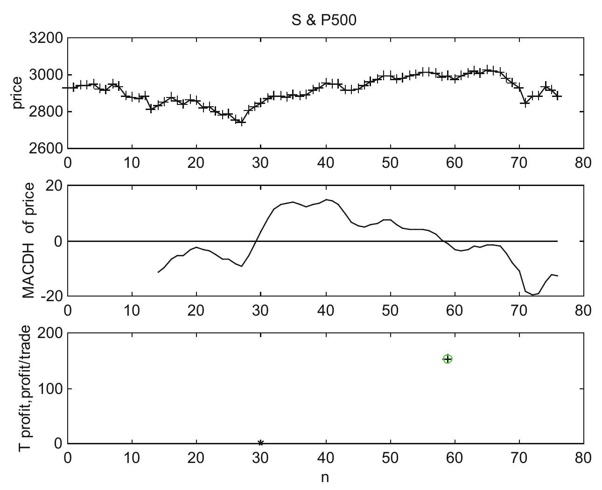

**Fig. 7.1** The top figure shows the S&P500 index. The middle figure shows the data being filtered by MACDH. In the bottom figure, $\times$ shows when the index is bought, and $+$ shows when it is sold. The vertical position of $+$ also shows the total profit of all the trades, while the vertical position of the green circle shows the profit of each trade.

### 7.1.2 MACD

Had MACD been used on the same S&P500 data, the result would have been disastrous. The top figure of Fig. 7.2 shows the S&P500 index. The middle figure shows the data being filtered by MACD. In the bottom figure, $\times$ shows when the index is bought, and $+$ shows when it is sold. The vertical position of $+$ also shows the total profit of all the trades, while the vertical position of the green circle shows the profit of each trade. Only one trade is executed, with a loss of 15% of the (maximum index − minimum index). MACD is a band pass filter, filtering off the high frequencies. However, unlike MACDH, it has a much larger phase lag (equivalent to much less phase lead) for lower frequencies (see Fig. 6.4), thus contributing to a loss. A buy indication is triggered at $n_{\text{buy}} = 36$, and a sell indication at $n_{\text{sell}} = 71$. This can be compared to $n_{\text{buy}} = 30$ and $n_{\text{sell}} = 59$ for MACDH. Thus, for MACD, both buy and sell indications are delayed, causing a lost.

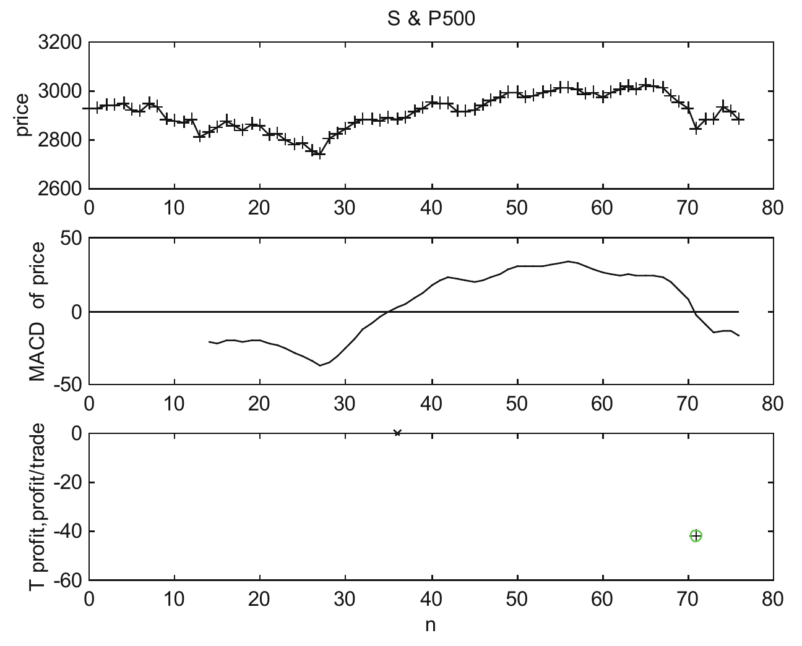

**Fig. 7.2** The top figure shows the S&P500 index. The middle figure shows the data being filtered by MACD. In the bottom figure, $\times$ shows when the index is bought, and $+$ shows when it is sold. The vertical position of $+$ also shows the total profit of all the trades, while the vertical position of the green circle shows the profit of each trade.

### 7.1.3 Price − EMA3

Both MACDH and MACD are band pass filters, and they eliminate most of the high frequencies, thus producing a very smooth filtered data. However, Price − EMA3 is a high pass filter, and it retains all the high frequencies. The advantage of a high pass filter is that it can respond to fast changes. The disadvantage is that it will involve a large number of trades.

The top figure of Fig. 7.3 shows the S&P500 index. The middle figure shows the data being filtered by Price − EMA3. In the bottom figure, $\times$ shows when the index is bought, and $+$ shows when it is sold. The vertical position of $+$ also shows the total profit of all the trades, while the vertical position of the green circle shows the profit of each trade. Thus, the vertical position of the first $\times$ is 0. Subsequent position of the $\times$ is equal to the vertical position of the previous $+$. High frequency trades can be seen when the $+$ is located close to the $\times$. Some of the high frequency trades are profitable, and some are not. This would have been expected from Table 7.1, as the high frequencies are in the Unsure Profit Zone, where a trade can make a profit or a loss. Eight trades are executed, making a total profit of 42%.

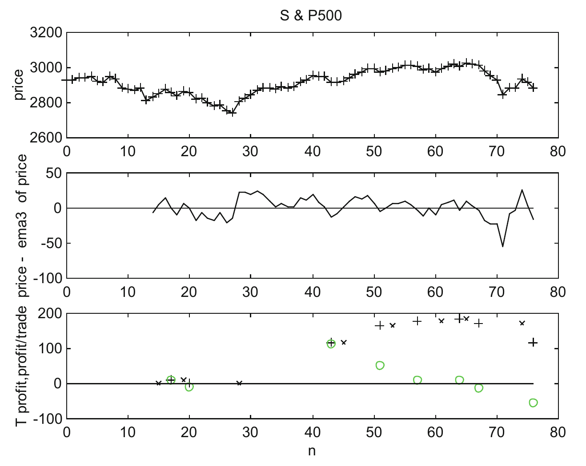

**Fig. 7.3** The top figure shows the S&P500 index. The middle figure shows the data being filtered by Price − EMA3. In the bottom figure, $\times$ shows when the index is bought, and $+$ shows when it is sold. The vertical position of $+$ also shows the total profit of all the trades, while the vertical position of the green circle shows the profit of each trade.

### 7.1.4 Fast Fourier Transform and Inverse Fast Fourier Transform of S&P500 Index

As the phase lags of the indicators would depend on the frequency contents of the past data, we definitely would be interested to find out the frequency spectrum of the data. The circular frequencies of the S&P500 data can be calculated using the subroutine `fft` (Fast Fourier Transform) in the MATLAB program. Its magnitude is plotted in Fig. 7.4. The first point, corresponding to $\omega = 0$, is not plotted as it represents a constant in the signal, and its magnitude is much larger than those of the rest of the frequencies. As mentioned in Chapter 2, this constant does not affect the calculation of the velocity and acceleration indicators. The magnitude of the fft is mirrored at the center of the plot as the data is real and not complex. The interval of the circular frequency is calculated as $2\pi/77 = 0.0816$ radian, as there are 77 data points. It can be seen from Fig. 7.4 that frequencies of signals of larger amplitudes are less than $10 \times 0.0816 \approx 0.8$ radians. However, higher frequencies do exist, and can generate whipsaws, which usually result in trading losses.

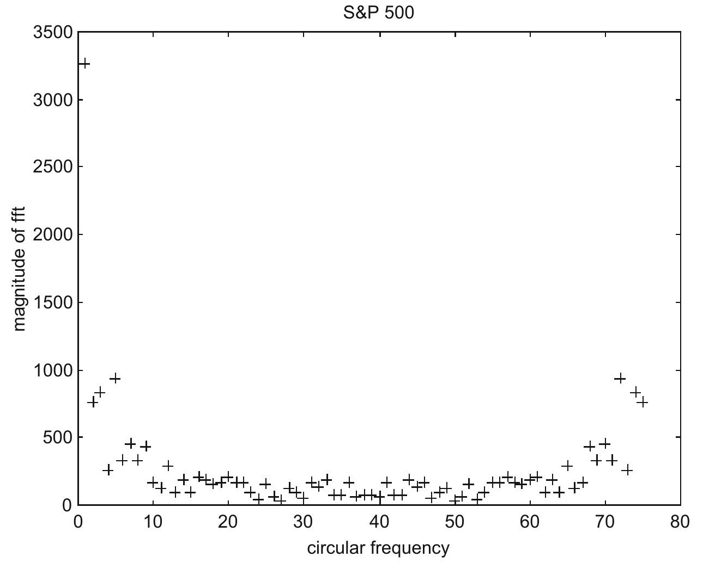

**Fig. 7.4** Magnitude of the circular frequencies $\omega$ of the S&P500 index calculated from Fast Fourier Transform (fft). The first point, corresponding to circular frequency $\omega = 0$, is not plotted as it represents a constant in the signal, and its magnitude is much larger than those of the rest of the frequencies. The magnitude of the fft is mirrored at the center of the plot. This figure can be plotted using the program `fftsp500`, which is listed in Appendix D.

It should be pointed out that, to accurately reproduce a signal, the Nyquist (sampling) theorem (Brigham 1974; Broesch 1997) states that the signal has to be sampled at a rate greater than twice the frequency of the highest frequency component existing in the signal, i.e., the number of sampling points per cycle has to be more than two for the highest frequency. This is equivalent to saying that the sampling circular frequency for the highest frequency has to be smaller than $\pi$ radians, or the highest frequency detected in the Fast Fourier Transform is $\pi$ radians.

Using the subroutine `ifft` (Inverse Fast Fourier Transform) in the MATLAB program on the fft data, we can retrieve the fft data back to the original S&P500 index. Figure 7.5 plots the original S&P500 index as a line, and the magnitude of ifft of fft as red $+$'s. The latter is exactly the same as the former. The magnitude of ifft is the same as the real of ifft, as the S&P500 data are real numbers. The phase of the ifft are 0's.

A program called `fftsinewave` is listed in Appendix D. The program calculates the Fast Fourier Transform of a pure sine wave of a certain frequency. The program would allow the readers to change the frequency, amplitude, phase shift, number of data points of the sine wave, or even combination of sine waves, and check the accuracy of the frequencies calculated from the Fast Fourier Transform. The program also computes the ifft of the fft of the sine wave, which would be exactly the same as the sine wave.

The readers can also write programs to find the fft of the real market signal after filtering by a technical indicator, as to gain further understanding what has been done to the signal by the indicator. If high frequency signals still remain after filtering, a trade can easily be terminated, as one would expect from the middle figure of Fig. 7.3 (compare with the middle figure of Fig. 7.2).

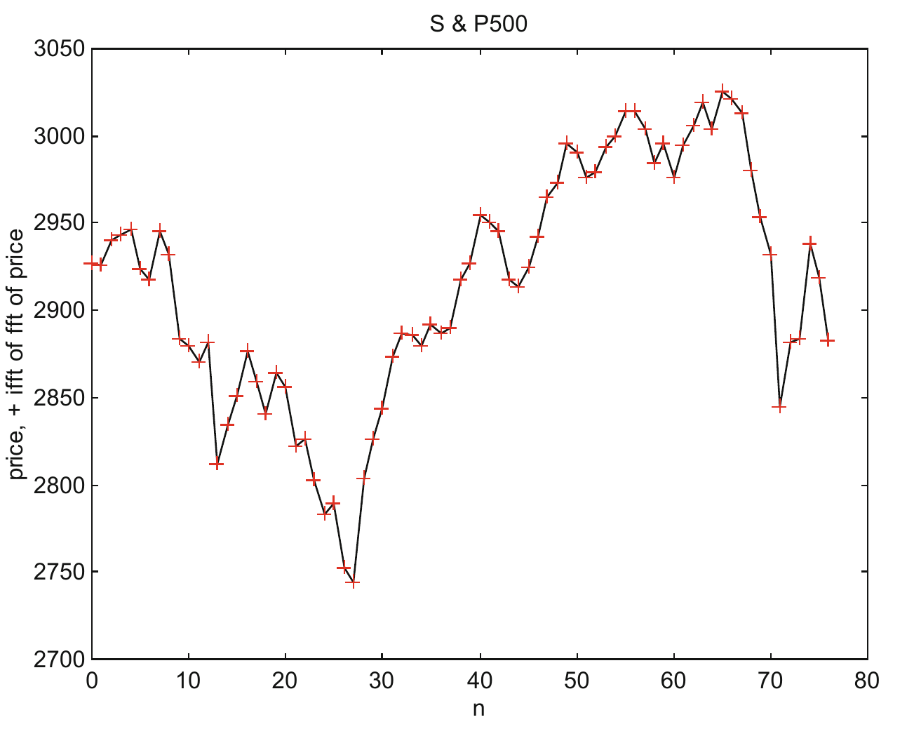

**Fig. 7.5** The original S&P500 index is plotted as a line, and the magnitude of ifft of fft is plotted as red $+$'s. The figure can be plotted using the program `fftsp500`, which is listed in Appendix D.

## 7.2 Hang Seng Index

The Hang Seng index data are taken from March 1, 2019 to August 12, 2019 ($n = 0$ to $n = 107$, i.e. 108 data points). Profit % for each trading tactic can be computed using the program `tradehangseng`, by choosing different 'tactic' parameter in the program. Some of the examples are shown below.

### 7.2.1 Price − SMA10

The top figure of Fig. 7.6 shows the Hang Seng index. The middle figure shows the data being filtered by Price − SMA10. In the bottom figure, $\times$ shows when the index is bought, and $+$ shows when it is sold. The vertical position of $+$ also shows the total profit of all the trades, while the vertical position of the green circle shows the profit of each trade. High frequency trades can be seen when $+$ is close to $\times$. Seven trades are executed. The two low frequency trades are profitable, while the five high frequency trades are not. This would have been expected from Table 7.1, as the Unsure Profit Zone is $0.40 \leq \omega \leq \pi$, where a trade can make a profit or a loss. The total profit made is 664 points. As the minimum index is 25,824, and the maximum is 30,157, the profit % is $664 \div (30{,}157 - 25{,}824) \times 100\% = 15\%$.

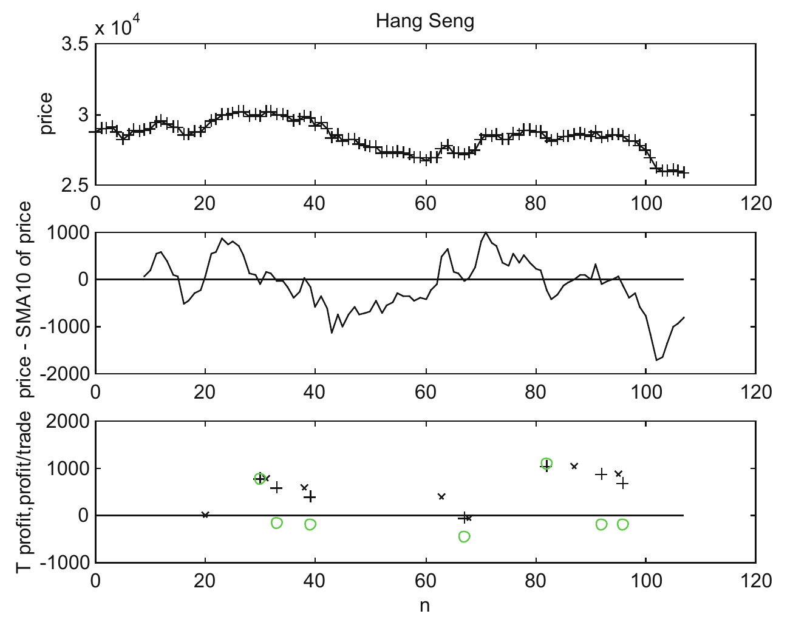

**Fig. 7.6** The top figure shows the Hang Seng index. The middle figure shows the data being filtered by Price − SMA10. In the bottom figure, $\times$ shows when the index is bought, and $+$ shows when it is sold. The vertical position of $+$ also shows the total profit of all the trades, while the vertical position of the green circle shows the profit of each trade.

### 7.2.2 Awesome Oscillator

The top figure of Fig. 7.7 shows the Hang Seng index. The middle figure shows the data being filtered by Awesome Oscillator. In the bottom figure, $\times$ shows when the index is bought, and $+$ shows when it is sold. The vertical position of $+$ also shows the total profit of all the trades, while the vertical position of the green circle shows the profit of each trade. Only one trade is executed, making a total loss of 16%. We can compare the amplitudes of the frequency response $H(\omega)$ of the Awesome Oscillator in Fig. 5.3 with that of the (1 − SMA10) in Fig. 3.19. It can be seen that the latter can pick up high frequencies and the former is much more reserved in doing so. This is actually an advantage of the former as most high frequency trades are losers. Thus, only one low frequency trade is executed. However, the former has a much larger phase lag than the latter when low frequencies are picked up, contributing to a loss instead of a profit.

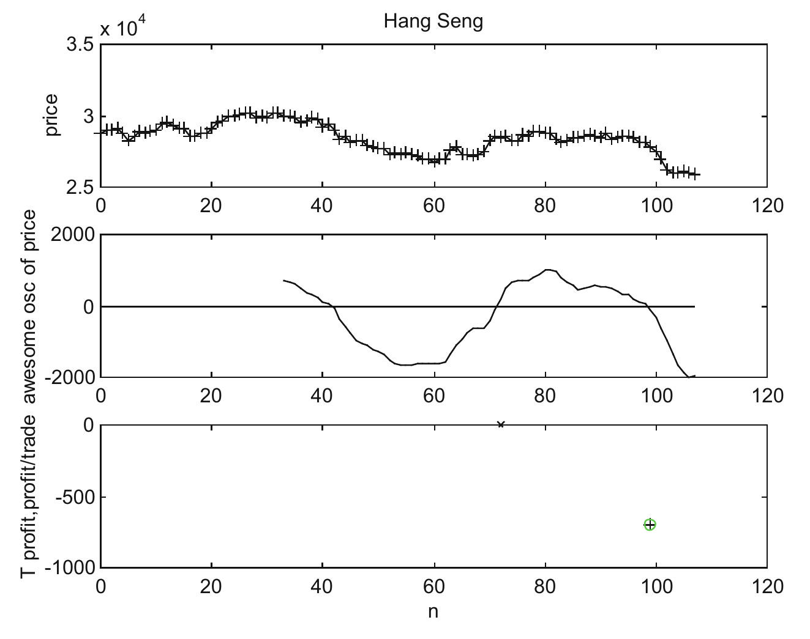

**Fig. 7.7** The top figure shows the Hang Seng index. The middle figure shows the data being filtered by Awesome Oscillator. In the bottom figure, $\times$ shows when the index is bought, and $+$ shows when it is sold. The vertical position of $+$ also shows the total profit of all the trades, while the vertical position of the green circle shows the profit of each trade.

### 7.2.3 Accelerator Oscillator

The top figure of Fig. 7.8 shows the Hang Seng index. The middle figure shows the data being filtered by Accelerator Oscillator. In the bottom figure, $\times$ shows when the index is bought, and $+$ shows when it is sold. The vertical position of $+$ also shows the total profit of all the trades, while the vertical position of the green circle shows the profit of each trade. Two trades are executed, making a total profit of 18%. We can compare the phase of the frequency response $H(\omega)$ of the Accelerator Oscillator in Fig. 5.9 with that of the Awesome Oscillator in Fig. 5.4. It can be seen that the former has a much larger Sure Profit Zone than the latter. This is also obvious from Table 7.1. That explains why the former makes a profit, while the latter makes a loss.

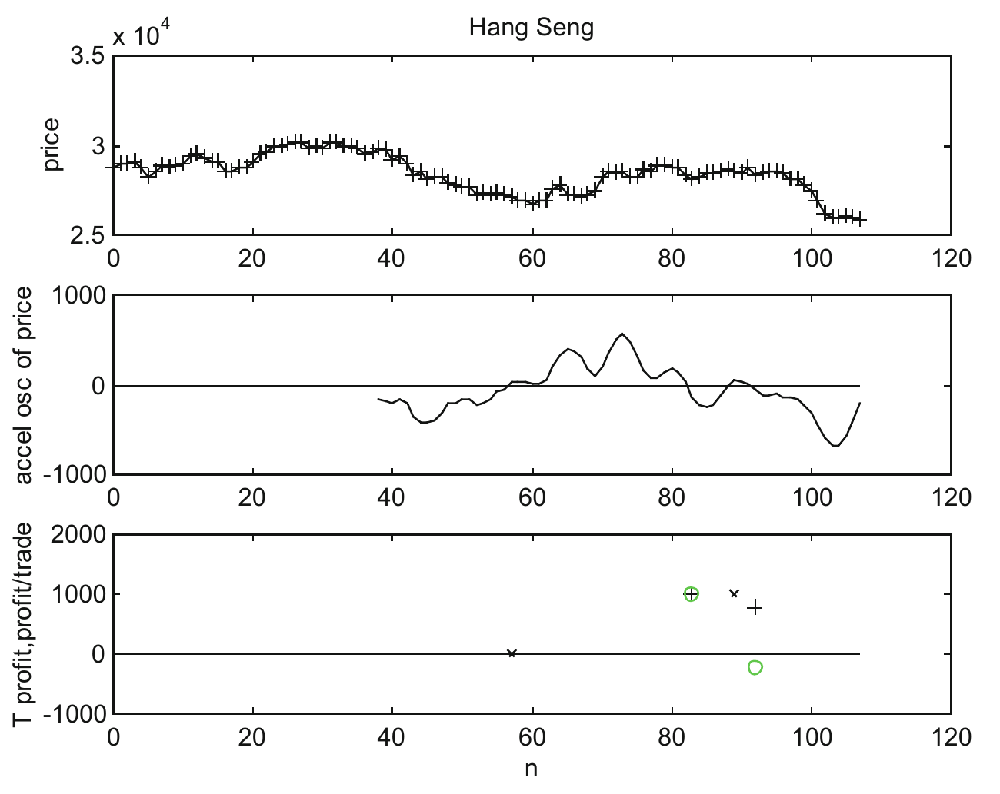

**Fig. 7.8** The top figure shows the Hang Seng index. The middle figure shows the data being filtered by Accelerator Oscillator. In the bottom figure, $\times$ shows when the index is bought, and $+$ shows when it is sold. The vertical position of $+$ also shows the total profit of all the trades, while the vertical position of the green circle shows the profit of each trade.

### 7.2.4 Fast Fourier Transform of the Hang Seng Index

The circular frequency in the Hang Seng index data can be calculated using the subroutine `fft` (Fast Fourier Transform) in the MATLAB program. Its magnitude is plotted in Fig. 7.9. The first point, corresponding to $\omega = 0$, is not plotted as it represents a constant in the signal. As mentioned in Chapter 2, this constant does not affect the calculation of the velocity and acceleration indicators. The interval of the circular frequency is calculated as $2\pi/108 = 0.058$ radian, as there are 108 data points. Figure 7.9 shows that most frequencies lie within $20 \times 0.058 \approx 1.2$ radian.

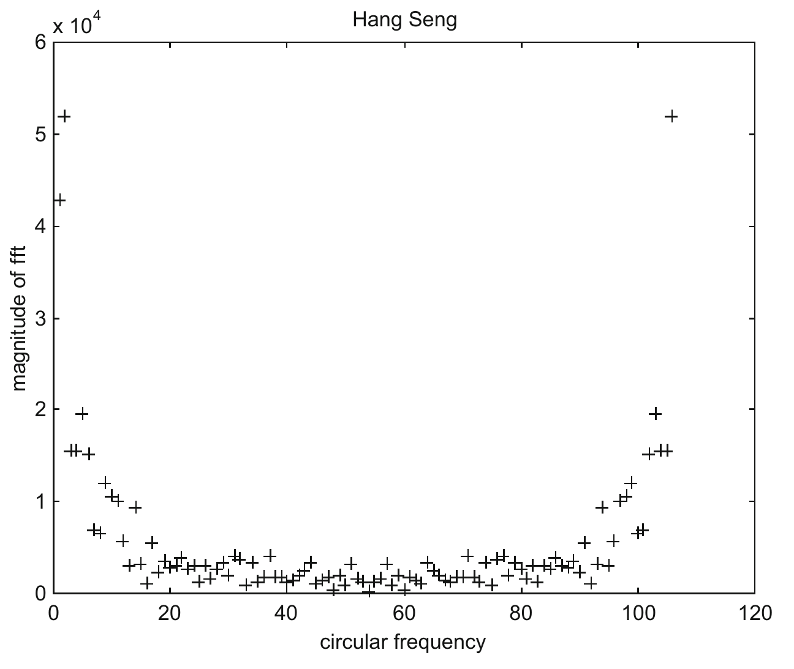

**Fig. 7.9** Magnitude of the circular frequencies $\omega$ of the Hang Seng index calculated from Fast Fourier Transform (fft). The first point, corresponding to circular frequency $\omega = 0$, is not plotted as it represents a constant in the signal, and its magnitude is much larger than those of the rest of the frequencies. The magnitude of the fft is mirrored at the center of the plot. The figure can be plotted using the program `ffthangseng`, which is listed in Appendix D.

## 7.3 FTSE 100 Index

The FTSE 100 index data are taken from March 1, 2019 to August 14, 2019 ($n = 0$ to $n = 114$, i.e., 115 data points). Profit % for each trading tactic can be computed using the program `tradeftse`, by choosing different 'tactic' parameter in the program. Some of the examples are shown below.

### 7.3.1 Price − EMA6

The top figure of Fig. 7.10 shows the FTSE 100 index. The middle figure shows the data being filtered by Price − EMA6. In the bottom figure, $\times$ shows when the index is bought, and $+$ shows when it is sold. The vertical position of $+$ also shows the total profit of all the trades, while the vertical position of the green circle shows the profit of each trade. High frequency trades can be seen when $+$ is close to $\times$. Seven trades are executed, making a total profit of 512 points. Most profits came from low frequency trades. As the minimum index is 7104, and the maximum is 7686, the profit % is $512/(7686 - 7104) \times 100\% = 512/582 \times 100\% = 88\%$. This tactic has the advantage that it can make reasonable profit when the market is trending. Furthermore, it can respond to changes in a fast moving market, picking up a rise in a price movement, and getting out quickly in a market crash. As a matter of fact, in the last trade when there is a market crash, the position is bought at 7549 and sold at 7586, making a slight profit of 6% in 3 days.

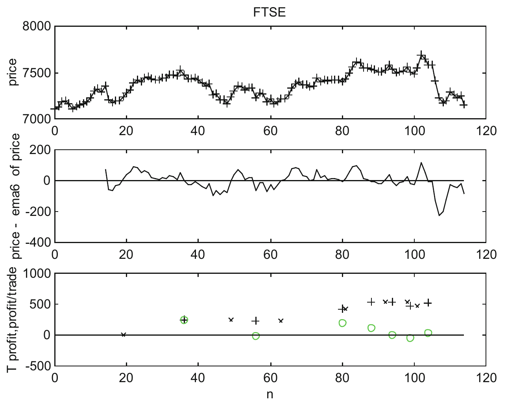

**Fig. 7.10** The top figure shows the FTSE100 index. The middle figure shows the data being filtered by Price − EMA6. In the bottom figure, $\times$ shows when the index is bought, and $+$ shows when it is sold. The vertical position of $+$ also shows the total profit of all the trades, while the vertical position of the green circle shows the profit of each trade.

### 7.3.2 MACDH

The top figure of Fig. 7.11 shows the FTSE 100 index. The middle figure shows the data being filtered by MACDH. In the bottom figure, $\times$ shows when the index is bought, and $+$ shows when it is sold. The vertical position of $+$ also shows the total profit of all the trades, while the vertical position of the green circle shows the profit of each trade. Four trades are executed, the two low frequency trades are profitable while the two high frequency trades are not, and thus making a total loss of 15%. For the last trade, where a market crash occurred, buy indication was triggered at $n = 102$ at 7686, which is the peak of the index data. The position was sold 4 days later at 7407, losing 279 points, which is 48% ($= 279/582$) of the whole range. There are two problems for this trade. Firstly, the phase lag causes the index to be bought too late. Secondly, the trade was also sold too late. Had the index been monitored on an hourly basis instead of a daily basis, and skipped convolution was applied, the position could have been closed at the hour when MACDH crossed from positive to negative at 7550, rather than at the end of the day at 7407, and thus losing only 136 ($= 7686 - 7550$) index point, which amounts to 23% ($= 136/582$) of the whole range, and resulting instead a total profit of 10% for the four trades.

MACDH, though described as a band pass filter, does allow some high frequencies to pass. It is these high frequency trades that led to the loss. As we can see in the time domain, as well as in the frequency spectrum of the FTSE 100 (Fig. 7.12) in the next section, the data does contain more high frequencies than the S&P 500 index data, which is smoother.

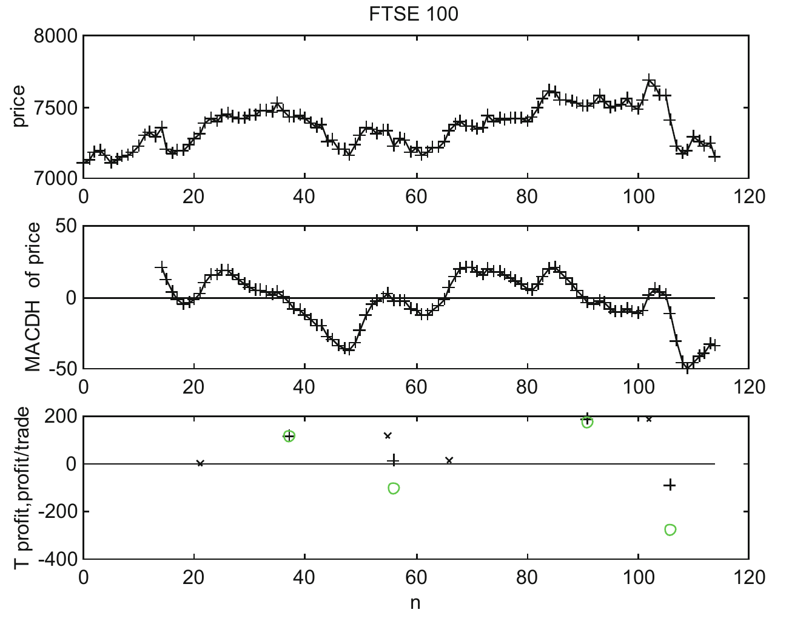

**Fig. 7.11** The top figure shows the FTSE100 index. The middle figure shows the data being filtered by MACDH. In the bottom figure, $\times$ shows when the index is bought, and $+$ shows when it is sold. The vertical position of $+$ also shows the total profit of all the trades, while the vertical position of the green circle shows the profit of each trade.

### 7.3.3 Fast Fourier Transform of the FTSE 100 Index

The circular frequency in the FTSE 100 data can be calculated using the subroutine `fft` (Fast Fourier Transform) in the MATLAB program. Its magnitude is plotted in Fig. 7.12. The first point, corresponding to $\omega = 0$, is not plotted as it represents a constant in the signal. As mentioned in Chapter 2, this constant does not affect the calculation of the velocity and acceleration indicators. The interval of the circular frequency is calculated as $2\pi/115 = 0.055$ radian, as there are 115 data points. Most of the signals lie within $20 \times 0.055 = 1.1$ radians.

**Fig. 7.12** Magnitude of the circular frequencies $\omega$ of the FTSE 100 index calculated from Fast Fourier Transform (fft). The first point, corresponding to circular frequency $\omega = 0$, is not plotted as it represents a constant in the signal, and its magnitude is much larger than those of the rest of the frequencies. The magnitude of the fft is mirrored at the center of the plot. The figure can be plotted using the program `fftftse`, which is listed in Appendix D.

## 7.4 CAC 40 Index

The CAC40 index data are taken from March 6, 2019 to August 21, 2019 ($n = 0$ to $n = 117$, i.e., 118 data points). Profit % for each trading tactic can be computed using the program `tradecac40`, by choosing different 'tactic' parameter in the program. Some of the examples are shown below.

### 7.4.1 MACDH

The top figure of Fig. 7.13 shows the CAC40 index. The middle figure shows the data being filtered by MACDH. In the bottom figure, $\times$ shows when the index is bought, and $+$ shows when it is sold. The vertical position of $+$ also shows the total profit of all the trades, while the vertical position of the green circle shows the profit of each trade. Two low frequency trades are executed, making a total profit of 320 points. As the minimum index is 5207, and the maximum is 5620, the profit % is $320/(5620 - 5207) \times 100\% = 77\%$.

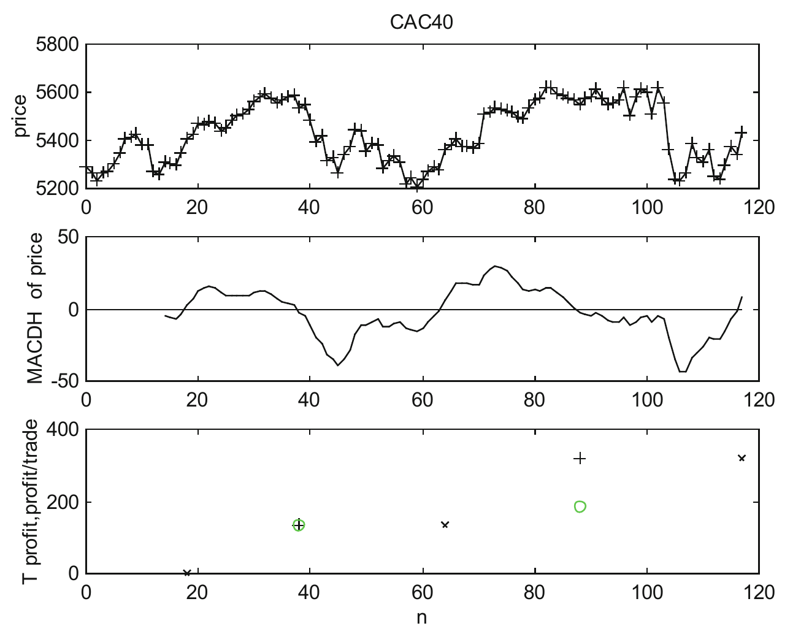

**Fig. 7.13** The top figure shows the CAC40 index. The middle figure shows the data being filtered by MACDH. In the bottom figure, $\times$ shows when the index is bought, and $+$ shows when it is sold. The vertical position of $+$ also shows the total profit of all the trades, while the vertical position of the green circle shows the profit of each trade.

### 7.4.2 MACDH1

The top figure of Fig. 7.14 shows the CAC40 index. The middle figure shows the data being filtered by MACDH1. In the bottom figure, $\times$ shows when the index is bought, and $+$ shows when it is sold. The vertical position of $+$ also shows the total profit of all the trades, while the vertical position of the green circle shows the profit of each trade. Thirteen trades are executed, making a total loss of 155 points, which amounts to a loss of 38%. Most of the trades are high frequency trades and are losers. MACDH1 was originally designed by us to see whether profitability can be improved from that of MACDH. While it does eliminate the Loss Zone of MACDH, it has also turned into a high pass filter, and cannot filter off the high frequencies as MACDH can. Thus, it does not seem as if MACDH1 is a good idea.

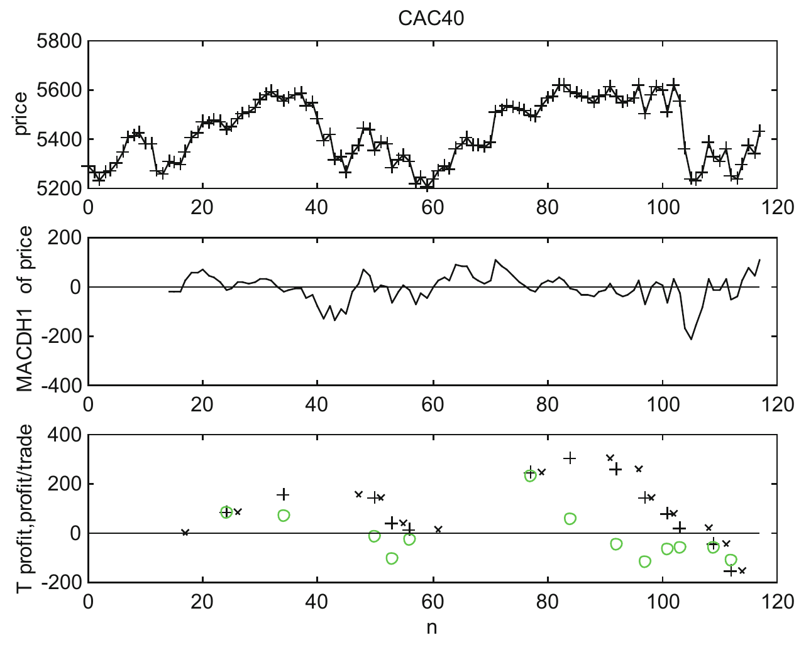

**Fig. 7.14** The top figure shows the CAC 40 index. The middle figure shows the data being filtered by MACDH1. In the bottom figure, $\times$ shows when the index is bought, and $+$ shows when it is sold. The vertical position of $+$ also shows the total profit of all the trades, while the vertical position of the green circle shows the profit of each trade.

### 7.4.3 Fast Fourier Transform of CAC 40 Index

The circular frequency in the CAC 40 data can be calculated using the subroutine `fft` (Fast Fourier Transform) in the MATLAB program. Its magnitude is plotted in Fig. 7.15. The first point, corresponding to $\omega = 0$, is not plotted as it represents a constant in the signal. As mentioned in Chapter 2, this constant does not affect the calculation of the velocity and acceleration indicators. The interval of the circular frequency is calculated as $2\pi/118 = 0.053$ radian, as there are 118 data points. Figure 7.15 shows that most frequencies lie within $20 \times 0.053 \approx 1.1$ radian. Compared to the previous S&P 500 data, the CAC 40 data is less smooth.

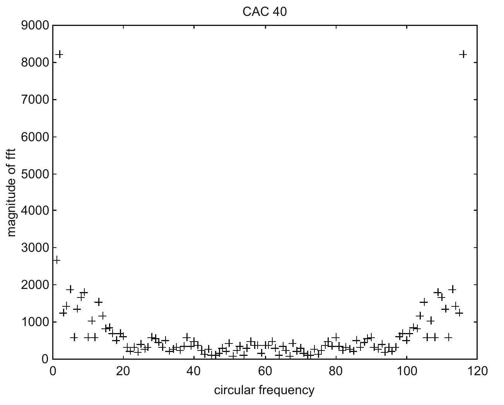

**Fig. 7.15** Magnitude of the circular frequencies $\omega$ of the CAC 40 index calculated from Fast Fourier Transform (fft). The first point, corresponding to circular frequency $\omega = 0$, is not plotted as it represents a constant in the signal, and its magnitude is much larger than those of the rest of the frequencies. The magnitude of the fft is mirrored at the center of the plot. The figure can be plotted using the program `fftcac40`, which is listed in Appendix D.

## 7.5 Comparison of Different Trading Tactics

Table 7.2 shows the profit and loss of the S&P 500, Hang Seng, FTSE 100, and CAC 40 for the various trading tactics. The results are computed from the programs `tradesp500`, `tradehangseng`, `tradeftse`, and `tradecac40` as listed in Appendix D. The final column in Table 7.2 shows the average profit % of the four markets using a particular trading tactic. The average is only a rough gauge as the number of markets averaged here is quite limited. The last row is the average profit % of the 11 trading tactics for each market. Again, this is meant to be a rough gauge, and is not meant to be a rigorous deduction. However, as will be shown in Table 7.3, it can imply that a certain market can be more profitable at certain times.

**Table 7.2** Profit % of the S&P 500, Hang Seng, FTSE 100, and CAC 40 for the various trading tactics.

| Trading tactic | S&P 500 Profit (%) | Hang Seng Profit (%) | FTSE 100 Profit (%) | CAC 40 Profit (%) | Average market profit (%) |
|---|---|---|---|---|---|
| Price − SMA10 | 22 | 15 | 13 | −4 | 11.5 |
| Price − SMA20 | 49 | −7 | 4 | −1 | 12.75 |
| Awesome Oscillator | −12 | −16 | −30 | −4 | −15.5 |
| Accelerator Oscillator | 7 | 18 | 32 | −6 | 6.75 (sic) |
| Price − EMA3 | 42 | 31 | 37 | 17 | 31.75 |
| Price − EMA6 | 28 | 9 | 88 | 15 | 35 |
| EMA3 − EMA6 | 37 | 10 | 10 | 17 | 18.5 |
| EMAACCEL | 33 | 7 | 30 | 17 | 18 (sic) |
| MACD | −15 | −34 | −30 | −65 | −36 |
| MACDH | 54 | 11 | −15 | 77 | 31.75 |
| MACDH1 | −2 | −25 | −48 | 38 (sic) | −9.25 |
| Average profit % | 21.2 | 6.3 (sic) | 10.5 (sic) | 2.3 (sic) | |

The final column shows the average profit % of the four markets using a particular trading tactic.

In spite of the limited data shown in Table 7.2, a few points can be noted.

1. Of all the trading tactics listed, only the Awesome Oscillator (AO), and MACD lose money in all markets. This is actually somewhat consistent with Table 7.1, which shows that both of them have the narrowest Sure Profit Zones, the former having $0 \leq \omega < 0.12$, and the latter having $0 \leq \omega < 0.11$. As well, both of them have the longest Loss Zones, with the former having $0.13 < \omega < \pi$, and the latter having $0.12 < \omega < \pi$.
2. Price − EMA3, Price − EMA6, and EMA3 − EMA6 make money in all markets, with the first two doing particularly very well. Again, this is consistent with Table 7.1, which shows that the first two trading tactics have the longest Sure Profit Zones, the first one having $0 \leq \omega < 0.72$ and the second one having $0 \leq \omega < 0.54$. Both of them do not have any Loss Zones.
3. Price − EMA3, Price − EMA6, and MACDH are the top three trading tactics that make the highest average profit. For the first two, this is not unexpected because of the reasons given in (2). And for MACDH, as discussed in the last chapter, it is a band pass filter that filters off high frequencies, whose trades often result in losses. MACDH can make good profit when the market is trending, where its phase can have a phase lead close to the optimal phase lead of $\pi/2$. While Price − EMA3 and Price − EMA6 make money in all four markets, MACDH makes money only in three of the markets, and not in FTSE 100. However, as described earlier, had skipped convolution been used, thus allowing the trader to be alert of a market crash earlier, MACDH could have made a total profit of 10% for FTSE 100, instead of a loss. Of course, the trader can also put a stop loss order in the trade, and cuts down his loss in case of a market crash.

Table 7.3 lists the average profit % from the 11 trading tactics for each of the four markets. In the second column, the range of frequencies with the larger amplitudes is listed for each market. Those numbers, are, of course, quite hand-waving. In spite of that, it can be implied that the lesser the higher number in the range, the more trending the market is. Thus, S&P 500 appears to be more trending than the other markets. This seems to be correct if we compare the top figures of Figs 7.1, 7.6, 7.10 and 7.13.

The third column of Table 7.3 are copied from the last row of Table 7.2. There appears to be a correlation between the second column and the third column. The more trending the market, the more profitable it can be, no matter what trading tactic is used. Intuitively, that seems to be a reasonable deduction. As a matter of fact, it surely is consistent with the results of our Fourier Analysis, where all velocity indicators described would retain some of the lowest frequency components of the price data, where most profits are made. Thus, it would be beneficial for the trader to pick a market which is less volatile than others for trading. He can look and compare the frequency spectrum of various markets to find the ones that are not very volatile. And then again, if he believes that the market is going to be volatile because of uncertain economic environment, he can choose to stay out of the market.

**Table 7.3** Average profit % from the 11 trading tactics for each market.

| Market | Most frequencies, $\omega$, lie within (radian) | Average profit % from the 11 trading tactics |
|---|---|---|
| S&P500 | $0 < 0.8$ | 21.2 |
| Hang Seng | $0 < 1.2$ | 6.3 |
| FTSE100 | $0 < 1.1$ | 10.5 |
| CAC 40 | $0 < 1.1$ | 2.3 |

The current study is limited by the small sample size in real market data. A much larger sample size would be needed to substantiate the deductions. Randomized samples, in terms of various markets and time duration should be used.
