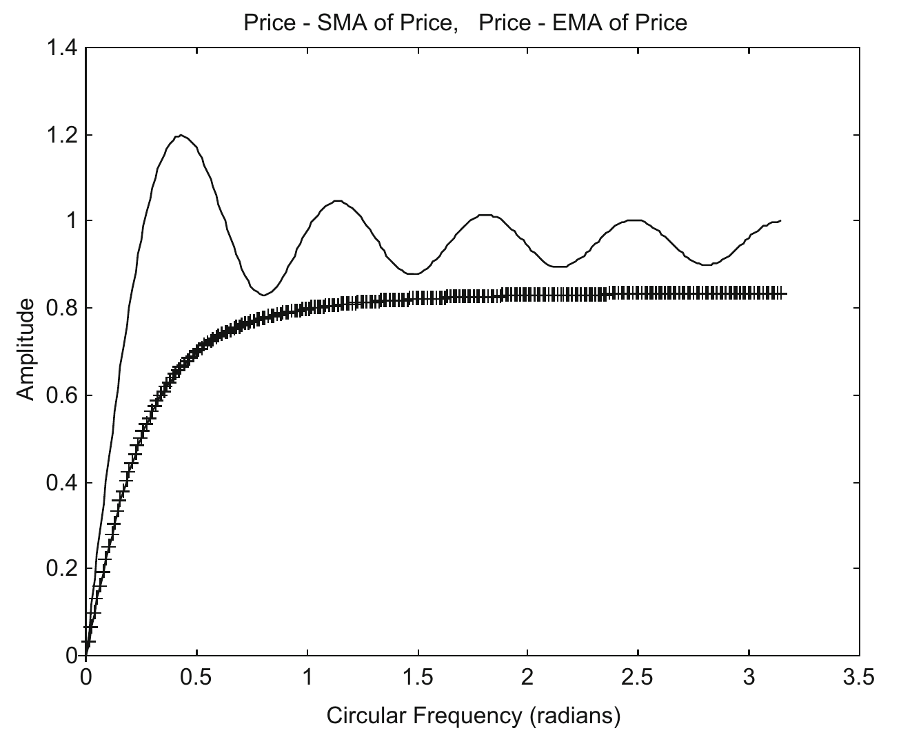
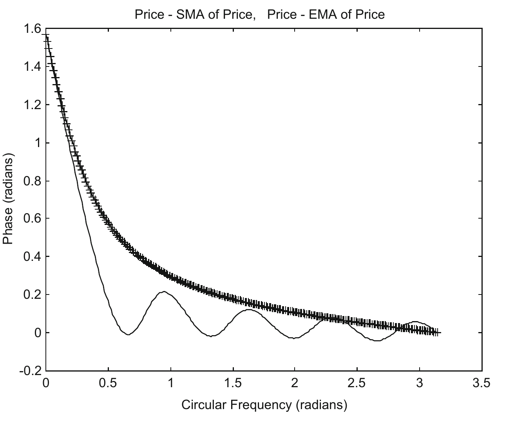
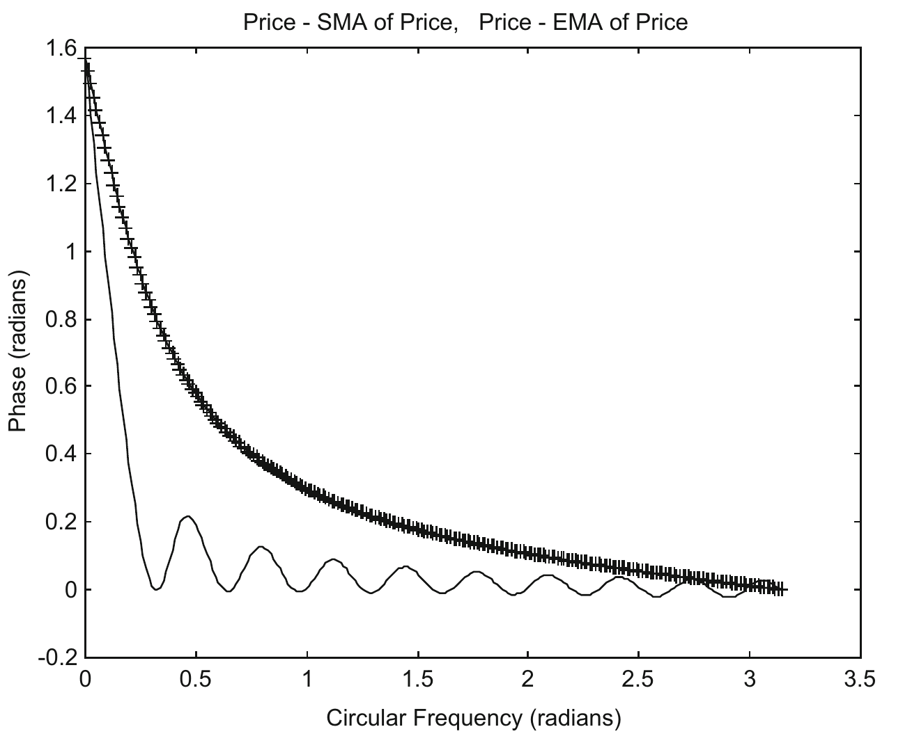

# 8 Analysis of the Trading Tactics

There is no one size fits all trading tactics, just as there is no one size fits all knife in the kitchen. Depending on what you would like to cut in the kitchen, you need to use different kinds of knife to do the job. While you would know what you want to cut, you would not know how the market would behave in the future. If the market is moving along slowly with ripples, you may think that it may continue as such, and choose a tactic which would capture the slow movement. If the market is volatile, you may think that it may carry on as such, and pick a tactic to make some profit. We will analyze some of the trading tactics below, and noticeably, point out some of the tactics that should be avoided.

## 8.1 Profit Zone and Loss Zone

The phase and amplitude characteristics, and especially the former, of technical indicators used as velocity indicators in the trading tactics are significant. As we pointed out before, in order for a trade to be profitable, the phase of the price signal after operated on by the technical indicator, needs to have a phase lead lying between $\pi$ and 0 from the price signal. The region where the velocity indicator satisfies this condition will be called the Profit Zone. If the phase lead lies between 0 and $-\pi$, the trade will not be profitable. That corresponding region will be called the Loss Zone. Within the Profit zone, a trade can still lose money due to sampling delay, as the data are not continuous. Thus, the Profit Zone can be further divided into Sure Profit Zone, and Unsure Profit Zone. For the former, profit is guaranteed, and for the latter, profit or loss can be made.

## 8.2 Price − EMA of Price Compared to Price − SMA of Price

Both trading tactics have zero Loss Zones. However, they have their differences.

Simple Moving Averages (SMA) of a signal can be zero for certain frequencies of the signal. That means, for those frequencies, the signal disappears. The phases of Price − SMA at those frequencies are zero. In addition, the wrapped phases of SMA at some other frequencies can be zero. These would again lead to the phases of Price − SMA at those frequencies to be zero. As losses usually occur when the phase is close to zero due to sampling delay, Price − SMA would not be considered as very profitable trading tactics.

SMA is a very common smoothing indicator used by traders. However, it simply adds up the last N bars of data, and ignores the ones before them. By contrast, EMA uses many more data than SMA, and it puts greater weight to most recent data than older ones. The amplitude response of the EMA is always greater than 0 (see Chapter 4). Furthermore, the phase of Price − EMA is positive for $0 \le \omega < \pi$, and 0 only when $\omega = \pi$.

We will compare (Price − EMA, M = 6, of Price) with (Price − SMA, N = 10, of Price). Their amplitude responses are shown in Fig. 8.1. The former shows a much smoother function than the latter. Figure 8.2 shows the phase of Price − EMA (M = 6) of Price compared to the phase of Price − SMA (N = 10) of Price. The phase of the former is larger than that of the latter except in the region $2.9 < \omega < \pi$, thus making the former more advantageous in making profits.

We will also compare the phase of Price − EMA (M = 6) of Price with the phase of Price − SMA (N = 20) of Price (Fig. 8.3). The phase of the former is larger than that of the latter except in the region $3.0 < \omega < \pi$, thus making the former more advantageous in making profits.

In addition, the Sure Profit Zones of Price − EMA for both M = 3 and 6 are longer than those of Price − SMA for both 10 and 20 (see Table 7.1). Thus, Price − EMA should be used instead of Price − SMA in order to increase the probability of the profitability of the trades. Obviously, Price − EMA(M = 6) is a smoother function than Price − EMA(M = 3), and will thus create less buy and sell indications.

## 8.3 Awesome Oscillator (AO) and Moving Average Convergence Divergence (MACD)

From Table 7.1, it can be seen that both Awesome Oscillator (SMA5 − SMA34) and MACD (EMA12 − EMA26) have very narrow Profit Zones, with $0 \le \omega < 0.13$ radian for the former, and $0 \le \omega < 0.12$ radian for the latter. In addition, for $\omega > 1.19$ radians, the wrapped phase of AO is different from the unwrapped phase, which represents the real time delay, thus causing a systematic error in the AO. Thus, both AO and MACD are not recommended as velocity indicators, as the probability of their profitability is low.

Both AO and MACD have been used in other trading tactics—as alerts in trend reversals, e.g., when they are divergent with price (Pring 1991; Elder 1993; Mak 2003). It should be noted, however, that they are still functioning as velocity indicators, which thus would have the same intrinsic weaknesses.

## 8.4 Accelerator Oscillator (AC)

The Accelerator Oscillator is an acceleration indicator, but it can be used as a velocity indicator. Being an acceleration indicator, it does have certain advantage over velocity indicators as its phase is $\pi$ at $\omega = 0$, and thus can possibly pick up some low frequency components at or near $\omega = 0.14$ radian where its phase lead $\phi$ is $\pi/2$, thus making maximal profit. Furthermore, its Profit Zone lies between 0 and 0.47, where most low frequencies of market price reside.

However, in the Loss Zones of the Accelerator Oscillator, the wrapped phase lead goes as low as $-\pi$, and includes the phase lead of $-\pi/2$, where maximum loss occurs. Furthermore, just like AO, for $\omega > 1.19$ radians, the wrapped phase of AC is different from the unwrapped phase, which represents the real time delay, thus causing a systematic error in the AC. Thus, it would seem that AC, which is derived from SMA's is not a very profitable velocity indicator. It can possibly be replaced with another acceleration indicator, MACDH, which is derived from EMA's.

## 8.5 MACDH

MACDH is an acceleration indicator, but it has been said that it has been used as a velocity indicator in aggressive trading. Being an acceleration indicator, its phase is $\pi$ at $\omega = 0$, and thus can possibly pick up some low frequency components at or near $\omega = 0.081$ radian ($= \pi/39$) where its phase lead $\phi$ is $\pi/2$, thus making maximal profit. Furthermore, its Profit Zone lies between 0 and 0.29 radian, where low frequencies of market price reside. Its Loss Zone ranges from 0.29 to $\pi$ radians. Its phase decreases from 0 radian at $\omega = 0.29$ radian to the minimum phase lead of $-0.65$ ($= -\pi/4.8 > -\pi/2$) radian at $\omega = 0.99$ radian and then slowly increases to 0 at $\omega = \pi$ radians. That is, the phase remains negative for $0.29 < \omega < \pi$ radians. As MACDH is somewhat like a band pass filter, filtering off the high frequency components, and its minimum phase lead is only $-0.65$ radian, it proves to be a very profitable velocity indicator, especially when the market is trending.

Furthermore, while MACDH has been described as a band pass filter, it does allow some high frequency signals to pass through (see Fig. 6.3 in Chapter 6). The amplitude of high frequency signals is much reduced, but not completely eliminated. The effect is that the trade will not be sold when some high frequency noise of low amplitude occurs, but the position will be sold when the high frequency component in the signal has a large amplitude, such as in a market crash.

## 8.6 Recommendations

Traders would preferably like to employ trading tactics that have high probability of making a profit, and definitely would try to avoid using the ones that have high probability of losing money.

Simple Moving Average (SMA) has the disadvantage that it uses limited past data, which are all of equal weighting. As a result, this definition renders some of the frequencies of a signal to disappear completely. Thus, trading tactics employing SMA are not reliable. One popular tactic that should be avoided is the Awesome Oscillator, as its chance of making a profit is slim. In addition, Accelerator Oscillator, which also employs SMA's, should not be encouraged.

Tactics that use SMA can always be replaced by better ones that use Exponential Moving Average (EMA), which puts more weights into recent data. However, not all tactics using EMA are profitable. One popular tactic that employs EMA, the MACD, should be avoided as its probability of making a profit is low.

For slow moving trending market, MACDH provides a good trading tactic, making reasonable profits with few trades. Nevertheless, it definitely should not be used in volatile markets.

Price − EMA6 of Price has demonstrated itself to be an all versatile tactic for both slow-moving and volatile markets. It has the potential of making good profits when the market is trending, and it can also respond quickly in a fast moving market.

Price − EMA3 of Price has similar characteristics as Price − EMA6 of Price. The former may make more profit than the latter sometimes. However, it would involve taking more trades.

We should caution that the profit percentage of each trading tactic has been calculated with the assumption that the price signal consists of a single frequency. However, the signal is actually composed of a summation of several frequencies, and velocity indicator acting on the signal should have been a combination of different phase leads, which thus would affect the buy and sell indications. For example, of all the trading tactics mentioned in Chapter 7, Price − SMA20 attains the highest profit of 49% for S&P500, even though it performs rather poorly for the other markets. Nevertheless, we believe that emulating the real market signal as a single frequency signal would be a good approximation to start. And then the lengths of the Profit Zone, the Sure Profit Zone and the Loss Zone would cast light onto which trading tactics can provide a higher probability of profitability, and which trading tactics should be avoided. The probability can also be gauged by integrating the phase plot over the frequency spectrum of the different zones.

It should also be noted that the financial market can be described as a complex adaptive system, which is studied under the discipline of complexity theory (Waldrop 1992; Casti 1995, 1997). In a complex system, every agent acts independently, and has his own rules. He can decide whether to trade or stay away, when to execute, and when to get out. He is also adaptive, and will modify his rules and systems on the basis of new knowledge (Mak 2003).

In a complex system, if every person uses the same rule, the rule will not work. An example is the fast lane on a highway, which is the leftmost lane. If every driver moves to the fast lane, the leading drivers would find the lane to be fast enough, while the rearmost drivers would consider it to be a slow lane. Similarly, if every trader uses the same rule, the first of the traders who get into the market would find the rule self-fulfilling, while the last of the traders would find the rule self-defeating. Fortunately, and in reality, not all traders would believe in the same thing, nor would they know some of the tactics proposed. Thus, a trading tactic that has a higher probability of making a profit can prevail.
