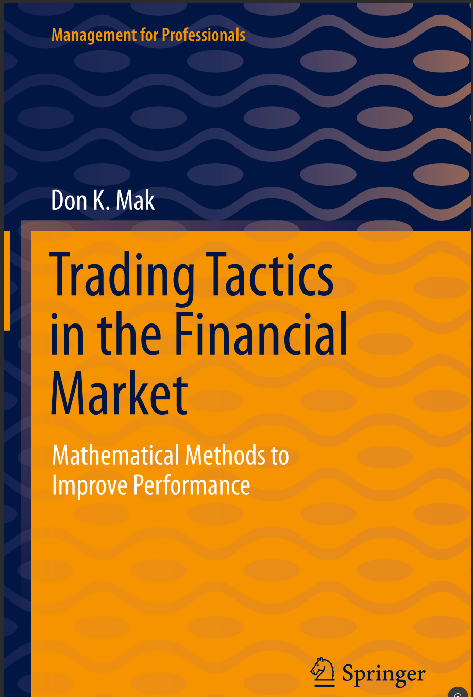

# Trading Tactics in the Financial Market



**Trading Tactics in the Financial Market: Mathematical Methods to Improve Performance**

- **Author:** Don K. Mak
- **Year:** 2021
- **Publisher:** Springer International Publishing
- **Series:** Management for Professionals

```bibtex
@book{mak2021trading,
  author    = {Mak, Don K.},
  title     = {Trading Tactics in the Financial Market: Mathematical Methods to Improve Performance},
  year      = {2021},
  publisher = {Springer International Publishing},
  address   = {Cham},
  series    = {Management for Professionals},
  isbn      = {978-3-030-70621-0},
  doi       = {10.1007/978-3-030-70622-7},
  url       = {https://link.springer.com/10.1007/978-3-030-70622-7}
}
```

---

## Chapters

1. [Trading Tactics in Technical Analysis](ch-01.md)
2. [Market Turning Points](ch-02.md)
3. [Simple Moving Average](ch-03.md)
4. [Exponential Moving Average](ch-04.md)
5. [Awesome Oscillator and Accelerator Oscillator](ch-05.md)
6. [Moving Average Convergence-Divergence and Its Histogram](ch-06.md)
7. [Trading Tactics in the Real Market](ch-07.md)
8. [Analysis of the Trading Tactics](ch-08.md)
9. [Epilogue](ch-09.md)

## Appendices

- [Appendix A: Sure and Unsure Profit and Loss Zones](ap-A.md)
- [Appendix B: Simple Moving Average](ap-B.md)
- [Appendix C: Exponential Moving Average, Moving Average Convergence-Divergence](ap-C.md)
- [Appendix D: MATLAB Programs](ap-D.md)
