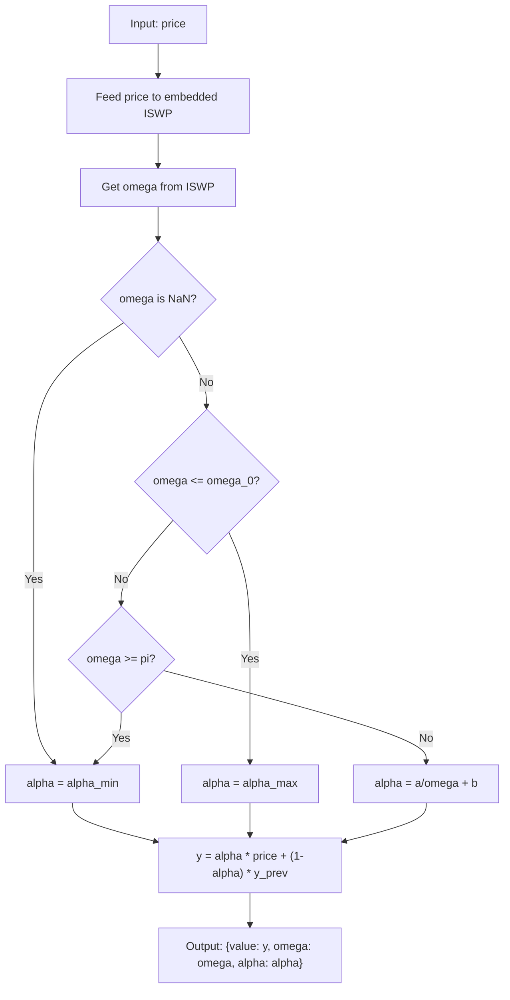

# Adaptive Exponential Moving Average (AEMA)

## Overview

The Adaptive Exponential Moving Average adjusts its smoothing factor α in
real time based on the instantaneous frequency of the price data. When the
data is trending (low frequency), α is large for fast response and minimal
lag. When the data is noisy (high frequency), α is small for heavy smoothing
to filter out whipsaws.

This indicator embeds an Instantaneous Sine Wave Period (ISWP) estimator
internally to detect the dominant frequency at each bar. The user does not
need to provide frequency estimates externally.

## Basic Principles

### Standard EMA Limitation

A standard EMA has a fixed smoothing factor α = 2/(M+1). Choosing M is a
compromise: small M gives fast response but amplifies noise; large M gives
smooth output but introduces lag. There is no single M that works well in
both trending and choppy markets.

### Adaptive Solution

The AEMA solves this by making α a function of the current market condition
(measured by instantaneous frequency ω):

- **Low ω** (trending, long period) → **large α** → fast response, minimal lag
- **High ω** (choppy, short period) → **small α** → heavy smoothing, noise rejection

### Frequency Estimation

The embedded ISWP estimator uses two independent methods (IF4 and IF5) based
on sine-wave fitting to estimate the instantaneous circular frequency ω at
each bar. See the ISWP indicator documentation for full details.

## Mathematical Description

### EMA Recursion

The standard EMA recursion with time-varying α:

$$y(n) = \alpha(n) \cdot x(n) + [1 - \alpha(n)] \cdot y(n-1) \tag{3.13}$$

where $x(n)$ is the input price and $y(n)$ is the smoothed output.

### Alpha Mapping (Eq 3.15)

The smoothing factor α is determined from the instantaneous frequency ω
using a hyperbolic (1/ω) interpolation:

$$\alpha(\omega) = \begin{cases}
\alpha_{\max} & \omega \leq \omega_0 \\[6pt]
\displaystyle \frac{a}{\omega} + b & \omega_0 < \omega < \pi \\[6pt]
\alpha_{\min} & \omega \geq \pi
\end{cases} \tag{3.15}$$

where the constants $a$ and $b$ are determined from the boundary conditions:
- At $\omega = \omega_0$: $\alpha = \alpha_{\max}$
- At $\omega = \pi$: $\alpha = \alpha_{\min}$

Solving:

$$a = \frac{(\alpha_{\max} - \alpha_{\min}) \cdot \omega_0 \cdot \pi}{\pi - \omega_0} \tag{3.15a}$$

$$b = \alpha_{\min} - \frac{a}{\pi} \tag{3.15b}$$

### Specific Example (from book)

With $\alpha_{\max} = 0.5$, $\alpha_{\min} = 0.05$, $\omega_0 = 1.0$:

$$\alpha = \begin{cases}
0.5 & \omega \leq 1 \\[6pt]
\displaystyle \frac{0.66}{\omega} - 0.16 & 1 < \omega < \pi \\[6pt]
0.05 & \omega \geq \pi
\end{cases} \tag{3.16}$$

### Properties

- Phase of the adaptive EMA is always less than 0.7 radians
- At most ~1 bar lag in trending conditions
- Equivalent EMA period: $M = 2/\alpha - 1$ (ranges from 3 bars at α=0.5
  to 39 bars at α=0.05 in the default configuration)

## NaN Handling — Design Rationale

The embedded ISWP frequency estimator returns NaN (undefined) when the price
data does not fit a sine wave model. This occurs in approximately 40–50% of
bars on typical market data. Conditions that produce NaN include:

- Consecutive equal prices (zero denominator)
- Price ratios inconsistent with any sine wave
- Estimated period outside valid bounds [4, 50] bars
- Both IF4 and IF5 methods exceed the error threshold

**Design decision:** When ω is NaN, the AEMA uses $\alpha_{\min}$ (maximum
smoothing). The rationale:

1. If the frequency cannot be estimated, the data is likely non-periodic or
   highly irregular — exactly the situation where heavy smoothing is
   appropriate.
2. Using $\alpha_{\min}$ is the most conservative choice: it minimizes
   reaction to potentially noisy/random data.
3. The alternative (holding previous α) would create path-dependent behavior
   where the output depends on *when* the last valid frequency was observed,
   making the indicator harder to reason about and test.
4. Since the EMA recursion always produces a value (no NaN output), the
   indicator provides uninterrupted smoothed prices even during periods of
   frequency estimation failure.

## Configuration Parameters

| Parameter | Type | Valid Range | Default | Description |
|-----------|------|-------------|---------|-------------|
| `alpha_max` | float | (0, 1] | 0.5 | Smoothing factor for trending data (low frequency) |
| `alpha_min` | float | (0, alpha_max) | 0.05 | Smoothing factor for noisy data (high frequency) |
| `omega_0` | float | (0, π) | 1.0 | Crossover frequency (radians/bar). Below this, α = alpha_max |
| `smoothing` | int | [0, ∞) | 3 | ISWP internal smoothing parameter |

### Output Fields

| Field | Type | Description |
|-------|------|-------------|
| `value` | float | Adaptively smoothed price |
| `omega` | float | Current frequency estimate (NaN if unavailable) |
| `alpha` | float | Current smoothing factor used |

### Priming Period

The AEMA has **no priming period** in the strict sense — it outputs a
smoothed value from bar 0 (initialized to the first price). However, the
embedded ISWP requires 5 bars before producing frequency estimates. During
this startup phase, α defaults to `alpha_min` (conservative smoothing).

## Algorithmic Flow



## Test Data Parameter Combinations

| # | What it tests | Parameters | Array name |
|---|---|---|---|
| 1 | Default parameters | alpha_max=0.5, alpha_min=0.05, omega_0=1.0, smoothing=3 | EXPECTED_DEFAULT |
| 2 | Wider alpha range | alpha_max=0.8, alpha_min=0.02, omega_0=1.0, smoothing=3 | EXPECTED_A0_8_A0_02 |
| 3 | Lower crossover frequency | alpha_max=0.5, alpha_min=0.05, omega_0=0.5, smoothing=3 | EXPECTED_W0_5 |
| 4 | Higher crossover frequency | alpha_max=0.5, alpha_min=0.05, omega_0=1.5, smoothing=3 | EXPECTED_W1_5 |
| 5 | No ISWP smoothing | alpha_max=0.5, alpha_min=0.05, omega_0=1.0, smoothing=0 | EXPECTED_S0 |
| 6 | Heavy ISWP smoothing | alpha_max=0.5, alpha_min=0.05, omega_0=1.0, smoothing=6 | EXPECTED_S6 |

Additional output arrays:
- `EXPECTED_DEFAULT_OMEGA` — omega values from ISWP (for verification)
- `EXPECTED_DEFAULT_ALPHA` — alpha values used (for verification)

Synthetic test:
- Test 1: Pure sine wave where ISWP gives clean omega estimates

## References

```bibtex
@book{mak2006mathematical,
  author    = {Mak, Don K.},
  title     = {Mathematical Techniques in Financial Market Trading},
  year      = {2006},
  publisher = {World Scientific},
  address   = {Singapore},
  isbn      = {978-981-256-699-7},
  doi       = {10.1142/6055},
  url       = {https://www.worldscientific.com/worldscibooks/10.1142/6055},
  note      = {Chapter 3.6: Adaptive Exponential Moving Average}
}

@book{mak2003science,
  author    = {Mak, Don K.},
  title     = {The Science of Financial Market Trading},
  year      = {2003},
  publisher = {World Scientific},
  address   = {Singapore},
  isbn      = {978-981-238-473-8},
  doi       = {10.1142/5157},
  url       = {https://www.worldscientific.com/worldscibooks/10.1142/5157},
  note      = {Chapter 5: Instantaneous Frequency estimation (IF4, IF5 methods)}
}
```
