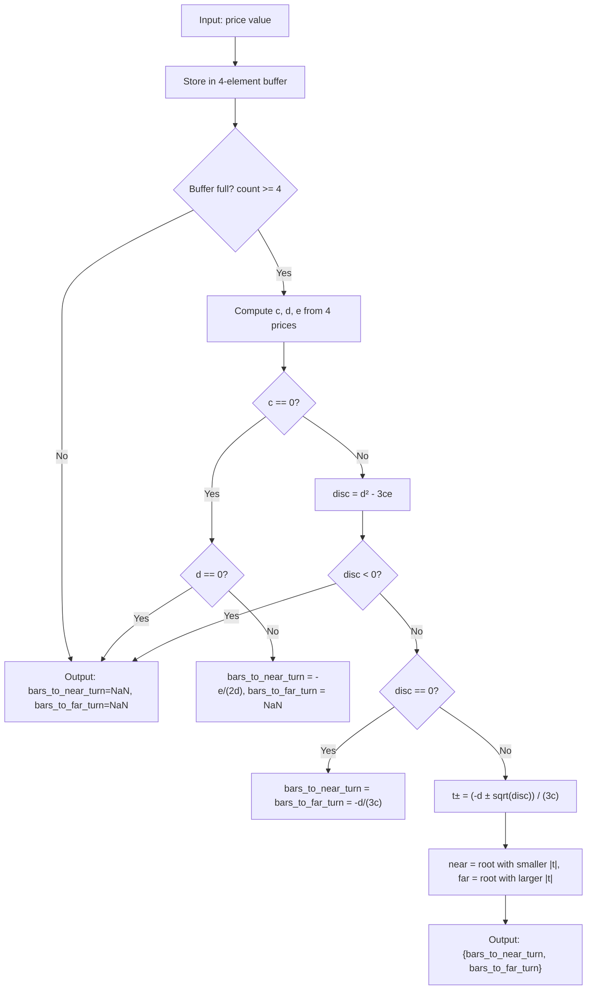

# Cubic Vertex Indicator

## Overview

The Cubic Vertex indicator predicts turning points in a price series by
fitting a cubic polynomial (third-degree) to the 4 most recent data points
and computing where the two vertices (extrema) occur. A cubic has up to two
turning points; the outputs give the number of bars from the current bar to
each predicted turning point.

- **Positive output**: turning point is in the future (reversal expected)
- **Negative output**: turning point is in the past (reversal already happened)
- **Near zero**: turning point is occurring now

This indicator works best on **pre-smoothed prices** (e.g., EMA, adaptive MA).
On raw prices the fit is noisy and frequently produces undefined results.

## Basic Principles

A cubic $y = at^3 + bt^2 + ct + d$ has up to two turning points, found by
setting the first derivative to zero: $3at^2 + 2bt + c = 0$. This
quadratic equation has two roots — corresponding to two potential reversal
points.

By fitting a cubic through the 4 most recent price points, we obtain the
polynomial coefficients and solve the quadratic to find both turning point
locations.

The **near root** (smaller absolute value of $t$) represents the more imminent
turning point (closest to the current bar), while the **far root** (larger
absolute value) represents the more distant turning point.

## Mathematical Description

Given four consecutive prices $x(n)$, $x(n-1)$, $x(n-2)$, $x(n-3)$ (most
recent first), compute the cubic polynomial coefficients:

$$c = \frac{x(n) - 3x(n-1) + 3x(n-2) - x(n-3)}{6} \tag{7.2a}$$

$$d = \frac{2x(n) - 5x(n-1) + 4x(n-2) - x(n-3)}{2} \tag{7.2b}$$

$$e = \frac{11x(n) - 18x(n-1) + 9x(n-2) - 2x(n-3)}{6} \tag{7.2c}$$

The two vertex locations are the roots of the first derivative
$3ct^2 + 2dt + e = 0$:

$$t_{\pm}(n) = \frac{-d \pm \sqrt{d^2 - 3ce}}{3c} \tag{7.3}$$

where:
- $t_{\text{near}} = \text{root with smaller } |t|$ — the more imminent turning point
- $t_{\text{far}} = \text{root with larger } |t|$ — the more distant turning point

### Special Cases

| Condition | Meaning | Output |
|-----------|---------|--------|
| $c \neq 0$ and $d^2 - 3ce > 0$ | Two real vertices | Both valid |
| $c \neq 0$ and $d^2 - 3ce = 0$ | One degenerate vertex | bars_to_near_turn = bars_to_far_turn = $-d/(3c)$ |
| $c \neq 0$ and $d^2 - 3ce < 0$ | No real vertices (inflection only) | Both NaN |
| $c = 0$ and $d \neq 0$ | Reduces to parabola | bars_to_near_turn = $-e/(2d)$, bars_to_far_turn = NaN |
| $c = 0$ and $d = 0$ | Straight line | Both NaN |

### Interpretation

- **bars_to_near_turn** (root closer to zero) is the most actionable signal
- **bars_to_far_turn** (root farther from zero) provides broader context
- Only values near zero (e.g., within $[-4, +4]$) are meaningful
- When bars_to_near_turn crosses zero, the turning point is occurring now
- The acceleration at the vertex indicates direction: positive = price will
  rise after the turn; negative = will fall

## Configuration Parameters

None. This indicator has no configurable parameters.

### Input

Pre-smoothed price values. The user is responsible for smoothing the input
(e.g., with EMA) before feeding it to this indicator.

### Output

| Field | Type | Description |
|-------|------|-------------|
| `bars_to_near_turn` | float | Bars to the more imminent turning point (smaller \|value\|) |
| `bars_to_far_turn` | float | Bars to the more distant turning point (larger \|value\|) |

Output is `NaN` when:
- Fewer than 4 prices received (priming period = 3 bars)
- No real turning points exist (negative discriminant)
- Data is linear ($c = 0$ and $d = 0$)
- For bars_to_far_turn only: when $c = 0$ (parabolic fallback, only one vertex)

### Priming Period

3 bars (first valid output at bar index 3, after receiving 4 prices).

## Algorithmic Flow



## Practical Notes

1. **Always smooth input first.** The book recommends adaptive MA with
   smoothness parameters 1 and 3. Simple EMA with period 6–20 also works.

2. **Many NaN values are normal.** Smoothed data often fits cubics with only
   an inflection point (negative discriminant). This means no reversal is
   predicted in that region — which is correct.

3. **Threshold plotting.** Only display values in range $[-4, +4]$ bars.

4. **Confirmation.** Use with the cubic velocity indicator (PFD degree=3,
   order=1) — velocity crossing zero confirms the vertex prediction.

## Test Data Parameter Combinations

| # | What it tests | Input | Array name |
|---|---|---|---|
| 1 | Near turning point on raw market data | INPUT_CLOSE | EXPECTED_RAW_NEAR |
| 2 | Far turning point on raw market data | INPUT_CLOSE | EXPECTED_RAW_FAR |
| 3 | Near turning point on EMA(6) data | INPUT_EMA6 | EXPECTED_EMA6_NEAR |
| 4 | Far turning point on EMA(6) data | INPUT_EMA6 | EXPECTED_EMA6_FAR |
| 5 | Near turning point on EMA(20) data | INPUT_EMA20 | EXPECTED_EMA20_NEAR |
| 6 | Far turning point on EMA(20) data | INPUT_EMA20 | EXPECTED_EMA20_FAR |

- Test 1: Known cubic $x = (t-10)(t-30)(t-50)/100$, vertices at $t \approx 21.84$ and $t \approx 38.16$

## References

```bibtex
@book{mak2003science,
  author    = {Mak, Don K.},
  title     = {The Science of Financial Market Trading},
  year      = {2003},
  publisher = {World Scientific},
  address   = {Singapore},
  isbn      = {978-981-238-473-8},
  doi       = {10.1142/5157},
  url       = {https://www.worldscientific.com/worldscibooks/10.1142/5157},
  note      = {Chapter 7: Vertex Indicators; Appendix 5: Derivation of Vertex Formulae}
}
```
