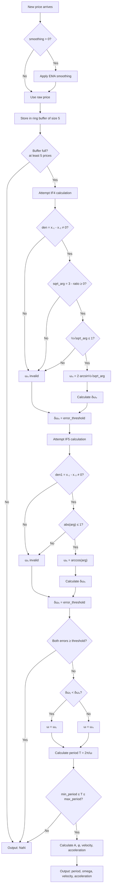

# Instantaneous Sine Wave Period (ISWP)

## Overview

The Instantaneous Sine Wave Period (ISWP) estimates the dominant cycle period of
price data by modeling it locally as a single sine wave superimposed on a
constant level. The indicator outputs the cycle period $T$ in bars (and
optionally the circular frequency $\omega$, wave velocity, and wave
acceleration).

Two estimation methods are combined:

- **4-point method** (IF4): uses 4 consecutive prices, lag = 2 bars
- **5-point method** (IF5): uses 5 consecutive prices, lag = 2.5 bars

The method with the lesser estimation error is selected automatically at each
bar. When neither method can produce a valid estimate (data doesn't fit the sine
model), the output is NaN.

## Basic Principles

Financial price data often exhibits quasi-cyclical behavior. If we assume that
over a short window the price can be approximated by a single sinusoid, we can
solve for the frequency (and therefore the period) of that sinusoid using only a
few data points.

The key insight is that for a pure sine wave $x = A\sin(\omega t + \phi) + D$,
certain algebraic combinations of consecutive samples cancel out the unknown
amplitude $A$, phase $\phi$, and DC offset $D$, leaving only the frequency
$\omega$ to solve for. This gives us a closed-form frequency estimator with
minimal lag.

The period output $T = 2\pi/\omega$ tells the trader how many bars constitute
one full cycle at the current market rhythm. This can be used to:

- Adapt moving average lengths to the current cycle
- Set stop-loss/take-profit distances
- Filter trades (only trade when cycle is clear)
- Confirm trend vs. range conditions

## Mathematical Foundation

### Model

Price is modeled as a sine wave on a constant level:

$$x = A \sin(\omega t + \phi) + D$$

where:
- $x$ is the market price
- $A$ is the amplitude
- $\omega$ is the circular frequency (radians per bar)
- $\phi$ is the phase at $t = 0$
- $D$ is the DC offset (constant level)

### 4-Point Frequency Estimation (IF4)

Using four consecutive prices at $t = 0, -1, -2, -3$:

$$x_0 = A \sin(\phi) + D$$

$$x_{-1} = A \sin(-\omega + \phi) + D$$

$$x_{-2} = A \sin(-2\omega + \phi) + D$$

$$x_{-3} = A \sin(-3\omega + \phi) + D$$

Subtracting $x_{-3}$ from $x_0$ and $x_{-2}$ from $x_{-1}$, then dividing:

$$\frac{x_0 - x_{-3}}{x_{-1} - x_{-2}} = \frac{\sin(3\omega/2)}{\sin(\omega/2)} = 3 - 4\sin^2(\omega/2)$$

Solving for $\omega$:

$$\omega_4 = 2 \arcsin\left(\frac{1}{2}\sqrt{3 - \frac{x_0 - x_{-3}}{x_{-1} - x_{-2}}}\right)$$

**Validity conditions** (all must hold for a real, meaningful result):
1. $x_{-1} - x_{-2} \neq 0$ (denominator non-zero)
2. $3 - \frac{x_0 - x_{-3}}{x_{-1} - x_{-2}} \geq 0$ (argument of sqrt non-negative)
3. $\frac{1}{2}\sqrt{\cdot} \leq 1$ (argument of arcsin in $[-1, 1]$)

### 5-Point Frequency Estimation (IF5)

Using five consecutive prices at $t = 0, -1, -2, -3, -4$ (though $x_{-2}$ is
not used in the frequency formula):

Subtracting $x_{-4}$ from $x_0$ and $x_{-3}$ from $x_{-1}$, then dividing:

$$\frac{x_0 - x_{-4}}{x_{-1} - x_{-3}} = 2\cos\omega$$

Solving for $\omega$:

$$\omega_5 = \arccos\left(\frac{x_0 - x_{-4}}{2(x_{-1} - x_{-3})}\right)$$

**Validity conditions:**
1. $x_{-1} - x_{-3} \neq 0$ (denominator non-zero)
2. $\left|\frac{x_0 - x_{-4}}{2(x_{-1} - x_{-3})}\right| \leq 1$ (argument of arccos in $[-1, 1]$)

### Error Estimation

To choose between IF4 and IF5, propagation of errors is used. Given arbitrary
measurement errors $\delta x_i$ assigned to each price point:

**Error of $\omega_4$:**

$$\delta\omega_4 = \frac{1}{\sqrt{1 - \frac{1}{4}\left(3 - R_4\right)}} \cdot \frac{1}{\sqrt{3 - R_4}} \cdot q$$

where $R_4 = \frac{x_0 - x_{-3}}{x_{-1} - x_{-2}}$ and:

$$q = \sqrt{\frac{(\delta x_0)^2 + (\delta x_{-3})^2}{(x_{-1} - x_{-2})^2} + \frac{(x_0 - x_{-3})^2 [(\delta x_{-1})^2 + (\delta x_{-2})^2]}{(x_{-1} - x_{-2})^4}}$$

**Error of $\omega_5$:**

$$\delta\omega_5 = \frac{1}{2} \cdot \frac{1}{\sqrt{1 - \left(\frac{x_0 - x_{-4}}{2(x_{-1} - x_{-3})}\right)^2}} \cdot r$$

where:

$$r = \sqrt{\frac{(\delta x_0)^2 + (\delta x_{-4})^2}{(x_{-1} - x_{-3})^2} + \frac{(x_0 - x_{-4})^2 [(\delta x_{-1})^2 + (\delta x_{-3})^2]}{(x_{-1} - x_{-3})^4}}$$

The $\omega$ with the **lesser error** is selected. If both errors exceed a
threshold (default: 20), the output is NaN (no valid estimate).

### Derived Quantities

Once $\omega$ is known, the full model parameters can be solved:

**Amplitude** (from the 4-point system):

$$C = 2A\cos\phi = \frac{(x_0 - x_{-1})\sin(\omega/2)\sin(3\omega/2) - (x_{-1} - x_{-2})\sin^2(\omega/2)}{D_0}$$

$$S = 2A\sin\phi = \frac{(x_{-1} - x_{-2})\sin(\omega/2)\cos(\omega/2) - (x_0 - x_{-1})\sin(\omega/2)\cos(3\omega/2)}{D_0}$$

$$D_0 = \sin^2(\omega/2)\cos(\omega/2)\sin(3\omega/2) - \sin^3(\omega/2)\cos(3\omega/2)$$

$$A = \frac{1}{2}\sqrt{C^2 + S^2}$$

**Phase:**

$$\phi = \text{atan2}(S, C)$$

(using the signs of $C$ and $S$ to determine the correct quadrant)

**Wave velocity** (slope of the sine wave at $t = 0$):

$$v_0 = A\omega\cos\phi$$

**Wave acceleration** (second derivative at $t = 0$):

$$a_0 = -A\omega^2\sin\phi$$

**Period:**

$$T = \frac{2\pi}{\omega}$$

## Configuration Parameters

| Parameter | Type | Default | Valid Range | Description |
|-----------|------|---------|-------------|-------------|
| `smoothing` | int | 0 | $\geq 0$ | EMA smoothing length applied to input prices before frequency estimation. 0 = no smoothing. Equivalent to `S` parameter in the book's code. When > 0, uses EMA with $\alpha = 2/(L+1)$ where $L = $ smoothing. |
| `min_period` | float | 4.0 | $> 0$ | Minimum allowed period (bars). Estimates below this are rejected as noise. |
| `max_period` | float | 50.0 | $> $ min_period | Maximum allowed period (bars). Estimates above this are rejected. |
| `error_threshold` | float | 20.0 | $> 0$ | Maximum tolerated error for $\omega$ estimate. If both methods exceed this, output is NaN. |
| `dx` | float | 0.01 | $> 0$ | Assumed measurement error for each price point (used in error propagation). |

## Algorithm Flow



## Outputs

| Field | Description |
|-------|-------------|
| `period` | Estimated cycle period in bars ($T = 2\pi/\omega$). NaN if invalid. |
| `omega` | Circular frequency in radians/bar. NaN if invalid. |
| `velocity` | Wave velocity $v_0 = A\omega\cos\phi$. NaN if invalid. |
| `acceleration` | Wave acceleration $a_0 = -A\omega^2\sin\phi$. NaN if invalid. |
| `amplitude` | Estimated sine wave amplitude $A$. NaN if invalid. |
| `phase` | Phase angle $\phi$ in radians. NaN if invalid. |
| `dc_level` | Constant level $D = x_0 - A\sin\phi$. NaN if invalid. |

## Implementation Notes

1. **Pre-smoothing**: The book applies an adaptive moving average (Jurik AMA)
   before frequency estimation. Our implementation uses EMA as a simpler
   substitute. The smoothing parameter controls how much noise is removed before
   the sine model is fitted.

2. **Ring buffer**: Only the 5 most recent (smoothed) prices are needed.

3. **NaN propagation**: When the data doesn't fit the sine model, all outputs
   are NaN. This is expected — real price data is not a pure sinusoid, so many
   bars will produce no valid estimate.

4. **Error-based selection**: The error propagation formulas assume equal
   measurement errors ($\delta x = 0.01$ by default) for all prices. The actual
   value matters less than the relative comparison between the two methods.

5. **Period clamping**: The `min_period` and `max_period` parameters prevent
   physically unreasonable estimates (e.g., period < 4 bars is likely noise,
   period > 50 bars requires more data to be meaningful).

## References

```bibtex
@book{mak2006mathematical,
  author    = {Mak, Don K.},
  title     = {Mathematical Techniques in Financial Market Trading},
  year      = {2006},
  publisher = {World Scientific},
  address   = {Singapore},
  isbn      = {978-981-256-699-7},
  doi       = {10.1142/6055},
  url       = {https://www.worldscientific.com/worldscibooks/10.1142/6055},
  note      = {Chapter 6: Instantaneous Frequency; Appendix 3: Frequency}
}

@book{ehlers2001rocket,
  author    = {Ehlers, John F.},
  title     = {Rocket Science for Traders: Digital Signal Processing Applications},
  year      = {2001},
  publisher = {John Wiley \& Sons},
  isbn      = {978-0-471-40567-8},
  note      = {Homodyne Discriminator method for cycle period measurement (20.5 bar lag)}
}

@book{bevington1969data,
  author    = {Bevington, Philip R.},
  title     = {Data Reduction and Error Analysis for the Physical Sciences},
  year      = {1969},
  publisher = {McGraw-Hill},
  note      = {Error propagation formula used in Appendix 3}
}
```
