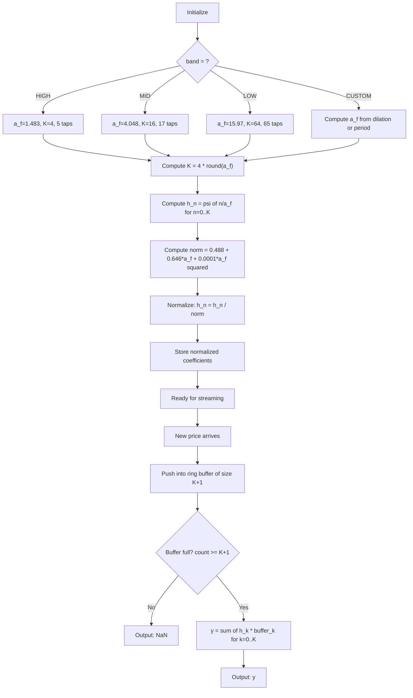

# Mexican Hat Wavelet Filter (MHW)

## Overview

The Mexican Hat Wavelet (MHW) filter is a causal bandpass FIR filter derived
from the Mexican Hat wavelet (second derivative of a Gaussian). It decomposes
price data into frequency bands, with the key property that at the filter's
center frequency, the output has **zero phase shift** (no time lag).

Three standard configurations are provided as an enumeration:

| Band | Dilation $a_f$ | Center freq $\omega_0$ | Approx. period | Taps |
|------|---------------|----------------------|----------------|------|
| **HIGH** | 1.483 | 1.356 rad/bar | ~4.6 bars | 5 |
| **MID** | 4.048 | 0.467 rad/bar | ~13.5 bars | 17 |
| **LOW** | 15.97 | 0.116 rad/bar | ~54 bars | 65 |
| **CUSTOM** | user-defined | computed | computed | computed |

## Basic Principles

Financial price data contains movements at many different "speeds" — fast
day-to-day noise, medium-term swings, and slow trends. The Mexican Hat Wavelet
filter separates these by acting as a bandpass filter that:

1. **Passes** a specific frequency band (the "target rhythm")
2. **Blocks** frequencies above and below that band
3. **Has zero lag** at its exact center frequency

The output tells the trader: "here is the component of price that is oscillating
at roughly this speed." When the high-frequency output is large, the market is
making rapid moves. When the low-frequency output dominates, a slow trend is
driving price.

The filter is a simple weighted sum (dot product) of recent prices with
pre-computed coefficients — making it extremely fast to compute.

## Mathematical Foundation

### Mother Wavelet

The Mexican Hat wavelet is defined as:

$$\psi(t) = (1 - 2t^2) e^{-t^2}$$

This is proportional to the second derivative of the Gaussian $e^{-t^2/2}$. Its
Fourier Transform is:

$$\Psi(\omega) = \int_{-\infty}^{\infty} \psi(t) e^{-j\omega t}\, dt = -\sqrt{2\pi}\, \omega^2 e^{-\omega^2/4}$$

The amplitude $|\Psi(\omega)|$ is a bandpass function centered at $\omega = 2$
radians.

### Dilated Wavelet

Dilating the wavelet by factor $a$ shifts the center frequency:

$$F\{\psi(t/a)\} = |a|\, \Psi(a\omega)$$

The center frequency becomes $2/|a|$ radians. Larger $a$ → lower frequency
(longer period).

### Causal (Real-Time) Filter

In real-time, we only have past data. The causal Fourier Transform integrates
from 0 to $\infty$:

$$\Psi_1(\omega) = \int_0^{\infty} \psi(t) e^{-j\omega t}\, dt$$

For the Mexican Hat wavelet:

$$\Psi_1(\omega) = -\frac{\sqrt{\pi}}{4}\omega^2 e^{-\omega^2/4} + j\frac{\sqrt{\pi}}{4}\omega e^{-\omega^2/4} - \int_0^{\infty} e^{-t^2} \sin(\omega t)\, dt$$

The phase of $\Psi_1(\omega)$ is:

$$\phi_1(\omega) = \tan^{-1}\left(\frac{\text{Im}[\Psi_1(\omega)]}{\text{Re}[\Psi_1(\omega)]}\right)$$

There exists a specific frequency $\omega_0$ where $\phi_1(\omega_0) = 0$ (zero
phase shift). This is the filter's most valuable property.

### Discrete Filter Coefficients

The discrete filter coefficients are samples of the dilated wavelet:

$$h_a(n) = \psi(n / a_f) = (1 - 2(n/a_f)^2) \exp(-(n/a_f)^2), \quad n = 0, 1, 2, \ldots, K$$

where $K = 4 \times \text{round}(a_f)$ (beyond this, coefficients are negligible).

The discrete Fourier Transform of the filter is:

$$H(\omega) = \sum_{n=0}^{K} h_a(n)\, e^{-jn\omega}$$

Its phase is:

$$\phi_H(\omega) = \tan^{-1}\left(\frac{-\sum_n h_a(n)\sin(n\omega)}{\sum_n h_a(n)\cos(n\omega)}\right)$$

There exists $\omega_0$ where $\phi_H(\omega_0) = 0$, and the amplitude
$|H(\omega)|$ is approximately maximal at that same frequency.

### Fitting Formulas

To accurately relate dilation $a$ to zero-phase frequency $\omega_0$, a
curve-fitted formula is used:

$$(2/a)_f = 1.091\,\omega_0 - 0.071\,\omega_0^2$$

Given a desired $\omega_0$, the fitted dilation is:

$$a_f = \frac{2}{1.091\,\omega_0 - 0.071\,\omega_0^2}$$

The amplitude at the zero-phase frequency (for normalization) is:

$$|H(\omega_0)|_f = 0.488 + 0.646\,a_f + 0.0001\,a_f^2$$

### Normalization

To ensure the output has unit amplitude at the center frequency, the filter
coefficients are divided by $|H(\omega_0)|_f$:

$$\hat{h}_a(n) = \frac{h_a(n)}{|H(\omega_0)|_f}$$

### Output

The filtered signal at bar $n$ is:

$$y(n) = \sum_{k=0}^{K} \hat{h}_a(k)\, x(n-k)$$

This is a simple FIR (finite impulse response) convolution.

### Coefficient Computation

The book (Mak 2006, Section 5.7) lists coefficients rounded to 4 decimal places
(Matlab's `format short` default). Our implementation computes all coefficients
at full precision directly from the wavelet formula, avoiding the ~0.17%
rounding error of the book's truncated values.

For all bands (including presets), coefficients are computed as:

$$\hat{h}_a(n) = \frac{(1 - 2(n/a_f)^2)\exp(-(n/a_f)^2)}{0.488 + 0.646\,a_f + 0.0001\,a_f^2}, \quad n = 0, 1, \ldots, K$$

where $K = 4 \times \text{round}(a_f)$.

**Preset dilation values** (from Table 5.2):

| Band | $a_f$ | $K$ | Taps ($K+1$) | Approx. period |
|------|--------|-----|-------|----------------|
| HIGH | 1.483 | 4 | 5 | 4.6 bars |
| MID | 4.048 | 16 | 17 | 13.5 bars |
| LOW | 15.97 | 64 | 65 | 54 bars |

Note: the book truncates LOW to 41 taps and HIGH to 7 taps. Our implementation
uses the full $4 \times \text{round}(a_f)$ extent for maximum precision, though
the additional coefficients are negligibly small ($< 10^{-7}$).

### Relationship Between Parameters

| $\omega_0$ (rad) | $2/a$ | $(2/a)_f$ | $a_f$ | $a$ (exact) | $\|H(\omega_0)\|$ | $\|H(\omega_0)\|_f$ |
|---|---|---|---|---|---|---|
| 0.0289 | 0.03125 | 0.031478 | 63.54 | 64 | 41.75 | 41.95 |
| 0.0578 | 0.0625 | 0.062837 | 31.83 | 32 | 21.12 | 21.16 |
| 0.1156 | 0.125 | 0.1252 | 15.97 | 16 | 10.81 | 10.83 |
| 0.2316 | 0.25 | 0.2489 | 8.035 | 8 | 5.66 | 5.69 |
| 0.4670 | 0.5 | 0.494 | 4.048 | 4 | 3.08 | 3.11 |
| 0.9687 | 1 | 0.990 | 2.02 | 2 | 1.80 | 1.79 |
| 1.3558 | 1.3333 | 1.349 | 1.483 | 1.5 | 1.48 | 1.45 |

## Configuration Parameters

| Parameter | Type | Default | Valid Range | Description |
|-----------|------|---------|-------------|-------------|
| `band` | enum | `Band.MID` | `HIGH`, `MID`, `LOW`, `CUSTOM` | Frequency band selection. When `CUSTOM`, one of `dilation` or `period` must be provided. |
| `dilation` | float | None | $> 0$ | Custom dilation parameter $a_f$. Only used when `band=CUSTOM`. |
| `period` | float | None | $> 2$ | Desired center period in bars. Converted via $\omega_0 = 2\pi / \text{period}$, then $a_f$ computed from fitting formula. Only used when `band=CUSTOM`. |

## Algorithm Flow



## Outputs

| Field | Description |
|-------|-------------|
| `value` | Filtered price component in the target frequency band. NaN until buffer is full (requires K+1 prices). |

## Implementation Notes

1. **Full-precision coefficients**: All bands (including presets) compute
   coefficients from the exact wavelet formula at initialization time. The
   book's 4-decimal rounded values are not used. This eliminates ~0.17%
   rounding error at negligible computational cost (one-time init).

2. **Custom dilation**: When the user provides a custom `dilation` or `period`,
   the same formula is used with the user's $a_f$ value.

3. **Ring buffer**: The filter needs the last $K+1$ prices (where $K$ is the
   number of taps minus 1). This is stored in a ring buffer.

4. **Zero phase**: The zero-phase property only holds exactly at the center
   frequency $\omega_0$. Nearby frequencies have near-zero phase, but
   frequencies far from $\omega_0$ may have significant phase shift.

5. **DC leakage**: The filter cannot fully block DC (frequency = 0). The sum of
   all coefficients equals $\approx 0.5$ for the unnormalized filter. After
   normalization, a constant input will produce a non-zero output. This is a
   known limitation.

6. **Amplitude at non-center frequencies**: The filter does not have unit gain
   everywhere — only at $\omega_0$. Frequencies away from center are attenuated.

## References

```bibtex
@book{mak2006mathematical,
  author    = {Mak, Don K.},
  title     = {Mathematical Techniques in Financial Market Trading},
  year      = {2006},
  publisher = {World Scientific},
  address   = {Singapore},
  isbn      = {978-981-256-699-7},
  doi       = {10.1142/6055},
  url       = {https://www.worldscientific.com/worldscibooks/10.1142/6055},
  note      = {Chapter 5: Causal Wavelet Filters}
}

@book{mak2003science,
  author    = {Mak, Don K.},
  title     = {The Science of Financial Market Trading},
  year      = {2003},
  publisher = {World Scientific},
  address   = {Singapore},
  isbn      = {978-981-238-473-8},
  doi       = {10.1142/5157},
  url       = {https://www.worldscientific.com/worldscibooks/10.1142/5157},
  note      = {Original introduction of wavelet filters for trading}
}

@book{mallat1999wavelet,
  author    = {Mallat, St\'{e}phane},
  title     = {A Wavelet Tour of Signal Processing},
  year      = {1999},
  publisher = {Academic Press},
  edition   = {2nd},
  isbn      = {978-0-12-466606-1}
}
```
