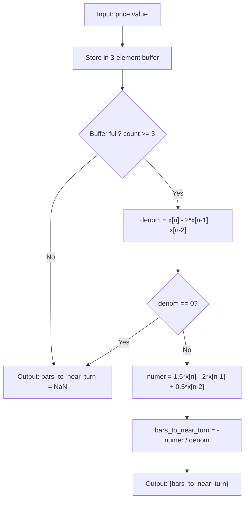

# Parabolic Vertex Indicator

## Overview

The Parabolic Vertex indicator predicts turning points in a price series by
fitting a parabola (second-degree polynomial) to the 3 most recent data
points and computing where the vertex (extremum) occurs. The output is the
number of bars from the current bar to the predicted turning point.

- **Positive output**: turning point is in the future (reversal expected)
- **Negative output**: turning point is in the past (reversal already happened)
- **Near zero**: turning point is occurring now

This indicator works best on **pre-smoothed prices** (e.g., EMA, adaptive MA).
On raw prices the fit is extremely noisy.

## Basic Principles

A parabola $y = at^2 + bt + c$ has exactly one turning point (vertex) at
$t_v = -b/(2a)$. By fitting a parabola through the 3 most recent price
points and placing the coordinate origin at the current bar ($t = 0$ for
the newest, $t = -1$ for one bar back, $t = -2$ for two bars back), we can
solve for the vertex location relative to the current bar.

If the parabola has zero curvature ($a = 0$), the data lie on a straight
line and no turning point exists.

## Mathematical Description

Given three consecutive prices $x(n)$, $x(n-1)$, $x(n-2)$ (most recent
first), fit the parabola $x(t) = dt^2 + et + f$ to points at $t = 0, -1, -2$.

Solving the system yields:

$$d = \frac{x(n) - 2x(n-1) + x(n-2)}{2} \tag{A5.3}$$

$$e = \frac{3x(n) - 4x(n-1) + x(n-2)}{2} \tag{A5.4}$$

The vertex is at $t_v = -e/(2d)$, which simplifies to:

$$t_v(n) = -\frac{\frac{3}{2}x(n) - 2x(n-1) + \frac{1}{2}x(n-2)}{x(n) - 2x(n-1) + x(n-2)} \tag{7.1}$$

**Undefined when:** $x(n) - 2x(n-1) + x(n-2) = 0$ (zero curvature, i.e.,
three points are collinear). Output is NaN.

## Configuration Parameters

None. This indicator has no configurable parameters.

### Input

Pre-smoothed price values. The user is responsible for smoothing the input
(e.g., with EMA) before feeding it to this indicator. Raw prices produce
extremely noisy results.

### Output

| Field | Type | Description |
|-------|------|-------------|
| `bars_to_near_turn` | float | Bars from current bar to predicted turning point |

Output is `NaN` when:
- Fewer than 3 prices received (priming period = 2 bars)
- Three points are collinear (zero curvature)

### Priming Period

2 bars (first valid output at bar index 2, after receiving 3 prices).

## Algorithmic Flow



## Practical Notes

1. **Always smooth input first.** The book recommends adaptive MA with
   smoothness parameters 1 and 3. Simple EMA with period 6–20 also works.

2. **Threshold plotting.** Only display values in range $[-4, +4]$ bars.
   Values outside this range indicate the turning point is too far away for
   reliable prediction.

3. **Confirmation.** Use with the cubic velocity indicator (PFD degree=3,
   order=1) — velocity crossing zero confirms the vertex prediction.

## Test Data Parameter Combinations

| # | What it tests | Input | Array name |
|---|---|---|---|
| 1 | Parabolic vertex on raw market data | INPUT_CLOSE | EXPECTED_RAW |
| 2 | Parabolic vertex on EMA(6) smoothed data | INPUT_EMA6 | EXPECTED_EMA6 |
| 3 | Parabolic vertex on EMA(20) smoothed data | INPUT_EMA20 | EXPECTED_EMA20 |

Synthetic test:
- Test 1: Known parabola $x = -(t-25)^2 + 100$, vertex exactly at offset $(25 - t)$

## References

```bibtex
@book{mak2003science,
  author    = {Mak, Don K.},
  title     = {The Science of Financial Market Trading},
  year      = {2003},
  publisher = {World Scientific},
  address   = {Singapore},
  isbn      = {978-981-238-473-8},
  doi       = {10.1142/5157},
  url       = {https://www.worldscientific.com/worldscibooks/10.1142/5157},
  note      = {Chapter 7: Vertex Indicators; Appendix 5: Derivation of Vertex Formulae}
}
```
