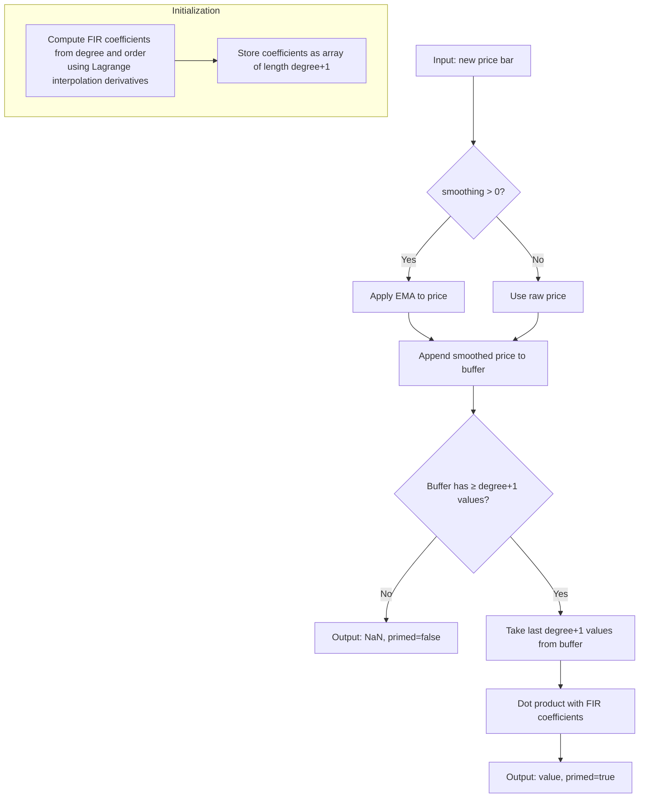
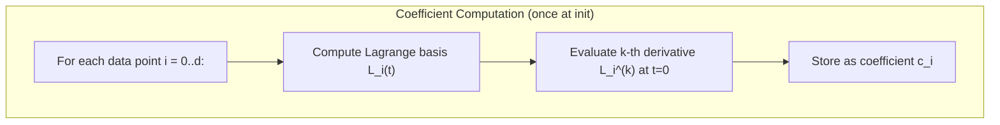

# PFD — Polynomial Fit Derivative

A unified indicator that fits a polynomial of degree $d$ to the most recent $d+1$ price bars and evaluates its $k$-th derivative at the current bar. This single implementation covers all of Don Mak's polynomial-based velocity and acceleration indicators: Parabolic, Cubic, Quartic, Quintic, and Sextic.

---

## Basic Principles

Imagine drawing a smooth curve through the last few price points on a chart. The **slope** of that curve at the rightmost (most recent) point tells you the current rate of price change — its *velocity*. The **curvature** (how fast the slope itself is changing) tells you the *acceleration*.

The Polynomial Fit Derivative indicator does exactly this:

1. **Take the last few prices** — for a degree-$d$ polynomial, you need $d+1$ points (e.g., a cubic needs 4 points).
2. **Fit a polynomial** — find the unique polynomial of degree $d$ that passes through all $d+1$ points exactly.
3. **Compute the derivative** — evaluate the 1st derivative (velocity) or 2nd derivative (acceleration) of that polynomial at the most recent point.

The result is a single number per bar: positive velocity means price is rising, negative means falling. Positive acceleration means the uptrend is strengthening (or the downtrend is weakening).

**Why pre-smooth?** Raw prices are noisy. Fitting a polynomial to noisy data amplifies the noise, especially for higher degrees. Applying an Exponential Moving Average (EMA) to the prices before fitting dramatically reduces noise while preserving the essential trend information. Mak recommends EMA lengths of 3 or 6.

**Why higher-degree polynomials?** A parabola (degree 2) is the simplest curve that has a meaningful slope and curvature, but it approximates a sine wave poorly. A cubic (degree 3) or quartic (degree 4) tracks the true shape more faithfully, giving velocity and acceleration readings that are closer to the theoretical ideal across a wider range of frequencies. However, above degree 5-6, diminishing returns set in as the filter amplifies high-frequency noise.

---

## Mathematics

### General Method

Given $d+1$ consecutive (smoothed) price values $x(0), x(-1), \ldots, x(-d)$ where $x(0)$ is the current bar and $x(-j)$ is $j$ bars ago, fit the unique polynomial $p(t)$ of degree $d$ that satisfies:

$$p(-j) = x(-j), \quad j = 0, 1, \ldots, d$$

The $k$-th derivative of $p(t)$ evaluated at $t = 0$ gives the indicator output:

$$y(0) = p^{(k)}(0) = \sum_{j=0}^{d} c_j \, x(-j)$$

where the coefficients $c_j$ depend only on the degree $d$ and derivative order $k$, not on the data. This makes the indicator a simple **FIR (Finite Impulse Response) filter** — a weighted sum of the last $d+1$ smoothed prices with fixed coefficients.

### Coefficient Derivation via Lagrange Interpolation

The polynomial $p(t)$ can be written using the Lagrange basis:

$$p(t) = \sum_{i=0}^{d} x(-i) \, L_i(t)$$

where each Lagrange basis polynomial is:

$$L_i(t) = \prod_{\substack{j=0 \\ j \neq i}}^{d} \frac{t - (-j)}{(-i) - (-j)} = \prod_{\substack{j=0 \\ j \neq i}}^{d} \frac{t + j}{j - i}$$

The FIR coefficient for the $i$-th data point is the $k$-th derivative of $L_i$ evaluated at $t=0$:

$$c_i = L_i^{(k)}(0)$$

For the **first derivative** ($k=1$):

$$L_i'(0) = \frac{1}{\prod_{\substack{j=0 \\ j \neq i}}^{d}(-i+j)} \sum_{\ell=0, \ell \neq i}^{d} \prod_{\substack{m=0 \\ m \neq i, m \neq \ell}}^{d} (0 + m)$$

For the **second derivative** ($k=2$):

$$L_i''(0) = \frac{1}{\prod_{\substack{j=0 \\ j \neq i}}^{d}(-i+j)} \sum_{\substack{\ell < r \\ \ell,r \neq i}} 2 \prod_{\substack{m=0 \\ m \neq i, m \neq \ell, m \neq r}}^{d} (0 + m)$$

These formulas yield exact rational coefficients that can be computed at initialization time for any degree $d$.

### Coefficient Tables (Exact Fractions)

#### Velocity Indicators (1st Derivative, $k=1$)

| Degree | Points | Coefficients $(c_0, c_1, \ldots, c_d)$ | Eq. |
|--------|--------|-------|-----|
| 2 (Parabolic) | 3 | $\frac{3}{2},\; -2,\; \frac{1}{2}$ | (6.1) |
| 3 (Cubic) | 4 | $\frac{11}{6},\; -3,\; \frac{3}{2},\; -\frac{1}{3}$ | (6.5) |
| 4 (Quartic) | 5 | $\frac{25}{12},\; -4,\; 3,\; -\frac{4}{3},\; \frac{1}{4}$ | (8.15) |
| 5 (Quintic) | 6 | $\frac{137}{60},\; -5,\; 5,\; -\frac{10}{3},\; \frac{5}{4},\; -\frac{1}{5}$ | (8.21) |
| 6 (Sextic) | 7 | $\frac{49}{20},\; -6,\; \frac{15}{2},\; -\frac{20}{3},\; \frac{15}{4},\; -\frac{6}{5},\; \frac{1}{6}$ | (8.27) |

#### Acceleration Indicators (2nd Derivative, $k=2$)

| Degree | Points | Coefficients $(c_0, c_1, \ldots, c_d)$ | Eq. |
|--------|--------|-------|-----|
| 2 (Parabolic) | 3 | $1,\; -2,\; 1$ | (6.3) |
| 3 (Cubic) | 4 | $2,\; -5,\; 4,\; -1$ | (6.7) |
| 4 (Quartic) | 5 | $\frac{35}{12},\; -\frac{26}{3},\; \frac{19}{2},\; -\frac{14}{3},\; \frac{11}{12}$ | (8.17) |
| 5 (Quintic) | 6 | $\frac{15}{4},\; -\frac{77}{6},\; \frac{107}{6},\; -13,\; \frac{61}{12},\; -\frac{5}{6}$ | (8.23) |
| 6 (Sextic) | 7 | $\frac{203}{45},\; -\frac{87}{5},\; \frac{117}{4},\; -\frac{254}{9},\; \frac{33}{2},\; -\frac{27}{5},\; \frac{137}{180}$ | (8.29) |

**Note:** The sextic acceleration coefficients appear as truncated decimals in the book (e.g., 4.5112 for $203/45 = 4.5\overline{1}$, 0.7612 for $137/180 = 0.761\overline{1}$). The exact fractions are listed above.

### Output Response (General Form)

For any degree $d$ and derivative order $k$, the indicator output at bar $n$ is the convolution sum:

$$y(n) = \sum_{j=0}^{d} c_j \, x(n-j)$$

where $x(n)$ is the (optionally EMA-smoothed) price at bar $n$.

**Example — Cubic Velocity ($d=3, k=1$):**

$$y(n) = \frac{11}{6} x(n) - 3 x(n-1) + \frac{3}{2} x(n-2) - \frac{1}{3} x(n-3) \tag{6.5}$$

**Example — Quartic Acceleration ($d=4, k=2$):**

$$y(n) = \frac{35}{12} x(n) - \frac{26}{3} x(n-1) + \frac{19}{2} x(n-2) - \frac{14}{3} x(n-3) + \frac{11}{12} x(n-4) \tag{8.17}$$

### Pre-Smoothing with EMA

The input prices are optionally smoothed with an Exponential Moving Average before the FIR filter is applied. The EMA recurrence is:

$$\text{EMA}(n) = \alpha \cdot \text{price}(n) + (1 - \alpha) \cdot \text{EMA}(n-1)$$

where $\alpha = 2 / (L + 1)$ and $L$ is the EMA length (period).

The combined system is: raw price → EMA smoothing → FIR derivative filter → output.

### Discrete-Time Fourier Transform (Frequency Response)

The FIR filter's frequency response is:

$$H(\omega) = \sum_{j=0}^{d} c_j \, e^{-ij\omega}$$

**Ideal velocity indicator:** constant amplitude proportional to $\omega$ and constant phase lead of $\pi/2$ across all frequencies.

**Ideal acceleration indicator:** constant amplitude proportional to $\omega^2$ and constant phase lead of $\pi$.

Higher-degree polynomials maintain the ideal phase over a wider range of low frequencies before deviating at higher frequencies. Mak's analysis (B2, Ch 8.7) concludes that quartic and quintic indicators provide the flattest phase response and are the best choices for trading.

---

## Parameters

| Parameter | Type | Default | Valid Range | Description |
|-----------|------|---------|-------------|-------------|
| `degree` | int | 3 | $\geq 2$ | Polynomial degree. Determines the number of data points used ($d+1$). Degrees 2–6 correspond to Mak's named indicators. Higher degrees are supported but untested. |
| `order` | int | 1 | $1 \leq k < d$ | Derivative order. See naming table below. |
| `smoothing` | int | 6 | $\geq 0$ | EMA pre-smoothing length. 0 = no smoothing (raw prices). Mak recommends 3 or 6. |

### Derivative Order Names

| Order $k$ | Physics term | Ideal phase lead | Trading interpretation |
|-----------|-------------|-----------------|----------------------|
| 1 | **Velocity** | $\pi/2$ | Trend direction and speed. Positive = rising, negative = falling. |
| 2 | **Acceleration** | $\pi$ | Trend strengthening/weakening. Positive = uptrend accelerating. |
| 3 | **Jerk** | $3\pi/2$ | Rate of change of acceleration — earliest signal of inflection. |
| 4 | **Snap** (Jounce) | $2\pi$ | Rarely useful. Extremely noise-sensitive. |
| 5 | **Crackle** | $5\pi/2$ | Theoretical only. |
| 6 | **Pop** | $3\pi$ | Theoretical only. |

Mak's books only analyze orders 1 and 2. Higher orders ($k \geq 3$) are supported by the implementation but each successive derivative amplifies high-frequency noise further. The 3rd derivative (jerk) may be useful with heavy pre-smoothing (e.g., `smoothing=12` or higher) but is untested in the literature. Orders above 3 are unlikely to produce tradeable signals.

### Parameter Guidance

- **`degree=3, order=1`** (Cubic Velocity): Good general-purpose velocity indicator. Uses 4 data points.
- **`degree=4, order=1`** (Quartic Velocity): Best phase response for velocity. Uses 5 points.
- **`degree=5, order=1`** (Quintic Velocity): Slightly wider flat-phase region than quartic. Uses 6 points.
- **`degree=4, order=2`** (Quartic Acceleration): Best phase response for acceleration. Uses 5 points.
- **`smoothing=6`**: Good noise suppression with moderate lag. Recommended default.
- **`smoothing=3`**: Less lag, more noise. Use on already-smooth data.
- **`smoothing=0`**: No smoothing. Only useful on pre-processed data.

---

## Outputs

| Output | Type | Description |
|--------|------|-------------|
| `value` | float | The $k$-th derivative of the polynomial fit at the current bar. Positive = upward slope/curvature, negative = downward. |

When not primed (fewer than `degree + 1` smoothed prices available), the output is `NaN`.

### Trading Interpretation

**Velocity ($k=1$):**
- Positive → price trending up → buy signal
- Negative → price trending down → sell signal
- Zero crossing → potential turning point

**Acceleration ($k=2$):**
- Positive → uptrend strengthening or downtrend weakening
- Negative → uptrend weakening or downtrend strengthening
- Zero crossing → velocity at an extremum (trend inflection)

---

## Algorithmic Flow





---

## Legacy Aliases

The following named indicators from Mak's books are specific parameter presets of PFD:

| Legacy Abbrev | Legacy Name | PFD Parameters | Source |
|---------------|-------------|----------------|--------|
| PV | Parabolic Velocity | `degree=2, order=1` | B1 Ch 6.1 |
| PA | Parabolic Acceleration | `degree=2, order=2` | B1 Ch 6.2 |
| CV | Cubic Velocity | `degree=3, order=1` | B1 Ch 6.3 |
| CA | Cubic Acceleration | `degree=3, order=2` | B1 Ch 6.3 |
| QV | Quartic Velocity | `degree=4, order=1` | B2 Ch 8.4 |
| QA | Quartic Acceleration | `degree=4, order=2` | B2 Ch 8.4 |
| QNV | Quintic Velocity | `degree=5, order=1` | B2 Ch 8.5 |
| QNA | Quintic Acceleration | `degree=5, order=2` | B2 Ch 8.5 |
| SXV | Sextic Velocity | `degree=6, order=1` | B2 Ch 8.6 |
| SXA | Sextic Acceleration | `degree=6, order=2` | B2 Ch 8.6 |

---

## References

```bibtex
@book{mak2003science,
  author    = {Mak, Don K.},
  title     = {The Science of Financial Market Trading},
  year      = {2003},
  publisher = {World Scientific},
  address   = {Singapore},
  isbn      = {978-981-238-252-8},
  doi       = {10.1142/5178},
  url       = {https://www.worldscientific.com/worldscibooks/10.1142/5178},
  note      = {Ch 6: Parabolic/Cubic velocity and acceleration indicators}
}

@book{mak2006mathematical,
  author    = {Mak, Don K.},
  title     = {Mathematical Techniques in Financial Market Trading},
  year      = {2006},
  publisher = {World Scientific},
  address   = {Singapore},
  isbn      = {978-981-256-699-7},
  doi       = {10.1142/6055},
  url       = {https://www.worldscientific.com/worldscibooks/10.1142/6055},
  note      = {Ch 8: Quartic, Quintic, and Sextic velocity and acceleration indicators}
}

@book{mak2021trading,
  author    = {Mak, Don K.},
  title     = {Trading Tactics in the Financial Market: Mathematical Methods to Improve Performance},
  year      = {2021},
  publisher = {Springer International Publishing},
  address   = {Cham},
  series    = {Management for Professionals},
  isbn      = {978-3-030-70621-0},
  doi       = {10.1007/978-3-030-70622-7},
  url       = {https://link.springer.com/10.1007/978-3-030-70622-7},
  note      = {Analysis of velocity/acceleration indicator phase responses and trading tactics}
}
```
