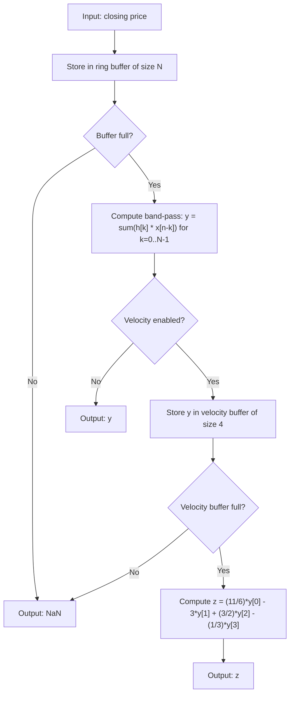
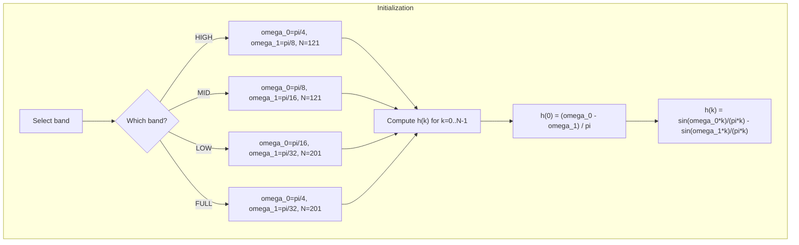

# Sinc Wavelet Band-Pass Filter (SWB)

## Overview

The Sinc Wavelet Band-Pass filter decomposes financial time-series data into
frequency bands using causal FIR filters derived from the sinc wavelet system.
It isolates cyclical components within specific period ranges, allowing traders
to observe price oscillations at different timescales independently.

When the optional velocity mode is enabled, the filter additionally computes the
rate of change (first derivative) of the band-passed signal using a cubic
polynomial fit, producing a momentum-like oscillator.

## Basic Principles

### Band-Pass Filtering

A band-pass filter passes signals within a specific frequency range and
attenuates everything outside that range. In trading terms: if price data
contains cycles at many different periods (5-bar cycles, 20-bar cycles,
50-bar cycles, etc.), a band-pass filter lets you isolate just one range
of cycles while removing everything else.

### The Sinc Function

The ideal band-pass filter in the frequency domain is a rectangular window
(pass everything between two frequencies, block everything else). The
inverse Fourier transform of this rectangle is the difference of two sinc
functions: $\text{sinc}(x) = \sin(x) / x$. This gives the filter
coefficients directly.

### Causal (One-Sided) Implementation

The theoretical sinc filter extends infinitely in both directions. For
real-time use, we truncate it to use only past data (causal filter). This
introduces:
- A startup period (priming) before the filter produces valid output
- Some phase distortion (the filter delays different frequencies by
  different amounts)

### Octave Band Decomposition

The three standard bands each span one octave (factor of 2 in frequency):
- **HIGH**: periods 8–16 bars (fast cycles)
- **MID**: periods 16–32 bars (medium cycles)
- **LOW**: periods 32–64 bars (slow cycles)

Together they cover a 3-octave range from period 8 to period 64.

### Velocity Mode

When velocity is enabled, the band-passed output is further processed by
a cubic velocity kernel — a 4-tap FIR filter that estimates the first
derivative (rate of change) of the signal. This is equivalent to fitting a
cubic polynomial to the last 4 filtered values and evaluating its
derivative at the most recent point.

## Mathematical Description

### Filter Coefficient Formula

For a band-pass filter with upper cutoff frequency $\omega_0$ and lower
cutoff frequency $\omega_1$ (both in radians per bar), the FIR coefficients
are:

$$h(0) = \frac{\omega_0 - \omega_1}{\pi} \tag{1}$$

$$h(k) = \frac{\sin(\omega_0 \cdot k)}{\pi k} - \frac{\sin(\omega_1 \cdot k)}{\pi k}, \quad k = 1, 2, \ldots, N-1 \tag{2}$$

where $N$ is the number of taps (filter length).

### Band Definitions

| Band | Upper $\omega_0$ | Lower $\omega_1$ | Period range | Taps $N$ |
|------|------------------|------------------|--------------|----------|
| HIGH | $\pi/4$ | $\pi/8$ | 8–16 bars | 121 |
| MID | $\pi/8$ | $\pi/16$ | 16–32 bars | 121 |
| LOW | $\pi/16$ | $\pi/32$ | 32–64 bars | 201 |
| FULL | $\pi/4$ | $\pi/32$ | 8–64 bars | 201 |

The relationship between angular frequency and period is
$\omega = 2\pi / T$, so $\omega_0 = \pi/4$ corresponds to period $T = 8$
bars.

### Specific Filter Formulas (from book)

The high wavelet filter $h_{-3}$:

$$h_{-3}(k) = \frac{\sin(\pi k / 4)}{\pi k} - \frac{\sin(\pi k / 8)}{\pi k} \tag{A7.44}$$

The middle wavelet filter $h_{-4}$:

$$h_{-4}(k) = \frac{\sin(\pi k / 8)}{\pi k} - \frac{\sin(\pi k / 16)}{\pi k} \tag{A7.45}$$

The low wavelet filter $h_{-5}$:

$$h_{-5}(k) = \frac{\sin(\pi k / 16)}{\pi k} - \frac{\sin(\pi k / 32)}{\pi k} \tag{A7.46}$$

### FULL Band Equivalence

The FULL band combines all three sub-bands. By linearity of convolution:

$$(h_{-3} + h_{-4} + h_{-5}) * x = h_{-3} * x + h_{-4} * x + h_{-5} * x \tag{A7.47}$$

The summed filter $h_{-3} + h_{-4} + h_{-5}$ is equivalent to a single
band-pass filter transmitting $\pi/32$ to $\pi/4$ radians, i.e., directly
computing with $\omega_0 = \pi/4$ and $\omega_1 = \pi/32$.

### Zero-Phase Frequency

For a causal band-pass filter with cutoffs $\omega_1$ and $\omega_0$, the
signal frequency that experiences zero phase shift is:

$$\omega_{zp} = \sqrt{\omega_1 \cdot \omega_0} \tag{A7.42}$$

For the sinc wavelets where $\omega_1 = \omega_0 / 2$:

$$\omega_{zp} = \omega_0 / \sqrt{2} \tag{A7.43}$$

### Convolution (Filtering)

The filter output at bar $n$ is the dot product of the coefficient vector
with the most recent $N$ price values:

$$y(n) = \sum_{k=0}^{N-1} h(k) \cdot x(n - k) \tag{3}$$

where $x(n)$ is the closing price at bar $n$, and $h(k)$ are the filter
coefficients. The output $y(n)$ is undefined (NaN) for the first $N-1$
bars.

### Velocity Kernel

When velocity mode is enabled, the band-passed output is convolved with
the cubic velocity kernel. This kernel is the first derivative of a cubic
Lagrange interpolating polynomial evaluated at the most recent point
(degree=3, order=1 backward finite difference):

$$v = [11/6, \; -3, \; 3/2, \; -1/3] \tag{4}$$

Applied as:

$$z(n) = \frac{11}{6} y(n) - 3 y(n-1) + \frac{3}{2} y(n-2) - \frac{1}{3} y(n-3) \tag{5}$$

where $y(n)$ is the band-pass filter output. The velocity output is
undefined (NaN) for an additional 3 bars beyond the band-pass priming
period.

### Combined Wavelet Velocity (WBV)

The book's WBV indicator applies velocity to all three bands and sums:

$$(v * h_{-3} + v * h_{-4} + v * h_{-5}) * x = v * (h_{-3} + h_{-4} + h_{-5}) * x \tag{A7.47}$$

This is equivalent to using `band=FULL, velocity=True`.

## Frequency Response

### Ideal (Non-Causal) Passband

$$H_{-3}(\omega) = \begin{cases} 1 & \pi/8 < |\omega| < \pi/4 \\ 0 & \text{otherwise} \end{cases} \tag{A7.36}$$

$$H_{-4}(\omega) = \begin{cases} 1 & \pi/16 < |\omega| < \pi/8 \\ 0 & \text{otherwise} \end{cases} \tag{A7.37}$$

$$H_{-5}(\omega) = \begin{cases} 1 & \pi/32 < |\omega| < \pi/16 \\ 0 & \text{otherwise} \end{cases} \tag{A7.38}$$

### Truncation Effects

The causal (one-sided truncated) filter has:
- Ripple in the passband and stopband (Gibbs phenomenon)
- Non-zero transition bandwidth
- Frequency-dependent phase (linear for symmetric, approximately linear
  for these truncated sinc filters)

## Configuration Parameters

| Parameter | Type | Valid Range | Default | Description |
|-----------|------|-------------|---------|-------------|
| `band` | Band enum | HIGH, MID, LOW, FULL | — (required) | Frequency band to extract |
| `velocity` | bool | true/false | false | Apply cubic velocity to filtered output |

### Band Enum Values

| Value | Description |
|-------|-------------|
| `HIGH` | Periods 8–16 bars, 121 taps |
| `MID` | Periods 16–32 bars, 121 taps |
| `LOW` | Periods 32–64 bars, 201 taps |
| `FULL` | Periods 8–64 bars, 201 taps |

### Priming Period

- Band-pass only: $N - 1$ bars (120 for HIGH/MID, 200 for LOW/FULL)
- With velocity: $N - 1 + 3$ bars (123 for HIGH/MID, 203 for LOW/FULL)

## Algorithmic Flow





## Output

| Field | Type | Description |
|-------|------|-------------|
| `value` | float | Band-passed price (or velocity of band-passed price) |

Output is `NaN` during the priming period.

## Test Data Parameter Combinations

| # | What it tests | Parameters | Array name |
|---|---|---|---|
| 1 | High frequency band, no velocity | band=HIGH, velocity=False | EXPECTED_HIGH |
| 2 | Mid frequency band, no velocity | band=MID, velocity=False | EXPECTED_MID |
| 3 | Low frequency band, no velocity | band=LOW, velocity=False | EXPECTED_LOW |
| 4 | Full band (8-64 bars), no velocity | band=FULL, velocity=False | EXPECTED_FULL |
| 5 | High frequency band with velocity | band=HIGH, velocity=True | EXPECTED_HIGH_V |
| 6 | Mid frequency band with velocity | band=MID, velocity=True | EXPECTED_MID_V |
| 7 | Low frequency band with velocity | band=LOW, velocity=True | EXPECTED_LOW_V |
| 8 | Full band with velocity | band=FULL, velocity=True | EXPECTED_FULL_V |

## References

```bibtex
@book{mak2003science,
  author    = {Mak, Don K.},
  title     = {The Science of Financial Market Trading},
  year      = {2003},
  publisher = {World Scientific},
  address   = {Singapore},
  isbn      = {978-981-238-473-8},
  doi       = {10.1142/5157},
  url       = {https://www.worldscientific.com/worldscibooks/10.1142/5157},
  note      = {Chapter 9: Wavelet Analysis; Appendix 7: Wavelets (Eqs A7.33--A7.47)}
}

@book{mak2006mathematical,
  author    = {Mak, Don K.},
  title     = {Mathematical Techniques in Financial Market Trading},
  year      = {2006},
  publisher = {World Scientific},
  address   = {Singapore},
  isbn      = {978-981-256-699-7},
  doi       = {10.1142/6055},
  url       = {https://www.worldscientific.com/worldscibooks/10.1142/6055},
  note      = {Chapter 5: Causal Wavelet Filters}
}

@book{oppenheim1999discrete,
  author    = {Oppenheim, Alan V. and Schafer, Ronald W.},
  title     = {Discrete-Time Signal Processing},
  year      = {1999},
  publisher = {Prentice Hall},
  edition   = {2nd},
  isbn      = {978-0-13-754920-7},
  note      = {Sinc function and ideal band-pass filter theory}
}
```
