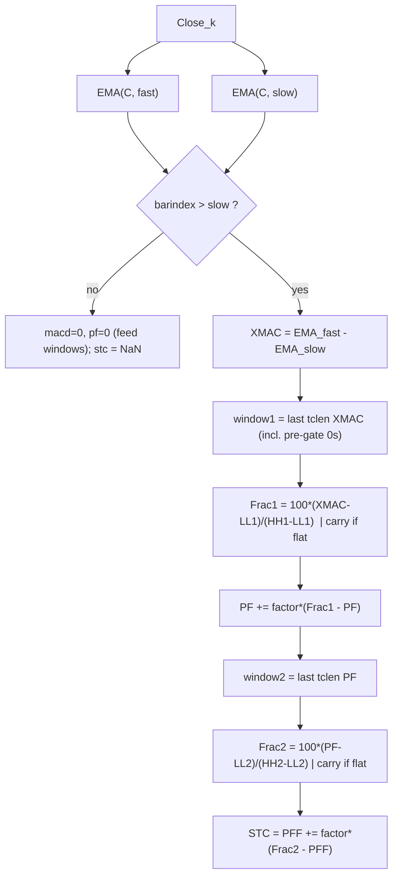

# Schaff Trend Cycle (STC) — Doug Schaff

> **Indicator (cyclical oscillator, MACD-derived).**
> The STC runs a **MACD line** through **two cascaded stochastics**, each followed
> by an EMA-style smoothing, to produce a fast, cyclical oscillator bounded to
> $[0, 100]$. Doug Schaff developed it in the late 1990s for FX trading; the
> open-source code was released in 2008. Overbought/oversold bands are
> conventionally **75 / 25** (some platforms use 80 / 20).
>
> This file is **self-contained**. One primitive is **embedded** (inlined): the
> Blau EMA (see `../../william-blau/core/exponential-moving-average/`). A porting
> agent needs only this document and `schaff-trend-cycle.py`.
>
> **Input:** a single Close series. **Output:** `(stc, macd, pf)` — the oscillator
> plus two internal stage values for differential testing (see §4).

---

## ⚠️ Part A — Conformance, not authorial correctness (read first)

**Doug Schaff never published an article, white paper, or book that defines the
STC formula or its default parameters.** There is therefore **no authorial ground
truth** to validate against. Public implementations **do not agree**:

| Implementation | Stoch passes | %D smoothing | Default fast/slow | Verdict |
|----------------|--------------|--------------|-------------------|---------|
| **ProRealCode `schaff-trend-cycle2`** (Malagrida 2017) | **2** (cascade) | EMA, α = factor | 23 / 50 | **declared reference** |
| pandas-ta-classic `stc.py` | 2 (cascade) | EMA, α = 0.5 | 12 / 26 | faithful **except a 1st-stochastic guard bug** (A.2) |
| freqtrade/technical `stc()` | **1** (single) | SMA | 23 / 50 | **not STC** — different structure & a non-STC final formula |

Three functions named "Schaff Trend Cycle", three different outputs. Because no
primary spec exists, "correct" is **redefined** as *byte-for-byte concordant with
a declared reference*:

> **Declared reference:** ProRealCode `schaff-trend-cycle2` (F. Malagrida, 2017),
> <https://www.prorealcode.com/prorealtime-indicators/schaff-trend-cycle2/>.

We make **no claim** that this output is "what Schaff intended"; only that it is
*concordant with that reference at the stated parameters*. Every deviation the
reference leaves open is recorded as a **decision** (§2.3), not a correctness
claim.

### A.1 The reference (verbatim ProBuilder)

```probuilder
TCLen = 10 ; MA1 = 23 ; MA2 = 50 ; Once Factor = 0.5
if barindex > MA2 then
  XMAC   = ExponentialAverage[MA1](Close) - ExponentialAverage[MA2](Close)
  Value1 = Lowest[TCLen](XMAC)
  Value2 = Highest[TCLen](XMAC) - Value1
  if Value2 > 0 then Frac1 = ((XMAC - Value1)/Value2) * 100 else Frac1 = Frac1[1] endif
  PF     = PF[1] + (Factor * (Frac1 - PF[1]))
  Value3 = Lowest[TCLen](PF)
  Value4 = Highest[TCLen](PF) - Value3
  if Value4 > 0 then Frac2 = ((PF - Value3)/Value4) * 100 else Frac2 = Frac2[1] endif
  PFF    = PFF[1] + (Factor * (Frac2 - PFF[1]))
endif
RETURN PFF
```

### A.2 The pandas-ta-classic bug (why a reference is mandatory)

ProRealCode guards the first stochastic on the **range** being positive
(`Value2 = HH - LL > 0`). pandas-ta-classic instead guards on the **lowest
value** (`lowest_xmacd > 0`). Because a MACD line is **negative** much of the
time, that test is often false, so the buggy port carries the previous %K forward
when it should not — diverging from the reference in any down-trend. A reader
without the reference would never notice. **This implementation guards on the
range** (`HH − LL > 0`), per the reference.

### A.3 Cross-check against two independent MQL5 ports (triangulation)

A reference cannot self-validate. To show this port reproduces the *actual STC
mechanic* (not just one author's transcription of it), it was compared against
two independently-written MetaTrader 5 implementations that are **faithful** STC
(full `EMA∘stoch∘EMA∘stoch∘MACD` cascade, range-guarded — unlike the freqtrade
single-stochastic function or the pandas-ta guard bug):

| Port | Author / source | EMA | `%D` seeding | Warm-up windows |
|------|-----------------|-----|--------------|-----------------|
| **this port** | ProRealCode-concordant | Blau, `e₀=C₀` | `PF₀=PFF₀=0` | gate `bar>slow`; pre-gate **0s feed** windows |
| **MQL5 486** | Kositsin / EarnForex | CXMA | seed at **first %K** | ring buffers hold real values first |
| **MQL5 55511** | ForexEaPremium | MT5 `iMA` EMA | seed at **first %K** | waits `n ≥ cycle` before stochastic |

The two MQL5 ports differ from this port only in two **warm-up degrees of
freedom** (both already listed as open decisions in §2.3): they seed each `%D`
EMA at its first `%K` (we seed at 0), and they refuse to let pre-gate zeros enter
the stochastic windows (we follow the reference and admit them). Both choices are
transients damped by the `α = factor` EMA; neither changes the steady-state
indicator.

Result on the shared 252-bar `INPUT_CLOSE`, defaults 23/50/10/0.5:

- **486 ≡ 55511** to `max|Δ| = 9.2·10⁻¹⁴` (floating-point noise) — two separate
  codebases produce the *same* STC, corroborating the cascade itself.
- **This port vs both** converges monotonically as the seeds wash out:

  | agreement reached | from bar |
  |-------------------|----------|
  | `|Δ| < 1.0`   | 73 |
  | `|Δ| < 0.1`   | 77 |
  | `|Δ| < 10⁻³`  | 84 |
  | `|Δ| < 10⁻⁶`  | 94  (≈ `slow + 4·tclen`) |
  | `|Δ| < 10⁻⁹`  | 104 |

  The last bars are bit-identical to every printed digit (e.g. bar 250 = 90.6240,
  bar 251 = 45.3120 in all three). The only disagreement lives in the warm-up
  region and **decays to zero** — the signature of *one* indicator computed with
  different priming, not three different indicators.

This is the opposite of the A.1/A.2 disagreements: there, faithful-looking ports
produced *structurally* different curves; here, three independent faithful ports
converge to a single steady-state oscillator. The reference choice is therefore
not idiosyncratic — it is the common STC, and this port reproduces it.

---

## 1. Definition

For Close series $C$, periods `fast` < `slow`, cycle `tclen`, smoothing `factor`:

### 1.1 MACD line

$$XMAC_k = EMA(C, \text{fast})_k - EMA(C, \text{slow})_k$$

### 1.2 First stochastic of the MACD, smoothed

$$LL^1_k = \min_{\text{last } tclen} XMAC, \qquad HH^1_k = \max_{\text{last } tclen} XMAC$$

$$Frac1_k = \begin{cases} 100 \cdot \dfrac{XMAC_k - LL^1_k}{HH^1_k - LL^1_k} & HH^1_k > LL^1_k \\[1.2ex] Frac1_{k-1} & \text{otherwise (flat window)} \end{cases}$$

$$PF_k = PF_{k-1} + \text{factor}\cdot(Frac1_k - PF_{k-1}) \qquad (\text{EMA},\ \alpha=\text{factor},\ PF_0=0)$$

### 1.3 Second stochastic of PF, smoothed → STC

$$LL^2_k = \min_{\text{last } tclen} PF, \qquad HH^2_k = \max_{\text{last } tclen} PF$$

$$Frac2_k = \begin{cases} 100 \cdot \dfrac{PF_k - LL^2_k}{HH^2_k - LL^2_k} & HH^2_k > LL^2_k \\[1.2ex] Frac2_{k-1} & \text{otherwise} \end{cases}$$

$$\boxed{\;STC_k = PFF_k = PFF_{k-1} + \text{factor}\cdot(Frac2_k - PFF_{k-1})\;}\qquad (PFF_0=0)$$

### 1.4 Bounds

Each stochastic %K lies in $[0, 100]$; the EMA of values in $[0, 100]$ (seeded at
0) stays in $[0, 100]$. Hence $STC \in [0, 100]$. The flat-window guard prevents
division by zero (the range is $\ge 0$ and the branch only divides when it is
strictly positive).

---

## 2. Priming conventions (faithful to the reference)

### 2.1 The gate — and why pre-gate **zeros matter**

The reference assigns `XMAC, Frac1, PF, Frac2, PFF` **only while
`barindex > slow`** (`MA2`). Before that they hold ProRealTime's default **0**.
Two consequences that **materially change the numbers** and are reproduced
exactly:

1. `XMAC` and `PF` are **0 on bars $0 \dots \text{slow}$**, and **those zeros enter
   the `Lowest`/`Highest` windows**, biasing the first $\approx tclen$ finite
   outputs. (The windows are fed the gated zeros each bar.)
2. The price EMAs are **not** gated — `ExponentialAverage` is a built-in computed
   over the whole history, so both EMAs accumulate from bar 0 (seed
   $e_0 = C_0$). Only their *difference* `XMAC` is gated.

### 2.2 Output / warm-up convention

`stc` is emitted as **`NaN` for bars $0 \dots \text{slow}$** (the pre-gate region,
where ProRealTime would merely show its default 0) and **finite from bar
$\text{slow}+1$** onward. The first $\approx 2\cdot tclen$ finite bars are a
transient (still settling out of the zero seeds) but are emitted as real values.

The intermediate `macd` and `pf` fields are emitted as their **true internal
values** (`0.0` in the pre-gate region), because those zeros are real state that
feeds the stochastic windows.



### 2.3 Decisions the reference leaves open (recorded, not "correctness")

| Ambiguity | Decision (this port) |
|-----------|----------------------|
| `%D` smoothing | **EMA, α = factor** (NOT Lane's SMA) — matches reference |
| Recursion seed | `PF_0 = PFF_0 = 0` — from ProRealTime's default-0 `[1]` back-reference |
| Flat window (range = 0) | **carry previous %K** (`Frac`) — matches reference |
| First-stoch guard | **range > 0** — NOT `lowest > 0` (the pandas-ta bug, A.2) |
| EMA seeding | assume `e_0 = C_0` (standard recursive EMA) — declared degree of freedom |
| Warm-up emission | `NaN` for bars `0..slow`; finite after |
| Default periods | **23/50** (forex, reference) vs 12/26 (generic) — exposed as params |

---

## 3. Parameters

| Name | Symbol | Type | Range | Default | Meaning |
|------|--------|------|-------|---------|---------|
| `fast` | fast | int | $\ge 1$, `< slow` | 23 | Fast EMA of the MACD line. |
| `slow` | slow | int | $\ge 1$ | 50 | Slow EMA; also sets the warm-up gate (`barindex > slow`). |
| `tclen` | tclen | int | $\ge 1$ | 10 | Cycle length — look-back for **both** stochastics. |
| `factor` | factor | float | $(0, 1]$ | 0.5 | EMA smoothing α for **both** `%D` stages. |

> The **23/50** pair is the forex-native default that propagates through the
> reference code; it is **not** confirmed to be Schaff's own published numbers.
> Treat the parameter set as a declared input, never an authorial constant.
> `factor = 1.0` is an edge case: the EMA becomes a passthrough, so `PF = Frac1`
> and `STC = Frac2` (no smoothing).

---

## 4. Output

A triple `(stc, macd, pf)` per bar (named tuple / struct / three arrays):

- **`stc`** — the indicator, range $[0, 100]$; `NaN` during warm-up (bars
  `0..slow`).
- **`macd`** — the **gated** MACD line `XMAC` (`0.0` pre-gate). Stage-1 oracle.
- **`pf`** — the first smoothed `%D` (`0.0` pre-gate). Stage-2 oracle.

The two intermediates exist so a porting agent can **localize a discrepancy to a
specific cascade stage** — the exact failure mode behind the field's
implementation disagreements (A.2). **Trading reading:** `stc` crossing up through
25 is bullish; crossing down through 75 is bearish.

---

## 5. Reference implementation contract

```text
state:
    slow, tclen, factor
    ema_fast, ema_slow : Blau EMAs (run EVERY bar, seed e_0 = close_0)
    bar                : 0-based bar index (starts at -1, ++ each update)
    macd_win, pf_win   : ring buffers of last tclen XMAC / PF (fed every bar)
    frac1, frac2       : carried %K (default 0; carried on a flat window)
    pf, pff            : carried smoothed %D (default 0)

update(close) -> (stc, macd, pf):
    bar += 1
    ef = ema_fast(close); es = ema_slow(close)      # always advance
    gate = bar > slow
    macd = (ef - es) if gate else 0.0               # GATED
    push macd into macd_win
    if not gate:
        push pf into pf_win                          # pre-gate 0 feeds the window
        return (NaN, macd, pf)
    ll1 = min(macd_win); rng1 = max(macd_win) - ll1
    if rng1 > 0: frac1 = 100*(macd - ll1)/rng1       # else carry frac1
    pf = pf + factor*(frac1 - pf)
    push pf into pf_win
    ll2 = min(pf_win); rng2 = max(pf_win) - ll2
    if rng2 > 0: frac2 = 100*(pf - ll2)/rng2         # else carry frac2
    pff = pff + factor*(frac2 - pff)
    return (pff, macd, pf)
```

The embedded `ExponentialMovingAverage` is copied verbatim from its own folder —
do not alter its numerics.

### Invariants (hold for any correct STC; verified in this port)

- `stc ∈ [0, 100]` after warm-up; **finite** (no NaN/∞) once the gate opens;
- **causal** — `stc[k]` depends only on bars `≤ k` (prefix-stable / no look-ahead);
- **deterministic** / reproducible;
- a **flat input** (constant close ⇒ `macd ≡ 0`) does not throw — the range
  guard fires and `stc` settles to `0.0`.

---

## 6. References

1. Malagrida, F. *Schaff Trend Cycle* (`schaff-trend-cycle2`), ProRealCode, 2017.
   The **declared reference** — full double-stochastic cascade with EMA `%Fast D`,
   defaults 23/50/10/0.5.
2. Schaff, D. Schaff Trend Cycle — developed late 1990s for FX; open-source code
   released 2008. **No defining article/book by the author has been located**;
   the formula here is recovered from (1).
3. Kositsin, N. *Schaff Trend Cycle* (MQL5 Code Base #486), EarnForex/MetaQuotes.
   Independent MT5 port (CXMA EMA, `%D` seeded at first `%K`); used for the A.3
   triangulation — steady-state-identical to this port.
4. ForexEaPremium. *Schaff Trend Cycle* (MQL5 Code Base #55511), MetaQuotes.
   Independent MT5 port (`iMA` EMA, same seeding as #486); used for the A.3
   triangulation.

### BibTeX

```bibtex
@misc{malagrida2017stc,
  author       = {Malagrida, Francesco},
  title        = {Schaff Trend Cycle ({schaff-trend-cycle2})},
  year         = {2017},
  howpublished = {\url{https://www.prorealcode.com/prorealtime-indicators/schaff-trend-cycle2/}},
  note         = {ProRealTime ProBuilder code; declared reference implementation:
                  double-stochastic cascade, EMA \%Fast~D, defaults 23/50/10/0.5}
}

@misc{schaff_stc,
  author       = {Schaff, Doug},
  title        = {Schaff Trend Cycle (STC)},
  year         = {2008},
  note         = {Cyclical MACD-of-stochastics oscillator, range 0--100, OB/OS 75/25;
                  developed late 1990s for FX. No primary specification by the
                  author located; mechanics recovered from the ProRealCode reference}
}

@misc{kositsin2008stc486,
  author       = {Kositsin, Nikolay},
  title        = {Schaff Trend Cycle},
  year         = {2008},
  howpublished = {\url{https://www.mql5.com/en/code/486}},
  note         = {MQL5 Code Base \#486 (EarnForex mirror); independent MT5 port,
                  CXMA EMA, \%D seeded at first \%K. Steady-state-identical to the
                  ProRealCode reference (triangulation, \S A.3)}
}

@misc{forexeapremium_stc55511,
  author       = {{ForexEaPremium}},
  title        = {Schaff Trend Cycle},
  year         = {2024},
  howpublished = {\url{https://www.mql5.com/en/code/55511}},
  note         = {MQL5 Code Base \#55511; independent MT5 port, iMA EMA, same
                  \%D seeding as \#486. Used for cross-implementation triangulation
                  (\S A.3); agrees with \#486 to floating-point precision}
}
```
