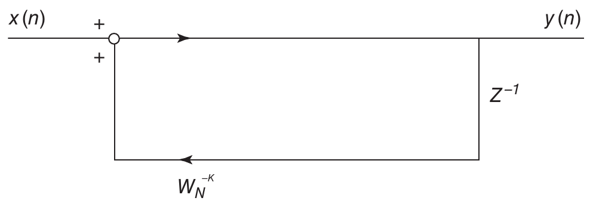
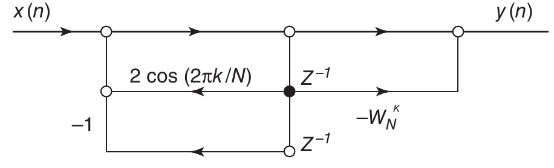

# F — Goertzel Algorithm

Goertzel's algorithm performs a DFT using an IIR filter calculation. Compared to
a direct *N*-point DFT calculation, this algorithm uses half the number of real
multiplications, the same number of real additions, and requires approximately $1/N$
the number of trigonometric evaluations. The biggest advantage of the Goertzel
algorithm over the direct DFT is the reduction of the trigonometric evaluations.
Both the direct method and the Goertzel method are more efficient than the FFT
when a "small" number of spectrum points is required rather than the entire spec-
trum. However, for the entire spectrum, the Goertzel algorithm is an $N^2$ effort, just
as is the direct DFT.

## F.1 Design Considerations

Both the first order and the second order Goertzel algorithms are explained in
several books [1–3] and in Ref. 4. A discussion of them follows. Since

$$W_N^{-kN} = e^{j2\pi k} = 1$$

both sides of the DFT in (6.1) can be multiplied by it, giving

$$X(k) = W_N^{-kN} \sum_{r=0}^{N-1} x(k)\, W_N^{+kr} \tag{F.1}$$

which can be written

$$X(k) = \sum_{r=0}^{N-1} x(r)\, W_N^{-k(N-r)} \tag{F.2}$$

Define a discrete-time function as

$$y_k(n) = \sum_{r=0}^{N-1} x(r)\, W_N^{-k(n-r)} \tag{F.3}$$

The discrete transform is then

$$X(k) = y_k(n)\big|_{n=N} \tag{F.4}$$

Equation (F.3) is a discrete convolution of a finite-duration input sequence $x(n)$,
$0 < n < N - 1$, with the infinite sequence $W_N^{-kn}$. The infinite impulse response
is therefore

$$h(n) = W_N^{-kn} \tag{F.5}$$

The *z*-transform of $h(n)$ in (F.5) is

$$H(z) = \sum_{n=0}^{\infty} h(n)\, z^{-n} \tag{F.6}$$

Substituting (F.5) into (F.6) gives

$$H(z) = \sum_{n=0}^{\infty} W_N^{-kn}\, z^{-n} = 1 + W_N^{-k}\, z^{-1} + W_N^{-2k}\, z^{-2} + \cdots = \frac{1}{1 - W_N^{-2k}\, z^{-1}} \tag{F.7}$$

Thus, equation (F.7) represents the transfer function of the convolution sum in
equation (F.3). Its flow graph represents the first order Goertzel algorithm and is
shown in Figure F.1. The DFT of the *k*th frequency component is calculated by



**FIGURE F.1.** First order Goertzel algorithm.

starting with the initial condition $y_k(-1) = 0$ and running through $N$ iterations to
obtain the solution $X(k) = y_k(N)$. The $x(n)$'s are processed in time order, and pro-
cessing can start as soon as the first one comes in. This structure needs the same
number of real multiplications and additions as the direct DFT but $1/N$ the number
of trigonometric evaluations.

The second order Goertzel algorithm can be obtained by multiplying the numera-
tor and denominator of (F.7) by $1 - W_N^{-kn}\, z^{-1}$ to give

$$H(z) = \frac{1 - W_N^{+k}\, z^{-1}}{1 - 2\cos(2\pi k/N)\, z^{-1} + z^{-2}} \tag{F.8}$$

The flow graph for this equation is shown in Figure F.2. Note that the left
half of the graph contains feedback flows and the right half contains only feed-
forward terms. Therefore, only the left half of the flow graph must be evaluated
each iteration. The feedforward terms need only be calculated once for $y_k(N)$.
For real data, there is only one real multiplication in this graph and only one
trigonometric evaluation for each frequency. Scaling is a problem for fixed-point
arithmetic realizations of this filter structure; therefore, simulation is extremely
useful.



**FIGURE F.2.** Second order Goertzel algorithm.

The second order Goertzel algorithm is more efficient than the first order Goertzel
algorithm. The first order Goertzel algorithm (assuming a real input function)
requires approximately $4N$ real multiplications, $3N$ real additions, and two trigono-
metric evaluations per frequency component as opposed to $N$ real multiplications,
$2N$ real additions, and two trigonometric evaluations per frequency component for
the second order Goertzel algorithm. The direct DFT requires approximately $2N$
real multiplications, $2N$ real additions, and $2N$ trigonometric evaluations per fre-
quency component.

This Goertzel algorithm is useful in situations where only a few points in the
spectrum are necessary, as opposed to the entire spectrum. Detection of several
discrete frequency components is a good example. Since the algorithm processes
samples in time order, it allows the calculation to begin when the first sample
arrives. In contrast, the FFT must have the entire frame in order to start the
calculation.

## References

1. G. Goertzel, An algorithm for the evaluation of finite trigonometric series, *American Mathematics Monthly*, vol. 65, Jan. 1958.
2. A. V. Oppenheim and R. Schafer, *Discrete-Time Signal Processing*, Prentice Hall, Upper Saddle River, NJ, 1989.
3. C. S. Burrus and T. W. Parks, *DFT/FFT and Convolution Algorithms: Theory and Implementation*, Wiley, Hoboken, NJ, 1988.
4. http://ptolemy.eecs.berkeley.edu/papers/96/dtmf_ict/www/node3.html.

---

## Source

- **PDF URL:** [http://onlinelibrary.wiley.com/doi/10.1002/9780470238141.app6/pdf](http://onlinelibrary.wiley.com/doi/10.1002/9780470238141.app6/pdf)
- **Book:** *Digital Signal Processing and Applications with the TMS320C6713 and TMS320C6416 DSK*, Second Edition
- **Authors:** Rulph Chassaing and Donald Reay
- **Publisher:** John Wiley & Sons, 2008
- **Appendix F (Goertzel Algorithm):** pp. 557–560

## BibTeX

```bibtex
@incollection{goertzel_algorithm_app6,
  author    = {Rulph Chassaing and Donald Reay},
  title     = {Goertzel Algorithm},
  booktitle = {Digital Signal Processing and Applications with the {TMS320C6713} and {TMS320C6416} {DSK}},
  edition   = {2nd},
  publisher = {John Wiley \& Sons},
  year      = {2008},
  pages     = {557--560},
  doi       = {10.1002/9780470238141.app6},
  url       = {http://onlinelibrary.wiley.com/doi/10.1002/9780470238141.app6/pdf}
}

@book{chassaing_reay_2008,
  author    = {Rulph Chassaing and Donald Reay},
  title     = {Digital Signal Processing and Applications with the {TMS320C6713} and {TMS320C6416} {DSK}},
  edition   = {2nd},
  publisher = {John Wiley \& Sons},
  year      = {2008},
  isbn      = {978-0-470-13866-3},
  doi       = {10.1002/9780470238141}
}
```
