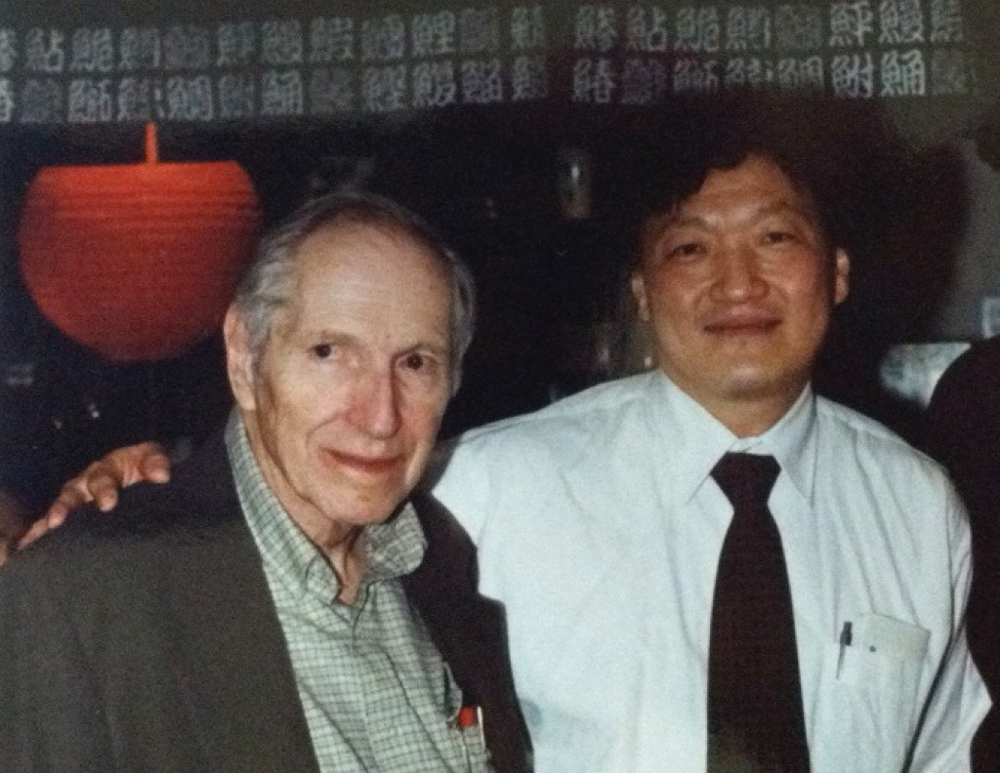

# Goertzel algorithm



Gerald Goertzel with his mentee Jack Lee at IBM Research.

The algorithm was published in [An Algorithm for the Evaluation of Finite Trigonometric Series](http://www.jstor.org/stable/2310304), The American Mathematical Monthly, Vol. 65, No. 1 (Jan., 1958), pp. 34-35
by Gerald Goertzel (1919/08/18 – 2002/07/17), an American physicist and computer scientist, an employee of IBM's research division.

The algorithm performs a fast computation of the both real and imaginary Fourier transform coefficients for a single frequency, not for all frequencies as normal Discrete Fourier Transform would do.
An optimized (at expence of the phase information) version of the algorithm is commonly used in the Dual-Tone Multiple-Frequency estimation.

The details are described in [Digital Signal Processing and Applications with the TMS320C6713 and TMS320C6416 DSK](http://onlinelibrary.wiley.com/doi/10.1002/9780470238141.app6/pdf), Second Edition, ISBN 9780470138663, Wiley, 2008.

## First order Görtzel algorithm

Given an input sequence $x_n, n=0 \dots N-1$, the algorithm calculates the discrete Fourier transform coefficient $y_f$

$$y_f = \frac{1}{N} \sum\limits_{n = 0}^{N - 1}{x_n e^\frac{-j 2 \pi f n}{N}} \tag{1}$$

for the given frequency $f$ using an IIR filter with the transfer function 

$$H(z) = \frac{1}{1 - e^{j 2 \pi f} z^{-1}}$$

This transfer function corrsponds to the first order Görtzel algorithm.
We can derive a difference equation from this transfer function.

$$H(z) = \frac{Y_f(z)}{X(z)} = \frac{1}{1 - e^{j 2 \pi f} z^{-1}}$$

Hence,

$$(1 - e^{j 2 \pi f} z^{-1})Y_f(z) = X(z)$$

Taking the inverse z-transform gives a difference equation

$$y_f[n] - e^{j 2 \pi f} y_f[n-1] = x[n]$$

And, by solving for \(y[n]\)

$$y_f[n] = x[n] + e^{j 2 \pi f} y_f[n-1] \tag{3}$$

Why such a transfer function? Look at (1). Since

$$e^\frac{-j 2 \pi f n}{N} = (e^\frac{-j 2 \pi f}{N})^n$$

(1) can be rewritten as

$$y_f = \frac{1}{N} \sum\limits_{n = 0}^{N - 1}{x_n (e^\frac{-j 2 \pi f}{N})^n} \tag{2}$$

According to the Horners polynomial evaluation

$$a_1 x + a_2 x^2 + a_3 x^3 + ... = x(a_1 + x(a_2 + x(a_3 + ...)))$$

(2) can be written as polynomial

$$\begin{array}{l}
y_f = \frac{1}{N}(x_{0}(e^\frac{-j 2 \pi f}{N})^{0} + x_{1}(e^\frac{-j 2 \pi f}{N})^{1} + x_{2}(e^\frac{-j 2 \pi f}{N})^{2} + ... + x_{N-1}(e^\frac{-j 2 \pi f}{N})^{N-1}) =\\
= y_f = \frac{1}{N}(x_{0} + e^\frac{-j 2 \pi f}{N}(x_{1} + e^\frac{-j 2 \pi f}{N}(x_{2} + e^\frac{-j 2 \pi f}{N}( + ... + e^\frac{-j 2 \pi f}{N}x_{N-1}))))
\end{array}$$

If we put the last expression in a loop from right to left, we start with
$y_f = x_{N-1}$, then
$y_f = x_{N-2} + e^\frac{-j 2 \pi f}{N} y_f$, then
$y_f = x_{N-3} + e^\frac{-j 2 \pi f}{N} y_f$, then
$...$
$y_f = x_{1} + e^\frac{-j 2 \pi f}{N} y_f$, then
$y_f = x_{0} + e^\frac{-j 2 \pi f}{N} y_f$ and
$y_f = y_f / N$

This is pretty close to the difference equation (3) except that the loop indexing starts from the backside.
If we run from $0$ to $N-1$ in our loop, it makes no difference because the samples are still the same.
**THE SIGN OF EXPONENT IS NEGATIVE ???**

## Second order Görtzel algorithm
The first order Görtzel algorithm transfer function is

$$H(z) = \frac{1}{1 - e^{j 2 \pi f} z^{-1}}$$

Multiplying the numerator and denominator by conjugate of $1 - e^{j 2 \pi f} z^{-1}$
(recall that the complex conjugate $\overline{e^z} = e^{\overline{z}}$ and $\overline{a + j\cdot b} = a - j\cdot b$)

$$1 - \overline{e^{j 2 \pi f}} z^{-1} = 1 - e^{-j2 \pi f}z^{-1}$$

makes the denominator a real value (recall that according to the Euler's formula $e^{j\theta} = \cos \theta + j\sin \theta$
and, hence, $e^{j\theta} + e^{-j\theta} = 2\cos \theta$)

$$\begin{array}{l}
\frac{1 - e^{-j2 \pi f} z^{-1}}{(1 - e^{j2 \pi f} z^{-1})(1 - e^{-j2 \pi f} z^{-1})} =
\frac{1 - e^{-j2 \pi f} z^{-1}}{1 - e^{j2 \pi f} z^{-1} - e^{-j2 \pi f} z^{-1} + e^{-j2 \pi f} e^{j2 \pi f} z^{-1} z^{-1}} =\\
= \frac{1 - e^{-j2 \pi f} z^{-1}}{1 - (e^{j2 \pi f} + e^{-j2 \pi f}) z^{-1} + z^{-2}} =
\frac{1 - e^{-j2 \pi f} z^{-1}}{1 - 2\cos (2 \pi f) z^{-1} + z^{-2}}
\end{array}$$

and leads to the transfer function of the second order Görtzel algorithm

$$H(z) = \frac{1 - e^{-j2 \pi f} z^{-1}}{1 - 2\cos (2 \pi f) z^{-1} + z^{-2}}$$

Now we derive a difference equation from the transfer function.

$$H(z) = \frac{Y_f(z)}{X(z)} = \frac{1 - e^{-j2 \pi f} z^{-1}}{1 - 2 \cos (2 \pi f) z^{-1} + z^{-2}}$$

Hence,

$$(1 - 2\cos (2 \pi f) z^{-1} + z^{-2})Y_f(z) = (1 - e^{-j2 \pi f} z^{-1})X(z)$$

Taking the inverse z-transform gives a difference equation

$$y_f[n] - 2\cos (2 \pi f) y_f[n-1] + y_f[n-2] = x[n] - e^{-j2 \pi f} x[n-1]$$

And, by solving for $y[n]$

$$y_f[n] = x[n] - e^{-j2 \pi f} x[n-1] + 2\cos (2 \pi f) y_f[n-1] - y_f[n-2]$$

At first glance, the situation is not better because we still have to perform complex multiplications.
But let us split the transfer function into product of two ones, introducing an intermediate series $S(z)$

$$H(z) = \frac{Y_f(z)}{X(z)} = \frac{Y_f(z)}{S(z)} \frac{S(z)}{X(z)} = \frac{1 - e^{-j2 \pi f} z^{-1}}{1}\cdot \frac{1}{1 - 2 \cos (2 \pi f) z^{-1} + z^{-2}}$$

Hence,

$$\begin{array}{l}
(1 - 2 \cos(2 \pi f) z^{-1} + z^{-2})S(z) = X(z)\\
(1 - e^{-j2 \pi f} z^{-1})S(z) = Y_f(z)
\end{array}$$

Taking the inverse z-transform gives difference equations

$$\begin{array}{l}
s[n] - 2 \cos(2 \pi f) s[n-1] + s[n-2] = x[n]\\
s[n] - e^{-j2 \pi f} s[n-1] = y_f[n]
\end{array}$$

And, by solving them for $s[n]$ and $y[n]$

$$\begin{array}{l}
s[n] = x[n] + 2 \cos(2 \pi f) s[n-1] - s[n-2]\\
y_f[n] = s[n] - e^{-j2 \pi f} s[n-1]
\end{array}$$

Now the difference equation for $s[n]$ has only real coefficients, so in case of real input $x[n]$ we do not have to perform complex multiplications.
These two difference equations are commonly reffered to as "Görtzel algorithm".
In terms of DSP we can view them as a second order IIR filter followed by a FIR filter. 

## Pseudocode

Given: an input array `x[0,...,N-1]`, a frequency `f` to calculate a Fourier transform at,
and the sampling rate `sr`, the pseudocode may look like in the listing.

```c#
float ω = 2π * f / sr
float s0, s1 = 0, s2 = 0, cos0 = cos(ω), sin0 = sin(ω)
for i in [0, ..., N-1]
    s0 = x[i] + 2 * cos0 * s1 - s2
    s2 = s1
    s1 = s0
float yre = s1 - cos0 * s2
float yim = sin0 * s2
float cosN = cos(ω * (N-1))
float sinN = sin(ω * (N-1))

// real and imaginary part of Fourier coefficient
float re = cosN * yre + sinN * yim
float im = cosN * yim - sinN * yre

// spectral power at frequency f
float power = re * re + im * im</code></pre>
```

If we need only spectral power, the last part of the code can be optimized at expence of the phase information.

The expression for the power can be simplified (recall that $(a + b)^2=a^2 + 2ab + b^2$ and $sin^2 + cos^2 = 1$) as

$$\begin{array}{l}
re^2 + im^2 = (cosN y_{re} + sinN y_{im})^2 + (cosN y_{im} - sinN y_{re})^2 =\\
= cosN^2 y_{re}^2 + 2 cosN sinN y_{re} y_{im} + sinN^2 y_{im}^2 + cosN^2 y_{im}^2 - 2 cosN sinN y_{re} y_{im} + sinN^2 y_{re})^2 =\\
= cosN^2 (y_{re}^2 + y_{im}^2) + sinN^2 (y_{re}^2 + y_{im}^2) = (y_{re}^2 + y_{im}^2)(cosN^2 + sinN^2) = y_{re}^2 + y_{im}^2
\end{array}$$

Further,

$$\begin{array}{l}
y_{re}^2 + y_{im}^2 = (s_1 - cos0 s_2)^2 + sin0^2 s_2^2 = s_1^2 - 2 cos0 s_1 s_2 + (sin0^2 + cos0^2)s_2^2 =\\
= s_1^2 + s_2^2 - 2 cos0 s_1 s_2
\end{array}$$

The optimized code requires only one trigonometric function call and looks more elegant and much simpler.

```c#
float ω = 2π * f / sr
float s0, s1 = 0, s2 = 0, cos0 = cos(ω), cos02 = 2 * cos0
for i in [0, ..., N-1]
    s0 = x[i] + cos02 * s1 - s2
    s2 = s1
    s1 = s0

// spectral power at frequency f
float power = s1 * s1 + s2 * s2 - cos02 * s1 * s2</code></pre>
```
