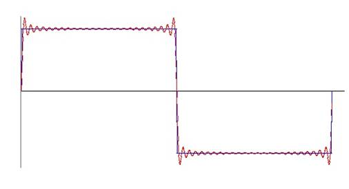

# Quick Fourier Transformation

- **Author:** Mosi_62
- **Published:** 2013
- **License:** The Code Project Open License (CPOL)
- **Category:** Algorithms & Recipes > Math
- **Original URL:** [http://www.codeproject.com/Articles/590638/Quick-Fourier-Transformation](http://www.codeproject.com/Articles/590638/Quick-Fourier-Transformation)
- **Archived URL:** [https://web.archive.org/web/20241118200238/https://www.codeproject.com/Articles/590638/Quick-Fourier-Transformation](https://web.archive.org/web/20241118200238/https://www.codeproject.com/Articles/590638/Quick-Fourier-Transformation)

> **Note:** The original URL `http://www.codeproject.com/Articles/590638/Quick-Fourier-Transformation` no longer exists. The link above points to the latest archived version on the Wayback Machine.

---

## Downloads

- [DFT](./DFT_std/)
- [DFT lean quick](./DFT_lean_quick/)
- [DFT lean](./DFT_lean/)

---

## Basic DFT algorithm with complex numbers

According to the main clause of Fourier a signal $f(n)$ that is periodic within $N$ and we have $N$ samples of it can be transformed into its Fourier components as follows:

$$F\{k\} = \sum_{n=0}^{N-1} \left( f(n) \cos\left(\frac{2\pi kn}{N}\right) + f_s(n) \sin\left(\frac{2\pi kn}{N}\right) \right)$$

with

$$f_{s,k} = \sum_{n=0}^{N-1} \left( f_s(n) \cos\left(\frac{2\pi kn}{N}\right) + f(n) \sin\left(\frac{2\pi kn}{N}\right) \right)$$

$$\delta_{k,N} = \sum_{n=0}^{N-1} \left( f(n) \sin\left(\frac{2\pi kn}{N}\right) \right)$$

Another equation for the complex Fourier components $c_k$ looks like

$$c_k = a_k + b_k$$

$$c_{k,s} = \sum_{n=0}^{N-1} \left( f_s(n) \cos\left(\frac{2\pi kn}{N}\right) \right)$$

and

$$w \cdot e^{j\frac{2\pi kn}{N}} : \left( \cos\left(\frac{2\pi kn}{N}\right) - j \cdot \sin\left(\frac{2\pi kn}{N}\right) \right)$$

That means the complex Fourier component $c_k$ is a complex sum of complex products of $f(n)$ and complex vectors spinning around the unit circle. For a complete Fourier transformation we would need $N$ Fourier components ($c_k$) and for each component we need $N$ products. That is $N^2$ products in total. Here is the code:

```csharp
public void CalcDFT(int N)
{
    int k, n;
    TKomplex w;
    if (N > 0)
    {
        for (k = 0; k < N; k++)
        {
            c[k].real = 0;
            c[k].imag = 0;
            for (n = 0; n < N; n++)
            {
                w.real = Math.Cos((double)(2.0 * Math.PI * (double)(k * n) / (double)(N)));
                w.imag = -Math.Sin((double)(2.0 * Math.PI * (double)(k * n) / (double)(N)));
                c[k] = ksum(c[k], kprod(w, y[n]));
            }
            c[k].real = c[k].real / (double)(N) * 2.0;
            c[k].imag = -c[k].imag / (double)(N) * 2.0;
        }
        c[0].real = c[0].real / 2;
        c[0].imag = c[0].imag / 2;
    }
}
```

Calculated by this standard implementation a Fourier transformation of 1000 samples took 140 ms on my computer (there are certainly faster computers on this world).

The source of this standard implementation can be found in the Visual C# project `DFT_std`.

`ksum()` and `kprod()` are simple functions for complex addition and multiplication:

```csharp
public TKomplex ksum(TKomplex a, TKomplex b)
{
    TKomplex res;
    res.real = a.real + b.real;
    res.imag = a.imag + b.imag;
    return (res);
}

public TKomplex kprod(TKomplex a, TKomplex b)
{
    TKomplex res;
    res.real = a.real * b.real - a.imag * b.imag;
    res.imag = a.real * b.imag + a.imag * b.real;
    return (res);
}
```

---

## Considerations about periodicity

Now, the sine and the cosine function both are periodic to $2\pi$ and for $k = 1$ we have to calculate both, sine and cosine for the values $0$ to $2\pi$ with step size $2\pi/N$. For $k = 2$ we have $0$ to $4\pi$ with step size $2/N$ and so on. So we get for $k = 2$ the same values as for $k = 1$ but with a step size twice as high. We can use this periodicity to build a look up table.

We build the look up table with:

```csharp
for (k = 1; k < N; k++)
{
    we[k].real = Math.Cos((2.0 * Math.PI * (double)(k) / (double)(N)));
    we[k].imag = -Math.Sin((2.0 * Math.PI * (double)(k) / (double)(N)));
}
```

And the corresponding sine and cosine values we can obtain from the look up table by a simple modulo division of $k \cdot n$ by $N$. Like this the discrete Fourier transformation becomes not "fast" but quite "quick" and lean:

```csharp
public void CalcDFT()   //  Quick and lean Fourier transformation
{
    int k, n;
    if (N > 0)
    {
        for (k = 0; k < N; k++)
        {
            c[k].real = 0;
            c[k].imag = 0;
            for (n = 0; n < (N - 1); n++)
            {
                c[k] = ksum(c[k], kprod(we[(k * n) % N], y[n]));
            }
            c[k].real = c[k].real / N * 2;
            c[k].imag = -c[k].imag / N * 2;
        }
        c[0].real = c[0].real / 2;
        c[0].imag = c[0].imag / 2;
    }
}
```

This implementation takes 53 ms for the same 1000 samples as the above mentioned. Quite a bit quicker.

The code to this implementation is in `DFT_lean`.

---

## Complex numbers?

Now there came some more considerations into my mind. In the main clause there are no complex numbers. The input is a sequence of real numbers (at least in my application coming from electric signal analysis) and we end up with another sequence of real numbers $a_k$ and $b_k$.

We have a complex multiplication and a complex addition in our algorithm. So let's have a look at them. First the multiplication, $we[x] \cdot y[n]$. That looks like:

```
(we[x].re * y[n].re - we[x].im * y[n].im) + j(we[x].re * y[n].im + we[x].im * y[n].re)
```

$y[n].im$ is always $0$ and therefore the second and the third part are also $0$ and our complex multiplication reduces to:

```
(we[x].re * y[n].re) + j(we[x].im * y[n].re)
```

And that means:

```
y[n].re * cosine(x) + j(y[n].re * sine(x))
```

That looks quite like $a_k$ and $b_k$ of the main clause. In the following addition we just have to sum the real parts and the imaginary parts. So there is no mixing of imaginary and real part in the complete calculation and finally we get the $a_k$ part in the real part and the $b_k$ part in the imaginary part.

With the limitation that the input sequence does not contain imaginary numbers we can implement the Fourier transformation without complex numbers:

```csharp
public void CalcDFT()
{
    int k, n;
    if (N > 0)
    {
        for (k = 0; k < N; k++)
        {
            a[k] = 0;
            b[k] = 0;
            for (n = 0; n < (N - 1); n++)
            {
                a[k] = a[k] + ((cosine[(k * n) % N] * y[n]));
                b[k] = b[k] + ((sine[(k * n) % N] * y[n]));
            }
            a[k] = a[k] / N * 2;
            b[k] = b[k] / N * 2;
        }
        a[0] = a[0] / 2;
        b[0] = b[0] / 2;
    }
}
```

The initialization becomes like this:

```csharp
public TFftAlgorithm(int order)
{
    int k;
    N = order;
    y = new double[N + 1];
    a = new double[N + 1];
    b = new double[N + 1];
    xw = new double[N + 1];
    sine = new double[N + 1];
    cosine = new double[N + 1];
    cosine[0] = 1.0;    // we don't have to calculate cos(0) = 1
    sine[0]   = 0;      //                        and sin(0) = 0
    for (k = 1; k < N; k++) //  init vectors of unit circle
    {
        cosine[k] = Math.Cos((2.0 * Math.PI * (double)(k) / (double)(N)));
        sine[k] = Math.Sin((2.0 * Math.PI * (double)(k) / (double)(N)));
    }
}
```

With this implementation the 1000 samples were transformed in 20 ms. That's almost 5 times quicker than the first implementation at the top of this article. It's not a fast Fourier transformation. But it's at least it's a quick Fourier transformation.

This implementation is in the project `DFT_lean_quick`.

With the rectangle signal the result should look like this:



The blue shape is the input sequence: A rectangle signal with 1000 samples. The magnitude is 20. The red shape is the inverse Fourier transformation with the first 30 Fourier components.

---

## License

This article, along with any associated source code and files, is licensed under [The Code Project Open License (CPOL)](http://www.codeproject.com/info/cpol10.aspx)

---

## Source Information

- **Original URL (defunct):** <http://www.codeproject.com/Articles/590638/Quick-Fourier-Transformation>
- **Archived URL:** <https://web.archive.org/web/20241118200238/https://www.codeproject.com/Articles/590638/Quick-Fourier-Transformation>

---

## BibTeX

```bibtex
@misc{quick_fourier_codeproject,
  author       = {{Mosi\_62}},
  title        = {Quick Fourier Transformation},
  year         = {2013},
  howpublished = {CodeProject},
  note         = {Accessed via Wayback Machine},
  url          = {https://web.archive.org/web/20241118200238/https://www.codeproject.com/Articles/590638/Quick-Fourier-Transformation},
  originalurl  = {http://www.codeproject.com/Articles/590638/Quick-Fourier-Transformation}
}
```
