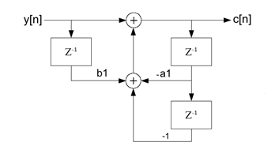
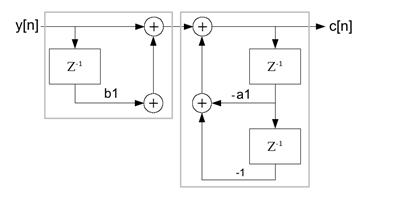
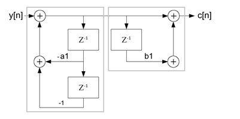
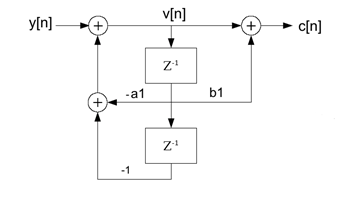

# Second Order Goertzel and Reinsch Algorithm

- **Author:** Mosi_62
- **Published:** 11 Nov 2014
- **License:** The Code Project Open License (CPOL)
- **Category:** Algorithms & Recipes > General Programming > Math
- **Original URL:** [http://www.codeproject.com/Articles/841228/Second-Order-Goertzel-and-Reinsch-Algorithm](http://www.codeproject.com/Articles/841228/Second-Order-Goertzel-and-Reinsch-Algorithm)
- **Archived URL:** [https://web.archive.org/web/20241115071118/http://www.codeproject.com/Articles/841228/Second-Order-Goertzel-and-Reinsch-Algorithm](https://web.archive.org/web/20241115071118/http://www.codeproject.com/Articles/841228/Second-Order-Goertzel-and-Reinsch-Algorithm)

> **Note:** The original URL `http://www.codeproject.com/Articles/841228/Second-Order-Goertzel-and-Reinsch-Algorithm` no longer exists. The link above points to the latest archived version on the Wayback Machine.

---

## Downloads

- [DFT_Reinsch (41.2 KB)](./DFT_Reinsch/)
- [DFT_Goerzel_2 (40.9 KB)](./DFT_Goerzel_2/)

---

## Second Order Görtzel Algorithm

There are many descriptions about the second order Goertzel algorithm to be found in the net. But most of them do not explain its derivation in full. There is always the same part missing. So I try to explain the missing part here.

The second order Goertzel algorithm is based on the transfer function of the first order Goertzel algorithm:

$$H(z) = \frac{1}{1 + a_1 \cdot z^{-1}}$$

with:

$$a_1 = -e^{\frac{j2k\pi}{N}}$$

Multiplying the numerator and denominator by $1 + \overline{a_1} \cdot z^{-1}$ makes the denominator a real value and leads to:

$$H(z) = \frac{1 - e^{\frac{-j2k\pi}{N}} \cdot z^{-1}}{1 - 2 \cdot \cos\left(\frac{2k\pi}{N}\right) \cdot z^{-1} + z^{-2}}$$

And from this to the difference equation:

```
c[n] + a1 * c[n-1] + c[n-2] = y[n] + b1 * y[n-1]
```

with:

```
a1 = -2 cos(2kπ/N) and b1 = -exp(-j2kπ/N)
```

For a long time, I was wondering why they are doing this. The difference equation looks much more complicated now. But there is some advantage at the end.

Here, all the explanations now say: "As we are only interested in c[n], we can leave the complex multiplication $b_1 \cdot y[n-1]$ till the end of the calculation and have to carry it out only once at the end"…

The big step lays in the signal path. The signal path to the difference equation further above looks like:



If we would implement this, it would be something like:

```
c[n] = y[n] + b1 * y[n-1] - a1 * c[n-1] - c[n-2]
```

…put into a loop and in each cycle, the complex multiplication $b_1 \cdot y[n-1]$ and due to that, the whole calculation has to be carried out complex. Much more calculation effort than required in the first order algorithm.

The signal path can be drawn like this:



Now, we have two independent transfer functions and these two functions can be switched without influencing the resulting transfer function.



And be put together again. This form is called the direct form II of the signal path and looks much better. The feedback part is now at the beginning of the function.



This put into code, we get:

```
v[n] = y[n] – a1 * v[n-1] – v[n-2]
```

for the left feedback part,

and:

```
c[n] = v[n] + b1 * v[n-1]
```

for the right feed forward part.

That's the big benefit. The rather complicated difference equation leads to a very short and quick algorithm just by changing the drawing of the signal path. A very impressive interaction of Mathematics and Informatics.

The feedback part has to be implemented in a loop running through all the samples of y. That means from $0$ to $N-1$.

```csharp
for (n = 0; n < N; n++)
{
    v0.real = y[n].real - a1.real * v1.real - v2.real;
    v2 = v1;
    v1 = v0;
}
```

I used complex data types because at the end we have complex numbers.

The right part needs to be calculated only once at the end of the calculation (and it has nothing to do with the fact that we are looking for c[n] only?). Basically the right part contains the complex multiplication:

```
c[k].real = (v0.real + b1.real * v2.real);
```

As $v[n]$ is a real value and has no imaginary part. The calculation for the imaginary part $c[k].imag$ becomes a bit shorter:

```
c[k].imag = -(b1.imag * v1.real);
```

And finally both values have to be divided by $N$ because of:

$$c_k = \frac{1}{N} \sum_{n=0}^{N-1} \left( f(n) e^{\frac{-j2\pi kn}{N}} \right)$$

With this, the sequence for all the Fourier components $a[0]$ to $a[N-1]$ and $b[0]$ to $b[N-1]$ is:

```csharp
for (k = 0; k < N; k++)
{
    v0.real = 0;
    v0.imag = 0;
    v1.real = y[1].real;
    v1.imag = y[1].imag;
    v2.real = y[0].real;
    v2.imag = y[0].imag;
    b1.real = -Math.Cos((double)(2.0 * Math.PI * (double)(k) / (double)(N)));
    b1.imag = Math.Sin((double)(2.0 * Math.PI * (double)(k) / (double)(N)));
    a1.real = -2 * Math.Cos((double)(2.0 * Math.PI * (double)(k) / (double)(N)));
    a1.imag = 0;
    for (n = 0; n < N; n++)
    {
        v0.real = y[n].real - a1.real * v1.real - v2.real;
        v2 = v1;
        v1 = v0;
    }
    c[k].real = (v0.real + b1.real * v2.real);
    c[k].imag = -(b1.imag * v1.real);
    c[k].real /= (double)(N);
    c[k].imag /= (double)(N);
}
```

Implemented like this, the second order Goertzel algorithm is a very fast way to carry out a Discrete Fourier transformation. On my computer, the test application with 1000 samples takes 8 ms. A standard FFT takes 12 ms.

Regarding stability, I read the Reinsch algorithm is an improved version of the second order Görtzel algorithm and it would be stable. So, I implemented this one too for comparison.

---

## Reinsch Algorithm

The Reinsch algorithm is a modified Görtzel algorithm.

For $\cos(2\pi k/N) > 0$ Reinsch takes the part:

```
v[n] = y[n] - a1 * v[n-1] - v[n-2]
```

and says for the difference between $v[n] – v[n-1]$:

```
v[n] - v[n-1] = y[n] - a1 * v[n-1] - v[n-2] - v[n-1]
```

he expands this equation by $+2 \cdot v[n-1]$ and $-2 \cdot v[n-1]$ and as $a_1 = -2\cos(2\pi k/N)$, he gets:

```
v[n] - v[n-1] = y[n] + (2cos(2πk/N) - 2) * v[n-1] + v[n-1] - v[n-2]
```

Now there are two substitutions:

```
(2cos(2πk/N) - 2) = -4 * sin(πk/N)²
```

And with $v[n] – v[n-1] = dv[n]$, the last two terms $v[n-1] – v[n-2] = dv[n-1]$,

we get:

```
dv[n] = y[n] - 4 * sin(πk/N)² * v[n-1] + dv[n-1]
```

and finally for $v[n]$:

```
v[n] = dv[n] + v[n-1]
```

This is a loop with $dv[n]$ as feedback part and looks like:

```csharp
a1.real = -4 * Math.Pow(Math.Sin((double)(Math.PI * (double)(k) / (double)(N))), 2.0);
a1.imag = 0;
we[k] = a1.real;
for (n = 0; n < N; n++)
{
    dW = y[n].real + a1.real * v1.real + dW;
    v0.real = dW + v1.real;
    v1 = v0;
}
c[k].real = (dW - a1.real / 2.0 * v0.real) / (double)(N) * 2.0;
c[k].imag = (b1.imag * v1.real) / (double)(N) * 2.0;
```

For $\cos(2\pi k/N) \geq 0$ Reinsch takes the sum instead of the difference:

```
v[n] + v[n-1] = y[n] - a1 * v[n-1] - v[n-2] + v[n-1]
```

and gets:

```
(2cos(2πk/N) + 2) = 4 * cos(πk/N)²
```

and:

```
v[n] = dv[n] - v[n-1]
```

and that's like:

```csharp
a1.real = 4 * Math.Pow(Math.Cos((double)(Math.PI * (double)(k) / (double)(N))), 2.0);
a1.imag = 0;
we[k] = a1.real;
for (n = 0; n < N; n++)
{
    dW = y[n].real + a1.real * v1.real - dW;
    v0.real = dW - v1.real;
    v1 = v0;
}
c[k].real = (dW - a1.real / 2.0 * v0.real) / (double)(N) * 2.0;
c[k].imag = (b1.imag * v1.real) / (double)(N) * 2.0;
```

So I could compare these two algorithms and that was a bit disappointing.

The instability of the Görtzel algorithm was caused by extinction of numbers after floating point in earlier time. That could have happened if the whole algorithm was implemented with `float` variables which is not done anymore today. With `double` variables, both algorithms have the same accuracy.

The second order Goertzel algorithm is a very quick thing but it has its disadvantages. Regarding accuracy, the same is valid for the Reinsch algorithm. I made a bit a quicker implementation of the Discrete Fourier transformation which can be found here:

[http://www.codeproject.com/Articles/590638/Quick-Fourier-Transformation](http://www.codeproject.com/Articles/590638/Quick-Fourier-Transformation)

That could be a good alternative.

But nevertheless, the second order Görtzel as well as the Reinsch algorithm, both are very sophisticated algorithms and both are a big effort in mathematics and informatics.

---

## License

This article, along with any associated source code and files, is licensed under [The Code Project Open License (CPOL)](http://www.codeproject.com/info/cpol10.aspx)

---

## Source Information

- **Original URL (defunct):** <http://www.codeproject.com/Articles/841228/Second-Order-Goertzel-and-Reinsch-Algorithm>
- **Archived URL:** <https://web.archive.org/web/20241115071118/http://www.codeproject.com/Articles/841228/Second-Order-Goertzel-and-Reinsch-Algorithm>

---

## BibTeX

```bibtex
@misc{goertzel_reinsch_codeproject,
  author       = {{Mosi\_62}},
  title        = {Second Order Goertzel and Reinsch Algorithm},
  year         = {2014},
  month        = nov,
  howpublished = {CodeProject},
  note         = {Accessed via Wayback Machine},
  url          = {https://web.archive.org/web/20241115071118/http://www.codeproject.com/Articles/841228/Second-Order-Goertzel-and-Reinsch-Algorithm},
  originalurl  = {http://www.codeproject.com/Articles/841228/Second-Order-Goertzel-and-Reinsch-Algorithm}
}
```
