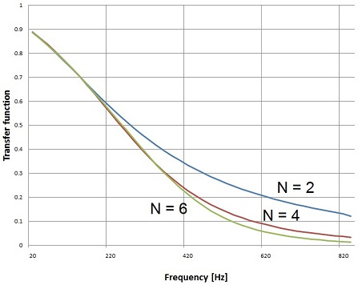
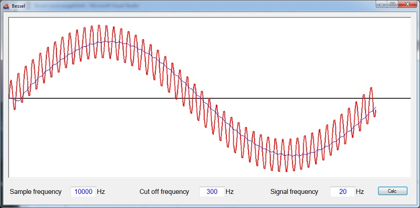

# Bessel Low Pass Filter

- **Author:** H.P. Moser
- **Source:** [https://www.mosismath.com/DigitalSignal/Bessel.html](https://www.mosismath.com/DigitalSignal/Bessel.html)

---

## Introduction

The Bessel filter was invented by the German mathematician Friedrich Bessel (1784–1846). It is a filter type that offers an optimized transfer function for a rectangular signal. It shows a maximally flat group/phase delay (see [Bessel filter on Wikipedia](https://en.wikipedia.org/wiki/Bessel_filter)). This is achieved by the transfer function:

$$H(s) = \frac{a_0}{B_n(s)}$$

With a so called Bessel polynomial in the denominator with:

$$B_n(s) = \sum_{k=0}^{n} a_k s^k$$

and:

$$a_k = \frac{(2n-k)!}{2^{n-k} k! (n-k)!}$$

The enumerator and $a_0$ are always 1.

## Transfer Function

With this the transfer function in $s$ for a low pass Bessel filter for the order 1 to 4 looks like:

$$H_1(s) = \frac{1}{s + 1}$$

$$H_2(s) = \frac{3}{s^2 + 3s + 3}$$

$$H_3(s) = \frac{15}{s^3 + 6s^2 + 15s + 15}$$

$$H_4(s) = \frac{105}{s^4 + 10s^3 + 45s^2 + 105s + 105}$$

That can be done in a small function:

```csharp
public void CalcBesselPolynom(int n)
{
    int i;
    a_s = new double[n+1];
    for(i = 0; i <= n; i++)
    {
        a_s[n - i] = Fact(2 * n - i) / Math.Pow(2.0, n - i) / Fact(n - i) / Fact(i);
    }
    for (i = 0; i <= n ; i++)
    {
        a_s[i] = a_s[i] / a_s[n];
    }
}
```

This function calculates the Bessel polynomial backward. I switch the direction of the polynomials the way that the first element has the highest power for $s$. It is a bit easier to implement the polynomial multiplication like this.

So my transfer function looks like:

$$H(s) = \frac{1}{\sum_{k=0}^{n} a_k \left(\frac{s}{2\pi f_c}\right)^k}$$

This transfer function must be converted into the transfer function in the z domain which is done by the bilinear transformation (see [Digital filter design](https://www.mosismath.com/DigitalSignal/BasicFilter.html)):

$$s = \frac{2}{T} \cdot \frac{z - 1}{z + 1}$$

with:

$$T = \frac{1}{f_s}$$

And $f_c$ = cut off frequency of the filter and $f_s$ = sampling frequency. This could be done manually of course. But an algorithm can do that automatically.

Therefore I rewrote the transfer function to:

$$H(s) = \frac{1}{\sum_{k=0}^{n} a_k \left(\frac{s}{2\pi f_c}\right)^k}$$

And with the bilinear transformation:

$$H(z) = \frac{1}{\sum_{k=0}^{n} a_k \left(\frac{2}{T} \cdot \frac{z - 1}{z + 1}\right)^k}$$

In this equation we have to get rid of the fraction in the denominator. Therefore each element of the sum must be extended by $(z + 1)^{n-k}$ and the enumerator becomes $(z + 1)^n$.

$$H(z) = \frac{(z + 1)^n}{\sum_{k=0}^{n} a_k \left(\frac{2}{T}\right)^k (z - 1)^k (z + 1)^{n-k}}$$

Now in the Bessel filter there comes a magic correction factor. The -3 dB frequency is shifted to some higher value when the order of the filter gets higher in the Bessel filter. Therefore there is a correction to be done like:

$$f_{corr} = f_c \cdot \frac{1}{\sqrt{\ln(2)}}$$

and:

$$T^* = \frac{2\pi f_{corr}}{f_s}$$

The transformation into the z domain I implemented with a list of double arrays to have the possibility to grow the arrays dynamically:

```csharp
public List<double[]> aa = new List<double[]>();
```

The only disadvantage of this approach is that I cannot modify one single element of this list. So I have to remove the element from the list and replace it by the modified one. That looks like:

```csharp
double[] tempA = new double[2];
tempA[0] = 1.0;
tempA[1] = 1.0;
for (i = 0; i <= order; i++)
{
    double[] tempEl = aa.ElementAt(i);
    tempEl = Poly.Mult(Poly.Power(tempA, i), Poly.Power(tempEl, order - i));
    tempEl = Poly.Mult(tempEl, a_s[i] * Math.Pow(2.0 / tc, order - i));
    aa.RemoveAt(i);
    aa.Insert(i, tempEl);
}
```

That gives a polynomial in $z$ for each $a_k$. These polynomials must be added together to one polynomial containing the elements $a_i$ for each $z^k$ of the transfer function:

$$a_z[i] = \sum_{j=0}^{n} aa[j][i]$$

That's done with:

```csharp
for (i = 0; i <= order; i++)
{
    a_z[i] = 0;
    for (j = 0; j <= aa.Count-1; j++)
        a_z[i] = a_z[i] + aa.ElementAt(j)[i];
}
```

Now the array $a_z$ contains the elements $a_i$.

The elements $b_i$ must be computed as well:

```csharp
tempA[0] = 1.0;
tempA[1] = 1.0;
b_z = Poly.Power(tempA, order);
```

and finally we need to have $a_0 = 1$ and therefore each element must be divided by $a_0$:

```csharp
for (i =0; i < b_z.Length; i++)
{
    b_z[i] = b_z[i] / a_z[0];
}
for (i = order; i >= 0; i--)
{
    a_z[i] = a_z [i] / a_z [0];
}
```

After this $a_z$ and $b_z$ contain the filter parameters:

$$H(z) = \frac{b_0 + b_1 z^{-1} + \ldots + b_N z^{-N}}{a_0 + a_1 z^{-1} + \ldots + a_N z^{-N}}$$

In the literature this function usually looks like:

$$H(z) = \frac{\sum_{k=0}^{M} b_k z^{-k}}{\sum_{k=0}^{N} a_k z^{-k}}$$

As $M = N$ here that's no difference for the implementation. Just divide the enumerator and denominator by $z^N$. The $a$ and $b$ parameters remain the same and they can be used as they are.

## Filter Sequence

The formulation for the filter sequence is:

$$y\_out[n] = \sum_{k=0}^{M} b_k \cdot y\_in[n-k] - \sum_{k=1}^{N} a_k \cdot y\_out[n-k]$$

(and here $M = N$) This formulation says that the last $M-1$ elements of the output data are used. These values are not available in the beginning. Therefore the first $N$ elements of the output must be treated differently like:

```csharp
for (i = 0; i < order; i++)
{
    y_out[i] = 0;
    for (j = 0; j <= i; j++)
    {
        y_out[i] = y_out[i] + y_in[i-j] * zb[j];
    }
    for (j = 1; j <= i; j++)
    {
        y_out[i] = y_out[i] - y_out[i-j] * za[j];
    }
}
```

And the rest:

```csharp
for (i = order; i < datapoints; i++)
{
    y_out[i] = 0;
    for (j = 0; j <= order; j++)
    {
        y_out[i] = y_out[i] + y_in[i - j] * zb[j];
    }
    for (j = 1; j <= order; j++)
    {
        y_out[i] = y_out[i] - y_out[i - j] * za[j];
    }
}
```

## Example Results

A Bessel filter of 2nd, 4th or 6th order with the cut off frequency of 300 Hz produces this transfer function:



The jump from 4th to 6th order seems not to be too big in the steepest area both orders are almost equal and the filter principally has a rather flat transfer function but if we look at a (red) signal of 20 Hz with a noise frequency of 1000 Hz like:



The Bessel filter of 4th order and cut off frequency 300 Hz almost removes this noise fully (blue curve). That looks quite cool.

---

## C# Demo Project Bessel Filter

- [Bessel.zip](Bessel/)

---

## Source Information

- **Source URL:** <https://www.mosismath.com/DigitalSignal/Bessel.html>

---

## BibTeX

```bibtex
@misc{moser_bessel_mosismath,
  author       = {{H.P. Moser}},
  title        = {Bessel Low Pass Filter},
  year         = {2013},
  howpublished = {mosismath.com},
  url          = {https://www.mosismath.com/DigitalSignal/Bessel.html}
}
```
