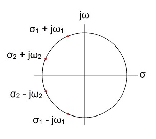
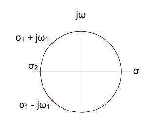
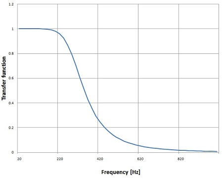
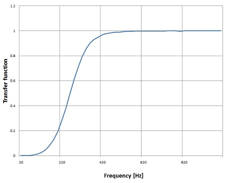
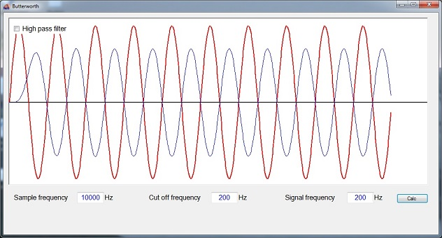

# Butterworth Filter

- **Author:** H.P. Moser
- **Source:** [https://www.mosismath.com/DigitalSignal/Butterworth.html](https://www.mosismath.com/DigitalSignal/Butterworth.html)

---

## Low Pass Filter

The Butterworth low pass filter is a filter type with a constant transfer function in the passband and stopband. Its transfer function decreases monotone for an increasing $f$ and its slope is $-20N$ dB/decade. For $f = 0$ the transfer function returns 1:

$$|H(j\omega)| = \frac{1}{\sqrt{1 + \left(\frac{\omega}{\omega_c}\right)^{2N}}}$$

The general transfer function of the low pass Butterworth filter looks like:

$$H(s) = \frac{1}{B_N(s)}$$

The poles of this transfer function are complex:

$$s_k = -\sin\left(\frac{(2k-1)\pi}{2N}\right) + j\cos\left(\frac{(2k-1)\pi}{2N}\right), \quad k = 1, 2, \ldots, N$$

In the literature there is often a form like:

$$H(s) = \frac{1}{\prod_{k=1}^{N} (s - s_k)}$$

used for the transfer function. That comes from the fact that the poles are always conjugate complex. The poles are lying on the left side of a circle like:



And we always have conjugate complex pairs. Here for instance for $N = 4$:

$$s_{1,2} = -\sin\left(\frac{\pi}{8}\right) \pm j\cos\left(\frac{\pi}{8}\right)$$

$$s_{3,4} = -\sin\left(\frac{3\pi}{8}\right) \pm j\cos\left(\frac{3\pi}{8}\right)$$

these pairs are multiplied together like:

$$(s - s_1)(s - s_2) = s^2 + 2\sin\left(\frac{\pi}{8}\right)s + 1$$

and here we have:

$$\sin\left(\frac{\pi}{8}\right) = \frac{\sqrt{2 - \sqrt{2}}}{2}$$

and so:

$$(s - s_1)(s - s_2) = s^2 + \sqrt{2 - \sqrt{2}} \cdot s + 1$$

with:

$$a_1 = 2\sin\left(\frac{\pi}{8}\right)$$

$$a_2 = 1$$

If $N$ is odd we get a little different situation:



One pole is pure real here and we get:

$$H(s) = \frac{1}{(s + 1) \prod_{k=1}^{(N-1)/2} (s^2 + 2\sin\left(\frac{(2k-1)\pi}{2N}\right)s + 1)}$$

with:

$$a_1 = 2\sin\left(\frac{\pi}{2N}\right)$$

$$a_2 = 1$$

With this the transfer function in $s$ for a low pass Butterworth filter for the order 1 to 4 looks like:

$$H_1(s) = \frac{1}{s + 1}$$

$$H_2(s) = \frac{1}{s^2 + \sqrt{2}s + 1}$$

$$H_3(s) = \frac{1}{(s + 1)(s^2 + s + 1)}$$

$$H_4(s) = \frac{1}{(s^2 + 0.7654s + 1)(s^2 + 1.8478s + 1)}$$

These parameters are independent on $f_s$ and $f_c$. They depend only on the order of the filter.

Implemented in a C# function that would be:

```csharp
public void CalcButterworth(int order)
{
    int i = 1;
    double[] poly = new double[3];
    double[] poly2 = new double[2];
    poly[0] = 1.0;

    if (order % 2 == 0)
    {
        poly[2] = 1.0;
        for (i = 1; i <= order / 2; i++)
        {
            poly[1] = 2.0 * Math.Cos((2 * i - 1) * Math.PI / 2 / order);
            a_s = Poly.Mult(a_s, poly);
        }
    }
    else
    {
        poly2[0] = 1.0;
        poly2[1] = 1.0;
        a_s = Poly.Mult(a_s, poly2);
        poly[2] = 1.0;
        for (i = 2; i <= (order + 1) / 2; i++)
        {
            poly[1] = 2.0 * Math.Cos((i - 1) * Math.PI / order);
            a_s = Poly.Mult(a_s, poly);
        }
    }
}
```

This function calculates the denominator of the transfer function in the Laplace domain and puts it the array $a_s$. This transfer function must be transformed into the z domain. There the frequencies get into the game. The transformation is done, the same way I did it in [Digital filter design](https://www.mosismath.com/DigitalSignal/BasicFilter.html), by a bilinear transformation with:

$$s = \frac{2}{T} \cdot \frac{z - 1}{z + 1}$$

and:

$$T = \frac{1}{f_s}$$

with $f_c$ = cut off frequency of the filter and $f_s$ = sampling frequency:

$$H(z) = H(s) \bigg|_{s = \frac{2}{T} \cdot \frac{z - 1}{z + 1}}$$

The function for this transformation is more or less the same as I used it in the Bessel filter:

```csharp
public void TransformToZPlane()
{
    int i, j;
    double[] tempA = new double[2];
    List<double[]> aa = new List<double[]>();
    for (i = 0; i <= order; i++)
    {
        aa.Add(new double[] { 1, -1 });
    }
    tempA[0] = 1;
    tempA[1] = 1;
    b_z = Poly.Power(tempA, order);
    for (i = 0; i <= order; i++)
    {
        double[] tempEl = aa.ElementAt(i);
        tempEl = Poly.Mult(Poly.Power(tempA, i), Poly.Power(tempEl, order - i));
        tempEl = Poly.Mult(tempEl, a_s[i] * Math.Pow(2.0 / tc, order - i));
        aa.RemoveAt(i);
        aa.Insert(i, tempEl);
    }
    for (i = 0; i <= order; i++)
    {
        a_z[i] = 0;
        for (j = 0; j <= order; j++)
            a_z[i] = a_z[i] + aa.ElementAt(j)[i];
    }
    for (i =0; i < b_z.Length; i++)
    {
        b_z[i] = b_z[i] / a_z[0];
    }
    for (i = order; i >= 0; i--)
    {
        a_z[i] = a_z[i] / a_z[0];
    }
}
```

This function computes the transfer function in the z plane and puts it into the arrays $a_z$ and $b_z$.

I initialize the parameters like:

```csharp
public int order = 4;
double fs = 10000.0;
double fc = 300.0;
```

and with these I get the transfer function:



With quite a steep slope.

## High Pass Filter

The transformation of the low pass filter into a high pass filter is done by a so called low-pass to high-pass transformation. That just means to replace $s$ by $1/s$ in the Laplace domain. In the transfer function like:

$$H_{LP}(s) = \frac{1}{\sum_{k=0}^{N} a_k s^k}$$

That is:

$$H_{HP}(s) = \frac{1}{\sum_{k=0}^{N} a_k \left(\frac{1}{s}\right)^k}$$

or without compound fraction:

$$H_{HP}(s) = \frac{s^N}{\sum_{k=0}^{N} a_k s^{N-k}}$$

In the implementation that means I would have to switch the direction of the elements of my denominator polynomial. But as the Butterworth always has symmetric elements in the denominator I can leave that and need just to add the $s^N$ in the enumerator. This can be done in the transformation from Laplace to z domain. The following modification in the function `TransformToZPlane()` does this:

```csharp
public void TransformToZPlane(bool bHighPass)
{
    int i, j;
    double[] tempA = new double[2];

    tempA[0] = 1;
    if (bHighPass)
    {
        tempA[1] = -1;
        b_z = Poly.Power(tempA, order);
        b_z = Poly.Mult(b_z, Math.Pow(2.0 / tc, order));
    }
    else
    {
        tempA[1] = 1;
        b_z = Poly.Power(tempA, order);
    }
    tempA[1] = 1;
    // ... rest of the function
}
```

With this small modification the filter can work as high pass filter as well and shows a transfer function of:



## Sample Project

The demo project consists of one main window. It processes a short sample signal (red curve) and displays the filtered signal (blue curve). The cut off frequency, sampling frequency and signal frequency can be set and in the left upper corner of the graphic is a checkbox where high or low pass behaviour can be selected.



---

## C# Demo Project Butterworth Filter

- [Butterworth.zip](Butterworth/)

A online solver in JavaScript, that returns the filter parameters, can be found on [Butterworth filter](https://www.mosismath.com/Solver/Butterworth.html)

---

## Source Information

- **Source URL:** <https://www.mosismath.com/DigitalSignal/Butterworth.html>

---

## BibTeX

```bibtex
@misc{moser_butterworth_mosismath,
  author       = {{H.P. Moser}},
  title        = {Butterworth Filter},
  year         = {2013},
  howpublished = {mosismath.com},
  url          = {https://www.mosismath.com/DigitalSignal/Butterworth.html}
}
```
