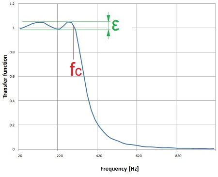
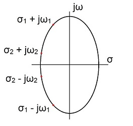
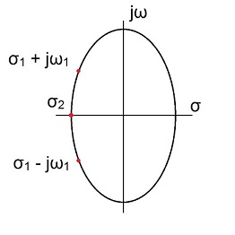
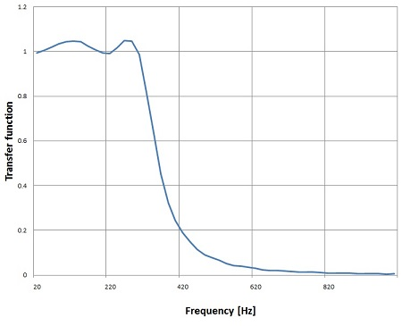
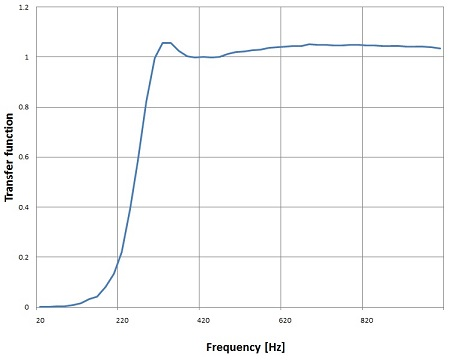
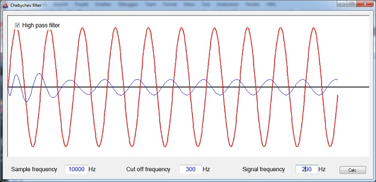

# Chebychev Filter

- **Author:** H.P. Moser
- **Source:** [https://www.mosismath.com/DigitalSignal/Chebychev.html](https://www.mosismath.com/DigitalSignal/Chebychev.html)

---

## Low Pass Chebychev Filter

There are 2 types of Chebychev filters: Type 1 (the one that is covered in this article) is a filter type that allows some ripple $\varepsilon$ in the pass band and therefore reaches a very steep slope towards the stop band. The transfer function of a Chebychev low pass filter of 4th order looks like:



(Type 2 is the filter type that has some ripple in the stop band)

This steep slope is achieved by the transfer function:

$$H(s) = \frac{1}{\varepsilon^2 T_N^2\left(\frac{s}{\omega_c}\right) + 1}$$

With $T_N(x)$ as a Chebyshev polynomial (see [Integration by the use of Legendre or Chebychev polynomials](https://www.mosismath.com/Integration/Legendre.html)) and $\varepsilon$ as the ripple factor.

The Chebychev polynomial can be expressed as:

$$T_N(x) = \cos(N \cdot \arccos(x))$$

Now, to implement a digital filter the above formulation must be transformed into a form like:

$$H(s) = \frac{1}{\prod_{k=1}^{N} (s - s_k)}$$

And therefore Chebychev first calculates the poles of his transfer function:

$$s_k = -\sinh(\nu) \cdot \sin\left(\frac{(2k-1)\pi}{2N}\right) + j\cosh(\nu) \cdot \cos\left(\frac{(2k-1)\pi}{2N}\right)$$

They are there where:

$$s_k = -\sinh(\nu) \cdot \sin\left(\frac{(2k-1)\pi}{2N}\right) + j\cosh(\nu) \cdot \cos\left(\frac{(2k-1)\pi}{2N}\right)$$

This is a complex equation and it has the solution:

$$s_k = \sigma_k + j\omega_k$$

with:

$$\sigma_k = -\sinh(\nu) \cdot \sin\left(\frac{(2k-1)\pi}{2N}\right)$$

$$\omega_k = \cosh(\nu) \cdot \cos\left(\frac{(2k-1)\pi}{2N}\right)$$

And with this the transfer function becomes:

$$H(s) = \frac{V}{\prod_{k=1}^{N} (s - s_k)}$$

With $V$ as an amplification factor that has to be determined as next step. To do this we have to distinguish between the cases $N$ is odd and $N$ is even.

## Even Order Case

If $N$ is even and we insert the Chebychev polynomial of an even order we get the transfer function:

$$H(s) = \frac{V}{\prod_{k=1}^{N/2} \left(s^2 + 2\sigma_k s + \sigma_k^2 + \omega_k^2\right)}$$

If $s = 0$ this equation is:

$$H(0) = \frac{V}{\prod_{k=1}^{N/2} \left(\sigma_k^2 + \omega_k^2\right)}$$

But the transfer function we got with our poles gives for $s = 0$:

$$H(0) = \frac{1}{\sqrt{1 + \varepsilon^2}}$$

That means $V$ must be:

$$V = \frac{\prod_{k=1}^{N/2} \left(\sigma_k^2 + \omega_k^2\right)}{\sqrt{1 + \varepsilon^2}}$$

If $N$ is even.

## Odd Order Case

If $N$ is odd we have:

$$H(s) = \frac{V}{(s + \sigma_0) \prod_{k=1}^{(N-1)/2} \left(s^2 + 2\sigma_k s + \sigma_k^2 + \omega_k^2\right)}$$

And if $s = 0$:

$$H(0) = \frac{V}{\sigma_0 \prod_{k=1}^{(N-1)/2} \left(\sigma_k^2 + \omega_k^2\right)}$$

And so:

$$V = \frac{\sigma_0 \prod_{k=1}^{(N-1)/2} \left(\sigma_k^2 + \omega_k^2\right)}{1}$$

## Final Transfer Functions

So, if $N$ is even the final transfer function becomes:

$$H(s) = \frac{V}{\prod_{k=1}^{N/2} \left(s^2 + 2\sigma_k s + \sigma_k^2 + \omega_k^2\right)}$$

and if $N$ is odd:

$$H(s) = \frac{V}{(s + \sigma_0) \prod_{k=1}^{(N-1)/2} \left(s^2 + 2\sigma_k s + \sigma_k^2 + \omega_k^2\right)}$$

This part with the amplification is often missing in the literature. There they describe an algorithm which is not really correct and finally feed everything into MATLAB…And MATLAB just solves the problem.

In the literature there is often a form like:

$$H(s) = \frac{1}{\prod_{k=1}^{N} (s - s_k)}$$

Used for the transfer function. That comes from the fact that the poles are always conjugate complex. The poles are lying on the left side of an ellipse like:



and we always have conjugate complex pairs. Here for instance for $N = 4$:

$$s_{1,2} = -\sinh(\nu) \cdot \sin\left(\frac{\pi}{8}\right) \pm j\cosh(\nu) \cdot \cos\left(\frac{\pi}{8}\right)$$

$$s_{3,4} = -\sinh(\nu) \cdot \sin\left(\frac{3\pi}{8}\right) \pm j\cosh(\nu) \cdot \cos\left(\frac{3\pi}{8}\right)$$

and these pairs are multiplied together like:

$$(s - s_1)(s - s_2) = s^2 + 2\sinh(\nu) \cdot \sin\left(\frac{\pi}{8}\right) s + \sinh^2(\nu) \cdot \sin^2\left(\frac{\pi}{8}\right) + \cosh^2(\nu) \cdot \cos^2\left(\frac{\pi}{8}\right)$$

and so:

$$a_1 = 2\sinh(\nu) \cdot \sin\left(\frac{\pi}{8}\right)$$

$$a_2 = \sinh^2(\nu) \cdot \sin^2\left(\frac{\pi}{8}\right) + \cosh^2(\nu) \cdot \cos^2\left(\frac{\pi}{8}\right)$$

If $N$ is odd we get a little different situation like:



One pole is pure real here and we get:

$$H(s) = \frac{V}{(s + \sigma_0) \prod_{k=1}^{(N-1)/2} \left(s^2 + 2\sigma_k s + \sigma_k^2 + \omega_k^2\right)}$$

and:

$$\sigma_0 = -\sinh(\nu)$$

For both even $N$ and odd $N$.

## C# Implementation

This finally implemented in a C# function is:

```csharp
public void CalcChebychev(int order, double t)
{
    int i = 1;
    double[] poly = new double[3];
    double[] poly2 = new double[2];
    double nu = Math.Log(1.0 / e + Math.Sqrt(1.0 / e * e + 1.0)) / order;
    double sigma;
    double omega;
    a_s = new double[1];
    a_s[0] = 1.0;
    b_s = 1.0;

    // The denominator of the transfer function
    if (order % 2 == 0)
    {
        poly[0] = 1.0;
        for (i = 0; i < order / 2; i++)
        {
            sigma = Math.Sinh(nu) * Math.Sin(Math.PI * (2.0 * i + 1.0) / 2.0 / order);
            omega = Math.Cosh(nu) * Math.Cos(Math.PI * (2.0 * i + 1.0) / 2.0 / order);
            poly[1] = 2.0 * sigma;
            poly[2] = sigma * sigma + omega * omega;
            a_s = Poly.Mult(a_s, poly);
            // the enumerator part
            b_s = b_s * sigma * sigma + omega * omega;
        }
    }
    else
    {
        poly[0] = 1.0;
        for (i = 0; i < (order + 1) / 2; i++)
        {
            sigma = -Math.Sinh(nu) * Math.Sin(Math.PI * (2.0 * i + 1.0) / 2.0 / order);
            omega = Math.Cosh(nu) * Math.Cos(Math.PI * (2.0 * i + 1.0) / 2.0 / order);
            if (i < (order) / 2)
            {
                poly[1] = -2.0 * sigma;
                poly[2] = sigma * sigma + omega * omega;
                a_s = Poly.Mult(a_s, poly);
                // the enumerator part
                b_s = b_s * sigma * sigma + omega * omega;
            }
            else
            {
                poly2[0] = 1;
                poly2[1] = -sigma;
                a_s = Poly.Mult(a_s, poly2);
                // the enumerator part
                b_s = b_s * sigma;
            }
        }
    }
    // the amplification in the enumerator
    if (order % 2 == 0)
        b_s = -b_s * Math.Sqrt(1.0 + e * e);
    else
        b_s = -b_s;
}
```

This function calculates the transfer function in the Laplace domain and puts it into the array $a_s$ for the denominator and into the double value $b_s$ for the enumerator. An important fact is here that these parameters are independent on any frequency. Here only the ripple $\varepsilon$ and the order $N$ of the Chebychev polynomial matter. The frequencies get into the scene when the transfer function is transformed into the z domain.

## Transformation to Z Domain

This transformation into the z domain is done the same way I did it in [Digital filter design](https://www.mosismath.com/DigitalSignal/BasicFilter.html), by a bilinear transformation with:

$$s = \frac{2}{T} \cdot \frac{z - 1}{z + 1}$$

and:

$$T = \frac{1}{f_s}$$

with $f_c$ = cut off frequency of the filter and $f_s$ = sampling frequency.

The transfer function in the z domain becomes:

$$H(z) = H(s) \bigg|_{s = \frac{2}{T} \cdot \frac{z - 1}{z + 1}}$$

The function to transform is more or less the same as I used it in the [Bessel filter](https://www.mosismath.com/DigitalSignal/Bessel.html). Only the initialisation of the enumerator is a bit different as the input is not just 1 for this.

```csharp
public void TransformToZPlane()
{
    int i, j;
    List<double[]> aa = new List<double[]>();
    for (i = 0; i <= order; i++)
    {
        aa.Add(new double[] { 1.0, -1.0 });
    }
    double[] tempA = { 1.0, 1.0 };

    tempA[0] = 1;
    tempA[1] = 1;
    b_z = Poly.Power(tempA, order);
    b_z = Poly.Mult(b_z, b_s);
    tempA[1] = 1;

    for (i = 0; i <= order; i++)
    {
        double[] tempEl = aa.ElementAt(i);
        tempEl = Poly.Mult(Poly.Power(tempA, i), Poly.Power(tempEl, order - i));
        tempEl = Poly.Mult(tempEl, a_s[i] * Math.Pow(2.0 / tc, order - i));
        aa.RemoveAt(i);
        aa.Insert(i, tempEl);
    }
    for (i = 0; i <= order; i++)
    {
        a_z[i] = 0;
        for (j = 0; j <= order; j++)
            a_z[i] = a_z[i] + aa.ElementAt(j)[i];
    }
    for (i =0; i < b_z.Length; i++)
    {
        b_z[i] = b_z[i] / a_z[0];
    }
    for (i = a_z.Length-1; i >= 0; i--)
    {
        a_z[i] = a_z[i] / a_z[0];
    }
}
```

I initialize the filter like:

```csharp
t = 2.0 * Math.PI * fc / fs;
TChebychev cheb = new TChebychev(order, t, 0.2);
cheb.CalcChebychev(order, t);
cheb.TransformToZPlane();
```

For a ripple of 0.2 dB and get the denominator and enumerator polynomial in:

```csharp
cheb.a_z;
cheb.b_z;
```

## Example Results

With these parameters I get with $f_s = 10$ kHz and $f_c = 300$ Hz and order $= 4$ the transfer function:



It has a really steep slope. That looks quite cool. With higher order it gets even steeper. But the higher the order the more critical the ripple becomes. The Chebychev filter is quite sensitive on too big ripples. If the order is bigger than 4 the ripple should be smaller than 0.1 dB else the algorithm goes crazy.

## High Pass Filter

The transformation of the low pass filter into a high pass filter is done by a so called low-pass to high-pass transformation. That just means to replace $s$ by $1/s$ in the transfer function like:

$$H_{LP}(s) = \frac{1}{\sum_{k=0}^{N} a_k s^k}$$

That is:

$$H_{HP}(s) = \frac{1}{\sum_{k=0}^{N} a_k \left(\frac{1}{s}\right)^k}$$

or without compound fraction:

$$H_{HP}(s) = \frac{s^N}{\sum_{k=0}^{N} a_k s^{N-k}}$$

In the implementation that means I just have to switch the direction of the elements of my denominator polynomial and add the $s^N$ in the enumerator. This can be done in the transformation from Laplace to z domain.

```csharp
public void TransformToZPlane(bool bHighPass)
{
    int i, j;

    double[] tempA = { 1.0, 1.0 };

    tempA[0] = 1;
    if (bHighPass)
    {
        tempA[1] = -1;
        b_z = Poly.Power(tempA, order);
        b_z = Poly.Mult(b_z, Math.Pow(2.0 / tc, order));
        double[] temp = new double[a_z.Length];
        for (i = 0; i < a_s.Length; i++)
            temp[i] = a_s[a_s.Length - 1 - i];
        for (i = 0; i < a_s.Length; i++)
            a_s[i] = temp[i];
    }
    else
    {
        tempA[1] = 1;
        b_z = Poly.Power(tempA, order);
    }
    b_z = Poly.Mult(b_z, b_s);
    tempA[1] = 1;
}
```

With this small modification the filter can work as high pass filter as well and shows a transfer function of:



## Sample Project

The demo project consists of one main window. It processes a short sample signal (red curve) and displays the filtered signal (blue curve). The cut off frequency, sampling frequency and signal frequency can be set and in the left upper corner of the graphic is a checkbox where high or low pass behaviour can be selected.



---

## C# Demo Project Chebychev Filter

- [Chebychev.zip](Chebychev/)

A online solver in JavaScript, that returns the filter parameters, can be found on [Chebychev filter](https://www.mosismath.com/Solver/Chebychev.html)

---

## Source Information

- **Source URL:** <https://www.mosismath.com/DigitalSignal/Chebychev.html>

---

## BibTeX

```bibtex
@misc{moser_chebychev_mosismath,
  author       = {{H.P. Moser}},
  title        = {Chebychev Filter},
  year         = {2013},
  howpublished = {mosismath.com},
  url          = {https://www.mosismath.com/DigitalSignal/Chebychev.html}
}
```
